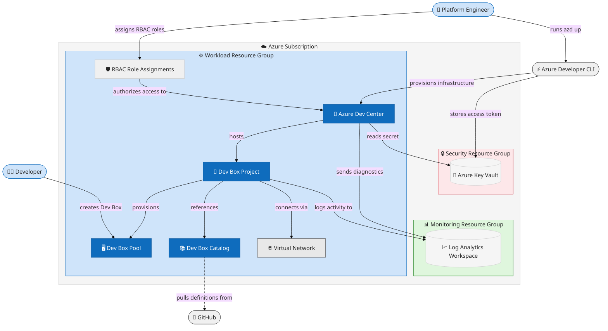

# DevExp-DevBox

[](./LICENSE)
[](https://learn.microsoft.com/en-us/azure/developer/azure-developer-cli/)
[](https://learn.microsoft.com/en-us/azure/azure-resource-manager/bicep/)
[](https://learn.microsoft.com/en-us/azure/dev-box/)

**DevExp-DevBox** is a configuration-driven accelerator that automates the
end-to-end deployment of
[Microsoft Dev Box](https://learn.microsoft.com/en-us/azure/dev-box/overview-what-is-microsoft-dev-box)
environments on Azure. It provides platform engineering teams with a repeatable,
policy-compliant foundation for delivering role-specific, cloud-hosted developer
workstations to software engineering teams across an organization.

The accelerator solves the challenge of provisioning consistent, secure, and
pre-configured developer environments at scale. Without it, teams must manually
configure Dev Centers, projects, network connections, catalogs, and RBAC
assignments — a process that is error-prone and time-consuming. DevExp-DevBox
encodes all of these decisions as version-controlled YAML configuration files
and Bicep infrastructure templates, enabling a single `azd up` command to stand
up a complete developer platform.

The technology stack combines **Azure Bicep** for infrastructure as code, the
**Azure Developer CLI (azd)** for deployment orchestration, PowerShell and Bash
setup scripts for pre-provisioning steps, and YAML configuration files that
drive the entire topology — from resource group organization and Key Vault
settings to Dev Center catalogs and Dev Box pool definitions.

## Table of Contents

- [Features](#features)
- [Architecture](#architecture)
- [Technologies Used](#technologies-used)
- [Quick Start](#quick-start)
- [Configuration](#configuration)
- [Deployment](#deployment)
- [Usage](#usage)
- [Contributing](#contributing)
- [License](#license)

## Features

- 🏢 **Automated Dev Center deployment** — provisions an Azure Dev Center with a
  system-assigned managed identity, catalog item sync, Microsoft-hosted
  networking, and Azure Monitor agent installation in a single command.
- 📁 **Multi-project support** — configures multiple Dev Box projects (for
  example, `eShop`) with role-specific pools, environment types, and catalogs
  within one deployment.
- 🖥️ **Role-based Dev Box pools** — creates `backend-engineer` and
  `frontend-engineer` pools with distinct VM SKUs and image definitions to match
  each engineering role's resource requirements.
- 🔒 **Integrated secret management** — stores GitHub Actions or Azure DevOps
  access tokens in Azure Key Vault with RBAC authorization, purge protection,
  and soft-delete retention enabled.
- 📊 **Centralized observability** — deploys a Log Analytics Workspace and
  connects Dev Center diagnostics for platform-wide monitoring.
- 🌐 **Flexible network connectivity** — supports both managed
  (Microsoft-hosted) and unmanaged (customer-owned VNet) network types on a
  per-project basis.
- 📚 **Catalog-driven customization** — integrates GitHub or Azure DevOps
  repositories as image-definition and environment-definition catalogs so teams
  manage Dev Box configurations in source control.
- 🛡️ **Least-privilege RBAC** — automatically assigns Azure built-in roles (Dev
  Box User, Deployment Environment User, Key Vault Secrets User, and others) to
  Azure AD groups at the correct resource scopes.
- ⚙️ **YAML-driven configuration** — all topology decisions are expressed in
  three structured YAML files validated against JSON Schemas, eliminating
  hard-coded values throughout the infrastructure.
- 🌍 **Multi-environment lifecycle** — supports `dev`, `staging`, and `uat`
  environment types per project, aligned with SDLC stages.

## Architecture

The diagram below shows the primary actors, Azure resources, and data flows that
make up the DevExp-DevBox platform.


```mermaid
---
config:
  description: "High-level architecture diagram showing actors, primary flows, and major components."
  theme: base
  align: center
  fontFamily: "Segoe UI, Verdana, sans-serif"
  fontSize: 16
  textColor: "#242424"
  primaryColor: "#f5f5f5"
  primaryTextColor: "#FFFFFF"
  primaryBorderColor: "#e0e0e0"
  secondaryColor: "#d1d1d1"
  secondaryTextColor: "#242424"
  secondaryBorderColor: "#d1d1d1"
  tertiaryColor: "#d1d1d1"
  tertiaryTextColor: "#424242"
  tertiaryBorderColor: "#bdbdbd"
---
flowchart TB

  %% ── External Actors & Tools ──────────────────────────────
  PE(["👤 Platform Engineer"])
  DEV(["👩‍💻 Developer"])
  GH(["🐙 GitHub"])
  AZD(["⚡ Azure Developer CLI"])

  %% ── Azure Subscription ───────────────────────────────────
  subgraph AzureSub["☁️ Azure Subscription"]

    %% Security layer
    subgraph SecurityLayer["🔒 Security Resource Group"]
      KV[("🔑 Azure Key Vault")]
    end

    %% Monitoring layer
    subgraph MonitoringLayer["📊 Monitoring Resource Group"]
      LA[("📈 Log Analytics Workspace")]
    end

    %% Workload layer
    subgraph WorkloadLayer["⚙️ Workload Resource Group"]
      DC["🏢 Azure Dev Center"]
      RBAC["🛡️ RBAC Role Assignments"]
      PROJ["📁 Dev Box Project"]
      POOL["🖥️ Dev Box Pool"]
      CAT["📚 Dev Box Catalog"]
      VNET["🌐 Virtual Network"]
    end

  end

  %% ── Interactions ─────────────────────────────────────────
  PE -->|"runs azd up"| AZD
  AZD -->|"provisions infrastructure"| DC
  AZD -->|"stores access token"| KV
  DC -->|"reads secret"| KV
  DC -->|"sends diagnostics"| LA
  PE -->|"assigns RBAC roles"| RBAC
  RBAC -->|"authorizes access to"| DC
  DC -->|"hosts"| PROJ
  PROJ -->|"provisions"| POOL
  PROJ -->|"references"| CAT
  PROJ -->|"connects via"| VNET
  PROJ -->|"logs activity to"| LA
  CAT -.->|"pulls definitions from"| GH
  DEV -->|"creates Dev Box"| POOL

  %% ── Class definitions ────────────────────────────────────
  %% colorBrandBackground2=#cfe4fa  colorBrandBackground=#0f6cbd  colorNeutralForeground1=#242424
  classDef actor fill:#cfe4fa,stroke:#0f6cbd,color:#242424
  %% colorNeutralBackground4=#f0f0f0  colorNeutralForeground3=#616161
  classDef external fill:#f0f0f0,stroke:#616161,color:#242424
  %% colorBrandBackground=#0f6cbd  colorBrandBackgroundHover=#115ea3  colorNeutralForegroundInverted=#ffffff
  classDef component fill:#0f6cbd,stroke:#115ea3,color:#ffffff
  %% colorNeutralBackground3=#f5f5f5  colorNeutralStroke1=#d1d1d1
  classDef datastore fill:#f5f5f5,stroke:#d1d1d1,color:#242424
  %% colorNeutralBackground5=#e8e8e8  colorNeutralForeground3=#616161
  classDef network fill:#e8e8e8,stroke:#616161,color:#242424
  %% colorNeutralBackground4=#f0f0f0  colorNeutralStroke1=#d1d1d1
  classDef rbac fill:#f0f0f0,stroke:#d1d1d1,color:#242424

  class PE,DEV actor
  class GH,AZD external
  class DC,PROJ,POOL,CAT component
  class KV,LA datastore
  class VNET network
  class RBAC rbac

  %% colorNeutralBackground3=#f5f5f5  colorNeutralStroke1=#d1d1d1
  style AzureSub fill:#f5f5f5,stroke:#d1d1d1,color:#242424
  %% colorPaletteRedBackground2=#fde7e9  colorPaletteRedForeground2=#c50f1f
  style SecurityLayer fill:#fde7e9,stroke:#c50f1f,color:#242424
  %% colorPaletteGreenBackground2=#dff6dd  colorPaletteGreenForeground2=#107c10
  style MonitoringLayer fill:#dff6dd,stroke:#107c10,color:#242424
  %% colorBrandBackground2=#cfe4fa  colorBrandBackground=#0f6cbd
  style WorkloadLayer fill:#cfe4fa,stroke:#0f6cbd,color:#242424
```

## Technologies Used

| Technology                                                                                               | Type                     | Purpose                                                                        |
| -------------------------------------------------------------------------------------------------------- | ------------------------ | ------------------------------------------------------------------------------ |
| [Azure Bicep](https://learn.microsoft.com/en-us/azure/azure-resource-manager/bicep/)                     | Infrastructure as Code   | Declares and deploys all Azure resources at subscription scope                 |
| [Azure Developer CLI (azd)](https://learn.microsoft.com/en-us/azure/developer/azure-developer-cli/)      | Deployment Orchestration | Orchestrates the full provision lifecycle via `azd up`                         |
| [Azure CLI (az)](https://learn.microsoft.com/en-us/cli/azure/)                                           | CLI Tool                 | Performs authentication and resource management operations                     |
| [GitHub CLI (gh)](https://cli.github.com/)                                                               | CLI Tool                 | Authenticates with GitHub and manages GitHub Actions secrets                   |
| [PowerShell 5.1+](https://learn.microsoft.com/en-us/powershell/)                                         | Scripting                | Runs `setUp.ps1` and `cleanSetUp.ps1` on Windows                               |
| [Bash](https://www.gnu.org/software/bash/)                                                               | Scripting                | Runs `setUp.sh` on Linux and macOS                                             |
| [YAML](https://yaml.org/)                                                                                | Configuration            | Drives Dev Center, security, and resource organization topology                |
| [JSON Schema](https://json-schema.org/)                                                                  | Validation               | Validates YAML configuration files at authoring time                           |
| [Azure Key Vault](https://learn.microsoft.com/en-us/azure/key-vault/)                                    | Azure Service            | Stores source control access tokens with RBAC authorization and soft-delete    |
| [Azure Log Analytics](https://learn.microsoft.com/en-us/azure/azure-monitor/logs/log-analytics-overview) | Azure Service            | Centralizes diagnostic logs from the Dev Center                                |
| [Microsoft Dev Box](https://learn.microsoft.com/en-us/azure/dev-box/)                                    | Azure Service            | Provides cloud-hosted developer workstations via Dev Center projects and pools |
| [Hugo Extended](https://gohugo.io/)                                                                      | Documentation            | Builds the project documentation site using the Docsy theme                    |

## Quick Start

### Prerequisites

| Prerequisite                                                                                                   | Minimum Version | Installation                                                                         |
| -------------------------------------------------------------------------------------------------------------- | --------------- | ------------------------------------------------------------------------------------ |
| [Azure CLI](https://learn.microsoft.com/en-us/cli/azure/install-azure-cli)                                     | 2.60.0          | `winget install Microsoft.AzureCLI`                                                  |
| [Azure Developer CLI (azd)](https://learn.microsoft.com/en-us/azure/developer/azure-developer-cli/install-azd) | 1.9.0           | `winget install Microsoft.Azd`                                                       |
| [GitHub CLI](https://cli.github.com/)                                                                          | 2.40.0          | `winget install GitHub.cli`                                                          |
| [PowerShell](https://learn.microsoft.com/en-us/powershell/scripting/install/installing-powershell)             | 5.1             | Built-in on Windows; `brew install --cask powershell` on macOS                       |
| Azure subscription                                                                                             | —               | [Create a free account](https://azure.microsoft.com/en-us/free/)                     |
| Azure AD groups                                                                                                | —               | Create `Platform Engineering Team` and project-specific groups in Microsoft Entra ID |

> [!IMPORTANT] The deploying identity requires **Owner** or **User Access
> Administrator** at the subscription scope to allow RBAC role assignments
> during provisioning.

### Installation

1. Clone the repository:

   ```bash
   git clone https://github.com/Evilazaro/DevExp-DevBox.git
   cd DevExp-DevBox
   ```

2. Authenticate with Azure and GitHub:

   ```bash
   az login
   azd auth login
   gh auth login
   ```

3. Set the required environment variables:

   ```bash
   export AZURE_ENV_NAME="dev"
   export AZURE_LOCATION="eastus2"
   export KEY_VAULT_SECRET="<your-github-or-ado-token>"
   export SOURCE_CONTROL_PLATFORM="github"   # or "adogit"
   ```

4. Deploy the entire platform:

   ```bash
   azd up
   ```

### Minimal working example

```bash
# Authenticate and deploy to a new 'dev' environment in East US 2
az login
azd auth login
gh auth login

export AZURE_ENV_NAME="dev"
export AZURE_LOCATION="eastus2"
export KEY_VAULT_SECRET="ghp_YourGitHubToken"
export SOURCE_CONTROL_PLATFORM="github"

azd up
# Expected output:
# SUCCESS: Your up workflow to provision and deploy to Azure completed in 12 minutes 34 seconds.
```

## Configuration

The platform reads its configuration from three structured YAML files located
under `infra/settings/`. Edit these files before running `azd up` to customize
the deployment.

> [!NOTE] All YAML files are validated against JSON Schemas in the same
> directory. An IDE with YAML Language Server support (for example, VS Code with
> the YAML extension) displays inline validation errors as you edit.

### Resource organization (`infra/settings/resourceOrganization/azureResources.yaml`)

| Option              | Default           | Description                                                                                             |
| ------------------- | ----------------- | ------------------------------------------------------------------------------------------------------- |
| `workload.create`   | `true`            | Creates the workload resource group when `true`                                                         |
| `workload.name`     | `devexp-workload` | Base name for the workload resource group                                                               |
| `security.create`   | `false`           | Creates a dedicated security resource group when `true`; otherwise shares the workload resource group   |
| `monitoring.create` | `false`           | Creates a dedicated monitoring resource group when `true`; otherwise shares the workload resource group |

### Security (`infra/settings/security/security.yaml`)

| Option                               | Default     | Description                                                               |
| ------------------------------------ | ----------- | ------------------------------------------------------------------------- |
| `keyVault.name`                      | `contoso`   | Prefix for the Key Vault name (a unique suffix is appended automatically) |
| `keyVault.secretName`                | `gha-token` | Name of the secret that stores the source control access token            |
| `keyVault.enablePurgeProtection`     | `true`      | Prevents permanent deletion of Key Vault secrets                          |
| `keyVault.softDeleteRetentionInDays` | `7`         | Retention period in days (7–90) for deleted secrets                       |
| `keyVault.enableRbacAuthorization`   | `true`      | Enforces RBAC-based access control on the Key Vault                       |

### Dev Center (`infra/settings/workload/devcenter.yaml`)

| Option                                 | Default                 | Description                                           |
| -------------------------------------- | ----------------------- | ----------------------------------------------------- |
| `name`                                 | `devexp`                | Name of the Azure Dev Center resource                 |
| `catalogItemSyncEnableStatus`          | `Enabled`               | Enables automatic catalog synchronization             |
| `microsoftHostedNetworkEnableStatus`   | `Enabled`               | Enables Microsoft-hosted networking for Dev Box pools |
| `installAzureMonitorAgentEnableStatus` | `Enabled`               | Installs the Azure Monitor agent on all Dev Boxes     |
| `identity.type`                        | `SystemAssigned`        | Managed identity type assigned to the Dev Center      |
| `environmentTypes[].name`              | `dev`, `staging`, `uat` | Deployment environment stages available to projects   |

**Example: Override the Dev Center name and add a custom environment type:**

```yaml
# infra/settings/workload/devcenter.yaml
name: 'mycompany-devcenter'
environmentTypes:
  - name: 'dev'
    deploymentTargetId: ''
  - name: 'qa'
    deploymentTargetId: '/subscriptions/<subscription-id>'
```

## Deployment

Follow these steps to deploy the platform to a production or staging
subscription.

1. Authenticate the deploying identity and confirm it has the required
   subscription-scope role:

   ```bash
   az login
   az account set --subscription "<your-subscription-id>"
   az role assignment list \
     --assignee "$(az ad signed-in-user show --query id -o tsv)" \
     --scope "/subscriptions/<your-subscription-id>" \
     --output table
   ```

2. Authenticate the Azure Developer CLI:

   ```bash
   azd auth login
   ```

3. Authenticate the GitHub CLI (required for GitHub catalog integration):

   ```bash
   gh auth login
   ```

4. Set the deployment environment variables:

   ```bash
   export AZURE_ENV_NAME="prod"
   export AZURE_LOCATION="eastus2"
   export KEY_VAULT_SECRET="<your-github-or-ado-token>"
   export SOURCE_CONTROL_PLATFORM="github"
   ```

5. Run the full provision and deploy workflow:

   ```bash
   azd up
   ```

6. Confirm deployment outputs after the workflow completes:

   ```bash
   azd env get-values
   ```

> [!TIP] To tear down all resources and remove credentials, run the cleanup
> script: `.\cleanSetUp.ps1` on Windows, or use equivalent `az` CLI commands on
> Linux and macOS.

> [!WARNING] Running `azd down` removes all provisioned resource groups. Back up
> any Key Vault secrets and local configuration changes before executing a
> teardown.

## Usage

### Run the setup script directly (Windows)

```powershell
.\setUp.ps1 -EnvName "dev" -SourceControl "github"
```

### Run the setup script directly (Linux and macOS)

```bash
./setUp.sh -e "dev" -s "github"
# Creates a 'dev' environment connected to GitHub source control
```

### Run the cleanup script (Windows)

```powershell
.\cleanSetUp.ps1 -EnvName "dev" -Location "eastus2"
# Expected output:
# SUCCESS: Azure subscription deployments deleted.
# SUCCESS: Role assignments removed.
# SUCCESS: Service principal deleted.
# SUCCESS: GitHub secrets removed.
# SUCCESS: Resource groups deleted.
```

### Query Dev Center deployment outputs

```bash
azd env get-values
# Expected output:
# AZURE_DEV_CENTER_NAME="devexp"
# AZURE_KEY_VAULT_NAME="contoso-<unique>-kv"
# AZURE_LOG_ANALYTICS_WORKSPACE_NAME="logAnalytics-<unique>"
# WORKLOAD_AZURE_RESOURCE_GROUP_NAME="devexp-workload-dev-eastus2-RG"
```

## Contributing

Contributions are welcome. To propose a change:

1. Open an issue describing the bug or enhancement before writing any code.
2. Fork the repository and create a feature branch from `main`.
3. Make your changes, ensuring that the Bicep templates compile
   (`az bicep build --file infra/main.bicep`) and that YAML files validate
   against their schemas.
4. Submit a pull request that references the issue and includes a clear
   description of the change and its impact.

> [!NOTE] There is no `CONTRIBUTING.md` or `CODE_OF_CONDUCT.md` file in this
> repository yet. Community guidelines will be added in a future release. In the
> meantime, follow standard open-source contribution etiquette and treat all
> contributors with respect in every interaction.

## License

This project is licensed under the **MIT License**. See the [LICENSE](./LICENSE)
file for the full license text.
