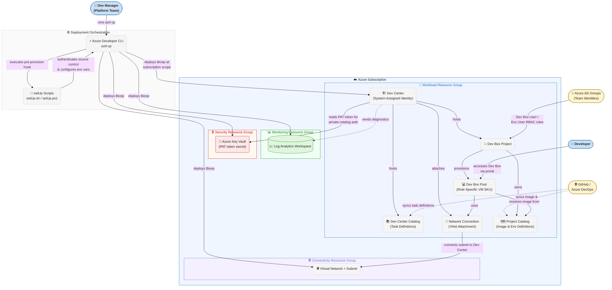

# DevExp-DevBox

[](LICENSE)
[](https://learn.microsoft.com/en-us/azure/developer/azure-developer-cli/overview)
[](https://learn.microsoft.com/en-us/azure/azure-resource-manager/bicep/overview)
[](https://learn.microsoft.com/en-us/azure/dev-box/overview-what-is-microsoft-dev-box)

## Description

**DevExp-DevBox** is a production-ready accelerator for deploying
[Microsoft Dev Box](https://learn.microsoft.com/en-us/azure/dev-box/overview-what-is-microsoft-dev-box)
environments on Azure. It automates the end-to-end provisioning of developer
workstation infrastructure—including Dev Centers, role-specific Dev Box pools,
source control catalogs, and lifecycle environment types—following Azure Landing
Zone principles and security best practices.

Platform engineering teams face significant manual overhead when standardizing
developer workstations across projects and roles. DevExp-DevBox solves this by
providing a fully automated, configuration-driven platform that provisions
consistent, secure, and observable developer environments through a single
`azd up` command, supporting both GitHub and Azure DevOps as source control
platforms.

The accelerator is built on **Azure Bicep** for infrastructure-as-code, **Azure
Developer CLI (azd)** for deployment orchestration, and YAML-based configuration
files for customizing resource organization, security settings, and Dev Center
workloads without modifying any Bicep templates.

## Table of Contents

- [Features](#features)
- [Architecture](#architecture)
- [Technologies Used](#technologies-used)
- [Quick Start](#quick-start)
- [Configuration](#configuration)
- [Deployment](#deployment)
- [Usage](#usage)
- [Contributing](#contributing)
- [License](#license)

## Features

| Feature                        | Description                                                                                                                                          |
| ------------------------------ | ---------------------------------------------------------------------------------------------------------------------------------------------------- |
| 🏗️ Dev Center Provisioning     | Deploys an Azure Dev Center with system-assigned managed identity, catalog sync, and Azure Monitor agent enabled                                     |
| 💻 Role-Specific Dev Box Pools | Creates team-targeted Dev Box pools (for example, `backend-engineer` and `frontend-engineer`) with appropriate VM SKUs per role                      |
| 📚 Catalog Integration         | Connects to GitHub-hosted Dev Center catalogs for task definitions and environment configurations                                                    |
| 🔖 Environment Types           | Provisions lifecycle environments (`dev`, `staging`, `UAT`) aligned to the software development lifecycle                                            |
| 🔑 Secrets Management          | Stores and retrieves platform credentials (for example, GitHub Access Tokens) via Azure Key Vault with RBAC authorization and soft-delete protection |
| 📊 Centralized Monitoring      | Deploys a Log Analytics Workspace with an Azure Activity Log solution for full observability                                                         |
| 🛡️ Least-Privilege RBAC        | Assigns granular Azure RBAC roles to the Dev Center, projects, and team identities following the principle of least privilege                        |
| 🌐 Network Connectivity        | Provisions Virtual Networks and Network Connections for secure, private Dev Box access                                                               |
| ⚙️ YAML-Driven Configuration   | All resource settings are externalized to YAML files — no Bicep edits are required for standard deployments                                          |
| 🚀 One-Command Deployment      | A single `azd up` command provisions all Azure resources through automated pre-provision hooks                                                       |

## Architecture

The diagram below illustrates the primary actors, components, and interaction
flows of DevExp-DevBox. Solid arrows (`-->`) represent synchronous interactions;
dashed arrows (`-.->`) represent asynchronous or event-driven interactions.


```mermaid
---
config:
  description: "High-level architecture diagram showing actors, primary flows, and major components."
  theme: base
---
flowchart TB

  %% ── External Actors ──────────────────────────────────────────────────────
  DEVMGR(["👤 Dev Manager<br/>(Platform Team)"])
  DEV(["👤 Developer"])
  GITREPO(["🌐 GitHub /<br/>Azure DevOps"])
  AADGRP(["🔵 Azure AD Groups<br/>(Team Identities)"])

  %% ── Deployment Orchestration ─────────────────────────────────────────────
  subgraph ORCH["⚙️ Deployment Orchestration"]
    AZD("⚡ Azure Developer CLI<br/>azd up")
    SCRIPTS("📜 setUp Scripts<br/>setUp.sh / setUp.ps1")
  end

  %% ── Azure Subscription (subscription-scope Bicep deployment) ─────────────
  subgraph AZURE["☁️ Azure Subscription"]

    %% Monitoring Landing Zone
    subgraph MONRG["📊 Monitoring Resource Group"]
      LA[("📈 Log Analytics Workspace")]
    end

    %% Security Landing Zone
    subgraph SECRG["🔒 Security Resource Group"]
      KV("🔑 Azure Key Vault<br/>(PAT token secret)")
    end

    %% Workload Landing Zone
    subgraph WKRG["🏢 Workload Resource Group"]
      DCC("🏗️ Dev Center<br/>(System-Assigned Identity)")
      DCCCAT("📚 Dev Center Catalog<br/>(Task Definitions)")
      NETCONN("🔌 Network Connection<br/>(VNet Attachment)")
      PROJ("📁 Dev Box Project")
      PROJCAT("🗺️ Project Catalog<br/>(Image & Env Definitions)")
      POOL("💻 Dev Box Pool<br/>(Role-Specific VM SKU)")
    end

    %% Connectivity Landing Zone
    subgraph CONNRG["🌐 Connectivity Resource Group"]
      VNET("🌐 Virtual Network + Subnet")
    end

  end

  %% ── Interactions ──────────────────────────────────────────────────────────
  DEVMGR -->|"runs azd up"| AZD
  AZD -->|"executes pre-provision hook"| SCRIPTS
  SCRIPTS -->|"authenticates source control<br/>& configures env vars"| AZD
  AZD -->|"deploys Bicep at<br/>subscription scope"| DCC
  AZD -->|"deploys Bicep"| KV
  AZD -->|"deploys Bicep"| LA
  AZD -->|"deploys Bicep"| VNET
  DCC -->|"hosts"| DCCCAT
  DCC -->|"attaches"| NETCONN
  DCC -.->|"sends diagnostics"| LA
  DCC -->|"reads PAT token for<br/>private catalog auth"| KV
  NETCONN -->|"connects subnet to Dev Center"| VNET
  GITREPO -.->|"syncs task definitions"| DCCCAT
  GITREPO -.->|"syncs image &<br/>env definitions"| PROJCAT
  DCC -->|"hosts"| PROJ
  PROJ -->|"owns"| PROJCAT
  PROJ -->|"provisions"| POOL
  POOL -->|"resolves image from"| PROJCAT
  POOL -->|"uses"| NETCONN
  AADGRP -->|"Dev Box User /<br/>Env User RBAC roles"| PROJ
  DEV -->|"accesses Dev Box<br/>via portal"| POOL

  %% ── Class Definitions ─────────────────────────────────────────────────────
  classDef actor fill:#cce0f5,stroke:#0f6cbd,color:#242424,font-weight:bold
  classDef external fill:#fff4ce,stroke:#a18109,color:#242424
  classDef service fill:#f5f5f5,stroke:#d1d1d1,color:#242424
  classDef datastore fill:#dff6dd,stroke:#107c10,color:#242424
  classDef security fill:#fde7e9,stroke:#c50f1f,color:#242424

  class DEVMGR,DEV actor
  class GITREPO,AADGRP external
  class DCC,DCCCAT,NETCONN,PROJ,PROJCAT,POOL,VNET,AZD,SCRIPTS service
  class LA datastore
  class KV security

  style ORCH fill:#fafafa,stroke:#d1d1d1,color:#242424
  style AZURE fill:#f0f6ff,stroke:#0f6cbd,color:#242424
  style MONRG fill:#f0fff4,stroke:#107c10,color:#107c10
  style SECRG fill:#fff8f0,stroke:#c50f1f,color:#c50f1f
  style WKRG fill:#f0f4ff,stroke:#0f6cbd,color:#0f6cbd
  style CONNRG fill:#f5f0ff,stroke:#6b69d6,color:#6b69d6
```

## Technologies Used

| Technology                                                                                                         | Type                     | Purpose                                                                             |
| ------------------------------------------------------------------------------------------------------------------ | ------------------------ | ----------------------------------------------------------------------------------- |
| [Azure Bicep](https://learn.microsoft.com/en-us/azure/azure-resource-manager/bicep/overview)                       | Infrastructure-as-Code   | Defines all Azure resources declaratively across modular `.bicep` files             |
| [Azure Developer CLI (azd)](https://learn.microsoft.com/en-us/azure/developer/azure-developer-cli/overview)        | Deployment Orchestration | Orchestrates provisioning lifecycle via `azure.yaml` hooks                          |
| [PowerShell](https://learn.microsoft.com/en-us/powershell/scripting/overview)                                      | Scripting (Windows)      | Pre-provision environment setup (`setUp.ps1`) and teardown (`cleanSetUp.ps1`)       |
| [Bash](https://www.gnu.org/software/bash/)                                                                         | Scripting (Linux/macOS)  | Pre-provision environment setup (`setUp.sh`)                                        |
| [YAML](https://yaml.org/)                                                                                          | Configuration            | Externalizes Dev Center, security, and resource organization settings               |
| [Azure Dev Center](https://learn.microsoft.com/en-us/azure/dev-box/overview-what-is-microsoft-dev-box)             | Platform Service         | Hosts Dev Box projects, pools, catalogs, and environment types                      |
| [Azure Key Vault](https://learn.microsoft.com/en-us/azure/key-vault/general/overview)                              | Security Service         | Stores and retrieves platform secrets with RBAC authorization                       |
| [Azure Log Analytics](https://learn.microsoft.com/en-us/azure/azure-monitor/logs/log-analytics-workspace-overview) | Monitoring Service       | Centralizes log aggregation and activity monitoring across all resources            |
| [Azure Virtual Network](https://learn.microsoft.com/en-us/azure/virtual-network/virtual-networks-overview)         | Networking               | Provides private connectivity for Dev Box access                                    |
| [GitHub / Azure DevOps](https://github.com)                                                                        | Source Control           | Hosts catalog task definitions; provides authentication tokens for platform secrets |

## Quick Start

### Prerequisites

| Tool                                                                                                           | Purpose                                                                   | Installation                          |
| -------------------------------------------------------------------------------------------------------------- | ------------------------------------------------------------------------- | ------------------------------------- |
| [Azure CLI](https://learn.microsoft.com/en-us/cli/azure/install-azure-cli)                                     | Authenticate and manage Azure resources                                   | `winget install Microsoft.AzureCLI`   |
| [Azure Developer CLI (azd)](https://learn.microsoft.com/en-us/azure/developer/azure-developer-cli/install-azd) | Run `azd up` to provision infrastructure                                  | `winget install Microsoft.Azd`        |
| [GitHub CLI](https://cli.github.com/)                                                                          | Authenticate with GitHub (required when `SOURCE_CONTROL_PLATFORM=github`) | `winget install GitHub.cli`           |
| [PowerShell 7+](https://learn.microsoft.com/en-us/powershell/scripting/install/installing-powershell)          | Execute setup scripts on Windows                                          | `winget install Microsoft.PowerShell` |

> [!NOTE] On Linux and macOS, the setup script (`setUp.sh`) runs automatically.
> On Windows, `setUp.ps1` is used. Both require Bash or PowerShell 7+
> respectively.

### Installation Steps

1. Clone the repository:

```bash
git clone https://github.com/Evilazaro/DevExp-DevBox.git
cd DevExp-DevBox
```

2. Authenticate with Azure:

```bash
az login
azd auth login
```

3. Authenticate with your source control platform:

```bash
# For GitHub
gh auth login

# For Azure DevOps — ensure you have a valid Personal Access Token ready
```

4. Set the required environment variables:

```bash
export AZURE_ENV_NAME="dev"
export AZURE_LOCATION="eastus2"
export KEY_VAULT_SECRET="<your-platform-access-token>"
export SOURCE_CONTROL_PLATFORM="github"   # Use "adogit" for Azure DevOps
```

5. Provision all Azure resources with a single command:

```bash
azd up
```

### Minimal Working Example

```bash
AZURE_ENV_NAME="contoso-dev" \
AZURE_LOCATION="eastus2" \
KEY_VAULT_SECRET="ghp_yourtoken" \
SOURCE_CONTROL_PLATFORM="github" \
azd up
```

Expected output:

```text
SUCCESS: Your up workflow to provision and deploy to Azure completed in 12 minutes 34 seconds.
```

> [!TIP] Use `azd env list` to manage multiple environments (for example, `dev`,
> `staging`, and `prod`) from the same repository without duplicating
> configuration files.

## Configuration

All configuration is externalized in YAML files under `infra/settings/`. Edit
these files to customize resource names, tags, and feature flags without
modifying any Bicep template.

| Option                                 | File                                       | Default           | Description                                             |
| -------------------------------------- | ------------------------------------------ | ----------------- | ------------------------------------------------------- |
| `workload.name`                        | `resourceOrganization/azureResources.yaml` | `devexp-workload` | Name of the workload resource group                     |
| `workload.create`                      | `resourceOrganization/azureResources.yaml` | `true`            | Whether to create the workload resource group           |
| `security.create`                      | `resourceOrganization/azureResources.yaml` | `false`           | Whether to create a dedicated security resource group   |
| `monitoring.create`                    | `resourceOrganization/azureResources.yaml` | `false`           | Whether to create a dedicated monitoring resource group |
| `keyVault.name`                        | `security/security.yaml`                   | `contoso`         | Base name for the Azure Key Vault instance              |
| `keyVault.enablePurgeProtection`       | `security/security.yaml`                   | `true`            | Prevents permanent deletion of Key Vault secrets        |
| `keyVault.softDeleteRetentionInDays`   | `security/security.yaml`                   | `7`               | Retention period for deleted secrets (7–90 days)        |
| `devCenter.name`                       | `workload/devcenter.yaml`                  | `devexp`          | Name of the Azure Dev Center instance                   |
| `catalogItemSyncEnableStatus`          | `workload/devcenter.yaml`                  | `Enabled`         | Enables automatic catalog item synchronization          |
| `installAzureMonitorAgentEnableStatus` | `workload/devcenter.yaml`                  | `Enabled`         | Installs the Azure Monitor agent on Dev Boxes           |

> [!IMPORTANT] The `KEY_VAULT_SECRET` environment variable must contain a valid
> GitHub Access Token or Azure DevOps Personal Access Token before running
> `azd up`. The token is stored in Azure Key Vault under the secret name
> `gha-token`.

### Example: Override the Dev Center Name

Edit `infra/settings/workload/devcenter.yaml`:

```yaml
name: 'my-devcenter'
catalogItemSyncEnableStatus: 'Enabled'
microsoftHostedNetworkEnableStatus: 'Enabled'
installAzureMonitorAgentEnableStatus: 'Enabled'
```

## Deployment

> [!WARNING] You must have **Owner** or **Contributor** and **User Access
> Administrator** roles on the target Azure subscription before deploying. The
> deployment creates resource groups and assigns RBAC roles at the subscription
> scope.

Follow these steps to deploy DevExp-DevBox to a production or staging
environment:

1. Review and update `infra/settings/resourceOrganization/azureResources.yaml`
   to set resource group names, tags, and landing zone configuration for your
   organization.

2. Review and update `infra/settings/workload/devcenter.yaml` to configure the
   Dev Center name, projects, Dev Box pools, environment types, and Azure AD
   group IDs for your teams.

3. Review and update `infra/settings/security/security.yaml` to configure the
   Key Vault name, soft-delete retention period, and purge protection settings.

4. Set the required environment variables for the target environment:

```bash
export AZURE_ENV_NAME="prod"
export AZURE_LOCATION="eastus2"
export KEY_VAULT_SECRET="<your-platform-access-token>"
export SOURCE_CONTROL_PLATFORM="github"
```

5. Run the deployment:

```bash
azd up
```

6. Verify the deployment outputs:

```bash
azd env get-values
```

Expected output:

```text
AZURE_DEV_CENTER_NAME="devexp"
WORKLOAD_AZURE_RESOURCE_GROUP_NAME="devexp-workload-prod-eastus2-RG"
AZURE_LOG_ANALYTICS_WORKSPACE_NAME="logAnalytics-<unique-suffix>"
SECURITY_AZURE_RESOURCE_GROUP_NAME="devexp-workload-prod-eastus2-RG"
```

7. To tear down all deployed resources and remove credentials, run the cleanup
   script:

```powershell
# Windows
.\cleanSetUp.ps1 -EnvName "prod" -Location "eastus2"
```

```bash
# Linux / macOS — use Azure CLI directly
azd down --force --purge
```

> [!CAUTION] Running `azd down --purge` permanently deletes the Azure Key Vault
> and all secrets it contains. Ensure you have backed up any required tokens
> before running this command.

## Usage

### Access a Dev Box

After deployment completes, members of the team Azure AD groups (for example,
`eShop Engineers`) can sign in to their Dev Box through the
[Microsoft Dev Box portal](https://devbox.microsoft.com/).

Verify that the Dev Center deployed successfully:

```bash
az devcenter admin devcenter list \
  --query "[].{Name:name, ProvisioningState:provisioningState}" \
  --output table
```

Expected output:

```text
Name      ProvisioningState
--------  ------------------
devexp    Succeeded
```

### List Dev Box Pools

Use the Azure CLI to inspect available Dev Box pools in a project:

```bash
az devcenter admin pool list \
  --dev-center-name devexp \
  --project-name eShop \
  --resource-group devexp-workload-dev-eastus2-RG \
  --query "[].{Pool:name, Sku:skuName}" \
  --output table
```

Expected output:

```text
Pool                Sku
------------------  --------------------------------
backend-engineer    general_i_32c128gb512ssd_v2
frontend-engineer   general_i_16c64gb256ssd_v2
```

### Add a New Project

To add a new project, append a new entry to the `projects` array in
`infra/settings/workload/devcenter.yaml`:

```yaml
projects:
  - name: 'my-new-project'
    description: 'My new project description.'
    network:
      name: my-new-project
      create: true
      resourceGroupName: 'my-project-connectivity-RG'
      virtualNetworkType: Managed
      addressPrefixes:
        - 10.1.0.0/16
      subnets:
        - name: my-project-subnet
          properties:
            addressPrefix: 10.1.1.0/24
      tags:
        environment: dev
        team: MyTeam
    identity:
      type: SystemAssigned
      roleAssignments:
        - azureADGroupId: '<your-azure-ad-group-id>'
          azureADGroupName: 'My Team Engineers'
          azureRBACRoles:
            - name: 'Dev Box User'
              id: '45d50f46-0b78-4001-a660-4198cbe8cd05'
              scope: Project
    pools:
      - name: 'developer'
        imageDefinitionName: 'my-project-dev'
        vmSku: general_i_16c64gb256ssd_v2
    environmentTypes:
      - name: 'dev'
        deploymentTargetId: ''
```

Then re-run `azd up` to apply the changes.

## Contributing

Contributions are welcome. To contribute to DevExp-DevBox:

1. Fork the repository on GitHub.
2. Create a feature branch:

```bash
git checkout -b feature/your-feature-name
```

3. Commit your changes with a clear message:

```bash
git commit -m "feat: add support for custom image definitions"
```

4. Push the branch to your fork:

```bash
git push origin feature/your-feature-name
```

5. Open a pull request against the `main` branch of
   [Evilazaro/DevExp-DevBox](https://github.com/Evilazaro/DevExp-DevBox) with a
   description of your changes and the problem they solve.

To report a bug or request a new feature,
[open an issue](https://github.com/Evilazaro/DevExp-DevBox/issues) with a clear
description and steps to reproduce.

> [!NOTE] The repository does not currently include a `CONTRIBUTING.md` or
> `CODE_OF_CONDUCT.md`. Contributions and feedback on adding these files are
> also welcome.

## License

This project is licensed under the **MIT License**. See [LICENSE](LICENSE) for
the full license text.
