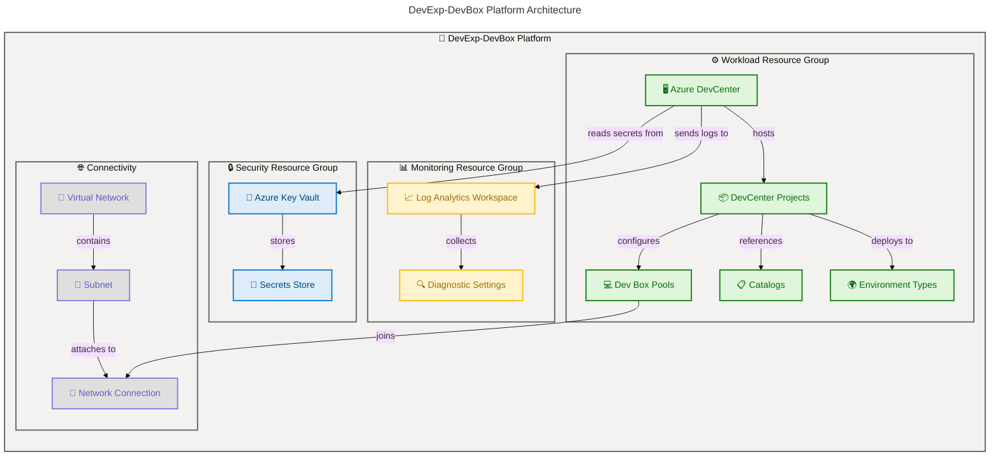

# DevExp-DevBox


A production-ready Azure landing zone accelerator that automates the deployment
of Microsoft Dev Box environments, enabling platform engineering teams to
provision secure, governed developer workstations with a single command.

**Overview**

Organizations adopting Microsoft Dev Box face significant complexity when
configuring DevCenter resources, network connectivity, identity management, and
security controls across multiple projects and teams. This accelerator
eliminates that friction by providing a fully parameterized, modular Bicep
infrastructure-as-code solution that follows Azure Landing Zone principles and
the Cloud Adoption Framework.

The accelerator deploys a complete developer experience platform comprising
Azure DevCenter with project-scoped Dev Box pools, Azure Key Vault for secrets
management, Log Analytics for centralized monitoring, and configurable virtual
network connectivity. All resources are organized into purpose-built resource
groups (Workload, Security, Monitoring) with consistent tagging, RBAC role
assignments based on least-privilege principles, and YAML-driven configuration
that separates environment-specific settings from infrastructure definitions.

## 📑 Table of Contents

- [Architecture](#-architecture)
- [Features](#-features)
- [Prerequisites](#-prerequisites)
- [Quick Start](#-quick-start)
- [Deployment](#-deployment)
- [Usage](#-usage)
- [Configuration](#-configuration)
- [Project Structure](#project-structure)
- [Contributing](#-contributing)
- [License](#-license)

## 🏗️ Architecture

**Overview**

The accelerator follows Azure Landing Zone principles to separate concerns
across three functional resource groups, ensuring that security, monitoring, and
workload resources are independently manageable and governed. This pattern
enables platform teams to apply distinct RBAC policies, cost tracking, and
compliance controls per functional boundary.

Components are orchestrated through a subscription-scoped Bicep deployment that
creates resource groups, provisions infrastructure modules in dependency order,
and wires cross-resource-group references such as Log Analytics workspace IDs
and Key Vault secret identifiers. The YAML-driven configuration layer decouples
environment-specific settings from the infrastructure templates, enabling
consistent deployments across dev, staging, and production environments.


```mermaid
---
title: "DevExp-DevBox Platform Architecture"
config:
  theme: base
  look: classic
  layout: dagre
  flowchart:
    htmlLabels: true
---
flowchart TB
    accTitle: DevExp-DevBox Platform Architecture
    accDescr: Shows the three-tier landing zone architecture with Security, Monitoring, and Workload resource groups and their component relationships

    %% AZURE / FLUENT v1.1 — see governance block above
    %% PHASE 1 - STRUCTURAL: Direction explicit, flat topology, nesting ≤ 3
    %% PHASE 2 - SEMANTIC: Colors justified, max 5 semantic classes, neutral-first
    %% PHASE 3 - FONT: Dark text on light backgrounds, contrast ≥ 4.5:1
    %% PHASE 4 - ACCESSIBILITY: accTitle/accDescr present, icons on all nodes
    %% PHASE 5 - STANDARD: Governance block present, classDefs centralized
    %% ═══════════════════════════════════════════════════════════════════════════

    subgraph platform["🏢 DevExp-DevBox Platform"]
        direction TB

        subgraph securityRG["🔒 Security Resource Group"]
            direction LR
            kv["🔑 Azure Key Vault"]:::core
            secrets["🔐 Secrets Store"]:::core
            kv -->|"stores"| secrets
        end

        subgraph monitoringRG["📊 Monitoring Resource Group"]
            direction LR
            la["📈 Log Analytics Workspace"]:::warning
            diag["🔍 Diagnostic Settings"]:::warning
            la -->|"collects"| diag
        end

        subgraph workloadRG["⚙️ Workload Resource Group"]
            direction TB
            dc["🖥️ Azure DevCenter"]:::success
            proj["📦 DevCenter Projects"]:::success
            pools["💻 Dev Box Pools"]:::success
            cat["📋 Catalogs"]:::success
            envTypes["🌍 Environment Types"]:::success

            dc -->|"hosts"| proj
            proj -->|"configures"| pools
            proj -->|"references"| cat
            proj -->|"deploys to"| envTypes
        end

        subgraph connectivityRG["🌐 Connectivity"]
            direction LR
            vnet["🔗 Virtual Network"]:::data
            subnet["📍 Subnet"]:::data
            netconn["🔌 Network Connection"]:::data
            vnet -->|"contains"| subnet
            subnet -->|"attaches to"| netconn
        end

        dc -->|"reads secrets from"| kv
        dc -->|"sends logs to"| la
        pools -->|"joins"| netconn
    end

    style platform fill:#F3F2F1,stroke:#605E5C,stroke-width:2px
    style securityRG fill:#F3F2F1,stroke:#605E5C,stroke-width:2px
    style monitoringRG fill:#F3F2F1,stroke:#605E5C,stroke-width:2px
    style workloadRG fill:#F3F2F1,stroke:#605E5C,stroke-width:2px
    style connectivityRG fill:#F3F2F1,stroke:#605E5C,stroke-width:2px

    classDef core fill:#DEECF9,stroke:#0078D4,stroke-width:2px,color:#004578
    classDef success fill:#DFF6DD,stroke:#107C10,stroke-width:2px,color:#0B6A0B
    classDef warning fill:#FFF4CE,stroke:#FFB900,stroke-width:2px,color:#986F0B
    classDef data fill:#E1DFDD,stroke:#8378DE,stroke-width:2px,color:#5B5FC7
```

**Component Roles:**

| Component                 | Purpose                                                                         | Resource Group |
| ------------------------- | ------------------------------------------------------------------------------- | -------------- |
| 🔑 **Azure Key Vault**    | Stores GitHub tokens and secrets with RBAC authorization and purge protection   | Security       |
| 📈 **Log Analytics**      | Centralized monitoring with diagnostic settings for all deployed resources      | Monitoring     |
| 🖥️ **Azure DevCenter**    | Core platform for managing Dev Box definitions, catalogs, and environment types | Workload       |
| 📦 **DevCenter Projects** | Team-scoped workspaces with identity, pools, and environment configurations     | Workload       |
| 💻 **Dev Box Pools**      | Role-specific virtual machine configurations (backend, frontend engineers)      | Workload       |
| 🔗 **Virtual Network**    | Network connectivity for unmanaged network scenarios with subnet isolation      | Connectivity   |

## ✨ Features

**Overview**

This accelerator delivers a turnkey developer experience platform that reduces
the time to provision governed Dev Box environments from weeks of manual
configuration to minutes of automated deployment. Every feature is designed
around the principle of configuration-as-code, enabling platform teams to
version, review, and audit infrastructure changes through standard Git
workflows.

Features span the complete platform lifecycle from initial provisioning through
day-two operations, including secrets management, network connectivity,
monitoring, and multi-project governance with role-based access controls that
follow Microsoft's recommended organizational roles and responsibilities.

| Feature                          | Description                                                                                                                                                  |
| -------------------------------- | ------------------------------------------------------------------------------------------------------------------------------------------------------------ |
| 🚀 **One-Command Deployment**    | Deploy the entire landing zone with `azd up`, orchestrating resource groups, Key Vault, Log Analytics, DevCenter, and projects in dependency order           |
| 🔒 **Enterprise Security**       | Key Vault with RBAC authorization, purge protection, soft delete, and managed identity integration for zero-credential DevCenter operations                  |
| 📊 **Centralized Monitoring**    | Log Analytics workspace with diagnostic settings collecting logs and metrics from all deployed resources including Key Vault and virtual networks            |
| ⚙️ **YAML-Driven Configuration** | Separate infrastructure definitions from environment settings using validated YAML files with JSON Schema for DevCenter, security, and resource organization |
| 🌐 **Flexible Networking**       | Support for both managed and unmanaged virtual network topologies with configurable address spaces, subnets, and DevCenter network connections               |
| 🔑 **RBAC Governance**           | Least-privilege role assignments for DevCenter, projects, and Key Vault based on Microsoft's organizational roles guidance (Dev Managers, Developers)        |
| 📦 **Multi-Project Support**     | Configure multiple DevCenter projects with independent pools, catalogs, environment types, and identity assignments from a single configuration file         |
| 🧩 **Modular Bicep Templates**   | Composable infrastructure modules for security, monitoring, connectivity, identity, and workload resources that can be reused and extended independently     |

## 📋 Prerequisites

**Overview**

Before deploying the accelerator, you need an Azure subscription with sufficient
permissions and a set of command-line tools installed on your workstation. These
prerequisites ensure that the setup scripts can authenticate, provision
resources, and configure source control integration without manual intervention.

Meeting these requirements enables the automated setup flow to handle Azure
authentication, environment initialization, GitHub token retrieval, and Bicep
template deployment end-to-end. Missing any prerequisite will cause the setup
scripts to fail with an actionable error message indicating the missing
dependency.

> [!IMPORTANT] You must have **Owner** or **Contributor + User Access
> Administrator** permissions on your Azure subscription to deploy this
> accelerator, as it creates resource groups, role assignments, and managed
> identities at the subscription scope.

| Prerequisite                        | Version | Purpose                                                                             |
| ----------------------------------- | ------- | ----------------------------------------------------------------------------------- |
| ☁️ **Azure Subscription**           | Active  | Target subscription for resource deployment with Owner or Contributor permissions   |
| 🛠️ **Azure CLI**                    | >= 2.50 | Authentication and Azure resource management (`az login`, `az account set`)         |
| 📦 **Azure Developer CLI (azd)**    | >= 1.0  | Environment management, provisioning hooks, and Bicep deployment orchestration      |
| 💻 **GitHub CLI**                   | >= 2.0  | GitHub authentication and token retrieval for DevCenter catalog access              |
| 🐧 **Bash**                         | >= 4.0  | Required for `setUp.sh` on Linux/macOS; PowerShell 5.1+ for `setUp.ps1` on Windows  |
| 🔑 **GitHub Personal Access Token** | —       | Repository access for DevCenter catalogs (retrieved automatically by setup scripts) |

> [!TIP] On Windows, use `setUp.ps1` with PowerShell 5.1+. On Linux/macOS, use
> `setUp.sh` with Bash 4.0+. Both scripts perform identical operations with
> platform-appropriate tooling.

## 🚀 Quick Start

**Overview**

Get the accelerator running in your Azure subscription in three steps: clone the
repository, authenticate with Azure and GitHub, then run the setup script. The
script handles environment initialization, secret retrieval, and Bicep
deployment automatically.

**Step 1: Clone the repository**

```bash
git clone https://github.com/Evilazaro/DevExp-DevBox.git
cd DevExp-DevBox
```

**Expected output:**

```text
Cloning into 'DevExp-DevBox'...
remote: Enumerating objects: done.
remote: Counting objects: 100% done.
Receiving objects: 100% done.
```

**Step 2: Authenticate with Azure and GitHub**

```bash
az login
azd auth login
gh auth login
```

**Expected output:**

```text
A web browser has been opened at https://login.microsoftonline.com/...
You have logged in successfully.
Logged in to Azure Developer CLI.
✓ Authentication complete.
```

**Step 3: Run the setup script (Linux/macOS)**

```bash
./setUp.sh -e "dev" -s "github"
```

**Expected output:**

```text
✅ Prerequisites validated
✅ Azure authentication confirmed
✅ GitHub CLI authenticated
✅ Environment 'dev' initialized
✅ Provisioning complete
```

**Step 3 (alternative): Run the setup script (Windows)**

```powershell
.\setUp.ps1 -EnvName "dev" -SourceControl "github"
```

**Expected output:**

```text
✅ Prerequisites validated
✅ Azure authentication confirmed
✅ GitHub CLI authenticated
✅ Environment 'dev' initialized
✅ Provisioning complete
```

## 📦 Deployment

**Overview**

The deployment process uses Azure Developer CLI (`azd`) to orchestrate the Bicep
template deployment at the subscription scope. The setup scripts handle
environment initialization, source control authentication, and secret injection
before invoking `azd provision` to deploy all resources.

> [!WARNING] Deployment creates Azure resources that incur costs. Dev Box pools
> with allocated VMs will generate compute charges. Review the `devcenter.yaml`
> configuration to understand which VM SKUs and pool sizes are being provisioned
> before deploying to production.

**Step 1: Initialize the Azure Developer CLI environment**

```bash
azd init -e "dev"
```

**Expected output:**

```text
Initializing an app to run on Azure (azd init)
  (✓) Done: Initialized environment 'dev'

SUCCESS: Your app is ready for the cloud!
```

**Step 2: Set the target Azure location**

```bash
azd env set AZURE_LOCATION "eastus2"
```

**Expected output:** _(no output on success)_

**Step 3: Provision Azure resources**

```bash
azd provision
```

**Expected output:**

```json
{
  "AZURE_DEV_CENTER_NAME": "devexp-devcenter",
  "AZURE_KEY_VAULT_NAME": "contoso-xxxxx-kv",
  "AZURE_LOG_ANALYTICS_WORKSPACE_NAME": "logAnalytics-xxxxx",
  "SECURITY_AZURE_RESOURCE_GROUP_NAME": "devexp-security-dev-eastus2-RG",
  "MONITORING_AZURE_RESOURCE_GROUP_NAME": "devexp-monitoring-dev-eastus2-RG",
  "WORKLOAD_AZURE_RESOURCE_GROUP_NAME": "devexp-workload-dev-eastus2-RG"
}
```

**Step 4: Verify deployment**

```bash
az resource list --resource-group "devexp-workload-dev-eastus2-RG" --output table
```

**Expected output:**

```text
Name                Type                                     Location
------------------  ---------------------------------------  --------
devexp-devcenter    Microsoft.DevCenter/devcenters           eastus2
eShop               Microsoft.DevCenter/projects             eastus2
```

**Cleanup: Remove all deployed resources**

```powershell
.\cleanSetUp.ps1 -EnvName "dev" -Location "eastus2"
```

**Expected output:**

```text
Retrieving subscription deployments...
Deleting deployment: main...
Removing role assignments...
Cleaning up resource groups...
✅ Cleanup complete
```

## 💻 Usage

**Overview**

After deployment, platform administrators configure Dev Box environments through
the YAML configuration files, while developers access their provisioned Dev
Boxes through the Azure portal or the Dev Home app. This section covers common
operational tasks for both personas.

**Add a new DevCenter project**

Edit `infra/settings/workload/devcenter.yaml` to add a project entry under the
`projects` array:

```yaml
projects:
  - name: 'contoso-api'
    description: 'Contoso API backend project'
    network:
      name: contoso-api
      create: true
      resourceGroupName: 'contoso-api-connectivity-RG'
      virtualNetworkType: Managed
    pools:
      - name: 'api-engineer'
        imageDefinitionName: 'contoso-api-engineer'
        vmSku: general_i_16c64gb256ssd_v2
    environmentTypes:
      - name: 'dev'
        deploymentTargetId: ''
```

**Expected output:** _(YAML file updated — redeploy to apply changes)_

**Redeploy after configuration changes**

```bash
azd provision
```

**Expected output:**

```text
Provisioning Azure resources (azd provision)
(✓) Done: Resource group: devexp-workload-dev-eastus2-RG
(✓) Done: DevCenter project: contoso-api

SUCCESS: Your application was provisioned in Azure.
```

**View deployed DevCenter projects**

```bash
az devcenter admin project list --dev-center-name "devexp-devcenter" --resource-group "devexp-workload-dev-eastus2-RG" --output table
```

**Expected output:**

```text
Name          Location    DevCenterUri
------------  ----------  ------------------------------------------
eShop         eastus2     https://xxxxx.devcenter.azure.com/projects/eShop
contoso-api   eastus2     https://xxxxx.devcenter.azure.com/projects/contoso-api
```

## ⚙️ Configuration

**Overview**

The accelerator uses a layered YAML configuration system that separates
infrastructure organization, security settings, and workload definitions into
independent, schema-validated files. This design enables platform teams to
modify environment-specific parameters without touching Bicep templates, and to
validate configuration changes against JSON Schema before deployment.

Each configuration file has a corresponding JSON Schema that provides
IntelliSense in VS Code and can be used for pre-deployment validation. Changes
to configuration files take effect on the next `azd provision` run, and the
Bicep templates consume these files at deployment time using the
`loadYamlContent()` function.

> [!NOTE] All configuration files are located under `infra/settings/`. Modify
> these YAML files to customize your deployment. The Bicep templates consume
> them at deployment time using `loadYamlContent()`.

| Configuration File                                           | Purpose                                                                                  | Schema                       |
| ------------------------------------------------------------ | ---------------------------------------------------------------------------------------- | ---------------------------- |
| 📁 `infra/settings/workload/devcenter.yaml`                  | DevCenter name, catalogs, environment types, projects, pools, and RBAC                   | `devcenter.schema.json`      |
| 🔒 `infra/settings/security/security.yaml`                   | Key Vault name, purge protection, soft delete, RBAC authorization settings               | `security.schema.json`       |
| 🌍 `infra/settings/resourceOrganization/azureResources.yaml` | Resource group names, creation flags, and tagging for workload, security, and monitoring | `azureResources.schema.json` |
| ⚙️ `infra/main.parameters.json`                              | Azure Developer CLI parameters: environment name, location, and Key Vault secret value   | Azure ARM schema             |

**Key Configuration Parameters:**

| Parameter                             | File                   | Description                                       | Default                      |
| ------------------------------------- | ---------------------- | ------------------------------------------------- | ---------------------------- |
| ⚙️ `name`                             | `devcenter.yaml`       | DevCenter instance name                           | `devexp-devcenter`           |
| 🔒 `keyVault.name`                    | `security.yaml`        | Key Vault base name (appended with unique suffix) | `contoso`                    |
| 🌍 `location`                         | `main.parameters.json` | Azure region for deployment                       | Set via `AZURE_LOCATION`     |
| 📦 `projects[].pools[].vmSku`         | `devcenter.yaml`       | VM size for Dev Box pools                         | `general_i_16c64gb256ssd_v2` |
| 🔑 `keyVault.enableRbacAuthorization` | `security.yaml`        | Use Azure RBAC instead of access policies         | `true`                       |
| 📊 `monitoring.create`                | `azureResources.yaml`  | Whether to create the monitoring resource group   | `true`                       |

**Supported Azure Regions:**

| Region                  | Identifier           |
| ----------------------- | -------------------- |
| 🌍 East US              | `eastus`             |
| 🌍 East US 2            | `eastus2`            |
| 🌍 West US              | `westus`             |
| 🌍 West US 2            | `westus2`            |
| 🌍 West US 3            | `westus3`            |
| 🌍 Central US           | `centralus`          |
| 🌍 North Europe         | `northeurope`        |
| 🌍 West Europe          | `westeurope`         |
| 🌍 Southeast Asia       | `southeastasia`      |
| 🌍 Australia East       | `australiaeast`      |
| 🌍 Japan East           | `japaneast`          |
| 🌍 UK South             | `uksouth`            |
| 🌍 Canada Central       | `canadacentral`      |
| 🌍 Sweden Central       | `swedencentral`      |
| 🌍 Switzerland North    | `switzerlandnorth`   |
| 🌍 Germany West Central | `germanywestcentral` |

## Project Structure

```text
DevExp-DevBox/
├── azure.yaml                  # Azure Developer CLI config (Linux/macOS)
├── azure-pwh.yaml              # Azure Developer CLI config (Windows)
├── setUp.sh                    # Setup script for Linux/macOS
├── setUp.ps1                   # Setup script for Windows
├── cleanSetUp.ps1              # Cleanup script for removing all resources
├── CONTRIBUTING.md             # Contribution guidelines
├── LICENSE                     # MIT License
├── infra/
│   ├── main.bicep              # Subscription-scoped entry point
│   ├── main.parameters.json    # Deployment parameters
│   └── settings/
│       ├── resourceOrganization/
│       │   ├── azureResources.yaml       # Resource group definitions
│       │   └── azureResources.schema.json
│       ├── security/
│       │   ├── security.yaml             # Key Vault configuration
│       │   └── security.schema.json
│       └── workload/
│           ├── devcenter.yaml            # DevCenter configuration
│           └── devcenter.schema.json
└── src/
    ├── connectivity/           # VNet, subnet, and network connection modules
    ├── identity/               # RBAC role assignment modules
    ├── management/             # Log Analytics workspace module
    ├── security/               # Key Vault and secrets modules
    └── workload/
        ├── workload.bicep      # Workload orchestrator
        ├── core/               # DevCenter core resources
        └── project/            # Project, pool, and catalog modules
```

## 🤝 Contributing

**Overview**

Contributions to this accelerator follow a structured, product-oriented delivery
model where work is organized into Epics (measurable outcomes), Features
(testable deliverables), and Tasks (verifiable units of work). This hierarchy
ensures that every contribution aligns with a clear capability goal and can be
independently validated.

The project uses GitHub Issues with custom templates for each work item type,
enforces branch naming conventions, and requires PR-linked issue references.
Infrastructure changes must be parameterized, idempotent, and validated with
`what-if` or sandbox deployments before merging.

> [!CAUTION] All Bicep modules must be parameterized with no hard-coded
> environment values, idempotent for safe re-runs, and must not embed secrets in
> code or parameters. See the engineering standards in `CONTRIBUTING.md` for the
> full requirements.

Please read [CONTRIBUTING.md](CONTRIBUTING.md) for detailed guidelines
including:

- Issue management with required labels (type, area, priority, status)
- Branch naming conventions (`feature/`, `task/`, `fix/`, `docs/`)
- Pull request requirements (issue reference, summary, test evidence)
- Engineering standards for Bicep, PowerShell, and documentation
- Definition of Done for Tasks, Features, and Epics

## 📄 License

This project is licensed under the MIT License. See [LICENSE](LICENSE) for
details.
