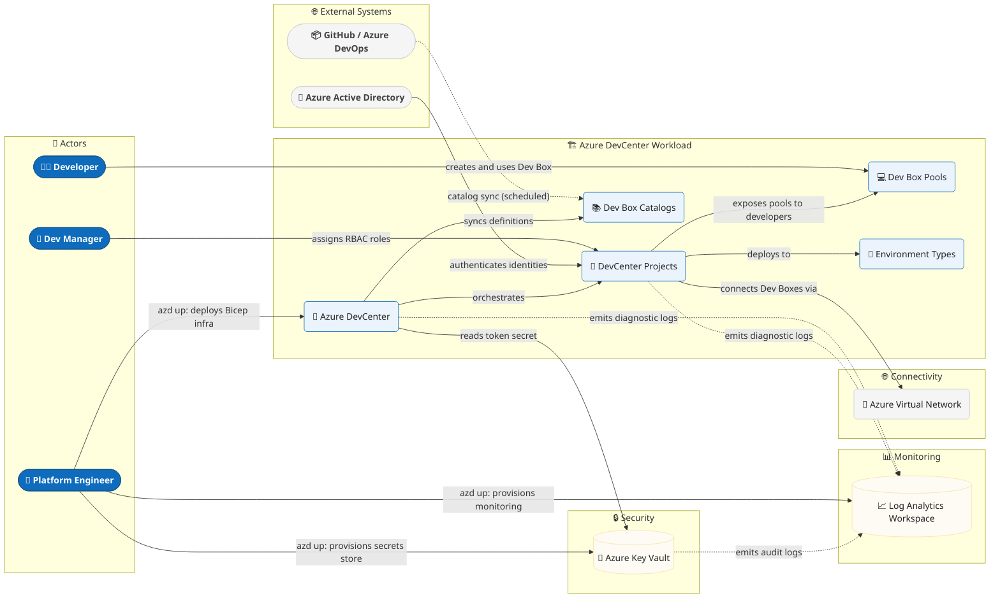

# DevExp-DevBox

[](LICENSE)
[](https://learn.microsoft.com/en-us/azure/developer/azure-developer-cli/)
[](https://learn.microsoft.com/en-us/azure/azure-resource-manager/bicep/)
[](https://azure.microsoft.com/)

**DevExp-DevBox** is an Azure Developer CLI (`azd`) accelerator that automates
the end-to-end deployment of
[Microsoft Dev Box](https://learn.microsoft.com/en-us/azure/dev-box/overview-what-is-microsoft-dev-box)
infrastructure on Azure. It provisions an Azure DevCenter with fully configured
projects, Dev Box pools, catalogs, environment types, and all supporting
security and monitoring resources — all from a single `azd up` command.

Managing developer workstations at scale is operationally complex: engineers
across teams need consistent, role-specific development environments, secure
access to credentials, and reliable connectivity without manual setup overhead.
This accelerator solves that problem by providing a **declarative,
configuration-as-code** approach to define and deploy developer environments
across multiple projects and teams, with built-in RBAC, secrets management, and
observability.

The solution is built on **Azure Bicep** for infrastructure-as-code and the
**Azure Developer CLI** for deployment lifecycle management. It integrates
**Azure Key Vault**, **Log Analytics Workspace**, and **Azure Virtual Networks**
to deliver production-grade security, monitoring, and connectivity. YAML-driven
configuration files allow teams to customize Dev Box projects, pools, catalogs,
and environment types without modifying any Bicep templates.

## Table of Contents

- [Features](#features)
- [Architecture](#architecture)
- [Technologies Used](#technologies-used)
- [Quick Start](#quick-start)
- [Configuration](#configuration)
- [Deployment](#deployment)
- [Usage](#usage)
- [Contributing](#contributing)
- [License](#license)

## Features

- 🏗️ **One-command deployment** — provision the full Dev Box platform with
  `azd up`
- 📁 **Multi-project support** — define multiple DevCenter projects for isolated
  team workspaces
- 💻 **Role-specific Dev Box pools** — configure pools with role-tailored VM
  SKUs and images (backend, frontend, and more)
- 📚 **Catalog integration** — sync task and image definitions from GitHub or
  Azure DevOps repositories
- 🌱 **Environment types** — define separate deployment environments (dev,
  staging, uat) per project
- 🔑 **Centralized secrets management** — securely store GitHub or Azure DevOps
  access tokens in Azure Key Vault
- 📊 **Integrated monitoring** — all resources emit diagnostic logs to a
  centralized Log Analytics Workspace
- 🌐 **Flexible networking** — support for Microsoft-hosted (Managed) and
  customer-owned (Unmanaged) virtual networks
- 🔐 **Least-privilege RBAC** — pre-configured role assignments for Dev
  Managers, Dev Box Users, and Deployment Environment Users
- 🖥️ **Cross-platform setup** — automated setup scripts for Windows (PowerShell)
  and Linux/macOS (Bash)
- ⚙️ **YAML-driven configuration** — customize all resources declaratively
  without modifying Bicep templates

## Architecture

**DevExp-DevBox** is a Microsoft Dev Box platform accelerator whose primary
purpose is to provision and manage centralized developer workstation
infrastructure on Azure. Three distinct actor groups interact with the system:
**Platform Engineers** who deploy infrastructure using `azd up`; **Dev
Managers** who configure project pools and role assignments; and **Developers**
who create and use Dev Boxes within their assigned project. Externally, **GitHub
or Azure DevOps** repositories serve as catalog sources for Dev Box image and
task definitions, and **Azure Active Directory** provides identity and RBAC
enforcement. Internally, **Azure DevCenter** acts as the central orchestration
hub, hosting **DevCenter Projects** that group team-specific **Dev Box Pools**,
**Catalogs**, and **Environment Types**. **Azure Key Vault** stores platform
secrets, **Log Analytics Workspace** provides unified observability, and **Azure
Virtual Network** delivers network connectivity for Dev Boxes.


```mermaid
---
config:
  primaryColor: "#0f6cbd"
  primaryTextColor: "#FFFFFF"
  primaryBorderColor: "#0f548c"
  secondaryColor: "#ebf3fc"
  secondaryTextColor: "#242424"
  secondaryBorderColor: "#0f6cbd"
  tertiaryColor: "#f5f5f5"
  tertiaryTextColor: "#424242"
  tertiaryBorderColor: "#d1d1d1"
  noteBkgColor: "#fefbf4"
  noteTextColor: "#242424"
  noteBorderColor: "#f9e2ae"
  lineColor: "#616161"
  background: "#FFFFFF"
  edgeLabelBackground: "#FFFFFF"
  clusterBkg: "#fafafa"
  clusterBorder: "#e0e0e0"
  titleColor: "#242424"
  errorBkgColor: "#fdf3f4"
  errorTextColor: "#b10e1c"
  fontFamily: "Segoe UI, Verdana, sans-serif"
  fontSize: 16
  align: center
  description: "High-level architecture diagram showing actors, primary flows, and major components."
---
flowchart LR

%% ── Actors ──────────────────────────────────────────────────────────────────
subgraph Actors["👥 Actors"]
    PlatEng(["👤 Platform Engineer"])
    DevMgr(["👤 Dev Manager"])
    DevUser(["👨‍💻 Developer"])
end

%% ── External Systems ─────────────────────────────────────────────────────────
subgraph ExtSys["🌐 External Systems"]
    GitRepo(["📦 GitHub / Azure DevOps"])
    AAD(["🔐 Azure Active Directory"])
end

%% ── Azure DevCenter Workload ─────────────────────────────────────────────────
subgraph Workload["🏗️ Azure DevCenter Workload"]
    DevCtr("🏢 Azure DevCenter")
    Projects("📁 DevCenter Projects")
    Pools("💻 Dev Box Pools")
    Catalogs("📚 Dev Box Catalogs")
    EnvTypes("🌱 Environment Types")
end

%% ── Security ─────────────────────────────────────────────────────────────────
subgraph Security["🔒 Security"]
    KV[("🔑 Azure Key Vault")]
end

%% ── Monitoring ───────────────────────────────────────────────────────────────
subgraph Monitoring["📊 Monitoring"]
    LA[("📈 Log Analytics Workspace")]
end

%% ── Connectivity ─────────────────────────────────────────────────────────────
subgraph Connectivity["🌐 Connectivity"]
    VNet("🔌 Azure Virtual Network")
end

%% ── Interactions: Platform Engineer ─────────────────────────────────────────
PlatEng -->|"azd up: deploys Bicep infra"| DevCtr
PlatEng -->|"azd up: provisions secrets store"| KV
PlatEng -->|"azd up: provisions monitoring"| LA

%% ── Interactions: Dev Manager ────────────────────────────────────────────────
DevMgr -->|"assigns RBAC roles"| Projects

%% ── Interactions: Developer ──────────────────────────────────────────────────
DevUser -->|"creates and uses Dev Box"| Pools

%% ── Interactions: External Systems ──────────────────────────────────────────
GitRepo -.->|"catalog sync (scheduled)"| Catalogs
AAD -->|"authenticates identities"| Projects

%% ── Interactions: Internal Components ───────────────────────────────────────
DevCtr -->|"orchestrates"| Projects
DevCtr -->|"reads token secret"| KV
DevCtr -->|"syncs definitions"| Catalogs
Projects -->|"exposes pools to developers"| Pools
Projects -->|"deploys to"| EnvTypes
Projects -->|"connects Dev Boxes via"| VNet

%% ── Interactions: Observability ──────────────────────────────────────────────
DevCtr -.->|"emits diagnostic logs"| LA
Projects -.->|"emits diagnostic logs"| LA
KV -.->|"emits audit logs"| LA

%% ── Class Definitions ────────────────────────────────────────────────────────
classDef actor fill:#0f6cbd,stroke:#0f548c,color:#FFFFFF,font-weight:bold
classDef external fill:#f5f5f5,stroke:#d1d1d1,color:#424242,font-weight:bold
classDef workload fill:#ebf3fc,stroke:#0f6cbd,color:#242424
classDef datastore fill:#fefbf4,stroke:#f9e2ae,color:#242424
classDef connectivity fill:#f5f5f5,stroke:#d1d1d1,color:#242424

class PlatEng,DevMgr,DevUser actor
class GitRepo,AAD external
class DevCtr,Projects,Pools,Catalogs,EnvTypes workload
class KV,LA datastore
class VNet connectivity
```

## Technologies Used

| Technology                                                                                                   | Type                 | Purpose                                                |
| ------------------------------------------------------------------------------------------------------------ | -------------------- | ------------------------------------------------------ |
| [Azure Developer CLI (azd)](https://learn.microsoft.com/en-us/azure/developer/azure-developer-cli/)          | Deployment Tool      | Environment provisioning and full lifecycle management |
| [Azure Bicep](https://learn.microsoft.com/en-us/azure/azure-resource-manager/bicep/)                         | IaC Language         | Declarative Azure resource definition and deployment   |
| [Azure DevCenter](https://learn.microsoft.com/en-us/azure/dev-box/concept-dev-box-architecture)              | Azure Service        | Centralized developer workstation management hub       |
| [Microsoft Dev Box](https://learn.microsoft.com/en-us/azure/dev-box/overview-what-is-microsoft-dev-box)      | Azure Service        | Cloud-hosted developer workstations (Dev Boxes)        |
| [Azure Key Vault](https://learn.microsoft.com/en-us/azure/key-vault/general/overview)                        | Azure Service        | Secure storage for secrets and access tokens           |
| [Log Analytics Workspace](https://learn.microsoft.com/en-us/azure/azure-monitor/logs/log-analytics-overview) | Azure Service        | Centralized monitoring, diagnostics, and audit logs    |
| [Azure Virtual Network](https://learn.microsoft.com/en-us/azure/virtual-network/virtual-networks-overview)   | Azure Service        | Network isolation and connectivity for Dev Boxes       |
| [Azure Active Directory](https://learn.microsoft.com/en-us/azure/active-directory/fundamentals/whatis)       | Identity Service     | Authentication and role-based access control           |
| [PowerShell](https://learn.microsoft.com/en-us/powershell/scripting/overview)                                | Scripting Language   | Windows environment setup automation                   |
| [Bash](https://www.gnu.org/software/bash/)                                                                   | Scripting Language   | Linux/macOS environment setup automation               |
| [YAML](https://yaml.org/)                                                                                    | Configuration Format | Declarative resource configuration for all components  |

## Quick Start

### Prerequisites

| Prerequisite                                                                                                   | Version         | Purpose                                                    |
| -------------------------------------------------------------------------------------------------------------- | --------------- | ---------------------------------------------------------- |
| [Azure CLI](https://learn.microsoft.com/en-us/cli/azure/install-azure-cli)                                     | 2.60.0 or later | Azure resource management and authentication               |
| [Azure Developer CLI (azd)](https://learn.microsoft.com/en-us/azure/developer/azure-developer-cli/install-azd) | 1.9.0 or later  | Environment provisioning and deployment                    |
| [GitHub CLI (gh)](https://cli.github.com/)                                                                     | 2.0 or later    | GitHub authentication (when using `github` source control) |
| Azure subscription                                                                                             | —               | Target subscription for deploying resources                |

> [!NOTE] The GitHub CLI (`gh`) is required only when `SOURCE_CONTROL_PLATFORM`
> is set to `github` (the default). When using Azure DevOps, install and
> authenticate via the Azure CLI instead.

### Installation

1. Clone the repository:

   ```bash
   git clone https://github.com/Evilazaro/DevExp-DevBox.git
   cd DevExp-DevBox
   ```

2. Log in to Azure and initialize the environment:

   ```bash
   azd auth login
   azd env new <your-environment-name>
   ```

3. Set the required environment variables:

   ```bash
   azd env set AZURE_LOCATION eastus
   azd env set KEY_VAULT_SECRET <your-github-or-ado-token>
   # Optional: default is 'github'
   azd env set SOURCE_CONTROL_PLATFORM github
   ```

4. Deploy the full platform:

   ```bash
   azd up
   ```

   Expected output:

   ```
   SUCCESS: Your up workflow to provision and deploy to Azure completed in X minutes Y seconds.

   Outputs:
   AZURE_DEV_CENTER_NAME        = devexp
   AZURE_DEV_CENTER_PROJECTS    = ["eShop"]
   AZURE_KEY_VAULT_NAME         = contoso-<suffix>
   AZURE_LOG_ANALYTICS_WORKSPACE_NAME = logAnalytics-<suffix>
   ```

## Configuration

The accelerator is configured through three YAML files in `infra/settings/` and
environment variables set via `azd env set`.

### Environment Variables

| Option                    | Default      | Description                                                                |
| ------------------------- | ------------ | -------------------------------------------------------------------------- |
| `AZURE_ENV_NAME`          | _(required)_ | Name of the Azure environment (for example, `dev`, `test`, `prod`)         |
| `AZURE_LOCATION`          | _(required)_ | Azure region for resource deployment (for example, `eastus`, `westeurope`) |
| `KEY_VAULT_SECRET`        | _(required)_ | GitHub Personal Access Token or Azure DevOps PAT stored in Key Vault       |
| `SOURCE_CONTROL_PLATFORM` | `github`     | Source control platform for catalog authentication: `github` or `adogit`   |

### Configuration Files

| File                                                      | Purpose                                                                |
| --------------------------------------------------------- | ---------------------------------------------------------------------- |
| `infra/settings/workload/devcenter.yaml`                  | DevCenter name, projects, pools, catalogs, environment types, and RBAC |
| `infra/settings/security/security.yaml`                   | Key Vault name, soft-delete, RBAC authorization, and secret settings   |
| `infra/settings/resourceOrganization/azureResources.yaml` | Resource group names, creation flags, and Azure tags per landing zone  |

Example: override the DevCenter name and add a project in
`infra/settings/workload/devcenter.yaml`:

```yaml
name: 'my-devcenter'

projects:
  - name: 'my-team'
    description: 'My team project.'
    network:
      virtualNetworkType: Managed
    pools:
      - name: 'backend-engineer'
        imageDefinitionName: 'my-backend-image'
        vmSku: general_i_32c128gb512ssd_v2
    environmentTypes:
      - name: 'dev'
        deploymentTargetId: ''
```

> [!IMPORTANT] Keep `KEY_VAULT_SECRET` out of all committed files. Always supply
> it via `azd env set` or a CI/CD secret variable, never hard-code it in YAML or
> Bicep parameter files.

## Deployment

Follow these steps to deploy the Dev Box platform to an Azure subscription.

1. **Install prerequisites** listed in
   [Quick Start — Prerequisites](#prerequisites).

2. **Authenticate to Azure**:

   ```bash
   azd auth login
   az login
   ```

3. **Create and configure the azd environment**:

   ```bash
   azd env new <environment-name>
   azd env set AZURE_LOCATION <azure-region>
   azd env set KEY_VAULT_SECRET <your-pat-token>
   azd env set SOURCE_CONTROL_PLATFORM github   # or adogit
   ```

4. **Review the configuration files** in `infra/settings/` and adjust project
   names, pool SKUs, catalog URIs, and RBAC group IDs to match your
   organization.

5. **Run the deployment**:

   ```bash
   azd up
   ```

   The `preprovision` hook automatically runs `setUp.sh` (Linux/macOS) or
   `setUp.ps1` (Windows) to validate prerequisites and configure the environment
   before Bicep is deployed.

6. **Verify the outputs** in the terminal. Key outputs include:

   | Output                               | Description                          |
   | ------------------------------------ | ------------------------------------ |
   | `AZURE_DEV_CENTER_NAME`              | Name of the deployed Azure DevCenter |
   | `AZURE_DEV_CENTER_PROJECTS`          | Array of deployed project names      |
   | `AZURE_KEY_VAULT_NAME`               | Name of the Azure Key Vault          |
   | `AZURE_KEY_VAULT_ENDPOINT`           | URI of the Key Vault                 |
   | `AZURE_LOG_ANALYTICS_WORKSPACE_NAME` | Name of the Log Analytics Workspace  |

7. **Tear down the environment** when no longer needed:

   ```bash
   azd down
   ```

> [!WARNING] Running `azd down` removes all provisioned resources, including the
> Key Vault and its secrets. If `enablePurgeProtection` is set to `true` in
> `security.yaml`, the Key Vault enters a soft-deleted state and cannot be
> permanently deleted until the retention period expires.

## Usage

After a successful `azd up` deployment, the Dev Box platform is operational. The
following examples show how each actor interacts with the system.

### Access the Developer Portal (Developer)

Developers access their Dev Boxes through the Microsoft Dev Box portal:

```
https://aka.ms/devbox
```

1. Sign in with your Azure Active Directory account.
2. Select your assigned project (for example, **eShop**).
3. Create a Dev Box from an available pool (for example, `backend-engineer` or
   `frontend-engineer`).
4. Connect to the Dev Box via browser or the Windows App.

### Manage Projects and Pools (Dev Manager)

Dev Managers can list all projects and pools in the DevCenter using the Azure
CLI:

```bash
# List all projects in the DevCenter
az devcenter admin project list \
  --dev-center-name <AZURE_DEV_CENTER_NAME> \
  --resource-group <WORKLOAD_RESOURCE_GROUP>

# List all pools in a project
az devcenter admin pool list \
  --project-name eShop \
  --resource-group <WORKLOAD_RESOURCE_GROUP>
```

Expected output:

```json
[
  {
    "name": "backend-engineer-0-pool",
    "provisioningState": "Succeeded",
    "devBoxDefinitionName": "~Catalog~customTasks~eshop-backend-dev"
  },
  {
    "name": "frontend-engineer-1-pool",
    "provisioningState": "Succeeded",
    "devBoxDefinitionName": "~Catalog~customTasks~eshop-frontend-dev"
  }
]
```

### Query Monitoring Logs (Platform Engineer)

Use Log Analytics to query diagnostic data from the DevCenter and Key Vault:

```kusto
// DevCenter operations in the last 24 hours
AzureDiagnostics
| where ResourceType == "DEVCENTERS"
| where TimeGenerated > ago(24h)
| summarize count() by OperationName, ResultType
| order by count_ desc
```

> [!TIP] The Log Analytics Workspace name is available in the
> `AZURE_LOG_ANALYTICS_WORKSPACE_NAME` azd output. Use it to navigate directly
> to the workspace in the Azure portal.

## Contributing

Contributions are welcome! To get started:

1. **Report an issue** — open an issue on the
   [GitHub Issues page](https://github.com/Evilazaro/DevExp-DevBox/issues) and
   describe the bug or feature request with as much detail as possible.

2. **Fork and branch** — fork the repository and create a feature branch from
   `main`:

   ```bash
   git checkout -b feature/your-feature-name
   ```

3. **Make your changes** — follow the existing YAML configuration patterns and
   Bicep module conventions. Ensure all `@description` decorators are populated
   on new parameters and outputs.

4. **Test your changes** — run `azd up` against a dedicated test subscription to
   verify your changes provision successfully before submitting a pull request.

5. **Open a pull request** — submit your pull request against the `main` branch
   with a clear description of the changes and any relevant issue references.

> [!NOTE] By contributing to this repository, you agree that your contributions
> will be licensed under the same [MIT License](LICENSE) that covers the
> project.

## License

This project is licensed under the **MIT License**. See the [LICENSE](LICENSE)
file for the full license text.
