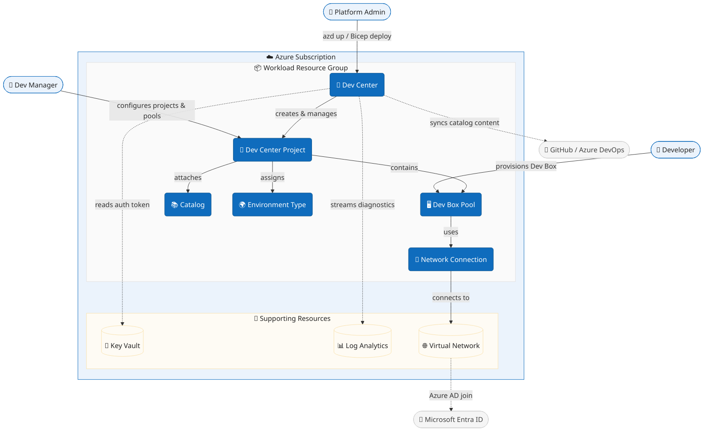

# ContosoDevExp — Microsoft Dev Box Accelerator


## Description

**ContosoDevExp** is an Azure Developer CLI (`azd`) accelerator that automates
the end-to-end provisioning of a Microsoft Dev Box environment on Azure. It
deploys a fully configured Dev Center together with projects, pools, network
connectivity, security resources, and monitoring—enabling platform engineering
teams to deliver standardized, cloud-hosted developer workstations at scale.

The accelerator solves the problem of manual, error-prone configuration of
Microsoft Dev Box infrastructure. By encoding all Dev Center settings, project
definitions, pool configurations, and network connections in declarative YAML
files and Bicep templates, it eliminates configuration drift and reduces
provisioning time from hours to minutes.

The project is built on **Bicep** for infrastructure as code, Azure Developer
CLI for environment lifecycle management, PowerShell and Bash for cross-platform
setup automation, and YAML for human-readable configuration—making it accessible
to teams on any operating system.

## Table of Contents

- [Features](#features)
- [Architecture](#architecture)
- [Technologies Used](#technologies-used)
- [Quick Start](#quick-start)
- [Configuration](#configuration)
- [Deployment](#deployment)
- [Usage](#usage)
- [Contributing](#contributing)
- [License](#license)

## Features

- 🏢 **Automated Dev Center provisioning** — deploys a fully configured Azure
  Dev Center with system-assigned managed identity and Azure Monitor agent
- 📁 **Multi-project support** — provisions multiple Dev Center projects (e.g.,
  `eShop`) with individual catalogs, pools, and environment types
- 🖥️ **Role-specific Dev Box pools** — configures pools for backend engineers
  and frontend engineers with tailored VM SKUs and image definitions
- 🌐 **Flexible network connectivity** — supports both Microsoft-hosted networks
  and custom Azure Virtual Networks with Azure AD (Entra ID) join
- 🔑 **Secure secrets management** — stores source control tokens (GitHub or
  Azure DevOps) in Azure Key Vault with RBAC authorization and soft-delete
  protection
- 📊 **Integrated observability** — connects all resources to a Log Analytics
  workspace for centralized diagnostics and activity logs
- 📚 **Catalog synchronization** — attaches GitHub or Azure DevOps repositories
  as Dev Center catalogs with scheduled content sync for image definitions and
  environment definitions
- ⚙️ **Configuration-as-code** — all Dev Center, security, and resource
  organization settings managed via YAML files under `infra/settings/`
- 🔒 **Azure Landing Zone alignment** — organizes resources into workload,
  security, and monitoring resource groups following Azure Cloud Adoption
  Framework principles
- 🤖 **Cross-platform automation** — preprovision hooks execute on Linux/macOS
  via `setUp.sh` and on Windows via `setUp.ps1`

## Architecture

### Architecture Summary

ContosoDevExp provisions a Microsoft Dev Box platform on Azure, enabling
developers to self-serve cloud-hosted developer workstations. Three actor types
interact with the system: a **Platform Admin** who deploys the accelerator using
`azd up`, a **Dev Manager** who configures Dev Center projects and pools, and a
**Developer** who provisions and uses Dev Box instances. Internally, the Dev
Center acts as the central hub, orchestrating project and pool management,
catalog synchronization with GitHub or Azure DevOps, secret retrieval from Azure
Key Vault, diagnostic streaming to Log Analytics, and network connectivity
through Azure Virtual Networks with Entra ID join.


```mermaid
---
config:
  primaryColor: "#0f6cbd"
  primaryTextColor: "#FFFFFF"
  primaryBorderColor: "#0f548c"
  secondaryColor: "#ebf3fc"
  secondaryTextColor: "#242424"
  secondaryBorderColor: "#0f6cbd"
  tertiaryColor: "#f5f5f5"
  tertiaryTextColor: "#424242"
  tertiaryBorderColor: "#d1d1d1"
  noteBkgColor: "#fefbf4"
  noteTextColor: "#242424"
  noteBorderColor: "#f9e2ae"
  lineColor: "#616161"
  background: "#FFFFFF"
  edgeLabelBackground: "#FFFFFF"
  clusterBkg: "#fafafa"
  clusterBorder: "#e0e0e0"
  titleColor: "#242424"
  errorBkgColor: "#fdf3f4"
  errorTextColor: "#b10e1c"
  fontFamily: "Segoe UI, Verdana, sans-serif"
  fontSize: 16
  align: center
  description: "High-level architecture diagram showing actors, primary flows, and major components."
---
flowchart TB

%% ── Actors ──────────────────────────────────────────────────────────────────
PlatformAdmin(["👤 Platform Admin"])
Developer(["👤 Developer"])
DevManager(["👤 Dev Manager"])

%% ── External Systems ────────────────────────────────────────────────────────
GitHub(["🐙 GitHub / Azure DevOps"])
EntraID(["🔐 Microsoft Entra ID"])

%% ── Azure Subscription ──────────────────────────────────────────────────────
subgraph AzureSub["☁️ Azure Subscription"]

  subgraph WorkloadRG["📦 Workload Resource Group"]
    DevCenter("🏢 Dev Center")
    Project("📁 Dev Center Project")
    Pool("🖥️ Dev Box Pool")
    Catalog("📚 Catalog")
    EnvType("🌍 Environment Type")
    NetConn("🔌 Network Connection")
  end

  subgraph SupportRG["🔧 Supporting Resources"]
    KeyVault[("🔑 Key Vault")]
    LogAnalytics[("📊 Log Analytics")]
    VNet[("🌐 Virtual Network")]
  end

end

%% ── Actor Flows ──────────────────────────────────────────────────────────────
PlatformAdmin -->|"azd up / Bicep deploy"| DevCenter
DevManager -->|"configures projects & pools"| Project
Developer -->|"provisions Dev Box"| Pool

%% ── Internal Service Flows ───────────────────────────────────────────────────
DevCenter -->|"creates & manages"| Project
Project -->|"contains"| Pool
Project -->|"attaches"| Catalog
Project -->|"assigns"| EnvType
Pool -->|"uses"| NetConn
NetConn -->|"connects to"| VNet

%% ── Async / Event-Driven Flows ───────────────────────────────────────────────
DevCenter -.->|"syncs catalog content"| GitHub
DevCenter -.->|"reads auth token"| KeyVault
DevCenter -.->|"streams diagnostics"| LogAnalytics
VNet -.->|"Azure AD join"| EntraID

%% ── Node Styles ──────────────────────────────────────────────────────────────
classDef actorClass fill:#ebf3fc,stroke:#0f6cbd,color:#242424
classDef externalClass fill:#f5f5f5,stroke:#d1d1d1,color:#424242
classDef serviceClass fill:#0f6cbd,stroke:#0f548c,color:#ffffff
classDef datastoreClass fill:#fefbf4,stroke:#f9e2ae,color:#242424

class PlatformAdmin,Developer,DevManager actorClass
class GitHub,EntraID externalClass
class DevCenter,Project,Pool,Catalog,EnvType,NetConn serviceClass
class KeyVault,LogAnalytics,VNet datastoreClass

%% ── Subgraph Styles ──────────────────────────────────────────────────────────
classDef azureSubClass fill:#ebf3fc,stroke:#0f6cbd,color:#242424
classDef rgClass fill:#fafafa,stroke:#e0e0e0,color:#242424
classDef supportClass fill:#fefbf4,stroke:#f9e2ae,color:#242424

class AzureSub azureSubClass
class WorkloadRG rgClass
class SupportRG supportClass
```

### Gate Results

| Gate                           | Result | Notes                                                                                                       |
| ------------------------------ | ------ | ----------------------------------------------------------------------------------------------------------- |
| Gate 0 — Architecture Intent   | PASSED | Three human actors present; Developer→Pool flow traces to Dev Box provisioning outcome.                     |
| Gate 1 — Constraint Compliance | PASSED | All 19 positive constraints satisfied; no negative constraints violated.                                    |
| Gate 2 — Evaluation Criteria   | PASSED | All 8 criteria pass: actors, goal traceability, coverage, labeling, shape/style, color, syntax, node limit. |
| Gate 3 — Styling Compliance    | PASSED | Config block contains all theming variables; all hex values traced to Fluent UI v9 tokens.                  |

## Technologies Used

| Technology                                                                                                 | Type                   | Purpose                                                                           |
| ---------------------------------------------------------------------------------------------------------- | ---------------------- | --------------------------------------------------------------------------------- |
| [Bicep](https://learn.microsoft.com/en-us/azure/azure-resource-manager/bicep/overview)                     | Infrastructure as Code | Declares all Azure resources (Dev Center, Key Vault, VNet, Log Analytics)         |
| [Azure Developer CLI (azd)](https://learn.microsoft.com/en-us/azure/developer/azure-developer-cli/)        | Deployment tooling     | Manages the full environment provisioning lifecycle                               |
| YAML                                                                                                       | Configuration          | Parameterizes Dev Center projects, pools, catalogs, and resource organization     |
| PowerShell                                                                                                 | Automation             | Windows-based preprovision scripting (`setUp.ps1`)                                |
| Bash                                                                                                       | Automation             | Linux/macOS preprovision scripting (`setUp.sh`)                                   |
| [Azure Dev Center](https://learn.microsoft.com/en-us/azure/dev-box/overview-what-is-microsoft-dev-box)     | Azure PaaS             | Provides the developer experience platform, project management, and Dev Box pools |
| [Azure Key Vault](https://learn.microsoft.com/en-us/azure/key-vault/general/basic-concepts)                | Azure PaaS             | Secures source control access tokens with RBAC authorization and soft-delete      |
| [Azure Virtual Network](https://learn.microsoft.com/en-us/azure/virtual-network/virtual-networks-overview) | Azure Networking       | Provides network connectivity for Dev Box instances                               |
| [Azure Log Analytics](https://learn.microsoft.com/en-us/azure/azure-monitor/logs/log-analytics-overview)   | Azure Monitoring       | Centralizes diagnostics, metrics, and activity logs                               |
| [Microsoft Entra ID](https://learn.microsoft.com/en-us/entra/fundamentals/whatis)                          | Identity               | Azure AD join for Dev Box domain authentication                                   |
| [Hugo (extended)](https://gohugo.io/)                                                                      | Documentation          | Static site generator for the project documentation site                          |
| Node.js / npm                                                                                              | Build tooling          | Manages Hugo dependencies and documentation build                                 |

## Quick Start

### Prerequisites

| Prerequisite                                                                                                   | Minimum Version | Notes                                          |
| -------------------------------------------------------------------------------------------------------------- | --------------- | ---------------------------------------------- |
| [Azure CLI](https://learn.microsoft.com/en-us/cli/azure/install-azure-cli)                                     | 2.x             | Required for Azure authentication              |
| [Azure Developer CLI (azd)](https://learn.microsoft.com/en-us/azure/developer/azure-developer-cli/install-azd) | 1.x             | Required for provisioning                      |
| [GitHub CLI (gh)](https://cli.github.com/)                                                                     | 2.x             | Required when `SOURCE_CONTROL_PLATFORM=github` |
| Bash or PowerShell                                                                                             | —               | Linux/macOS: Bash; Windows: PowerShell 5.1+    |
| [jq](https://jqlang.github.io/jq/)                                                                             | 1.6+            | Required by `setUp.sh` on Linux/macOS          |

### Installation

1. Clone the repository:

```bash
git clone https://github.com/Evilazaro/DevExp-DevBox.git
cd DevExp-DevBox
```

2. Log in to Azure:

```bash
az login
azd auth login
```

3. (GitHub only) Authenticate the GitHub CLI:

```bash
gh auth login
```

4. Run the accelerator:

```bash
azd up
```

When prompted, supply:

- **Environment name** — a short identifier (2–10 characters) such as `dev`
- **Azure region** — for example, `eastus`
- **Key Vault secret** — a GitHub or Azure DevOps personal access token

### Minimal Working Example

```bash
# Set the source control platform before provisioning
export SOURCE_CONTROL_PLATFORM=github        # Linux/macOS
# $env:SOURCE_CONTROL_PLATFORM = "github"   # Windows PowerShell

# Initialize the environment and provision all resources
azd env new dev
azd env set AZURE_LOCATION eastus
azd env set KEY_VAULT_SECRET <your-personal-access-token>
azd up
```

> [!NOTE] `azd up` automatically runs `setUp.sh` (Linux/macOS) or `setUp.ps1`
> (Windows) as a preprovision hook before deploying any Bicep templates.

## Configuration

All configuration is stored in `infra/settings/` as human-readable YAML files.
Edit these files before running `azd up` to customize the deployment.

| Option                    | File                                                      | Default           | Description                                                               |
| ------------------------- | --------------------------------------------------------- | ----------------- | ------------------------------------------------------------------------- |
| `AZURE_ENV_NAME`          | `infra/main.parameters.json`                              | _(required)_      | Short environment name for resource naming, 2–10 characters (e.g., `dev`) |
| `AZURE_LOCATION`          | `infra/main.parameters.json`                              | _(required)_      | Azure region for all resources (e.g., `eastus`, `westeurope`)             |
| `KEY_VAULT_SECRET`        | `infra/main.parameters.json`                              | _(required)_      | Personal access token for source control, stored in Key Vault             |
| `SOURCE_CONTROL_PLATFORM` | `azure.yaml` preprovision hook                            | `github`          | Source control platform: `github` or `adogit`                             |
| Dev Center name           | `infra/settings/workload/devcenter.yaml`                  | `devexp`          | Name of the Azure Dev Center resource                                     |
| Key Vault base name       | `infra/settings/security/security.yaml`                   | `contoso`         | Base name of the Azure Key Vault resource                                 |
| Workload resource group   | `infra/settings/resourceOrganization/azureResources.yaml` | `devexp-workload` | Name of the workload resource group                                       |

### Example: Override environment settings

```bash
# Switch to Azure DevOps as the source control platform
azd env set SOURCE_CONTROL_PLATFORM adogit

# Change the deployment region
azd env set AZURE_LOCATION westeurope
```

> [!NOTE] To add, remove, or modify Dev Center projects, pools, and catalogs,
> edit `infra/settings/workload/devcenter.yaml` before running `azd up`. Refer
> to the
> [Dev Center configuration reference](https://evilazaro.github.io/DevExp-DevBox/docs/configureresources/workload/)
> for full schema details.

> [!IMPORTANT] The `KEY_VAULT_SECRET` must be a personal access token with at
> minimum `repo` scope for GitHub or `Code (Read)` scope for Azure DevOps to
> enable catalog synchronization.

## Deployment

1. Ensure all [prerequisites](#prerequisites) are installed and that you are
   authenticated to Azure.

2. Set the `SOURCE_CONTROL_PLATFORM` environment variable:

```bash
export SOURCE_CONTROL_PLATFORM=github        # Linux/macOS
$env:SOURCE_CONTROL_PLATFORM = "github"      # Windows PowerShell
```

3. Review and customize the YAML configuration files in `infra/settings/` for
   your organization.

4. Run the full provisioning command:

```bash
azd up
```

5. When prompted by `azd`, enter:
   - **Environment name** (e.g., `dev`)
   - **Azure subscription** to deploy into
   - **Azure region** (e.g., `eastus`)
   - **Key Vault secret value** (your personal access token)

6. The preprovision hook (`setUp.sh` or `setUp.ps1`) runs automatically and
   configures the `azd` environment before Bicep templates are deployed to the
   subscription scope.

7. After provisioning completes, retrieve the deployed resource details:

```bash
azd show
```

> [!WARNING] Running `azd down` removes all provisioned Azure resources. Back up
> any custom configurations before executing this command.

## Usage

### Access the Dev Box Portal

After deployment, developers access Dev Boxes through the
[Microsoft Dev Box portal](https://devbox.microsoft.com) or the Azure portal
under the provisioned Dev Center.

### List Available Dev Box Definitions

```bash
az devcenter dev dev-box-type list \
  --dev-center-name devexp \
  --project-name eShop \
  --output table
# Expected output:
# Name                HardwareProfile               ...
# backend-engineer    general_i_32c128gb512ssd_v2   ...
# frontend-engineer   general_i_16c64gb256ssd_v2    ...
```

### Create a Dev Box

```bash
az devcenter dev dev-box create \
  --name my-dev-box \
  --project-name eShop \
  --pool-name backend-engineer \
  --dev-center-name devexp
# Expected output:
# { "name": "my-dev-box", "provisioningState": "Succeeded", ... }
```

### Tear Down the Environment

```bash
# Remove all provisioned Azure resources
azd down
```

> [!CAUTION] `azd down` permanently deletes all Azure resources created by this
> accelerator, including the Dev Center, Key Vault, and Log Analytics workspace.
> This action cannot be undone.

## Contributing

Contributions are welcome. To report a bug or request a feature, open an issue
on the [GitHub Issues page](https://github.com/Evilazaro/DevExp-DevBox/issues).

To submit a pull request:

1. Fork the repository on GitHub.
2. Create a new branch from `main` for your change.
3. Make and test your changes locally using `azd up` against a dedicated Azure
   environment.
4. Update the relevant YAML configuration schema files in `infra/settings/` if
   your change adds new configuration options.
5. Open a pull request against the `main` branch with a clear description of the
   change and its motivation.

Please follow the existing code style, use consistent Bicep type annotations,
and keep YAML configuration files aligned with their `.schema.json`
counterparts.

## License

This project is licensed under the [MIT License](LICENSE).
