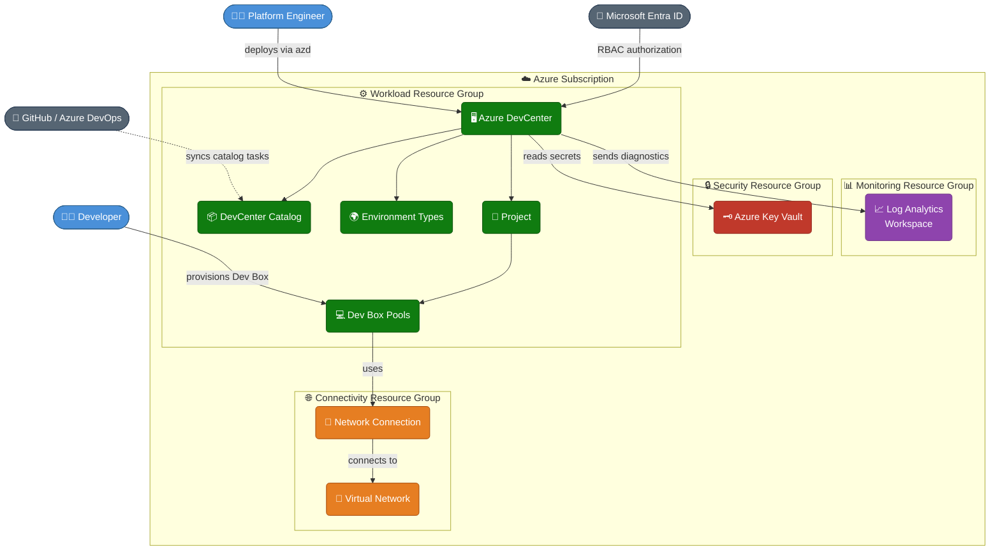

# DevExp-DevBox


**DevExp-DevBox** is an Infrastructure as Code accelerator that automates the
end-to-end provisioning of
[Microsoft Dev Box](https://learn.microsoft.com/en-us/azure/dev-box/overview-what-is-microsoft-dev-box)
environments on Azure. Using
[Azure Bicep](https://learn.microsoft.com/en-us/azure/azure-resource-manager/bicep/overview)
and the
[Azure Developer CLI (azd)](https://learn.microsoft.com/en-us/azure/developer/azure-developer-cli/overview),
the accelerator deploys a secure, observable, and role-based developer
workstation platform in minutes.

The accelerator solves the challenge of consistently provisioning developer
environments across teams and projects. It eliminates manual Azure portal
configuration, enforces organizational tagging standards, separates security and
monitoring concerns into dedicated landing zones, and integrates with GitHub or
Azure DevOps to automate token management and catalog synchronization.

The technology stack centers on **Azure Bicep** for declarative infrastructure
definitions, YAML for human-readable configuration files, PowerShell and Bash
for cross-platform setup automation, and the Azure Developer CLI for the
deployment lifecycle. All sensitive credentials are stored in Azure Key Vault,
and Azure Log Analytics provides centralized observability.

## Table of Contents

- [Features](#features)
- [Architecture](#architecture)
- [Technologies Used](#technologies-used)
- [Quick Start](#quick-start)
- [Configuration](#configuration)
- [Deployment](#deployment)
- [Usage](#usage)
- [Contributing](#contributing)
- [License](#license)

## Features

- 🏗️ **Infrastructure as Code** — Fully declarative Bicep templates for every
  Azure resource, enabling repeatable and auditable deployments.
- 🔒 **Secure by Default** — Azure Key Vault with RBAC authorization stores
  sensitive credentials; managed identities replace static passwords.
- 📊 **Built-in Observability** — A Log Analytics workspace captures diagnostic
  data from the Dev Center and networking resources out of the box.
- 🗂️ **Landing Zone Alignment** — Resources are organized into dedicated
  workload, security, and monitoring resource groups following Azure Landing
  Zone principles.
- 👥 **Role-Based Dev Box Pools** — Separate Dev Box pools for backend engineers
  and frontend engineers, each with purpose-fit VM SKUs and image definitions.
- 🔗 **Catalog-Driven Customization** — GitHub-hosted task catalogs synchronize
  automatically to the Dev Center and individual projects.
- 🌍 **Multi-Environment Support** — Built-in environment types (`dev`,
  `staging`, `uat`) let projects deploy to isolated Azure environments.
- ⚡ **One-Command Deployment** — The `azd up` command provisions all resources
  in sequence, including pre-provision setup hooks for GitHub and Azure DevOps
  authentication.
- 🔧 **YAML-Driven Configuration** — All organizational settings (resource
  groups, Dev Center, security) live in validated YAML files, making changes
  self-documenting and reviewable.

## Architecture


```mermaid
flowchart TB
    %% Actors
    PlatformEng(["👨‍💼 Platform Engineer"])
    Developer(["👩‍💻 Developer"])
    GitHub(["🐙 GitHub / Azure DevOps"])
    EntraID(["🔐 Microsoft Entra ID"])

    %% Azure infrastructure
    subgraph AzureSub["☁️ Azure Subscription"]
        subgraph MonitoringRG["📊 Monitoring Resource Group"]
            LogAnalytics("📈 Log Analytics<br/>Workspace")
        end

        subgraph SecurityRG["🔒 Security Resource Group"]
            KeyVault("🗝️ Azure Key Vault")
        end

        subgraph WorkloadRG["⚙️ Workload Resource Group"]
            DevCenter("🖥️ Azure DevCenter")
            Catalog("📦 DevCenter Catalog")
            EnvTypes("🌍 Environment Types")
            Project("📁 Project")
            Pools("💻 Dev Box Pools")
        end

        subgraph ConnRG["🌐 Connectivity Resource Group"]
            VNet("🔗 Virtual Network")
            NetConn("🔌 Network Connection")
        end
    end

    %% Interactions
    PlatformEng -->|"deploys via azd"| DevCenter
    Developer -->|"provisions Dev Box"| Pools
    GitHub -.->|"syncs catalog tasks"| Catalog
    EntraID -->|"RBAC authorization"| DevCenter
    DevCenter --> Catalog
    DevCenter --> EnvTypes
    DevCenter --> Project
    Project --> Pools
    DevCenter -->|"reads secrets"| KeyVault
    DevCenter -->|"sends diagnostics"| LogAnalytics
    Pools -->|"uses"| NetConn
    NetConn -->|"connects to"| VNet

    %% Node styles
    classDef actor fill:#4A90D9,stroke:#2C5F8A,color:#fff
    classDef service fill:#107C10,stroke:#0A4F0A,color:#fff
    classDef security fill:#C0392B,stroke:#922B21,color:#fff
    classDef monitoring fill:#8E44AD,stroke:#6C3483,color:#fff
    classDef network fill:#E67E22,stroke:#A04000,color:#fff
    classDef external fill:#566573,stroke:#2E4057,color:#fff

    class PlatformEng,Developer actor
    class DevCenter,Catalog,EnvTypes,Project,Pools service
    class KeyVault security
    class LogAnalytics monitoring
    class VNet,NetConn network
    class GitHub,EntraID external
```

## Technologies Used

| Technology                  | Type                   | Purpose                                                          |
| --------------------------- | ---------------------- | ---------------------------------------------------------------- |
| Azure Bicep                 | Infrastructure as Code | Declarative provisioning of all Azure resources                  |
| Azure Developer CLI (`azd`) | Deployment toolchain   | Lifecycle management: provision, deploy, and manage environments |
| Microsoft Dev Box           | Azure service          | Managed developer workstation service                            |
| Azure DevCenter             | Azure service          | Central hub for Dev Box pools, catalogs, and projects            |
| Azure Key Vault             | Azure service          | Secure storage of secrets, keys, and certificates                |
| Azure Log Analytics         | Azure service          | Centralized monitoring and diagnostic log collection             |
| Azure Virtual Network       | Azure service          | Isolated network connectivity for Dev Box pools                  |
| Microsoft Entra ID          | Identity service       | Authentication, authorization, and RBAC enforcement              |
| YAML                        | Configuration language | Human-readable settings for resources, security, and workloads   |
| Bash / PowerShell           | Scripting              | Cross-platform setup automation and source control integration   |
| GitHub CLI (`gh`)           | CLI tooling            | GitHub authentication and Personal Access Token management       |
| Hugo / Docsy                | Documentation          | Static site generation for project documentation                 |

## Quick Start

### Prerequisites

| Tool                                                                                                           | Minimum Version    | Notes                                                            |
| -------------------------------------------------------------------------------------------------------------- | ------------------ | ---------------------------------------------------------------- |
| [Azure CLI](https://learn.microsoft.com/en-us/cli/azure/install-azure-cli)                                     | 2.60+              | Required for Azure authentication                                |
| [Azure Developer CLI (azd)](https://learn.microsoft.com/en-us/azure/developer/azure-developer-cli/install-azd) | 1.9+               | Required for provisioning                                        |
| [GitHub CLI (`gh`)](https://cli.github.com/)                                                                   | 2.40+              | Required when using GitHub as the source control platform        |
| Bash or PowerShell                                                                                             | Any recent version | Setup scripts support both shells                                |
| Azure subscription                                                                                             | —                  | Must have Owner or Contributor + User Access Administrator roles |

### Installation

1. Clone the repository:

   ```bash
   git clone https://github.com/Evilazaro/DevExp-DevBox.git
   cd DevExp-DevBox
   ```

2. Log in to Azure:

   ```bash
   az login
   azd auth login
   ```

3. Initialize the azd environment:

   ```bash
   azd env new <environment-name>
   ```

4. Set the required environment variables:

   ```bash
   azd env set AZURE_LOCATION eastus2
   azd env set SOURCE_CONTROL_PLATFORM github
   ```

5. Provision all resources:

   ```bash
   azd up
   ```

### Minimal Working Example

```bash
# Clone, authenticate, and deploy to Azure
git clone https://github.com/Evilazaro/DevExp-DevBox.git
cd DevExp-DevBox
az login && azd auth login
azd env new mydevbox
azd up

# Expected: all resource groups, DevCenter, Key Vault, and Log Analytics are created.
# The DevCenter name is printed as the output AZURE_DEV_CENTER_NAME.
```

> [!NOTE] The `azd up` command triggers a pre-provision hook (`setUp.sh` on
> Linux/macOS, `setUp.ps1` on Windows) that handles source control
> authentication and environment variable initialization automatically.

## Configuration

All configuration is managed through YAML files in `infra/settings/`. Edit the
appropriate file before running `azd up`.

### Resource Organization — `infra/settings/resourceOrganization/azureResources.yaml`

| Option              | Default           | Description                                                                                                        |
| ------------------- | ----------------- | ------------------------------------------------------------------------------------------------------------------ |
| `workload.create`   | `true`            | Create the workload resource group                                                                                 |
| `workload.name`     | `devexp-workload` | Base name for the workload resource group                                                                          |
| `security.create`   | `false`           | Create a dedicated security resource group; when `false`, security resources share the workload resource group     |
| `monitoring.create` | `false`           | Create a dedicated monitoring resource group; when `false`, monitoring resources share the workload resource group |

### Dev Center — `infra/settings/workload/devcenter.yaml`

| Option                                 | Default          | Description                                         |
| -------------------------------------- | ---------------- | --------------------------------------------------- |
| `name`                                 | `devexp`         | Name of the Azure DevCenter instance                |
| `catalogItemSyncEnableStatus`          | `Enabled`        | Auto-sync catalog items from connected repositories |
| `microsoftHostedNetworkEnableStatus`   | `Enabled`        | Use Microsoft-hosted networking for Dev Boxes       |
| `installAzureMonitorAgentEnableStatus` | `Enabled`        | Install the Azure Monitor agent on Dev Boxes        |
| `identity.type`                        | `SystemAssigned` | Managed identity type assigned to the DevCenter     |

### Security — `infra/settings/security/security.yaml`

| Option                               | Default   | Description                                                               |
| ------------------------------------ | --------- | ------------------------------------------------------------------------- |
| `create`                             | `true`    | Create the Azure Key Vault resource                                       |
| `keyVault.name`                      | `contoso` | Prefix for the Key Vault name (a unique suffix is appended automatically) |
| `keyVault.enablePurgeProtection`     | `true`    | Prevent permanent deletion of the vault and its secrets                   |
| `keyVault.softDeleteRetentionInDays` | `7`       | Days to retain deleted secrets before permanent removal                   |
| `keyVault.enableRbacAuthorization`   | `true`    | Enforce Azure RBAC for all Key Vault access control                       |

**Example override** — change the workload resource group name for a production
deployment:

```yaml
# infra/settings/resourceOrganization/azureResources.yaml
workload:
  create: true
  name: contoso-prod-workload
```

> [!IMPORTANT] The `secretValue` parameter supplied during `azd up` must be a
> valid GitHub Personal Access Token or Azure DevOps token. This value is stored
> securely in Azure Key Vault and is never written to disk or logged.

## Deployment

1. Ensure all [prerequisites](#prerequisites) are installed and you are
   authenticated to Azure.

2. Review and edit the YAML configuration files in `infra/settings/` to match
   your organization's naming and tagging standards.

3. Create a new azd environment:

   ```bash
   azd env new <your-environment-name>
   ```

4. Set the target Azure region:

   ```bash
   azd env set AZURE_LOCATION <region>
   # Example:
   azd env set AZURE_LOCATION eastus2
   ```

5. Set the source control platform:

   ```bash
   azd env set SOURCE_CONTROL_PLATFORM github
   # Or, for Azure DevOps:
   azd env set SOURCE_CONTROL_PLATFORM adogit
   ```

6. Run the full provisioning:

   ```bash
   azd up
   ```

   The pre-provision hook (`setUp.sh` on Linux/macOS or `setUp.ps1` on Windows)
   runs automatically and handles authentication and token setup.

7. After provisioning completes, note the output values:

   | Output                               | Description                                      |
   | ------------------------------------ | ------------------------------------------------ |
   | `AZURE_DEV_CENTER_NAME`              | Name of the deployed Azure DevCenter             |
   | `AZURE_KEY_VAULT_NAME`               | Name of the Azure Key Vault                      |
   | `AZURE_LOG_ANALYTICS_WORKSPACE_NAME` | Name of the Log Analytics workspace              |
   | `AZURE_DEV_CENTER_PROJECTS`          | Array of project names deployed in the DevCenter |

> [!WARNING] Running `azd down` removes **all** provisioned resources. Export
> any required secrets from Key Vault before tearing down the environment.

## Usage

### List Dev Center outputs after deployment

```bash
azd env get-values

# Expected output includes:
# AZURE_DEV_CENTER_NAME=devexp
# AZURE_KEY_VAULT_NAME=contoso-<unique>-kv
# AZURE_LOG_ANALYTICS_WORKSPACE_NAME=logAnalytics-<unique>
```

### Add a new project to the Dev Center

Open `infra/settings/workload/devcenter.yaml` and append a new entry to the
`projects` array:

```yaml
projects:
  - name: 'myNewProject'
    description: 'My new development project.'
    network:
      name: myNewProject
      create: true
      resourceGroupName: 'myNewProject-connectivity-RG'
      virtualNetworkType: Unmanaged
      addressPrefixes:
        - 10.1.0.0/16
      subnets:
        - name: myNewProject-subnet
          properties:
            addressPrefix: 10.1.1.0/24
    # Add identity, pools, and environmentTypes as needed
```

Then re-run provisioning to apply the change:

```bash
azd up
```

### Clean up all resources

```bash
azd down
```

> [!CAUTION] `azd down` is irreversible. All resource groups, the Dev Center,
> Key Vault, and Log Analytics workspace are permanently deleted.

## Contributing

Contributions are welcome! To contribute to this project:

1. Fork the repository on GitHub.
2. Create a feature branch: `git checkout -b feature/your-feature-name`
3. Commit your changes with a descriptive message.
4. Push your branch and open a Pull Request against `main`.
5. Verify that your changes do not break any existing Bicep deployments and that
   YAML configuration files validate against their JSON schemas in
   `infra/settings/`.

> [!TIP] Run `az bicep build --file infra/main.bicep` to validate your Bicep
> changes locally before submitting a Pull Request.

To report a bug or request a feature, open an issue at
[https://github.com/Evilazaro/DevExp-DevBox/issues](https://github.com/Evilazaro/DevExp-DevBox/issues).

## License

This project is licensed under the **MIT License**. See the [LICENSE](LICENSE)
file for full details.
