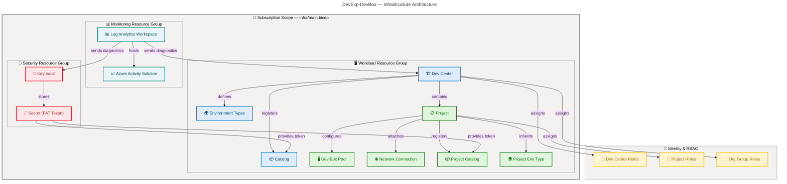

# DevExp-DevBox — Dev Box Adoption & Deployment Accelerator

[](https://learn.microsoft.com/en-us/azure/dev-box/overview-what-is-microsoft-dev-box)
[](https://learn.microsoft.com/en-us/azure/azure-resource-manager/bicep/overview)
[](LICENSE)
[](https://learn.microsoft.com/en-us/azure/developer/azure-developer-cli/overview)


**DevExp-DevBox** provisions a complete Microsoft Dev Box and Dev Center
infrastructure on Azure using Infrastructure as Code (Bicep), automated setup
scripts, and YAML-driven configuration. It enables platform engineering teams to
deliver self-service, cloud-powered developer workstations with enterprise-grade
security, monitoring, and role-based access control.

> 💡 **Tip**: If you are new to Microsoft Dev Box, see the
> [official Dev Box documentation](https://learn.microsoft.com/en-us/azure/dev-box/overview-what-is-microsoft-dev-box)
> for an introduction to concepts and terminology.

## Overview

**Overview**

DevExp-DevBox exists to eliminate the manual, error-prone process of
provisioning developer workstations at scale. Platform engineering teams spend
significant effort configuring Dev Centers, projects, pools, networking,
identity, and security — this accelerator automates the entire stack in a single
deployment, following Azure Landing Zone principles and least-privilege RBAC.

The accelerator uses a modular Bicep architecture orchestrated by the Azure
Developer CLI (`azd`). Configuration is driven entirely by YAML files, so teams
can customize Dev Center settings, projects, pools, environment types, and
security without modifying any Bicep code. Setup scripts handle authentication,
environment initialization, and provisioning for both Linux/macOS (Bash) and
Windows (PowerShell).

> ⚠️ **Important**: This accelerator deploys real Azure resources that incur
> costs. Review the [Configuration](#configuration) section to understand
> resource sizing before deploying to a production subscription.

## Table of Contents

- [Overview](#overview)
- [Features](#features)
- [Requirements](#requirements)
- [Architecture](#architecture)
- [Quick Start](#quick-start)
- [Deployment](#deployment)
- [Configuration](#configuration)
- [Contributing](#contributing)
- [License](#license)

## Features

**Overview**

The accelerator delivers a production-ready Dev Box platform by automating every
layer of the infrastructure stack — from resource group organization to
developer workstation pools. This reduces setup time from days of manual
configuration to a single automated deployment.

Each feature is designed to be independently configurable through YAML settings
files, enabling teams to customize the deployment without modifying
infrastructure code. The modular design follows Azure best practices for
separation of concerns and least-privilege access.

| Feature                              | Description                                                                                                                                | Status    |
| ------------------------------------ | ------------------------------------------------------------------------------------------------------------------------------------------ | --------- |
| 🏗️ Infrastructure as Code            | Complete Azure infrastructure defined in modular Bicep templates with subscription-scoped orchestration                                    | ✅ Stable |
| 🖥️ Dev Center & Dev Box Provisioning | Automated creation of Dev Centers, projects, pools, catalogs, and environment types from YAML configuration                                | ✅ Stable |
| 🔐 Security & Key Vault              | Azure Key Vault with RBAC authorization, purge protection, soft delete, and secure secret management for source control tokens             | ✅ Stable |
| 📊 Centralized Monitoring            | Log Analytics Workspace with diagnostic settings across all deployed resources and Azure Activity solution                                 | ✅ Stable |
| 🔑 Identity & RBAC                   | Granular role assignments at subscription, resource group, and project scopes using managed identities and Azure AD groups                 | ✅ Stable |
| 🌐 Network Connectivity              | Virtual network provisioning with subnet configuration and Dev Center network connections supporting both managed and unmanaged topologies | ✅ Stable |
| ⚙️ Cross-Platform Setup              | Automated environment initialization scripts for Bash (Linux/macOS) and PowerShell (Windows) with GitHub and Azure DevOps integration      | ✅ Stable |

## Requirements

**Overview**

Before deploying the accelerator, you need an active Azure subscription with
sufficient permissions and several command-line tools installed. The setup
scripts validate all prerequisites automatically, but verifying them beforehand
avoids interruptions during deployment.

All tools listed below are free and available for Windows, macOS, and Linux. The
Azure subscription requires Owner or Contributor + User Access Administrator
roles at the subscription level to create resource groups and assign RBAC roles.

| Requirement                    | Description                                                                           | Installation                                                                                               |
| ------------------------------ | ------------------------------------------------------------------------------------- | ---------------------------------------------------------------------------------------------------------- |
| ☁️ Azure Subscription          | Active subscription with Owner or Contributor + User Access Administrator permissions | [Create free account](https://azure.microsoft.com/en-us/free/)                                             |
| 🔧 Azure CLI (`az`)            | Command-line interface for Azure resource management (v2.50+)                         | [Install Azure CLI](https://learn.microsoft.com/en-us/cli/azure/install-azure-cli)                         |
| 🚀 Azure Developer CLI (`azd`) | Developer-centric CLI for provisioning and deploying Azure resources                  | [Install azd](https://learn.microsoft.com/en-us/azure/developer/azure-developer-cli/install-azd)           |
| 🐙 GitHub CLI (`gh`)           | Required when using GitHub as source control platform                                 | [Install GitHub CLI](https://cli.github.com/)                                                              |
| 📦 `jq`                        | Lightweight JSON processor (required by Bash setup script)                            | [Download jq](https://jqlang.github.io/jq/download/)                                                       |
| 🐚 PowerShell 5.1+             | Required for Windows setup script (`setUp.ps1`) and cleanup                           | [Install PowerShell](https://learn.microsoft.com/en-us/powershell/scripting/install/installing-powershell) |

## Architecture

**Overview**

The accelerator follows Azure Landing Zone principles, organizing resources into
three dedicated resource groups — security, monitoring, and workload — each with
purpose-specific resources and consistent tagging. The Bicep modules are
composed in a layered architecture where the subscription-scoped entry point
(`infra/main.bicep`) orchestrates five functional layers: management, security,
workload, identity, and connectivity.

Data flows from the top-level orchestrator through module dependencies:
monitoring deploys first to provide a Log Analytics Workspace, security deploys
next to create Key Vault and store secrets, and the workload layer deploys last,
consuming outputs from both to configure Dev Center, projects, pools, and
network connections.


```mermaid
---
title: "DevExp-DevBox — Infrastructure Architecture"
config:
  theme: base
  look: classic
  layout: dagre
  flowchart:
    htmlLabels: true
---
flowchart TB
    accTitle: DevExp-DevBox Infrastructure Architecture
    accDescr: Shows the layered Bicep module architecture across three Azure resource groups with dependencies between management, security, workload, identity, and connectivity layers

    %% ═══════════════════════════════════════════════════════════════════════════
    %% AZURE / FLUENT ARCHITECTURE PATTERN v1.1
    %% PHASE 1 - STRUCTURAL: Direction explicit, flat topology, nesting ≤ 3
    %% PHASE 2 - SEMANTIC: Colors justified, max 5 semantic classes, neutral-first
    %% PHASE 3 - FONT: Dark text on light backgrounds, contrast ≥ 4.5:1
    %% PHASE 4 - ACCESSIBILITY: accTitle/accDescr present, icons on all nodes
    %% PHASE 5 - STANDARD: Governance block present, classDefs centralized
    %% ═══════════════════════════════════════════════════════════════════════════

    subgraph orchestrator["🏢 Subscription Scope — infra/main.bicep"]
        direction TB

        subgraph monitoringRG["📊 Monitoring Resource Group"]
            direction LR
            logAnalytics["📊 Log Analytics Workspace"]:::data
            activitySolution["📈 Azure Activity Solution"]:::data
            logAnalytics -->|"hosts"| activitySolution
        end

        subgraph securityRG["🔐 Security Resource Group"]
            direction LR
            keyVault["🔐 Key Vault"]:::danger
            secret["🔑 Secret (PAT Token)"]:::danger
            keyVault -->|"stores"| secret
        end

        subgraph workloadRG["🖥️ Workload Resource Group"]
            direction TB
            devCenter["🏗️ Dev Center"]:::core
            catalog["📦 Catalog"]:::core
            envType["🌍 Environment Types"]:::core
            project["📋 Project"]:::success
            pool["🖥️ Dev Box Pool"]:::success
            networkConn["🌐 Network Connection"]:::success
            projectCatalog["📦 Project Catalog"]:::success
            projectEnvType["🌍 Project Env Type"]:::success

            devCenter -->|"registers"| catalog
            devCenter -->|"defines"| envType
            devCenter -->|"contains"| project
            project -->|"configures"| pool
            project -->|"attaches"| networkConn
            project -->|"registers"| projectCatalog
            project -->|"inherits"| projectEnvType
        end
    end

    subgraph identity["🔑 Identity & RBAC"]
        direction LR
        dcRoles["🔑 Dev Center Roles"]:::warning
        projectRoles["🔑 Project Roles"]:::warning
        orgRoles["🔑 Org Group Roles"]:::warning
    end

    logAnalytics -->|"sends diagnostics"| devCenter
    logAnalytics -->|"sends diagnostics"| keyVault
    secret -->|"provides token"| catalog
    secret -->|"provides token"| projectCatalog
    devCenter -->|"assigns"| dcRoles
    project -->|"assigns"| projectRoles
    devCenter -->|"assigns"| orgRoles

    style orchestrator fill:#F3F2F1,stroke:#605E5C,stroke-width:2px
    style monitoringRG fill:#F3F2F1,stroke:#8A8886,stroke-width:1px
    style securityRG fill:#F3F2F1,stroke:#8A8886,stroke-width:1px
    style workloadRG fill:#F3F2F1,stroke:#8A8886,stroke-width:1px
    style identity fill:#F3F2F1,stroke:#8A8886,stroke-width:1px

    %% Centralized semantic classDefs (Phase 5 compliant)
    classDef core fill:#DEECF9,stroke:#0078D4,stroke-width:2px,color:#004578
    classDef success fill:#DFF6DD,stroke:#107C10,stroke-width:2px,color:#0B6A0B
    classDef danger fill:#FDE7E9,stroke:#E81123,stroke-width:2px,color:#A4262C
    classDef warning fill:#FFF4CE,stroke:#FFB900,stroke-width:2px,color:#986F0B
    classDef data fill:#E8F4F8,stroke:#008272,stroke-width:2px,color:#004B50
```

**Component Roles:**

| Component                  | Purpose                                                                              | Bicep Module                               |
| -------------------------- | ------------------------------------------------------------------------------------ | ------------------------------------------ |
| 📊 Log Analytics Workspace | Centralized monitoring and diagnostics collection                                    | `src/management/logAnalytics.bicep`        |
| 🔐 Key Vault               | Secure storage for source control tokens and secrets                                 | `src/security/keyVault.bicep`              |
| 🏗️ Dev Center              | Central management plane for developer workstations                                  | `src/workload/core/devCenter.bicep`        |
| 📋 Project                 | Scoped environment for a development team with pools and catalogs                    | `src/workload/project/project.bicep`       |
| 🖥️ Dev Box Pool            | Virtual machine pool with specific SKU and image definitions                         | `src/workload/project/projectPool.bicep`   |
| 🌐 Network Connection      | VNet attachment enabling Dev Boxes to join managed or custom networks                | `src/connectivity/networkConnection.bicep` |
| 🔑 RBAC Assignments        | Least-privilege role assignments at subscription, resource group, and project scopes | `src/identity/*.bicep`                     |

## Quick Start

**Overview**

Get the accelerator deployed in under 10 minutes. The setup script validates
prerequisites, authenticates with Azure and your source control platform, and
provisions all resources through `azd`.

The following steps use GitHub as the source control platform. For Azure DevOps,
replace `github` with `adogit` in the commands below.

### 1. Clone the Repository

```bash
git clone https://github.com/Evilazaro/DevExp-DevBox.git
cd DevExp-DevBox
```

### 2. Run Setup (Linux / macOS)

```bash
chmod +x setUp.sh
./setUp.sh -e "dev" -s "github"
```

### 3. Run Setup (Windows PowerShell)

```powershell
.\setUp.ps1 -EnvName "dev" -SourceControl "github"
```

The setup script performs the following steps automatically:

1. Validates that `az`, `azd`, `gh`, and `jq` are installed
2. Verifies Azure CLI and GitHub CLI authentication
3. Retrieves or prompts for a GitHub Personal Access Token
4. Initializes the `azd` environment with required variables
5. Runs `azd provision` to deploy all infrastructure

> 💡 **Tip**: The setup script masks sensitive tokens in log output and provides
> color-coded status messages throughout the process.

### Expected Output

```text
✅ Azure CLI authentication verified
✅ GitHub CLI authentication verified
✅ Environment 'dev' initialized
✅ Provisioning started...
```

## Deployment

**Overview**

The deployment process uses the Azure Developer CLI (`azd`) to orchestrate Bicep
template deployments across three resource groups. The `azure.yaml` file defines
preprovision hooks that run the setup script before invoking `azd provision`.

For manual control over the deployment lifecycle, you can run the individual
steps separately. The infrastructure deploys in dependency order: monitoring
first, then security, then workload resources.

### Automated Deployment

The recommended approach uses `azd` with the setup script:

```bash
# Initialize environment and provision (Linux/macOS)
./setUp.sh -e "prod" -s "github"
```

```powershell
# Initialize environment and provision (Windows)
.\setUp.ps1 -EnvName "prod" -SourceControl "github"
```

### Manual Deployment with azd

```bash
# Step 1: Initialize environment
azd init -e "prod"

# Step 2: Set required environment variables
azd env set KEY_VAULT_SECRET "<your-github-pat>"
azd env set SOURCE_CONTROL_PLATFORM "github"

# Step 3: Provision infrastructure
azd provision
```

### Cleanup

To tear down all deployed resources:

```powershell
.\cleanSetUp.ps1 -EnvName "dev" -Location "eastus2"
```

The cleanup script removes:

- All subscription-level ARM deployments
- Service principals and app registrations
- GitHub secrets for Azure credentials
- Resource groups and their contents

> ⚠️ **Warning**: The cleanup script permanently deletes resources. Use the
> `-WhatIf` flag to preview changes before execution.

## Configuration

**Overview**

All deployment settings are defined in YAML configuration files under
`infra/settings/`. This design separates infrastructure logic (Bicep) from
environment-specific values (YAML), enabling teams to customize deployments
without modifying any template code.

The configuration follows a hierarchical structure: resource organization
defines the landing zone layout, security configures Key Vault and secret
management, and the workload file defines the complete Dev Center topology
including projects, pools, catalogs, and role assignments.

### Configuration Files

| File                                                         | Purpose                                                             |
| ------------------------------------------------------------ | ------------------------------------------------------------------- |
| ⚙️ `infra/settings/resourceOrganization/azureResources.yaml` | Resource group names, tags, and landing zone structure              |
| 🔐 `infra/settings/security/security.yaml`                   | Key Vault settings, secret names, purge protection, and soft delete |
| 🖥️ `infra/settings/workload/devcenter.yaml`                  | Dev Center, projects, pools, catalogs, environment types, and RBAC  |

### Resource Organization

The `azureResources.yaml` file defines three resource groups following Azure
Landing Zone principles:

```yaml
workload:
  create: true
  name: devexp-workload
  tags:
    environment: dev
    project: Contoso-DevExp-DevBox

security:
  create: true
  name: devexp-security

monitoring:
  create: true
  name: devexp-monitoring
```

### Dev Center Configuration

The `devcenter.yaml` file is the primary configuration for the workload layer.
Key sections include:

```yaml
# Core Dev Center settings
name: 'devexp-devcenter'
catalogItemSyncEnableStatus: 'Enabled'
microsoftHostedNetworkEnableStatus: 'Enabled'
installAzureMonitorAgentEnableStatus: 'Enabled'

# Identity with managed identity RBAC
identity:
  type: 'SystemAssigned'
  roleAssignments:
    devCenter:
      - name: 'Contributor'
        scope: 'Subscription'
      - name: 'Key Vault Secrets User'
        scope: 'ResourceGroup'
```

### Project and Pool Configuration

Each project defines its own pools, catalogs, environment types, and network
settings:

```yaml
projects:
  - name: 'eShop'
    pools:
      - name: 'backend-engineer'
        vmSku: 'sku_v2_m32_c16_128' # 16 vCPUs, 128 GB RAM
      - name: 'frontend-engineer'
        vmSku: 'sku_v2_m16_c8_64' # 8 vCPUs, 64 GB RAM
    environmentTypes:
      - name: 'dev'
      - name: 'staging'
      - name: 'UAT'
```

### Security Configuration

The `security.yaml` file configures Key Vault with security best practices:

```yaml
keyVault:
  name: contoso
  secretName: gha-token
  enablePurgeProtection: true
  enableSoftDelete: true
  softDeleteRetentionInDays: 7
  enableRbacAuthorization: true
```

### Supported Azure Regions

The deployment supports the following Azure regions:

| Region                  | Identifier           |
| ----------------------- | -------------------- |
| 🌎 East US              | `eastus`             |
| 🌎 East US 2            | `eastus2`            |
| 🌎 West US              | `westus`             |
| 🌎 West US 2            | `westus2`            |
| 🌎 West US 3            | `westus3`            |
| 🌎 Central US           | `centralus`          |
| 🌍 North Europe         | `northeurope`        |
| 🌍 West Europe          | `westeurope`         |
| 🌏 Southeast Asia       | `southeastasia`      |
| 🌏 Australia East       | `australiaeast`      |
| 🌏 Japan East           | `japaneast`          |
| 🌍 UK South             | `uksouth`            |
| 🌎 Canada Central       | `canadacentral`      |
| 🌍 Sweden Central       | `swedencentral`      |
| 🌍 Switzerland North    | `switzerlandnorth`   |
| 🌍 Germany West Central | `germanywestcentral` |

## Contributing

**Overview**

Contributions are welcome and follow a product-oriented delivery model organized
into Epics, Features, and Tasks. The project uses GitHub Issue Forms for
structured issue tracking and enforces consistent branching, labeling, and
engineering standards.

Before contributing, review the full guidelines in `CONTRIBUTING.md` to
understand the branching conventions, required labels, and engineering standards
for Bicep, PowerShell, and Markdown files.

### Getting Started

1. Fork the repository and create a feature branch:

   ```bash
   git checkout -b feature/your-feature-name
   ```

2. Make changes following the engineering standards in `CONTRIBUTING.md`

3. Submit a pull request linking the relevant issue

### Branch Naming Conventions

| Prefix        | Purpose                               |
| ------------- | ------------------------------------- |
| 🚀 `feature/` | New features or capabilities          |
| 🔧 `task/`    | Implementation tasks within a feature |
| 🐛 `fix/`     | Bug fixes                             |
| 📝 `docs/`    | Documentation changes                 |

For full contributing guidelines, see [CONTRIBUTING.md](CONTRIBUTING.md).

## License

This project is licensed under the **MIT License**. See the [LICENSE](LICENSE)
file for details.

Copyright (c) 2025 Evilázaro Alves.
