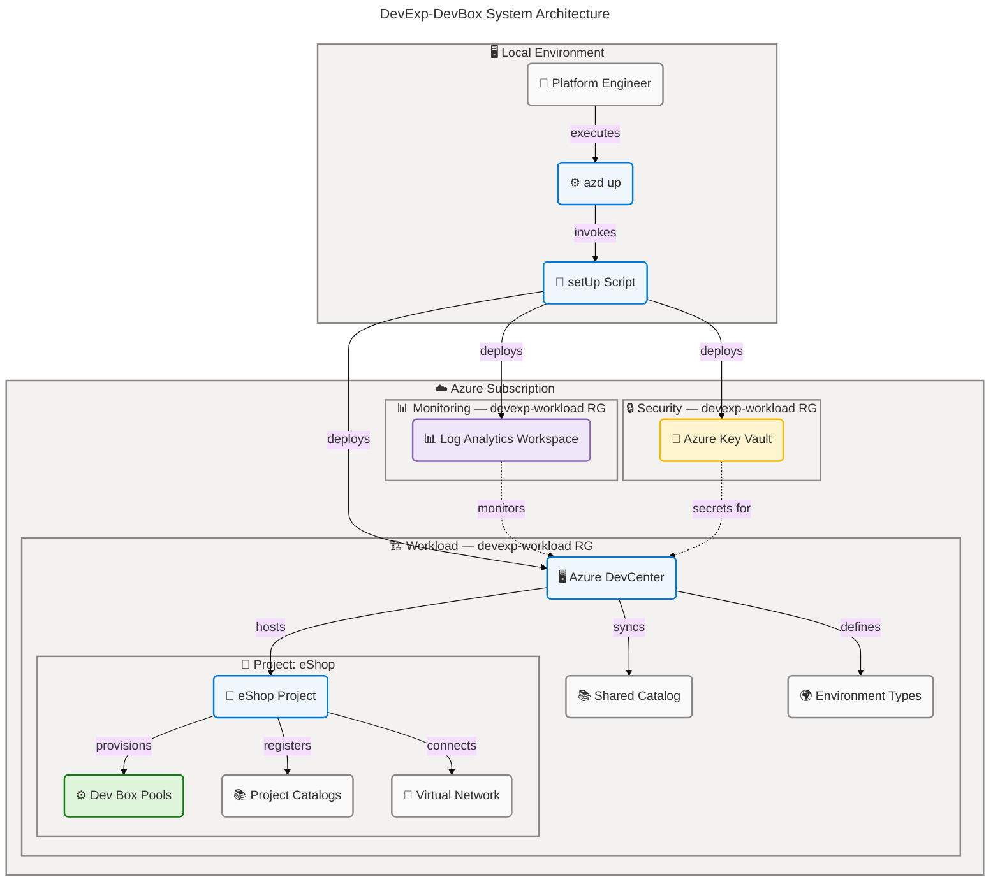

# DevExp-DevBox

[](https://opensource.org/licenses/MIT)
[](https://learn.microsoft.com/en-us/azure/dev-box/)
[](https://learn.microsoft.com/en-us/azure/developer/azure-developer-cli/)
[](https://learn.microsoft.com/en-us/azure/azure-resource-manager/bicep/)
[](https://github.com/Evilazaro/DevExp-DevBox)

A production-grade **Microsoft Dev Box Accelerator** that provisions
cloud-hosted, role-optimized developer workstations on Azure — driven by
configuration-as-code YAML and deployed via the Azure Developer CLI
(`azd provision`).

## Overview

**Overview**

Platform engineering teams face mounting pressure to onboard developers quickly
while enforcing security, governance, and consistent tooling across multiple
teams and projects. DevExp-DevBox delivers an opinionated, policy-compliant
Azure Dev Box deployment accelerator that eliminates manual portal configuration
and applies Azure Landing Zone principles, least-privilege RBAC, and full
observability from day one.

Deploying DevExp-DevBox provisions an Azure DevCenter with role-specific Dev Box
pools, catalog-backed image and task definitions sourced from GitHub or Azure
DevOps, Azure Key Vault for secure token management, Log Analytics for
diagnostics, and optional virtual network connectivity — all orchestrated
through the Azure Developer CLI (`azd`) and declarative YAML configuration
files.

## Table of Contents

- [Architecture](#architecture)
- [Features](#features)
- [Requirements](#requirements)
- [Getting Started](#getting-started)
- [Configuration](#configuration)
- [Contributing](#contributing)
- [License](#license)

## Architecture

The accelerator follows a layered Infrastructure as Code architecture: a
platform engineer runs `azd up`, which triggers the platform setup scripts
(`setUp.sh` on Linux/macOS, `setUp.ps1` on Windows), then deploys Bicep modules
at subscription scope to create resource groups, security services, monitoring
infrastructure, and the Azure DevCenter with its projects.


```mermaid
---
title: "DevExp-DevBox System Architecture"
config:
  theme: base
  look: classic
  layout: dagre
  flowchart:
    htmlLabels: true
---
flowchart TB
    accTitle: DevExp-DevBox System Architecture
    accDescr: End-to-end architecture diagram showing platform engineer provisioning workflow, Azure Developer CLI orchestration, and Azure resource topology for the Microsoft Dev Box accelerator

    %% ═══════════════════════════════════════════════════════════════════════════
    %% AZURE / FLUENT ARCHITECTURE PATTERN v1.1
    %% (Semantic + Structural + Font + Accessibility Governance)
    %% ═══════════════════════════════════════════════════════════════════════════
    %% PHASE 1 - FLUENT UI: All styling uses approved Fluent UI palette only
    %% PHASE 2 - GROUPS: Every subgraph has semantic color via style directive
    %% PHASE 3 - COMPONENTS: Every node has semantic classDef + icon prefix
    %% PHASE 4 - ACCESSIBILITY: accTitle/accDescr present, WCAG AA contrast
    %% PHASE 5 - STANDARD: Governance block present, classDefs centralized
    %% ═══════════════════════════════════════════════════════════════════════════

    subgraph devEnv["🖥️ Local Environment"]
        dev("👤 Platform Engineer"):::neutral
        azdUp("⚙️ azd up"):::core
        setScript("📜 setUp Script"):::core
    end

    subgraph azureSub["☁️ Azure Subscription"]
        subgraph monitoringLayer["📊 Monitoring — devexp-workload RG"]
            la("📊 Log Analytics Workspace"):::data
        end
        subgraph securityLayer["🔒 Security — devexp-workload RG"]
            kv("🔑 Azure Key Vault"):::warning
        end
        subgraph workloadLayer["🏗️ Workload — devexp-workload RG"]
            dc("🖥️ Azure DevCenter"):::core
            catalog("📚 Shared Catalog"):::neutral
            envTypes("🌍 Environment Types"):::neutral
            subgraph eShopProject["📁 Project: eShop"]
                proj("📁 eShop Project"):::core
                pools("⚙️ Dev Box Pools"):::success
                projCatalog("📚 Project Catalogs"):::neutral
                vnet("🔌 Virtual Network"):::neutral
            end
        end
    end

    dev -->|"executes"| azdUp
    azdUp -->|"invokes"| setScript
    setScript -->|"deploys"| la
    setScript -->|"deploys"| kv
    setScript -->|"deploys"| dc
    dc -->|"syncs"| catalog
    dc -->|"defines"| envTypes
    dc -->|"hosts"| proj
    proj -->|"provisions"| pools
    proj -->|"registers"| projCatalog
    proj -->|"connects"| vnet
    la -.->|"monitors"| dc
    kv -.->|"secrets for"| dc

    style devEnv fill:#F3F2F1,stroke:#8A8886,stroke-width:2px,color:#323130
    style azureSub fill:#F3F2F1,stroke:#8A8886,stroke-width:2px,color:#323130
    style monitoringLayer fill:#F3F2F1,stroke:#8A8886,stroke-width:2px,color:#323130
    style securityLayer fill:#F3F2F1,stroke:#8A8886,stroke-width:2px,color:#323130
    style workloadLayer fill:#F3F2F1,stroke:#8A8886,stroke-width:2px,color:#323130
    style eShopProject fill:#F3F2F1,stroke:#8A8886,stroke-width:2px,color:#323130

    %% Centralized semantic classDefs (Phase 5 compliant)
    classDef neutral fill:#FAFAFA,stroke:#8A8886,stroke-width:2px,color:#323130
    classDef core fill:#EFF6FC,stroke:#0078D4,stroke-width:2px,color:#323130
    classDef success fill:#DFF6DD,stroke:#107C10,stroke-width:2px,color:#323130
    classDef warning fill:#FFF4CE,stroke:#FFB900,stroke-width:2px,color:#323130
    classDef data fill:#F0E6FA,stroke:#8764B8,stroke-width:2px,color:#323130
```

**Component Roles:**

| Component            | Role                                                                      | Source File                               |
| -------------------- | ------------------------------------------------------------------------- | ----------------------------------------- |
| 🖥️ Azure DevCenter   | Central hub managing Dev Box definitions, catalogs, and environment types | `src/workload/core/devCenter.bicep`       |
| 📁 DevCenter Project | Team-scoped workspace grouping Dev Box pools and catalogs (e.g., eShop)   | `src/workload/project/project.bicep`      |
| ⚙️ Dev Box Pools     | Role-specific VM configurations (`backend-engineer`, `frontend-engineer`) | `infra/settings/workload/devcenter.yaml`  |
| 📚 Catalogs          | GitHub-backed repositories for image definitions and custom tasks         | `src/workload/core/catalog.bicep`         |
| 🌍 Environment Types | Pre-configured deployment targets: `dev`, `staging`, `UAT`                | `src/workload/core/environmentType.bicep` |
| 🔑 Azure Key Vault   | Centralized storage for the GitHub Actions token used by catalogs         | `src/security/keyVault.bicep`             |
| 📊 Log Analytics     | Workspace receiving diagnostics from DevCenter, Key Vault, and VNets      | `src/management/logAnalytics.bicep`       |
| 🔌 Virtual Network   | Optional unmanaged VNet for Dev Box network connectivity                  | `src/connectivity/vnet.bicep`             |

## Features

**Overview**

DevExp-DevBox targets platform engineering teams who need to provision
standardized developer workstations without managing individual portal
configurations or writing infrastructure code from scratch. The accelerator
codifies Azure Landing Zone resource organization, pre-wires RBAC for common
roles, and integrates catalog-backed image definitions to deliver a repeatable,
auditable onboarding path.

Every component is controlled through YAML configuration files that live
alongside the Bicep modules. Changes to Dev Box pool sizes, image definitions,
environment types, and RBAC assignments require only a YAML edit and a
re-deployment — no portal access, no manual steps.

| Feature                        | Description                                                                                  | Status    |
| ------------------------------ | -------------------------------------------------------------------------------------------- | --------- |
| 🚀 Automated Provisioning      | Entire Dev Box environment provisioned via `azd provision` with pre-provision hooks          | ✅ Stable |
| 📋 Config-as-Code              | All resources defined in YAML (`azureResources.yaml`, `devcenter.yaml`, `security.yaml`)     | ✅ Stable |
| 🔒 Key Vault Integration       | Automated Key Vault provisioning with RBAC authorization and soft-delete protection          | ✅ Stable |
| 🏢 Landing Zone Aligned        | Workload, security, and monitoring resource groups follow Azure Landing Zone principles      | ✅ Stable |
| ⚙️ Role-Specific Dev Box Pools | Pre-configured pools for `backend-engineer` and `frontend-engineer` personas                 | ✅ Stable |
| 🌍 Multi-Environment Support   | Dev, Staging, and UAT environment types provisioned per DevCenter project                    | ✅ Stable |
| 📊 Built-in Observability      | Log Analytics Workspace with AzureActivity solution and diagnostic settings on all resources | ✅ Stable |

> [!NOTE]  
> The security and monitoring resource groups are **shared with the workload
> resource group by default** (`create: false` in
> `infra/settings/resourceOrganization/azureResources.yaml`). Set `create: true`
> for either to deploy them into dedicated resource groups for stricter
> isolation.

## Requirements

**Overview**

DevExp-DevBox deploys infrastructure at Azure subscription scope, which requires
specific CLI tools and Azure permissions before the first `azd up` run. All
required tools must be authenticated and configured on the machine that executes
the deployment.

The platform engineer running the deployment needs Owner or Contributor access
on the target Azure subscription. Azure AD (Entra ID) groups for the DevManager
role (`Platform Engineering Team`) and project teams (`eShop Engineers`) must
exist before deployment, as the Bicep modules reference their group object IDs
for RBAC assignments.

| Requirement            | Description                                                                     | Minimum Version |
| ---------------------- | ------------------------------------------------------------------------------- | --------------- |
| ☁️ Azure Subscription  | Active subscription with Owner or Contributor role grant                        | Any             |
| ⚙️ Azure Developer CLI | `azd` for environment initialization and `azd up` deployment                    | ≥ 1.10.0        |
| 🔧 Azure CLI           | `az` for authentication and subscription-scoped operations                      | ≥ 2.60.0        |
| 🐱 GitHub CLI          | `gh` for GitHub authentication when `SOURCE_CONTROL_PLATFORM=github`            | ≥ 2.0.0         |
| 🔑 GitHub PAT          | Personal access token with `repo` scope for catalog access and Key Vault secret | N/A             |
| 🏢 Azure AD Groups     | Pre-created Entra ID groups for DevManager and project team RBAC assignments    | N/A             |
| 🌐 PowerShell          | PowerShell for Windows deployment via `setUp.ps1`                               | ≥ 7.0           |
| 📦 Bash                | Bash for Linux/macOS deployment via `setUp.sh`                                  | ≥ 5.0           |

> [!WARNING] The `KEY_VAULT_SECRET` environment variable must be set to a valid
> GitHub Personal Access Token (PAT) with `repo` scope before running
> `azd provision`. If not set, `setUp.sh` / `setUp.ps1` will attempt to retrieve
> it automatically via `gh auth token`. This token is stored in Azure Key Vault
> and used by the DevCenter catalog to authenticate to GitHub repositories.

## Getting Started

**Overview**

The provisioning flow is driven by the Azure Developer CLI (`azd`). Running
`azd provision` triggers the `preprovision` hook in `azure.yaml`, which
automatically invokes `setUp.sh` (Linux/macOS) or `setUp.ps1` (Windows) to
validate dependencies, authenticate against the chosen source control platform,
and write the required secrets into the azd environment file. After the hook
completes, `azd` deploys the Bicep infrastructure at subscription scope.

Before provisioning, update the Azure AD group object IDs in
`infra/settings/workload/devcenter.yaml` to match real groups in your tenant.
See [Azure AD Group Configuration](#azure-ad-group-configuration) for details.

### Step 1 — Authenticate

```bash
az login
azd auth login
gh auth login        # Only required when SOURCE_CONTROL_PLATFORM=github (default)
```

For Azure DevOps, authenticate the `az devops` extension instead:

```bash
az extension add --name azure-devops
az devops login      # Prompts for PAT
```

### Step 2 — Create the azd Environment

```bash
azd env new my-devbox-env
azd env set AZURE_LOCATION eastus
```

Supported `AZURE_LOCATION` values (from `infra/main.bicep`):

```text
eastus  eastus2  westus  westus2  westus3  centralus
northeurope  westeurope  southeastasia  australiaeast
japaneast  uksouth  canadacentral  swedencentral
switzerlandnorth  germanywestcentral
```

To use Azure DevOps as the source control provider instead of GitHub:

```bash
azd env set SOURCE_CONTROL_PLATFORM adogit
```

The full set of azd environment variables consumed by
`infra/main.parameters.json` and the `preprovision` hook:

| Variable                     | Description                                                       | How to Set                                                                   |
| ---------------------------- | ----------------------------------------------------------------- | ---------------------------------------------------------------------------- |
| 🌍 `AZURE_ENV_NAME`          | Environment name used in resource group naming                    | `azd env new <name>`                                                         |
| 📍 `AZURE_LOCATION`          | Azure region for all deployed resources                           | `azd env set AZURE_LOCATION <region>`                                        |
| 🔑 `KEY_VAULT_SECRET`        | GitHub PAT or Azure DevOps PAT stored as `gha-token` in Key Vault | `azd env set KEY_VAULT_SECRET <token>` or auto-retrieved via `gh auth token` |
| 🔌 `SOURCE_CONTROL_PLATFORM` | Source control provider: `github` (default) or `adogit`           | `azd env set SOURCE_CONTROL_PLATFORM adogit`                                 |

> [!NOTE] `KEY_VAULT_SECRET` is optional at this stage. If not set, the
> `preprovision` hook calls `gh auth token` automatically to retrieve it from
> the authenticated GitHub CLI session, then writes it to
> `.azure/<env-name>/.env`.

### Step 3 — Update Configuration Files

Edit the three YAML configuration files before provisioning. At minimum, replace
the placeholder Azure AD group IDs in `infra/settings/workload/devcenter.yaml`.
See the [Configuration](#configuration) section for all available settings.

### Step 4 — Provision

```bash
azd provision
```

The `preprovision` hook in `azure.yaml` first runs `setUp.sh`/`setUp.ps1` to
validate tools (`az`, `azd`, `gh`/`jq`), verify authentication, and write
secrets to the env file. `azd` then deploys the Bicep modules at subscription
scope.

**Expected output:**

```text
Running preprovision hook...
  ✅ Azure authentication verified
  ✅ GitHub authentication verified
  ✅ GitHub token stored in .azure/my-devbox-env/.env

Provisioning Azure resources...
  (✓) Done: Resource group: devexp-workload-my-devbox-env-eastus-RG
  (✓) Done: Log Analytics Workspace
  (✓) Done: Key Vault: contoso-<unique>-kv
  (✓) Done: Azure DevCenter: devexp-devcenter
  (✓) Done: Project: eShop

SUCCESS: Your up-to-date infrastructure is now provisioned.
```

### Step 5 — Verify and Access

After provisioning, retrieve deployed resource names:

```bash
azd env get-values
```

Key output variables emitted by `infra/main.bicep`:

| Output Variable                         | Description                                                                    |
| --------------------------------------- | ------------------------------------------------------------------------------ |
| 🖥️ `AZURE_DEV_CENTER_NAME`              | Name of the deployed Azure DevCenter (`devexp-devcenter`)                      |
| 📁 `AZURE_DEV_CENTER_PROJECTS`          | Array of deployed project names (e.g., `["eShop"]`)                            |
| 🔑 `AZURE_KEY_VAULT_NAME`               | Full name of the provisioned Key Vault (`contoso-<unique>-kv`)                 |
| 🔗 `AZURE_KEY_VAULT_ENDPOINT`           | URI endpoint of the Key Vault (`https://contoso-<unique>-kv.vault.azure.net/`) |
| 🔐 `AZURE_KEY_VAULT_SECRET_IDENTIFIER`  | Full URI of the stored secret (`gha-token`)                                    |
| 📊 `AZURE_LOG_ANALYTICS_WORKSPACE_NAME` | Name of the Log Analytics Workspace                                            |
| 🆔 `AZURE_LOG_ANALYTICS_WORKSPACE_ID`   | Resource ID of the Log Analytics Workspace                                     |

Confirm the DevCenter and projects provisioned successfully:

```bash
az devcenter admin devcenter show \
  --name devexp-devcenter \
  --resource-group devexp-workload-my-devbox-env-eastus-RG \
  --query provisioningState -o tsv

az devcenter admin project list \
  --query "[].{Name:name, State:provisioningState}" -o table
```

Members of the `eShop Engineers` Azure AD group can now access their Dev Boxes
through the [Microsoft Dev Box portal](https://devbox.microsoft.com):

| Pool                   | Image Definition     | VM SKU                                                          | Persona                |
| ---------------------- | -------------------- | --------------------------------------------------------------- | ---------------------- |
| ⚙️ `backend-engineer`  | `eshop-backend-dev`  | `general_i_32c128gb512ssd_v2` (32 vCPU, 128 GB RAM, 512 GB SSD) | 🧑‍💻 Backend developers  |
| 🖥️ `frontend-engineer` | `eshop-frontend-dev` | `general_i_16c64gb256ssd_v2` (16 vCPU, 64 GB RAM, 256 GB SSD)   | 🎨 Frontend developers |

### Running Setup Scripts Directly

`setUp.sh` and `setUp.ps1` are called automatically by `azd provision` via the
`preprovision` hook. They can also be run standalone — for example, to
re-initialize credentials without re-provisioning:

**Linux / macOS:**

```bash
./setUp.sh -e "my-devbox-env" -s "github"
# or interactively (prompts for platform selection):
./setUp.sh -e "my-devbox-env"
```

**Windows (PowerShell):**

```powershell
.\setUp.ps1 -EnvName "my-devbox-env" -SourceControl "github"
```

| Parameter                               | Short Flag | Description                                    | Default            |
| --------------------------------------- | ---------- | ---------------------------------------------- | ------------------ |
| 🌍 `EnvName` / `--env-name`             | `-e`       | Name of the azd environment                    | Required           |
| 🔌 `SourceControl` / `--source-control` | `-s`       | Source control platform (`github` or `adogit`) | Interactive prompt |

### Cleanup

To remove all provisioned Azure resources, role assignments, the Azure AD app
registration, and the `AZURE_CREDENTIALS` GitHub secret:

```powershell
.\cleanSetUp.ps1 -EnvName "my-devbox-env" -Location "eastus"
```

| Parameter            | Description                                      | Default                                      |
| -------------------- | ------------------------------------------------ | -------------------------------------------- |
| 🌍 `-EnvName`        | Environment name used during provisioning        | `gitHub`                                     |
| 📍 `-Location`       | Azure region where resources were deployed       | `eastus2`                                    |
| 🏢 `-AppDisplayName` | Azure AD app registration display name to delete | `ContosoDevEx GitHub Actions Enterprise App` |
| 🔑 `-GhSecretName`   | GitHub secret name to remove                     | `AZURE_CREDENTIALS`                          |

## Configuration

**Overview**

All DevExp-DevBox configuration is expressed in three YAML files located under
`infra/settings/`. These files are loaded directly by the Bicep modules at
deployment time using the `loadYamlContent()` function — no Bicep parameter
changes are needed for most configuration adjustments. This
configuration-as-code approach ensures that resource definitions are
version-controlled and reviewable via pull requests.

Editing a YAML file and running `azd up` is sufficient to apply changes. The
Bicep modules are idempotent, so repeated deployments converge to the declared
state without duplicating resources.

### Configuration Files

| File                                                         | Controls                                                | Key Settings                                                              |
| ------------------------------------------------------------ | ------------------------------------------------------- | ------------------------------------------------------------------------- |
| 📁 `infra/settings/resourceOrganization/azureResources.yaml` | Resource group topology                                 | `workload`, `security`, `monitoring` landing zone creation flags and tags |
| 🖥️ `infra/settings/workload/devcenter.yaml`                  | DevCenter, projects, pools, catalogs, environment types | DevCenter name, project definitions, Dev Box pool SKUs, catalog URIs      |
| 🔑 `infra/settings/security/security.yaml`                   | Azure Key Vault configuration                           | Key Vault name, soft-delete settings, RBAC authorization                  |

### Resource Group Organization (`azureResources.yaml`)

By default all resources share a single workload resource group. Set
`create: true` on `security` or `monitoring` to provision dedicated resource
groups:

```yaml
workload:
  create: true
  name: devexp-workload

security:
  create: false # Set true to deploy a separate security RG
  name: devexp-workload

monitoring:
  create: false # Set true to deploy a separate monitoring RG
  name: devexp-workload
```

### DevCenter Configuration (`devcenter.yaml`)

Key settings that control DevCenter behavior:

```yaml
name: 'devexp-devcenter'
catalogItemSyncEnableStatus: 'Enabled'
microsoftHostedNetworkEnableStatus: 'Enabled'
installAzureMonitorAgentEnableStatus: 'Enabled'
```

To add a Dev Box pool to an existing project, append to the project's `pools`
array:

```yaml
pools:
  - name: 'fullstack-engineer'
    imageDefinitionName: 'eshop-fullstack-dev'
    vmSku: general_i_32c128gb512ssd_v2
```

### Key Vault Configuration (`security.yaml`)

Controls the Key Vault name (a unique suffix is appended automatically),
soft-delete retention, and the name of the secret holding the GitHub token:

```yaml
keyVault:
  name: contoso # Results in: contoso-<uniqueString>-kv
  secretName: gha-token # Name of the Key Vault secret
  enablePurgeProtection: true
  enableSoftDelete: true
  softDeleteRetentionInDays: 7
  enableRbacAuthorization: true
```

### RBAC Configuration

The DevCenter managed identity is automatically assigned the following roles
(configured in `devcenter.yaml` under `identity.roleAssignments.devCenter`):

| Role                         | Scope          | Purpose                             |
| ---------------------------- | -------------- | ----------------------------------- |
| 🔧 Contributor               | Subscription   | DevCenter resource management       |
| 🔐 User Access Administrator | Subscription   | RBAC delegation for projects        |
| 🔑 Key Vault Secrets User    | Resource Group | Read catalog secrets from Key Vault |
| 🗝️ Key Vault Secrets Officer | Resource Group | Manage catalog secrets in Key Vault |

### Azure AD Group Configuration

**Overview**

The `devcenter.yaml` file contains placeholder Azure AD group object IDs that
control who can manage Dev Box infrastructure and who can use Dev Boxes. These
placeholder GUIDs must be replaced with the real Entra ID group object IDs from
your tenant before running `azd up`. The Bicep modules reference these IDs
directly when creating subscription-level role assignments.

Two group types need to be configured:

**DevManager group** — members manage Dev Box pool definitions and project
settings but typically do not consume Dev Boxes themselves:

```yaml
# infra/settings/workload/devcenter.yaml
identity:
  roleAssignments:
    orgRoleTypes:
      - type: DevManager
        azureADGroupId: '<your-platform-engineering-group-id>'
        azureADGroupName: 'Platform Engineering Team'
```

**Project team groups** — members receive Dev Box User and Deployment
Environment User roles, allowing them to create and access Dev Boxes:

```yaml
# infra/settings/workload/devcenter.yaml
projects:
  - name: 'eShop'
    identity:
      roleAssignments:
        - azureADGroupId: '<your-eshop-engineers-group-id>'
          azureADGroupName: 'eShop Engineers'
```

To retrieve the object ID for an existing Entra ID group:

```bash
# Get DevManager group ID
az ad group show --group "Platform Engineering Team" --query id -o tsv

# Get project team group ID
az ad group show --group "eShop Engineers" --query id -o tsv
```

> [!NOTE]  
> If the Azure AD groups do not yet exist in your tenant, create them first:
>
> ```bash
> az ad group create --display-name "Platform Engineering Team" --mail-nickname PlatformEng
> az ad group create --display-name "eShop Engineers" --mail-nickname eShopEngineers
> ```

## Contributing

**Overview**

DevExp-DevBox follows a product-oriented delivery model with Epics, Features,
and Tasks as the three-tier issue hierarchy. All contributions must follow the
branch naming conventions, link to a parent issue, and provide validation
evidence before merge. This ensures every change is traceable and testable.

Infrastructure changes must be idempotent, parameterized, and free of hard-coded
environment specifics. PowerShell scripts must be compatible with PowerShell 7+
and provide clear, actionable error messages. Documentation changes must
accompany infrastructure changes in the same pull request.

### Issue and Branch Conventions

Use GitHub Issue Forms for creating issues (`.github/ISSUE_TEMPLATE/` contains
`epic.yml`, `feature.yml`, `task.yml`).

Branch naming follows the pattern `<type>/<issue-number>-<short-name>`:

```text
feature/123-dev-center-baseline
task/456-add-backend-pool
fix/789-vnet-address-prefix
docs/101-update-deployment-guide
```

### Pull Request Requirements

Every pull request must:

- Reference the issue it closes (e.g., `Closes #123`)
- Include a summary of changes and test/validation evidence
- Pass `what-if` or equivalent validation for Bicep changes
- Update documentation in the same PR as code changes

### Engineering Standards

| Standard          | Requirement                                                                                    |
| ----------------- | ---------------------------------------------------------------------------------------------- |
| 🏗️ Bicep Modules  | Must be parameterized, idempotent, and reusable across environments                            |
| 🔒 Secrets        | Must never be embedded in code or parameters — always use Key Vault references                 |
| 🐞 Error Handling | PowerShell scripts must fail fast with actionable messages (`$ErrorActionPreference = 'Stop'`) |
| 📋 Documentation  | Every module must document purpose, inputs, outputs, and troubleshooting notes                 |
| ✅ Validation     | Feature PRs must include successful deployment evidence from a sandbox subscription            |

### Definition of Done

A Feature PR is considered complete when:

1. All acceptance criteria in the linked issue are met
2. Bicep changes validated with `az deployment sub what-if`
3. Successful deployment confirmed in a sandbox subscription
4. Documentation updated in the same PR
5. All child tasks closed

## License

This project is licensed under the **MIT License**. See the [`LICENSE`](LICENSE)
file for full terms.

```text
MIT License
Copyright (c) 2025 Evilázaro Alves
```

This accelerator is provided as-is for adoption and customization by platform
engineering teams. Contributions are welcome under the same license terms.
