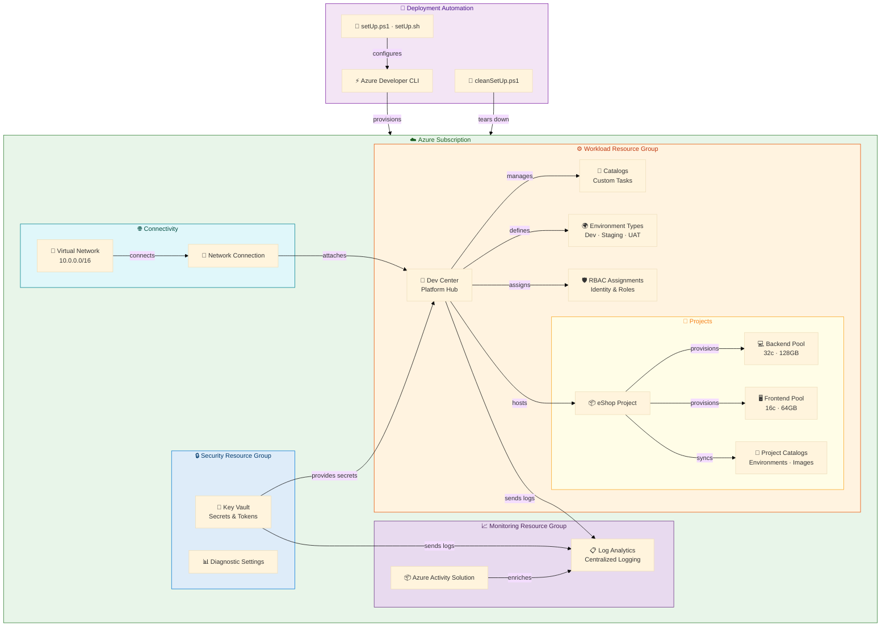

# DevExp-DevBox

**Microsoft Dev Box Accelerator** — an Infrastructure as Code (IaC) solution
that automates the provisioning of
[Microsoft Dev Box](https://learn.microsoft.com/en-us/azure/dev-box/overview-what-is-microsoft-dev-box)
environments on Azure using Bicep, Azure Developer CLI (`azd`), and YAML-driven
configuration.

## Overview

DevExp-DevBox provides a turnkey deployment accelerator for platform engineering
teams to deliver self-service developer workstations at scale. The accelerator
follows the
[Azure Landing Zone](https://learn.microsoft.com/en-us/azure/cloud-adoption-framework/ready/landing-zone/)
model, organizing resources into Security, Monitoring, and Workload resource
groups with role-based access control (RBAC), centralized secrets management,
and diagnostic logging.

### Key Capabilities

- **Declarative Configuration** — Define Dev Centers, projects, pools, catalogs,
  and environment types entirely through YAML configuration files
  ([infra/settings/workload/devcenter.yaml](infra/settings/workload/devcenter.yaml))
- **Azure Landing Zone Alignment** — Resources organized into Security,
  Monitoring, and Workload resource groups following Azure Cloud Adoption
  Framework best practices
  ([infra/settings/resourceOrganization/azureResources.yaml](infra/settings/resourceOrganization/azureResources.yaml))
- **Automated Secret Management** — Azure Key Vault provisioned with RBAC
  authorization, soft-delete, and purge protection for storing GitHub or Azure
  DevOps tokens
  ([infra/settings/security/security.yaml](infra/settings/security/security.yaml))
- **Multi-Project Support** — Configure multiple Dev Center projects, each with
  independent networking, identity, Dev Box pools, environment types, and
  catalogs
  ([infra/settings/workload/devcenter.yaml:91](infra/settings/workload/devcenter.yaml))
- **Cross-Platform Setup** — Automated environment setup via PowerShell
  (`setUp.ps1`) or Bash (`setUp.sh`) with GitHub and Azure DevOps integration
- **Centralized Monitoring** — Log Analytics workspace with diagnostic settings
  piped from Dev Center, Key Vault, and virtual network resources
  ([src/management/logAnalytics.bicep](src/management/logAnalytics.bicep))


```mermaid
---
config:
  theme: base
  themeVariables:
    fontSize: 14px
  flowchart:
    htmlLabels: true
---
%%{init: {'theme': 'base'}}%%
flowchart TB
    accTitle: DevExp-DevBox Architecture
    accDescr: Architecture diagram showing the Azure Dev Box Accelerator components organized by Azure Landing Zone resource groups

    subgraph SUB["☁️ Azure Subscription"]
        style SUB fill:#E8F5E9,stroke:#2E7D32,color:#1B5E20

        subgraph SEC["🔒 Security Resource Group"]
            style SEC fill:#DEECF9,stroke:#0078D4,color:#003A6C
            KV["🔑 Key Vault<br/>Secrets & Tokens"]
            SEC_DIAG["📊 Diagnostic Settings"]
        end

        subgraph MON["📈 Monitoring Resource Group"]
            style MON fill:#E8DAEF,stroke:#6C3483,color:#4A235A
            LA["📋 Log Analytics<br/>Centralized Logging"]
            SOL["📦 Azure Activity Solution"]
        end

        subgraph WRK["⚙️ Workload Resource Group"]
            style WRK fill:#FFF3E0,stroke:#E65100,color:#BF360C
            DC["🏢 Dev Center<br/>Platform Hub"]
            CAT["📂 Catalogs<br/>Custom Tasks"]
            ENV["🌍 Environment Types<br/>Dev · Staging · UAT"]
            RBAC["🛡️ RBAC Assignments<br/>Identity & Roles"]

            subgraph PROJ["📁 Projects"]
                style PROJ fill:#FFFDE7,stroke:#F9A825,color:#F57F17
                P1["📦 eShop Project"]
                POOL_BE["💻 Backend Pool<br/>32c · 128GB"]
                POOL_FE["🖥️ Frontend Pool<br/>16c · 64GB"]
                PCAT["📂 Project Catalogs<br/>Environments · Images"]
            end
        end

        subgraph NET["🌐 Connectivity"]
            style NET fill:#E0F7FA,stroke:#00838F,color:#004D40
            VNET["🔗 Virtual Network<br/>10.0.0.0/16"]
            NCONN["🔌 Network Connection"]
        end
    end

    subgraph SETUP["🚀 Deployment Automation"]
        style SETUP fill:#F3E5F5,stroke:#7B1FA2,color:#4A148C
        AZD["⚡ Azure Developer CLI"]
        PS1["📝 setUp.ps1 · setUp.sh"]
        CLEAN["🧹 cleanSetUp.ps1"]
    end

    PS1 -->|"configures"| AZD
    AZD -->|"provisions"| SUB
    DC -->|"sends logs"| LA
    KV -->|"sends logs"| LA
    SOL -->|"enriches"| LA
    DC -->|"manages"| CAT
    DC -->|"defines"| ENV
    DC -->|"assigns"| RBAC
    DC -->|"hosts"| P1
    P1 -->|"provisions"| POOL_BE
    P1 -->|"provisions"| POOL_FE
    P1 -->|"syncs"| PCAT
    NCONN -->|"attaches"| DC
    VNET -->|"connects"| NCONN
    KV -->|"provides secrets"| DC
    CLEAN -->|"tears down"| SUB
```

## Prerequisites

| Tool                                                                                                             | Purpose                                 | Install                             |
| ---------------------------------------------------------------------------------------------------------------- | --------------------------------------- | ----------------------------------- |
| [Azure CLI](https://learn.microsoft.com/en-us/cli/azure/install-azure-cli) (`az`)                                | Azure resource management               | `winget install Microsoft.AzureCLI` |
| [Azure Developer CLI](https://learn.microsoft.com/en-us/azure/developer/azure-developer-cli/install-azd) (`azd`) | Deployment orchestration                | `winget install Microsoft.Azd`      |
| [GitHub CLI](https://cli.github.com/) (`gh`)                                                                     | GitHub authentication (if using GitHub) | `winget install GitHub.cli`         |
| [PowerShell 5.1+](https://learn.microsoft.com/en-us/powershell/scripting/install/installing-powershell)          | Windows setup script                    | Pre-installed on Windows            |
| `bash` + `jq`                                                                                                    | Linux/macOS setup script                | Package manager                     |

**Azure permissions required:** Contributor and User Access Administrator roles
at the subscription level, as defined in
[devcenter.yaml:38-49](infra/settings/workload/devcenter.yaml).

## Getting Started

### 1. Clone the Repository

```bash
git clone https://github.com/Evilazaro/DevExp-DevBox.git
cd DevExp-DevBox
```

### 2. Authenticate with Azure

```bash
az login
azd auth login
```

### 3. Run the Setup Script

**Windows (PowerShell):**

```powershell
.\setUp.ps1 -EnvName "dev" -SourceControl "github"
```

**Linux / macOS (Bash):**

```bash
./setUp.sh -e "dev" -s "github"
```

The setup script performs the following steps (source:
[setUp.ps1:1-40](setUp.ps1), [setUp.sh:1-38](setUp.sh)):

1. Validates required CLI tool installations (`az`, `azd`, `gh` or ADO CLI)
2. Authenticates with the selected source control platform
3. Retrieves a personal access token for catalog synchronization
4. Configures `azd` environment variables (location, environment name, secret
   value)
5. Runs `azd provision` to deploy all Azure infrastructure

### 4. Verify Deployment

After provisioning completes, verify the deployed resources:

```bash
azd show
```

The deployment creates three resource groups following the naming convention
`{name}-{environment}-{location}-RG` (source:
[main.bicep:42-46](infra/main.bicep)):

| Resource Group        | Contents                                                 |
| --------------------- | -------------------------------------------------------- |
| `devexp-security-*`   | Azure Key Vault with RBAC authorization                  |
| `devexp-monitoring-*` | Log Analytics workspace with Azure Activity solution     |
| `devexp-workload-*`   | Dev Center, projects, pools, catalogs, environment types |

## Configuration

All infrastructure settings are driven by YAML configuration files under
[infra/settings/](infra/settings/). This design enables environment-specific
customization without modifying Bicep templates.

### Resource Organization

Defined in
[infra/settings/resourceOrganization/azureResources.yaml](infra/settings/resourceOrganization/azureResources.yaml):

```yaml
workload:
  create: true
  name: devexp-workload
  tags:
    environment: dev
    project: Contoso-DevExp-DevBox

security:
  create: true
  name: devexp-security

monitoring:
  create: true
  name: devexp-monitoring
```

### Dev Center Configuration

Defined in
[infra/settings/workload/devcenter.yaml](infra/settings/workload/devcenter.yaml):

| Setting                                | Value              | Description                               |
| -------------------------------------- | ------------------ | ----------------------------------------- |
| `name`                                 | `devexp-devcenter` | Dev Center instance name                  |
| `catalogItemSyncEnableStatus`          | `Enabled`          | Syncs catalog items from Git repositories |
| `microsoftHostedNetworkEnableStatus`   | `Enabled`          | Enables Microsoft-hosted networking       |
| `installAzureMonitorAgentEnableStatus` | `Enabled`          | Installs Azure Monitor agent on Dev Boxes |
| `identity.type`                        | `SystemAssigned`   | Managed identity for the Dev Center       |

### Projects

Each project under `projects:` in
[devcenter.yaml](infra/settings/workload/devcenter.yaml) supports:

- **Networking** — Managed or unmanaged virtual networks with configurable
  address spaces
- **Identity** — System-assigned managed identity with per-project RBAC roles
- **Dev Box Pools** — Role-specific VM configurations (e.g., `backend-engineer`
  with 32 cores, `frontend-engineer` with 16 cores)
- **Environment Types** — Deployment stages (`dev`, `staging`, `UAT`)
- **Catalogs** — Git-based repositories for environment definitions and image
  definitions

### Security Configuration

Defined in
[infra/settings/security/security.yaml](infra/settings/security/security.yaml):

| Setting                     | Value  |
| --------------------------- | ------ |
| `enablePurgeProtection`     | `true` |
| `enableSoftDelete`          | `true` |
| `softDeleteRetentionInDays` | `7`    |
| `enableRbacAuthorization`   | `true` |

## Project Structure

```text
DevExp-DevBox/
├── azure.yaml                  # azd config (Linux/macOS)
├── azure-pwh.yaml              # azd config (Windows/PowerShell)
├── setUp.ps1                   # Windows setup automation (758 lines)
├── setUp.sh                    # Linux/macOS setup automation (688 lines)
├── cleanSetUp.ps1              # Teardown and cleanup script
├── infra/
│   ├── main.bicep              # Subscription-scoped entry point
│   ├── main.parameters.json    # Parameter file for azd
│   └── settings/
│       ├── resourceOrganization/
│       │   └── azureResources.yaml    # Landing zone resource groups
│       ├── security/
│       │   └── security.yaml          # Key Vault configuration
│       └── workload/
│           └── devcenter.yaml         # Dev Center, projects, pools
└── src/
    ├── connectivity/
    │   ├── connectivity.bicep         # Network orchestrator
    │   ├── vnet.bicep                 # Virtual network resource
    │   ├── networkConnection.bicep    # Dev Center network attachment
    │   └── resourceGroup.bicep        # Network resource group
    ├── identity/
    │   ├── devCenterRoleAssignment.bicep         # Subscription-level RBAC
    │   ├── devCenterRoleAssignmentRG.bicep       # Resource group-level RBAC
    │   ├── orgRoleAssignment.bicep               # Org role assignments
    │   ├── projectIdentityRoleAssignment.bicep   # Project identity roles
    │   └── keyVaultAccess.bicep                  # Key Vault access policies
    ├── management/
    │   └── logAnalytics.bicep         # Log Analytics workspace
    ├── security/
    │   ├── security.bicep             # Security orchestrator
    │   ├── keyVault.bicep             # Key Vault resource
    │   └── secret.bicep               # Key Vault secret
    └── workload/
        ├── workload.bicep             # Workload orchestrator
        ├── core/
        │   ├── devCenter.bicep        # Dev Center resource & RBAC
        │   ├── catalog.bicep          # Catalog configuration
        │   └── environmentType.bicep  # Environment type definitions
        └── project/
            ├── project.bicep              # Project orchestrator
            ├── projectPool.bicep          # Dev Box pool definitions
            ├── projectCatalog.bicep       # Project-level catalogs
            └── projectEnvironmentType.bicep  # Project env types
```

## Supported Azure Regions

The deployment supports the following regions, as defined in
[main.bicep:6-22](infra/main.bicep):

`eastus` · `eastus2` · `westus` · `westus2` · `westus3` · `centralus` ·
`northeurope` · `westeurope` · `southeastasia` · `australiaeast` · `japaneast` ·
`uksouth` · `canadacentral` · `swedencentral` · `switzerlandnorth` ·
`germanywestcentral`

## Cleanup

To tear down all deployed resources and clean up credentials:

```powershell
.\cleanSetUp.ps1 -EnvName "dev" -Location "eastus2"
```

This script removes (source: [cleanSetUp.ps1:5-16](cleanSetUp.ps1)):

- Azure subscription-level deployments
- User role assignments
- Service principals and app registrations
- GitHub secrets for Azure credentials
- Azure resource groups

## Contributing

See [CONTRIBUTING.md](CONTRIBUTING.md) for guidelines on branching, PR
requirements, engineering standards, and the issue management workflow. The
project uses a product-oriented delivery model with Epics, Features, and Tasks
tracked through GitHub Issues.

## License

This project is licensed under the [MIT License](LICENSE).

Copyright (c) 2025 Evilázaro Alves.
