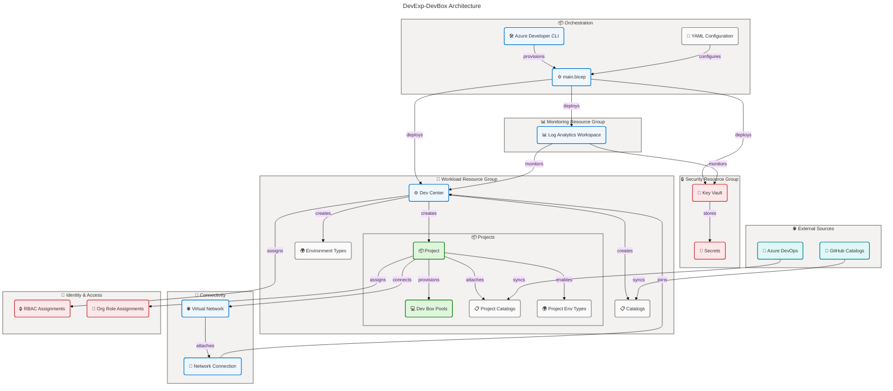

# DevExp-DevBox


## 📖 Overview

**Overview**

DevExp-DevBox is a production-ready **Azure Dev Box Adoption & Deployment
Accelerator** that provisions and configures a complete **Azure Dev Center
landing zone** through modular, **configuration-driven Infrastructure-as-Code**.
It enables platform engineering teams to deliver **self-service developer
workstations** at enterprise scale with built-in security, monitoring, and
network isolation.

The accelerator uses a **declarative YAML configuration model** validated by
JSON Schemas, deploys through the **Azure Developer CLI** (`azd`), and
implements **Azure Landing Zone principles** with resource group segmentation
across workload, security, and monitoring boundaries. Cross-platform setup
scripts for PowerShell and Bash automate authentication, token management, and
environment initialization so that teams can go from zero to a fully provisioned
Dev Center in a single command.

## 📑 Table of Contents

- [📖 Overview](#-overview)
- [🏗️ Architecture](#️-architecture)
- [✨ Features](#-features)
- [📋 Requirements](#-requirements)
- [🚀 Quick Start](#-quick-start)
- [💻 Usage](#-usage)
- [⚙️ Configuration](#️-configuration)
- [🤝 Contributing](#-contributing)
- [📄 License](#-license)

## 🏗️ Architecture

**Overview**

The system follows a **modular, layered architecture** orchestrated by a root
Bicep template (`infra/main.bicep`) that deploys resources across **three
dedicated resource groups** aligned with Azure Landing Zone principles. Each
layer — monitoring, security, and workload — is encapsulated in its own Bicep
module with **clear input/output contracts**, while YAML configuration files
drive all business-level settings.

The workload layer provisions the Azure Dev Center and iterates over project
definitions to create **project-scoped resources** including Dev Box pools,
catalogs, environment types, network connections, and RBAC assignments. Identity
and connectivity modules are shared across projects, ensuring **consistent
governance** without duplication.


```mermaid
---
title: "DevExp-DevBox Architecture"
config:
  theme: base
  look: classic
  layout: dagre
  themeVariables:
    fontSize: "14px"
  flowchart:
    htmlLabels: true
---
flowchart TB
    accTitle: DevExp-DevBox Architecture
    accDescr: Shows the layered infrastructure architecture with orchestration, monitoring, security, workload, connectivity, and identity modules deployed across dedicated resource groups

    %% ═══════════════════════════════════════════════════════════════════════════
    %% AZURE / FLUENT ARCHITECTURE PATTERN v1.1
    %% (Semantic + Structural + Font + Accessibility Governance)
    %% ═══════════════════════════════════════════════════════════════════════════
    %% PHASE 1 - FLUENT UI: All styling uses approved Fluent UI palette only
    %% PHASE 2 - GROUPS: Every subgraph has semantic color via style directive
    %% PHASE 3 - COMPONENTS: Every node has semantic classDef + icon prefix
    %% PHASE 4 - ACCESSIBILITY: accTitle/accDescr present, WCAG AA contrast
    %% PHASE 5 - STANDARD: Governance block present, classDefs centralized
    %% ═══════════════════════════════════════════════════════════════════════════

    subgraph orchestration["📦 Orchestration"]
        direction TB
        main("⚙️ main.bicep"):::core
        config("📁 YAML Configuration"):::neutral
        azd("🛠️ Azure Developer CLI"):::core
    end

    subgraph monitoringRG["📊 Monitoring Resource Group"]
        direction TB
        logAnalytics("📊 Log Analytics Workspace"):::core
    end

    subgraph securityRG["🔒 Security Resource Group"]
        direction TB
        keyVault("🔐 Key Vault"):::danger
        secrets("🔑 Secrets"):::danger
    end

    subgraph workloadRG["🏢 Workload Resource Group"]
        direction TB
        devCenter("⚙️ Dev Center"):::core
        catalog("📋 Catalogs"):::neutral
        envTypes("🌍 Environment Types"):::neutral

        subgraph projects["📦 Projects"]
            direction TB
            project("📦 Project"):::success
            pools("💻 Dev Box Pools"):::success
            projCatalog("📋 Project Catalogs"):::neutral
            projEnvType("🌍 Project Env Types"):::neutral
        end
    end

    subgraph connectivity["🔌 Connectivity"]
        direction TB
        vnet("🌐 Virtual Network"):::core
        netConn("🔌 Network Connection"):::core
    end

    subgraph identity["🔑 Identity & Access"]
        direction TB
        rbac("🔒 RBAC Assignments"):::danger
        orgRoles("👥 Org Role Assignments"):::danger
    end

    subgraph external["🌐 External Sources"]
        direction TB
        github("🐙 GitHub Catalogs"):::external
        ado("🔗 Azure DevOps"):::external
    end

    azd -->|provisions| main
    config -->|configures| main
    main -->|deploys| logAnalytics
    main -->|deploys| keyVault
    main -->|deploys| devCenter
    keyVault -->|stores| secrets
    devCenter -->|creates| catalog
    devCenter -->|creates| envTypes
    devCenter -->|creates| project
    project -->|provisions| pools
    project -->|attaches| projCatalog
    project -->|enables| projEnvType
    project -->|connects| vnet
    vnet -->|attaches| netConn
    netConn -->|joins| devCenter
    devCenter -->|assigns| rbac
    project -->|assigns| orgRoles
    github -->|syncs| catalog
    ado -->|syncs| projCatalog
    logAnalytics -->|monitors| devCenter
    logAnalytics -->|monitors| keyVault

    %% Centralized semantic classDefs
    classDef neutral fill:#FAFAFA,stroke:#8A8886,stroke-width:2px,color:#323130
    classDef core fill:#EFF6FC,stroke:#0078D4,stroke-width:2px,color:#323130
    classDef success fill:#DFF6DD,stroke:#107C10,stroke-width:2px,color:#323130
    classDef danger fill:#FDE7E9,stroke:#D13438,stroke-width:2px,color:#323130
    classDef external fill:#E0F7F7,stroke:#038387,stroke-width:2px,color:#323130

    style orchestration fill:#F3F2F1,stroke:#8A8886,stroke-width:2px,color:#323130
    style monitoringRG fill:#F3F2F1,stroke:#8A8886,stroke-width:2px,color:#323130
    style securityRG fill:#F3F2F1,stroke:#8A8886,stroke-width:2px,color:#323130
    style workloadRG fill:#F3F2F1,stroke:#8A8886,stroke-width:2px,color:#323130
    style projects fill:#F3F2F1,stroke:#8A8886,stroke-width:2px,color:#323130
    style connectivity fill:#F3F2F1,stroke:#8A8886,stroke-width:2px,color:#323130
    style identity fill:#F3F2F1,stroke:#8A8886,stroke-width:2px,color:#323130
    style external fill:#F3F2F1,stroke:#8A8886,stroke-width:2px,color:#323130
```

**Component Roles:**

| Component                  | Description                                                                           |
| -------------------------- | ------------------------------------------------------------------------------------- |
| ⚙️ **main.bicep**          | Root orchestrator that deploys all resource groups and modules at subscription scope  |
| 📁 **YAML Configuration**  | Declarative settings for resource organization, security, and workload definitions    |
| 🛠️ **Azure Developer CLI** | Deployment tool that runs preprovision hooks and provisions infrastructure            |
| 📊 **Log Analytics**       | Centralized monitoring workspace with diagnostic settings for all resources           |
| 🔐 **Key Vault**           | Secrets management with RBAC authorization, soft delete, and purge protection         |
| ⚙️ **Dev Center**          | Core workload resource managing catalogs, environment types, and projects             |
| 📦 **Projects**            | Dev Center projects with pools, catalogs, environment types, and network connectivity |
| 💻 **Dev Box Pools**       | VM-backed developer workstations with configurable SKUs and image definitions         |
| 🔌 **Network Connection**  | Azure AD-joined network connections attaching VNets to Dev Center                     |
| 🔒 **RBAC Assignments**    | Role assignments at subscription, resource group, and project scopes                  |

## ✨ Features

**Overview**

DevExp-DevBox provides a comprehensive set of capabilities designed for platform
engineering teams that need to automate developer workstation provisioning at
scale. The accelerator handles the full lifecycle from infrastructure deployment
through project configuration, with governance built into every layer.

Each feature is implemented through **modular Bicep templates** and validated
YAML configuration, enabling teams to customize behavior without modifying
infrastructure code. The architecture supports **multiple projects**, each with
independent networking, identity, and catalog configurations.

| Feature                       | Description                                                                                                                                   |
| ----------------------------- | --------------------------------------------------------------------------------------------------------------------------------------------- |
| 🚀 Cross-Platform Deployment  | Deploy the entire landing zone with a single `azd provision` command via PowerShell or Bash setup scripts with secure token management        |
| 🔒 Enterprise Security & RBAC | Key Vault with RBAC authorization, soft delete, purge protection, managed identities, and role assignments at subscription and project scopes |
| 📊 Centralized Monitoring     | Log Analytics workspace with diagnostic settings and Azure Monitor agent across all deployed resources                                        |
| 🌐 Network Isolation          | Per-project virtual networks with subnet segmentation and Azure AD-joined network connections                                                 |
| ⚙️ Configuration-Driven       | YAML-based configuration with JSON Schema validation for resource organization, security, and workload definitions                            |
| 📦 Multi-Project Support      | Deploy multiple Dev Center projects, each with independent pools, catalogs, environment types, and network connectivity                       |
| 📋 Catalog Integration        | GitHub and Azure DevOps Git catalog support with scheduled sync for tasks, environments, and image definitions                                |

## 📋 Requirements

**Overview**

Before deploying DevExp-DevBox, ensure your environment meets the following
prerequisites. The accelerator requires Azure CLI, Azure Developer CLI, and a
source control CLI (GitHub CLI or Azure DevOps CLI) for authentication and
provisioning. An active Azure subscription with sufficient permissions to create
resources at the subscription scope is required.

The setup scripts validate all prerequisites automatically and provide clear
error messages when dependencies are missing. Platform-specific instructions are
available for both Windows (PowerShell) and Linux/macOS (Bash) environments.

> [!IMPORTANT]  
> You must have **Owner** or **Contributor + User Access Administrator**
> permissions on your Azure subscription to deploy this accelerator, as it
> creates resource groups and role assignments at the subscription scope.

| Requirement                    | Version | Purpose                                                     |
| ------------------------------ | ------- | ----------------------------------------------------------- |
| ☁️ Azure Subscription          | Active  | Target subscription for resource deployment                 |
| 🛠️ Azure CLI                   | >= 2.50 | Azure authentication and resource management                |
| 🛠️ Azure Developer CLI (`azd`) | >= 1.0  | Infrastructure provisioning and environment management      |
| 🐙 GitHub CLI (`gh`)           | >= 2.0  | GitHub authentication and token retrieval (if using GitHub) |
| 🔗 Azure DevOps CLI            | >= 0.26 | Azure DevOps authentication (if using Azure DevOps)         |
| 💻 PowerShell                  | >= 5.1  | Setup script execution on Windows                           |
| 🐧 Bash                        | >= 4.0  | Setup script execution on Linux/macOS                       |
| 📦 Bicep CLI                   | >= 0.22 | Infrastructure-as-Code template compilation                 |

## 🚀 Quick Start

**Overview**

The accelerator is deployed exclusively through the Azure Developer CLI (`azd`).
Running `azd provision` triggers a **`preprovision` hook** that executes the
platform-appropriate setup script (`setUp.sh` on Linux/macOS, or via
`azure-pwh.yaml` on Windows). The hook validates all prerequisites,
authenticates with Azure and your source control platform, **securely stores
tokens** in the `azd` environment, and then provisions the entire landing zone —
all in a **single command**.

> [!WARNING]  
> Provisioning creates Azure resources that incur costs. Review the YAML
> configuration in `infra/settings/` before running `azd provision`. Use
> `cleanSetUp.ps1` to tear down all resources when they are no longer needed.

**1. Clone the repository**

```bash
git clone https://github.com/Evilazaro/DevExp-DevBox.git
cd DevExp-DevBox
```

**Expected output:**

```text
Cloning into 'DevExp-DevBox'...
remote: Enumerating objects: done.
remote: Counting objects: 100% done.
remote: Compressing objects: 100% done.
Receiving objects: 100% done.
Resolving deltas: 100% done.
```

**2. Authenticate with Azure and your source control platform**

```bash
az login
azd auth login
gh auth login          # if using GitHub
az devops login        # if using Azure DevOps
```

**Expected output:**

```text
A web browser has been opened at https://login.microsoftonline.com/...
You have logged in. Now let us find all the subscriptions...
Logged in to Azure.
```

**3. Provision the landing zone (Linux/macOS)**

The `azure.yaml` configuration file defines a `preprovision` hook that
automatically runs `setUp.sh` before Bicep deployment:

```bash
azd provision -e dev
```

**Expected output:**

```text
ℹ️ Starting Dev Box environment setup
✅ All required tools are available
✅ Azure authentication confirmed
✅ GitHub CLI authenticated
🔐 GitHub token stored securely in memory
✅ Azure Developer CLI environment 'dev' initialized successfully
Provisioning Azure resources (azd provision)
(✓) Done: Resource group: devexp-monitoring-dev-eastus2-RG
(✓) Done: Resource group: devexp-security-dev-eastus2-RG
(✓) Done: Resource group: devexp-workload-dev-eastus2-RG

SUCCESS: Your application was provisioned in Azure.
```

**3. Provision the landing zone (Windows)**

On Windows, rename `azure-pwh.yaml` to `azure.yaml` (or use the `-config` flag)
to use the PowerShell-based hook:

```powershell
Copy-Item azure-pwh.yaml azure.yaml -Force
azd provision -e dev
```

**Expected output:**

```text
SOURCE_CONTROL_PLATFORM is not set. Setting it to 'github' by default.
✅ Prerequisites validated
✅ Azure authentication confirmed
🔐 GitHub token stored securely in memory
Provisioning Azure resources (azd provision)
(✓) Done: Resource group: devexp-monitoring-dev-eastus2-RG
(✓) Done: Resource group: devexp-security-dev-eastus2-RG
(✓) Done: Resource group: devexp-workload-dev-eastus2-RG

SUCCESS: Your application was provisioned in Azure.
```

**4. Verify deployed resources**

```bash
azd env get-values
```

**Expected output:**

```text
AZURE_DEV_CENTER_NAME="devexp-devcenter-dev-eastus2"
AZURE_KEY_VAULT_NAME="contoso-xxxxxxx-kv"
AZURE_KEY_VAULT_ENDPOINT="https://contoso-xxxxxxx-kv.vault.azure.net/"
AZURE_LOG_ANALYTICS_WORKSPACE_NAME="devexp-monitoring-xxxxxxx"
AZURE_DEV_CENTER_PROJECTS=["eShop"]
```

**5. Clean up resources (when no longer needed)**

```powershell
.\cleanSetUp.ps1 -EnvName "dev" -Location "eastus2"
```

**Expected output:**

```text
✅ Removing subscription deployments...
✅ Cleaning up role assignments...
✅ Removing GitHub secrets...
✅ Deleting resource groups...
✅ Cleanup complete
```

## 💻 Usage

**Overview**

All infrastructure changes follow a **single workflow**: edit the YAML
configuration under `infra/settings/`, then run `azd provision` to apply. The
Bicep templates read configuration at deployment time with
**`loadYamlContent()`**, so every feature — projects, pools, catalogs,
environment types, networking, identity, security, and monitoring — is **managed
declaratively**. Developers access their workstations through the Azure
Developer Portal or Azure CLI after provisioning.

**Add a new Dev Center project**

Append a new entry to the `projects` array in
`infra/settings/workload/devcenter.yaml`. Each project gets its own pools,
catalogs, environment types, network, and RBAC assignments:

```yaml
projects:
  - name: 'payments'
    description: 'Payments service project'
    network:
      name: payments
      create: true
      resourceGroupName: 'payments-connectivity-RG'
      virtualNetworkType: Managed
      addressPrefixes:
        - 10.1.0.0/16
      subnets:
        - name: payments-subnet
          properties:
            addressPrefix: 10.1.1.0/24
      tags:
        environment: dev
        division: Platforms
        team: DevExP
        project: DevExP-DevBox
        costCenter: IT
        owner: Contoso
        resources: Network
    identity:
      type: SystemAssigned
      roleAssignments:
        - azureADGroupId: '<your-azure-ad-group-id>'
          azureADGroupName: 'Payments Developers'
          azureRBACRoles:
            - name: 'Dev Box User'
              id: '45d50f46-0b78-4001-a660-4198cbe8cd05'
              scope: Project
            - name: 'Deployment Environment User'
              id: '18e40d4e-8d2e-438d-97e1-9528336e149c'
              scope: Project
    pools:
      - name: 'backend-engineer'
        imageDefinitionName: 'payments-backend'
        vmSku: general_i_32c128gb512ssd_v2
      - name: 'frontend-engineer'
        imageDefinitionName: 'payments-frontend'
        vmSku: general_i_16c64gb256ssd_v2
    environmentTypes:
      - name: 'dev'
        deploymentTargetId: ''
      - name: 'staging'
        deploymentTargetId: ''
    catalogs:
      - name: 'environments'
        type: environmentDefinition
        sourceControl: gitHub
        visibility: private
        uri: 'https://github.com/contoso/payments.git'
        branch: 'main'
        path: '/.devcenter/environments'
      - name: 'devboxImages'
        type: imageDefinition
        sourceControl: gitHub
        visibility: private
        uri: 'https://github.com/contoso/payments.git'
        branch: 'main'
        path: '/.devcenter/imageDefinitions'
    tags:
      environment: dev
      division: Platforms
      team: DevExP
      project: DevExP-DevBox
      costCenter: IT
      owner: Contoso
      resources: Project
```

**Expected output:** _(YAML updated — run `azd provision` to deploy)_

**Add a Dev Box pool to an existing project**

Append a new pool entry under the target project's `pools` array in
`infra/settings/workload/devcenter.yaml`:

```yaml
pools:
  - name: 'data-engineer'
    imageDefinitionName: 'eShop-data-engineer'
    vmSku: general_i_32c128gb512ssd_v2
```

**Expected output:** _(YAML updated — run `azd provision` to deploy)_

**Attach a catalog from GitHub or Azure DevOps**

Dev Center-level catalogs go under the top-level `catalogs` key. Project-level
catalogs go under each project's `catalogs` array. Both support `gitHub` and
`adoGit` source control types:

```yaml
catalogs:
  - name: 'shared-tasks'
    type: gitHub
    visibility: public
    uri: 'https://github.com/microsoft/devcenter-catalog.git'
    branch: 'main'
    path: './Tasks'
```

**Expected output:** _(YAML updated — run `azd provision` to deploy)_

**Configure environment types**

Environment types define the SDLC stages available for Azure Deployment
Environments. Add or modify entries under the top-level `environmentTypes` key
or within each project's `environmentTypes` array:

```yaml
environmentTypes:
  - name: 'dev'
    deploymentTargetId: ''
  - name: 'staging'
    deploymentTargetId: ''
  - name: 'prod'
    deploymentTargetId: '/subscriptions/<prod-subscription-id>'
```

**Expected output:** _(YAML updated — run `azd provision` to deploy)_

**Apply any configuration change**

After editing any YAML file under `infra/settings/`, deploy the changes:

```bash
azd provision -e dev
```

**Expected output:**

```text
Provisioning Azure resources (azd provision)
(✓) Done: Resource group: payments-connectivity-RG
(✓) Done: Project: payments
(✓) Done: Pool: backend-engineer
(✓) Done: Pool: frontend-engineer

SUCCESS: Your application was provisioned in Azure.
```

> [!NOTE] Dev Box pools may take several minutes to become available after
> provisioning as image synchronization and network attachment complete in the
> background.

## ⚙️ Configuration

**Overview**

All infrastructure behavior is driven by **three YAML configuration files**
located under `infra/settings/`. Each file has a corresponding **JSON Schema**
that validates structure and values before deployment. The Bicep templates use
the `loadYamlContent()` function to read these files at deployment time, so
changes take effect on the next `azd provision` run without modifying any
template code.

The `azd` environment also requires three parameters managed through
`infra/main.parameters.json`: `AZURE_ENV_NAME` (environment name used in
resource naming), `AZURE_LOCATION` (target Azure region), and `KEY_VAULT_SECRET`
(source control token stored securely in Key Vault). These are populated
automatically by the `preprovision` hook.

> [!TIP]  
> Each YAML file references a co-located JSON Schema (`$schema` directive at the
> top of the file). Validate your changes against the schema before deploying to
> catch naming violations, missing required fields, and invalid values early.

| File                                                         | Description                                                                                                    |
| ------------------------------------------------------------ | -------------------------------------------------------------------------------------------------------------- |
| 📁 `infra/settings/resourceOrganization/azureResources.yaml` | Resource group names, descriptions, creation flags, and governance tags                                        |
| 🔒 `infra/settings/security/security.yaml`                   | Key Vault creation flag, vault settings, secret configuration, and governance tags                             |
| ⚙️ `infra/settings/workload/devcenter.yaml`                  | Dev Center name, identity, RBAC, catalogs, environment types, projects, pools, networking, and governance tags |

---

**Resource Organization (`azureResources.yaml`):**

Defines the three resource groups that segment the landing zone by function.
Each group can be toggled on or off with the `create` flag and tagged
independently for cost management and governance. All three groups (`workload`,
`security`, `monitoring`) are required by the schema. Each group must include
`create`, `name`, `description`, and `tags`.

| Parameter                   | Type      | Description                                                            | Required | Default             |
| --------------------------- | --------- | ---------------------------------------------------------------------- | -------- | ------------------- |
| 📦 `workload.create`        | `boolean` | Whether to create the workload resource group                          | ✅       | `true`              |
| 📦 `workload.name`          | `string`  | Workload resource group name (1–90 chars, alphanumeric, `.`, `_`, `-`) | ✅       | `devexp-workload`   |
| 📦 `workload.description`   | `string`  | Purpose of the workload resource group                                 | ✅       | —                   |
| 🔒 `security.create`        | `boolean` | Whether to create the security resource group                          | ✅       | `true`              |
| 🔒 `security.name`          | `string`  | Security resource group name                                           | ✅       | `devexp-security`   |
| 🔒 `security.description`   | `string`  | Purpose of the security resource group                                 | ✅       | —                   |
| 📊 `monitoring.create`      | `boolean` | Whether to create the monitoring resource group                        | ✅       | `true`              |
| 📊 `monitoring.name`        | `string`  | Monitoring resource group name                                         | ✅       | `devexp-monitoring` |
| 📊 `monitoring.description` | `string`  | Purpose of the monitoring resource group                               | ✅       | —                   |
| 🏷️ `*.tags`                 | `object`  | Governance tags applied to each resource group                         | ✅       | See governance tags |

---

**Security (`security.yaml`):**

Configures the Azure Key Vault used to store source control tokens and other
sensitive values. All settings follow Azure security best practices by default.
The `create` flag controls whether a new Key Vault is provisioned or an existing
one is used.

| Parameter                               | Type      | Description                                                            | Required | Default             |
| --------------------------------------- | --------- | ---------------------------------------------------------------------- | -------- | ------------------- |
| ✅ `create`                             | `boolean` | Whether to create a new Key Vault or use an existing one               | ✅       | `true`              |
| 🔐 `keyVault.name`                      | `string`  | Globally unique Key Vault name (3–24 chars, alphanumeric and hyphens)  | ✅       | `contoso`           |
| 📝 `keyVault.description`               | `string`  | Purpose of this Key Vault                                              |          | —                   |
| 🔑 `keyVault.secretName`                | `string`  | Name of the secret storing the source control token (1–127 chars)      |          | `gha-token`         |
| 🔒 `keyVault.enablePurgeProtection`     | `boolean` | Prevent permanent deletion of vault (irreversible once enabled)        |          | `true`              |
| 🗑️ `keyVault.enableSoftDelete`          | `boolean` | Enable soft delete for recovery of deleted secrets                     |          | `true`              |
| 📅 `keyVault.softDeleteRetentionInDays` | `integer` | Retention period for soft-deleted items (7–90 days)                    |          | `90`                |
| 🔑 `keyVault.enableRbacAuthorization`   | `boolean` | Use Azure RBAC for data plane authorization instead of access policies |          | `true`              |
| 🏷️ `keyVault.tags`                      | `object`  | Governance tags for the Key Vault resource                             | ✅       | See governance tags |

---

**Workload — Dev Center Core Settings (`devcenter.yaml`):**

The largest configuration surface. Defines the Dev Center resource, its managed
identity, RBAC assignments, global catalogs, environment types, and one or more
projects — each with its own pools, catalogs, networking, identity, and tags.

| Parameter                                 | Type     | Description                                                                   | Required | Default             |
| ----------------------------------------- | -------- | ----------------------------------------------------------------------------- | -------- | ------------------- |
| ⚙️ `name`                                 | `string` | Dev Center resource name (1–63 chars)                                         | ✅       | `devexp-devcenter`  |
| 🔄 `catalogItemSyncEnableStatus`          | `string` | Automatic catalog synchronization (`Enabled` / `Disabled`)                    |          | `Enabled`           |
| 🌐 `microsoftHostedNetworkEnableStatus`   | `string` | Microsoft-hosted networking for Dev Boxes (`Enabled` / `Disabled`)            |          | `Enabled`           |
| 📊 `installAzureMonitorAgentEnableStatus` | `string` | Install Azure Monitor agent on provisioned Dev Boxes (`Enabled` / `Disabled`) |          | `Enabled`           |
| 🏷️ `tags`                                 | `object` | Top-level governance tags for the Dev Center resource                         |          | See governance tags |

**Workload — Dev Center Identity & RBAC (`identity`):**

Controls how the Dev Center authenticates with Azure and what permissions it
holds. The managed identity is used to access Key Vault secrets, manage
subscriptions, and assign roles. Organizational role types define Azure AD
group-based RBAC bindings for platform teams (e.g., Dev Managers who administer
projects but do not consume Dev Boxes).

| Parameter                                                           | Type     | Description                                                                                      | Required | Default          |
| ------------------------------------------------------------------- | -------- | ------------------------------------------------------------------------------------------------ | -------- | ---------------- |
| 🔑 `identity.type`                                                  | `string` | Managed identity type: `SystemAssigned`, `UserAssigned`, `SystemAssignedUserAssigned`, or `None` | ✅       | `SystemAssigned` |
| 🔒 `identity.roleAssignments.devCenter[].id`                        | `string` | GUID of the Azure RBAC role definition                                                           | ✅       | —                |
| 🔒 `identity.roleAssignments.devCenter[].name`                      | `string` | Display name of the RBAC role (e.g., `Contributor`)                                              | ✅       | —                |
| 🔒 `identity.roleAssignments.devCenter[].scope`                     | `string` | Role scope: `Subscription`, `ResourceGroup`, `Tenant`, or `ManagementGroup`                      | ✅       | —                |
| 👥 `identity.roleAssignments.orgRoleTypes[].type`                   | `string` | Organizational role type (e.g., `DevManager`, `ProjectAdmin`)                                    | ✅       | —                |
| 👥 `identity.roleAssignments.orgRoleTypes[].azureADGroupId`         | `string` | Azure AD group object ID (GUID)                                                                  | ✅       | —                |
| 👥 `identity.roleAssignments.orgRoleTypes[].azureADGroupName`       | `string` | Azure AD group display name                                                                      | ✅       | —                |
| 👥 `identity.roleAssignments.orgRoleTypes[].azureRBACRoles[].name`  | `string` | RBAC role display name (e.g., `DevCenter Project Admin`)                                         |          | —                |
| 👥 `identity.roleAssignments.orgRoleTypes[].azureRBACRoles[].id`    | `string` | RBAC role definition GUID                                                                        |          | —                |
| 👥 `identity.roleAssignments.orgRoleTypes[].azureRBACRoles[].scope` | `string` | Role scope (e.g., `ResourceGroup`)                                                               |          | —                |

**Workload — Dev Center Catalogs (`catalogs[]`):**

Dev Center-level catalogs attach Git repositories containing reusable tasks,
environment definitions, or image definitions. Catalogs sync on a scheduled
basis. Private repositories require a source control token stored in Key Vault.

| Parameter                  | Type     | Description                                                           | Required | Default   |
| -------------------------- | -------- | --------------------------------------------------------------------- | -------- | --------- |
| 📋 `catalogs[].name`       | `string` | Unique catalog name within the Dev Center                             | ✅       | —         |
| 📋 `catalogs[].type`       | `string` | Repository type: `gitHub` or `adoGit`                                 | ✅       | —         |
| 👁️ `catalogs[].visibility` | `string` | Repository visibility: `public` or `private` (private requires token) |          | `private` |
| 🔗 `catalogs[].uri`        | `string` | Git repository URI                                                    | ✅       | —         |
| 🌿 `catalogs[].branch`     | `string` | Branch to sync catalog content from                                   |          | `main`    |
| 📁 `catalogs[].path`       | `string` | Path within the repository to catalog content                         |          | —         |

**Workload — Dev Center Environment Types (`environmentTypes[]`):**

Environment types represent SDLC stages available at the Dev Center level.
Projects inherit from these types and can scope them further. Each type can
optionally target a specific Azure subscription for deployment.

| Parameter                                  | Type     | Description                                                              | Required | Default |
| ------------------------------------------ | -------- | ------------------------------------------------------------------------ | -------- | ------- |
| 🌍 `environmentTypes[].name`               | `string` | Environment type name (e.g., `dev`, `staging`, `UAT`, `prod`)            | ✅       | —       |
| 🎯 `environmentTypes[].deploymentTargetId` | `string` | Target Azure subscription ID; empty string uses the default subscription |          | `""`    |

---

**Workload — Projects (`devcenter.yaml` → `projects[]`):**

Each project is an independent unit within the Dev Center with its own
networking, identity, pools, catalogs, environment types, and tags. Only `name`
is required — all other properties are optional and default to sensible values.

_Project Core:_

| Parameter        | Type     | Description                               | Required | Default             |
| ---------------- | -------- | ----------------------------------------- | -------- | ------------------- |
| 📦 `name`        | `string` | Unique project name within the Dev Center | ✅       | —                   |
| 📝 `description` | `string` | Human-readable project description        |          | —                   |
| 🏷️ `tags`        | `object` | Project-level governance tags             |          | See governance tags |

_Project Network (`network`):_

Controls virtual network configuration for Dev Box connectivity within the
project. When `virtualNetworkType` is `Managed`, Microsoft handles the network
infrastructure. When `Unmanaged`, the accelerator provisions a customer-managed
VNet with the specified address space and subnets in a dedicated resource group.

| Parameter                                       | Type      | Description                                                    | Required | Default             |
| ----------------------------------------------- | --------- | -------------------------------------------------------------- | -------- | ------------------- |
| 🌐 `network.name`                               | `string`  | Virtual network name                                           | ✅       | —                   |
| 🌐 `network.create`                             | `boolean` | Whether to create a new VNet or use an existing one            | ✅       | `true`              |
| 🌐 `network.resourceGroupName`                  | `string`  | Resource group for network resources                           |          | —                   |
| 🌐 `network.virtualNetworkType`                 | `string`  | `Managed` (Microsoft-hosted) or `Unmanaged` (customer-managed) |          | `Managed`           |
| 🌐 `network.addressPrefixes[]`                  | `array`   | VNet CIDR address spaces (e.g., `10.0.0.0/16`)                 |          | —                   |
| 🌐 `network.subnets[].name`                     | `string`  | Subnet name                                                    | ✅       | —                   |
| 🌐 `network.subnets[].properties.addressPrefix` | `string`  | Subnet CIDR range (e.g., `10.0.1.0/24`)                        | ✅       | —                   |
| 🏷️ `network.tags`                               | `object`  | Governance tags for network resources                          |          | See governance tags |

_Project Identity & RBAC (`identity`):_

Defines the managed identity type and Azure AD group-based role assignments for
the project. Each role assignment binds an Azure AD group to one or more RBAC
roles at a specified scope, following the principle of least privilege.

| Parameter                                              | Type     | Description                                                               | Required | Default          |
| ------------------------------------------------------ | -------- | ------------------------------------------------------------------------- | -------- | ---------------- |
| 🔑 `identity.type`                                     | `string` | `SystemAssigned`, `UserAssigned`, `SystemAssignedUserAssigned`, or `None` | ✅       | `SystemAssigned` |
| 👥 `identity.roleAssignments[].azureADGroupId`         | `string` | Azure AD group object ID (GUID)                                           | ✅       | —                |
| 👥 `identity.roleAssignments[].azureADGroupName`       | `string` | Azure AD group display name                                               | ✅       | —                |
| 🔒 `identity.roleAssignments[].azureRBACRoles[].name`  | `string` | RBAC role display name (e.g., `Dev Box User`, `Contributor`)              |          | —                |
| 🔒 `identity.roleAssignments[].azureRBACRoles[].id`    | `string` | RBAC role definition GUID                                                 |          | —                |
| 🔒 `identity.roleAssignments[].azureRBACRoles[].scope` | `string` | Role scope: `Project` or `ResourceGroup`                                  |          | —                |

_Project Pools (`pools[]`):_

Dev Box pools define role-specific developer workstation configurations. Each
pool references an image definition from a project catalog and a VM SKU that
determines compute, memory, and storage capacity.

| Parameter                        | Type     | Description                                                                      | Required | Default |
| -------------------------------- | -------- | -------------------------------------------------------------------------------- | -------- | ------- |
| 💻 `pools[].name`                | `string` | Pool name (e.g., `backend-engineer`, `frontend-engineer`)                        | ✅       | —       |
| 💻 `pools[].imageDefinitionName` | `string` | Image definition name from a project catalog                                     | ✅       | —       |
| 💻 `pools[].vmSku`               | `string` | Azure VM SKU (e.g., `general_i_32c128gb512ssd_v2`, `general_i_16c64gb256ssd_v2`) |          | —       |

_Project Catalogs (`catalogs[]`):_

Project-level catalogs differ from Dev Center catalogs — they use
`sourceControl` to specify the Git provider and `type` to declare the catalog
content kind: `environmentDefinition` for Azure Deployment Environments or
`imageDefinition` for custom Dev Box images. Private repositories authenticate
using the source control token stored in Key Vault.

| Parameter                     | Type     | Description                                                        | Required | Default   |
| ----------------------------- | -------- | ------------------------------------------------------------------ | -------- | --------- |
| 📋 `catalogs[].name`          | `string` | Unique catalog name within the project                             | ✅       | —         |
| 📋 `catalogs[].type`          | `string` | Catalog content type: `environmentDefinition` or `imageDefinition` | ✅       | —         |
| 📋 `catalogs[].sourceControl` | `string` | Source control provider: `gitHub` or `adoGit`                      |          | —         |
| 👁️ `catalogs[].visibility`    | `string` | `public` or `private` (private requires token in Key Vault)        |          | `private` |
| 🔗 `catalogs[].uri`           | `string` | Git repository URI                                                 | ✅       | —         |
| 🌿 `catalogs[].branch`        | `string` | Branch to sync from                                                |          | `main`    |
| 📁 `catalogs[].path`          | `string` | Path within the repository to catalog content                      |          | —         |

_Project Environment Types (`environmentTypes[]`):_

| Parameter                                  | Type     | Description                                                           | Required | Default |
| ------------------------------------------ | -------- | --------------------------------------------------------------------- | -------- | ------- |
| 🌍 `environmentTypes[].name`               | `string` | Environment type name (must match a Dev Center-level type)            | ✅       | —       |
| 🎯 `environmentTypes[].deploymentTargetId` | `string` | Target Azure subscription; empty string uses the default subscription |          | `""`    |

---

**Governance Tags:**

All configuration files share a consistent tag schema for cost management,
ownership tracking, and operational governance. Tags are applied to every Azure
resource created by the accelerator.

| Tag              | Type     | Description                                          | Example Values                                                 |
| ---------------- | -------- | ---------------------------------------------------- | -------------------------------------------------------------- |
| 🏷️ `environment` | `string` | Deployment environment identifier                    | `dev`, `test`, `staging`, `prod`                               |
| 🏷️ `division`    | `string` | Organizational division responsible for the resource | `Platforms`                                                    |
| 🏷️ `team`        | `string` | Team responsible for managing the resource           | `DevExP`                                                       |
| 🏷️ `project`     | `string` | Project name for cost allocation and tracking        | `Contoso-DevExp-DevBox`                                        |
| 🏷️ `costCenter`  | `string` | Cost center for financial tracking and billing       | `IT`                                                           |
| 🏷️ `owner`       | `string` | Resource owner or responsible party                  | `Contoso`                                                      |
| 🏷️ `landingZone` | `string` | Azure landing zone classification                    | `Workload`, `security`                                         |
| 🏷️ `resources`   | `string` | Type of resources contained                          | `ResourceGroup`, `DevCenter`, `KeyVault`, `Network`, `Project` |

## 🤝 Contributing

**Overview**

Contributions to DevExp-DevBox follow a product-oriented delivery model
organized around Epics, Features, and Tasks. The project uses GitHub issue forms
for structured issue creation and enforces engineering standards for Bicep
templates, PowerShell scripts, and Markdown documentation.

All contributions **must** meet the project's **Definition of Done** criteria,
which include passing validation checks, maintaining code quality standards, and
following the branching conventions defined in the contribution guidelines.

> [!CAUTION]  
> All Bicep templates must use `@secure()` decorators for sensitive parameters
> and follow the existing modular patterns. Breaking changes to YAML
> configuration schemas require corresponding schema updates.

Please read [CONTRIBUTING.md](CONTRIBUTING.md) for detailed guidelines on:

- Issue management and required labels
- Branch naming conventions (`feature/*`, `task/*`, `fix/*`, `docs/*`)
- Engineering standards for Bicep, PowerShell, and documentation
- Definition of Done criteria for tasks, features, and epics
- Validation and smoke test requirements

## 📄 License

This project is licensed under the [MIT License](LICENSE).

Copyright (c) 2025 Evilázaro Alves.
