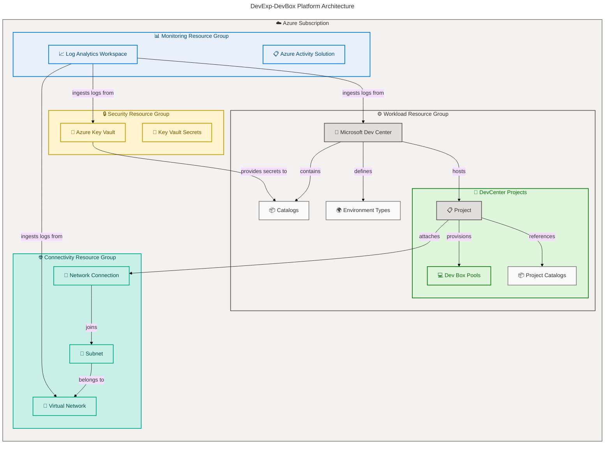

# DevExp-DevBox — Dev Box Adoption & Deployment Accelerator

[](https://learn.microsoft.com/azure/dev-box/)
[](https://learn.microsoft.com/azure/azure-resource-manager/bicep/)
[](LICENSE)
[](https://learn.microsoft.com/azure/developer/azure-developer-cli/)


An **Infrastructure-as-Code** accelerator that **automates the end-to-end
provisioning** of a
[Microsoft Dev Box](https://learn.microsoft.com/azure/dev-box/overview-what-is-microsoft-dev-box)
platform on Azure, enabling organizations to deliver **secure, role-specific
developer workstations** at scale.

Built on **Azure Landing Zone** principles and the **Cloud Adoption Framework**,
this accelerator deploys centralized developer environments with RBAC,
networking, security, and monitoring — entirely driven by **YAML configuration
files**.

## Overview

This accelerator eliminates the hours-long, error-prone manual setup of
developer environments by providing a **turnkey deployment pipeline** for
Microsoft Dev Box. Platform engineering teams can **onboard new projects and
developer personas in minutes** by editing YAML configuration files, without
writing any Bicep or ARM templates directly.

The solution uses a **modular Bicep architecture** deployed via the Azure
Developer CLI (`azd`). Each concern — security, networking, identity,
monitoring, and the DevCenter workload — lives in its own module with
well-defined inputs and outputs. Configuration is fully externalized into
**schema-validated YAML files**, enabling a **GitOps-friendly, repeatable
deployment model** across environments.

> [!TIP]
> If you are new to Microsoft Dev Box, review the
> [official overview](https://learn.microsoft.com/azure/dev-box/overview-what-is-microsoft-dev-box)
> before getting started. Dev Box provides self-service access to
> high-performance, cloud-based workstations pre-configured for specific
> projects and roles.

## Table of Contents

- [Architecture](#architecture)
- [Features](#features)
- [Requirements](#requirements)
- [Quick Start](#quick-start)
- [Configuration](#configuration)
- [Usage](#usage)
- [Deployment](#deployment)
- [Project Structure](#project-structure)
- [Security](#security)
- [Networking](#networking)
- [Identity and RBAC](#identity-and-rbac)
- [Cleanup](#cleanup)
- [Troubleshooting](#troubleshooting)
- [Contributing](#contributing)
- [License](#license)

## Architecture

The accelerator deploys resources across **three Azure resource groups** aligned
with Azure Landing Zone segregation. A **subscription-scoped** Bicep
orchestrator (`main.bicep`) provisions monitoring, security, and workload layers
in dependency order. Each DevCenter project can optionally create its own
connectivity resource group for customer-managed networking.

The deployment follows a **layered dependency model**: Monitoring provisions
first (Log Analytics), Security provisions second (Key Vault), and the Workload
layer provisions last (DevCenter, Projects, Pools, Catalogs, Identities, and
Network Connections), consuming outputs from the prior layers.


```mermaid
---
title: "DevExp-DevBox Platform Architecture"
config:
  theme: base
  look: classic
  layout: dagre
  themeVariables:
    fontSize: '16px'
  flowchart:
    htmlLabels: true
---
flowchart TB
    accTitle: DevExp-DevBox Platform Architecture
    accDescr: Shows the three-tier landing zone architecture with monitoring, security, and workload resource groups and their component relationships

    %% ═══════════════════════════════════════════════════════════════════════════
    %% AZURE / FLUENT ARCHITECTURE PATTERN v1.1
    %% (Semantic + Structural + Font + Accessibility Governance)
    %% ═══════════════════════════════════════════════════════════════════════════
    %% PHASE 1 - STRUCTURAL: Direction explicit, flat topology, nesting ≤ 3
    %% PHASE 2 - SEMANTIC: Colors justified, max 5 semantic classes, neutral-first
    %% PHASE 3 - FONT: Dark text on light backgrounds, contrast ≥ 4.5:1
    %% PHASE 4 - ACCESSIBILITY: accTitle/accDescr present, icons on all nodes
    %% PHASE 5 - STANDARD: Governance block present, classDefs centralized
    %% ═══════════════════════════════════════════════════════════════════════════

    %% COLOR DOCUMENTATION
    %% core (#E1DFDD) — API/Service layers, DevCenter compute resources
    %% success (#DFF6DD) — Deployment pools, provisioned resources
    %% warning (#FFF4CE) — Security-sensitive resources (Key Vault, secrets)
    %% data (#E8F1FB) — Monitoring and analytics (Log Analytics)
    %% network (#C8F0E7) — Networking infrastructure (VNet, subnet, connections)
    %% neutral (#FAFAFA) — Non-semantic supporting elements (catalogs, env types)

    subgraph subscription["☁️ Azure Subscription"]
        direction TB

        subgraph monitoring["📊 Monitoring Resource Group"]
            direction LR
            logAnalytics["📈 Log Analytics Workspace"]:::data
            activitySolution["📋 Azure Activity Solution"]:::data
        end

        subgraph security["🔒 Security Resource Group"]
            direction LR
            keyVault["🔑 Azure Key Vault"]:::warning
            secrets["🔐 Key Vault Secrets"]:::warning
        end

        subgraph workload["⚙️ Workload Resource Group"]
            direction TB
            devCenter["🏢 Microsoft Dev Center"]:::core
            catalogs["📦 Catalogs"]:::neutral
            envTypes["🌍 Environment Types"]:::neutral

            subgraph projects["📂 DevCenter Projects"]
                direction LR
                project["📋 Project"]:::core
                pools["💻 Dev Box Pools"]:::success
                projectCatalogs["📦 Project Catalogs"]:::neutral
            end
        end

        subgraph connectivity["🌐 Connectivity Resource Group"]
            direction LR
            vnet["🔗 Virtual Network"]:::network
            subnet["📍 Subnet"]:::network
            networkConn["🔌 Network Connection"]:::network
        end
    end

    logAnalytics -->|"ingests logs from"| keyVault
    logAnalytics -->|"ingests logs from"| devCenter
    logAnalytics -->|"ingests logs from"| vnet
    keyVault -->|"provides secrets to"| catalogs
    devCenter -->|"contains"| catalogs
    devCenter -->|"defines"| envTypes
    devCenter -->|"hosts"| project
    project -->|"provisions"| pools
    project -->|"references"| projectCatalogs
    project -->|"attaches"| networkConn
    networkConn -->|"joins"| subnet
    subnet -->|"belongs to"| vnet

    style subscription fill:#F3F2F1,stroke:#8A8886,stroke-width:2px,color:#323130
    style monitoring fill:#E8F1FB,stroke:#0078D4,stroke-width:2px,color:#004578
    style security fill:#FFF4CE,stroke:#C19C00,stroke-width:2px,color:#6D5700
    style workload fill:#F3F2F1,stroke:#605E5C,stroke-width:2px,color:#323130
    style projects fill:#DFF6DD,stroke:#107C10,stroke-width:2px,color:#0B6A0B
    style connectivity fill:#C8F0E7,stroke:#00A889,stroke-width:2px,color:#004B50

    classDef core fill:#E1DFDD,stroke:#605E5C,stroke-width:2px,color:#323130
    classDef success fill:#DFF6DD,stroke:#107C10,stroke-width:2px,color:#0B6A0B
    classDef warning fill:#FFF4CE,stroke:#C19C00,stroke-width:2px,color:#6D5700
    classDef data fill:#E8F1FB,stroke:#0078D4,stroke-width:2px,color:#004578
    classDef network fill:#C8F0E7,stroke:#00A889,stroke-width:2px,color:#004B50
    classDef neutral fill:#FAFAFA,stroke:#8A8886,stroke-width:2px,color:#323130
```

**Component Roles:**

| Component                  | Purpose                                                              | Module                                     |
| -------------------------- | -------------------------------------------------------------------- | ------------------------------------------ |
| 📈 Log Analytics Workspace | Centralized monitoring, log ingestion, and diagnostics               | `src/management/logAnalytics.bicep`        |
| 📋 Azure Activity Solution | Azure activity log analytics integration                             | `src/management/logAnalytics.bicep`        |
| 🔑 Azure Key Vault         | Secrets management for catalog authentication tokens                 | `src/security/keyVault.bicep`              |
| 🏢 Microsoft Dev Center    | Central hub for developer workstation management                     | `src/workload/core/devCenter.bicep`        |
| 📦 Catalogs                | Git-hosted repositories for custom tasks and environment definitions | `src/workload/core/catalog.bicep`          |
| 🌍 Environment Types       | SDLC stages (dev, staging, UAT) for deployment environments          | `src/workload/core/environmentType.bicep`  |
| 📋 Projects                | Team-specific Dev Box configurations with their own RBAC and pools   | `src/workload/project/project.bicep`       |
| 💻 Dev Box Pools           | Role-specific VM pool definitions with image and SKU configurations  | `src/workload/project/projectPool.bicep`   |
| 🔗 Virtual Network         | Customer-managed networking for unmanaged network mode               | `src/connectivity/vnet.bicep`              |
| 🔌 Network Connection      | Links Dev Box pools to VNet subnets with Azure AD Join               | `src/connectivity/networkConnection.bicep` |

## Features

This accelerator provides a complete platform engineering toolkit for Microsoft
Dev Box adoption. It abstracts the complexity of multi-resource Azure
deployments into a configuration-driven workflow, allowing teams to focus on
defining developer personas rather than writing infrastructure code.

The modular Bicep architecture ensures each component can be independently
tested, versioned, and reused. Schema-validated YAML configuration files catch
errors before deployment, and the multi-layer RBAC model enforces
least-privilege access at every scope.

| Feature                      | Description                                                                          | Status    |
| ---------------------------- | ------------------------------------------------------------------------------------ | --------- |
| 🏗️ Infrastructure as Code    | Modular Azure Bicep templates with subscription-scoped orchestration                 | ✅ Stable |
| 📝 YAML-Driven Configuration | Schema-validated YAML files for all resource settings — no Bicep editing required    | ✅ Stable |
| 🔐 Multi-Layer RBAC          | Four-layer role-based access from DevCenter identity to project-level AD groups      | ✅ Stable |
| 🌐 Flexible Networking       | Toggle between Microsoft-managed and customer-managed VNet per project               | ✅ Stable |
| 📊 Centralized Monitoring    | Log Analytics with diagnostic settings on all key resources                          | ✅ Stable |
| 🔑 Secrets Management        | Key Vault with RBAC authorization, purge protection, and soft delete                 | ✅ Stable |
| 🚀 One-Command Deployment    | Deploy via `azd up` with automated setup scripts for Windows, Linux, and macOS       | ✅ Stable |
| 📦 Catalog Integration       | Git-hosted catalogs for custom tasks, environment definitions, and image definitions | ✅ Stable |
| 👥 Multi-Project Support     | Define multiple projects with independent pools, catalogs, RBAC, and networking      | ✅ Stable |
| 🧹 Automated Cleanup         | Full teardown script removing resources, role assignments, and service principals    | ✅ Stable |

## Requirements

Before deploying the accelerator, **ensure your workstation has the required
CLIs installed** and your Azure subscription has **sufficient permissions**. The
deployment creates resource groups, role assignments, and service principals, so
**elevated access** is necessary.

All prerequisites can be validated by running the setup script, which checks for
missing tools and insufficient permissions before proceeding.

| Requirement                    | Minimum Version | Purpose                                                                           |
| ------------------------------ | --------------- | --------------------------------------------------------------------------------- |
| ☁️ Azure Subscription          | N/A             | Target subscription with Owner or User Access Administrator + Contributor         |
| 🔧 Azure CLI (`az`)            | 2.50+           | Azure resource management and authentication                                      |
| 🚀 Azure Developer CLI (`azd`) | 1.0+            | Deployment orchestration and environment management                               |
| 🐙 GitHub CLI (`gh`)           | 2.0+            | GitHub authentication and PAT token generation (if using GitHub)                  |
| 🔍 jq                          | 1.6+            | JSON processing (required by Bash setup script)                                   |
| 💻 PowerShell                  | 5.1+            | Windows setup and cleanup scripts                                                 |
| 🐧 Bash                        | 4.0+            | Linux/macOS setup script                                                          |
| 👥 Azure AD Groups             | N/A             | Pre-created groups matching IDs in `devcenter.yaml` configuration                 |
| 📂 Git Repository              | N/A             | Source repository accessible for catalog syncing (PAT required for private repos) |

> [!IMPORTANT]
> Your Azure subscription **must** allow creating resource groups,
> registering resource providers (DevCenter, KeyVault, Network,
> OperationalInsights), and creating role assignments. An **Owner** role on the
> subscription is recommended for initial deployment.

## Quick Start

Deploying the accelerator is a two-phase process: **setup** and **provision**.
The setup phase authenticates you against Azure and your source control
platform, retrieves a PAT token, and writes it into an `azd` environment file
(`.azure/<env>/.env`). The provision phase deploys all infrastructure via
`infra/main.bicep`. When you run `azd up`, both phases execute automatically —
the setup script runs as a `preprovision` hook before Bicep deployment begins.

### How It Works


```mermaid
---
title: "azd up — End-to-End Deployment Flow"
config:
  theme: base
  look: classic
  layout: dagre
  themeVariables:
    fontSize: '16px'
  flowchart:
    htmlLabels: true
---
flowchart TD
    accTitle: azd up deployment flow
    accDescr: Shows the two-phase deployment process — preprovision setup followed by Bicep infrastructure provisioning

    %% ═══════════════════════════════════════════════════════════════════════════
    %% AZURE / FLUENT ARCHITECTURE PATTERN v1.1
    %% (Semantic + Structural + Font + Accessibility Governance)
    %% ═══════════════════════════════════════════════════════════════════════════
    %% PHASE 1 - STRUCTURAL: Direction explicit, flat topology, nesting ≤ 3
    %% PHASE 2 - SEMANTIC: Colors justified, max 5 semantic classes, neutral-first
    %% PHASE 3 - FONT: Dark text on light backgrounds, contrast ≥ 4.5:1
    %% PHASE 4 - ACCESSIBILITY: accTitle/accDescr present, icons on all nodes
    %% PHASE 5 - STANDARD: Governance block present, classDefs centralized
    %% ═══════════════════════════════════════════════════════════════════════════

    %% COLOR DOCUMENTATION
    %% core (#E1DFDD) — Entry/exit nodes (azd up command)
    %% success (#DFF6DD) — Completed deployment stages
    %% warning (#FFF4CE) — Security-sensitive operations (PAT, secrets)
    %% data (#E8F1FB) — Infrastructure deployment operations
    %% neutral (#FAFAFA) — Validation and read operations

    start(["▶️ azd up"]):::core --> phase1

    subgraph phase1["⚙️ Phase 1 — preprovision hook (setUp.sh / setUp.ps1)"]
        direction TB
        step1["🔍 Validate tools<br>/(az, azd, gh or az devops, jq)"]:::neutral
        step2["☁️ Verify Azure authentication<br>/(az account show)"]:::neutral
        step3["🔗 Verify source control auth<br>/(gh auth status / az devops)"]:::neutral
        step4["🔑 Retrieve PAT token<br>/→ store as KEY_VAULT_SECRET"]:::warning
        step5["💾 Write .azure/‹env›/.env<br>/KEY_VAULT_SECRET<br>/SOURCE_CONTROL_PLATFORM"]:::warning

        step1 --> step2 --> step3 --> step4 --> step5
    end

    phase1 --> phase2

    subgraph phase2["🚀 Phase 2 — azd provision (automatic)"]
        direction TB
        prov1["📄 Read main.parameters.json<br>/(AZURE_ENV_NAME, AZURE_LOCATION,<br>/KEY_VAULT_SECRET)"]:::neutral
        prov2["📦 Deploy infra/main.bicep<br>/at subscription scope"]:::data
        prov3["🗂️ Create resource groups<br>/(monitoring, security, workload)"]:::data
        prov4["📊 Deploy Log Analytics<br>/→ 🔐 Key Vault<br>/→ 🏢 DevCenter"]:::success
        prov5["📋 Create projects, pools,<br>/catalogs, RBAC, networking"]:::success

        prov1 --> prov2 --> prov3 --> prov4 --> prov5
    end

    prov5 --> done(["✅ Deployment complete"]):::success

    style phase1 fill:#FFF4CE,stroke:#C19C00,stroke-width:2px,color:#6D5700
    style phase2 fill:#E8F1FB,stroke:#0078D4,stroke-width:2px,color:#004578

    classDef core fill:#E1DFDD,stroke:#605E5C,stroke-width:2px,color:#323130
    classDef success fill:#DFF6DD,stroke:#107C10,stroke-width:2px,color:#0B6A0B
    classDef warning fill:#FFF4CE,stroke:#C19C00,stroke-width:2px,color:#6D5700
    classDef data fill:#E8F1FB,stroke:#0078D4,stroke-width:2px,color:#004578
    classDef neutral fill:#FAFAFA,stroke:#8A8886,stroke-width:2px,color:#323130
```

### Prerequisites

| Tool                        | Minimum | Install                                                                                | Required When             |
| --------------------------- | ------- | -------------------------------------------------------------------------------------- | ------------------------- |
| Azure CLI (`az`)            | 2.50+   | [Install](https://learn.microsoft.com/cli/azure/install-azure-cli)                     | Always                    |
| Azure Developer CLI (`azd`) | 1.0+    | [Install](https://learn.microsoft.com/azure/developer/azure-developer-cli/install-azd) | Always                    |
| GitHub CLI (`gh`)           | 2.0+    | [Install](https://cli.github.com/)                                                     | Source control = `github` |
| jq                          | 1.6+    | [Install](https://jqlang.github.io/jq/download/)                                       | Bash setup script         |
| Bash                        | 4.0+    | Included on Linux/macOS; Git Bash or WSL on Windows                                    | `azd up` workflow         |
| PowerShell                  | 5.1+    | Included on Windows                                                                    | `setUp.ps1` workflow      |

Verify your tools:

```bash
az version && azd version && gh --version && jq --version
```

### Deploy on Linux / macOS

```bash
# 1. Clone and enter the repository
git clone https://github.com/Evilazaro/DevExp-DevBox.git
cd DevExp-DevBox

# 2. Authenticate
az login
gh auth login            # if using GitHub catalogs

# 3. Deploy (setup + provision in one command)
azd up
```

`azd up` prompts for an environment name and Azure region, then runs the
`preprovision` hook (`setUp.sh`), and finally deploys all Bicep modules. GitHub
is the default source control platform. To use Azure DevOps instead, set the
environment variable before running:

```bash
export SOURCE_CONTROL_PLATFORM="adogit"
az devops login
azd up
```

### Deploy on Windows

Windows requires one additional step because the default `azure.yaml` uses
`shell: sh`. Two options:

#### Option A — Use the PowerShell-compatible azd configuration (recommended)

If you have Bash available (Git Bash, WSL, or Cygwin):

```powershell
# 1. Clone and enter the repository
git clone https://github.com/Evilazaro/DevExp-DevBox.git
cd DevExp-DevBox

# 2. Authenticate
az login
gh auth login

# 3. Switch to the PowerShell azd configuration
Copy-Item azure-pwh.yaml azure.yaml -Force

# 4. Deploy
azd up
```

The `azure-pwh.yaml` configuration uses `shell: pwsh` and delegates to
`setUp.sh` through Bash. This keeps the same automated flow as Linux/macOS.

#### Option B — Use setUp.ps1 directly (no Bash required)

If Bash is not available, run the PowerShell setup script manually, then
provision:

```powershell
# 1. Clone and enter the repository
git clone https://github.com/Evilazaro/DevExp-DevBox.git
cd DevExp-DevBox

# 2. Authenticate
az login
gh auth login

# 3. Run the setup script (creates .azure/<env>/.env with PAT and platform)
.\setUp.ps1 -EnvName "dev" -SourceControl "github"

# 4. Provision infrastructure (separate step — setUp.ps1 does NOT provision)
azd provision -e dev
```

The `-SourceControl` parameter accepts `github` or `adogit`. If omitted, the
script prompts interactively:

```text
Please select your source control platform:
  1. Azure DevOps Git (adogit)
  2. GitHub (github)
Enter your choice (1 or 2):
```

### What Each Script Does

| Script           | Provisions Infrastructure?                                   | Purpose                                                                     |
| ---------------- | ------------------------------------------------------------ | --------------------------------------------------------------------------- |
| `setUp.sh`       | No — runs as `preprovision` hook; `azd` provisions afterward | Validates tools, authenticates, retrieves PAT, writes `.azure/<env>/.env`   |
| `setUp.ps1`      | No — you must run `azd provision` afterward                  | Same as `setUp.sh` but in PowerShell; standalone, does not require Bash     |
| `azure.yaml`     | Yes — via `azd up`                                           | Bash-based `preprovision` hook; GitHub is the default platform              |
| `azure-pwh.yaml` | Yes — via `azd up` after copying to `azure.yaml`             | PowerShell-based `preprovision` hook; delegates to `setUp.sh` via Bash      |
| `cleanSetUp.ps1` | N/A                                                          | Tears down all deployed resources, role assignments, and service principals |

### Verify the Deployment

After provisioning completes:

```bash
# List deployed resource groups
az group list --query "[?contains(name,'devexp')]" --output table

# Verify the DevCenter
az devcenter admin devcenter list --output table

# List DevCenter projects
az devcenter admin project list --output table

# Check Dev Box pools for a project
az devcenter admin pool list \
  --project-name eShop \
  --resource-group "devexp-workload-dev-eastus2-RG" \
  --output table

# View all azd environment variables
azd env get-values
```

> [!NOTE]
> The first deployment typically takes **15–25 minutes** due to resource
> provider registration and resource creation. Subsequent runs are faster
> because Bicep modules are **idempotent** — only changed resources are updated.
> You can safely re-run `azd up` or `azd provision` at any time.

## Configuration

All deployment settings are **externalized into three YAML configuration files**
under `infra/settings/`. Each file has a companion **JSON Schema** for IDE
autocompletion and validation. This design enables a **GitOps workflow** where
infrastructure changes are reviewed and merged like application code.

Modify these files to customize resource names, add projects, change VM SKUs,
toggle networking modes, or adjust RBAC assignments — **no Bicep code changes
required**. The JSON Schemas provide **real-time validation** in VS Code and
other editors that support the `yaml-language-server` directive.

### Configuration Files

| File                                                         | Purpose                                                                     | Schema                       |
| ------------------------------------------------------------ | --------------------------------------------------------------------------- | ---------------------------- |
| 📁 `infra/settings/resourceOrganization/azureResources.yaml` | Resource group names, creation toggles, and tagging                         | `azureResources.schema.json` |
| 🔒 `infra/settings/security/security.yaml`                   | Key Vault name, purge protection, soft delete, secret configuration         | `security.schema.json`       |
| ⚙️ `infra/settings/workload/devcenter.yaml`                  | DevCenter core settings, projects, pools, catalogs, environment types, RBAC | `devcenter.schema.json`      |

### Resource Organization (`azureResources.yaml`)

Defines the three landing-zone resource groups following Azure Landing Zone
segregation. Each resource group has a `create` toggle, a `name` prefix, and a
`tags` block for governance.

```yaml
# Workload Resource Group — DevCenter and project resources
workload:
  create: true # Set false to use an existing RG
  name: devexp-workload # Resource group name prefix
  description: prodExp
  tags:
    environment: dev # Deployment environment (dev, test, prod)
    division: Platforms # Organizational division
    team: DevExP # Owning team
    project: Contoso-DevExp-DevBox # Project name for cost allocation
    costCenter: IT # Financial tracking
    owner: Contoso # Resource owner
    landingZone: Workload # Landing zone classification
    resources: ResourceGroup # Resource type identifier

# Security Resource Group — Key Vault and related resources
security:
  create: true
  name: devexp-security
  tags: { ... } # Same tag structure as workload

# Monitoring Resource Group — Log Analytics and solutions
monitoring:
  create: true
  name: devexp-monitoring
  tags: { ... } # Same tag structure as workload
```

Resource group names are generated at deployment time using the pattern:
`{name}-{environmentName}-{location}-RG` (e.g.,
`devexp-workload-dev-eastus-RG`).

> [!TIP] Set `create: false` to use existing resource groups instead of creating
> new ones. This is useful when integrating with an existing **Azure Landing
> Zone** or when resource groups are managed by a separate governance team.

**Resource Organization Properties:**

| Property         | Type      | Required | Description                                            |
| ---------------- | --------- | -------- | ------------------------------------------------------ |
| 📝 `create`      | `boolean` | ✅       | Whether to create the resource group or use existing   |
| 🏷️ `name`        | `string`  | ✅       | Resource group name prefix                             |
| 📋 `description` | `string`  | ❌       | Description of the resource group                      |
| 🏷️ `tags`        | `object`  | ✅       | Key-value tag pairs for governance and cost management |

### Security Configuration (`security.yaml`)

Configures Azure Key Vault for secrets management. The Key Vault stores
authentication tokens for source control catalog access.

```yaml
# Toggle Key Vault creation
create: true

keyVault:
  name: contoso # Globally unique Key Vault name
  description: Development Environment Key Vault
  secretName: gha-token # Secret name for the PAT token

  # Security settings
  enablePurgeProtection: true # Prevent permanent deletion
  enableSoftDelete: true # Allow recovery of deleted secrets
  softDeleteRetentionInDays: 7 # Recovery window (7-90 days)
  enableRbacAuthorization: true # Use Azure RBAC (not access policies)

  # Resource tags
  tags:
    environment: dev
    division: Platforms
    team: DevExP
    project: Contoso-DevExp-DevBox
    costCenter: IT
    owner: Contoso
    landingZone: security
    resources: ResourceGroup
```

**Key Vault Properties:**

| Property                       | Type      | Default     | Description                                        |
| ------------------------------ | --------- | ----------- | -------------------------------------------------- |
| 🔑 `name`                      | `string`  | —           | Globally unique Key Vault name                     |
| 📋 `description`               | `string`  | —           | Purpose description                                |
| 🔐 `secretName`                | `string`  | `gha-token` | Name of the secret storing the PAT token           |
| 🛡️ `enablePurgeProtection`     | `boolean` | `true`      | Prevents permanent deletion of the vault           |
| ♻️ `enableSoftDelete`          | `boolean` | `true`      | Enables recovery of deleted secrets                |
| 📅 `softDeleteRetentionInDays` | `integer` | `7`         | Days to retain deleted secrets (7-90)              |
| 🔒 `enableRbacAuthorization`   | `boolean` | `true`      | Use RBAC instead of access policies for data plane |

### DevCenter Configuration (`devcenter.yaml`)

The primary configuration file defining the DevCenter and all its resources.
This single file controls the DevCenter core settings, identity and RBAC,
catalogs, environment types, and all project definitions.

#### DevCenter Core Settings

```yaml
name: 'devexp-devcenter' # DevCenter resource name
catalogItemSyncEnableStatus: 'Enabled' # Auto-sync catalog items
microsoftHostedNetworkEnableStatus: 'Enabled' # Enable managed networking
installAzureMonitorAgentEnableStatus: 'Enabled' # Install Azure Monitor agent on Dev Boxes
```

| Setting                                   | Values                 | Description                                                |
| ----------------------------------------- | ---------------------- | ---------------------------------------------------------- |
| ⚙️ `catalogItemSyncEnableStatus`          | `Enabled` / `Disabled` | Controls automatic syncing of catalog items from Git repos |
| 🌐 `microsoftHostedNetworkEnableStatus`   | `Enabled` / `Disabled` | Enables Microsoft-managed networking for pools             |
| 📊 `installAzureMonitorAgentEnableStatus` | `Enabled` / `Disabled` | Installs Azure Monitor agent on provisioned Dev Boxes      |

#### DevCenter Identity and RBAC

The DevCenter uses a SystemAssigned managed identity with role assignments at
two scopes:

```yaml
identity:
  type: 'SystemAssigned'
  roleAssignments:
    devCenter:
      - id: 'b24988ac-6180-42a0-ab88-20f7382dd24c'
        name: 'Contributor'
        scope: 'Subscription'
      - id: '18d7d88d-d35e-4fb5-a5c3-7773c20a72d9'
        name: 'User Access Administrator'
        scope: 'Subscription'
      - id: '4633458b-17de-408a-b874-0445c86b69e6'
        name: 'Key Vault Secrets User'
        scope: 'ResourceGroup'
      - id: 'b86a8fe4-44ce-4948-aee5-eccb2c155cd7'
        name: 'Key Vault Secrets Officer'
        scope: 'ResourceGroup'

    orgRoleTypes:
      - type: DevManager
        azureADGroupId: '<your-azure-ad-group-id>' # Replace with your AD group ID
        azureADGroupName: 'Platform Engineering Team'
        azureRBACRoles:
          - name: 'DevCenter Project Admin'
            id: '331c37c6-af14-46d9-b9f4-e1909e1b95a0'
            scope: ResourceGroup
```

| Role Assignment Scope        | Roles                                             | Purpose                            |
| ---------------------------- | ------------------------------------------------- | ---------------------------------- |
| 🏢 Subscription              | Contributor, User Access Administrator            | Manage resources and assign roles  |
| 🔑 Resource Group (Security) | Key Vault Secrets User, Key Vault Secrets Officer | Read and manage Key Vault secrets  |
| 👥 Resource Group (Org)      | DevCenter Project Admin                           | Platform team manages all projects |

#### DevCenter-Level Catalogs

Catalogs are Git repositories containing custom tasks, environment definitions,
or image definitions synced to the DevCenter:

```yaml
catalogs:
  - name: 'customTasks' # Catalog display name
    type: gitHub # Source control type: gitHub or adoGit
    visibility: public # public (no auth) or private (uses Key Vault secret)
    uri: 'https://github.com/microsoft/devcenter-catalog.git'
    branch: 'main'
    path: './Tasks' # Path within the repository
```

| Property        | Type     | Values              | Description                                                       |
| --------------- | -------- | ------------------- | ----------------------------------------------------------------- |
| 📦 `name`       | `string` | —                   | Display name for the catalog                                      |
| 🔗 `type`       | `string` | `gitHub`, `adoGit`  | Source control platform hosting the catalog                       |
| 👁️ `visibility` | `string` | `public`, `private` | Public repos need no auth; private repos use the Key Vault secret |
| 🌐 `uri`        | `string` | —                   | Git repository URL                                                |
| 🌿 `branch`     | `string` | —                   | Branch to sync from                                               |
| 📂 `path`       | `string` | —                   | Path within the repository containing catalog items               |

#### Environment Types

Define SDLC stages available for deployment environments:

```yaml
environmentTypes:
  - name: 'dev'
    deploymentTargetId: '' # Empty = default subscription
  - name: 'staging'
    deploymentTargetId: '' # Set a subscription ID for cross-subscription deployment
  - name: 'UAT'
    deploymentTargetId: ''
```

> [!TIP] Set `deploymentTargetId` to a subscription resource ID (e.g.,
> `/subscriptions/<guid>`) to deploy environment resources into a different
> subscription. Leave empty to use the current subscription.

#### Project Configuration

Each project in the `projects` array defines an independent team workspace with
its own network, identity, pools, catalogs, environment types, and tags:

```yaml
projects:
  - name: 'eShop' # Project name
    description: 'eShop project.' # Project description

    # --- Networking ---
    network:
      name: eShop # Virtual network name
      create: true # Create network resources
      resourceGroupName: 'eShop-connectivity-RG' # Dedicated RG for networking
      virtualNetworkType: Managed # Managed or Unmanaged
      addressPrefixes:
        - 10.0.0.0/16 # VNet address space
      subnets:
        - name: eShop-subnet
          properties:
            addressPrefix: 10.0.1.0/24 # Subnet address range
      tags:
        environment: dev
        resources: Network

    # --- Identity & RBAC ---
    identity:
      type: SystemAssigned
      roleAssignments:
        - azureADGroupId: '<your-ad-group-id>' # Replace with your AD group
          azureADGroupName: 'eShop Developers'
          azureRBACRoles:
            - name: 'Contributor'
              id: 'b24988ac-6180-42a0-ab88-20f7382dd24c'
              scope: Project
            - name: 'Dev Box User'
              id: '45d50f46-0b78-4001-a660-4198cbe8cd05'
              scope: Project
            - name: 'Deployment Environment User'
              id: '18e40d4e-8d2e-438d-97e1-9528336e149c'
              scope: Project
            - name: 'Key Vault Secrets User'
              id: '4633458b-17de-408a-b874-0445c86b69e6'
              scope: ResourceGroup
            - name: 'Key Vault Secrets Officer'
              id: 'b86a8fe4-44ce-4948-aee5-eccb2c155cd7'
              scope: ResourceGroup

    # --- Dev Box Pools ---
    pools:
      - name: 'backend-engineer'
        imageDefinitionName: 'eShop-backend-engineer' # Image def from catalog
        vmSku: general_i_32c128gb512ssd_v2 # 32 vCPU, 128GB RAM, 512GB SSD
      - name: 'frontend-engineer'
        imageDefinitionName: 'eShop-frontend-engineer'
        vmSku: general_i_16c64gb256ssd_v2 # 16 vCPU, 64GB RAM, 256GB SSD

    # --- Project Environment Types ---
    environmentTypes:
      - name: 'dev'
        deploymentTargetId: ''
      - name: 'staging'
        deploymentTargetId: ''
      - name: 'UAT'
        deploymentTargetId: ''

    # --- Project-Specific Catalogs ---
    catalogs:
      - name: 'environments' # Environment definitions
        type: environmentDefinition
        sourceControl: gitHub
        visibility: private # Uses Key Vault secret for auth
        uri: 'https://github.com/Evilazaro/eShop.git'
        branch: 'main'
        path: '/.devcenter/environments'
      - name: 'devboxImages' # Custom image definitions
        type: imageDefinition
        sourceControl: gitHub
        visibility: private
        uri: 'https://github.com/Evilazaro/eShop.git'
        branch: 'main'
        path: '/.devcenter/imageDefinitions'

    # --- Tags ---
    tags:
      environment: 'dev'
      division: 'Platforms'
      team: 'DevExP'
      project: 'DevExP-DevBox'
      costCenter: 'IT'
      owner: 'Contoso'
      resources: 'Project'
```

**Project Properties Reference:**

| Property              | Type     | Required | Description                                               |
| --------------------- | -------- | -------- | --------------------------------------------------------- |
| 📋 `name`             | `string` | ✅       | Unique project name within the DevCenter                  |
| 📝 `description`      | `string` | ❌       | Project description                                       |
| 🌐 `network`          | `object` | ✅       | Networking configuration (see Networking section)         |
| 🔐 `identity`         | `object` | ✅       | SystemAssigned identity with RBAC role assignments        |
| 💻 `pools`            | `array`  | ✅       | Dev Box pool definitions with VM SKU and image references |
| 🌍 `environmentTypes` | `array`  | ✅       | SDLC environment types enabled for the project            |
| 📦 `catalogs`         | `array`  | ❌       | Project-specific Git catalogs for environments and images |
| 🏷️ `tags`             | `object` | ✅       | Resource tags for governance and cost allocation          |

**Project Catalog Types:**

| Type                       | Purpose                                         | Example Path                   |
| -------------------------- | ----------------------------------------------- | ------------------------------ |
| 📦 `environmentDefinition` | ARM/Bicep templates for deployment environments | `/.devcenter/environments`     |
| 🖼️ `imageDefinition`       | Custom Dev Box image definitions                | `/.devcenter/imageDefinitions` |

**Pool Image Resolution:**

Dev Box pools reference image definitions from catalogs using the pattern
`~Catalog~{catalogName}~{imageDefinitionName}`. The pool automatically creates a
Dev Box definition linking the image and VM SKU.

### Deployment Parameters (`main.parameters.json`)

The Bicep deployment receives three parameters injected from `azd` environment
variables:

```json
{
  "parameters": {
    "environmentName": { "value": "${AZURE_ENV_NAME}" },
    "location": { "value": "${AZURE_LOCATION}" },
    "secretValue": { "value": "${KEY_VAULT_SECRET}" }
  }
}
```

| Parameter            | Environment Variable | Description                        | Validation                          |
| -------------------- | -------------------- | ---------------------------------- | ----------------------------------- |
| ☁️ `location`        | `AZURE_LOCATION`     | Azure region for deployment        | Must be in the allowed regions list |
| 🏷️ `environmentName` | `AZURE_ENV_NAME`     | Environment name (2-10 characters) | Used in resource group naming       |
| 🔑 `secretValue`     | `KEY_VAULT_SECRET`   | PAT token for source control       | Marked `@secure()` — never logged   |

**Allowed Azure Regions:**

`eastus`, `eastus2`, `westus`, `westus2`, `westus3`, `centralus`, `northeurope`,
`westeurope`, `southeastasia`, `australiaeast`, `japaneast`, `uksouth`,
`canadacentral`, `swedencentral`, `switzerlandnorth`, `germanywestcentral`

## Usage

Once the Quick Start deployment is complete, platform engineers and developers
interact with the accelerator through YAML configuration changes and standard
Azure tools. This section covers the most common operational tasks: adding new
projects, creating custom Dev Box pools, managing catalogs, switching networking
modes, customizing RBAC, and running day-two operations.

All configuration changes follow a **GitOps workflow**: edit YAML, commit, and
re-run `azd up` (or `azd provision`) to apply. Bicep modules are **idempotent**,
so re-provisioning only modifies changed resources.

### Adding a New Project

To onboard a new team, append a project entry to the `projects` array in
`infra/settings/workload/devcenter.yaml`:

```yaml
projects:
  # ... existing projects ...

  - name: 'payments'
    description: 'Payments team project.'

    network:
      name: payments
      create: true
      resourceGroupName: 'payments-connectivity-RG'
      virtualNetworkType: Managed
      addressPrefixes:
        - 10.1.0.0/16
      subnets:
        - name: payments-subnet
          properties:
            addressPrefix: 10.1.1.0/24
      tags:
        environment: dev
        resources: Network

    identity:
      type: SystemAssigned
      roleAssignments:
        - azureADGroupId: '<payments-team-ad-group-id>'
          azureADGroupName: 'Payments Developers'
          azureRBACRoles:
            - name: 'Contributor'
              id: 'b24988ac-6180-42a0-ab88-20f7382dd24c'
              scope: Project
            - name: 'Dev Box User'
              id: '45d50f46-0b78-4001-a660-4198cbe8cd05'
              scope: Project
            - name: 'Deployment Environment User'
              id: '18e40d4e-8d2e-438d-97e1-9528336e149c'
              scope: Project
            - name: 'Key Vault Secrets User'
              id: '4633458b-17de-408a-b874-0445c86b69e6'
              scope: ResourceGroup
            - name: 'Key Vault Secrets Officer'
              id: 'b86a8fe4-44ce-4948-aee5-eccb2c155cd7'
              scope: ResourceGroup

    pools:
      - name: 'backend-dev'
        imageDefinitionName: 'payments-backend'
        vmSku: general_i_16c64gb256ssd_v2

    environmentTypes:
      - name: 'dev'
        deploymentTargetId: ''

    catalogs:
      - name: 'environments'
        type: environmentDefinition
        sourceControl: gitHub
        visibility: private
        uri: 'https://github.com/your-org/payments.git'
        branch: 'main'
        path: '/.devcenter/environments'
      - name: 'devboxImages'
        type: imageDefinition
        sourceControl: gitHub
        visibility: private
        uri: 'https://github.com/your-org/payments.git'
        branch: 'main'
        path: '/.devcenter/imageDefinitions'

    tags:
      environment: 'dev'
      division: 'Engineering'
      team: 'Payments'
      project: 'Payments-DevBox'
      costCenter: 'Finance'
      owner: 'Contoso'
      resources: 'Project'
```

Then apply the change:

```bash
azd provision
```

### Defining Custom Dev Box Pools

Pools define the VM specifications for each developer persona. Each pool
references an image definition from a catalog and a VM SKU:

```yaml
pools:
  - name: 'data-engineer' # Pool display name
    imageDefinitionName: 'myProject-data-engineer' # Image definition from imageDefinition catalog
    vmSku: general_i_32c128gb512ssd_v2 # VM SKU

  - name: 'qa-engineer'
    imageDefinitionName: 'myProject-qa'
    vmSku: general_i_8c32gb256ssd_v2 # Smaller SKU for QA
```

**Available VM SKU examples:**

| SKU                              | vCPU | RAM    | Storage    | Best For                              |
| -------------------------------- | ---- | ------ | ---------- | ------------------------------------- |
| 💻 `general_i_8c32gb256ssd_v2`   | 8    | 32 GB  | 256 GB SSD | QA, documentation, light development  |
| 💻 `general_i_16c64gb256ssd_v2`  | 16   | 64 GB  | 256 GB SSD | Frontend development, general purpose |
| 💻 `general_i_32c128gb512ssd_v2` | 32   | 128 GB | 512 GB SSD | Backend development, large builds     |

Each pool automatically enables:

- 🪟 Windows Client licensing
- 👤 Local administrator access
- 🔑 Single sign-on (SSO)

### Managing Catalogs

#### Adding a DevCenter-Level Catalog

DevCenter-level catalogs are shared across all projects. Add to the top-level
`catalogs` array:

```yaml
catalogs:
  - name: 'customTasks'
    type: gitHub
    visibility: public
    uri: 'https://github.com/microsoft/devcenter-catalog.git'
    branch: 'main'
    path: './Tasks'

  # Add a new shared catalog
  - name: 'companyTasks'
    type: gitHub
    visibility: private # Will use Key Vault secret
    uri: 'https://github.com/your-org/devcenter-tasks.git'
    branch: 'main'
    path: './Tasks'
```

#### Adding Project-Specific Catalogs

Project catalogs scope environment definitions or image definitions to a single
project:

```yaml
projects:
  - name: 'eShop'
    catalogs:
      # Environment definitions (ARM/Bicep templates)
      - name: 'environments'
        type: environmentDefinition
        sourceControl: gitHub
        visibility: private
        uri: 'https://github.com/Evilazaro/eShop.git'
        branch: 'main'
        path: '/.devcenter/environments'

      # Image definitions (custom Dev Box images)
      - name: 'devboxImages'
        type: imageDefinition
        sourceControl: gitHub
        visibility: private
        uri: 'https://github.com/Evilazaro/eShop.git'
        branch: 'main'
        path: '/.devcenter/imageDefinitions'

      # Azure DevOps Git catalog
      - name: 'adoCatalog'
        type: environmentDefinition
        sourceControl: adoGit
        visibility: private
        uri: 'https://dev.azure.com/org/project/_git/repo'
        branch: 'main'
        path: '/environments'
```

> [!IMPORTANT]
> Private catalogs **require** a valid PAT token stored in Key
> Vault. The `secretIdentifier` is automatically passed to private catalogs
> during deployment. Ensure the PAT has `repo` (GitHub) or `Code (Read)` (Azure
> DevOps) scope.

### Switching Networking Modes

Each project independently controls its networking mode via
`virtualNetworkType`:

**Managed Networking (default):**

```yaml
network:
  virtualNetworkType: Managed # Microsoft-managed networking
```

**Unmanaged Networking (customer-managed VNet):**

```yaml
network:
  name: eShop
  create: true
  resourceGroupName: 'eShop-connectivity-RG'
  virtualNetworkType: Unmanaged # Customer-managed VNet
  addressPrefixes:
    - 10.0.0.0/16
  subnets:
    - name: eShop-subnet
      properties:
        addressPrefix: 10.0.1.0/24
```

When using Unmanaged networking, the accelerator creates:

1. A dedicated connectivity resource group
2. A Virtual Network with the specified address space
3. Subnets within the VNet
4. A Network Connection with Azure AD Join domain join type
5. An attached network linking the connection to the DevCenter
6. Diagnostic settings forwarding logs to Log Analytics

### Customizing RBAC for Projects

Each project can define Azure AD groups with specific RBAC role assignments:

```yaml
identity:
  type: SystemAssigned
  roleAssignments:
    - azureADGroupId: '<group-object-id>' # Azure AD group object ID
      azureADGroupName: 'My Team Developers' # Display name (for documentation)
      azureRBACRoles:
        - name: 'Dev Box User' # Allows creating/managing Dev Boxes
          id: '45d50f46-0b78-4001-a660-4198cbe8cd05'
          scope: Project
        - name: 'Deployment Environment User' # Allows creating deployment environments
          id: '18e40d4e-8d2e-438d-97e1-9528336e149c'
          scope: Project
```

**Common role assignments for Dev Box projects:**

| Role                           | Scope         | Purpose                                      |
| ------------------------------ | ------------- | -------------------------------------------- |
| 👤 Dev Box User                | Project       | Create, start, stop, and delete Dev Boxes    |
| 🌍 Deployment Environment User | Project       | Create and manage deployment environments    |
| 🔧 Contributor                 | Project       | Full resource management within the project  |
| 🔑 Key Vault Secrets User      | ResourceGroup | Read secrets from Key Vault                  |
| 🔐 Key Vault Secrets Officer   | ResourceGroup | Manage (read/write/delete) Key Vault secrets |

### Adding Environment Types

Environment types represent SDLC stages. Add them at both the DevCenter and
project levels:

```yaml
# DevCenter-level (makes the type available)
environmentTypes:
  - name: 'dev'
    deploymentTargetId: ''
  - name: 'staging'
    deploymentTargetId: ''
  - name: 'production'
    deploymentTargetId: '/subscriptions/<prod-subscription-id>' # Deploy to production sub

# Project-level (enables the type for a specific project)
projects:
  - name: 'eShop'
    environmentTypes:
      - name: 'dev'
        deploymentTargetId: ''
      - name: 'staging'
        deploymentTargetId: ''
```

### Using Existing Resource Groups

To integrate with pre-existing resource groups (e.g., managed by a central IT
team), set `create: false` in `azureResources.yaml` and provide the exact
resource group name:

```yaml
workload:
  create: false # Do not create — use existing
  name: 'my-existing-workload-rg' # Exact existing RG name
```

When `create: false`, the `name` value is used as-is (no suffix appended).

### Applying Configuration Changes

After editing any YAML configuration file, apply changes by re-running
provisioning:

```bash
# Apply all changes
azd provision

# Or full workflow including preprovision hooks
azd up
```

Bicep modules are idempotent — only resources that differ from the current state
are created or updated.

### Tagging Strategy

All resources support a consistent tagging model for governance, cost
management, and operational tracking:

```yaml
tags:
  environment: 'dev' # SDLC stage (dev, test, staging, prod)
  division: 'Platforms' # Organizational division
  team: 'DevExP' # Owning team
  project: 'DevExP-DevBox' # Project for cost allocation
  costCenter: 'IT' # Financial tracking designation
  owner: 'Contoso' # Resource owner
  landingZone: 'Workload' # Landing zone classification
  resources: 'DevCenter' # Resource type identifier
```

Tags are applied at the resource group level and inherited by child resources
where supported. Each module merges component-specific tags (e.g.,
`component: security`) with the configured tag set.

## Deployment

The deployment pipeline uses the Azure Developer CLI (`azd`) as the
orchestration layer. A `preprovision` hook runs a platform-specific setup script
that handles authentication, environment creation, and variable injection before
`azd provision` deploys the Bicep templates.

### Deployment Sequence

1. **`azd up`** triggers the `preprovision` hook
2. The setup script (`setUp.sh` or `setUp.ps1`) validates dependencies and
   authenticates
3. Environment variables are configured: `AZURE_ENV_NAME`, `AZURE_LOCATION`,
   `KEY_VAULT_SECRET`, `SOURCE_CONTROL_PLATFORM`
4. `azd provision` deploys `infra/main.bicep` with parameters from
   `main.parameters.json`
5. Bicep orchestration creates resources in dependency order:
   - **Monitoring** → Log Analytics Workspace
   - **Security** → Key Vault + Secrets
   - **Workload** → DevCenter, Projects, Pools, Catalogs, Network Connections,
     RBAC

### Supported Platforms

| Platform                | Entry Point      | Setup Script          |
| ----------------------- | ---------------- | --------------------- |
| 🐧 Linux/macOS          | `azure.yaml`     | `setUp.sh`            |
| 💻 Windows (Bash)       | `azure-pwh.yaml` | `setUp.sh` (via Bash) |
| 💻 Windows (PowerShell) | Direct execution | `setUp.ps1`           |

### Parameters

The deployment accepts the following parameters via `azd` environment variables:

| Parameter            | Source             | Description                                                |
| -------------------- | ------------------ | ---------------------------------------------------------- |
| ☁️ `location`        | `AZURE_LOCATION`   | Azure region for all resources (from validated allow-list) |
| 🏷️ `environmentName` | `AZURE_ENV_NAME`   | Environment name suffix for resource naming                |
| 🔑 `secretValue`     | `KEY_VAULT_SECRET` | GitHub/ADO PAT token stored in Key Vault                   |

## Project Structure

The repository follows a modular organization where infrastructure code,
configuration, and automation are clearly separated. The `infra/` directory
contains the deployment orchestrator and settings, while `src/` contains
reusable Bicep modules grouped by Azure Landing Zone domain.

```text
DevExp-DevBox/
├── azure.yaml                      # azd config (Linux/macOS)
├── azure-pwh.yaml                  # azd config (Windows)
├── setUp.ps1                       # PowerShell setup script
├── setUp.sh                        # Bash setup script
├── cleanSetUp.ps1                  # Cleanup/teardown script
├── infra/
│   ├── main.bicep                  # Subscription-scoped orchestrator
│   ├── main.parameters.json        # Deployment parameters
│   └── settings/
│       ├── resourceOrganization/   # Resource group configuration
│       ├── security/               # Key Vault configuration
│       └── workload/               # DevCenter configuration
└── src/
    ├── connectivity/               # VNet, subnet, network connection
    ├── identity/                   # RBAC role assignments
    ├── management/                 # Log Analytics workspace
    ├── security/                   # Key Vault and secrets
    └── workload/
        ├── core/                   # DevCenter, catalogs, env types
        └── project/                # Projects, pools, project catalogs
```

## Security

Security is enforced through **multiple layers**: Azure Key Vault with RBAC
authorization stores all secrets, **managed identities eliminate credential
management**, and the multi-layer RBAC model follows the **principle of least
privilege**. **No secrets are hard-coded** — all sensitive values flow through
`@secure()` Bicep parameters and Key Vault references.

Key security features:

- **Key Vault** with Standard SKU, purge protection enabled, soft delete with
  7-day retention
- **RBAC authorization** for Key Vault data plane (not access policies)
- **SystemAssigned managed identities** for DevCenter and each project
- **Secret references** via Key Vault `secretIdentifier` URI for private catalog
  authentication
- **Deployer access policies** grant the authenticated user secret and key
  management permissions

> [!WARNING]
> The GitHub/Azure DevOps PAT token is stored as a **Key Vault
> secret**. Ensure you **rotate this token** according to your organization's
> security policies. The secret name defaults to `gha-token` and is configurable
> in `security.yaml`.

## Networking

The accelerator supports two networking modes per project, configured via the
`virtualNetworkType` property:

| Mode             | Behavior                                                                           | When to Use                                                         |
| ---------------- | ---------------------------------------------------------------------------------- | ------------------------------------------------------------------- |
| 🌐 **Managed**   | Microsoft-hosted network — no VNet created; Dev Box uses Azure-managed networking  | Default for simplicity; no custom network requirements              |
| 🔗 **Unmanaged** | Customer-managed VNet with dedicated subnet, Network Connection, and Azure AD Join | Custom DNS, private endpoints, or on-premises connectivity required |

For Unmanaged networking, the accelerator creates a dedicated resource group,
VNet, subnet, and Network Connection per project. All VNet resources include
diagnostic settings forwarding logs and metrics to the central Log Analytics
Workspace.

## Identity and RBAC

The accelerator implements a four-layer RBAC model following the principle of
least privilege:

| Layer                       | Scope                         | Roles Assigned                                          |
| --------------------------- | ----------------------------- | ------------------------------------------------------- |
| 🏢 **DevCenter Identity**   | Subscription                  | Contributor, User Access Administrator                  |
| 🏢 **DevCenter Identity**   | Security Resource Group       | Key Vault Secrets User, Key Vault Secrets Officer       |
| 👥 **Organizational Roles** | Resource Group                | DevCenter Project Admin (for Platform Engineering Team) |
| 📋 **Project Identity**     | Subscription + Resource Group | Contributor, Key Vault Secrets User/Officer             |
| 👥 **Project AD Groups**    | Project scope                 | Contributor, Dev Box User, Deployment Environment User  |

Each project's Azure AD group is mapped in `devcenter.yaml` and receives the
permissions needed for developers to create, manage, and connect to Dev Boxes.

## Cleanup

To remove all deployed resources, role assignments, and service principals:

```powershell
.\cleanSetUp.ps1
```

This script:

- Deletes Azure deployments at the subscription level
- Removes role assignments created by the accelerator
- Cleans up service principals and app registrations
- Removes GitHub secrets (if applicable)
- Deletes all created resource groups

> [!CAUTION]
> The cleanup script **permanently deletes all resources**. Key Vault
> soft delete provides a **7-day recovery window**, but all other resources are
> immediately removed. Always verify you are targeting the **correct
> subscription** before running cleanup.

## Troubleshooting

| Issue                             | Cause                                         | Resolution                                                           |
| --------------------------------- | --------------------------------------------- | -------------------------------------------------------------------- |
| ❌ `azd up` fails on preprovision | Missing CLI tool (`az`, `azd`, `gh`, or `jq`) | Install the missing tool and re-run                                  |
| ❌ Role assignment failure        | Insufficient subscription permissions         | Ensure you have Owner or User Access Administrator role              |
| ❌ Key Vault conflict             | Soft-deleted vault with same name exists      | Purge the deleted vault: `az keyvault purge --name <name>`           |
| ❌ DevCenter not found            | Resource provider not registered              | Register: `az provider register --namespace Microsoft.DevCenter`     |
| ❌ GitHub auth failure            | `gh` CLI not authenticated                    | Run `gh auth login` before deployment                                |
| ⚠️ Slow first deployment          | Resource provider registration                | First deployment in a subscription may take 20-30 minutes            |
| ⚠️ Pool creation failure          | Invalid image definition name                 | Ensure catalog sync completed and image definition exists in catalog |

## Contributing

This project uses a product-oriented delivery model with Epics, Features, and
Tasks tracked as GitHub Issues. All changes go through pull requests with
required reviews, test evidence, and documentation updates.

Contributions follow established branching conventions and engineering standards
for Bicep, PowerShell, and Markdown. See the full contributing guide for issue
templates, labeling requirements, and coding standards.

For complete guidelines, see [CONTRIBUTING.md](CONTRIBUTING.md).

### Quick Contributing Steps

1. Fork the repository and create a feature branch (`feature/<short-name>`)
2. Make changes following the
   [engineering standards](CONTRIBUTING.md#engineering-standards)
3. Submit a pull request referencing the issue it closes
4. Include a summary, test evidence, and documentation updates

## License

This project is licensed under the **MIT License**. See [LICENSE](LICENSE) for
details.

Copyright (c) 2025 Evilázaro Alves.
