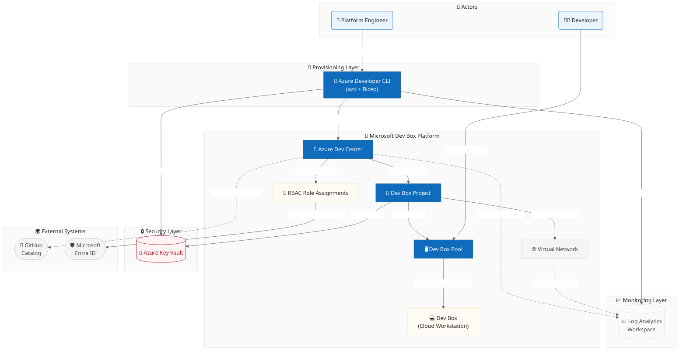

# DevExp-DevBox — Microsoft Dev Box Accelerator

[](LICENSE)
[](https://learn.microsoft.com/en-us/azure/developer/azure-developer-cli/)
[](https://learn.microsoft.com/en-us/azure/azure-resource-manager/bicep/overview)
[](https://learn.microsoft.com/en-us/azure/dev-box/overview-what-is-microsoft-dev-box)

**DevExp-DevBox** is an enterprise-grade, configuration-driven
Infrastructure-as-Code accelerator for deploying
[Microsoft Dev Box](https://learn.microsoft.com/en-us/azure/dev-box/overview-what-is-microsoft-dev-box)
environments on Azure. It enables platform engineering teams to provision a
centralized developer workstation platform — complete with role-specific Dev Box
pools, secure secrets management, and catalog-driven image definitions — with a
single `azd up` command.

The project solves the challenge of consistently provisioning secure, monitored,
and role-appropriate developer environments across large teams and multiple
projects. Setting up an Azure Dev Center with proper RBAC, Key Vault
integration, virtual network connectivity, and catalog synchronization normally
requires significant manual configuration and is error-prone at scale. This
accelerator codifies all of those concerns into declarative, version-controlled
YAML configuration and Bicep templates.

The solution is built on **Azure Bicep** for infrastructure definitions, **Azure
Developer CLI (azd)** for deployment orchestration, and **YAML-driven
configuration** for declarative management of Dev Centers, projects, pools,
environment types, and source control catalogs. Both GitHub and Azure DevOps are
supported as catalog sources.

## Table of Contents

- [Features](#features)
- [Architecture](#architecture)
- [Technologies Used](#technologies-used)
- [Quick Start](#quick-start)
- [Configuration](#configuration)
- [Deployment](#deployment)
- [Usage](#usage)
- [Contributing](#contributing)
- [License](#license)

## Features

- 🏢 **One-command provisioning** — deploy a fully configured Azure Dev Center
  with `azd up`, driven by YAML configuration files.
- 📁 **Multi-project support** — define multiple Dev Box projects, each with
  dedicated pools, catalogs, and environment types.
- 🖥️ **Role-specific Dev Box pools** — create pre-configured workstation pools
  tailored to specific engineering roles (for example, backend engineers and
  frontend engineers with different VM SKUs and image definitions).
- 🔐 **Secure secrets management** — store Git access tokens in Azure Key Vault
  with RBAC authorization, purge protection, and soft delete enabled.
- 🌐 **Flexible network connectivity** — support for both Microsoft-hosted
  Managed networks and custom Azure Virtual Networks with configurable address
  prefixes and subnets.
- 🛡️ **Principle-of-least-privilege RBAC** — role assignments for Dev Managers,
  project identities, and developer groups are declared in configuration and
  applied automatically.
- 📊 **Centralized monitoring** — Log Analytics Workspace captures diagnostics
  from the Dev Center, projects, and virtual networks.
- 🐙 **Catalog integration** — sync Dev Box image definitions and deployment
  environment templates from GitHub or Azure DevOps repositories.
- ♻️ **Environment lifecycle support** — built-in support for `dev`, `staging`,
  and `UAT` deployment environment types per project.
- 🧹 **Clean teardown** — a dedicated cleanup script (`cleanSetUp.ps1`) removes
  all provisioned resources, service principals, and secrets.

## Architecture

The following diagram illustrates the primary actors, major components, and
their interactions in the DevExp-DevBox platform.


```mermaid
---
config:
  description: "High-level architecture diagram showing actors, primary flows, and major components."
  theme: base
  align: center
  fontFamily: "Segoe UI, Verdana, sans-serif"
  fontSize: 16
  themeVariables:
    primaryColor: "#0f6cbd"
    primaryTextColor: "#FFFFFF"
    primaryBorderColor: "#0f548c"
    secondaryColor: "#ebf3fc"
    secondaryTextColor: "#242424"
    secondaryBorderColor: "#0f6cbd"
    tertiaryColor: "#f5f5f5"
    tertiaryTextColor: "#424242"
    tertiaryBorderColor: "#d1d1d1"
    noteBkgColor: "#fefbf4"
    noteTextColor: "#242424"
    noteBorderColor: "#f9e2ae"
    lineColor: "#616161"
    background: "#FFFFFF"
    edgeLabelBackground: "#FFFFFF"
    clusterBkg: "#fafafa"
    clusterBorder: "#e0e0e0"
    titleColor: "#242424"
    errorBkgColor: "#fdf3f4"
    errorTextColor: "#b10e1c"
---
flowchart TB

  %% ── Actors ──────────────────────────────────────────────────────────────────
  subgraph ACTORS["👥 Actors"]
    Actor_PE("👷 Platform Engineer")
    Actor_Dev("👩‍💻 Developer")
  end

  %% ── Provisioning Layer ───────────────────────────────────────────────────────
  subgraph PROVISION["🔧 Provisioning Layer"]
    AzdCLI["🚀 Azure Developer CLI<br/>(azd + Bicep)"]
  end

  %% ── Microsoft Dev Box Platform ───────────────────────────────────────────────
  subgraph DEVBOX_PLATFORM["🏢 Microsoft Dev Box Platform"]
    DevCenter["🏢 Azure Dev Center"]
    RBAC["🔑 RBAC Role Assignments"]
    Project["📁 Dev Box Project"]
    VNet["🌐 Virtual Network"]
    Pool["🖥️ Dev Box Pool"]
    DevBox["💻 Dev Box<br/>(Cloud Workstation)"]
  end

  %% ── Security Layer ───────────────────────────────────────────────────────────
  subgraph SECURITY_LAYER["🔒 Security Layer"]
    KeyVault[("🔐 Azure Key Vault")]
  end

  %% ── Monitoring Layer ─────────────────────────────────────────────────────────
  subgraph MONITORING_LAYER["📈 Monitoring Layer"]
    LogAnalytics[("📊 Log Analytics<br/>Workspace")]
  end

  %% ── External Systems ─────────────────────────────────────────────────────────
  subgraph EXTERNAL["🌍 External Systems"]
    GitHubCatalog(["🐙 GitHub<br/>Catalog"])
    EntraID(["🛡️ Microsoft<br/>Entra ID"])
  end

  %% ── Edges: Provisioning ──────────────────────────────────────────────────────
  Actor_PE -->|"azd up"| AzdCLI
  AzdCLI -->|"deploys infrastructure"| DevCenter
  AzdCLI -->|"provisions secret store"| KeyVault
  AzdCLI -->|"provisions monitoring"| LogAnalytics

  %% ── Edges: Dev Center Setup ──────────────────────────────────────────────────
  DevCenter -->|"creates project"| Project
  DevCenter -->|"manages access"| RBAC
  DevCenter -.->|"syncs catalog items"| GitHubCatalog
  RBAC -->|"binds groups to roles"| EntraID

  %% ── Edges: Project Resources ─────────────────────────────────────────────────
  Project -->|"creates pools"| Pool
  Project -->|"provisions network"| VNet
  Project -->|"reads secrets"| KeyVault

  %% ── Edges: Developer Workflow ────────────────────────────────────────────────
  Actor_Dev -->|"requests Dev Box"| Pool
  Pool -->|"provisions workstation"| DevBox

  %% ── Edges: Diagnostics ───────────────────────────────────────────────────────
  DevCenter -.->|"sends diagnostics"| LogAnalytics
  VNet -.->|"sends diagnostics"| LogAnalytics

  %% ── Class Definitions ────────────────────────────────────────────────────────
  classDef actorStyle fill:#ebf3fc,stroke:#0f6cbd,color:#242424
  classDef provisionStyle fill:#0f6cbd,stroke:#0f548c,color:#FFFFFF
  classDef platformStyle fill:#0f6cbd,stroke:#0f548c,color:#FFFFFF
  classDef devboxStyle fill:#fefbf4,stroke:#f9e2ae,color:#242424
  classDef securityStyle fill:#fdf3f4,stroke:#b10e1c,color:#b10e1c
  classDef monitoringStyle fill:#fafafa,stroke:#e0e0e0,color:#424242
  classDef networkStyle fill:#f5f5f5,stroke:#d1d1d1,color:#424242
  classDef externalStyle fill:#f5f5f5,stroke:#d1d1d1,color:#424242
  classDef rbacStyle fill:#fefbf4,stroke:#f9e2ae,color:#242424

  %% ── Class Assignments ────────────────────────────────────────────────────────
  class Actor_PE,Actor_Dev actorStyle
  class AzdCLI provisionStyle
  class DevCenter,Project,Pool platformStyle
  class DevBox devboxStyle
  class KeyVault securityStyle
  class LogAnalytics monitoringStyle
  class VNet networkStyle
  class GitHubCatalog,EntraID externalStyle
  class RBAC rbacStyle
```

## Technologies Used

| Technology                                                                                                         | Type                   | Purpose                                                                                      |
| ------------------------------------------------------------------------------------------------------------------ | ---------------------- | -------------------------------------------------------------------------------------------- |
| [Azure Bicep](https://learn.microsoft.com/en-us/azure/azure-resource-manager/bicep/overview)                       | Infrastructure as Code | Declares all Azure resources and modules                                                     |
| [Azure Developer CLI (azd)](https://learn.microsoft.com/en-us/azure/developer/azure-developer-cli/)                | Deployment Tooling     | Orchestrates environment setup, provisioning hooks, and `azd up` / `azd down` lifecycle      |
| [Microsoft Dev Box](https://learn.microsoft.com/en-us/azure/dev-box/overview-what-is-microsoft-dev-box)            | Platform Service       | Provides managed cloud developer workstations                                                |
| [Azure Dev Center](https://learn.microsoft.com/en-us/azure/dev-box/concept-dev-box-concepts)                       | Azure Resource         | Central management hub for Dev Box projects, pools, catalogs, and environment types          |
| [Azure Key Vault](https://learn.microsoft.com/en-us/azure/key-vault/general/basic-concepts)                        | Security               | Stores Git access tokens with RBAC authorization and soft-delete protection                  |
| [Azure Log Analytics Workspace](https://learn.microsoft.com/en-us/azure/azure-monitor/logs/log-analytics-overview) | Monitoring             | Collects diagnostic logs and metrics from Dev Center, projects, and networks                 |
| [Azure Virtual Network](https://learn.microsoft.com/en-us/azure/virtual-network/virtual-networks-overview)         | Networking             | Provides network isolation for Dev Box connections when using custom VNets                   |
| [Microsoft Entra ID](https://learn.microsoft.com/en-us/entra/fundamentals/whatis)                                  | Identity               | Azure AD groups control role assignments for Dev Managers and developer teams                |
| [GitHub](https://github.com) / [Azure DevOps](https://azure.microsoft.com/en-us/products/devops)                   | Source Control         | Hosts Dev Box image definitions and deployment environment catalogs                          |
| [Bash](https://www.gnu.org/software/bash/)                                                                         | Scripting              | `setUp.sh` handles environment initialization on Linux and macOS                             |
| [PowerShell](https://learn.microsoft.com/en-us/powershell/)                                                        | Scripting              | `setUp.ps1` and `cleanSetUp.ps1` handle setup and teardown on Windows                        |
| [YAML](https://yaml.org/)                                                                                          | Configuration          | Declarative configuration files for Dev Center, resource organization, and security settings |

## Quick Start

### Prerequisites

| Prerequisite                                                                                                   | Version | Notes                                                                           |
| -------------------------------------------------------------------------------------------------------------- | ------- | ------------------------------------------------------------------------------- |
| [Azure CLI](https://learn.microsoft.com/en-us/cli/azure/install-azure-cli)                                     | Latest  | Required for Azure resource operations                                          |
| [Azure Developer CLI (azd)](https://learn.microsoft.com/en-us/azure/developer/azure-developer-cli/install-azd) | Latest  | Required to run `azd up`                                                        |
| [GitHub CLI (gh)](https://cli.github.com/)                                                                     | Latest  | Required when using GitHub as the source control platform                       |
| Azure Subscription                                                                                             | —       | Must have Owner or Contributor + User Access Administrator permissions          |
| Azure AD permission                                                                                            | —       | Must be able to create and assign roles to service principals and groups        |
| Git access token                                                                                               | —       | Personal access token (GitHub) or PAT (Azure DevOps) for catalog authentication |

### Installation

1. Clone the repository:

   ```bash
   git clone https://github.com/Evilazaro/DevExp-DevBox.git
   cd DevExp-DevBox
   ```

2. Log in to Azure and GitHub:

   ```bash
   az login
   gh auth login          # required only when using GitHub as source control
   azd auth login
   ```

3. Review and customize the configuration files:
   - [`infra/settings/workload/devcenter.yaml`](infra/settings/workload/devcenter.yaml)
     — Dev Center name, projects, pools, catalogs, and environment types.
   - [`infra/settings/resourceOrganization/azureResources.yaml`](infra/settings/resourceOrganization/azureResources.yaml)
     — Resource group landing zones.
   - [`infra/settings/security/security.yaml`](infra/settings/security/security.yaml)
     — Key Vault settings.

4. Provision the environment:

   ```bash
   azd up
   ```

   The CLI will prompt for the following values:

   ```
   AZURE_ENV_NAME   : Name for the environment (e.g., dev)
   AZURE_LOCATION   : Azure region (e.g., eastus2)
   KEY_VAULT_SECRET : Git access token to store in Key Vault
   ```

5. After provisioning completes, the Dev Center and configured projects are
   available in the [Azure portal](https://portal.azure.com).

## Configuration

All configuration is managed through YAML files in the `infra/settings/`
directory. No manual portal configuration is required.

### `infra/settings/workload/devcenter.yaml`

| Option                                 | Default                 | Description                                                               |
| -------------------------------------- | ----------------------- | ------------------------------------------------------------------------- |
| `name`                                 | `devexp`                | Name of the Azure Dev Center resource                                     |
| `catalogItemSyncEnableStatus`          | `Enabled`               | Controls automatic catalog item synchronization                           |
| `microsoftHostedNetworkEnableStatus`   | `Enabled`               | Enables Microsoft-hosted network for Dev Boxes                            |
| `installAzureMonitorAgentEnableStatus` | `Enabled`               | Installs Azure Monitor agent on Dev Boxes                                 |
| `identity.type`                        | `SystemAssigned`        | Managed identity type for the Dev Center                                  |
| `catalogs[].uri`                       | —                       | Git repository URI for Dev Box image definitions or environment templates |
| `environmentTypes[].name`              | `dev`, `staging`, `uat` | Deployment environment types available in each project                    |
| `projects[].name`                      | —                       | Name of the Dev Box project                                               |
| `projects[].pools[].vmSku`             | —                       | VM SKU for a Dev Box pool (e.g., `general_i_32c128gb512ssd_v2`)           |

### `infra/settings/resourceOrganization/azureResources.yaml`

| Option              | Default           | Description                                                                       |
| ------------------- | ----------------- | --------------------------------------------------------------------------------- |
| `workload.create`   | `true`            | Whether to create a dedicated workload resource group                             |
| `workload.name`     | `devexp-workload` | Base name for the workload resource group                                         |
| `security.create`   | `false`           | Whether to create a dedicated security resource group (defaults to workload RG)   |
| `monitoring.create` | `false`           | Whether to create a dedicated monitoring resource group (defaults to workload RG) |

### `infra/settings/security/security.yaml`

| Option                               | Default   | Description                                                             |
| ------------------------------------ | --------- | ----------------------------------------------------------------------- |
| `keyVault.name`                      | `contoso` | Base name for the Key Vault (a unique suffix is appended automatically) |
| `keyVault.enablePurgeProtection`     | `true`    | Prevents permanent deletion of the Key Vault                            |
| `keyVault.enableSoftDelete`          | `true`    | Enables recovery of deleted secrets within the retention period         |
| `keyVault.softDeleteRetentionInDays` | `7`       | Number of days deleted secrets are retained (7–90)                      |
| `keyVault.enableRbacAuthorization`   | `true`    | Uses Azure RBAC for access control instead of access policies           |

Example: to use a separate security resource group and increase the soft-delete
retention period, update the files as follows:

```yaml
# infra/settings/resourceOrganization/azureResources.yaml
security:
  create: true
  name: devexp-security
```

```yaml
# infra/settings/security/security.yaml
keyVault:
  softDeleteRetentionInDays: 30
```

> [!NOTE] The Key Vault name must be globally unique. The deployment appends a
> unique string derived from the resource group ID and subscription ID
> automatically.

## Deployment

Follow these steps to deploy the DevExp-DevBox platform to an Azure
subscription.

1. Ensure all [prerequisites](#prerequisites) are installed and you are
   authenticated to Azure:

   ```bash
   az login
   azd auth login
   ```

2. Set the required environment variables, or allow `azd up` to prompt for them
   interactively:

   ```bash
   export AZURE_ENV_NAME="dev"
   export AZURE_LOCATION="eastus2"
   export KEY_VAULT_SECRET="<your-git-access-token>"
   ```

   On Windows (PowerShell):

   ```powershell
   $env:AZURE_ENV_NAME   = "dev"
   $env:AZURE_LOCATION   = "eastus2"
   $env:KEY_VAULT_SECRET = "<your-git-access-token>"
   ```

3. Run the deployment:

   ```bash
   azd up
   ```

   The `preprovision` hook in [`azure.yaml`](azure.yaml) automatically runs
   [`setUp.sh`](setUp.sh) (Linux/macOS) or [`setUp.ps1`](setUp.ps1) (Windows) to
   configure the environment, authenticate with GitHub, and prepare Azure
   credentials before Bicep provisioning begins.

4. Verify the deployment outputs:

   ```bash
   azd env get-values
   ```

   Expected output variables:

   ```
   AZURE_DEV_CENTER_NAME
   AZURE_DEV_CENTER_PROJECTS
   AZURE_KEY_VAULT_NAME
   AZURE_KEY_VAULT_ENDPOINT
   AZURE_LOG_ANALYTICS_WORKSPACE_NAME
   WORKLOAD_AZURE_RESOURCE_GROUP_NAME
   ```

5. To tear down all provisioned resources and clean up credentials:

   ```powershell
   .\cleanSetUp.ps1 -EnvName "dev" -Location "eastus2"
   ```

> [!WARNING] Running `cleanSetUp.ps1` deletes all resource groups, service
> principals, and GitHub secrets created by the accelerator. This action is
> irreversible.

## Usage

### Access the Dev Center in the Azure Portal

After a successful deployment, navigate to the
[Azure portal](https://portal.azure.com), locate the resource group output as
`WORKLOAD_AZURE_RESOURCE_GROUP_NAME`, and open the **Dev Center** resource.

### Add a New Dev Box Project

Define a new project entry in
[`infra/settings/workload/devcenter.yaml`](infra/settings/workload/devcenter.yaml)
and re-run `azd up`:

```yaml
# infra/settings/workload/devcenter.yaml
projects:
  - name: 'my-new-project'
    description: 'My new Dev Box project.'
    network:
      virtualNetworkType: Managed
    identity:
      type: SystemAssigned
      roleAssignments:
        - azureADGroupId: '<your-azure-ad-group-id>'
          azureADGroupName: 'My Engineers'
          azureRBACRoles:
            - name: 'Dev Box User'
              id: '45d50f46-0b78-4001-a660-4198cbe8cd05'
              scope: Project
    pools:
      - name: 'standard-engineer'
        imageDefinitionName: 'my-image-definition'
        vmSku: general_i_16c64gb256ssd_v2
    environmentTypes:
      - name: 'dev'
        deploymentTargetId: ''
    catalogs:
      - name: 'environments'
        type: environmentDefinition
        sourceControl: gitHub
        visibility: private
        uri: 'https://github.com/<org>/<repo>.git'
        branch: 'main'
        path: '/.devcenter/environments'
    tags:
      environment: 'dev'
      project: 'my-new-project'
```

```bash
# Apply the changes
azd up
```

### Retrieve Deployment Outputs

```bash
# List all environment output values
azd env get-values

# Expected output:
# AZURE_DEV_CENTER_NAME=devexp
# AZURE_KEY_VAULT_NAME=contoso-<unique>-kv
# AZURE_LOG_ANALYTICS_WORKSPACE_NAME=logAnalytics-<unique>
# WORKLOAD_AZURE_RESOURCE_GROUP_NAME=devexp-workload-dev-eastus2-RG
```

### Run Cleanup

```powershell
# Remove all resources, service principals, and GitHub secrets
.\cleanSetUp.ps1 -EnvName "dev" -Location "eastus2" -AppDisplayName "ContosoDevEx GitHub Actions Enterprise App"
```

> [!TIP] Use the `-WhatIf` flag with `cleanSetUp.ps1` to preview what resources
> will be deleted before committing to the cleanup.

## Contributing

Contributions are welcome. To submit a bug report or feature request, open an
issue in the
[GitHub issue tracker](https://github.com/Evilazaro/DevExp-DevBox/issues).

To contribute code:

1. Fork the repository.
2. Create a feature branch from `main`: `git checkout -b feature/my-feature`.
3. Commit your changes following the existing code conventions.
4. Push the branch and open a pull request against `main`.
5. Describe the problem solved and link to any related issues in the pull
   request description.

> [!IMPORTANT] Ensure that all Bicep files pass `az bicep build` without errors
> and that YAML configuration files are validated against their corresponding
> JSON Schema files (located in `infra/settings/`) before submitting a pull
> request.

## License

This project is licensed under the **MIT License**. See the [LICENSE](LICENSE)
file for full details.
