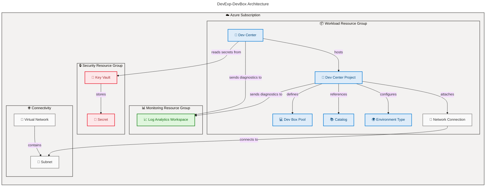

# DevExp-DevBox

Microsoft Dev Box Deployment Accelerator — an Infrastructure as Code (IaC)
solution that automates the provisioning and configuration of Azure Dev Box
environments using Bicep, PowerShell, and Azure Developer CLI (`azd`).

[](LICENSE)
[](https://learn.microsoft.com/en-us/azure/dev-box/overview-what-is-microsoft-dev-box)
[](https://learn.microsoft.com/en-us/azure/azure-resource-manager/bicep/overview)
[](https://learn.microsoft.com/en-us/azure/developer/azure-developer-cli/overview)

## Overview

**Overview**

DevExp-DevBox delivers a production-ready accelerator for organizations adopting
Microsoft Dev Box as their cloud-based developer workstation platform. It
eliminates manual Azure portal configuration by codifying every resource — from
Dev Centers and projects to networking, identity, and security — into reusable,
parameterized Bicep modules driven by YAML configuration files.

The accelerator follows Azure Landing Zone principles to separate concerns
across dedicated resource groups for workload, security, and monitoring. It
supports multiple source control platforms (GitHub and Azure DevOps), enforces
least-privilege RBAC, and provides automated setup scripts for both Windows
(`setUp.ps1`) and Linux/macOS (`setUp.sh`) environments.

> [!NOTE] This project targets platform engineering teams that manage developer
> environments at scale. Individual developers who consume Dev Boxes do not need
> to deploy this accelerator directly.

## Table of Contents

- [Architecture](#architecture)
- [Features](#features)
- [Requirements](#requirements)
- [Quick Start](#quick-start)
- [Configuration](#configuration)
- [Deployment](#deployment)
- [Project Structure](#project-structure)
- [Contributing](#contributing)
- [License](#license)

## Architecture

**Overview**

The accelerator deploys a multi-tier Azure architecture organized into three
resource groups following Azure Landing Zone patterns. The workload tier hosts
the Dev Center and its projects, pool definitions, and catalogs. The security
tier manages Key Vault for secrets storage, and the monitoring tier provides
centralized Log Analytics for diagnostics.


```mermaid
---
title: "DevExp-DevBox Architecture"
config:
  theme: base
  look: classic
  layout: dagre
  flowchart:
    htmlLabels: true
---
flowchart TB
    accTitle: DevExp-DevBox Architecture
    accDescr: Shows the three-tier Azure architecture with workload, security, and monitoring resource groups and their component relationships

    %% ═══════════════════════════════════════════════════════════════════════════
    %% AZURE / FLUENT ARCHITECTURE PATTERN v1.1
    %% PHASE 1 - STRUCTURAL: Direction explicit, flat topology, nesting ≤ 3
    %% PHASE 2 - SEMANTIC: Colors justified, max 5 semantic classes, neutral-first
    %% PHASE 3 - FONT: Dark text on light backgrounds, contrast ≥ 4.5:1
    %% PHASE 4 - ACCESSIBILITY: accTitle/accDescr present, icons on all nodes
    %% PHASE 5 - STANDARD: Governance block present, classDefs centralized
    %% ═══════════════════════════════════════════════════════════════════════════

    subgraph subscription["☁️ Azure Subscription"]
        direction TB

        subgraph workloadRG["📦 Workload Resource Group"]
            direction TB
            devCenter["🏢 Dev Center"]:::core
            project["📁 Dev Center Project"]:::core
            pool["💻 Dev Box Pool"]:::core
            catalog["📚 Catalog"]:::core
            envType["🌍 Environment Type"]:::core
            netConn["🔗 Network Connection"]:::neutral

            devCenter -->|"hosts"| project
            project -->|"defines"| pool
            project -->|"references"| catalog
            project -->|"configures"| envType
            project -->|"attaches"| netConn
        end

        subgraph securityRG["🔒 Security Resource Group"]
            direction TB
            keyVault["🔐 Key Vault"]:::danger
            secret["🔑 Secret"]:::danger

            keyVault -->|"stores"| secret
        end

        subgraph monitoringRG["📊 Monitoring Resource Group"]
            direction TB
            logAnalytics["📈 Log Analytics Workspace"]:::success
        end

        subgraph connectivityRG["🌐 Connectivity"]
            direction TB
            vnet["🔗 Virtual Network"]:::neutral
            subnet["📍 Subnet"]:::neutral

            vnet -->|"contains"| subnet
        end

        devCenter -->|"reads secrets from"| keyVault
        devCenter -->|"sends diagnostics to"| logAnalytics
        project -->|"sends diagnostics to"| logAnalytics
        netConn -->|"connects to"| subnet
    end

    style subscription fill:#F3F2F1,stroke:#605E5C,stroke-width:2px
    style workloadRG fill:#F3F2F1,stroke:#605E5C,stroke-width:2px
    style securityRG fill:#F3F2F1,stroke:#605E5C,stroke-width:2px
    style monitoringRG fill:#F3F2F1,stroke:#605E5C,stroke-width:2px
    style connectivityRG fill:#F3F2F1,stroke:#605E5C,stroke-width:2px

    %% Centralized semantic classDefs (Phase 5 compliant)
    classDef core fill:#DEECF9,stroke:#0078D4,stroke-width:2px,color:#004578
    classDef success fill:#DFF6DD,stroke:#107C10,stroke-width:2px,color:#0B6A0B
    classDef danger fill:#FDE7E9,stroke:#E81123,stroke-width:2px,color:#A4262C
    classDef neutral fill:#FAFAFA,stroke:#8A8886,stroke-width:2px,color:#323130
```

**Component Roles:**

| Component           | Purpose                                                                      | Resource Group |
| ------------------- | ---------------------------------------------------------------------------- | -------------- |
| 🏢 Dev Center       | Central management plane for developer workstations and environments         | Workload       |
| 📁 Project          | Scoped unit grouping pools, catalogs, and environment types per team         | Workload       |
| 💻 Dev Box Pool     | Collection of Dev Box definitions with specific VM SKUs and images           | Workload       |
| 📚 Catalog          | Git-backed repository of Dev Box image definitions and environment templates | Workload       |
| 🌍 Environment Type | Deployment stage definitions (dev, staging, UAT)                             | Workload       |
| 🔐 Key Vault        | Secrets management with RBAC authorization and purge protection              | Security       |
| 📈 Log Analytics    | Centralized diagnostics and monitoring workspace                             | Monitoring     |
| 🔗 Virtual Network  | Network isolation for unmanaged connectivity scenarios                       | Connectivity   |

## Features

**Overview**

This accelerator provides a comprehensive set of capabilities designed to reduce
the time and effort required to adopt Microsoft Dev Box at enterprise scale.
Instead of manually configuring resources through the Azure portal, teams define
their entire Dev Box platform in declarative YAML and Bicep, enabling repeatable
and auditable deployments.

The modular architecture means each component — identity, security, networking,
monitoring — can be customized independently without affecting other layers,
following infrastructure-as-code best practices.

| Feature                      | Description                                                                                                     | Status    |
| ---------------------------- | --------------------------------------------------------------------------------------------------------------- | --------- |
| 🏢 Dev Center Provisioning   | Automated deployment of Azure Dev Center with managed identity and diagnostic settings                          | ✅ Stable |
| 📁 Multi-Project Support     | Configure multiple Dev Center projects with independent pools, catalogs, and permissions                        | ✅ Stable |
| 🔐 Key Vault Integration     | Secure secrets management with RBAC authorization, soft delete, and purge protection                            | ✅ Stable |
| 📈 Centralized Monitoring    | Log Analytics workspace with diagnostic settings across all resources                                           | ✅ Stable |
| 🔗 Network Connectivity      | Support for both managed and unmanaged virtual network configurations                                           | ✅ Stable |
| 🛡️ RBAC Automation           | Least-privilege role assignments at subscription, resource group, and project scopes                            | ✅ Stable |
| ⚙️ YAML-Driven Configuration | Declarative configuration files with JSON Schema validation for Dev Center, security, and resource organization | ✅ Stable |
| 🚀 Cross-Platform Setup      | Automated setup scripts for Windows (PowerShell) and Linux/macOS (Bash) with GitHub and Azure DevOps support    | ✅ Stable |

## Requirements

**Overview**

Before deploying the accelerator, ensure your environment meets the following
prerequisites. The setup scripts validate tool availability automatically, but
the Azure permissions and Entra ID configuration must be prepared in advance by
a platform administrator.

All CLI tools listed below are used during the `azd` provisioning lifecycle. The
GitHub CLI is only required when using GitHub as the source control platform.

| Requirement                  | Details                                                                                                           | Required       |
| ---------------------------- | ----------------------------------------------------------------------------------------------------------------- | -------------- |
| ☁️ Azure Subscription        | An active Azure subscription with Contributor and User Access Administrator permissions                           | ✅ Yes         |
| 🔑 Azure CLI                 | Version 2.x or later — [Install Azure CLI](https://learn.microsoft.com/en-us/cli/azure/install-azure-cli)         | ✅ Yes         |
| 🛠️ Azure Developer CLI (azd) | Latest version — [Install azd](https://learn.microsoft.com/en-us/azure/developer/azure-developer-cli/install-azd) | ✅ Yes         |
| 🐙 GitHub CLI (gh)           | Required when using GitHub as source control — [Install GitHub CLI](https://cli.github.com/)                      | ⚡ Conditional |
| 📦 PowerShell 5.1+           | Required for Windows setup via `setUp.ps1`                                                                        | ⚡ Conditional |
| 🐧 Bash                      | Required for Linux/macOS setup via `setUp.sh`                                                                     | ⚡ Conditional |
| 🔗 jq                        | JSON processor required by `setUp.sh` — [Install jq](https://jqlang.github.io/jq/download/)                       | ⚡ Conditional |
| 🏢 Microsoft Entra ID        | Azure AD groups must be created for Dev Manager and Developer roles                                               | ✅ Yes         |

## Quick Start

**Overview**

Getting a Dev Box environment running involves two stages: preparing the
environment with the setup script, then provisioning Azure resources with `azd`.
The setup script validates prerequisites, verifies authentication, retrieves
your source control token, and writes it to the `azd` environment configuration.
Provisioning is a separate step that deploys the actual infrastructure.

### 1. Clone the Repository

```bash
git clone https://github.com/Evilazaro/DevExp-DevBox.git
cd DevExp-DevBox
```

### 2. Authenticate

Log into the required CLIs before running the setup script. The script validates
authentication and will exit with an error if any are missing.

```bash
az login
azd auth login
gh auth login          # only required when using GitHub as source control
```

### 3. Prepare the Environment

The setup script checks that all required tools are installed (`az`, `azd`,
`gh`), verifies your authentication status, retrieves your source control token
via the CLI, and writes `KEY_VAULT_SECRET` and `SOURCE_CONTROL_PLATFORM` to
`.azure/{envName}/.env`. It does **not** deploy any Azure resources.

**Windows (PowerShell):**

```powershell
.\setUp.ps1 -EnvName "dev" -SourceControl "github"
```

**Linux/macOS (Bash):**

```bash
chmod +x setUp.sh
./setUp.sh -e "dev" -s "github"
```

> [!TIP] If you omit the `-SourceControl` parameter, the script prompts you to
> select between GitHub and Azure DevOps interactively.

Expected output on successful preparation:

```text
ℹ️ [2026-03-03 10:00:00] Starting Dev Box environment setup
ℹ️ [2026-03-03 10:00:00] Environment name: dev
✅ [2026-03-03 10:00:01] All required tools are available
✅ [2026-03-03 10:00:02] GitHub authentication verified successfully
✅ [2026-03-03 10:00:03] GitHub token retrieved and stored securely
✅ [2026-03-03 10:00:04] Azure Developer CLI environment 'dev' initialized successfully.
✅ [2026-03-03 10:00:04] Dev Box environment 'dev' setup successfully
```

### 4. Provision Azure Resources

Once the environment is prepared, deploy the infrastructure with `azd`:

```bash
azd provision -e dev
```

This command reads the configuration from `infra/main.bicep` and the YAML
settings files, then creates the resource groups, Key Vault, Log Analytics
Workspace, Dev Center, projects, and all associated resources in your Azure
subscription.

## Configuration

**Overview**

All infrastructure settings are defined in YAML configuration files located
under `infra/settings/`. These files control every aspect of the deployment —
from resource group naming and tags to Dev Center projects, Dev Box pools, and
Key Vault security settings. Each YAML file has a companion JSON Schema for
validation.

This approach enables teams to customize deployments by editing configuration
files rather than modifying Bicep modules, reducing the risk of breaking
infrastructure logic while maintaining full flexibility.

### Configuration Files

| File                                                         | Purpose                                                                 |
| ------------------------------------------------------------ | ----------------------------------------------------------------------- |
| ⚙️ `infra/settings/workload/devcenter.yaml`                  | Dev Center name, identity, catalogs, environment types, projects, pools |
| 🔐 `infra/settings/security/security.yaml`                   | Key Vault name, soft delete, purge protection, RBAC settings            |
| 📦 `infra/settings/resourceOrganization/azureResources.yaml` | Resource group names, tags, and Landing Zone structure                  |
| 🌍 `azure.yaml`                                              | Azure Developer CLI configuration with pre-provision hooks              |

### Dev Center Configuration Example

The `devcenter.yaml` file defines the core Dev Center resource and its projects:

```yaml
# Dev Center Core Settings
name: 'devexp-devcenter'
catalogItemSyncEnableStatus: 'Enabled'
microsoftHostedNetworkEnableStatus: 'Enabled'
installAzureMonitorAgentEnableStatus: 'Enabled'

identity:
  type: 'SystemAssigned'
  roleAssignments:
    devCenter:
      - id: 'b24988ac-6180-42a0-ab88-20f7382dd24c'
        name: 'Contributor'
        scope: 'Subscription'

# Projects with role-specific Dev Box pools
projects:
  - name: 'eShop'
    description: 'eShop project.'
    pools:
      - name: 'backend-engineer'
        imageDefinitionName: 'eShop-backend-engineer'
        vmSku: general_i_32c128gb512ssd_v2
      - name: 'frontend-engineer'
        imageDefinitionName: 'eShop-frontend-engineer'
        vmSku: general_i_16c64gb256ssd_v2
```

### Resource Organization

Resource groups follow Azure Landing Zone principles for separation of concerns:

| Resource Group                           | Purpose                          | Created By         |
| ---------------------------------------- | -------------------------------- | ------------------ |
| 📦 `devexp-workload-{env}-{region}-RG`   | Dev Center and project resources | `infra/main.bicep` |
| 🔐 `devexp-security-{env}-{region}-RG`   | Key Vault and secret storage     | `infra/main.bicep` |
| 📊 `devexp-monitoring-{env}-{region}-RG` | Log Analytics Workspace          | `infra/main.bicep` |

### Key Vault Configuration

```yaml
# Security settings in security.yaml
create: true
keyVault:
  name: contoso
  secretName: gha-token
  enablePurgeProtection: true
  enableSoftDelete: true
  softDeleteRetentionInDays: 7
  enableRbacAuthorization: true
```

## Deployment

**Overview**

Deployment is orchestrated through Azure Developer CLI (`azd`), which reads
`azure.yaml` for hook definitions and `infra/main.bicep` as the primary
deployment entry point. The setup scripts automate the full lifecycle:
environment creation, authentication, secret storage, and infrastructure
provisioning.

### Deployment Parameters

| Parameter            | Description                                                          | Required |
| -------------------- | -------------------------------------------------------------------- | -------- |
| ⚙️ `environmentName` | Environment identifier used in resource naming (e.g., `dev`, `prod`) | ✅ Yes   |
| 🌍 `location`        | Azure region for deployment (e.g., `eastus2`, `westeurope`)          | ✅ Yes   |
| 🔑 `secretValue`     | GitHub personal access token stored in Key Vault                     | ✅ Yes   |

### Manual Deployment with azd

If you prefer to run `azd` directly instead of using the setup scripts:

```bash
azd init -e "dev"
azd env set AZURE_LOCATION "eastus2"
azd provision
```

### Cleanup

To remove all provisioned resources:

```powershell
.\cleanSetUp.ps1 -EnvName "dev" -Location "eastus2"
```

> [!WARNING] The cleanup script deletes Azure resource groups, service
> principals, and GitHub secrets. This action is irreversible for resources
> without soft delete enabled.

## Project Structure

**Overview**

The repository is organized into three top-level directories: `infra/` for
deployment orchestration and settings, `src/` for reusable Bicep modules grouped
by domain, and `prompts/` for documentation generation tooling (excluded from
deployment).

```text
DevExp-DevBox/
├── azure.yaml                    # Azure Developer CLI configuration
├── setUp.ps1                     # Windows setup script (PowerShell)
├── setUp.sh                      # Linux/macOS setup script (Bash)
├── cleanSetUp.ps1                # Cleanup script
├── infra/
│   ├── main.bicep                # Main deployment entry point
│   ├── main.parameters.json      # Parameter file for azd
│   └── settings/
│       ├── resourceOrganization/ # Resource group definitions
│       ├── security/             # Key Vault configuration
│       └── workload/             # Dev Center configuration
└── src/
    ├── connectivity/             # VNet, subnet, network connection modules
    ├── identity/                 # RBAC role assignment modules
    ├── management/               # Log Analytics module
    ├── security/                 # Key Vault and secret modules
    └── workload/
        ├── core/                 # Dev Center, catalog, environment type modules
        └── project/              # Project, pool, environment type modules
```

## Contributing

**Overview**

Contributions are welcome and follow a structured workflow using GitHub Issues
and Pull Requests. The project uses a product-oriented delivery model with
Epics, Features, and Tasks. All infrastructure code must be parameterized,
idempotent, and reusable across environments.

Before contributing, review the full guidelines in
[CONTRIBUTING.md](CONTRIBUTING.md). Key requirements include:

- Branch from `main` using the naming convention `feature/<short-name>` or
  `fix/<short-name>`
- Reference the related issue in every PR (e.g., `Closes #123`)
- Include validation evidence (e.g., `what-if` output for Bicep changes)
- Update documentation in the same PR as code changes
- Follow Bicep best practices: no hard-coded values, consistent naming,
  centralized tagging

### Engineering Standards

| Area             | Standard                                                     |
| ---------------- | ------------------------------------------------------------ |
| 🛠️ Bicep         | Parameterized, idempotent modules with no embedded secrets   |
| ⚙️ PowerShell    | PowerShell 7+ compatible with clear error handling           |
| 📝 Documentation | Every module must have purpose, inputs/outputs, and examples |
| 🔍 Validation    | `what-if` validation and smoke tests for deployment PRs      |

## License

This project is licensed under the MIT License. See [LICENSE](LICENSE) for
details.

Copyright (c) 2025 Evilázaro Alves
