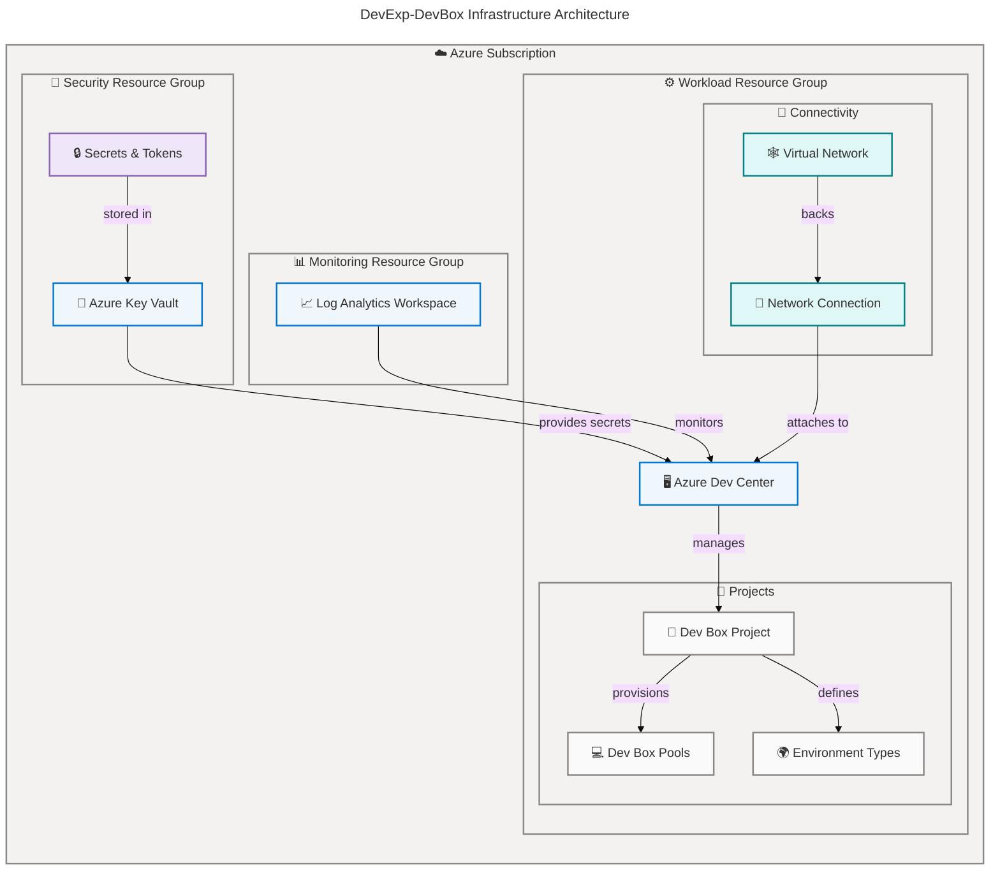

# DevExp-DevBox

[](https://opensource.org/licenses/MIT)
[](https://learn.microsoft.com/en-us/azure/developer/azure-developer-cli/)
[](https://learn.microsoft.com/en-us/azure/azure-resource-manager/bicep/overview)
[](https://azure.microsoft.com)
[](https://github.com/Evilazaro/DevExp-DevBox)

The **DevExp-DevBox** accelerator automates end-to-end deployment of
[Microsoft Dev Box](https://learn.microsoft.com/en-us/azure/dev-box/overview-what-is-microsoft-dev-box)
environments on Azure using Infrastructure as Code (Bicep) and the
[Azure Developer CLI](https://learn.microsoft.com/en-us/azure/developer/azure-developer-cli/).
A single `azd up` command provisions a fully governed, multi-project Dev Center
with networking, security, monitoring, and role-based access control — no manual
portal steps required.

## Overview

**Overview**

DevExp-DevBox bridges the gap between manual Dev Box configuration and scalable,
repeatable developer environment management. Platform engineering teams and
DevOps architects use this accelerator to stand up enterprise-grade developer
workstations across multiple projects without per-project scripting or portal
work.

It packages every required Azure resource — Dev Center, Key Vault, Log Analytics
Workspace, virtual networks, and role assignments — into a YAML-driven,
pipeline-ready blueprint. Teams declaratively define their developer
environments in `infra/settings/`, and the accelerator handles provisioning,
wiring, and governance in a single deployment pass compliant with
[Azure Landing Zone](https://learn.microsoft.com/en-us/azure/cloud-adoption-framework/ready/landing-zone/)
principles.

## Table of Contents

- [Architecture](#architecture)
- [Features](#features)
- [Requirements](#requirements)
- [Quick Start](#quick-start)
- [Configuration](#configuration)
- [Deployment](#deployment)
- [Usage](#usage)
- [Contributing](#contributing)
- [License](#license)

## Architecture

**Overview**

The accelerator deploys across three dedicated Azure resource groups following
landing zone principles: **Security** (Key Vault), **Monitoring** (Log
Analytics), and **Workload** (Dev Center, projects, and connectivity).
Dependencies flow deliberately: the monitoring layer feeds telemetry to Dev
Center, the security layer supplies credentials via Key Vault, and project-level
virtual networks attach through dedicated network connections.


```mermaid
---
title: "DevExp-DevBox Infrastructure Architecture"
config:
  theme: base
  look: classic
  layout: dagre
  flowchart:
    htmlLabels: true
---
flowchart TB
    accTitle: DevExp-DevBox Infrastructure Architecture
    accDescr: Azure subscription-scoped infrastructure with Security, Monitoring, and Workload landing zones. Dev Center consumes Key Vault secrets and Log Analytics telemetry, manages role-specific Dev Box pools through YAML-configured projects, and attaches to project-level virtual networks via network connections.

    %% ═══════════════════════════════════════════════════════════════════════════
    %% AZURE / FLUENT ARCHITECTURE PATTERN v1.1
    %% (Semantic + Structural + Font + Accessibility Governance)
    %% ═══════════════════════════════════════════════════════════════════════════
    %% PHASE 1 - FLUENT UI: All styling uses approved Fluent UI palette only
    %% PHASE 2 - GROUPS: Every subgraph has semantic color via style directive
    %% PHASE 3 - COMPONENTS: Every node has semantic classDef + icon prefix
    %% PHASE 4 - ACCESSIBILITY: accTitle/accDescr present, WCAG AA contrast
    %% PHASE 5 - STANDARD: Governance block present, classDefs centralized
    %% ═══════════════════════════════════════════════════════════════════════════

    subgraph sub["☁️ Azure Subscription"]
        direction TB

        subgraph secRG["🔐 Security Resource Group"]
            kv["🔑 Azure Key Vault"]:::core
            sec["🔒 Secrets & Tokens"]:::data
        end

        subgraph monRG["📊 Monitoring Resource Group"]
            law["📈 Log Analytics Workspace"]:::core
        end

        subgraph wrkRG["⚙️ Workload Resource Group"]
            dc["🖥️ Azure Dev Center"]:::core

            subgraph proj["📁 Projects"]
                p1["🎯 Dev Box Project"]:::neutral
                pools["💻 Dev Box Pools"]:::neutral
                envt["🌍 Environment Types"]:::neutral
            end

            subgraph netg["🔗 Connectivity"]
                vnet["🕸️ Virtual Network"]:::external
                nc["🔌 Network Connection"]:::external
            end
        end
    end

    sec -->|"stored in"| kv
    kv -->|"provides secrets"| dc
    law -->|"monitors"| dc
    dc -->|"manages"| p1
    p1 -->|"provisions"| pools
    p1 -->|"defines"| envt
    vnet -->|"backs"| nc
    nc -->|"attaches to"| dc

    style sub  fill:#F3F2F1,stroke:#8A8886,stroke-width:2px,color:#323130
    style secRG fill:#F3F2F1,stroke:#8A8886,stroke-width:2px,color:#323130
    style monRG fill:#F3F2F1,stroke:#8A8886,stroke-width:2px,color:#323130
    style wrkRG fill:#F3F2F1,stroke:#8A8886,stroke-width:2px,color:#323130
    style proj  fill:#F3F2F1,stroke:#8A8886,stroke-width:2px,color:#323130
    style netg  fill:#F3F2F1,stroke:#8A8886,stroke-width:2px,color:#323130

    %% Centralized semantic classDefs (Phase 5 compliant)
    classDef neutral  fill:#FAFAFA,stroke:#8A8886,stroke-width:2px,color:#323130
    classDef core     fill:#EFF6FC,stroke:#0078D4,stroke-width:2px,color:#323130
    classDef data     fill:#F0E6FA,stroke:#8764B8,stroke-width:2px,color:#323130
    classDef external fill:#E0F7F7,stroke:#038387,stroke-width:2px,color:#323130
```

**Component Roles:**

| Component                    | Description                                                                     |
| ---------------------------- | ------------------------------------------------------------------------------- |
| ☁️ Azure Subscription        | Top-level scope; all resource groups deploy here (`infra/main.bicep`)           |
| 🔐 Security Resource Group   | Hosts Azure Key Vault for token and secret management                           |
| 🔑 Azure Key Vault           | Stores GitHub Actions or Azure DevOps tokens with RBAC authorization            |
| 📊 Monitoring Resource Group | Centralizes observability for all Dev Center diagnostic events                  |
| 📈 Log Analytics Workspace   | Receives diagnostic logs from Dev Center and connected resources                |
| ⚙️ Workload Resource Group   | Contains Dev Center, Dev Box projects, pools, and network resources             |
| 🖥️ Azure Dev Center          | Central hub for Dev Box definitions, catalogs, and environment types            |
| 💻 Dev Box Pools             | Role-specific VM configurations (e.g., `backend-engineer`, `frontend-engineer`) |

## Features

**Overview**

DevExp-DevBox removes the operational burden of configuring developer
workstations at scale. From a single YAML configuration in
`infra/settings/workload/devcenter.yaml`, platform teams define role-specific
Dev Box pool configurations, multi-project access policies, and environment
lifecycle management — deployable repeatably through CI/CD pipelines or
`azd up`.

The accelerator enforces Azure landing zone principles by default, ensuring
clear resource group separation, least-privilege RBAC, managed identity
integration, and centralized logging. Every deployment is functional and
audit-ready from day one, with no manual portal steps required.

| Feature                      | Description                                                    | Status    |
| ---------------------------- | -------------------------------------------------------------- | --------- |
| 🚀 One-command deployment    | Full environment provisioned with `azd up`                     | ✅ Stable |
| 🏗️ YAML-driven configuration | Dev Center, projects, and pools declared in YAML               | ✅ Stable |
| 🔐 Key Vault integration     | GitHub tokens stored with RBAC authorization enabled           | ✅ Stable |
| 📊 Built-in monitoring       | Log Analytics Workspace auto-wired to Dev Center               | ✅ Stable |
| 🧩 Multi-project support     | Multiple Dev Box projects per Dev Center                       | ✅ Stable |
| 💻 Role-specific pools       | Backend, frontend, and custom VM SKU pools supported           | ✅ Stable |
| 🌍 Multi-environment types   | Dev, Staging, and UAT environments out of the box              | ✅ Stable |
| 🔗 Flexible networking       | Managed (Microsoft-hosted) and unmanaged (customer VNet) modes | ✅ Stable |
| 🔑 Managed identity          | System-assigned identity with least-privilege RBAC assignments | ✅ Stable |
| 🧹 Cleanup automation        | `cleanSetUp.ps1` removes all provisioned resources             | ✅ Stable |

## Requirements

**Overview**

The accelerator runs on any workstation or CI/CD runner with the Azure Developer
CLI and an authenticated Azure session. Cross-platform support is built in:
`azure.yaml` drives Linux and macOS deployments via Bash hooks, while
`azure-pwh.yaml` handles Windows PowerShell environments. The only Azure-side
requirement is an active subscription with Contributor or Owner rights at the
subscription scope.

Before deploying, ensure all tools listed below are installed and authenticated.
The `setUp.sh` and `setUp.ps1` scripts validate dependencies at startup and halt
with descriptive error messages if any prerequisite is missing.

| Prerequisite           | Minimum Version | Purpose                                         | Install                                                                                            |
| ---------------------- | --------------- | ----------------------------------------------- | -------------------------------------------------------------------------------------------------- |
| ☁️ Azure Subscription  | Active          | Deployment target for all provisioned resources | [Azure Portal](https://portal.azure.com)                                                           |
| 🔑 Azure CLI           | 2.60.0+         | Azure resource management and authentication    | [Install guide](https://learn.microsoft.com/en-us/cli/azure/install-azure-cli)                     |
| 🛠️ Azure Developer CLI | 1.11.0+         | `azd up` deployment orchestration and hooks     | [Install guide](https://learn.microsoft.com/en-us/azure/developer/azure-developer-cli/install-azd) |
| 🐙 GitHub CLI          | 2.40.0+         | GitHub token and repository secrets integration | [Install guide](https://cli.github.com/)                                                           |
| ⚡ PowerShell          | 5.1+            | Windows deployment scripts (`setUp.ps1`)        | Built-in on Windows                                                                                |
| 🔗 jq                  | 1.6+            | JSON processing inside `setUp.sh` Bash scripts  | [Install guide](https://jqlang.github.io/jq/)                                                      |

> [!NOTE] The GitHub CLI (`gh`) is required only when
> `SOURCE_CONTROL_PLATFORM=github`. For Azure DevOps (`adogit`) deployments it
> can be omitted. If `SOURCE_CONTROL_PLATFORM` is not set, both setup scripts
> default to `github`.

## Quick Start

Deploy the full Dev Box environment in under 15 minutes:

```bash
# 1. Clone the repository
git clone https://github.com/Evilazaro/DevExp-DevBox.git
cd DevExp-DevBox

# 2. Authenticate with Azure
az login
azd auth login

# 3. Provision all resources (Linux/macOS)
azd up
```

On Windows, use the PowerShell-friendly configuration:

```powershell
# Windows: provision using the PowerShell azd configuration
azd up --template .
```

When prompted, supply:

- **Environment name** (`AZURE_ENV_NAME`): e.g., `dev`
- **Azure region** (`AZURE_LOCATION`): e.g., `eastus2`
- **Key Vault secret** (`KEY_VAULT_SECRET`): your GitHub Actions personal access
  token

Expected output after a successful deployment:

```text
SUCCESS: Your up workflow to provision and deploy to Azure completed.

Outputs:
  AZURE_DEV_CENTER_NAME               devexp-devcenter
  AZURE_KEY_VAULT_NAME                contoso
  AZURE_LOG_ANALYTICS_WORKSPACE_NAME  logAnalytics-dev-eastus2-RG
```

> [!TIP] To connect with Azure DevOps instead of GitHub, run
> `export SOURCE_CONTROL_PLATFORM=adogit` (Linux/macOS) or
> `$env:SOURCE_CONTROL_PLATFORM = "adogit"` (PowerShell) before `azd up`.

## Configuration

**Overview**

All deployment behavior is controlled through YAML configuration files in
`infra/settings/`. These files define resource group organization, Dev Center
topology, project layouts, pool configurations, and security parameters. No
Bicep changes are required to customize a deployment — only YAML edits are
needed, making the accelerator adaptable to any organization's naming
conventions and tagging policies.

The configuration layer separates concerns cleanly: `azureResources.yaml`
controls landing zone structure, `devcenter.yaml` manages workload topology, and
`security.yaml` governs Key Vault settings. Changes take effect on the next
`azd up`.

### Resource Group Organization

Configure landing zones in
`infra/settings/resourceOrganization/azureResources.yaml`:

```yaml
workload:
  create: true
  name: devexp-workload
  tags:
    environment: dev
    team: DevExP
    project: Contoso-DevExp-DevBox

security:
  create: true
  name: devexp-security

monitoring:
  create: true
  name: devexp-monitoring
```

### Dev Center and Projects

Define Dev Center topology in `infra/settings/workload/devcenter.yaml`:

```yaml
name: 'devexp-devcenter'
catalogItemSyncEnableStatus: 'Enabled'
microsoftHostedNetworkEnableStatus: 'Enabled'
installAzureMonitorAgentEnableStatus: 'Enabled'

projects:
  - name: 'eShop'
    pools:
      - name: 'backend-engineer'
        vmSku: general_i_32c128gb512ssd_v2
      - name: 'frontend-engineer'
        vmSku: general_i_16c64gb256ssd_v2

environmentTypes:
  - name: 'dev'
  - name: 'staging'
  - name: 'UAT'
```

### Key Vault and Security

Configure secrets management in `infra/settings/security/security.yaml`:

```yaml
create: true
keyVault:
  name: contoso
  secretName: gha-token
  enablePurgeProtection: true
  enableRbacAuthorization: true
  softDeleteRetentionInDays: 7
```

### Configuration Reference

| Parameter                               | File                         | Default               | Description                               |
| --------------------------------------- | ---------------------------- | --------------------- | ----------------------------------------- |
| 📁 `environmentName`                    | `infra/main.parameters.json` | `${AZURE_ENV_NAME}`   | Environment tag applied to all resources  |
| 🔒 `secretValue`                        | `infra/main.parameters.json` | `${KEY_VAULT_SECRET}` | GitHub or ADO token stored in Key Vault   |
| ⚙️ `location`                           | `infra/main.parameters.json` | `${AZURE_LOCATION}`   | Azure region for all resource deployments |
| 🌍 `SOURCE_CONTROL_PLATFORM`            | Environment variable         | `github`              | Source control type: `github` or `adogit` |
| 🔗 `catalogItemSyncEnableStatus`        | `devcenter.yaml`             | `Enabled`             | Auto-sync catalog items in Dev Center     |
| 📍 `microsoftHostedNetworkEnableStatus` | `devcenter.yaml`             | `Enabled`             | Microsoft-hosted network for Dev Boxes    |

## Deployment

### Step 1: Authenticate

```bash
az login
azd auth login
```

### Step 2: Configure Environment Variables

```bash
# Linux/macOS
export AZURE_ENV_NAME="dev"
export AZURE_LOCATION="eastus2"
export KEY_VAULT_SECRET="<your-github-pat>"
export SOURCE_CONTROL_PLATFORM="github"
```

```powershell
# Windows PowerShell
$env:AZURE_ENV_NAME = "dev"
$env:AZURE_LOCATION = "eastus2"
$env:KEY_VAULT_SECRET = "<your-github-pat>"
$env:SOURCE_CONTROL_PLATFORM = "github"
```

### Step 3: Provision Infrastructure

```bash
azd up
```

The `preprovision` hook in `azure.yaml` (Linux/macOS) or `azure-pwh.yaml`
(Windows) invokes `setUp.sh` or `setUp.ps1`, which:

1. Validates required tools (`az`, `azd`, `gh`, `jq`)
2. Creates the `azd` environment and sets parameters
3. Configures source control platform authentication
4. Seeds Key Vault with the provided secret

### Step 4: Verify the Deployment

```bash
azd show
```

Confirm that all three resource groups appear in the
[Azure Portal](https://portal.azure.com) and that the Dev Center is accessible
under the Workload resource group.

### Cleanup

To remove all provisioned resources:

```powershell
.\cleanSetUp.ps1 -EnvName "dev" -Location "eastus2"
```

> [!WARNING] Running `cleanSetUp.ps1` permanently deletes all provisioned Azure
> resource groups, service principals, and GitHub secrets for the specified
> environment. Ensure all workloads are quiesced before proceeding.

## Usage

### Access the Dev Center

After deployment, navigate to the [Azure Portal](https://portal.azure.com) and
open the `devexp-devcenter` resource inside the `devexp-workload` resource
group. From there you can manage Dev Box definitions, catalogs, and environment
types.

### Assign Developers to a Project

Add Azure AD group members to the group referenced in
`infra/settings/workload/devcenter.yaml` for the target project. For the `eShop`
project, the `eShop Developers` group receives `Dev Box User` and
`Deployment Environment User` roles automatically at the project scope on
deployment.

### Add a New Project

Append a new entry under `projects:` in
`infra/settings/workload/devcenter.yaml`:

```yaml
projects:
  - name: 'MyNewProject'
    description: 'Dev Box project for Team X'
    network:
      create: true
      virtualNetworkType: Managed
    pools:
      - name: 'developer'
        imageDefinitionName: 'myproject-developer'
        vmSku: general_i_16c64gb256ssd_v2
    environmentTypes:
      - name: 'dev'
    identity:
      type: SystemAssigned
      roleAssignments: []
    catalogs: []
    tags:
      environment: dev
      team: TeamX
```

Then redeploy with `azd up`. Bicep will reconcile the change and provision the
new project without modifying existing resources.

## Contributing

**Overview**

DevExp-DevBox follows a product-oriented contribution model with structured
Issue tracking, branch naming conventions, and mandatory PR reviews. Whether
adding a new pool configuration template, fixing a Bicep parameter constraint,
or improving documentation, the same lightweight governance process applies
across all contribution types.

Contributions are organized as **Epics → Features → Tasks** using GitHub Issue
Forms. This hierarchy ensures every change is traceable to a measurable outcome,
making it straightforward to understand the impact and context of any PR before
reviewing it.

### Issue Types

| Type       | Template                             | Description                                     |
| ---------- | ------------------------------------ | ----------------------------------------------- |
| 🏔️ Epic    | `.github/ISSUE_TEMPLATE/epic.yml`    | Deliverable outcome spanning multiple features  |
| 🧩 Feature | `.github/ISSUE_TEMPLATE/feature.yml` | Concrete, testable deliverable within an Epic   |
| ✅ Task    | `.github/ISSUE_TEMPLATE/task.yml`    | Small, verifiable unit of work within a Feature |

Every issue **must** carry labels for type, area (`area:dev-box`,
`area:dev-center`, `area:networking`, etc.), priority, and status.

### Branch Naming

| Pattern                   | Example                           |
| ------------------------- | --------------------------------- |
| 🌱 `feature/<short-name>` | `feature/123-dev-center-baseline` |
| 🔧 `fix/<short-name>`     | `fix/456-keyvault-rbac`           |
| 📝 `docs/<short-name>`    | `docs/789-readme-update`          |
| ⚙️ `task/<short-name>`    | `task/012-pool-config`            |

### Pull Request Guidelines

- Every PR must reference a parent Issue number in the description
- Feature branches target `main`; Task branches target their parent Feature
  branch
- All Bicep changes must pass `az bicep lint` before requesting review
- Every **Feature** must link its parent Epic; every **Task** must link its
  parent Feature

## License

This project is licensed under the [MIT License](LICENSE) — Copyright © 2025
[Evilázaro Alves](https://github.com/Evilazaro).

See the `LICENSE` file for full license text.
