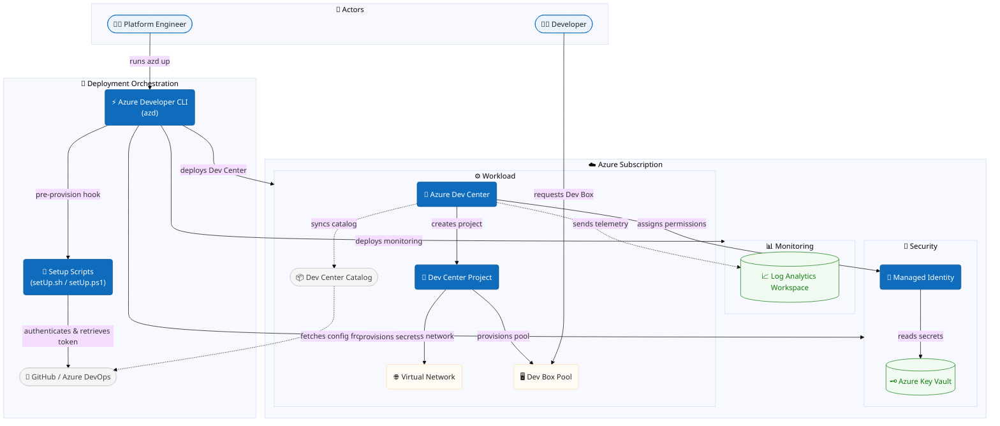

# DevExp-DevBox — Microsoft Dev Box Accelerator


**DevExp-DevBox** is an infrastructure-as-code accelerator that automates the
provisioning of Azure Microsoft Dev Box environments for development teams. It
deploys a fully configured Azure Dev Center, projects, role-specific Dev Box
pools, secure secret management, and centralized monitoring from a single
`azd up` command.

The accelerator solves the challenge of consistently and securely configuring
cloud-based developer workstations across large engineering organizations.
Rather than manually provisioning Dev Boxes through the Azure portal,
DevExp-DevBox codifies the entire setup—including network configuration,
identity assignments, and catalog synchronization—into version-controlled Bicep
templates and YAML configuration files.

The technology stack includes **Azure Bicep** for infrastructure-as-code,
**Azure Developer CLI (azd)** for deployment orchestration, **PowerShell** and
**Bash** for cross-platform setup automation, and **YAML** for declarative
configuration of Dev Centers, projects, pools, and security settings.

## Table of Contents

- [Features](#features)
- [Architecture](#architecture)
- [Technologies Used](#technologies-used)
- [Quick Start](#quick-start)
- [Configuration](#configuration)
- [Deployment](#deployment)
- [Usage](#usage)
- [Contributing](#contributing)
- [License](#license)

## Features

- 🏢 **Automated Azure Dev Center provisioning** — deploys a fully configured
  Dev Center with catalog item sync and Azure Monitor agent enabled
- 📁 **Multi-project support** — configures multiple Dev Center projects, each
  with independent identity, network, and pool settings
- 🖥️ **Role-specific Dev Box pools** — creates tailored pools for backend and
  frontend engineers with appropriate VM SKUs and image definitions
- 🔐 **Secure secret management** — provisions Azure Key Vault for storing
  source control tokens with RBAC authorization and soft-delete protection
- 📊 **Centralized observability** — deploys a Log Analytics Workspace with
  diagnostic settings and an Azure Activity solution
- 🌐 **Flexible network connectivity** — supports both Managed and Unmanaged
  virtual network types with configurable address spaces and subnets
- 📦 **Git-backed catalogs** — connects GitHub and Azure DevOps repositories for
  environment definitions and image definitions
- 🪪 **Least-privilege identity model** — assigns System-assigned Managed
  Identities to Dev Centers and projects with scoped RBAC roles
- 🏷️ **Consistent resource tagging** — enforces governance tags across all
  resources for cost allocation and ownership tracking
- 🔄 **Cross-platform automation** — provides equivalent setup scripts for
  Linux/macOS (`setUp.sh`) and Windows (`setUp.ps1`)

## Architecture

The diagram below shows the major components, actors, and data flows that make
up the DevExp-DevBox system.


```mermaid
---
config:
  description: "High-level architecture diagram showing actors, primary flows, and major components."
  theme: base
  align: center
  fontFamily: "Segoe UI, Verdana, sans-serif"
  fontSize: 16
  textColor: "#242424"
  primaryColor: "#0f6cbd"
  primaryTextColor: "#FFFFFF"
  primaryBorderColor: "#0f548c"
  secondaryColor: "#ebf3fc"
  secondaryTextColor: "#242424"
  secondaryBorderColor: "#0f6cbd"
  tertiaryColor: "#f5f5f5"
  tertiaryTextColor: "#424242"
  tertiaryBorderColor: "#d1d1d1"
  noteBkgColor: "#fefbf4"
  noteTextColor: "#242424"
  noteBorderColor: "#f9e2ae"
  lineColor: "#616161"
  background: "#FFFFFF"
  edgeLabelBackground: "#FFFFFF"
  clusterBkg: "#fafafa"
  clusterBorder: "#e0e0e0"
  titleColor: "#242424"
  errorBkgColor: "#fdf3f4"
  errorTextColor: "#b10e1c"
---
flowchart TB

  %% Actor nodes
  subgraph Actors["👥 Actors"]
    PlatformEngineer(["👨‍💼 Platform Engineer"])
    Developer(["👩‍💻 Developer"])
  end

  %% Deployment orchestration layer
  subgraph Deployment["🚀 Deployment Orchestration"]
    azd("⚡ Azure Developer CLI<br/>(azd)")
    SetupScripts("📜 Setup Scripts<br/>(setUp.sh / setUp.ps1)")
    GitHub(["🐙 GitHub / Azure DevOps"])
  end

  %% Azure cloud boundary
  subgraph AzureCloud["☁️ Azure Subscription"]

    %% Monitoring zone
    subgraph MonitoringZone["📊 Monitoring"]
      LogAnalytics[("📈 Log Analytics Workspace")]
    end

    %% Security zone
    subgraph SecurityZone["🔐 Security"]
      KeyVault[("🗝️ Azure Key Vault")]
      ManagedIdentity("🪪 Managed Identity")
    end

    %% Workload zone
    subgraph WorkloadZone["⚙️ Workload"]
      DevCenter("🏢 Azure Dev Center")
      Catalog(["📦 Dev Center Catalog"])
      DevCenterProject("📁 Dev Center Project")
      VNet("🌐 Virtual Network")
      DevBoxPool("🖥️ Dev Box Pool")
    end

  end

  %% Primary deployment flow
  PlatformEngineer --> |"runs azd up"| azd
  azd --> |"pre-provision hook"| SetupScripts
  SetupScripts --> |"authenticates & retrieves token"| GitHub
  azd --> |"deploys monitoring"| MonitoringZone
  azd --> |"provisions secrets"| SecurityZone
  azd --> |"deploys Dev Center"| WorkloadZone

  %% Dev Center internal wiring
  DevCenter --> |"assigns permissions"| ManagedIdentity
  ManagedIdentity --> |"reads secrets"| KeyVault
  DevCenter -.-> |"syncs catalog"| Catalog
  Catalog -.-> |"fetches config from"| GitHub
  DevCenter --> |"creates project"| DevCenterProject
  DevCenterProject --> |"attaches network"| VNet
  DevCenterProject --> |"provisions pool"| DevBoxPool
  DevCenter -.-> |"sends telemetry"| LogAnalytics

  %% Developer access flow
  Developer --> |"requests Dev Box"| DevBoxPool

  %% Class definitions — Fluent UI v9 semantic tokens
  classDef actor fill:#ebf3fc,stroke:#0f6cbd,color:#242424
  classDef external fill:#f5f5f5,stroke:#d1d1d1,color:#424242
  classDef service fill:#0f6cbd,stroke:#0f548c,color:#FFFFFF
  classDef datastore fill:#f1faf1,stroke:#107c10,color:#107c10
  classDef infrastructure fill:#fefbf4,stroke:#f9e2ae,color:#242424

  %% Class assignments
  class PlatformEngineer,Developer actor
  class GitHub,Catalog external
  class azd,SetupScripts,DevCenter,ManagedIdentity,DevCenterProject service
  class LogAnalytics,KeyVault datastore
  class VNet,DevBoxPool infrastructure
```

## Technologies Used

| Technology                | Type                     | Purpose                                                               |
| ------------------------- | ------------------------ | --------------------------------------------------------------------- |
| Azure Bicep               | Infrastructure-as-Code   | Declarative provisioning of all Azure resources at subscription scope |
| Azure Developer CLI (azd) | Deployment Orchestration | End-to-end environment provisioning and lifecycle management          |
| Azure Dev Center          | Azure PaaS Service       | Core platform for managing Dev Box projects, pools, and catalogs      |
| Azure Key Vault           | Azure PaaS Service       | Secure storage for source control tokens and secrets                  |
| Azure Log Analytics       | Azure PaaS Service       | Centralized monitoring, diagnostics, and activity logging             |
| Azure Virtual Network     | Azure Networking         | Connectivity layer for the Unmanaged Dev Box network type             |
| Azure Managed Identity    | Azure Identity           | System-assigned identity for Dev Center and project RBAC              |
| PowerShell (pwsh)         | Scripting                | Cross-platform Windows setup and cleanup automation                   |
| Bash                      | Scripting                | Linux/macOS setup and pre-provision automation                        |
| YAML                      | Configuration            | Declarative configuration for Dev Centers, projects, and security     |
| GitHub CLI (gh)           | CLI Tooling              | GitHub authentication and secret management during setup              |
| Azure CLI (az)            | CLI Tooling              | Azure resource and RBAC management during provisioning                |

## Quick Start

### Prerequisites

| Tool                                                                                                     | Minimum Version | Purpose                                                       |
| -------------------------------------------------------------------------------------------------------- | --------------- | ------------------------------------------------------------- |
| [Azure Developer CLI](https://learn.microsoft.com/en-us/azure/developer/azure-developer-cli/install-azd) | Latest          | Deployment orchestration                                      |
| [Azure CLI](https://learn.microsoft.com/en-us/cli/azure/install-azure-cli)                               | Latest          | Azure resource management                                     |
| [GitHub CLI](https://cli.github.com/)                                                                    | Latest          | GitHub authentication (when `SOURCE_CONTROL_PLATFORM=github`) |
| [PowerShell](https://learn.microsoft.com/en-us/powershell/scripting/install/installing-powershell)       | 5.1+            | Windows setup scripts                                         |
| Azure Subscription                                                                                       | —               | Target environment for all provisioned resources              |

### Installation

1. Clone the repository.

   ```bash
   git clone https://github.com/Evilazaro/DevExp-DevBox.git
   cd DevExp-DevBox
   ```

2. Authenticate with Azure.

   ```bash
   az login
   azd auth login
   ```

3. Authenticate with your source control platform (GitHub example).

   ```bash
   gh auth login
   ```

4. Initialize the `azd` environment.

   ```bash
   azd env new <your-environment-name>
   ```

5. Set the required environment variables.

   ```bash
   azd env set AZURE_LOCATION eastus
   azd env set SOURCE_CONTROL_PLATFORM github
   azd env set KEY_VAULT_SECRET <your-source-control-access-token>
   ```

6. Provision all resources.

   ```bash
   azd up
   ```

### Minimal Example

Running `azd up` executes the pre-provision hook, calls the setup scripts, and
deploys the full infrastructure:

```text
SUCCESS: Your up workflow to provision and deploy to Azure completed.

Outputs:
AZURE_DEV_CENTER_NAME              = devexp
AZURE_KEY_VAULT_NAME               = contoso
AZURE_LOG_ANALYTICS_WORKSPACE_NAME = logAnalytics-<suffix>
WORKLOAD_AZURE_RESOURCE_GROUP_NAME = devexp-workload-dev-eastus-RG
```

> [!NOTE] The pre-provision hook automatically sets `SOURCE_CONTROL_PLATFORM` to
> `github` if the variable is not already defined in the environment.

## Configuration

The accelerator uses three YAML configuration files under `infra/settings/`.
Edit these files to customize the deployment before running `azd up`.

### Key Configuration Options

| Option                                 | File                                       | Default     | Description                                           |
| -------------------------------------- | ------------------------------------------ | ----------- | ----------------------------------------------------- |
| `name`                                 | `workload/devcenter.yaml`                  | `devexp`    | Name of the Azure Dev Center resource                 |
| `catalogItemSyncEnableStatus`          | `workload/devcenter.yaml`                  | `Enabled`   | Toggle catalog item synchronization                   |
| `microsoftHostedNetworkEnableStatus`   | `workload/devcenter.yaml`                  | `Enabled`   | Toggle Microsoft-hosted network                       |
| `installAzureMonitorAgentEnableStatus` | `workload/devcenter.yaml`                  | `Enabled`   | Toggle Azure Monitor agent installation on Dev Boxes  |
| `keyVault.name`                        | `security/security.yaml`                   | `contoso`   | Name of the Azure Key Vault (must be globally unique) |
| `keyVault.secretName`                  | `security/security.yaml`                   | `gha-token` | Name of the secret stored in Key Vault                |
| `keyVault.softDeleteRetentionInDays`   | `security/security.yaml`                   | `7`         | Soft-delete retention period for secrets (7–90 days)  |
| `workload.create`                      | `resourceOrganization/azureResources.yaml` | `true`      | Create the Workload resource group                    |
| `security.create`                      | `resourceOrganization/azureResources.yaml` | `false`     | Create a dedicated Security resource group            |
| `monitoring.create`                    | `resourceOrganization/azureResources.yaml` | `false`     | Create a dedicated Monitoring resource group          |

### Example Override: Enable a Dedicated Security Resource Group

```yaml
# infra/settings/resourceOrganization/azureResources.yaml
security:
  create: true
  name: devexp-security
  tags:
    environment: prod
    team: DevExP
```

> [!NOTE] When `security.create` is `false`, Key Vault is deployed into the
> Workload resource group. Set `security.create: true` and provide a unique
> `name` to isolate it in its own resource group.

## Deployment

Follow these steps to deploy DevExp-DevBox to a production or staging Azure
subscription.

1. Ensure all tools listed in [Prerequisites](#prerequisites) are installed and
   authenticated.

2. Review and update the YAML files in `infra/settings/` to match your
   organization's naming conventions, tags, and network requirements.

3. Set the required `azd` environment variables.

   ```bash
   azd env set AZURE_LOCATION <azure-region>
   azd env set SOURCE_CONTROL_PLATFORM <github|adogit>
   ```

4. Set the Key Vault secret value (your GitHub or Azure DevOps personal access
   token).

   ```bash
   azd env set KEY_VAULT_SECRET <your-access-token>
   ```

5. Run `azd up` to provision all resources.

   ```bash
   azd up
   ```

6. Verify the deployment outputs.

   ```bash
   azd env get-values
   ```

7. To tear down the environment and remove all provisioned resources, run the
   cleanup script.

   ```powershell
   .\cleanSetUp.ps1 -EnvName <your-environment-name> -Location <azure-region>
   ```

> [!WARNING] Running `cleanSetUp.ps1` permanently removes role assignments,
> service principals, GitHub secrets, and all Azure resource groups. This action
> cannot be undone.

## Usage

### Accessing a Dev Box

Developers can access their Dev Box pools through the
[Microsoft Dev Box developer portal](https://devbox.microsoft.com) or via the
Azure portal under the assigned Dev Center project.

```bash
# List available pools in a project (requires Azure CLI and Dev Center permissions)
az devcenter dev pool list \
  --dev-center-name devexp \
  --project-name eShop \
  --output table
```

Expected output:

```text
Name                  HardwareProfile        LocalAdministrator    ProvisioningState
--------------------  ---------------------  --------------------  -------------------
backend-engineer-0    32 vCPU, 128 GB RAM    Enabled               Succeeded
frontend-engineer-0   16 vCPU, 64 GB RAM     Enabled               Succeeded
```

### Adding a New Project

1. Open `infra/settings/workload/devcenter.yaml`.
2. Add a new entry under the `projects` key with the required `name`,
   `description`, `network`, `identity`, `pools`, `environmentTypes`,
   `catalogs`, and `tags` fields.
3. Run `azd up` to apply the changes.

```yaml
# infra/settings/workload/devcenter.yaml (excerpt)
projects:
  - name: 'myNewProject'
    description: 'New engineering project.'
    network:
      virtualNetworkType: Managed
    identity:
      type: SystemAssigned
      roleAssignments:
        - azureADGroupId: '<your-azure-ad-group-id>'
          azureADGroupName: 'My Engineers'
          azureRBACRoles:
            - name: 'Dev Box User'
              id: '45d50f46-0b78-4001-a660-4198cbe8cd05'
              scope: Project
```

> [!TIP] Use `virtualNetworkType: Managed` to let Azure manage the network
> automatically. Use `Unmanaged` when Dev Boxes must connect to an existing
> virtual network in your subscription.

> [!IMPORTANT] Replace `<your-azure-ad-group-id>` with a valid Azure Active
> Directory group object ID. The group members receive the specified RBAC roles
> on the Dev Center project.

## Contributing

Contributions are welcome. To report a bug or request a feature,
[open an issue](https://github.com/Evilazaro/DevExp-DevBox/issues) on GitHub. To
contribute code, fork the repository, create a feature branch, implement your
changes, and submit a pull request against the `main` branch.

When contributing, follow existing Bicep module conventions, YAML configuration
patterns, and PowerShell coding standards used throughout the repository. Verify
that all Bicep templates compile without errors by running
`az bicep build --file infra/main.bicep` before submitting a pull request.

## License

This project is licensed under the **MIT License**. See the [LICENSE](LICENSE)
file for the full license text.
