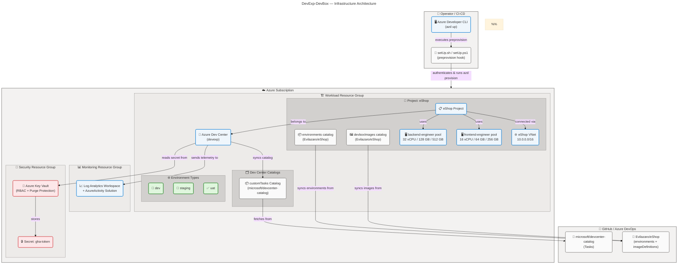

# DevExp-DevBox

[](./LICENSE)
[](https://learn.microsoft.com/en-us/azure/azure-resource-manager/bicep/overview)
[](https://learn.microsoft.com/en-us/azure/developer/azure-developer-cli/)
[](https://azure.microsoft.com)

An **Azure Developer CLI (azd)**-enabled accelerator that provisions a fully
configured
[Microsoft Dev Box](https://learn.microsoft.com/en-us/azure/dev-box/overview-what-is-microsoft-dev-box)
environment — including Dev Centers, projects, catalogs, environment types, Dev
Box pools, networking, Key Vault secrets management, and centralized Log
Analytics monitoring — all declared as Infrastructure-as-Code using Bicep.

## 📖 Overview

**Overview**

DevExp-DevBox is an enterprise-grade platform engineering accelerator that
automates the end-to-end provisioning of developer workstation infrastructure on
Azure. It targets platform engineering teams who need a repeatable,
configuration-driven approach to standing up Microsoft Dev Box environments
across multiple projects and teams.

The solution follows Azure Landing Zone principles, separating workload,
security, and monitoring concerns into independently managed resource groups.
All configuration is YAML-driven, enabling teams to onboard new Dev Box
projects, catalogs, networking topologies, and role assignments without
modifying Bicep source files.

> [!NOTE] This accelerator supports both **GitHub** and **Azure DevOps Git**
> (`adogit`) as source control back-ends for catalog and image definition
> synchronization.

> [!TIP] The `devcenter.yaml` file is the single configuration entry point for
> the entire Dev Center topology — projects, pools, catalogs, environment types,
> and RBAC roles are all defined there. See
> `infra/settings/workload/devcenter.yaml`.

## ✨ Features

**Overview**

DevExp-DevBox delivers a complete developer experience platform by composing
Azure Dev Center, Key Vault, Log Analytics, virtual networking, and identity
management into a single, automated deployment. Features are derived directly
from the Bicep modules and YAML configuration files in this repository.

> [!TIP] **Why This Matters**: Platform engineers can provision a
> production-grade Dev Box environment — with secure secrets, centralized
> logging, and role-based access — in a single `azd up` command, reducing
> onboarding time from days to minutes.

> [!IMPORTANT] **How It Works**: Each feature maps to a dedicated Bicep module
> under `src/`. The YAML configuration files under `infra/settings/` drive
> runtime parameterization, keeping infrastructure code generic and reusable
> across environments.

| ✨ Feature                  | 📝 Description                                                                                                                                          | 📁 Source                                                                                      |
| --------------------------- | ------------------------------------------------------------------------------------------------------------------------------------------------------- | ---------------------------------------------------------------------------------------------- |
| 🏗️ Dev Center Provisioning  | Deploys a fully configured Azure Dev Center with system-assigned managed identity, catalog item sync, and Azure Monitor agent                           | `src/workload/core/devCenter.bicep`                                                            |
| 📦 Project Management       | Creates one or more Dev Center projects, each with dedicated pools, catalogs, environment types, and RBAC assignments                                   | `src/workload/project/project.bicep`                                                           |
| 🗂️ Catalog Integration      | Syncs Dev Box image definitions and environment definitions from GitHub or Azure DevOps Git repositories on a scheduled basis                           | `src/workload/core/catalog.bicep`, `src/workload/project/projectCatalog.bicep`                 |
| 🖥️ Dev Box Pools            | Creates role-specific Dev Box pools (e.g., `backend-engineer`, `frontend-engineer`) mapped to image definitions and VM SKUs                             | `src/workload/project/projectPool.bicep`                                                       |
| 🌐 Network Connectivity     | Provisions managed or unmanaged virtual networks and attaches them to Dev Center projects via network connections                                       | `src/connectivity/connectivity.bicep`, `src/connectivity/vnet.bicep`                           |
| 🔐 Key Vault Secrets        | Creates an Azure Key Vault with RBAC authorization, purge protection, and soft delete; stores a GitHub Actions token for private catalog authentication | `src/security/keyVault.bicep`, `src/security/secret.bicep`                                     |
| 📊 Log Analytics Monitoring | Deploys a Log Analytics Workspace with diagnostic settings and the `AzureActivity` solution for centralized observability                               | `src/management/logAnalytics.bicep`                                                            |
| 🔑 RBAC Role Assignments    | Assigns Dev Center, project, and Key Vault roles to Azure AD groups following the principle of least privilege                                          | `src/identity/devCenterRoleAssignment.bicep`, `src/identity/orgRoleAssignment.bicep`           |
| ⚙️ Environment Types        | Configures `dev`, `staging`, and `uat` environment types at both Dev Center and project scope                                                           | `src/workload/core/environmentType.bicep`, `src/workload/project/projectEnvironmentType.bicep` |
| 🏷️ Consistent Tagging       | Applies environment, division, team, project, cost center, and owner tags to all resources for governance and cost allocation                           | `infra/settings/resourceOrganization/azureResources.yaml`                                      |

## 🚀 Quick Start

**Prerequisites**: Ensure the following tools are installed and authenticated
before proceeding.

```bash
# Verify required tools
az version          # Azure CLI
azd version         # Azure Developer CLI
gh auth status      # GitHub CLI (for GitHub source control)
```

**Step 1 — Clone the repository**

```bash
git clone https://github.com/Evilazaro/DevExp-DevBox.git
cd DevExp-DevBox
```

**Step 2 — Log in to Azure**

```bash
az login
azd auth login
```

**Step 3 — Initialize the azd environment**

```bash
azd env new <your-env-name>
# Example:
azd env new dev
```

**Step 4 — Set required environment variables**

```bash
azd env set AZURE_LOCATION eastus2
azd env set KEY_VAULT_SECRET <your-github-pat-or-ado-token>
```

**Step 5 — Deploy**

```bash
azd up
```

**Expected output:**

```text
  (✓) Done: Resource group: devexp-workload-dev-eastus2-RG
  (✓) Done: Log Analytics Workspace
  (✓) Done: Key Vault
  (✓) Done: DevCenter: devexp
  (✓) Done: Project: eShop
  (✓) Done: Dev Box Pools: backend-engineer, frontend-engineer

SUCCESS: Your up workflow to provision and deploy to Azure completed in 12m 34s.
```

> [!NOTE] On Windows, `azd up` invokes `setUp.ps1` automatically via the
> `preprovision` hook defined in `azure.yaml`. On Linux/macOS it invokes
> `setUp.sh`.

## 📦 Deployment

**Overview**

The deployment pipeline is orchestrated by the Azure Developer CLI using the
`azure.yaml` configuration file at the repository root. A `preprovision` hook
runs the appropriate setup script (`setUp.sh` or `setUp.ps1`) to authenticate
with the chosen source control platform before Bicep resources are provisioned.

> [!IMPORTANT] **How It Works**: `azd up` executes the `preprovision` hook,
> which calls `setUp.sh -e <env> -s <platform>` (Linux/macOS) or
> `setUp.ps1 -EnvName <env> -SourceControl <platform>` (Windows). The scripts
> validate tool availability, authenticate with GitHub or Azure DevOps, and wire
> up the environment before Bicep deployment begins.

**Linux / macOS**

```bash
# Full deploy with GitHub as source control
./setUp.sh -e dev -s github

# Full deploy with Azure DevOps
./setUp.sh -e dev -s adogit

# Then provision infrastructure
azd provision
```

**Windows (PowerShell)**

```powershell
# Full deploy with GitHub as source control
.\setUp.ps1 -EnvName dev -SourceControl github

# Full deploy with Azure DevOps
.\setUp.ps1 -EnvName dev -SourceControl adogit

# Then provision infrastructure
azd provision
```

**Cleanup / Teardown**

```powershell
# Remove all deployed resources, role assignments, credentials, and GitHub secrets
.\cleanSetUp.ps1 -EnvName dev -Location eastus2
```

> [!WARNING] `cleanSetUp.ps1` deletes Azure subscription-level deployments,
> service principals, app registrations, and GitHub secrets. Run with `-WhatIf`
> to preview actions before executing.

## 📋 Requirements

**Overview**

DevExp-DevBox requires an active Azure subscription with sufficient quota for
Dev Box resources, along with local tooling for authentication and deployment.
All prerequisites are validated at the start of `setUp.sh` / `setUp.ps1` via
`test_command_availability` / `Test-CommandAvailability` checks.

> [!TIP] **Why This Matters**: Missing any prerequisite tool will cause the
> `preprovision` hook to exit with an error before any Azure resources are
> created, preventing partial deployments.

> [!IMPORTANT] **How It Works**: The setup scripts verify each required command
> is in `PATH` and that the user is authenticated before invoking
> `azd provision`. The Bicep deployment enforces region constraints via the
> `@allowed` decorator on the `location` parameter in `infra/main.bicep`.

| 🔧 Requirement                 | 📋 Version / Details                                                                                                                                                                                                                | 🔗 Reference                                                                                     |
| ------------------------------ | ----------------------------------------------------------------------------------------------------------------------------------------------------------------------------------------------------------------------------------- | ------------------------------------------------------------------------------------------------ |
| ☁️ Azure Subscription          | Active subscription with Owner or Contributor + User Access Administrator rights                                                                                                                                                    | [Azure Portal](https://portal.azure.com)                                                         |
| 🔵 Azure CLI (`az`)            | Latest stable                                                                                                                                                                                                                       | [Install Azure CLI](https://learn.microsoft.com/en-us/cli/azure/install-azure-cli)               |
| 🚀 Azure Developer CLI (`azd`) | Latest stable                                                                                                                                                                                                                       | [Install azd](https://learn.microsoft.com/en-us/azure/developer/azure-developer-cli/install-azd) |
| 🐙 GitHub CLI (`gh`)           | Required when `SOURCE_CONTROL_PLATFORM=github`                                                                                                                                                                                      | [Install GitHub CLI](https://cli.github.com/)                                                    |
| 🌐 Supported Azure Region      | `eastus`, `eastus2`, `westus`, `westus2`, `westus3`, `centralus`, `northeurope`, `westeurope`, `southeastasia`, `australiaeast`, `japaneast`, `uksouth`, `canadacentral`, `swedencentral`, `switzerlandnorth`, `germanywestcentral` | `infra/main.bicep:8-25`                                                                          |
| 🔑 GitHub PAT or ADO Token     | Personal Access Token with repo scope for private catalog authentication; stored in Key Vault as `gha-token`                                                                                                                        | `infra/settings/security/security.yaml`                                                          |
| 📦 Bicep CLI                   | Included with Azure CLI 2.20.0+                                                                                                                                                                                                     | [Bicep overview](https://learn.microsoft.com/en-us/azure/azure-resource-manager/bicep/overview)  |

## 💻 Usage

**Overview**

After deployment, platform engineers interact with the Dev Center through the
Azure portal, Azure CLI, or VS Code Dev Box extension. The YAML configuration
files in `infra/settings/` control the shape of the environment — modifying them
and re-running `azd provision` applies changes incrementally.

> [!TIP] **Onboarding a new project**: Add a new entry under the `projects:`
> array in `infra/settings/workload/devcenter.yaml` with the project name,
> description, network settings, identity/RBAC, pools, catalogs, and environment
> types. Then run `azd provision` to deploy.

**List deployed Dev Center projects**

```bash
# Query deployed project names from azd outputs
azd env get-values | grep AZURE_DEV_CENTER_PROJECTS
```

**Access Dev Box from Azure CLI**

```bash
# List Dev Boxes in a project
az devcenter dev dev-box list \
  --dev-center-name <AZURE_DEV_CENTER_NAME> \
  --project-name eShop

# Create a Dev Box
az devcenter dev dev-box create \
  --dev-center-name <AZURE_DEV_CENTER_NAME> \
  --project-name eShop \
  --pool-name backend-engineer-0-pool \
  --name my-dev-box
```

**Expected output (list):**

```json
[
  {
    "name": "my-dev-box",
    "poolName": "backend-engineer-0-pool",
    "provisioningState": "Succeeded",
    "powerState": "Running"
  }
]
```

**Add a new catalog to the Dev Center**

Edit `infra/settings/workload/devcenter.yaml`:

```yaml
catalogs:
  - name: 'myNewCatalog'
    type: gitHub
    visibility: public
    uri: 'https://github.com/my-org/my-catalog.git'
    branch: 'main'
    path: './Tasks'
```

Then re-provision:

```bash
azd provision
```

**Update environment name and location**

```bash
azd env set AZURE_ENV_NAME staging
azd env set AZURE_LOCATION westeurope
azd provision
```

## ⚙️ Configuration

**Overview**

All runtime configuration is externalized into YAML files under
`infra/settings/`. The Bicep modules load these files using `loadYamlContent()`
at deployment time, meaning no Bicep source changes are required for typical
operational customization. The three configuration domains are resource
organization, security, and Dev Center workload topology.

> [!TIP] **Why This Matters**: YAML-driven configuration decouples operational
> settings from infrastructure code, enabling teams to manage
> environment-specific settings through pull requests against the YAML files
> alone.

> [!IMPORTANT] **How It Works**: `infra/main.bicep` loads `azureResources.yaml`
> to determine resource group names and creation flags.
> `src/security/security.bicep` loads `security.yaml` for Key Vault settings.
> `src/workload/workload.bicep` loads `devcenter.yaml` for the full Dev Center
> topology.

| ⚙️ Configuration File                                        | 🗂️ Domain           | 📝 Key Settings                                                                                                                                                                             |
| ------------------------------------------------------------ | ------------------- | ------------------------------------------------------------------------------------------------------------------------------------------------------------------------------------------- |
| 📁 `infra/settings/resourceOrganization/azureResources.yaml` | Resource Groups     | `workload.create`, `workload.name`, `security.create`, `monitoring.create` — controls which resource groups are provisioned and their names                                                 |
| 🔐 `infra/settings/security/security.yaml`                   | Key Vault           | `create` flag, `keyVault.name`, `keyVault.secretName` (`gha-token`), `enablePurgeProtection`, `enableSoftDelete`, `softDeleteRetentionInDays`                                               |
| 🏗️ `infra/settings/workload/devcenter.yaml`                  | Dev Center Topology | `name`, `catalogItemSyncEnableStatus`, `microsoftHostedNetworkEnableStatus`, `installAzureMonitorAgentEnableStatus`, `identity.roleAssignments`, `catalogs`, `environmentTypes`, `projects` |

**azd Environment Variables** (set via `azd env set <KEY> <VALUE>`)

| 🔑 Variable               | 📝 Description                                                         | ✅ Required |
| ------------------------- | ---------------------------------------------------------------------- | ----------- |
| `AZURE_ENV_NAME`          | Environment name suffix used in resource group naming (2–10 chars)     | ✅ Yes      |
| `AZURE_LOCATION`          | Azure region for deployment (must be in allowed list)                  | ✅ Yes      |
| `KEY_VAULT_SECRET`        | Secret value stored in Key Vault — typically a GitHub PAT or ADO token | ✅ Yes      |
| `SOURCE_CONTROL_PLATFORM` | Source control platform: `github` or `adogit` (defaults to `github`)   | ⚠️ Optional |

**Example: Custom resource group naming**
(`infra/settings/resourceOrganization/azureResources.yaml`)

```yaml
workload:
  create: true
  name: my-org-workload
  tags:
    environment: prod
    team: PlatformEngineering
```

**Example: Bring-your-own Key Vault** (`infra/settings/security/security.yaml`)

```yaml
create: false # Reference existing Key Vault instead of creating one
keyVault:
  name: my-existing-kv
  secretName: gha-token
```

## 🏗️ Architecture

**Overview**

DevExp-DevBox follows a layered Azure Landing Zone architecture with three
resource group domains: workload (Dev Center and projects), security (Key
Vault), and monitoring (Log Analytics). The Bicep deployment is scoped to the
subscription level (`targetScope = 'subscription'` in `infra/main.bicep`),
enabling it to create and manage resource groups alongside the resources within
them.


```mermaid
---
title: "DevExp-DevBox — Infrastructure Architecture"
config:
  theme: base
  look: classic
  layout: dagre
  themeVariables:
    fontSize: '16px'
  flowchart:
    htmlLabels: true
---
flowchart TB
    accTitle: DevExp-DevBox Infrastructure Architecture Diagram
    accDescr: Azure subscription-scoped Bicep deployment creating three resource group domains — Workload, Security, and Monitoring — containing Dev Center with projects and pools, Key Vault for secret management, and Log Analytics for centralized observability. CLI=core, SetUp=neutral, DC=core, LAW=core, KV=danger, Secret=danger, Proj=core, ProjCat1=neutral, ProjCat2=neutral, Pool1=core, Pool2=core, VNet=core, Cat=neutral, ET1=success, ET2=success, ET3=success, Repo1=neutral, Repo2=neutral. WCAG AA compliant.

    %%
    %% AZURE / FLUENT ARCHITECTURE PATTERN v2.0
    %% (Semantic + Structural + Font + Accessibility Governance)
    %%
    %% PHASE 1 - FLUENT UI: All styling uses approved Fluent UI palette only
    %% PHASE 2 - GROUPS: Every subgraph has semantic color via style directive
    %% PHASE 3 - COMPONENTS: Every node has semantic classDef + icon prefix
    %% PHASE 4 - ACCESSIBILITY: accTitle/accDescr present, WCAG AA contrast
    %% PHASE 5 - STANDARD: Governance block present, classDefs centralized
    %%

    subgraph operator["👤 Operator / CI-CD"]
        CLI("🖥️ Azure Developer CLI<br/>(azd up)"):::core
        SetUp("📜 setUp.sh / setUp.ps1<br/>(preprovision hook)"):::neutral
    end

    subgraph subscription["☁️ Azure Subscription"]

        subgraph monitoring_rg["📊 Monitoring Resource Group"]
            LAW("📈 Log Analytics Workspace<br/>+ AzureActivity Solution"):::core
        end

        subgraph security_rg["🔐 Security Resource Group"]
            KV("🔑 Azure Key Vault<br/>(RBAC + Purge Protection)"):::danger
            Secret("🔒 Secret: gha-token"):::danger
        end

        subgraph workload_rg["🏗️ Workload Resource Group"]
            DC("🏢 Azure Dev Center<br/>(devexp)"):::core

            subgraph catalogs_sg["🗂️ Dev Center Catalogs"]
                Cat("📦 customTasks Catalog<br/>(microsoft/devcenter-catalog)"):::neutral
            end

            subgraph env_types_sg["🌐 Environment Types"]
                direction TB
                ET1("🔧 dev"):::success
                ET2("🧪 staging"):::success
                ET3("✅ uat"):::success
            end

            subgraph project_sg["📁 Project: eShop"]
                Proj("📋 eShop Project"):::core
                ProjCat1("📦 environments catalog<br/>(Evilazaro/eShop)"):::neutral
                ProjCat2("🖼️ devboxImages catalog<br/>(Evilazaro/eShop)"):::neutral
                Pool1("🖥️ backend-engineer pool<br/>32 vCPU / 128 GB / 512 GB"):::core
                Pool2("🖥️ frontend-engineer pool<br/>16 vCPU / 64 GB / 256 GB"):::core
                VNet("🌐 eShop VNet<br/>10.0.0.0/16"):::core
            end
        end
    end

    subgraph github_sg["🐙 GitHub / Azure DevOps"]
        Repo1("📂 microsoft/devcenter-catalog<br/>(Tasks)"):::neutral
        Repo2("📂 Evilazaro/eShop<br/>(environments + imageDefinitions)"):::neutral
    end

    CLI -->|"executes preprovision"| SetUp
    SetUp -->|"authenticates & runs azd provision"| subscription
    DC -->|"syncs catalog"| Cat
    Cat -->|"fetches from"| Repo1
    ProjCat1 -->|"syncs environments from"| Repo2
    ProjCat2 -->|"syncs images from"| Repo2
    DC -->|"sends telemetry to"| LAW
    DC -->|"reads secret from"| KV
    KV -->|"stores"| Secret
    Proj -->|"belongs to"| DC
    Proj -->|"uses"| Pool1
    Proj -->|"uses"| Pool2
    Proj -->|"connected via"| VNet

    style operator fill:#F3F2F1,stroke:#8A8886,stroke-width:2px,color:#323130
    style subscription fill:#F3F2F1,stroke:#8A8886,stroke-width:2px,color:#323130
    style monitoring_rg fill:#EDEBE9,stroke:#8A8886,stroke-width:1px,color:#323130
    style security_rg fill:#EDEBE9,stroke:#8A8886,stroke-width:1px,color:#323130
    style workload_rg fill:#EDEBE9,stroke:#8A8886,stroke-width:1px,color:#323130
    style catalogs_sg fill:#D2D0CE,stroke:#8A8886,stroke-width:1px,color:#323130
    style env_types_sg fill:#D2D0CE,stroke:#8A8886,stroke-width:1px,color:#323130
    style project_sg fill:#D2D0CE,stroke:#8A8886,stroke-width:1px,color:#323130
    style github_sg fill:#F3F2F1,stroke:#8A8886,stroke-width:2px,color:#323130

    classDef neutral fill:#FAFAFA,stroke:#8A8886,stroke-width:2px,color:#323130
    classDef core fill:#EFF6FC,stroke:#0078D4,stroke-width:2px,color:#323130
    classDef success fill:#DFF6DD,stroke:#107C10,stroke-width:2px,color:#323130
    classDef danger fill:#FDE7E9,stroke:#D13438,stroke-width:2px,color:#323130
```

**Component Roles**

| 🏗️ Component        | 🔧 Role                                                                                         | 📁 Module                                |
| ------------------- | ----------------------------------------------------------------------------------------------- | ---------------------------------------- |
| 🏢 Azure Dev Center | Central hub for Dev Box management — hosts catalogs, environment types, and project definitions | `src/workload/core/devCenter.bicep`      |
| 📁 Projects         | Logical groupings of Dev Box pools and environment deployments scoped to a team or workstream   | `src/workload/project/project.bicep`     |
| 🖥️ Dev Box Pools    | Pre-configured cloud workstations with role-specific VM SKUs and image definitions              | `src/workload/project/projectPool.bicep` |
| 🔑 Key Vault        | Secure storage for `gha-token` secret used by private catalog authentication                    | `src/security/keyVault.bicep`            |
| 📈 Log Analytics    | Centralized monitoring for Dev Center telemetry and Azure Activity logs                         | `src/management/logAnalytics.bicep`      |
| 🌐 Virtual Network  | Provides network isolation for Dev Box sessions (Managed or Unmanaged type)                     | `src/connectivity/vnet.bicep`            |

## 🤝 Contributing

**Overview**

Contributions to DevExp-DevBox are welcome — whether adding new Dev Box project
templates, extending the Bicep module library, improving YAML schema validation,
or enhancing the setup scripts. The project follows Infrastructure-as-Code best
practices and enforces consistent configuration through YAML schema files.

> [!TIP] **Why This Matters**: Each `infra/settings/` YAML file has a
> corresponding `.schema.json` file that validates configuration at edit time in
> VS Code. Always validate your YAML changes against the schema before
> submitting a pull request.

> [!IMPORTANT] **How It Works**: Fork the repository, create a feature branch,
> make your changes, validate with `azd provision --preview`, and open a pull
> request against `main`. Ensure all modified YAML files remain valid against
> their schemas (`azureResources.schema.json`, `devcenter.schema.json`,
> `security.schema.json`).

**Development workflow**

```bash
# 1. Fork and clone
git clone https://github.com/<your-fork>/DevExp-DevBox.git
cd DevExp-DevBox

# 2. Create a feature branch
git checkout -b feature/my-improvement

# 3. Make changes to Bicep modules or YAML configuration

# 4. Preview changes before provisioning
azd provision --preview

# 5. Test full deployment in a dev environment
azd env new test-contrib
azd env set AZURE_LOCATION eastus2
azd env set KEY_VAULT_SECRET <your-test-token>
azd up

# 6. Clean up test environment
.\cleanSetUp.ps1 -EnvName test-contrib -Location eastus2

# 7. Submit pull request
git push origin feature/my-improvement
```

**Project structure**

```text
DevExp-DevBox/
├── azure.yaml                          # azd project configuration + preprovision hooks
├── setUp.sh                            # Linux/macOS setup script
├── setUp.ps1                           # Windows setup script
├── cleanSetUp.ps1                      # Cleanup / teardown script
├── infra/
│   ├── main.bicep                      # Subscription-scoped entry point
│   ├── main.parameters.json            # azd parameter template
│   └── settings/
│       ├── resourceOrganization/       # Resource group organization config
│       ├── security/                   # Key Vault config
│       └── workload/                   # Dev Center topology config
└── src/
    ├── connectivity/                   # VNet and network connection modules
    ├── identity/                       # RBAC role assignment modules
    ├── management/                     # Log Analytics module
    ├── security/                       # Key Vault and secret modules
    └── workload/                       # Dev Center, project, pool, catalog modules
```

## 📄 License

This project is licensed under the [Apache-2.0 License](./LICENSE).

---

**References**

- [Microsoft Dev Box documentation](https://learn.microsoft.com/en-us/azure/dev-box/overview-what-is-microsoft-dev-box)
- [Azure Developer CLI documentation](https://learn.microsoft.com/en-us/azure/developer/azure-developer-cli/)
- [Azure Bicep documentation](https://learn.microsoft.com/en-us/azure/azure-resource-manager/bicep/overview)
- [Azure Landing Zones](https://learn.microsoft.com/en-us/azure/cloud-adoption-framework/ready/landing-zone/)
- [Dev Box accelerator reference](https://evilazaro.github.io/DevExp-DevBox/)
