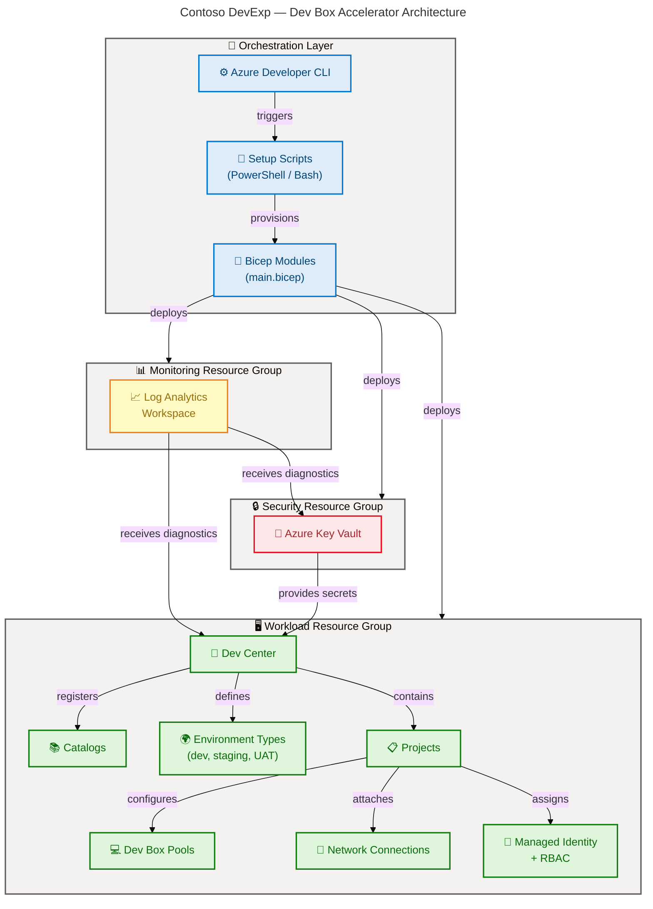

# Contoso DevExp — Dev Box Accelerator


## 📖 Overview

**Overview**

The Contoso DevExp Dev Box Accelerator is an Infrastructure as Code (IaC)
solution that automates the provisioning and configuration of Microsoft Dev Box
environments on Azure. It enables platform engineering teams to deploy fully
configured, developer-ready workstations with a single command, reducing
environment setup time from days to minutes.

This accelerator follows Azure Landing Zone principles to organize resources
into security, monitoring, and workload resource groups. It uses Azure Developer
CLI (`azd`) for orchestration, Bicep modules for infrastructure definitions, and
YAML-driven configuration for Dev Center settings — enabling repeatable,
auditable, and customizable deployments across development, staging, and UAT
environments.

> [!NOTE] This project uses the Azure Developer CLI (`azd`) for provisioning.
> All infrastructure is defined as Bicep modules with YAML-based configuration,
> following the configuration-as-code approach.

## 📑 Table of Contents

- [Architecture](#-architecture)
- [Features](#-features)
- [Requirements](#-requirements)
- [Quick Start](#-quick-start)
- [Deployment](#-deployment)
- [Usage](#-usage)
- [Configuration](#-configuration)
- [Contributing](#-contributing)
- [License](#-license)

## 🏗️ Architecture

**Overview**

The accelerator deploys resources across three Azure resource groups following
Azure Landing Zone segregation principles. The orchestration layer (`azd`) runs
setup scripts that authenticate against Azure and the chosen source control
platform, then provisions all infrastructure through Bicep modules with
dependency ordering: monitoring first, then security, then workload resources.

The Bicep module hierarchy flows from a subscription-scoped entry point
(`main.bicep`) that creates resource groups and delegates to domain-specific
modules for Log Analytics, Key Vault, and Dev Center resources including
projects, pools, catalogs, and network connections.


```mermaid
---
title: "Contoso DevExp — Dev Box Accelerator Architecture"
config:
  theme: base
  look: classic
  layout: dagre
  flowchart:
    htmlLabels: true
---
flowchart TB
    %% ═══════════════════════════════════════════════════════════════════════════
    %% AZURE / FLUENT ARCHITECTURE PATTERN v1.1
    %% (Semantic + Structural + Font + Accessibility Governance)
    %% ═══════════════════════════════════════════════════════════════════════════
    %% PHASE 1 - STRUCTURAL: Direction explicit, flat topology, nesting ≤ 3
    %% PHASE 2 - SEMANTIC: Colors justified, max 5 semantic classes, neutral-first
    %% PHASE 3 - FONT: Dark text on light backgrounds, contrast ≥ 4.5:1
    %% PHASE 4 - ACCESSIBILITY: accTitle/accDescr present, icons on all nodes
    %% PHASE 5 - STANDARD: Governance block present, classDefs centralized
    %% ═══════════════════════════════════════════════════════════════════════════

    accTitle: Dev Box Accelerator Architecture
    accDescr: Shows the three-tier resource group architecture with orchestration layer, security, monitoring, and workload components and their deployment relationships

    subgraph orchestration["🔄 Orchestration Layer"]
        direction LR
        azd["⚙️ Azure Developer CLI"]:::core
        setup["📜 Setup Scripts<br/>(PowerShell / Bash)"]:::core
        bicep["📐 Bicep Modules<br/>(main.bicep)"]:::core

        azd -->|"triggers"| setup
        setup -->|"provisions"| bicep
    end

    subgraph monitoring["📊 Monitoring Resource Group"]
        direction LR
        logAnalytics["📈 Log Analytics<br/>Workspace"]:::data
    end

    subgraph security["🔒 Security Resource Group"]
        direction LR
        keyVault["🔑 Azure Key Vault"]:::danger
    end

    subgraph workload["🖥️ Workload Resource Group"]
        direction TB
        devCenter["🏢 Dev Center"]:::success
        catalog["📚 Catalogs"]:::success
        envTypes["🌍 Environment Types<br/>(dev, staging, UAT)"]:::success
        project["📋 Projects"]:::success
        pools["💻 Dev Box Pools"]:::success
        netConn["🔌 Network Connections"]:::success
        identity["🔐 Managed Identity<br/>+ RBAC"]:::success

        devCenter -->|"registers"| catalog
        devCenter -->|"defines"| envTypes
        devCenter -->|"contains"| project
        project -->|"configures"| pools
        project -->|"attaches"| netConn
        project -->|"assigns"| identity
    end

    bicep -->|"deploys"| monitoring
    bicep -->|"deploys"| security
    bicep -->|"deploys"| workload
    logAnalytics -->|"receives diagnostics"| devCenter
    logAnalytics -->|"receives diagnostics"| keyVault
    keyVault -->|"provides secrets"| devCenter

    style orchestration fill:#F3F2F1,stroke:#605E5C,stroke-width:2px
    style monitoring fill:#F3F2F1,stroke:#605E5C,stroke-width:2px
    style security fill:#F3F2F1,stroke:#605E5C,stroke-width:2px
    style workload fill:#F3F2F1,stroke:#605E5C,stroke-width:2px

    classDef core fill:#DEECF9,stroke:#0078D4,stroke-width:2px,color:#004578
    classDef success fill:#DFF6DD,stroke:#107C10,stroke-width:2px,color:#0B6A0B
    classDef danger fill:#FDE7E9,stroke:#E81123,stroke-width:2px,color:#A4262C
    classDef data fill:#FFF9C4,stroke:#F57F17,stroke-width:2px,color:#986F0B
    classDef neutral fill:#EDEBE9,stroke:#8A8886,stroke-width:2px,color:#323130
```

**Component Roles:**

| Component              | Purpose                                                            | Module                                       |
| ---------------------- | ------------------------------------------------------------------ | -------------------------------------------- |
| 🔄 Azure Developer CLI | Orchestrates provisioning lifecycle                                | `azure.yaml`                                 |
| 📜 Setup Scripts       | Authenticate and initialize environments                           | `setUp.ps1` / `setUp.sh`                     |
| 📐 Bicep Entry Point   | Subscription-scoped resource group creation and module delegation  | `infra/main.bicep`                           |
| 📈 Log Analytics       | Centralized monitoring and diagnostics collection                  | `src/management/logAnalytics.bicep`          |
| 🔑 Key Vault           | Secrets management with RBAC authorization and purge protection    | `src/security/keyVault.bicep`                |
| 🏢 Dev Center          | Developer workstation platform with catalogs and environment types | `src/workload/core/devCenter.bicep`          |
| 📋 Projects            | Team-scoped Dev Box configurations with pools and networking       | `src/workload/project/project.bicep`         |
| 🔌 Networking          | VNet and network connections for Dev Box connectivity              | `src/connectivity/connectivity.bicep`        |
| 🔐 Identity            | Managed identity and RBAC role assignments                         | `src/identity/devCenterRoleAssignment.bicep` |

## ✨ Features

**Overview**

The accelerator provides a complete platform engineering toolkit for
provisioning Microsoft Dev Box environments. It combines one-command deployment
with enterprise-grade security, modular Bicep infrastructure, and flexible YAML
configuration to support teams of any size across multiple environments.

Every capability is driven by YAML files in `infra/settings/`, so teams can
customize Dev Centers, projects, pools, catalogs, and environment types without
modifying Bicep code.

> [!TIP] All features are configurable through YAML files in `infra/settings/`.
> No Bicep code changes are needed for standard customizations like adding
> projects, pools, or environment types.

| Feature                      | Description                                                                                          |
| ---------------------------- | ---------------------------------------------------------------------------------------------------- |
| 🚀 One-Command Deployment    | Deploy the entire Dev Box landing zone with a single `azd up` command                                |
| 🔒 Enterprise Security       | Key Vault with RBAC authorization, purge protection, soft delete, and managed identities             |
| 📊 Centralized Monitoring    | Log Analytics workspace with diagnostic settings for all deployed resources                          |
| ⚙️ YAML-Driven Configuration | Define Dev Centers, projects, pools, catalogs, and environment types in YAML without modifying Bicep |
| 🌐 Network Isolation         | Managed or unmanaged VNet support with configurable subnets for Dev Box connectivity                 |
| 🏢 Multi-Project Support     | Deploy multiple projects with role-specific Dev Box pools under a single Dev Center                  |
| 🔐 Least-Privilege RBAC      | Pre-configured role assignments following Microsoft security guidance for Dev Center operations      |
| 📚 Catalog Integration       | GitHub and Azure DevOps Git catalog support for environment definitions and Dev Box images           |
| 🌍 Multi-Environment         | Built-in support for dev, staging, and UAT environment types with per-project configuration          |

## 📋 Requirements

**Overview**

Before deploying the accelerator, ensure you have the required CLI tools
installed and authenticated. The setup scripts validate all prerequisites
automatically and provide actionable error messages if any tool is missing or
not authenticated.

Verify each tool with the corresponding `--version` command before proceeding.
The minimum versions listed below have been tested for compatibility with the
accelerator's Bicep modules and setup scripts.

> [!IMPORTANT] You must have an active Azure subscription with Contributor and
> User Access Administrator permissions at the subscription level to deploy all
> resources.

| Requirement                    | Minimum Version | Purpose                                                       |
| ------------------------------ | --------------- | ------------------------------------------------------------- |
| ☁️ Azure Subscription          | N/A             | Target subscription for resource deployment                   |
| 🛠️ Azure CLI                   | >= 2.50         | Azure authentication and resource management                  |
| 📦 Azure Developer CLI (`azd`) | >= 1.0          | Infrastructure provisioning orchestration                     |
| 🐧 Bash                        | >= 4.0          | Setup script execution (Linux / macOS)                        |
| 💻 PowerShell                  | >= 5.1          | Setup script execution (Windows)                              |
| 🔑 GitHub CLI (`gh`)           | >= 2.0          | GitHub authentication and token retrieval (when using GitHub) |
| 📍 Git                         | >= 2.0          | Source control operations                                     |

## 🚀 Quick Start

**Overview**

Get a Dev Box environment running in under 10 minutes. Clone the repository,
authenticate with Azure and your source control platform, then run `azd up` to
provision all infrastructure automatically.

The setup scripts handle tool validation, authentication, and environment
initialization — then `azd` provisions all Azure infrastructure through Bicep.

> [!IMPORTANT] The setup scripts (`setUp.sh` / `setUp.ps1`) handle
> authentication and environment initialization only. They do **not** provision
> Azure resources. Use `azd up` or `azd provision` after running the scripts.

**Step 1 — Clone the repository:**

```bash
git clone https://github.com/Evilazaro/DevExp-DevBox.git
cd DevExp-DevBox
```

**Expected output:**

```text
Cloning into 'DevExp-DevBox'...
remote: Enumerating objects: 350, done.
remote: Counting objects: 100% (350/350), done.
Receiving objects: 100% (350/350), 125.00 KiB | 1.25 MiB/s, done.
```

**Step 2 — Authenticate with Azure and source control:**

```bash
az login
azd auth login
gh auth login
```

> [!NOTE] `gh auth login` is required when using GitHub as the source control
> platform. For Azure DevOps Git, authenticate with `az devops login` instead.

**Expected output:**

```text
A web browser has been opened at https://login.microsoftonline.com/...
You have logged in. Now let us find all the subscriptions to which you have access...
✓ Logged in to github.com account
```

**Step 3 — Initialize and deploy:**

```bash
azd init -e "dev"
azd up
```

**Expected output:**

```text
Initializing a new environment (dev)...
SUCCESS: Environment initialized.

Provisioning Azure resources (azd provision)
(✓) Done: Resource group: devexp-workload-dev-RG
(✓) Done: Resource group: devexp-security-dev-RG
(✓) Done: Resource group: devexp-monitoring-dev-RG
(✓) Done: Log Analytics Workspace
(✓) Done: Key Vault
(✓) Done: Dev Center

SUCCESS: Your application was provisioned in Azure.
```

## 📦 Deployment

**Overview**

The accelerator uses Azure Developer CLI (`azd`) preprovision hooks to run
platform-specific setup scripts before provisioning infrastructure. The hook
validates prerequisites, authenticates against Azure and source control, stores
the access token in the `azd` environment, and then `azd` provisions all
resources through `infra/main.bicep`.

Two deployment paths are provided — one for Linux / macOS using Bash and one for
Windows using PowerShell. Both paths produce the same infrastructure. Choose the
path matching your operating system.

> [!WARNING] Running `azd up` provisions Azure resources that incur costs.
> Review the configuration files in `infra/settings/` before deploying to ensure
> the resource names, regions, and SKUs match your requirements.

### Linux / macOS

The default `azure.yaml` uses a Bash preprovision hook that executes `setUp.sh`.
The script validates that `az`, `azd`, `jq`, and `gh` are installed and
authenticated, retrieves the GitHub token, and stores it in the `azd`
environment:

```bash
azd init -e "dev"
azd up
```

The `azd up` command triggers the `setUp.sh` preprovision hook defined in
`azure.yaml`. After the hook completes, `azd` provisions all Azure
infrastructure through `infra/main.bicep`.

**Expected output:**

```text
ℹ️ Starting Dev Box environment setup
ℹ️ Environment name: dev
ℹ️ Source control platform: github
ℹ️ Checking required tools...
✅ All required tools are available
✅ Using Azure subscription: Contoso-Dev (ID: xxxxxxxx-xxxx-xxxx-xxxx-xxxxxxxxxxxx)
✅ GitHub authentication verified successfully
✅ GitHub token retrieved and stored securely
✅ Azure Developer CLI environment 'dev' initialized successfully.
✅ Dev Box environment 'dev' setup successfully

Provisioning Azure resources (azd provision)
(✓) Done: Resource group: devexp-workload-dev-RG
(✓) Done: Resource group: devexp-security-dev-RG
(✓) Done: Resource group: devexp-monitoring-dev-RG
(✓) Done: Log Analytics Workspace
(✓) Done: Key Vault
(✓) Done: Dev Center

SUCCESS: Your application was provisioned in Azure.
```

### Windows

On Windows, if Bash is not available, rename `azure-pwh.yaml` to `azure.yaml` to
use the PowerShell-based preprovision hook, then run:

```powershell
azd init -e "dev"
azd up
```

Alternatively, run the setup and provisioning steps manually:

```powershell
.\setUp.ps1 -EnvName "dev" -SourceControl "github"
azd provision -e "dev"
```

> [!TIP] The PowerShell setup script (`setUp.ps1`) accepts `-EnvName` and
> `-SourceControl` (either `github` or `adogit`). It requires `az`, `azd`, and
> `gh` — no `jq` dependency.

**Expected output:**

```text
✅ All required tools are available
✅ GitHub authentication verified successfully
✅ GitHub token retrieved and stored securely
✅ Dev Box environment 'dev' setup successfully

Provisioning Azure resources (azd provision)
(✓) Done: Resource group: devexp-workload-dev-RG
(✓) Done: Resource group: devexp-security-dev-RG
(✓) Done: Resource group: devexp-monitoring-dev-RG
(✓) Done: Log Analytics Workspace
(✓) Done: Key Vault
(✓) Done: Dev Center

SUCCESS: Your application was provisioned in Azure.
```

## 💻 Usage

**Overview**

After deployment, platform administrators manage Dev Box environments by editing
the YAML configuration files in `infra/settings/` and re-provisioning with
`azd provision`. Developers access their Dev Boxes through the
[Microsoft Dev Box portal](https://devbox.microsoft.com). All changes follow a
configuration-as-code workflow — edit YAML, commit, re-provision.

Each subsection below demonstrates a specific configuration scenario with YAML
examples and expected provisioning output. Apply changes by editing the relevant
YAML file and running `azd provision -e "<env>"`.

> [!TIP] Each YAML file includes a JSON Schema reference
> (`yaml-language-server: $schema=...`) that provides editor validation and
> autocomplete in VS Code with the YAML extension.

### Configuring Dev Center Feature Toggles

The Dev Center exposes three feature toggles at the top level of
`infra/settings/workload/devcenter.yaml`. Each accepts `Enabled` or `Disabled`:

```yaml
name: 'devexp-devcenter'
catalogItemSyncEnableStatus: 'Enabled' # Sync catalog items from repos
microsoftHostedNetworkEnableStatus: 'Enabled' # Microsoft-hosted VNet for Dev Boxes
installAzureMonitorAgentEnableStatus: 'Enabled' # Azure Monitor agent on Dev Boxes
```

| Toggle                                    | Effect when Disabled                                                               |
| ----------------------------------------- | ---------------------------------------------------------------------------------- |
| ⚙️ `catalogItemSyncEnableStatus`          | Catalog items are not auto-synced from connected repositories                      |
| 🌐 `microsoftHostedNetworkEnableStatus`   | Dev Boxes cannot use Microsoft-managed networks; requires Unmanaged VNets          |
| 📊 `installAzureMonitorAgentEnableStatus` | Azure Monitor agent is not installed on Dev Boxes; disables host-level diagnostics |

Re-provision after changing any toggle:

```bash
azd provision -e "dev"
```

**Expected output:**

```text
Provisioning Azure resources (azd provision)
(✓) Done: Dev Center: devexp-devcenter (configuration updated)

SUCCESS: Your application was provisioned in Azure.
```

### Adding a New Project

Edit `infra/settings/workload/devcenter.yaml` and append a new entry to the
`projects` array. Each project requires network, identity, pools, environment
types, catalogs, and tags. The example below mirrors the structure of the
existing `eShop` project:

```yaml
projects:
  # ... existing projects above ...
  - name: 'myNewProject'
    description: 'New team project for backend services.'

    # --- Network ---
    network:
      name: myNewProject
      create: true
      resourceGroupName: 'myNewProject-connectivity-RG'
      virtualNetworkType: Managed # Managed (Microsoft-hosted) or Unmanaged
      addressPrefixes:
        - 10.1.0.0/16
      subnets:
        - name: myNewProject-subnet
          properties:
            addressPrefix: 10.1.1.0/24
      tags:
        environment: dev
        division: Platforms
        team: DevExP
        project: DevExP-DevBox
        costCenter: IT
        owner: Contoso
        resources: Network

    # --- Identity & RBAC ---
    identity:
      type: SystemAssigned
      roleAssignments:
        - azureADGroupId: '<azure-ad-group-id>'
          azureADGroupName: 'MyNewProject Developers'
          azureRBACRoles:
            - name: 'Contributor'
              id: 'b24988ac-6180-42a0-ab88-20f7382dd24c'
              scope: Project
            - name: 'Dev Box User'
              id: '45d50f46-0b78-4001-a660-4198cbe8cd05'
              scope: Project
            - name: 'Deployment Environment User'
              id: '18e40d4e-8d2e-438d-97e1-9528336e149c'
              scope: Project
            - name: 'Key Vault Secrets User'
              id: '4633458b-17de-408a-b874-0445c86b69e6'
              scope: ResourceGroup
            - name: 'Key Vault Secrets Officer'
              id: 'b86a8fe4-44ce-4948-aee5-eccb2c155cd7'
              scope: ResourceGroup

    # --- Dev Box Pools ---
    pools:
      - name: 'developer'
        imageDefinitionName: 'myNewProject-developer'
        vmSku: general_i_16c64gb256ssd_v2

    # --- Environment Types ---
    environmentTypes:
      - name: 'dev'
        deploymentTargetId: ''
      - name: 'staging'
        deploymentTargetId: ''

    # --- Catalogs ---
    catalogs:
      - name: 'environments'
        type: environmentDefinition
        sourceControl: gitHub
        visibility: private
        uri: 'https://github.com/org/myNewProject.git'
        branch: 'main'
        path: '/.devcenter/environments'
      - name: 'devboxImages'
        type: imageDefinition
        sourceControl: gitHub
        visibility: private
        uri: 'https://github.com/org/myNewProject.git'
        branch: 'main'
        path: '/.devcenter/imageDefinitions'

    # --- Tags ---
    tags:
      environment: dev
      division: Platforms
      team: DevExP
      project: DevExP-DevBox
      costCenter: IT
      owner: Contoso
      resources: Project
```

Re-provision to deploy the new project:

```bash
azd provision -e "dev"
```

**Expected output:**

```text
Provisioning Azure resources (azd provision)
(✓) Done: Resource group: myNewProject-connectivity-RG
(✓) Done: Virtual Network: myNewProject
(✓) Done: Project: myNewProject
(✓) Done: Dev Box Pool: developer
(✓) Done: Environment Types: dev, staging

SUCCESS: Your application was provisioned in Azure.
```

### Adding a Dev Box Pool to an Existing Project

Add a new pool entry under the target project's `pools` array in
`infra/settings/workload/devcenter.yaml`. Each pool requires a name, an image
definition name (references a catalog image), and a VM SKU:

```yaml
pools:
  - name: 'backend-engineer'
    imageDefinitionName: 'eShop-backend-engineer'
    vmSku: general_i_32c128gb512ssd_v2
  - name: 'frontend-engineer'
    imageDefinitionName: 'eShop-frontend-engineer'
    vmSku: general_i_16c64gb256ssd_v2
  - name: 'data-engineer' # New pool
    imageDefinitionName: 'eShop-data-engineer'
    vmSku: general_i_16c64gb256ssd_v2
```

Re-provision:

```bash
azd provision -e "dev"
```

**Expected output:**

```text
Provisioning Azure resources (azd provision)
(✓) Done: Dev Box Pool: data-engineer

SUCCESS: Your application was provisioned in Azure.
```

### Configuring Network Connectivity

Each project requires a network configuration. The accelerator supports two
virtual network types and the option to use an existing VNet.

**Managed VNet (Microsoft-hosted)** — Microsoft manages the virtual network.
This is the simplest option and requires `microsoftHostedNetworkEnableStatus`
set to `Enabled` at the Dev Center level:

```yaml
# Inside a project entry
network:
  name: myProject
  create: true
  resourceGroupName: 'myProject-connectivity-RG'
  virtualNetworkType: Managed
  addressPrefixes:
    - 10.1.0.0/16
  subnets:
    - name: myProject-subnet
      properties:
        addressPrefix: 10.1.1.0/24
```

**Unmanaged VNet (customer-managed)** — you provide and manage your own virtual
network. Use this when you need custom NSGs, route tables, or peering with
corporate networks:

```yaml
# Inside a project entry
network:
  name: myProject
  create: true
  resourceGroupName: 'myProject-connectivity-RG'
  virtualNetworkType: Unmanaged
  addressPrefixes:
    - 10.2.0.0/16
  subnets:
    - name: myProject-subnet
      properties:
        addressPrefix: 10.2.1.0/24
```

**Using an existing VNet** — set `create: false` to reference a virtual network
that already exists. The `resourceGroupName` must point to the resource group
containing the existing VNet:

```yaml
# Inside a project entry
network:
  name: existing-corp-vnet
  create: false
  resourceGroupName: 'corp-networking-RG'
  virtualNetworkType: Unmanaged
  subnets:
    - name: devbox-subnet
      properties:
        addressPrefix: 10.50.1.0/24
```

Re-provision after applying network changes:

```bash
azd provision -e "dev"
```

**Expected output:**

```text
Provisioning Azure resources (azd provision)
(✓) Done: Virtual Network: myProject
(✓) Done: Network Connection: myProject-subnet

SUCCESS: Your application was provisioned in Azure.
```

### Adding a Dev Center Catalog

Dev Center-level catalogs provide shared configurations across all projects. The
accelerator supports both **GitHub** and **Azure DevOps Git** (`adoGit`)
repositories. Add a new entry to the top-level `catalogs` array in
`infra/settings/workload/devcenter.yaml`:

**GitHub catalog:**

```yaml
catalogs:
  - name: 'customTasks'
    type: gitHub
    visibility: public
    uri: 'https://github.com/microsoft/devcenter-catalog.git'
    branch: 'main'
    path: './Tasks'
```

**Azure DevOps Git catalog:**

```yaml
catalogs:
  - name: 'sharedEnvironments'
    type: adoGit
    visibility: private
    uri: 'https://dev.azure.com/org/project/_git/shared-environments'
    branch: 'main'
    path: './Environments'
```

For project-scoped catalogs (environment definitions or image definitions), add
entries under the project's `catalogs` array instead. Project catalogs support
two types and both source control providers:

- `environmentDefinition` — deployment environment templates
- `imageDefinition` — Dev Box image definitions

```yaml
# Inside a project entry — GitHub
catalogs:
  - name: 'environments'
    type: environmentDefinition
    sourceControl: gitHub
    visibility: private
    uri: 'https://github.com/org/myProject.git'
    branch: 'main'
    path: '/.devcenter/environments'
  - name: 'devboxImages'
    type: imageDefinition
    sourceControl: gitHub
    visibility: private
    uri: 'https://github.com/org/myProject.git'
    branch: 'main'
    path: '/.devcenter/imageDefinitions'
```

```yaml
# Inside a project entry — Azure DevOps
catalogs:
  - name: 'environments'
    type: environmentDefinition
    sourceControl: adoGit
    visibility: private
    uri: 'https://dev.azure.com/org/project/_git/myProject'
    branch: 'main'
    path: '/.devcenter/environments'
```

Re-provision after adding catalogs:

```bash
azd provision -e "dev"
```

**Expected output:**

```text
Provisioning Azure resources (azd provision)
(✓) Done: Catalog: customTasks (syncing from repository)

SUCCESS: Your application was provisioned in Azure.
```

### Adding or Modifying Environment Types

Environment types can be defined at the Dev Center level (available to all
projects) and at the project level (scoped to a single project). Each
environment type has a name and an optional `deploymentTargetId` (leave empty to
use the default subscription).

**Dev Center level** — edit the top-level `environmentTypes` array in
`infra/settings/workload/devcenter.yaml`:

```yaml
environmentTypes:
  - name: 'dev'
    deploymentTargetId: ''
  - name: 'staging'
    deploymentTargetId: ''
  - name: 'UAT'
    deploymentTargetId: ''
  - name: 'prod' # New environment type
    deploymentTargetId: '/subscriptions/<subscription-id>'
```

**Project level** — add entries under the project's `environmentTypes` array:

```yaml
# Inside a project entry
environmentTypes:
  - name: 'dev'
    deploymentTargetId: ''
  - name: 'staging'
    deploymentTargetId: ''
  - name: 'prod'
    deploymentTargetId: ''
```

Re-provision after adding environment types:

```bash
azd provision -e "dev"
```

**Expected output:**

```text
Provisioning Azure resources (azd provision)
(✓) Done: Environment Type: prod

SUCCESS: Your application was provisioned in Azure.
```

### Modifying Resource Groups

Edit `infra/settings/resourceOrganization/azureResources.yaml` to rename
resource groups, disable creation of specific groups, or update tags:

```yaml
workload:
  create: true
  name: myorg-workload # Renamed from devexp-workload
  description: Production workloads
  tags:
    environment: prod
    division: Engineering
    team: Platform
    project: MyOrg-DevBox
    costCenter: Engineering
    owner: MyOrg
    landingZone: Workload
    resources: ResourceGroup

security:
  create: true
  name: myorg-security
  description: Security resources
  tags:
    environment: prod
    division: Engineering
    team: Platform
    project: MyOrg-DevBox
    costCenter: Engineering
    owner: MyOrg
    landingZone: Workload
    resources: ResourceGroup

monitoring:
  create: true
  name: myorg-monitoring
  description: Monitoring resources
  tags:
    environment: prod
    division: Engineering
    team: Platform
    project: MyOrg-DevBox
    costCenter: Engineering
    owner: MyOrg
    landingZone: Workload
    resources: ResourceGroup
```

Re-provision after modifying resource groups:

```bash
azd provision -e "dev"
```

**Expected output:**

```text
Provisioning Azure resources (azd provision)
(✓) Done: Resource group: myorg-workload-dev-RG
(✓) Done: Resource group: myorg-security-dev-RG
(✓) Done: Resource group: myorg-monitoring-dev-RG

SUCCESS: Your application was provisioned in Azure.
```

### Modifying Security Settings

Edit `infra/settings/security/security.yaml` to change Key Vault parameters. The
full configuration structure includes the top-level `create` flag and the nested
`keyVault` block:

```yaml
create: true
keyVault:
  name: contoso
  description: Development Environment Key Vault
  secretName: gha-token
  enablePurgeProtection: true
  enableSoftDelete: true
  softDeleteRetentionInDays: 90 # Changed from default 7
  enableRbacAuthorization: true
  tags:
    environment: dev
    division: Platforms
    team: DevExP
    project: Contoso-DevExp-DevBox
    costCenter: IT
    owner: Contoso
    landingZone: security
    resources: ResourceGroup
```

**Using an existing Key Vault** — set `create: false` to reference a Key Vault
that already exists in the security resource group. The accelerator will store
the GitHub access token secret in the existing vault instead of creating a new
one:

```yaml
create: false
keyVault:
  name: my-existing-keyvault # Must exist in the security resource group
  secretName: gha-token
```

Re-provision:

```bash
azd provision -e "dev"
```

**Expected output:**

```text
Provisioning Azure resources (azd provision)
(✓) Done: Key Vault: contoso

SUCCESS: Your application was provisioned in Azure.
```

### Modifying Identity and RBAC

The accelerator manages RBAC at two levels:

**Dev Center identity** — controls what the Dev Center managed identity can do.
Edit the `identity.roleAssignments.devCenter` array in
`infra/settings/workload/devcenter.yaml`:

```yaml
identity:
  type: SystemAssigned
  roleAssignments:
    devCenter:
      - id: 'b24988ac-6180-42a0-ab88-20f7382dd24c'
        name: 'Contributor'
        scope: Subscription
      - id: '18d7d88d-d35e-4fb5-a5c3-7773c20a72d9'
        name: 'User Access Administrator'
        scope: Subscription
      - id: '4633458b-17de-408a-b874-0445c86b69e6'
        name: 'Key Vault Secrets User'
        scope: ResourceGroup
      - id: 'b86a8fe4-44ce-4948-aee5-eccb2c155cd7'
        name: 'Key Vault Secrets Officer'
        scope: ResourceGroup
```

**Organization roles** — controls which Azure AD groups get DevCenter Project
Admin access. Edit the `identity.roleAssignments.orgRoleTypes` array:

```yaml
orgRoleTypes:
  - type: DevManager
    azureADGroupId: '<azure-ad-group-id>'
    azureADGroupName: 'Platform Engineering Team'
    azureRBACRoles:
      - name: 'DevCenter Project Admin'
        id: '331c37c6-af14-46d9-b9f4-e1909e1b95a0'
        scope: ResourceGroup
```

**Project identity** — controls which Azure AD groups can access a specific
project's Dev Boxes and environments. The `roleAssignments` array supports
multiple AD groups, enabling fine-grained access for multi-team projects:

```yaml
# Inside a project entry
identity:
  type: SystemAssigned
  roleAssignments:
    - azureADGroupId: '<backend-team-group-id>'
      azureADGroupName: 'Backend Developers'
      azureRBACRoles:
        - name: 'Contributor'
          id: 'b24988ac-6180-42a0-ab88-20f7382dd24c'
          scope: Project
        - name: 'Dev Box User'
          id: '45d50f46-0b78-4001-a660-4198cbe8cd05'
          scope: Project
    - azureADGroupId: '<qa-team-group-id>'
      azureADGroupName: 'QA Engineers'
      azureRBACRoles:
        - name: 'Dev Box User'
          id: '45d50f46-0b78-4001-a660-4198cbe8cd05'
          scope: Project
        - name: 'Deployment Environment User'
          id: '18e40d4e-8d2e-438d-97e1-9528336e149c'
          scope: Project
```

See [Adding a New Project](#adding-a-new-project) for the full project identity
example. Re-provision after changing any RBAC configuration:

```bash
azd provision -e "dev"
```

**Expected output:**

```text
Provisioning Azure resources (azd provision)
(✓) Done: Role assignments updated

SUCCESS: Your application was provisioned in Azure.
```

### Cleanup

Remove all deployed resources and clean up the environment using the cleanup
script. The script removes subscription deployments, user role assignments,
service principals, GitHub secrets, and resource groups:

```powershell
.\cleanSetUp.ps1 -EnvName "dev" -Location "eastus2"
```

**Expected output:**

```text
DevExp-DevBox Full Cleanup
==========================

Retrieving subscription deployments...
Deleting users and assigned roles...
Deleting deployment credentials...
Deleting GitHub secret for Azure credentials...
Cleaning up resource groups...

All cleanup operations completed successfully.
```

| Parameter            | Default                                      | Description                             |
| -------------------- | -------------------------------------------- | --------------------------------------- |
| ⚙️ `-EnvName`        | `gitHub`                                     | Environment name to clean up            |
| 🌍 `-Location`       | `eastus2`                                    | Azure region of deployed resources      |
| 🔐 `-AppDisplayName` | `ContosoDevEx GitHub Actions Enterprise App` | Azure AD application display name       |
| 🔑 `-GhSecretName`   | `AZURE_CREDENTIALS`                          | GitHub repository secret name to remove |

## ⚙️ Configuration

**Overview**

All deployment parameters are driven by three YAML configuration files in
`infra/settings/`, a Bicep parameters file for environment-specific values, and
`azd` configuration files that define preprovision hooks. Each YAML file has a
corresponding JSON Schema for validation, providing IDE autocomplete and
validation support in VS Code with the YAML extension.

The configuration hierarchy flows from resource organization (resource group
naming and structure), through security (Key Vault settings), to workload (Dev
Center, projects, pools, catalogs, and environment types). This layered approach
enables teams to customize each tier independently.

> [!TIP] All YAML configuration files include JSON Schema references (via
> `yaml-language-server: $schema=...`) for editor validation and autocomplete.

### Resource Organization (`infra/settings/resourceOrganization/azureResources.yaml`)

Defines the three resource groups following Azure Landing Zone segregation.

| Parameter                   | Description                                     | Default             |
| --------------------------- | ----------------------------------------------- | ------------------- |
| ⚙️ `workload.create`        | Whether to create the workload resource group   | `true`              |
| 📁 `workload.name`          | Workload resource group name                    | `devexp-workload`   |
| 📝 `workload.description`   | Description for the workload resource group     | `prodExp`           |
| 🏷️ `workload.tags`          | Resource tags                                   | See Tags below      |
| ⚙️ `security.create`        | Whether to create the security resource group   | `true`              |
| 📁 `security.name`          | Security resource group name                    | `devexp-security`   |
| 📝 `security.description`   | Description for the security resource group     | `prodExp`           |
| 🏷️ `security.tags`          | Resource tags                                   | See Tags below      |
| ⚙️ `monitoring.create`      | Whether to create the monitoring resource group | `true`              |
| 📁 `monitoring.name`        | Monitoring resource group name                  | `devexp-monitoring` |
| 📝 `monitoring.description` | Description for the monitoring resource group   | `prodExp`           |
| 🏷️ `monitoring.tags`        | Resource tags                                   | See Tags below      |

**Common tag keys:** `environment`, `division`, `team`, `project`, `costCenter`,
`owner`, `landingZone`, `resources`

### Security (`infra/settings/security/security.yaml`)

Configures the Azure Key Vault for secrets management.

| Parameter                               | Description                                       | Default                             |
| --------------------------------------- | ------------------------------------------------- | ----------------------------------- |
| ⚙️ `create`                             | Whether to create the Key Vault resource          | `true`                              |
| 🔐 `keyVault.name`                      | Globally unique Key Vault name                    | `contoso`                           |
| 📝 `keyVault.description`               | Purpose description for the Key Vault             | `Development Environment Key Vault` |
| 🔑 `keyVault.secretName`                | Name of the secret storing the source control PAT | `gha-token`                         |
| ⚙️ `keyVault.enablePurgeProtection`     | Prevent permanent deletion of secrets             | `true`                              |
| ⚙️ `keyVault.enableSoftDelete`          | Enable recovery of deleted secrets                | `true`                              |
| ⚙️ `keyVault.softDeleteRetentionInDays` | Retention period for soft-deleted secrets (7–90)  | `7`                                 |
| 🔐 `keyVault.enableRbacAuthorization`   | Use Azure RBAC instead of access policies         | `true`                              |
| 🏷️ `keyVault.tags`                      | Resource tags for the Key Vault                   | See Tags above                      |

### Dev Center (`infra/settings/workload/devcenter.yaml`)

#### Core Settings

| Parameter                                 | Description                                   | Default            |
| ----------------------------------------- | --------------------------------------------- | ------------------ |
| 🏢 `name`                                 | Dev Center resource name                      | `devexp-devcenter` |
| ⚙️ `catalogItemSyncEnableStatus`          | Enable catalog item synchronization           | `Enabled`          |
| 🌐 `microsoftHostedNetworkEnableStatus`   | Enable Microsoft-hosted network for Dev Boxes | `Enabled`          |
| 📊 `installAzureMonitorAgentEnableStatus` | Install Azure Monitor agent on Dev Boxes      | `Enabled`          |
| 🏷️ `tags`                                 | Resource tags for the Dev Center              | See Tags above     |

#### Identity & RBAC

| Parameter                                                           | Description                        | Default                                                                      |
| ------------------------------------------------------------------- | ---------------------------------- | ---------------------------------------------------------------------------- |
| 🔐 `identity.type`                                                  | Managed identity type              | `SystemAssigned`                                                             |
| 🔑 `identity.roleAssignments.devCenter[].id`                        | Azure RBAC role definition ID      | —                                                                            |
| 🔑 `identity.roleAssignments.devCenter[].name`                      | Role name                          | `Contributor`, `User Access Administrator`, `Key Vault Secrets User/Officer` |
| 🌍 `identity.roleAssignments.devCenter[].scope`                     | Role scope                         | `Subscription` or `ResourceGroup`                                            |
| 🔐 `identity.roleAssignments.orgRoleTypes[].type`                   | Organization role type             | `DevManager`                                                                 |
| 🔑 `identity.roleAssignments.orgRoleTypes[].azureADGroupId`         | Azure AD group ID for role holders | —                                                                            |
| 📝 `identity.roleAssignments.orgRoleTypes[].azureADGroupName`       | Azure AD group display name        | `Platform Engineering Team`                                                  |
| 🔑 `identity.roleAssignments.orgRoleTypes[].azureRBACRoles[].name`  | RBAC role assigned to the group    | `DevCenter Project Admin`                                                    |
| 🔑 `identity.roleAssignments.orgRoleTypes[].azureRBACRoles[].id`    | RBAC role definition ID            | —                                                                            |
| 🌍 `identity.roleAssignments.orgRoleTypes[].azureRBACRoles[].scope` | Role scope                         | `ResourceGroup`                                                              |

#### Catalogs (Dev Center Level)

| Parameter                  | Description            | Default                                              |
| -------------------------- | ---------------------- | ---------------------------------------------------- |
| 📚 `catalogs[].name`       | Catalog name           | `customTasks`                                        |
| ⚙️ `catalogs[].type`       | Catalog type           | `gitHub`                                             |
| 🔐 `catalogs[].visibility` | Repository visibility  | `public`                                             |
| 🔗 `catalogs[].uri`        | Git repository URI     | `https://github.com/microsoft/devcenter-catalog.git` |
| 🔗 `catalogs[].branch`     | Git branch             | `main`                                               |
| 📁 `catalogs[].path`       | Path within repository | `./Tasks`                                            |

#### Environment Types (Dev Center Level)

| Parameter                                  | Description                           | Default                 |
| ------------------------------------------ | ------------------------------------- | ----------------------- |
| 🌍 `environmentTypes[].name`               | Environment type name                 | `dev`, `staging`, `UAT` |
| 🔗 `environmentTypes[].deploymentTargetId` | Subscription target (empty = default) | `""`                    |

#### Projects

Each entry in the `projects[]` array contains the following configuration
blocks. All sub-parameters below are relative to a project entry.

| Parameter        | Description         | Default          |
| ---------------- | ------------------- | ---------------- |
| 📋 `name`        | Project name        | `eShop`          |
| 📝 `description` | Project description | `eShop project.` |
| 🏷️ `tags`        | Project-level tags  | See Tags above   |

**Project Network** (`projects[].network`):

| Parameter                                       | Description                        | Default                 |
| ----------------------------------------------- | ---------------------------------- | ----------------------- |
| 🌐 `network.name`                               | Virtual network name               | `eShop`                 |
| ⚙️ `network.create`                             | Whether to create the network      | `true`                  |
| 📁 `network.resourceGroupName`                  | Resource group for networking      | `eShop-connectivity-RG` |
| 🌐 `network.virtualNetworkType`                 | Network type (`Managed` or custom) | `Managed`               |
| 🌍 `network.addressPrefixes[]`                  | VNet address space                 | `10.0.0.0/16`           |
| 🌐 `network.subnets[].name`                     | Subnet name                        | `eShop-subnet`          |
| 🌍 `network.subnets[].properties.addressPrefix` | Subnet address range               | `10.0.1.0/24`           |
| 🏷️ `network.tags`                               | Network resource tags              | See Tags above          |

**Project Identity** (`projects[].identity`):

| Parameter                                              | Description                 | Default                                                                                          |
| ------------------------------------------------------ | --------------------------- | ------------------------------------------------------------------------------------------------ |
| 🔐 `identity.type`                                     | Managed identity type       | `SystemAssigned`                                                                                 |
| 🔑 `identity.roleAssignments[].azureADGroupId`         | Azure AD group ID           | —                                                                                                |
| 📝 `identity.roleAssignments[].azureADGroupName`       | Azure AD group display name | `eShop Developers`                                                                               |
| 🔑 `identity.roleAssignments[].azureRBACRoles[].name`  | RBAC role name              | `Contributor`, `Dev Box User`, `Deployment Environment User`, `Key Vault Secrets User`/`Officer` |
| 🔑 `identity.roleAssignments[].azureRBACRoles[].id`    | RBAC role definition ID     | —                                                                                                |
| 🌍 `identity.roleAssignments[].azureRBACRoles[].scope` | Role scope                  | `Project` or `ResourceGroup`                                                                     |

**Project Pools** (`projects[].pools[]`):

| Parameter                        | Description                    | Default                       |
| -------------------------------- | ------------------------------ | ----------------------------- |
| 💻 `pools[].name`                | Dev Box pool name              | `backend-engineer`            |
| 📚 `pools[].imageDefinitionName` | Image definition for the pool  | `eShop-backend-engineer`      |
| 💻 `pools[].vmSku`               | VM SKU (size and capabilities) | `general_i_32c128gb512ssd_v2` |

**Project Catalogs** (`projects[].catalogs[]`):

| Parameter                     | Description                                                 | Default        |
| ----------------------------- | ----------------------------------------------------------- | -------------- |
| 📚 `catalogs[].name`          | Catalog name                                                | `environments` |
| ⚙️ `catalogs[].type`          | Catalog type (`environmentDefinition` or `imageDefinition`) | —              |
| ⚙️ `catalogs[].sourceControl` | Source control platform                                     | `gitHub`       |
| 🔐 `catalogs[].visibility`    | Repository visibility                                       | `private`      |
| 🔗 `catalogs[].uri`           | Git repository URI                                          | —              |
| 🔗 `catalogs[].branch`        | Git branch                                                  | `main`         |
| 📁 `catalogs[].path`          | Path within the repository                                  | —              |

**Project Environment Types** (`projects[].environmentTypes[]`):

| Parameter                                  | Description                           | Default                 |
| ------------------------------------------ | ------------------------------------- | ----------------------- |
| 🌍 `environmentTypes[].name`               | Environment type name                 | `dev`, `staging`, `UAT` |
| 🔗 `environmentTypes[].deploymentTargetId` | Subscription target (empty = default) | `""`                    |

### Deployment Parameters (`infra/main.parameters.json`)

| Parameter            | Environment Variable | Description                                 |
| -------------------- | -------------------- | ------------------------------------------- |
| ⚙️ `environmentName` | `AZURE_ENV_NAME`     | Environment name suffix for resource naming |
| 🌍 `location`        | `AZURE_LOCATION`     | Azure region for deployment                 |
| 🔑 `secretValue`     | `KEY_VAULT_SECRET`   | Source control PAT stored in Key Vault      |

### Setup Script Parameters

**`setUp.sh` (Linux / macOS):**

| Parameter                    | Description                                    | Required |
| ---------------------------- | ---------------------------------------------- | -------- |
| ⚙️ `-e` / `--env-name`       | Environment name for `azd`                     | Yes      |
| ⚙️ `-s` / `--source-control` | Source control platform (`github` or `adogit`) | Yes      |
| ⚙️ `-h` / `--help`           | Display usage information                      | No       |

Required tools: `az`, `azd`, `jq`, `gh` (when using GitHub)

**`setUp.ps1` (Windows):**

| Parameter           | Description                                    | Required |
| ------------------- | ---------------------------------------------- | -------- |
| ⚙️ `-EnvName`       | Environment name for `azd`                     | Yes      |
| ⚙️ `-SourceControl` | Source control platform (`github` or `adogit`) | Yes      |
| ⚙️ `-Help`          | Display usage information                      | No       |

Required tools: `az`, `azd`, `gh` (when using GitHub)

**`cleanSetUp.ps1`:**

| Parameter            | Default                                      | Description                             |
| -------------------- | -------------------------------------------- | --------------------------------------- |
| ⚙️ `-EnvName`        | `gitHub`                                     | Environment name to clean up            |
| 🌍 `-Location`       | `eastus2`                                    | Azure region of deployed resources      |
| 🔐 `-AppDisplayName` | `ContosoDevEx GitHub Actions Enterprise App` | Azure AD application display name       |
| 🔑 `-GhSecretName`   | `AZURE_CREDENTIALS`                          | GitHub repository secret name to remove |

### `azd` Hook Configuration

The accelerator uses `azd` preprovision hooks to run setup scripts before
provisioning. Two configuration files are provided:

| File                | Shell  | Platform      | Hook Behavior                                                              |
| ------------------- | ------ | ------------- | -------------------------------------------------------------------------- |
| 📁 `azure.yaml`     | `sh`   | Linux / macOS | Runs `setUp.sh` with `AZURE_ENV_NAME` and `SOURCE_CONTROL_PLATFORM`        |
| 📁 `azure-pwh.yaml` | `pwsh` | Windows       | Runs `setUp.sh` via `bash` (falls back to direct execution if unavailable) |

Both files set `SOURCE_CONTROL_PLATFORM` to `github` by default if not already
configured. On Windows without Bash, rename `azure-pwh.yaml` to `azure.yaml` to
use the PowerShell-based hook.

### Project Structure

```text
.
├── azure.yaml                          # azd configuration (Linux/macOS)
├── azure-pwh.yaml                      # azd configuration (Windows)
├── setUp.sh                            # Setup script (Bash)
├── setUp.ps1                           # Setup script (PowerShell)
├── cleanSetUp.ps1                      # Cleanup script (PowerShell)
├── infra/
│   ├── main.bicep                      # Entry point (subscription scope)
│   ├── main.parameters.json            # Deployment parameters
│   └── settings/
│       ├── resourceOrganization/
│       │   └── azureResources.yaml     # Resource group definitions
│       ├── security/
│       │   └── security.yaml           # Key Vault configuration
│       └── workload/
│           └── devcenter.yaml          # Dev Center, projects, pools
└── src/
    ├── connectivity/
    │   ├── connectivity.bicep          # VNet + network connection orchestration
    │   ├── networkConnection.bicep     # Dev Center network connection
    │   ├── resourceGroup.bicep         # Connectivity resource group
    │   └── vnet.bicep                  # Virtual network
    ├── identity/
    │   ├── devCenterRoleAssignment.bicep          # Subscription-scoped RBAC
    │   ├── devCenterRoleAssignmentRG.bicep        # Resource group-scoped RBAC
    │   ├── keyVaultAccess.bicep                   # Key Vault access policies
    │   ├── orgRoleAssignment.bicep                # Organization role assignments
    │   ├── projectIdentityRoleAssignment.bicep    # Project identity RBAC
    │   └── projectIdentityRoleAssignmentRG.bicep  # Project identity RG RBAC
    ├── management/
    │   └── logAnalytics.bicep          # Log Analytics workspace
    ├── security/
    │   ├── keyVault.bicep              # Key Vault resource
    │   ├── secret.bicep                # Key Vault secret
    │   └── security.bicep              # Security orchestration
    └── workload/
        ├── workload.bicep              # Workload orchestration
        ├── core/
        │   ├── catalog.bicep           # Dev Center catalogs
        │   ├── devCenter.bicep         # Dev Center resource
        │   └── environmentType.bicep   # Environment type definitions
        └── project/
            ├── project.bicep           # Project resource
            ├── projectCatalog.bicep    # Project-scoped catalogs
            ├── projectEnvironmentType.bicep  # Project environment types
            └── projectPool.bicep       # Dev Box pool definitions
```

## 🤝 Contributing

**Overview**

Contributions are welcome and follow a product-oriented delivery model organized
into Epics, Features, and Tasks. The project enforces engineering standards for
Bicep (parameterized, idempotent modules), PowerShell (7+ compatible, fail-fast
error handling), and documentation (docs-as-code in every PR).

Whether you are fixing bugs, adding features, or improving documentation, your
contributions help make this accelerator better for the platform engineering
community. All contributions are governed by the MIT License.

Please read [CONTRIBUTING.md](CONTRIBUTING.md) for detailed guidelines on:

- Issue management and labeling conventions
- Branch naming (`feature/`, `fix/`, `docs/`, `task/`)
- Pull request requirements and review process
- Infrastructure as Code standards for Bicep modules
- Definition of Done for Tasks, Features, and Epics

## 📄 License

This project is licensed under the [MIT License](LICENSE).

Copyright (c) 2025 Evilázaro Alves.
