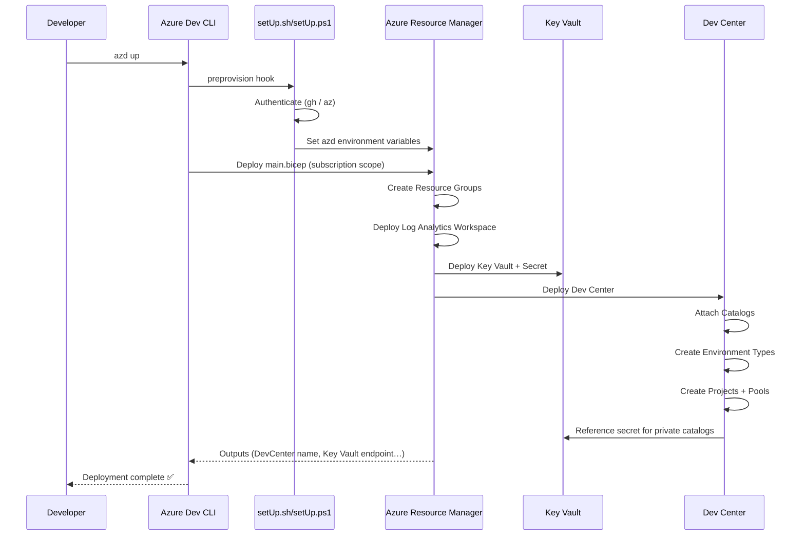

# ContosoDevExp — Microsoft Dev Box Accelerator

[](LICENSE)
[](https://learn.microsoft.com/en-us/azure/dev-box/)
[](https://learn.microsoft.com/en-us/azure/azure-resource-manager/bicep/)
[](https://learn.microsoft.com/en-us/azure/developer/azure-developer-cli/)
[](https://github.com)

**ContosoDevExp** is a production-ready Infrastructure as Code (IaC) accelerator
that provisions fully configured
[Microsoft Dev Box](https://learn.microsoft.com/en-us/azure/dev-box/overview-what-is-microsoft-dev-box)
environments on Azure using
[Azure Developer CLI (azd)](https://learn.microsoft.com/en-us/azure/developer/azure-developer-cli/)
and
[Bicep](https://learn.microsoft.com/en-us/azure/azure-resource-manager/bicep/).
It automates the end-to-end setup of developer workstation platforms, enabling
platform engineering teams to deliver consistent, role-specific, cloud-hosted
development environments at scale.

The accelerator follows
[Azure Landing Zone](https://learn.microsoft.com/en-us/azure/cloud-adoption-framework/ready/landing-zone/)
principles, organising resources across dedicated workload, security, and
monitoring resource groups. All configuration is driven by human-readable YAML
files, so teams can customise Dev Center settings, project definitions, Dev Box
pools, catalogs, and environment types without modifying Bicep source code.

Whether you are bootstrapping a new developer platform for a single team or
rolling out cloud workstations across multiple projects and roles, this
accelerator provides the scaffolding, security defaults, and observability
wiring to get there in minutes.

---

## Table of Contents

- [Features](#features)
- [Architecture](#architecture)
- [Technologies Used](#technologies-used)
- [Quick Start](#quick-start)
  - [Prerequisites](#prerequisites)
  - [Installation](#installation)
  - [Run Locally (Validate)](#run-locally-validate)
- [Configuration](#configuration)
  - [Resource Organisation](#resource-organisation-infrasettingsresourceorganizationazureresourcesyaml)
  - [Dev Center & Projects](#dev-center--projects-infrasettingsworkloaddevcenteryaml)
  - [Security & Key Vault](#security--key-vault-infrasettingssecuritysecurityyaml)
  - [Deployment Parameters](#deployment-parameters-inframainparametersjson)
- [Deployment](#deployment)
  - [Deploy with Azure Developer CLI](#deploy-with-azure-developer-cli)
  - [Deploy with PowerShell](#deploy-with-powershell)
  - [Clean Up](#clean-up)
- [Usage](#usage)
  - [Environment Variables](#environment-variables)
  - [Common Commands](#common-commands)
  - [Adding a New Project](#adding-a-new-project)
  - [Adding a New Dev Box Pool](#adding-a-new-dev-box-pool)
- [Contributing](#contributing)
- [License](#license)

---

## Features

> **Key capabilities at a glance**

| Feature                          | Description                                                                                           |
| -------------------------------- | ----------------------------------------------------------------------------------------------------- |
| **One-command deployment**       | Provision the full Dev Box platform with a single `azd up` command                                    |
| **YAML-driven configuration**    | Customise Dev Centers, projects, pools, and environments through YAML — no Bicep edits required       |
| **Role-specific Dev Box pools**  | Define distinct VM SKUs and image definitions per engineer role (e.g., backend, frontend)             |
| **Azure Landing Zone alignment** | Resources organised across workload, security, and monitoring resource groups                         |
| **Integrated Key Vault**         | GitHub Actions / Azure DevOps tokens stored securely in Azure Key Vault with RBAC                     |
| **Centralised monitoring**       | Log Analytics Workspace with diagnostic settings wired to all core resources                          |
| **Multi-project support**        | Deploy multiple isolated projects, each with its own network, pools, and RBAC groups                  |
| **Multi-environment types**      | Built-in `dev`, `staging`, and `uat` environment types per project                                    |
| **Source control flexibility**   | Supports GitHub (`github`) and Azure DevOps (`adogit`) catalog integrations                           |
| **Cross-platform scripts**       | Setup scripts for both Linux/macOS (`setUp.sh`) and Windows (`setUp.ps1`)                             |
| **Secure by default**            | Purge-protected Key Vault, soft-delete, RBAC-only access policies, system-assigned managed identities |

---

## Architecture

The accelerator provisions resources across three logical landing zones inside
an Azure subscription, orchestrated by a top-level Bicep deployment at
subscription scope.

```mermaid
graph TB
    subgraph subscription["Azure Subscription"]
        direction TB

        subgraph monitoring_rg["Monitoring Resource Group"]
            LAW["🔍 Log Analytics Workspace"]
        end

        subgraph security_rg["Security Resource Group"]
            KV["🔑 Azure Key Vault"]
            Secret["🔒 PAT Secret\n(GitHub / ADO Token)"]
            KV --> Secret
        end

        subgraph workload_rg["Workload Resource Group"]
            DC["🖥️ Azure Dev Center"]

            subgraph catalogs["Catalogs"]
                CAT1["📦 customTasks\n(microsoft/devcenter-catalog)"]
            end

            subgraph env_types["Environment Types"]
                ET1["dev"]
                ET2["staging"]
                ET3["uat"]
            end

            subgraph project["Project: eShop"]
                PROJ["📁 eShop Project"]

                subgraph pools["Dev Box Pools"]
                    POOL1["💻 backend-engineer\ngeneral_i_32c128gb512ssd_v2"]
                    POOL2["💻 frontend-engineer\ngeneral_i_16c64gb256ssd_v2"]
                end

                subgraph network["Connectivity"]
                    VNET["🌐 Virtual Network\n10.0.0.0/16"]
                    SUBNET["📡 eShop-subnet\n10.0.1.0/24"]
                    NC["🔗 Network Connection"]
                    VNET --> SUBNET
                    NC --> VNET
                end

                subgraph rbac["RBAC Groups"]
                    GRP1["👥 eShop Engineers\n(Dev Box User / Contributor)"]
                end
            end

            DC --> catalogs
            DC --> env_types
            DC --> project
            PROJ --> pools
            PROJ --> network
            PROJ --> rbac
        end

        monitoring_rg -->|"Diagnostic Logs"| workload_rg
        security_rg -->|"Secret Identifier"| DC
    end

    azd["⚡ azd up"] -->|"1. preprovision hook"| setUp["setUp.sh / setUp.ps1"]
    setUp -->|"2. provision"| subscription
```

### Component Interactions


```mermaid
sequenceDiagram
    participant Dev as Developer
    participant azd as Azure Dev CLI
    participant Script as setUp.sh/setUp.ps1
    participant ARM as Azure Resource Manager
    participant KV as Key Vault
    participant DC as Dev Center

    Dev->>azd: azd up
    azd->>Script: preprovision hook
    Script->>Script: Authenticate (gh / az)
    Script->>ARM: Set azd environment variables
    azd->>ARM: Deploy main.bicep (subscription scope)
    ARM->>ARM: Create Resource Groups
    ARM->>ARM: Deploy Log Analytics Workspace
    ARM->>KV: Deploy Key Vault + Secret
    ARM->>DC: Deploy Dev Center
    DC->>DC: Attach Catalogs
    DC->>DC: Create Environment Types
    DC->>DC: Create Projects + Pools
    DC->>KV: Reference secret for private catalogs
    ARM-->>azd: Outputs (DevCenter name, Key Vault endpoint…)
    azd-->>Dev: Deployment complete ✅
```

---

## Technologies Used

| Technology                                                                                          | Role                              | Version / Notes                |
| --------------------------------------------------------------------------------------------------- | --------------------------------- | ------------------------------ |
| [Azure Bicep](https://learn.microsoft.com/en-us/azure/azure-resource-manager/bicep/)                | Infrastructure as Code            | Subscription-scoped deployment |
| [Azure Developer CLI (azd)](https://learn.microsoft.com/en-us/azure/developer/azure-developer-cli/) | Deployment orchestration          | `azure.yaml` hooks             |
| [Azure Dev Center](https://learn.microsoft.com/en-us/azure/dev-box/)                                | Developer workstation platform    | `2026-01-01-preview` API       |
| [Azure Key Vault](https://learn.microsoft.com/en-us/azure/key-vault/)                               | Secret management                 | Standard SKU, RBAC auth        |
| [Azure Log Analytics](https://learn.microsoft.com/en-us/azure/azure-monitor/logs/)                  | Centralised monitoring            | `PerGB2018` SKU                |
| [Azure Virtual Networks](https://learn.microsoft.com/en-us/azure/virtual-network/)                  | Project network isolation         | Per-project VNet + subnet      |
| [YAML](https://yaml.org/)                                                                           | Declarative configuration         | Drives all resource settings   |
| [PowerShell 5.1+](https://learn.microsoft.com/en-us/powershell/)                                    | Windows setup / cleanup scripts   | `setUp.ps1`, `cleanSetUp.ps1`  |
| [Bash](https://www.gnu.org/software/bash/)                                                          | Linux/macOS setup script          | `setUp.sh`                     |
| [Azure CLI (az)](https://learn.microsoft.com/en-us/cli/azure/)                                      | Azure authentication & operations | Used by setup scripts          |
| [GitHub CLI (gh)](https://cli.github.com/)                                                          | GitHub integration                | Required for `github` platform |

---

## Quick Start

### Prerequisites

Ensure the following tools are installed and authenticated before deploying.

| Tool                                                                                                           | Minimum Version    | Install Guide                               |
| -------------------------------------------------------------------------------------------------------------- | ------------------ | ------------------------------------------- |
| [Azure CLI](https://learn.microsoft.com/en-us/cli/azure/install-azure-cli)                                     | 2.60+              | `winget install Microsoft.AzureCLI`         |
| [Azure Developer CLI (azd)](https://learn.microsoft.com/en-us/azure/developer/azure-developer-cli/install-azd) | 1.9+               | `winget install Microsoft.Azd`              |
| [GitHub CLI](https://cli.github.com/)                                                                          | 2.40+              | `winget install GitHub.cli` _(GitHub only)_ |
| [PowerShell](https://learn.microsoft.com/en-us/powershell/scripting/install/installing-powershell)             | 5.1+ (Windows)     | Pre-installed on Windows 10/11              |
| [Bash](https://www.gnu.org/software/bash/)                                                                     | 5.0+ (Linux/macOS) | Pre-installed on most Unix systems          |

> **Note:** You need **Owner** or **User Access Administrator** rights on the
> target Azure subscription, as the deployment creates role assignments.

### Installation

**1. Clone the repository**

```bash
git clone https://github.com/Evilazaro/DevExp-DevBox.git
cd DevExp-DevBox
```

**2. Authenticate with Azure**

```bash
az login
azd auth login
```

**3. (GitHub platform only) Authenticate with GitHub CLI**

```bash
gh auth login
```

**4. Initialise an azd environment**

```bash
azd env new <your-env-name>
```

**5. Set required environment variables**

```bash
# Set the Azure region for deployment
azd env set AZURE_LOCATION eastus2

# Set your source control platform: 'github' or 'adogit'
azd env set SOURCE_CONTROL_PLATFORM github

# Set the GitHub Personal Access Token (or ADO PAT) to store in Key Vault
azd env set KEY_VAULT_SECRET <your-pat-token>
```

**6. Deploy everything**

```bash
azd up
```

> `azd up` runs the `preprovision` hook (`setUp.sh` or `setUp.ps1`), then
> provisions all Azure resources defined in `infra/main.bicep`.

### Run Locally (Validate)

To validate your Bicep templates without deploying:

```bash
az deployment sub what-if \
  --location eastus2 \
  --template-file infra/main.bicep \
  --parameters infra/main.parameters.json \
  --parameters environmentName=dev location=eastus2 secretValue=dummy
```

---

## Configuration

All configurable settings are stored in `infra/settings/`. Edit the YAML files
to customise the deployment — no Bicep source changes are required.

### Resource Organisation — `infra/settings/resourceOrganization/azureResources.yaml`

Controls which Azure resource groups are created and their tagging strategy.

```yaml
workload:
  create: true # Create the workload resource group
  name: devexp-workload # Resource group name prefix
  tags:
    environment: dev
    project: Contoso-DevExp-DevBox
    costCenter: IT

security:
  create: false # Re-use workload RG for security resources
  name: devexp-workload

monitoring:
  create: false # Re-use workload RG for monitoring resources
  name: devexp-workload
```

> **Tip:** Set `create: true` for `security` and `monitoring` to isolate those
> resources in separate resource groups. This is recommended for production
> environments.

### Dev Center & Projects — `infra/settings/workload/devcenter.yaml`

The central configuration for the Dev Center, projects, pools, catalogs, and
environment types.

**Dev Center settings**

```yaml
name: 'devexp'
catalogItemSyncEnableStatus: 'Enabled'
microsoftHostedNetworkEnableStatus: 'Enabled'
installAzureMonitorAgentEnableStatus: 'Enabled'
identity:
  type: 'SystemAssigned'
```

**Catalogs** — Git repositories containing Dev Box image definitions and task
files

```yaml
catalogs:
  - name: 'customTasks'
    type: gitHub
    visibility: public
    uri: 'https://github.com/microsoft/devcenter-catalog.git'
    branch: 'main'
    path: './Tasks'
```

**Environment types** — Maps to SDLC stages

```yaml
environmentTypes:
  - name: 'dev'
  - name: 'staging'
  - name: 'uat'
```

**Projects** — Isolated project configurations with pools and network

```yaml
projects:
  - name: 'eShop'
    pools:
      - name: 'backend-engineer'
        imageDefinitionName: 'eshop-backend-dev'
        vmSku: general_i_32c128gb512ssd_v2
      - name: 'frontend-engineer'
        imageDefinitionName: 'eshop-frontend-dev'
        vmSku: general_i_16c64gb256ssd_v2
```

### Security & Key Vault — `infra/settings/security/security.yaml`

```yaml
create: true
keyVault:
  name: contoso # Globally unique prefix; a unique suffix is appended automatically
  secretName: gha-token # Name of the stored PAT secret
  enablePurgeProtection: true
  enableSoftDelete: true
  softDeleteRetentionInDays: 7
  enableRbacAuthorization: true
```

> **Warning:** Do not disable `enablePurgeProtection` in production. Once
> enabled, it cannot be turned off. Accidental deletion of the Key Vault will be
> recoverable within the soft-delete retention window.

### Deployment Parameters — `infra/main.parameters.json`

| Parameter         | Source              | Description                                          |
| ----------------- | ------------------- | ---------------------------------------------------- |
| `environmentName` | `$AZURE_ENV_NAME`   | Short name for the environment (2–10 chars)          |
| `location`        | `$AZURE_LOCATION`   | Azure region for all resources                       |
| `secretValue`     | `$KEY_VAULT_SECRET` | GitHub PAT or Azure DevOps PAT to store in Key Vault |

---

## Deployment

### Deploy with Azure Developer CLI

The recommended deployment method uses `azd`, which handles environment variable
management, pre-provisioning hooks, and Bicep template execution.

```bash
# Full provision + deploy
azd up

# Provision infrastructure only (no application code)
azd provision

# Tear down all Azure resources
azd down
```

**Supported Azure regions:**

| Region         | Code            |
| -------------- | --------------- |
| East US        | `eastus`        |
| East US 2      | `eastus2`       |
| West US 2      | `westus2`       |
| West US 3      | `westus3`       |
| North Europe   | `northeurope`   |
| West Europe    | `westeurope`    |
| UK South       | `uksouth`       |
| Sweden Central | `swedencentral` |
| Southeast Asia | `southeastasia` |

> See `infra/main.bicep` for the full list of `@allowed` regions.

### Deploy with PowerShell

For environments where `azd` is not available, run the setup script directly:

```powershell
# Windows — GitHub as source control platform
.\setUp.ps1 -EnvName "prod" -SourceControl "github"

# Windows — Azure DevOps as source control platform
.\setUp.ps1 -EnvName "dev" -SourceControl "adogit"
```

```bash
# Linux / macOS — GitHub
./setUp.sh -e "prod" -s "github"

# Linux / macOS — Azure DevOps
./setUp.sh -e "dev" -s "adogit"
```

### Clean Up

To remove all provisioned resources and credentials:

```bash
# Using azd (recommended)
azd down --purge

# Using the cleanup script (Windows)
.\cleanSetUp.ps1 -EnvName "prod" -Location "eastus2"
```

> **Warning:** `cleanSetUp.ps1` deletes Azure resource groups, service
> principals, app registrations, and GitHub secrets. This action is
> **irreversible**. Review the `-WhatIf` output before running in production.

```powershell
# Preview what will be deleted (dry run)
.\cleanSetUp.ps1 -EnvName "prod" -WhatIf
```

---

## Usage

### Environment Variables

Set these variables in your `azd` environment (`azd env set <KEY> <VALUE>`) or
as shell environment variables before running the setup scripts.

| Variable                  | Required | Default  | Description                                                   |
| ------------------------- | -------- | -------- | ------------------------------------------------------------- |
| `AZURE_ENV_NAME`          | ✅       | —        | Short environment identifier (e.g., `dev`, `prod`)            |
| `AZURE_LOCATION`          | ✅       | —        | Azure region code (e.g., `eastus2`)                           |
| `KEY_VAULT_SECRET`        | ✅       | —        | GitHub PAT or Azure DevOps PAT to store as a Key Vault secret |
| `SOURCE_CONTROL_PLATFORM` | ❌       | `github` | Source control platform: `github` or `adogit`                 |

### Common Commands

```bash
# List all azd environments
azd env list

# Show current environment values
azd env get-values

# Update a specific environment variable
azd env set SOURCE_CONTROL_PLATFORM adogit

# View deployment outputs (DevCenter name, Key Vault endpoint, etc.)
azd env get-values | grep AZURE
```

**Expected outputs after `azd up`:**

```
AZURE_DEV_CENTER_NAME          = devexp
AZURE_KEY_VAULT_NAME           = contoso-<unique>-kv
AZURE_KEY_VAULT_ENDPOINT       = https://contoso-<unique>-kv.vault.azure.net/
AZURE_LOG_ANALYTICS_WORKSPACE_NAME = logAnalytics-<unique>
WORKLOAD_AZURE_RESOURCE_GROUP_NAME = devexp-workload-dev-eastus2-RG
```

### Adding a New Project

To add a new project (e.g., `PaymentService`) to the Dev Center, edit
`infra/settings/workload/devcenter.yaml`:

```yaml
projects:
  - name: 'PaymentService'
    description: 'Payment processing micro-service team.'
    network:
      name: payment-vnet
      create: true
      resourceGroupName: 'payment-connectivity-RG'
      virtualNetworkType: Unmanaged
      addressPrefixes:
        - 10.1.0.0/16
      subnets:
        - name: payment-subnet
          properties:
            addressPrefix: 10.1.1.0/24
      tags:
        environment: dev
        team: Payments
    identity:
      type: SystemAssigned
      roleAssignments:
        - azureADGroupId: '<your-aad-group-id>'
          azureADGroupName: 'Payment Engineers'
          azureRBACRoles:
            - name: 'Dev Box User'
              id: '45d50f46-0b78-4001-a660-4198cbe8cd05'
              scope: Project
    pools:
      - name: 'payments-engineer'
        imageDefinitionName: 'payments-dev'
        vmSku: general_i_8c32gb256ssd_v2
    catalogs:
      - name: 'payment-catalog'
        type: imageDefinition
        sourceControl: gitHub
        visibility: private
        uri: 'https://github.com/your-org/payment-catalog.git'
        branch: 'main'
        path: './images'
    environmentTypes:
      - name: 'dev'
        deploymentTargetId: ''
```

Then re-deploy:

```bash
azd provision
```

### Adding a New Dev Box Pool

To add a pool to an existing project, append to the `pools` list under the
project in `devcenter.yaml`:

```yaml
pools:
  - name: 'data-engineer'
    imageDefinitionName: 'eshop-data-dev'
    vmSku: general_i_32c128gb1024ssd_v2 # High-memory SKU for data workloads
```

---

## Contributing

Contributions are welcome! Please follow these steps:

1. **Fork** the repository and create a feature branch:

   ```bash
   git checkout -b feature/my-improvement
   ```

2. **Make your changes** — follow the existing naming conventions and YAML
   structure.

3. **Validate Bicep** before submitting:

   ```bash
   az bicep build --file infra/main.bicep
   az deployment sub what-if \
     --location eastus2 \
     --template-file infra/main.bicep \
     --parameters infra/main.parameters.json \
     --parameters environmentName=test location=eastus2 secretValue=dummy
   ```

4. **Open a Pull Request** with a clear description of what changed and why.

**Reporting issues:** Use the
[GitHub Issues tracker](https://github.com/Evilazaro/DevExp-DevBox/issues).

**Documentation site:** Extended documentation is available at
[evilazaro.github.io/DevExp-DevBox](https://evilazaro.github.io/DevExp-DevBox).

### Known Limitations

- `enablePurgeProtection: true` on Key Vault cannot be reversed once applied. If
  you need to redeploy into the same subscription with the same Key Vault name,
  you must purge the deleted vault first using `az keyvault purge`.
- Dev Box pool creation depends on image definitions being present in the
  attached catalog. The catalog sync may take a few minutes after initial
  deployment.
- The `deploymentTargetId` field for environment types must point to a valid
  subscription ID when targeting a subscription other than the default.

---

## License

This project is licensed under the **Apache License 2.0**. See the
[LICENSE](LICENSE) file for full terms.

---

> **References**
>
> - [Microsoft Dev Box documentation](https://learn.microsoft.com/en-us/azure/dev-box/overview-what-is-microsoft-dev-box)
> - [Azure Developer CLI documentation](https://learn.microsoft.com/en-us/azure/developer/azure-developer-cli/)
> - [Azure Bicep documentation](https://learn.microsoft.com/en-us/azure/azure-resource-manager/bicep/)
> - [Azure Landing Zones](https://learn.microsoft.com/en-us/azure/cloud-adoption-framework/ready/landing-zone/)
> - [Dev Center configuration reference](https://evilazaro.github.io/DevExp-DevBox/docs/configureresources/workload/)
