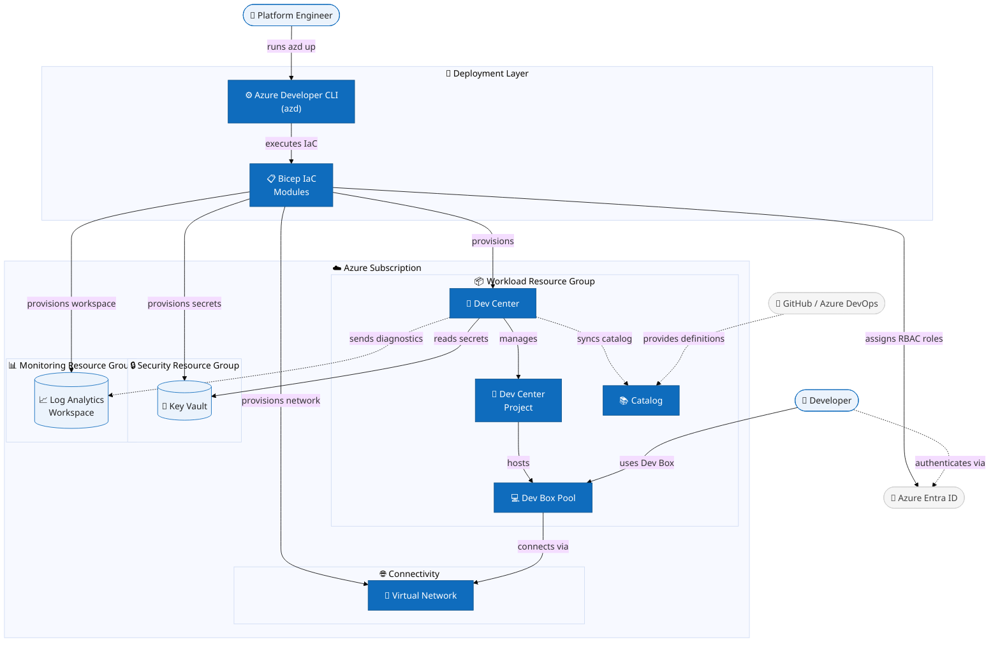

# ContosoDevExp — Microsoft Dev Box Accelerator

[](LICENSE)
[](https://learn.microsoft.com/en-us/azure/dev-box/overview-what-is-microsoft-dev-box)
[](https://learn.microsoft.com/en-us/azure/developer/azure-developer-cli/)
[](https://learn.microsoft.com/en-us/azure/azure-resource-manager/bicep/overview)

**ContosoDevExp** is an Azure Dev Box accelerator that automates the end-to-end
provisioning of cloud-hosted developer workstations using Microsoft Dev Box. It
delivers a fully configured Dev Center, team-scoped projects, role-specific Dev
Box pools, catalog integrations, and all supporting Azure infrastructure — all
from a single `azd up` command.

The accelerator solves the problem of inconsistent, time-consuming manual setup
of developer environments across teams. By encoding every configuration decision
as Infrastructure as Code, platform engineers can enforce standardized,
repeatable environments for all developers, eliminating "works on my machine"
issues and reducing new-developer onboarding time from days to minutes.

The project is built on **Bicep** for Azure infrastructure declarations, **Azure
Developer CLI (azd)** for deployment orchestration, and YAML-driven
configuration files that allow teams to customize Dev Centers, projects, pool
SKUs, environment types, and security settings without modifying infrastructure
code.

## Table of Contents

- [Features](#features)
- [Architecture](#architecture)
- [Technologies Used](#technologies-used)
- [Quick Start](#quick-start)
- [Configuration](#configuration)
- [Deployment](#deployment)
- [Usage](#usage)
- [Contributing](#contributing)
- [License](#license)

## Features

- 🏢 **Automated Dev Center provisioning** — deploys a fully configured
  Microsoft Dev Center with catalog item sync, Azure Monitor agent, and
  Microsoft-hosted network support enabled.
- 💻 **Role-specific Dev Box pools** — creates developer pools with appropriate
  VM SKUs (e.g., backend engineers on `general_i_32c128gb512ssd_v2`, frontend
  engineers on `general_i_16c64gb256ssd_v2`).
- 📁 **Multi-project support** — organizes developers into isolated Dev Center
  projects with per-project catalogs, environment types, and RBAC assignments.
- 📚 **Catalog integration** — syncs image definitions and environment
  definitions from GitHub or Azure DevOps repositories to keep Dev Box images
  current.
- 🔒 **Secrets management** — stores source control access tokens in Azure Key
  Vault with RBAC authorization, purge protection, and soft delete enabled.
- 📊 **Centralized observability** — deploys a Log Analytics workspace and
  attaches diagnostic settings to all resources for unified monitoring.
- 🌐 **Flexible networking** — supports both Microsoft-managed (`Managed`) and
  custom (`Unmanaged`) virtual networks per project, with subnet-level control.
- 🔐 **Least-privilege RBAC** — assigns scoped Azure role assignments to Dev
  Center managed identities, project identities, and Azure AD groups following
  the principle of least privilege.
- ⚙️ **Dual-platform setup scripts** — provides both `setUp.sh` (Linux/macOS)
  and `setUp.ps1` (Windows) to authenticate and configure source control before
  provisioning.
- 🧹 **Clean-up automation** — includes `cleanSetUp.ps1` to remove all deployed
  resources, role assignments, service principals, and GitHub secrets in one
  step.

## Architecture

The diagram below shows the actors, major components, and primary data and
control flows in the ContosoDevExp system.


```mermaid
---
config:
  description: "High-level architecture diagram showing actors, primary flows, and major components."
  theme: base
  align: center
  fontFamily: "Segoe UI, Verdana, sans-serif"
  fontSize: 16
  textColor: "#242424"
  primaryColor: "#0f6cbd"
  primaryTextColor: "#FFFFFF"
  primaryBorderColor: "#0f548c"
  secondaryColor: "#ebf3fc"
  secondaryTextColor: "#242424"
  secondaryBorderColor: "#0f6cbd"
  tertiaryColor: "#f5f5f5"
  tertiaryTextColor: "#424242"
  tertiaryBorderColor: "#d1d1d1"
  noteBkgColor: "#fefbf4"
  noteTextColor: "#242424"
  noteBorderColor: "#f9e2ae"
  lineColor: "#616161"
  background: "#FFFFFF"
  edgeLabelBackground: "#FFFFFF"
  clusterBkg: "#fafafa"
  clusterBorder: "#e0e0e0"
  titleColor: "#242424"
  errorBkgColor: "#fdf3f4"
  errorTextColor: "#b10e1c"
---
flowchart TB

  %% ── External Actors ──────────────────────────────────────────────────────────
  PE(["👤 Platform Engineer"])
  DEV(["👤 Developer"])

  %% ── External Systems ─────────────────────────────────────────────────────────
  GH(["🔗 GitHub / Azure DevOps"])
  ENTRA(["🔐 Azure Entra ID"])

  %% ── Deployment Layer ─────────────────────────────────────────────────────────
  subgraph DEPLOY["🚀 Deployment Layer"]
    AZD["⚙️ Azure Developer CLI<br/>(azd)"]
    BICEP["📋 Bicep IaC<br/>Modules"]
  end

  %% ── Azure Subscription ───────────────────────────────────────────────────────
  subgraph AZURE["☁️ Azure Subscription"]

    subgraph WORKLOAD["📦 Workload Resource Group"]
      DC["🏢 Dev Center"]
      PROJECT["📁 Dev Center<br/>Project"]
      POOL["💻 Dev Box Pool"]
      CATALOG["📚 Catalog"]
    end

    subgraph SECURITY["🔒 Security Resource Group"]
      KV[("🔑 Key Vault")]
    end

    subgraph MONITORING["📊 Monitoring Resource Group"]
      LA[("📈 Log Analytics<br/>Workspace")]
    end

    subgraph CONNECTIVITY["🌐 Connectivity"]
      VNET["🔌 Virtual Network"]
    end

  end

  %% ── Deployment Interactions ──────────────────────────────────────────────────
  PE -->|"runs azd up"| AZD
  AZD -->|"executes IaC"| BICEP
  BICEP -->|"provisions"| DC
  BICEP -->|"provisions secrets"| KV
  BICEP -->|"provisions workspace"| LA
  BICEP -->|"provisions network"| VNET
  BICEP -->|"assigns RBAC roles"| ENTRA

  %% ── Runtime Interactions ─────────────────────────────────────────────────────
  DC -->|"reads secrets"| KV
  DC -.->|"sends diagnostics"| LA
  DC -.->|"syncs catalog"| CATALOG
  GH -.->|"provides definitions"| CATALOG
  DC -->|"manages"| PROJECT
  PROJECT -->|"hosts"| POOL
  POOL -->|"connects via"| VNET
  DEV -.->|"authenticates via"| ENTRA
  DEV -->|"uses Dev Box"| POOL

  %% ── Class Definitions ────────────────────────────────────────────────────────
  classDef actor fill:#ebf3fc,stroke:#0f6cbd,color:#242424
  classDef external fill:#f5f5f5,stroke:#d1d1d1,color:#424242
  classDef service fill:#0f6cbd,stroke:#0f548c,color:#FFFFFF
  classDef datastore fill:#ebf3fc,stroke:#0f6cbd,color:#242424

  class PE,DEV actor
  class GH,ENTRA external
  class AZD,BICEP,DC,PROJECT,POOL,CATALOG,VNET service
  class KV,LA datastore
```

## Technologies Used

| Technology                                                                                               | Type                    | Purpose                                                                                |
| -------------------------------------------------------------------------------------------------------- | ----------------------- | -------------------------------------------------------------------------------------- |
| [Bicep](https://learn.microsoft.com/en-us/azure/azure-resource-manager/bicep/overview)                   | Infrastructure as Code  | Declares all Azure resources as composable, type-safe modules                          |
| [Azure Developer CLI (azd)](https://learn.microsoft.com/en-us/azure/developer/azure-developer-cli/)      | Deployment Orchestrator | Manages environment lifecycle: provision, deploy, and tear down                        |
| [Azure CLI (az)](https://learn.microsoft.com/en-us/cli/azure/)                                           | Cloud Management CLI    | Authenticates and interacts with the Azure control plane                               |
| [GitHub CLI (gh)](https://cli.github.com/)                                                               | Source Control CLI      | Authenticates with GitHub and manages GitHub Actions secrets                           |
| [PowerShell (≥ 5.1)](https://learn.microsoft.com/en-us/powershell/)                                      | Scripting Runtime       | Windows setup and clean-up automation (`setUp.ps1`, `cleanSetUp.ps1`)                  |
| [Bash](https://www.gnu.org/software/bash/)                                                               | Scripting Runtime       | Linux/macOS setup automation (`setUp.sh`)                                              |
| [YAML](https://yaml.org/)                                                                                | Configuration Language  | Declarative configuration for Dev Center, security, and resource organization settings |
| [Microsoft Dev Box](https://learn.microsoft.com/en-us/azure/dev-box/)                                    | Azure Service           | Provides cloud-hosted developer workstations with role-specific configurations         |
| [Azure Key Vault](https://learn.microsoft.com/en-us/azure/key-vault/)                                    | Azure Service           | Stores and manages source control access tokens and other secrets                      |
| [Azure Log Analytics](https://learn.microsoft.com/en-us/azure/azure-monitor/logs/log-analytics-overview) | Azure Service           | Centralizes diagnostic logs and metrics from all deployed resources                    |
| [Azure Virtual Network](https://learn.microsoft.com/en-us/azure/virtual-network/)                        | Azure Service           | Provides network connectivity for Dev Box instances                                    |
| [Azure RBAC](https://learn.microsoft.com/en-us/azure/role-based-access-control/)                         | Azure Service           | Controls least-privilege access for Dev Center, projects, and developers               |

## Quick Start

### Prerequisites

| Prerequisite                                                                                                   | Minimum Version               | Install                                                                                                                                                  |
| -------------------------------------------------------------------------------------------------------------- | ----------------------------- | -------------------------------------------------------------------------------------------------------------------------------------------------------- |
| [Azure CLI](https://learn.microsoft.com/en-us/cli/azure/install-azure-cli)                                     | 2.65.0                        | `winget install Microsoft.AzureCLI`                                                                                                                      |
| [Azure Developer CLI (azd)](https://learn.microsoft.com/en-us/azure/developer/azure-developer-cli/install-azd) | 1.11.0                        | `winget install Microsoft.Azd`                                                                                                                           |
| [GitHub CLI (gh)](https://cli.github.com/)                                                                     | 2.60.0                        | `winget install GitHub.cli` — required for GitHub integration                                                                                            |
| PowerShell                                                                                                     | 5.1 (Windows built-in) or 7.x | Built-in on Windows; [install PowerShell 7](https://learn.microsoft.com/en-us/powershell/scripting/install/installing-powershell) for cross-platform use |
| Bash                                                                                                           | Any recent version            | Built-in on Linux/macOS; available via Git Bash on Windows                                                                                               |

> [!IMPORTANT] You must have **Owner** or **User Access Administrator**
> permissions on the target Azure subscription, because the accelerator creates
> role assignments at subscription scope.

### Installation

1. Clone the repository.

   ```bash
   git clone https://github.com/Evilazaro/DevExp-DevBox.git
   cd DevExp-DevBox
   ```

2. Authenticate with Azure and initialize the environment.

   ```bash
   az login
   azd auth login
   ```

3. Set the required environment variables.

   ```bash
   azd env set AZURE_ENV_NAME "dev"
   azd env set AZURE_LOCATION "eastus2"
   azd env set KEY_VAULT_SECRET "<your-github-or-ado-pat>"
   azd env set SOURCE_CONTROL_PLATFORM "github"
   ```

4. Provision all Azure resources.

   ```bash
   azd up
   ```

### Minimal Working Example

The following example provisions a `dev` environment in the `eastus2` region
using GitHub as the source control platform.

```bash
# Authenticate
az login
azd auth login

# Configure environment
azd env new dev
azd env set AZURE_LOCATION "eastus2"
azd env set KEY_VAULT_SECRET "ghp_YourGitHubPAT"
azd env set SOURCE_CONTROL_PLATFORM "github"

# Deploy
azd up
# Expected output:
#   Provisioning Azure resources (azd provision)
#   ...
#   SUCCESS: Your up workflow to provision and deploy to Azure completed in X minutes Y seconds.
```

## Configuration

The accelerator exposes the following environment variables and YAML
configuration files. Set environment variables using
`azd env set <VARIABLE> <value>` before running `azd up`.

### Environment Variables

| Option                    | Default      | Description                                                                                             |
| ------------------------- | ------------ | ------------------------------------------------------------------------------------------------------- |
| `AZURE_ENV_NAME`          | _(required)_ | Environment name used for resource naming. Must be 2–10 characters (e.g., `dev`, `staging`).            |
| `AZURE_LOCATION`          | _(required)_ | Azure region for all deployments (e.g., `eastus2`, `westeurope`). See [supported regions](#deployment). |
| `KEY_VAULT_SECRET`        | _(required)_ | Personal access token (PAT) for GitHub or Azure DevOps. Stored securely in Azure Key Vault.             |
| `SOURCE_CONTROL_PLATFORM` | `github`     | Source control platform for catalog integration. Accepted values: `github`, `adogit`.                   |

### Configuration Files

| File                                                      | Purpose                                                                                                 |
| --------------------------------------------------------- | ------------------------------------------------------------------------------------------------------- |
| `infra/settings/workload/devcenter.yaml`                  | Defines Dev Center name, catalog sources, environment types, project pools, and RBAC group assignments. |
| `infra/settings/security/security.yaml`                   | Configures Key Vault name, soft-delete retention, purge protection, and RBAC authorization settings.    |
| `infra/settings/resourceOrganization/azureResources.yaml` | Controls resource group creation and tagging for workload, security, and monitoring landing zones.      |

### Example: Override Configuration

To deploy to a different region, update `infra/main.parameters.json`:

```json
{
  "$schema": "https://schema.management.azure.com/schemas/2019-04-01/deploymentParameters.json#",
  "contentVersion": "1.0.0.0",
  "parameters": {
    "environmentName": { "value": "${AZURE_ENV_NAME}" },
    "location": { "value": "${AZURE_LOCATION}" },
    "secretValue": { "value": "${KEY_VAULT_SECRET}" }
  }
}
```

> [!NOTE] The `secretValue` parameter is marked `@secure()` in Bicep and is
> never logged or stored in plain text in the Azure deployment history.

## Deployment

Follow these steps to deploy the accelerator to a production or staging
subscription.

1. **Verify prerequisites** — confirm that Azure CLI, azd, and GitHub CLI (or
   ADO credentials) are installed and authenticated.

   ```bash
   az account show
   azd auth login --check-status
   ```

2. **Choose a target subscription** and set it as the active account.

   ```bash
   az account set --subscription "<subscription-id>"
   ```

3. **Configure all required environment variables** as described in the
   [Configuration](#configuration) section.

4. **Review the resource organization settings** in
   `infra/settings/resourceOrganization/azureResources.yaml` to ensure resource
   group names and tags align with your organization's naming conventions.

5. **Customize Dev Center settings** in
   `infra/settings/workload/devcenter.yaml`. Update Azure AD group IDs under
   `orgRoleTypes` and `projects[*].identity.roleAssignments` with the actual
   group object IDs from your tenant.

   > [!WARNING] The default Azure AD group IDs in `devcenter.yaml` are example
   > placeholders. Replace them with real group IDs from your Azure AD tenant
   > before deploying to production.

6. **Run the deployment.**

   ```bash
   azd up
   ```

7. **Verify the deployment** by navigating to the created resource group in the
   Azure portal and confirming that the Dev Center, Key Vault, and Log Analytics
   workspace are healthy.

8. **Share the Dev Center project URL** with developers so they can access their
   Dev Boxes through the
   [Microsoft Dev Box developer portal](https://devbox.microsoft.com).

### Supported Regions

`eastus` · `eastus2` · `westus` · `westus2` · `westus3` · `centralus` ·
`northeurope` · `westeurope` · `southeastasia` · `australiaeast` · `japaneast` ·
`uksouth` · `canadacentral` · `swedencentral` · `switzerlandnorth` ·
`germanywestcentral`

### Clean Up

To remove all deployed resources and associated credentials, run the clean-up
script.

```powershell
# Windows
.\cleanSetUp.ps1 -EnvName "dev" -Location "eastus2"
```

> [!CAUTION] The clean-up script deletes Azure resource groups, service
> principals, and GitHub secrets. This action is irreversible. Confirm you are
> targeting the correct environment before running.

## Usage

### Provision a New Environment

Use `azd up` to provision and configure all Azure resources end to end.

```bash
azd up
# The pre-provision hook runs setUp.sh (Linux/macOS) or setUp.ps1 (Windows),
# which authenticates with the chosen source control platform, configures
# Azure credentials, and then executes the Bicep deployment.
```

### Run Setup Scripts Directly

You can invoke the setup scripts independently to re-authenticate or reconfigure
a source control integration without re-provisioning infrastructure.

```bash
# Linux / macOS — GitHub integration
./setUp.sh -e "dev" -s "github"

# Linux / macOS — Azure DevOps integration
./setUp.sh -e "dev" -s "adogit"
```

```powershell
# Windows — GitHub integration
.\setUp.ps1 -EnvName "dev" -SourceControl "github"

# Windows — Azure DevOps integration
.\setUp.ps1 -EnvName "dev" -SourceControl "adogit"
```

### Customize Dev Box Pools

Edit `infra/settings/workload/devcenter.yaml` to add or modify Dev Box pools for
a project. The following snippet adds a data-engineer pool to the `eShop`
project.

```yaml
pools:
  - name: 'backend-engineer'
    imageDefinitionName: 'eshop-backend-dev'
    vmSku: general_i_32c128gb512ssd_v2
  - name: 'frontend-engineer'
    imageDefinitionName: 'eshop-frontend-dev'
    vmSku: general_i_16c64gb256ssd_v2
  - name: 'data-engineer' # New pool
    imageDefinitionName: 'eshop-data-dev'
    vmSku: general_i_16c64gb256ssd_v2
```

Then run `azd up` again to apply the changes.

> [!TIP] Review the
> [Microsoft Dev Box VM SKU list](https://learn.microsoft.com/en-us/azure/dev-box/concept-dev-box-concepts#dev-box-definition)
> to choose the right compute size for each developer role.

### View Deployment Outputs

After provisioning, retrieve key resource names from the azd environment.

```bash
azd env get-values
# Expected output (example):
#   AZURE_DEV_CENTER_NAME="devexp"
#   AZURE_KEY_VAULT_NAME="contoso-<unique>-kv"
#   AZURE_KEY_VAULT_ENDPOINT="https://contoso-<unique>-kv.vault.azure.net/"
#   AZURE_LOG_ANALYTICS_WORKSPACE_NAME="logAnalytics-<unique>"
#   WORKLOAD_AZURE_RESOURCE_GROUP_NAME="devexp-workload-dev-eastus2-RG"
```

## Contributing

Contributions are welcome and appreciated. To contribute to this project:

1. **Open an issue** to report a bug or propose a new feature before submitting
   code. This helps avoid duplicate work and ensures alignment with the project
   roadmap.
2. **Fork the repository** and create a feature branch from `main`.

   ```bash
   git checkout -b feature/your-feature-name
   ```

3. **Make your changes**, ensuring all Bicep files pass linting
   (`az bicep build`) and all scripts pass static analysis.
4. **Submit a pull request** against the `main` branch with a clear description
   of the change and its motivation.
5. **Respond to review comments** promptly. The maintainers aim to review pull
   requests within five business days.

> [!NOTE] By contributing to this repository, you agree that your contributions
> will be licensed under the same [MIT License](LICENSE) that covers the
> project.

For questions or discussions, open an issue at
[github.com/Evilazaro/DevExp-DevBox/issues](https://github.com/Evilazaro/DevExp-DevBox/issues).

## License

This project is licensed under the **MIT License**. See the [LICENSE](LICENSE)
file for the full license text.

Copyright © 2025 Evilázaro Alves
