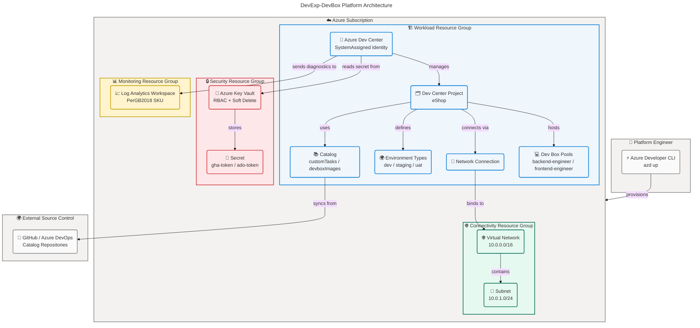

# DevExp-DevBox

[](./LICENSE)
[](https://learn.microsoft.com/en-us/azure/azure-resource-manager/bicep/overview)
[](https://learn.microsoft.com/en-us/azure/developer/azure-developer-cli/overview)
[](https://learn.microsoft.com/en-us/azure/dev-box/overview-what-is-microsoft-dev-box)
[](https://azure.microsoft.com)
[](https://learn.microsoft.com/en-us/powershell/scripting/install/installing-powershell)

**DevExp-DevBox** is a production-ready Azure Developer CLI (`azd`) accelerator
that automates the end-to-end provisioning of enterprise-grade
[Microsoft Dev Box](https://learn.microsoft.com/en-us/azure/dev-box/overview-what-is-microsoft-dev-box)
environments using Bicep infrastructure-as-code and YAML-driven configuration.
It enables platform engineering teams to deliver standardized, role-specific
developer workstations at scale — eliminating manual setup time and enforcing
organizational security and governance standards.

## 📋 Table of Contents

- [Overview](#-overview)
- [Features](#-features)
- [Architecture](#️-architecture)
- [Quick Start](#-quick-start)
- [Requirements](#-requirements)
- [Usage](#-usage)
- [Configuration](#️-configuration)
- [Deployment](#-deployment)
- [Contributing](#-contributing)
- [License](#-license)

## 🌐 Overview

DevExp-DevBox provisions a **layered Azure platform** following
[Azure Landing Zone](https://learn.microsoft.com/en-us/azure/cloud-adoption-framework/ready/landing-zone/)
principles with segregated resource groups for workload, security, and
monitoring concerns. All infrastructure is defined in Bicep and driven by YAML
configuration files, making it fully repeatable and version-controlled.

The accelerator follows a subscription-scoped Bicep deployment model. An Azure
Dev Center sits at the core, referencing Azure Key Vault secrets for private
catalog access, sending diagnostics to a Log Analytics Workspace, and managing
projects that each have role-specific Dev Box pools connected via Azure Virtual
Network. Deployment is fully orchestrated by `azd`, with cross-platform setup
scripts (`setUp.sh` / `setUp.ps1`) that integrate with GitHub and Azure DevOps
for credential management and CI/CD automation.

> [!TIP] All infrastructure components are configured through YAML files under
> `infra/settings/`. No changes to Bicep source files are required for standard
> project onboarding.

> [!IMPORTANT] The `setUp.sh` and `setUp.ps1` scripts run as `azd` pre-provision
> hooks defined in `azure.yaml`. They are invoked automatically when you run
> `azd up`, but can also be called directly for credential rotation or
> environment re-initialization.

## ✨ Features

**Overview**

DevExp-DevBox eliminates the complexity of manually configuring Dev Centers,
projects, pools, and network connectivity by replacing it with a single
YAML-driven configuration model. Every infrastructure resource is created in the
correct dependency order with integrated observability and security controls
wired automatically. Platform engineering teams can onboard new projects or
rotate credentials without touching Bicep source code.

| 🚀 Feature                            | 📝 Description                                                                                                                                                           | ✅ Status |
| ------------------------------------- | ------------------------------------------------------------------------------------------------------------------------------------------------------------------------ | --------- |
| 🏢 Config-Driven Dev Center           | Provision Azure Dev Center, catalogs, and environment types from `devcenter.yaml` via `loadYamlContent()`                                                                | ✅ Stable |
| 🗂️ Multi-Project Support              | Deploy multiple team projects, each with isolated pools, catalogs, and environment types defined in a single YAML array                                                  | ✅ Stable |
| 💻 Role-Specific Dev Box Pools        | Define image definitions and VM SKUs per engineering role (e.g., `backend-engineer`, `frontend-engineer`) from YAML pool configs                                         | ✅ Stable |
| 📚 Catalog Integration                | Connect Dev Box image definitions and environment definitions from GitHub or Azure DevOps Git repos with public or private visibility                                    | ✅ Stable |
| 🔑 Secure Secret Management           | Store GitHub Actions and Azure DevOps tokens in Azure Key Vault with RBAC authorization, purge protection, and soft-delete                                               | ✅ Stable |
| 📊 Integrated Observability           | Log Analytics Workspace with diagnostic settings wired to all resources automatically (Dev Center, VNet, Key Vault)                                                      | ✅ Stable |
| 🌐 Network Flexibility                | Support both `Managed` and `Unmanaged` (custom VNet) network configurations per project, with subnet-level control                                                       | ✅ Stable |
| 🏗️ Landing Zone Resource Organization | Segregated resource groups for workload, security, and monitoring following Azure Landing Zone best practices                                                            | ✅ Stable |
| 🌍 Environment Type Management        | Define multiple deployment environments (`dev`, `staging`, `uat`) per Dev Center and project with distinct deployment target IDs                                         | ✅ Stable |
| 📜 Cross-Platform Setup Scripts       | Bash (`setUp.sh`) and PowerShell (`setUp.ps1`) scripts for environment initialization on Linux, macOS, and Windows                                                       | ✅ Stable |
| 🔐 RBAC Role Automation               | Automatic assignment of `Contributor`, `User Access Administrator`, `Key Vault Secrets User/Officer`, and `Dev Box User` roles to managed identities and Azure AD groups | ✅ Stable |

## 🏗️ Architecture

**Overview**

DevExp-DevBox provisions a layered Azure platform at subscription scope. The
Azure Developer CLI orchestrates a Bicep deployment that creates segregated
resource groups and deploys modules in strict dependency order. The Dev Center
sits at the core, integrating Key Vault for secret-based catalog access, Log
Analytics for centralized diagnostics, and Azure Virtual Networks for
project-level network isolation. Each resource module is independently scoped
and emits typed output contracts consumed by downstream modules.


```mermaid
---
title: "DevExp-DevBox Platform Architecture"
config:
  theme: base
  look: classic
  layout: dagre
  flowchart:
    htmlLabels: true
---
flowchart TB
    accTitle: DevExp-DevBox Azure Dev Box Platform Architecture
    accDescr: Platform architecture with azd CLI orchestrating subscription-scope Bicep deployment. Dev Center in Workload RG integrates Key Vault in Security RG, Log Analytics in Monitoring RG, and VNet in Connectivity RG. Catalog syncs from external GitHub or ADO repos. WCAG AA compliant.

    %% ═══════════════════════════════════════════════════════════════════════════
    %% AZURE / FLUENT ARCHITECTURE PATTERN v2.0
    %% (Semantic + Structural + Font + Accessibility Governance)
    %% ═══════════════════════════════════════════════════════════════════════════
    %% PHASE 1 - FLUENT UI: All styling uses approved Fluent UI palette only
    %% PHASE 2 - GROUPS: Every subgraph has semantic color via style directive
    %% PHASE 3 - COMPONENTS: Every node has semantic classDef + icon prefix
    %% PHASE 4 - ACCESSIBILITY: accTitle/accDescr present, WCAG AA contrast
    %% PHASE 5 - STANDARD: Governance block present, classDefs centralized
    %% ═══════════════════════════════════════════════════════════════════════════

    subgraph developer["👤 Platform Engineer"]
        devCLI("⚡ Azure Developer CLI<br/>azd up"):::neutral
    end

    subgraph subscription["☁️ Azure Subscription"]

        subgraph workloadRG["🏗️ Workload Resource Group"]
            devCenter("🏢 Azure Dev Center<br/>SystemAssigned Identity"):::core
            project("🗂️ Dev Center Project<br/>eShop"):::core
            catalog("📚 Catalog<br/>customTasks / devboxImages"):::core
            envType("🌍 Environment Types<br/>dev / staging / uat"):::core
            netConn("🔗 Network Connection"):::core
            pool("💻 Dev Box Pools<br/>backend-engineer / frontend-engineer"):::core
        end

        subgraph securityRG["🔒 Security Resource Group"]
            keyVault("🔑 Azure Key Vault<br/>RBAC + Soft Delete"):::security
            secret("🔐 Secret<br/>gha-token / ado-token"):::security
        end

        subgraph monitoringRG["📊 Monitoring Resource Group"]
            logAnalytics("📈 Log Analytics Workspace<br/>PerGB2018 SKU"):::monitoring
        end

        subgraph connectivityRG["🌐 Connectivity Resource Group"]
            vnet("🌐 Virtual Network<br/>10.0.0.0/16"):::data
            subnet("🔌 Subnet<br/>10.0.1.0/24"):::data
        end

    end

    subgraph external["🌍 External Source Control"]
        github("🐙 GitHub / Azure DevOps<br/>Catalog Repositories"):::neutral
    end

    devCLI -->|"provisions"| subscription
    devCenter -->|"reads secret from"| keyVault
    devCenter -->|"sends diagnostics to"| logAnalytics
    keyVault -->|"stores"| secret
    devCenter -->|"manages"| project
    project -->|"uses"| catalog
    project -->|"defines"| envType
    project -->|"connects via"| netConn
    project -->|"hosts"| pool
    netConn -->|"binds to"| vnet
    vnet -->|"contains"| subnet
    catalog -->|"syncs from"| github

    style developer fill:#F3F2F1,stroke:#8A8886,stroke-width:2px,color:#323130
    style subscription fill:#F3F2F1,stroke:#8A8886,stroke-width:2px,color:#323130
    style workloadRG fill:#EFF6FC,stroke:#0078D4,stroke-width:2px,color:#323130
    style securityRG fill:#FDE7E9,stroke:#D13438,stroke-width:2px,color:#323130
    style monitoringRG fill:#FFF4CE,stroke:#C69E00,stroke-width:2px,color:#323130
    style connectivityRG fill:#E6F9F1,stroke:#036B52,stroke-width:2px,color:#323130
    style external fill:#F3F2F1,stroke:#8A8886,stroke-width:2px,color:#323130

    classDef core fill:#EFF6FC,stroke:#0078D4,stroke-width:2px,color:#323130
    classDef security fill:#FDE7E9,stroke:#D13438,stroke-width:2px,color:#323130
    classDef monitoring fill:#FFF4CE,stroke:#C69E00,stroke-width:2px,color:#323130
    classDef data fill:#E6F9F1,stroke:#036B52,stroke-width:2px,color:#323130
    classDef neutral fill:#FAFAFA,stroke:#8A8886,stroke-width:2px,color:#323130
```

### Bicep Module Dependency Chain

The `infra/main.bicep` deploys at subscription scope in the following order:

| 🔢 Order | 📦 Module              | 📁 Source                                  | 🏗️ Resource Group  |
| -------- | ---------------------- | ------------------------------------------ | ------------------ |
| 1️⃣       | 🏗️ Resource Groups     | `infra/main.bicep`                         | Subscription scope |
| 2️⃣       | 📊 Log Analytics       | `src/management/logAnalytics.bicep`        | Monitoring RG      |
| 3️⃣       | 🔑 Key Vault + Secret  | `src/security/security.bicep`              | Security RG        |
| 4️⃣       | 🖥️ Dev Center          | `src/workload/core/devCenter.bicep`        | Workload RG        |
| 5️⃣       | 📚 Catalogs            | `src/workload/core/catalog.bicep`          | Workload RG        |
| 6️⃣       | 🌍 Environment Types   | `src/workload/core/environmentType.bicep`  | Workload RG        |
| 7️⃣       | 📋 Projects            | `src/workload/project/project.bicep`       | Workload RG        |
| 8️⃣       | 🌐 Virtual Networks    | `src/connectivity/vnet.bicep`              | Connectivity RG    |
| 9️⃣       | 🔗 Network Connections | `src/connectivity/networkConnection.bicep` | Workload RG        |
| 🔟       | 💻 Dev Box Pools       | `src/workload/project/projectPool.bicep`   | Workload RG        |

## 🚀 Quick Start

### Prerequisites

Install
[Azure CLI](https://learn.microsoft.com/en-us/cli/azure/install-azure-cli),
[Azure Developer CLI](https://learn.microsoft.com/en-us/azure/developer/azure-developer-cli/install-azd),
and [GitHub CLI](https://cli.github.com/) before proceeding.

> [!WARNING] You must have **Owner** or **User Access Administrator** role on
> the target Azure subscription. The Dev Center managed identity requires
> `Contributor` and `User Access Administrator` role assignments at subscription
> scope (defined in `infra/settings/workload/devcenter.yaml`).

**Step 1 — Clone the repository:**

```bash
git clone https://github.com/Evilazaro/DevExp-DevBox.git
cd DevExp-DevBox
```

**Step 2 — Authenticate:**

```bash
azd auth login
az login
```

**Step 3 — Initialize and provision the environment:**

```bash
# Linux / macOS
./setUp.sh -e dev -s github

# Windows (PowerShell)
.\setUp.ps1 -EnvName dev -SourceControl github
```

**Expected Output:**

```text
✅ [2026-04-24 10:00:00] Azure CLI authenticated successfully.
✅ [2026-04-24 10:00:05] Azure Developer CLI authenticated successfully.
✅ [2026-04-24 10:00:10] GitHub CLI authenticated successfully.
✅ [2026-04-24 10:00:15] Environment 'dev' initialized.
```

**Step 4 — Deploy all resources:**

```bash
azd up
```

**Expected Output:**

```text
Provisioning Azure resources (azd provision)

  (✓) Done: Resource Group: devexp-workload-dev-eastus-RG
  (✓) Done: Log Analytics Workspace: logAnalytics-<unique>
  (✓) Done: Key Vault: contoso-<unique>-kv
  (✓) Done: Azure Dev Center: devexp
  (✓) Done: Dev Center Catalogs: customTasks
  (✓) Done: Environment Types: dev, staging, uat
  (✓) Done: Dev Box Project: eShop
  (✓) Done: Virtual Network: eShop
  (✓) Done: Network Connection: eShop
  (✓) Done: Dev Box Pools: backend-engineer, frontend-engineer

SUCCESS: Your up workflow to provision and deploy to Azure completed in 12 minutes.

Outputs:
  AZURE_DEV_CENTER_NAME: devexp
  AZURE_DEV_CENTER_PROJECTS: ["eShop"]
  AZURE_KEY_VAULT_NAME: contoso-<unique>-kv
  AZURE_LOG_ANALYTICS_WORKSPACE_NAME: logAnalytics-<unique>
```

## 📋 Requirements

**Overview**

DevExp-DevBox requires standard Azure and developer toolchain components
available on Linux, macOS, and Windows. All tools are freely available and
widely used across platform engineering teams. The Azure subscription must have
sufficient permissions to create resource groups, role assignments, and Dev
Center resources at subscription scope.

> [!TIP] Use the
> [Azure Developer CLI installation guide](https://learn.microsoft.com/en-us/azure/developer/azure-developer-cli/install-azd)
> to install `azd` on any platform with a single command.

> [!IMPORTANT] The `setUp.sh` and `setUp.ps1` scripts validate all prerequisites
> before execution and exit with a clear error message if any dependency is
> missing.

| 🔧 Prerequisite         | 📝 Description                                                                            | 🔗 Install                                                                                                         |
| ----------------------- | ----------------------------------------------------------------------------------------- | ------------------------------------------------------------------------------------------------------------------ |
| ☁️ Azure Subscription   | Active Azure subscription with Owner or User Access Administrator role                    | [Azure Portal](https://portal.azure.com)                                                                           |
| ⚡ Azure Developer CLI  | `azd` v1.0+ for environment management and deployment orchestration                       | [Install azd](https://learn.microsoft.com/en-us/azure/developer/azure-developer-cli/install-azd)                   |
| 🔵 Azure CLI            | `az` for resource management and authentication                                           | [Install az](https://learn.microsoft.com/en-us/cli/azure/install-azure-cli)                                        |
| 🐙 GitHub CLI           | `gh` for GitHub authentication and secret management (required for GitHub source control) | [Install gh](https://cli.github.com/)                                                                              |
| 🔄 jq                   | JSON processor used in `setUp.sh` for parsing API responses                               | [Install jq](https://jqlang.github.io/jq/download/)                                                                |
| 🖥️ PowerShell 5.1+      | Required for `setUp.ps1` and `cleanSetUp.ps1` on Windows                                  | [Install PowerShell](https://learn.microsoft.com/en-us/powershell/scripting/install/installing-powershell)         |
| 🔐 Azure AD Permissions | Permission to create app registrations and service principals in the target tenant        | [Azure AD docs](https://learn.microsoft.com/en-us/azure/active-directory/develop/app-registrations-training-guide) |

## 💻 Usage

**Overview**

After initial deployment, use the YAML configuration files under
`infra/settings/` to add projects, pools, catalogs, and environment types.
Re-run `azd up` to apply changes incrementally. The setup scripts can be re-run
directly for credential rotation without reprovisioning all resources.

### Add a New Dev Box Project

Edit `infra/settings/workload/devcenter.yaml` and append a new project entry
under the `projects` array:

```yaml
projects:
  - name: 'myNewProject'
    description: 'My new team project.'
    network:
      name: myNewProject
      create: true
      resourceGroupName: 'myNewProject-connectivity-RG'
      virtualNetworkType: Managed
    identity:
      type: SystemAssigned
      roleAssignments:
        - azureADGroupId: '<your-group-id>'
          azureADGroupName: 'My Team Engineers'
          azureRBACRoles:
            - name: 'Dev Box User'
              id: '45d50f46-0b78-4001-a660-4198cbe8cd05'
              scope: Project
    pools:
      - name: 'developer'
        imageDefinitionName: 'myteam-dev'
        vmSku: general_i_16c64gb256ssd_v2
    environmentTypes:
      - name: 'dev'
        deploymentTargetId: ''
    catalogs:
      - name: 'devboxImages'
        type: imageDefinition
        sourceControl: gitHub
        visibility: private
        uri: 'https://github.com/MyOrg/MyRepo.git'
        branch: 'main'
        path: '/.devcenter/imageDefinitions'
    tags:
      environment: 'dev'
      team: 'MyTeam'
```

Then re-deploy:

```bash
azd up
```

**Expected Output:**

```text
  (✓) Done: Dev Box Project: myNewProject
  (✓) Done: Dev Box Pools: developer

SUCCESS: Your up workflow to provision and deploy to Azure completed.
```

### Use Azure DevOps as Source Control

Pass `adogit` to the setup script to configure Azure DevOps authentication
instead of GitHub:

```bash
# Linux / macOS
./setUp.sh -e dev -s adogit

# Windows (PowerShell)
.\setUp.ps1 -EnvName dev -SourceControl adogit
```

**Expected Output:**

```text
✅ [2026-04-24 10:00:10] Azure DevOps CLI authenticated successfully.
✅ [2026-04-24 10:00:15] Environment 'dev' initialized with ADO source control.
```

### View Help for Setup Scripts

```bash
# Linux / macOS
./setUp.sh --help

# Windows (PowerShell)
Get-Help .\setUp.ps1 -Detailed
```

**Expected Output:**

```text
SYNOPSIS
    setUp.ps1 - Sets up Azure Dev Box environment with GitHub integration

PARAMETER EnvName
    Name of the Azure environment to create

PARAMETER SourceControl
    Source control platform (github or adogit)
```

### Clean Up Resources

To remove all provisioned resources and clean up credentials:

```powershell
.\cleanSetUp.ps1 -EnvName dev -Location eastus
```

**Expected Output:**

```text
✅ Subscription deployments deleted.
✅ Role assignments removed.
✅ Service principal deleted.
✅ GitHub secret 'AZURE_CREDENTIALS' removed.
✅ Resource groups deleted.
```

## ⚙️ Configuration

**Overview**

All configuration is managed through three YAML files under `infra/settings/`.
These files define resource group organization, Key Vault settings, and the full
Dev Center topology — including projects, pools, catalogs, environment types,
and RBAC assignments. Changes to these files are automatically picked up by the
Bicep modules during `azd up` via `loadYamlContent()` calls in
`src/workload/workload.bicep` and `infra/main.bicep`.

> [!NOTE] Schema files (`*.schema.json`) are co-located with each YAML
> configuration file. Use them to validate your configuration in VS Code with
> the `yaml-language-server: $schema=` directive already present at the top of
> each file.

### 🏗️ Resource Organization — `infra/settings/resourceOrganization/azureResources.yaml`

Controls how Azure resource groups are created and named. Setting
`create: false` for `security` or `monitoring` causes those resources to share
the workload resource group.

| ⚙️ Parameter           | 📝 Description                                                                                                    | 🔧 Default         |
| ---------------------- | ----------------------------------------------------------------------------------------------------------------- | ------------------ |
| 🏗️ `workload.create`   | Whether to create the workload resource group                                                                     | `true`             |
| 📦 `workload.name`     | Base name for the workload resource group                                                                         | `devexp-workload`  |
| 🔒 `security.create`   | Whether to create a dedicated security resource group                                                             | `false`            |
| 📊 `monitoring.create` | Whether to create a dedicated monitoring resource group                                                           | `false`            |
| 🏷️ `*.tags`            | Azure tags applied to all resources in the landing zone (environment, division, team, project, costCenter, owner) | `environment: dev` |

### 🔑 Security — `infra/settings/security/security.yaml`

Controls the Azure Key Vault resource provisioned for secret storage.

| ⚙️ Parameter                            | 📝 Description                                                          | 🔧 Default  |
| --------------------------------------- | ----------------------------------------------------------------------- | ----------- |
| 🔑 `create`                             | Whether to create the Key Vault                                         | `true`      |
| 🏷️ `keyVault.name`                      | Base name for the Key Vault (a unique suffix is appended automatically) | `contoso`   |
| 📜 `keyVault.secretName`                | Name of the secret that stores the source control token                 | `gha-token` |
| 🛡️ `keyVault.enablePurgeProtection`     | Prevents permanent deletion of the Key Vault                            | `true`      |
| 🗑️ `keyVault.enableSoftDelete`          | Allows recovery of deleted secrets                                      | `true`      |
| 📅 `keyVault.softDeleteRetentionInDays` | Number of days deleted secrets are retained (7–90)                      | `7`         |
| 🔐 `keyVault.enableRbacAuthorization`   | Use Azure RBAC instead of access policies                               | `true`      |

### 🖥️ Dev Center — `infra/settings/workload/devcenter.yaml`

Controls the full Dev Center topology. This is the primary configuration file
for platform engineers.

| ⚙️ Parameter                                 | 📝 Description                                                                                                     | 🔧 Example                                 |
| -------------------------------------------- | ------------------------------------------------------------------------------------------------------------------ | ------------------------------------------ |
| 🏢 `name`                                    | Name of the Azure Dev Center resource                                                                              | `devexp`                                   |
| 🔄 `catalogItemSyncEnableStatus`             | Enable or disable catalog item sync                                                                                | `Enabled`                                  |
| 🌐 `microsoftHostedNetworkEnableStatus`      | Enable Microsoft-hosted networking                                                                                 | `Enabled`                                  |
| 📊 `installAzureMonitorAgentEnableStatus`    | Install Azure Monitor Agent on Dev Boxes                                                                           | `Enabled`                                  |
| 🔐 `identity.type`                           | Managed identity type for the Dev Center                                                                           | `SystemAssigned`                           |
| 👥 `identity.roleAssignments.devCenter[]`    | Subscription-scoped RBAC roles assigned to the Dev Center managed identity                                         | `Contributor`, `User Access Administrator` |
| 👥 `identity.roleAssignments.orgRoleTypes[]` | Azure AD group assignments for Dev Managers with project admin RBAC                                                | See `devcenter.yaml`                       |
| 📚 `catalogs[]`                              | Array of Git repository catalogs (GitHub or ADO) with `name`, `type`, `uri`, `branch`, `path`                      | See `devcenter.yaml`                       |
| 🌍 `environmentTypes[]`                      | Array of deployment environment types (`dev`, `staging`, `uat`)                                                    | See `devcenter.yaml`                       |
| 🗂️ `projects[]`                              | Array of Dev Center projects, each with `network`, `identity`, `pools`, `environmentTypes`, `catalogs`, and `tags` | See `devcenter.yaml`                       |
| 💻 `projects[].pools[]`                      | Dev Box pool definitions: `name`, `imageDefinitionName`, `vmSku`                                                   | `general_i_32c128gb512ssd_v2`              |

### 🌍 Supported Azure Regions

The following regions are validated in `infra/main.bicep`:

| 🌍 Region               | 🏷️ Value             |
| ----------------------- | -------------------- |
| 🇺🇸 East US              | `eastus`             |
| 🇺🇸 East US 2            | `eastus2`            |
| 🇺🇸 West US              | `westus`             |
| 🇺🇸 West US 2            | `westus2`            |
| 🇺🇸 West US 3            | `westus3`            |
| 🇺🇸 Central US           | `centralus`          |
| 🇪🇺 North Europe         | `northeurope`        |
| 🇪🇺 West Europe          | `westeurope`         |
| 🌏 Southeast Asia       | `southeastasia`      |
| 🇦🇺 Australia East       | `australiaeast`      |
| 🇯🇵 Japan East           | `japaneast`          |
| 🇬🇧 UK South             | `uksouth`            |
| 🇨🇦 Canada Central       | `canadacentral`      |
| 🇸🇪 Sweden Central       | `swedencentral`      |
| 🇨🇭 Switzerland North    | `switzerlandnorth`   |
| 🇩🇪 Germany West Central | `germanywestcentral` |

## 🚢 Deployment

**Overview**

Deployment is fully automated through the Azure Developer CLI and the included
setup scripts. The setup scripts handle authentication, credential provisioning,
and environment variable configuration — then `azd up` provisions all Azure
resources in the correct dependency order. The `azure.yaml` pre-provision hooks
automatically call `setUp.sh` (Linux/macOS) or `setUp.ps1` (Windows) before
Bicep deployment begins.

### Deployment Parameters

Set the following environment variables before running `azd up`, or provide them
interactively when prompted:

```bash
azd env set AZURE_LOCATION eastus
azd env set AZURE_ENV_NAME dev
azd env set SOURCE_CONTROL_PLATFORM github
```

**Expected Output:**

```text
SUCCESS: Successfully configured environment 'dev'.
```

Then provision and deploy:

```bash
azd up
```

**Expected Output:**

```text
Provisioning Azure resources (azd provision)

  (✓) Done: Resource Groups (workload, security, monitoring)
  (✓) Done: Log Analytics Workspace
  (✓) Done: Key Vault + Secret
  (✓) Done: Azure Dev Center: devexp
  (✓) Done: Dev Box Pools: backend-engineer, frontend-engineer

SUCCESS: Your up workflow to provision and deploy to Azure completed in 12 minutes.
```

### Deployment Environment Variables

| ⚙️ Variable                  | 📝 Description                                                      | 🔧 Example |
| ---------------------------- | ------------------------------------------------------------------- | ---------- |
| ☁️ `AZURE_LOCATION`          | Azure region for resource deployment (must be in allowed list)      | `eastus`   |
| 🏷️ `AZURE_ENV_NAME`          | Environment name used for resource naming and tagging               | `dev`      |
| 🔗 `SOURCE_CONTROL_PLATFORM` | Source control platform for credential setup (`github` or `adogit`) | `github`   |

### Cleanup

To remove all provisioned resources and clean up credentials:

```powershell
.\cleanSetUp.ps1 -EnvName dev -Location eastus
```

**Expected Output:**

```text
✅ Subscription deployments deleted.
✅ Role assignments removed.
✅ Service principal deleted.
✅ GitHub secret 'AZURE_CREDENTIALS' removed.
✅ Resource groups deleted.
```

## 🤝 Contributing

**Overview**

Contributions to DevExp-DevBox are welcome. The project follows standard GitHub
contribution workflows with a fork-and-pull-request model. All infrastructure
changes should be validated with `azd provision --preview` before submitting a
pull request, and YAML configuration changes must be validated against the
co-located JSON schema files.

> [!NOTE] Schema files (`*.schema.json`) in each `infra/settings/` subdirectory
> define the allowed structure for YAML configuration files. VS Code with the
> YAML extension will automatically validate your configuration against these
> schemas.

> [!WARNING] Never commit real Azure AD group IDs, subscription IDs, or source
> control tokens to the repository. The `devcenter.yaml` file contains
> placeholder group IDs that must be replaced before deployment in your
> environment.

To contribute:

1. Fork the repository on GitHub
2. Create a feature branch: `git checkout -b feature/my-change`
3. Make your changes and validate YAML against the schema files in
   `infra/settings/`
4. Test with `azd provision --preview` in a non-production subscription
5. Submit a pull request with a description of the change and the Azure
   resources affected

For bug reports and feature requests, open an issue at
[github.com/Evilazaro/DevExp-DevBox/issues](https://github.com/Evilazaro/DevExp-DevBox/issues).

## 📄 License

This project is licensed under the **MIT License** — see the
[LICENSE](./LICENSE) file for details.
