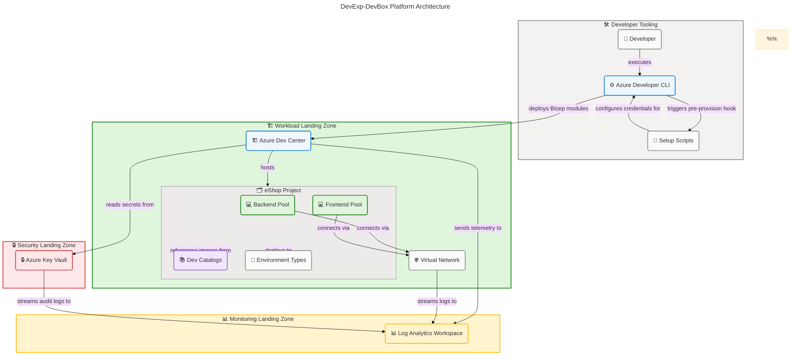

# DevExp-DevBox — Microsoft Dev Box Accelerator

[](./LICENSE)
[](https://learn.microsoft.com/en-us/azure/azure-resource-manager/bicep/)
[](https://learn.microsoft.com/en-us/azure/developer/azure-developer-cli/)
[](https://learn.microsoft.com/en-us/azure/dev-box/)

**DevExp-DevBox** is a production-ready Azure Developer CLI (`azd`) accelerator
that automates the end-to-end provisioning of enterprise-grade Microsoft Dev Box
environments on Azure, driven entirely by YAML configuration files with JSON
Schema validation.

## 📖 Table of Contents

- [Overview](#-overview)
- [Features](#-features)
- [Quick Start](#-quick-start)
- [Requirements](#-requirements)
- [Usage](#-usage)
- [Configuration](#-configuration)
- [Architecture](#-architecture)
- [Contributing](#-contributing)
- [License](#-license)

## 🔭 Overview

DevExp-DevBox is an Azure-native Infrastructure-as-Code (IaC) solution that
provisions and manages Azure Dev Center resources, DevBox pools, project
catalogs, and environment types at scale across an enterprise organization. The
platform is realized entirely as Bicep modules orchestrated by the Azure
Developer CLI and driven by validated YAML configuration files — no manual
portal steps required.

The solution follows
[Azure Landing Zone](https://learn.microsoft.com/en-us/azure/cloud-adoption-framework/ready/landing-zone/)
principles, segmenting resources into three logical domains: **Workload**
(DevCenter and projects), **Security** (Key Vault and secrets), and
**Monitoring** (Log Analytics). A single `azd up` command deploys the complete
stack including a Dev Center, project pools, network connections, role
assignments, Key Vault, and Log Analytics Workspace.

> [!NOTE]  
> This accelerator targets the **Contoso Developer Experience (DevExP)**
> platform and is designed to be cloned, configured via YAML, and deployed with
> zero Bicep modification for standard onboarding scenarios.

## ✨ Features

**Overview**

DevExp-DevBox delivers a complete, self-service developer workstation platform
for enterprise engineering teams. By encoding all configuration as YAML under
`infra/settings/`, the platform enables repeatable, version-controlled, and
auditable environment provisioning that enforces organizational governance from
day one.

> [!TIP]  
> All platform behaviour — Dev Center identity, project pools, network topology,
> RBAC assignments, Key Vault settings, and resource group organization — is
> controlled exclusively through YAML files. No Bicep editing is required for
> standard deployments.

| 🏷️ Feature                       | 📝 Description                                                                                                                | ⚡ Status |
| -------------------------------- | ----------------------------------------------------------------------------------------------------------------------------- | --------- |
| 🚀 Single-Command Deployment     | Complete platform stack deployed with one `azd up` command                                                                    | ✅ Stable |
| 📋 Configuration-as-Code         | All platform settings managed via YAML under `infra/settings/` with JSON Schema validation                                    | ✅ Stable |
| 🏗️ Azure Dev Center Provisioning | Deploys an Azure Dev Center with system-assigned managed identity, catalog item sync, and Azure Monitor agent                 | ✅ Stable |
| 💻 Role-Specific Dev Box Pools   | Configurable pools with role-targeted VM SKUs (e.g., `general_i_32c128gb512ssd_v2` for backend engineers)                     | ✅ Stable |
| 🔄 Multi-Environment Types       | Supports `dev`, `staging`, and `UAT` environment types per project                                                            | ✅ Stable |
| 🔒 Azure Key Vault Integration   | Centralized secrets management with RBAC authorization, purge protection, and soft-delete                                     | ✅ Stable |
| 📊 Centralized Observability     | Log Analytics Workspace with diagnostic settings on all resources for unified telemetry                                       | ✅ Stable |
| 🌐 Virtual Network Support       | Configurable VNet with subnet definitions for Dev Box network connectivity                                                    | ✅ Stable |
| 🔑 Least-Privilege RBAC          | Managed identity with scoped role assignments (Contributor, User Access Administrator, Key Vault roles)                       | ✅ Stable |
| 🐙 GitHub & Azure DevOps Support | Pre-provision hooks support both GitHub and Azure DevOps (`adogit`) source control platforms                                  | ✅ Stable |
| 🖥️ Cross-Platform Scripts        | Setup and cleanup scripts for Linux/macOS (Bash) and Windows (PowerShell)                                                     | ✅ Stable |
| 🏷️ Mandatory Governance Tagging  | Enforces 8-field tag schema (`environment`, `division`, `team`, `project`, `costCenter`, `owner`, `landingZone`, `resources`) | ✅ Stable |

## 🚀 Quick Start

**Overview**

Get the complete DevExp-DevBox platform deployed in under 10 minutes using the
Azure Developer CLI. A `preprovision` hook (`setUp.sh` on Linux/macOS or
`setUp.ps1` on Windows) runs automatically before resource provisioning to
handle source control authentication and environment validation.

> [!WARNING]  
> Ensure you are assigned the **Owner** or **Contributor + User Access
> Administrator** role on the target Azure subscription before deploying. The
> Bicep modules assign RBAC roles at the subscription scope and require these
> permissions.

**Prerequisites:**

- Azure subscription with Owner or Contributor + User Access Administrator role
- Azure CLI and `azd` installed and authenticated
- GitHub CLI (`gh`) authenticated if using `SOURCE_CONTROL_PLATFORM=github`
- `jq` installed (Linux/macOS only)

**1. Clone the repository:**

```bash
git clone https://github.com/Evilazaro/DevExp-DevBox.git
cd DevExp-DevBox
```

**2. Authenticate with Azure and initialize the environment:**

```bash
azd auth login
azd env new dev
```

**3. Set required environment variables:**

```bash
azd env set AZURE_LOCATION eastus2
azd env set SOURCE_CONTROL_PLATFORM github
azd env set KEY_VAULT_SECRET "$(gh auth token)"
```

**4. Deploy the full platform:**

```bash
azd provision -e dev
```

**Expected Output:**

```text
SUCCESS: Your up workflow to provision and deploy to Azure completed in 8 minutes 42 seconds.

Outputs:
- AZURE_DEV_CENTER_NAME: devexp-<unique>
- AZURE_KEY_VAULT_NAME: contoso-<unique>-kv
- AZURE_LOG_ANALYTICS_WORKSPACE_NAME: logAnalytics-<unique>
- WORKLOAD_AZURE_RESOURCE_GROUP_NAME: devexp-workload-ContosoDevExp-eastus2-RG
```

**Tear down and clean up:**

```bash
.\cleanSetUp.ps1 -EnvName "ContosoDevExp" -Location "eastus2"
```

**Expected Output:**

```text
INFO: Removing role assignments...
INFO: Deleting service principal...
INFO: Removing GitHub secrets...
INFO: Deleting resource groups...
SUCCESS: Cleanup completed successfully.
```

## 📋 Requirements

**Overview**

DevExp-DevBox requires a set of command-line tools and Azure permissions to
provision and operate the platform. All tools must be installed and
authenticated before running `azd up`. The setup scripts validate for required
dependencies at runtime and exit with an informative error if any are missing.

> [!IMPORTANT]  
> The deployment assigns Azure RBAC roles at the **subscription scope**. The
> deploying identity must hold the **Owner** role or a combination of
> **Contributor** and **User Access Administrator** on the target subscription.
> Without these permissions, the Bicep deployment will fail during the identity
> module execution.

> [!TIP]  
> Use \zd version\ and \z version\ to verify your installed tool versions match
> the minimum requirements before running \zd up\.

| 🛠️ Requirement         | 📦 Package / Tool          | 🔢 Minimum Version      | 🔗 Install Guide                                                                                           |
| ---------------------- | -------------------------- | ----------------------- | ---------------------------------------------------------------------------------------------------------- |
| ☁️ Azure Subscription  | Microsoft Azure            | Active subscription     | [Create free account](https://azure.microsoft.com/free/)                                                   |
| 🔧 Azure CLI           | `az`                       | 2.65.0+                 | [Install Azure CLI](https://learn.microsoft.com/en-us/cli/azure/install-azure-cli)                         |
| 🚀 Azure Developer CLI | `azd`                      | 1.11.0+                 | [Install azd](https://learn.microsoft.com/en-us/azure/developer/azure-developer-cli/install-azd)           |
| 🐙 GitHub CLI          | `gh`                       | 2.40.0+                 | [Install gh](https://cli.github.com/)                                                                      |
| 🔍 jq                  | `jq`                       | 1.6+                    | [Install jq](https://stedolan.github.io/jq/download/)                                                      |
| 🖥️ PowerShell          | `pwsh`                     | 5.1+ (7.4+ recommended) | [Install PowerShell](https://learn.microsoft.com/en-us/powershell/scripting/install/installing-powershell) |
| 🔑 Azure RBAC          | Owner or Contributor + UAA | N/A                     | [Azure RBAC](https://learn.microsoft.com/en-us/azure/role-based-access-control/overview)                   |

## 💻 Usage

**Overview**

Once deployed, the DevExp-DevBox platform manages the lifecycle of developer
workstations through the Azure Dev Center. Teams interact with Dev Box through
the [Microsoft Dev Box developer portal](https://devbox.microsoft.com), while
platform engineers manage configuration by editing YAML files under
`infra/settings/` and redeploying with `azd up`.

**Check deployment status:**

```bash
azd show
```

**Expected Output:**

```text
Name: ContosoDevExp
Services:
  (no application services — IaC-only project)
Provisioned resources:
  devexp-<unique>       Microsoft.DevCenter/devcenters
  contoso-<unique>-kv   Microsoft.KeyVault/vaults
  logAnalytics-<unique> Microsoft.OperationalInsights/workspaces
  eShop                 Microsoft.DevCenter/projects
```

**Redeploy after configuration changes:**

```bash
azd provision
```

**Access the Dev Box developer portal:**

Navigate to `https://devbox.microsoft.com` and sign in with an account that has
the **Dev Box User** role on the `eShop` project to create and manage Dev Boxes.

**Clean up all provisioned resources:**

```bash
azd down --purge
```

**Expected Output:**

```text
Deleting all resources and deployments associated with applications in Azure (azd down)
  (✓) Done: Deleting resource group: devexp-workload-ContosoDevExp-eastus2-RG

SUCCESS: Your down workflow to delete resources in Azure completed in 2 minutes 30 seconds.
```

## ⚙️ Configuration

**Overview**

All platform behaviour is controlled through three YAML configuration files
under `infra/settings/`. Each file is validated by a co-located JSON Schema at
design time, providing immediate feedback on configuration errors before
deployment. Every feature of the platform — Dev Center provisioning,
role-specific Dev Box pools, environment types, Key Vault security, virtual
networking, RBAC, observability, governance tags, and source control integration
— is driven exclusively through these files and `azd env` variables. No Bicep
modification is needed for standard deployments.

| 📄 File                                                      | 🏷️ Purpose                                                   | 🔧 Key Settings                                                                                            |
| ------------------------------------------------------------ | ------------------------------------------------------------ | ---------------------------------------------------------------------------------------------------------- |
| 📁 `infra/settings/resourceOrganization/azureResources.yaml` | Resource group topology and Azure Landing Zone configuration | `workload.create`, `security.create`, `monitoring.create`, resource group names, governance tags           |
| 🔒 `infra/settings/security/security.yaml`                   | Azure Key Vault configuration                                | `keyVault.name`, `enablePurgeProtection`, `softDeleteRetentionInDays`, `enableRbacAuthorization`           |
| 🏗️ `infra/settings/workload/devcenter.yaml`                  | Dev Center, projects, pools, catalogs, and environment types | `name`, `projects[*].pools`, `projects[*].network`, `projects[*].environmentTypes`, `projects[*].catalogs` |

**Environment variables (set via `azd env set`):**

| 🔑 Variable                  | 📝 Description                                                       | ✅ Required |
| ---------------------------- | -------------------------------------------------------------------- | ----------- |
| 🌍 `AZURE_LOCATION`          | Azure region for deployment (e.g., `eastus2`)                        | ✅ Yes      |
| 📛 `AZURE_ENV_NAME`          | Environment name used in resource naming (2–10 characters)           | ✅ Yes      |
| 🔐 `KEY_VAULT_SECRET`        | GitHub Personal Access Token stored in Key Vault as `gha-token`      | ✅ Yes      |
| 🐙 `SOURCE_CONTROL_PLATFORM` | Source control platform: `github` or `adogit` (defaults to `github`) | ⬜ Optional |

### 🏗️ Dev Center Core Settings

**Feature**: Azure Dev Center Provisioning —
`infra/settings/workload/devcenter.yaml`

Controls the Dev Center name, catalog item sync status, Azure Monitor agent
installation, and the Microsoft-hosted network enablement. The system-assigned
managed identity is declared here and drives all downstream RBAC assignments.

```yaml
name: 'devexp'
catalogItemSyncEnableStatus: 'Enabled'
microsoftHostedNetworkEnableStatus: 'Enabled'
installAzureMonitorAgentEnableStatus: 'Enabled'
identity:
  type: 'SystemAssigned'
```

### 💻 Role-Specific Dev Box Pools

**Feature**: Role-Specific Dev Box Pools —
`infra/settings/workload/devcenter.yaml` → `projects[*].pools`

Each pool targets a specific engineering role with a tailored VM SKU and image
definition. The `eShop` project ships with two built-in pools:

```yaml
pools:
  - name: 'backend-engineer'
    imageDefinitionName: 'eshop-backend-dev'
    vmSku: general_i_32c128gb512ssd_v2 # 32 vCPU · 128 GB RAM · 512 GB SSD
  - name: 'frontend-engineer'
    imageDefinitionName: 'eshop-frontend-dev'
    vmSku: general_i_16c64gb256ssd_v2 # 16 vCPU · 64 GB RAM · 256 GB SSD
```

To add a pool for a new role (e.g., data engineering), append an entry and
redeploy:

```yaml
- name: 'data-engineer'
  imageDefinitionName: 'eshop-data-dev'
  vmSku: general_i_16c64gb256ssd_v2
```

```bash
azd provision
```

### 🔄 Multi-Environment Types

**Feature**: Multi-Environment Types — `infra/settings/workload/devcenter.yaml`
→ `environmentTypes` and `projects[*].environmentTypes`

Defines the available deployment targets at both the Dev Center level (global)
and per-project level. The default configuration ships `dev`, `staging`, and
`UAT`. Set `deploymentTargetId` to a specific Azure subscription resource ID to
route an environment to a different subscription:

```yaml
environmentTypes:
  - name: 'dev'
    deploymentTargetId: '' # deploys to the default subscription
  - name: 'staging'
    deploymentTargetId: ''
  - name: 'uat'
    deploymentTargetId: ''
```

### 🔒 Key Vault Security Settings

**Feature**: Azure Key Vault Integration —
`infra/settings/security/security.yaml`

Configures the Azure Key Vault used to store the source-control authentication
token (`gha-token`). Purge protection, soft-delete retention, and RBAC
authorization mode are all controlled here:

```yaml
keyVault:
  name: contoso
  secretName: gha-token
  enablePurgeProtection: true
  enableSoftDelete: true
  softDeleteRetentionInDays: 7
  enableRbacAuthorization: true
```

### 🌐 Virtual Network Configuration

**Feature**: Virtual Network Support — `infra/settings/workload/devcenter.yaml`
→ `projects[*].network`

Controls Dev Box network isolation per project. Set `create: true` to deploy a
dedicated VNet; Dev Box pools connect automatically through the named subnet:

```yaml
network:
  name: eShop
  create: true
  resourceGroupName: 'eShop-connectivity-RG'
  virtualNetworkType: Managed
  addressPrefixes:
    - 10.0.0.0/16
  subnets:
    - name: eShop-subnet
      properties:
        addressPrefix: 10.0.1.0/24
```

### 🔑 Least-Privilege RBAC

**Feature**: Least-Privilege RBAC — `infra/settings/workload/devcenter.yaml` →
`identity.roleAssignments`

Defines subscription- and resource-group-scoped role assignments granted to the
Dev Center managed identity. The built-in set follows least-privilege
principles:

| 🏷️ Role                      | 🔍 Scope      | 📝 Purpose                                   |
| ---------------------------- | ------------- | -------------------------------------------- |
| 🔧 Contributor               | Subscription  | Manage Dev Center and project resources      |
| 🔑 User Access Administrator | Subscription  | Assign Dev Box User roles to project members |
| 🔒 Key Vault Secrets User    | ResourceGroup | Read the `gha-token` secret at runtime       |
| 🔐 Key Vault Secrets Officer | ResourceGroup | Write secrets during provisioning            |

To add a role assignment, extend the `roleAssignments.devCenter` array in
`devcenter.yaml` and redeploy with `azd provision`.

### 📊 Centralized Observability

**Feature**: Centralized Observability —
`infra/settings/resourceOrganization/azureResources.yaml` → `monitoring.create`

A Log Analytics Workspace is always provisioned alongside the platform. By
default (`monitoring.create: false`) it co-locates in the Workload resource
group. Set `create: true` to isolate it in a dedicated Monitoring resource
group:

```yaml
monitoring:
  create: false # false = share the Workload resource group
  name: devexp-workload
```

### 🏷️ Mandatory Governance Tags

**Feature**: Mandatory Governance Tagging — `tags` blocks in all three YAML
files

Every Azure resource is tagged with an 8-field governance schema. Customize the
values in each file's `tags` block to match your organization:

```yaml
tags:
  environment: dev
  division: Platforms
  team: DevExP
  project: Contoso-DevExp-DevBox
  costCenter: IT
  owner: Contoso
  landingZone: Workload
  resources: ResourceGroup
```

### 🗂️ Resource Group Organization

**Feature**: Configuration-as-Code —
`infra/settings/resourceOrganization/azureResources.yaml`

Controls whether Security and Monitoring resources land in dedicated resource
groups or share the Workload resource group. The default ships all three domains
in a single resource group for simplicity:

```yaml
workload:
  create: true
  name: devexp-workload
security:
  create: false # co-locate with workload RG
monitoring:
  create: false # co-locate with workload RG
```

### 🐙 Source Control Platform

**Feature**: GitHub & Azure DevOps Support — `SOURCE_CONTROL_PLATFORM`
environment variable

Controls which platform the `preprovision` hook (`setUp.sh` / `setUp.ps1`)
authenticates against before deployment. Defaults to `github` if not set:

```bash
# GitHub (default)
azd env set SOURCE_CONTROL_PLATFORM github

# Azure DevOps
azd env set SOURCE_CONTROL_PLATFORM adogit
```

Then run `azd provision` to apply the setting in the next deployment cycle.

## 🏗️ Architecture

**Overview**

DevExp-DevBox implements a zero-server, fully managed architecture across three
Azure Landing Zone domains: Workload (Dev Center and projects), Security (Key
Vault), and Monitoring (Log Analytics). All provisioning is declarative — Bicep
modules at `infra/main.bicep` orchestrate the Security, Monitoring, and Workload
modules, with the Workload module further composing DevCenter core and project
sub-modules driven by `devcenter.yaml`.


```mermaid
---
title: "DevExp-DevBox Platform Architecture"
config:
  theme: base
  look: classic
  layout: dagre
  themeVariables:
    fontSize: '16px'
  flowchart:
    htmlLabels: true
---
flowchart TB
    accTitle: DevExp-DevBox Platform Architecture
    accDescr: Shows the DevExp-DevBox platform spanning Developer Tooling, Workload, Security, and Monitoring Landing Zones with azd CLI orchestrating Bicep module deployments to Azure Dev Center, Key Vault, and Log Analytics Workspace. Developer=neutral, AzdCli=core, SetupScripts=neutral, DevCenter=core, VNet=neutral, BackendPool=success, FrontendPool=success, Catalogs=data, EnvTypes=neutral, KeyVault=danger, LogAnalytics=warning. devtools=neutral surface, workload=success zone, security=danger zone, monitoring=warning zone, eshopProject=Level2 neutral. WCAG AA compliant.

    %%
    %% AZURE / FLUENT ARCHITECTURE PATTERN v2.0
    %% (Semantic + Structural + Font + Accessibility Governance)
    %%
    %% PHASE 1 - FLUENT UI: All styling uses approved Fluent UI palette only
    %% PHASE 2 - GROUPS: Every subgraph has semantic color via style directive
    %% PHASE 3 - COMPONENTS: Every node has semantic classDef + icon prefix
    %% PHASE 4 - ACCESSIBILITY: accTitle/accDescr present, WCAG AA contrast
    %% PHASE 5 - STANDARD: Governance block present, classDefs centralized
    %%

    subgraph devtools ["🛠️ Developer Tooling"]
        Dev("👤 Developer"):::neutral
        AzdCli("⚙️ Azure Developer CLI"):::core
        SetupScripts("📜 Setup Scripts"):::neutral
    end

    subgraph workload ["🏗️ Workload Landing Zone"]
        DevCenter("🏗️ Azure Dev Center"):::core
        VNet("🌐 Virtual Network"):::neutral

        subgraph eshopProject ["🗂️ eShop Project"]
            BackendPool("💻 Backend Pool"):::success
            FrontendPool("💻 Frontend Pool"):::success
            Catalogs("📚 Dev Catalogs"):::data
            EnvTypes("🔄 Environment Types"):::neutral
        end
    end

    subgraph security ["🔒 Security Landing Zone"]
        KeyVault("🔒 Azure Key Vault"):::danger
    end

    subgraph monitoring ["📊 Monitoring Landing Zone"]
        LogAnalytics("📊 Log Analytics Workspace"):::warning
    end

    Dev -->|"executes"| AzdCli
    AzdCli -->|"triggers pre-provision hook"| SetupScripts
    AzdCli -->|"deploys Bicep modules"| DevCenter
    SetupScripts -->|"configures credentials for"| AzdCli
    DevCenter -->|"hosts"| eshopProject
    BackendPool -->|"connects via"| VNet
    FrontendPool -->|"connects via"| VNet
    eshopProject -->|"references images from"| Catalogs
    eshopProject -->|"deploys to"| EnvTypes
    DevCenter -->|"reads secrets from"| KeyVault
    DevCenter -->|"sends telemetry to"| LogAnalytics
    VNet -->|"streams logs to"| LogAnalytics
    KeyVault -->|"streams audit logs to"| LogAnalytics

    style devtools fill:#F3F2F1,stroke:#8A8886,stroke-width:2px,color:#323130
    style workload fill:#DFF6DD,stroke:#107C10,stroke-width:2px,color:#323130
    style eshopProject fill:#EDEBE9,stroke:#8A8886,stroke-width:1px,color:#323130
    style security fill:#FDE7E9,stroke:#D13438,stroke-width:2px,color:#323130
    style monitoring fill:#FFF4CE,stroke:#FFB900,stroke-width:2px,color:#323130

    classDef neutral fill:#FAFAFA,stroke:#8A8886,stroke-width:2px,color:#323130
    classDef core fill:#EFF6FC,stroke:#0078D4,stroke-width:2px,color:#323130
    classDef success fill:#DFF6DD,stroke:#107C10,stroke-width:2px,color:#323130
    classDef warning fill:#FFF4CE,stroke:#FFB900,stroke-width:2px,color:#323130
    classDef danger fill:#FDE7E9,stroke:#D13438,stroke-width:2px,color:#323130
    classDef data fill:#F0E6FF,stroke:#8764B8,stroke-width:2px,color:#323130
```

**Component Roles:**

| 🏷️ Component               | 📝 Role                                                                                      | 🔗 Source                                   |
| -------------------------- | -------------------------------------------------------------------------------------------- | ------------------------------------------- |
| ⚙️ Azure Developer CLI     | Orchestrates deployment lifecycle via pre-provision hooks and Bicep execution                | `azure.yaml`                                |
| 📜 Setup Scripts           | Authenticates source control platform (GitHub/Azure DevOps) and configures `azd` environment | `setUp.sh`, `setUp.ps1`                     |
| 🏗️ Azure Dev Center        | Central platform resource managing developer workstations, catalogs, and environment types   | `src/workload/core/devCenter.bicep`         |
| 🗂️ eShop Project           | Scoped DevCenter project hosting role-specific Dev Box pools and environment definitions     | `infra/settings/workload/devcenter.yaml`    |
| 💻 Dev Box Pools           | Role-targeted compute pools (backend: 32 vCPU/128 GB; frontend: 16 vCPU/64 GB)               | `infra/settings/workload/devcenter.yaml`    |
| 📚 Dev Catalogs            | GitHub-hosted repositories with image definitions and environment configurations             | `src/workload/project/projectCatalog.bicep` |
| 🌐 Virtual Network         | Managed or unmanaged VNet for Dev Box network isolation and connectivity                     | `src/connectivity/vnet.bicep`               |
| 🔒 Azure Key Vault         | Stores the GitHub Access Token (`gha-token`) with RBAC authorization and purge protection    | `src/security/keyVault.bicep`               |
| 📊 Log Analytics Workspace | Centralized telemetry sink receiving diagnostic logs from all platform resources             | `src/management/logAnalytics.bicep`         |

## 🤝 Contributing

**Overview**

Contributions to DevExp-DevBox are welcome and encouraged. The platform follows
a configuration-as-code model, so most improvements involve editing YAML under
`infra/settings/`, updating Bicep modules, or enhancing setup scripts. All
changes should be tested in an isolated `azd` environment before submitting a
pull request.

**Getting started with development:**

```bash
# Fork and clone the repository
git clone https://github.com/your-github-username/DevExp-DevBox.git
cd DevExp-DevBox

# Create a feature branch
git checkout -b feature/my-improvement

# Deploy to your own test environment
azd env new MyTestEnv
azd env set AZURE_LOCATION eastus2
azd env set KEY_VAULT_SECRET "$(gh auth token)"
azd up
```

> [!IMPORTANT]  
> Always validate JSON Schema compliance for YAML configuration changes. Each
> \infra/settings/\ directory contains a \.schema.json\ file that can be used
> with any JSON Schema validator to verify your configuration before deployment.

**Contribution guidelines:**

- Open an issue to discuss proposed changes before submitting a pull request
- Follow the existing Bicep module structure: one resource domain per module,
  typed parameters, documented outputs
- Ensure all YAML changes pass JSON Schema validation against co-located
  `.schema.json` files
- Add meaningful resource tags following the 8-field governance tag schema
- Test with both `SOURCE_CONTROL_PLATFORM=github` and
  `SOURCE_CONTROL_PLATFORM=adogit`

## 📄 License

This project is licensed under the **MIT License**. See [LICENSE](./LICENSE) for
full terms.

Copyright © 2025 Evilázaro Alves
