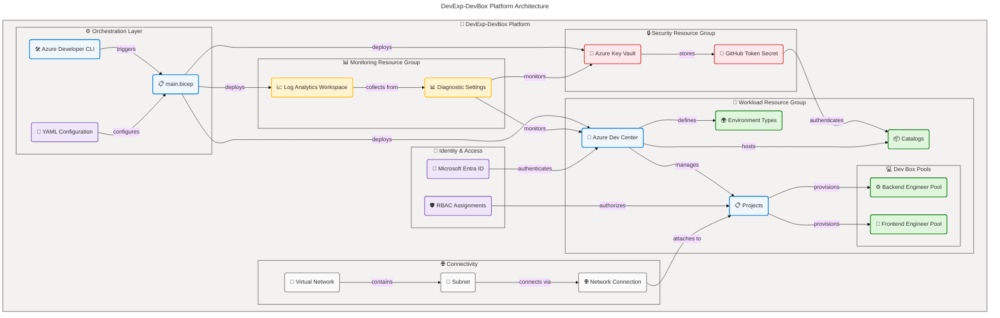

# DevExp-DevBox — Azure Dev Box Adoption & Deployment Accelerator


**Overview**

> [!NOTE] This accelerator provisions a production-ready Azure Dev Box
> environment using Azure Developer CLI (`azd provision`). It is a pure
> Infrastructure as Code accelerator — no application code is deployed. It
> follows the Microsoft Cloud Adoption Framework and Azure Landing Zone
> principles for enterprise-grade developer workstation management.

DevExp-DevBox solves the challenge of provisioning and managing centralized,
secure, cloud-hosted developer workstations across engineering teams. Platform
engineers, DevOps leads, and IT administrators use this accelerator to deliver
role-specific Dev Box environments — with consistent tooling, network isolation,
and identity governance — without months of manual configuration. It supports
both **GitHub** and **Azure DevOps Git** as source control platforms for private
catalog authentication.

The accelerator orchestrates Azure Dev Center, Dev Box pools, Key Vault, Log
Analytics, and Virtual Network resources through modular Bicep templates driven
entirely by YAML configuration files. Each team and project receives
pre-configured Dev Box pools tailored to their role (backend, frontend), with
Microsoft Entra ID integration for identity, RBAC for access control, and
centralized monitoring for operational visibility.

## 📑 Table of Contents

- [Architecture](#-architecture)
- [Features](#-features)
- [Prerequisites](#-prerequisites)
- [Getting Started](#-getting-started)
- [Usage](#-usage)
- [Configuration](#-configuration)
- [Contributing](#-contributing)
- [License](#-license)

## 🏗️ Architecture

**Overview**

This architecture follows Azure Landing Zone principles to segregate resources
by function — security, monitoring, and workload — into dedicated resource
groups. The design enables teams to manage Dev Box environments independently
while maintaining centralized governance, audit trails, and network controls.

Components are organized in a layered, modular pattern: the orchestration layer
(`infra/main.bicep`) coordinates subscription-scoped deployments across three
resource groups, while individual Bicep modules under `src/` handle each domain
— identity, connectivity, security, monitoring, and workload. Configuration is
externalized into validated YAML files, enabling environment customization
without code changes.


```mermaid
---
title: "DevExp-DevBox Platform Architecture"
config:
  theme: base
  look: classic
  layout: dagre
  themeVariables:
    fontSize: '16px'
  flowchart:
    htmlLabels: true
    curve: cardinal
---
flowchart TB
    accTitle: DevExp-DevBox Platform Architecture
    accDescr: Azure Dev Box accelerator components organized by Landing Zone resource groups with relationships and data flows

    %% ═══════════════════════════════════════════════════════════════════════════
    %% AZURE / FLUENT ARCHITECTURE PATTERN v1.1
    %% (Semantic + Structural + Font + Accessibility Governance)
    %% ═══════════════════════════════════════════════════════════════════════════
    %% PHASE 1 - FLUENT UI: All styling uses approved Fluent UI palette only
    %% PHASE 2 - GROUPS: Every subgraph has semantic color via style directive
    %% PHASE 3 - COMPONENTS: Every node has semantic classDef + icon prefix
    %% PHASE 4 - ACCESSIBILITY: accTitle/accDescr present, WCAG AA contrast
    %% PHASE 5 - STANDARD: Governance block present, classDefs centralized
    %% ═══════════════════════════════════════════════════════════════════════════

    subgraph platform["🏢 DevExp-DevBox Platform"]

        subgraph orchestration["⚙️ Orchestration Layer"]
            AZD("🛠️ Azure Developer CLI"):::core
            MAIN("📋 main.bicep"):::core
            YAML("📁 YAML Configuration"):::data
        end

        subgraph securityRG["🔒 Security Resource Group"]
            KV("🔐 Azure Key Vault"):::danger
            SECRET("🔑 GitHub Token Secret"):::danger
        end

        subgraph monitoringRG["📊 Monitoring Resource Group"]
            LOG("📈 Log Analytics Workspace"):::warning
            DIAG("📊 Diagnostic Settings"):::warning
        end

        subgraph workloadRG["🚀 Workload Resource Group"]
            DC("🏢 Azure Dev Center"):::core
            CAT("📦 Catalogs"):::success
            ENV("🌍 Environment Types"):::success
            PROJ("📋 Projects"):::core

            subgraph devboxes["💻 Dev Box Pools"]
                BACKEND("⚙️ Backend Engineer Pool"):::success
                FRONTEND("🎨 Frontend Engineer Pool"):::success
            end
        end

        subgraph identityLayer["🔑 Identity & Access"]
            ENTRA("👤 Microsoft Entra ID"):::data
            RBAC("🛡️ RBAC Assignments"):::data
        end

        subgraph connectivityLayer["🌐 Connectivity"]
            VNET("🔗 Virtual Network"):::neutral
            SUBNET("📡 Subnet"):::neutral
            NC("🌐 Network Connection"):::neutral
        end

    end

    AZD -->|"triggers"| MAIN
    YAML -->|"configures"| MAIN
    MAIN -->|"deploys"| KV
    MAIN -->|"deploys"| LOG
    MAIN -->|"deploys"| DC
    KV -->|"stores"| SECRET
    SECRET -->|"authenticates"| CAT
    LOG -->|"collects from"| DIAG
    DIAG -->|"monitors"| DC
    DIAG -->|"monitors"| KV
    DC -->|"hosts"| CAT
    DC -->|"defines"| ENV
    DC -->|"manages"| PROJ
    PROJ -->|"provisions"| BACKEND
    PROJ -->|"provisions"| FRONTEND
    ENTRA -->|"authenticates"| DC
    RBAC -->|"authorizes"| PROJ
    VNET -->|"contains"| SUBNET
    SUBNET -->|"connects via"| NC
    NC -->|"attaches to"| PROJ

    classDef neutral  fill:#FAFAFA,stroke:#8A8886,stroke-width:2px,color:#323130
    classDef core     fill:#EFF6FC,stroke:#0078D4,stroke-width:2px,color:#323130
    classDef success  fill:#DFF6DD,stroke:#107C10,stroke-width:2px,color:#323130
    classDef warning  fill:#FFF4CE,stroke:#FFB900,stroke-width:2px,color:#323130
    classDef danger   fill:#FDE7E9,stroke:#D13438,stroke-width:2px,color:#323130
    classDef data     fill:#F0E6FA,stroke:#8764B8,stroke-width:2px,color:#323130

    style platform fill:#F3F2F1,stroke:#8A8886,stroke-width:2px,color:#323130
    style orchestration fill:#F3F2F1,stroke:#8A8886,stroke-width:2px,color:#323130
    style securityRG fill:#F3F2F1,stroke:#8A8886,stroke-width:2px,color:#323130
    style monitoringRG fill:#F3F2F1,stroke:#8A8886,stroke-width:2px,color:#323130
    style workloadRG fill:#F3F2F1,stroke:#8A8886,stroke-width:2px,color:#323130
    style devboxes fill:#F3F2F1,stroke:#8A8886,stroke-width:2px,color:#323130
    style identityLayer fill:#F3F2F1,stroke:#8A8886,stroke-width:2px,color:#323130
    style connectivityLayer fill:#F3F2F1,stroke:#8A8886,stroke-width:2px,color:#323130
```

**Component Responsibilities**

| Component                  | Purpose                                                     | Azure Service                              |
| -------------------------- | ----------------------------------------------------------- | ------------------------------------------ |
| 🛠️ **Azure Developer CLI** | Orchestrates end-to-end provisioning via `azd provision`    | Azure Developer CLI                        |
| 🔐 **Key Vault**           | Stores GitHub PAT for private catalog authentication        | `Microsoft.KeyVault/vaults`                |
| 📈 **Log Analytics**       | Centralized monitoring, diagnostics, and audit logging      | `Microsoft.OperationalInsights/workspaces` |
| 🏢 **Dev Center**          | Manages Dev Box definitions, catalogs, and projects         | `Microsoft.DevCenter/devcenters`           |
| 📋 **Projects**            | Team-scoped Dev Box pools with role-specific configurations | `Microsoft.DevCenter/projects`             |
| 💻 **Dev Box Pools**       | Pre-configured virtual workstations by engineering role     | `Microsoft.DevCenter/projects/pools`       |
| 🔑 **Entra ID + RBAC**     | Identity governance and least-privilege access control      | Microsoft Entra ID                         |
| 🌐 **Virtual Network**     | Network isolation with managed or custom VNet support       | `Microsoft.Network/virtualNetworks`        |

## ✨ Features

**Overview**

This accelerator provides a comprehensive set of capabilities designed to reduce
the time from zero to a fully governed Dev Box platform from weeks to minutes.
Features are organized around five pillars: infrastructure automation, security,
monitoring, identity governance, and developer experience.

Each feature integrates with the others through the modular Bicep architecture
and YAML-driven configuration. For example, enabling a new project automatically
provisions its Dev Box pools, network connections, RBAC assignments, and
diagnostic settings — all from a single YAML entry.

| Feature                            | Description                                                                                                                                       | Benefits                                                                |
| ---------------------------------- | ------------------------------------------------------------------------------------------------------------------------------------------------- | ----------------------------------------------------------------------- |
| ⚡ **One-Command Provisioning**    | Provisions the entire Dev Box platform with `azd provision`, including resource groups, Key Vault, Log Analytics, Dev Center, projects, and pools | Eliminates manual resource creation and reduces deployment errors       |
| 📁 **YAML-Driven Configuration**   | All resources configured via validated YAML files with JSON Schema support (`devcenter.yaml`, `security.yaml`, `azureResources.yaml`)             | Enables environment customization without modifying Bicep code          |
| 🔒 **Enterprise Security**         | Key Vault with RBAC authorization, purge protection, soft delete, and secure GitHub token storage for private catalog access                      | Meets compliance requirements with zero hard-coded secrets              |
| 📊 **Centralized Monitoring**      | Log Analytics workspace with diagnostic settings on Key Vault and Dev Center, activity logs, and all-metrics collection                           | Provides operational visibility and audit trails across all resources   |
| 🔑 **Identity Governance**         | Microsoft Entra ID integration with system-assigned managed identities, Azure AD group-based RBAC, and least-privilege role assignments           | Enforces zero-trust principles with automated access control            |
| 🌐 **Network Isolation**           | Managed or unmanaged Virtual Network support per project with configurable subnets and Azure AD-joined network connections                        | Ensures secure, isolated network environments for each team             |
| 🏢 **Multi-Project Support**       | Deploy multiple projects within a single Dev Center, each with independent pools, catalogs, environment types, and RBAC                           | Scales to support multiple teams with distinct configurations           |
| 💻 **Role-Specific Dev Boxes**     | Pre-configured Dev Box pools per engineering role (backend, frontend) with tailored VM SKUs, images, and tooling                                  | Developers receive workstations optimized for their responsibilities    |
| 📦 **Catalog Integration**         | DevCenter-level and project-level catalogs from GitHub or Azure DevOps Git repositories with scheduled sync                                       | Centralizes image definitions and environment templates as code         |
| 🌍 **Multi-Environment Lifecycle** | Environment types for dev, staging, and UAT with configurable deployment targets per project                                                      | Supports the full software development lifecycle from a single platform |

## 📋 Prerequisites

**Overview**

Before deploying the accelerator, you need an Azure subscription with sufficient
permissions, several CLI tools installed locally, and a GitHub personal access
token if using private catalogs. These requirements ensure the setup scripts can
authenticate, provision resources, and configure identity assignments.

Meeting all prerequisites takes approximately 15 minutes for a fresh
workstation. The setup scripts validate tool availability automatically and
provide clear error messages if any dependency is missing.

> [!IMPORTANT] You must have **Owner** or **Contributor + User Access
> Administrator** permissions on your Azure subscription. The deployment creates
> subscription-scoped role assignments that require elevated privileges.

| Requirement                | Minimum Version     | Purpose                                                      | More Information                                                                                                                    |
| -------------------------- | ------------------- | ------------------------------------------------------------ | ----------------------------------------------------------------------------------------------------------------------------------- |
| ☁️ **Azure Subscription**  | Active subscription | Target for all resource deployments                          | [Create a free account](https://azure.microsoft.com/free/)                                                                          |
| 🛠️ **Azure CLI**           | 2.60+               | Azure authentication and resource management                 | [Install Azure CLI](https://learn.microsoft.com/cli/azure/install-azure-cli)                                                        |
| 🛠️ **Azure Developer CLI** | 1.9+                | Orchestrates infrastructure provisioning via `azd provision` | [Install azd](https://learn.microsoft.com/azure/developer/azure-developer-cli/install-azd)                                          |
| 🛠️ **GitHub CLI**          | 2.40+               | Required when using GitHub as source control platform        | [Install GitHub CLI](https://cli.github.com/)                                                                                       |
| ⚙️ **PowerShell**          | 5.1+                | Required by `azd` preprovision hook on Windows               | [Install PowerShell](https://learn.microsoft.com/powershell/scripting/install/installing-powershell)                                |
| ⚙️ **Bash**                | 5.0+                | Required by `azd` preprovision hook (`setUp.sh`)             | Pre-installed on most Unix systems                                                                                                  |
| �️ **jq**                   | 1.6+                | JSON processor required by setup scripts                     | [Install jq](https://jqlang.github.io/jq/download/)                                                                                 |
| 🔐 **GitHub PAT**          | —                   | Authentication for private catalog repos (GitHub)            | [Create a PAT](https://docs.github.com/en/authentication/keeping-your-account-and-data-secure/managing-your-personal-access-tokens) |
| 🔐 **Azure DevOps PAT**    | —                   | Authentication for private catalog repos (Azure DevOps)      | [Create a PAT](https://learn.microsoft.com/azure/devops/organizations/accounts/use-personal-access-tokens-to-authenticate)          |

## 🚀 Getting Started

**Overview**

This is an **Infrastructure as Code accelerator** — it provisions Azure
resources, not application code. The entire platform deploys with a single
command: `azd provision`. The Azure Developer CLI orchestrates authentication
validation, environment setup, source control token configuration, and Bicep
provisioning through a `preprovision` hook.

The accelerator supports **two source control platforms**: GitHub and Azure
DevOps Git. The choice determines how private catalog authentication is handled
(GitHub PAT or Azure DevOps PAT stored in Key Vault).

The deployment is fully idempotent — running `azd provision` again updates
existing resources without duplication.

### How It Works

When you run `azd provision`, the following happens automatically:

1. **Preprovision hook** executes the setup script (`setUp.sh`), which:
   - Validates that all required CLI tools are installed (`az`, `azd`, `jq`, and
     `gh` for GitHub or Azure DevOps CLI for `adogit`)
   - Verifies Azure CLI and source control platform authentication
   - Prompts for the source control platform if `SOURCE_CONTROL_PLATFORM` is not
     set (options: `github` or `adogit`)
   - Securely retrieves the PAT from `gh auth token` (GitHub) or prompts for the
     Azure DevOps PAT, then stores it as `KEY_VAULT_SECRET` in the `azd`
     environment
   - Creates or reuses the `azd` environment directory (`.azure/<env>/`)
2. **Bicep provisioning** deploys all infrastructure at subscription scope:
   - Three resource groups (workload, security, monitoring) per Landing Zone
     principles
   - Key Vault with the source control PAT
   - Log Analytics workspace with diagnostic settings
   - Dev Center with catalogs, environment types, and projects
   - Per-project Dev Box pools, network connections, and RBAC assignments

### Provision (GitHub)

**Step 1 — Clone the repository**

```bash
git clone https://github.com/Evilazaro/DevExp-DevBox.git
cd DevExp-DevBox
```

**Step 2 — Authenticate**

```bash
az login
azd auth login
gh auth login
```

**Step 3 — Provision infrastructure**

```bash
azd provision
```

`azd` prompts for environment name, Azure subscription, and location if not
already configured. The `preprovision` hook runs the setup script automatically
before Bicep provisioning begins.

**Expected output:**

```text
Running preprovision hook → setUp.sh
  ✅ All required tools found (az, azd, jq, gh)
  ✅ Azure authentication verified
  ✅ GitHub authentication verified
  🔐 GitHub token stored securely in memory
  ✅ Azure Developer CLI environment initialized

Provisioning Azure resources (azd provision)

SUCCESS: Your Azure resources have been provisioned.
  Resource Group: devexp-workload-dev-eastus2-RG
  Resource Group: devexp-security-dev-eastus2-RG
  Resource Group: devexp-monitoring-dev-eastus2-RG
  Dev Center:     devexp-devcenter
  Key Vault:      contoso-xxxxxxxx-kv
```

### Provision (Azure DevOps Git)

**Step 1 — Clone and authenticate**

```bash
git clone https://github.com/Evilazaro/DevExp-DevBox.git
cd DevExp-DevBox
az login
azd auth login
```

**Step 2 — Set source control platform and provision**

```bash
export SOURCE_CONTROL_PLATFORM=adogit
azd provision
```

The setup script prompts for your Azure DevOps PAT if the `KEY_VAULT_SECRET`
environment variable is not already set.

### Platform-Specific Configuration

| Platform           | azd Config       | Hook Shell      | Script Invoked          |
| ------------------ | ---------------- | --------------- | ----------------------- |
| 🖥️ **Windows**     | `azure-pwh.yaml` | PowerShell 5.1+ | `setUp.sh` (via `bash`) |
| 🐧 **Linux/macOS** | `azure.yaml`     | Bash 5.0+       | `setUp.sh`              |

> [!NOTE] On Windows, the `azure-pwh.yaml` preprovision hook uses PowerShell to
> invoke `setUp.sh` through `bash`. Ensure Windows Subsystem for Linux (WSL) or
> Git Bash is available.

### Verify Provisioning

```bash
az devcenter admin dev-center list \
  --resource-group "devexp-workload-dev-eastus2-RG" \
  --output table
```

**Expected output:**

```text
Name               Location    ProvisioningState
-----------------  ----------  -------------------
devexp-devcenter   eastus2     Succeeded
```

## 💻 Usage

**Overview**

After provisioning, platform engineers manage the Dev Box environment by editing
the YAML configuration files and rerunning `azd provision`. The deployment is
idempotent — every `azd provision` run converges the infrastructure to match the
current YAML state, adding new resources, updating changed ones, and leaving
untouched resources alone. Developers access their Dev Boxes through the
Microsoft Dev Box developer portal or the Windows App.

All day-2 operations follow the same workflow: **edit YAML → run
`azd provision`**. There are no separate commands for adding projects, pools,
catalogs, or environment types.

### Onboarding a New Project

Add a project entry to `infra/settings/workload/devcenter.yaml` under the
`projects:` array (see [Adding a New Project](#adding-a-new-project) for the
full YAML template), then run:

```bash
azd provision
```

This single command provisions all resources for the new project: Dev Center
project, network connection, RBAC role assignments (project identity + Entra ID
group), catalogs, environment types, and Dev Box pools.

### Adding a Dev Box Pool

Add a pool entry to a project's `pools:` array in `devcenter.yaml`:

```yaml
pools:
  - name: 'data-engineer'
    imageDefinitionName: 'project-data-engineer'
    vmSku: general_i_32c128gb512ssd_v2
```

Each pool references an `imageDefinitionName` from a project catalog of type
`imageDefinition`. The accelerator creates the pool with Windows Client
licensing, local administrator access enabled, and single sign-on enabled. Then
run `azd provision` to apply.

### Adding a Catalog

**Dev Center-level catalog** — add to the top-level `catalogs:` array:

```yaml
catalogs:
  - name: 'customTasks'
    type: gitHub # or adoGit
    visibility: public # or private (requires Key Vault secret)
    uri: 'https://github.com/microsoft/devcenter-catalog.git'
    branch: 'main'
    path: './Tasks'
```

Dev Center catalogs sync on a scheduled basis. Private catalogs authenticate
using the source control PAT stored in Key Vault.

**Project-level catalog** — add to a project's `catalogs:` array:

```yaml
catalogs:
  - name: 'devboxImages'
    type: imageDefinition # or environmentDefinition
    sourceControl: gitHub # or adoGit
    visibility: private
    uri: 'https://github.com/org/repo.git'
    branch: 'main'
    path: '/.devcenter/imageDefinitions'
```

Project catalogs have a `type` field (`imageDefinition` or
`environmentDefinition`) and a `sourceControl` field instead of `type` for the
repository kind. Image definition catalogs drive Dev Box pool creation.
Environment definition catalogs provide deployment environment templates.

Run `azd provision` after any catalog change.

### Managing Environment Types

**Dev Center-level environment types** define the available lifecycle stages.
Add to the top-level `environmentTypes:` array:

```yaml
environmentTypes:
  - name: 'prod'
    deploymentTargetId: ''
```

**Project-level environment types** control which Dev Center environment types
are available to a specific project. Add to a project's `environmentTypes:`
array:

```yaml
environmentTypes:
  - name: 'prod'
    deploymentTargetId: '/subscriptions/<target-subscription-id>'
```

Leave `deploymentTargetId` empty to use the current subscription. Each project
environment type gets a system-assigned managed identity and grants Contributor
to environment creators automatically.

Run `azd provision` after any environment type change.

### Modifying Network Configuration

Each project's `network:` block controls how Dev Boxes connect to the network:

| `virtualNetworkType` | `create` | Behavior                                                                                                                                                          |
| -------------------- | -------- | ----------------------------------------------------------------------------------------------------------------------------------------------------------------- |
| `Managed`            | any      | Uses Microsoft-hosted networking. No VNet, subnet, or network connection is created. The Dev Center `microsoftHostedNetworkEnableStatus` must be `Enabled`.       |
| `Unmanaged`          | `true`   | Creates a new VNet, subnet, and network connection in the specified `resourceGroupName`. Attaches the network to the Dev Center.                                  |
| `Unmanaged`          | `false`  | References an existing VNet by `name` in the specified `resourceGroupName`. Creates a network connection from its first subnet and attaches it to the Dev Center. |

To switch a project from managed to unmanaged networking:

```yaml
network:
  name: myProject
  create: true
  resourceGroupName: 'myProject-connectivity-RG'
  virtualNetworkType: Unmanaged
  addressPrefixes:
    - 10.2.0.0/16
  subnets:
    - name: myProject-subnet
      properties:
        addressPrefix: 10.2.1.0/24
  tags:
    environment: dev
```

Run `azd provision` to apply.

### Updating Identity & RBAC

**Dev Center identity** — the Dev Center uses a SystemAssigned managed identity
with role assignments at two scopes:

- `Subscription` — Contributor and User Access Administrator
- `ResourceGroup` — Key Vault Secrets User and Key Vault Secrets Officer (scoped
  to the security resource group)

**Organizational roles** — map Entra ID groups to RBAC roles at the resource
group scope. Edit `identity.roleAssignments.orgRoleTypes` in `devcenter.yaml`:

```yaml
orgRoleTypes:
  - type: DevManager
    azureADGroupId: '<entra-group-id>'
    azureADGroupName: 'Platform Engineering Team'
    azureRBACRoles:
      - name: 'DevCenter Project Admin'
        id: '331c37c6-af14-46d9-b9f4-e1909e1b95a0'
        scope: ResourceGroup
```

**Project identity** — each project gets a SystemAssigned managed identity. Its
role assignments are applied from the project's `identity.roleAssignments`
array. Roles use a `scope` field that controls where the assignment is created:

| Scope           | Applied to                                          |
| --------------- | --------------------------------------------------- |
| `Project`       | Scoped to the Dev Center project resource itself    |
| `ResourceGroup` | Scoped to the workload and security resource groups |

Both the project's managed identity and the specified Entra ID group receive the
same role assignments. Run `azd provision` after changes.

### Monitoring & Diagnostics

The accelerator automatically configures Log Analytics diagnostic settings on:

| Resource         | Logs            | Metrics     |
| ---------------- | --------------- | ----------- |
| Dev Center       | All logs        | All metrics |
| Key Vault        | All logs        | All metrics |
| Virtual Networks | All logs        | All metrics |
| Log Analytics    | All logs (self) | All metrics |

Additionally, an **AzureActivity** solution is deployed on the Log Analytics
workspace for subscription-level activity log collection.

View collected diagnostics:

```bash
az monitor log-analytics workspace show \
  --resource-group "devexp-monitoring-dev-eastus2-RG" \
  --workspace-name "$(az monitor log-analytics workspace list \
    --resource-group 'devexp-monitoring-dev-eastus2-RG' \
    --query '[0].name' -o tsv)" \
  --output table
```

### Verifying Catalog Sync

Check the sync status of Dev Center catalogs:

```bash
az devcenter admin catalog list \
  --dev-center-name "devexp-devcenter" \
  --resource-group "devexp-workload-dev-eastus2-RG" \
  --output table
```

Check project-level catalogs:

```bash
az devcenter admin catalog list \
  --project-name "eShop" \
  --resource-group "devexp-workload-dev-eastus2-RG" \
  --output table
```

### Managing Projects

List deployed projects in the Dev Center:

```bash
az devcenter admin project list \
  --dev-center-name "devexp-devcenter" \
  --resource-group "devexp-workload-dev-eastus2-RG" \
  --output table
```

### Managing Dev Box Pools

List available Dev Box pools in a project:

```bash
az devcenter admin pool list \
  --project-name "eShop" \
  --resource-group "devexp-workload-dev-eastus2-RG" \
  --output table
```

### Developer Self-Service

Developers connect to their Dev Boxes through the Microsoft Dev Box portal at
`https://devbox.microsoft.com`. Team members assigned to the appropriate Entra
ID group (e.g., "eShop Developers" with the **Dev Box User** role) can:

- **Create** a Dev Box from any pool in their assigned project
- **Start / Stop / Restart** their Dev Box instances
- **Connect** via browser (web client) or the Windows App
- **Delete** Dev Boxes they no longer need

Access is governed by the `identity.roleAssignments` in `devcenter.yaml`. Users
must be members of the Entra ID group specified in the project's configuration
and that group must have the `Dev Box User` role
(`45d50f46-0b78-4001-a660-4198cbe8cd05`).

### Viewing Provisioning Outputs

After `azd provision` completes, view key outputs:

```bash
azd env get-values
```

Key outputs include:

| Output                                 | Description                         |
| -------------------------------------- | ----------------------------------- |
| `AZURE_DEV_CENTER_NAME`                | Name of the deployed Dev Center     |
| `AZURE_DEV_CENTER_PROJECTS`            | Array of deployed project names     |
| `AZURE_KEY_VAULT_NAME`                 | Key Vault resource name             |
| `AZURE_KEY_VAULT_ENDPOINT`             | Key Vault URI                       |
| `AZURE_LOG_ANALYTICS_WORKSPACE_ID`     | Log Analytics workspace resource ID |
| `SECURITY_AZURE_RESOURCE_GROUP_NAME`   | Security resource group name        |
| `MONITORING_AZURE_RESOURCE_GROUP_NAME` | Monitoring resource group name      |
| `WORKLOAD_AZURE_RESOURCE_GROUP_NAME`   | Workload resource group name        |

### Brownfield Integration

To deploy into existing resource groups, Key Vault, or Virtual Networks, set
`create: false` in the relevant configuration:

**Existing resource groups** — in `azureResources.yaml`:

```yaml
workload:
  create: false
  name: 'my-existing-workload-rg'
  tags: { ... }
```

When `create: false`, the accelerator references the resource group by name
instead of creating it. The naming convention suffix (`-<env>-<location>-RG`) is
skipped — the `name` value is used as-is.

**Existing Key Vault** — in `security.yaml`:

```yaml
create: false
keyVault:
  name: 'my-existing-keyvault'
  secretName: 'gha-token'
```

When `create: false`, the accelerator references the existing Key Vault by name
and still creates/updates the secret within it.

**Existing Virtual Network** — in a project's `network:` block:

```yaml
network:
  name: existing-vnet-name
  create: false
  resourceGroupName: 'existing-vnet-rg'
  virtualNetworkType: Unmanaged
```

The accelerator references the existing VNet and creates a network connection
from its first subnet.

### Cleanup

> [!WARNING] Cleanup permanently deletes all provisioned resources, role
> assignments, and associated Entra ID service principals. This action cannot be
> undone.

To remove all provisioned resources, including service principals and GitHub
secrets:

```powershell
.\cleanSetUp.ps1 -EnvName "dev" -Location "eastus2"
```

**Parameters:**

| Parameter         | Default                                      | Description                               |
| ----------------- | -------------------------------------------- | ----------------------------------------- |
| `-EnvName`        | `gitHub`                                     | Environment name used in resource naming  |
| `-Location`       | `eastus2`                                    | Azure region where resources are deployed |
| `-AppDisplayName` | `ContosoDevEx GitHub Actions Enterprise App` | Azure AD application display name         |
| `-GhSecretName`   | `AZURE_CREDENTIALS`                          | GitHub secret name to remove              |

The script performs: subscription deployment deletion, role assignment removal,
service principal and app registration cleanup, GitHub secret removal, and
resource group deletion.

## 🔧 Configuration

**Overview**

The accelerator uses a YAML-first configuration model validated by JSON Schemas.
All resource definitions, feature toggles, and environment settings live in
three YAML files under `infra/settings/`. This design separates infrastructure
logic (Bicep modules) from environment-specific values (YAML), enabling teams to
customize deployments without modifying any template code.

Configuration changes take effect on the next `azd provision` execution. The
JSON Schema files provide inline validation in editors like VS Code, catching
configuration errors before provisioning.

> [!TIP] Open the YAML files in VS Code with the YAML extension installed. The
> `$schema` reference at the top of each file enables autocomplete and inline
> validation automatically.

### Configuration Files

| File                                                         | Purpose                            | Key Settings                                                            |
| ------------------------------------------------------------ | ---------------------------------- | ----------------------------------------------------------------------- |
| 📁 `infra/settings/resourceOrganization/azureResources.yaml` | Resource group organization        | Resource group names, Landing Zone tags, creation toggles               |
| 🔒 `infra/settings/security/security.yaml`                   | Key Vault configuration            | Vault name, secret name, purge protection, soft delete, RBAC            |
| ⚙️ `infra/settings/workload/devcenter.yaml`                  | Dev Center and project definitions | Dev Center name, catalogs, environment types, projects, pools, identity |

### Environment Variables

The following environment variables are set by the setup script and consumed by
`azd`:

| Variable                     | Description                                                           | Example            |
| ---------------------------- | --------------------------------------------------------------------- | ------------------ |
| 🌍 `AZURE_ENV_NAME`          | Environment name for resource naming                                  | `dev`              |
| 🌍 `AZURE_LOCATION`          | Azure region for deployment                                           | `eastus2`          |
| 🔐 `KEY_VAULT_SECRET`        | PAT for private catalog authentication (GitHub or Azure DevOps)       | `ghp_xxxxxxxxxxxx` |
| ⚙️ `SOURCE_CONTROL_PLATFORM` | Source control platform — `github` or `adogit` (defaults to `github`) | `github`           |
| ⚙️ `AZURE_DEVOPS_EXT_PAT`    | Azure DevOps PAT exported when using `adogit` platform                | `ado_xxxxxxxxxxxx` |

### Resource Organization (`azureResources.yaml`)

Defines the three resource groups following Azure Landing Zone segregation by
function:

| Resource Group | Purpose                                 | Key Settings             |
| -------------- | --------------------------------------- | ------------------------ |
| **Workload**   | Dev Center, projects, and Dev Box pools | `name`, `create`, `tags` |
| **Security**   | Key Vault for secret management         | `name`, `create`, `tags` |
| **Monitoring** | Log Analytics and diagnostic settings   | `name`, `create`, `tags` |

Set `create: false` to skip creation of any resource group when targeting
existing groups in brownfield environments.

### Security (`security.yaml`)

Configures Azure Key Vault for storing the source control PAT (GitHub or Azure
DevOps) used by private catalog authentication:

| Setting                              | Default     | Description                                |
| ------------------------------------ | ----------- | ------------------------------------------ |
| `keyVault.name`                      | `contoso`   | Globally unique Key Vault name prefix      |
| `keyVault.secretName`                | `gha-token` | Secret name for the GitHub PAT             |
| `keyVault.enablePurgeProtection`     | `true`      | Prevents permanent deletion of secrets     |
| `keyVault.enableSoftDelete`          | `true`      | Enables recovery of deleted secrets        |
| `keyVault.softDeleteRetentionInDays` | `7`         | Retention period for soft-deleted secrets  |
| `keyVault.enableRbacAuthorization`   | `true`      | Uses Azure RBAC instead of access policies |

### Dev Center & Projects (`devcenter.yaml`)

Central configuration for the Dev Center resource, catalogs, environment types,
and project definitions:

| Setting                                | Description                                     |
| -------------------------------------- | ----------------------------------------------- |
| `name`                                 | Dev Center resource name                        |
| `catalogItemSyncEnableStatus`          | Enable/disable catalog item synchronization     |
| `microsoftHostedNetworkEnableStatus`   | Enable/disable Microsoft-hosted network support |
| `installAzureMonitorAgentEnableStatus` | Enable/disable Azure Monitor agent installation |
| `identity.type`                        | Managed identity type (`SystemAssigned`)        |

#### Dev Center Identity & Organizational Roles

The `identity` block at the Dev Center level defines the managed identity and
its role assignments across scopes:

| Setting                                 | Description                                                                      |
| --------------------------------------- | -------------------------------------------------------------------------------- |
| `identity.type`                         | Managed identity type (`SystemAssigned`)                                         |
| `identity.roleAssignments.devCenter`    | Roles assigned to the Dev Center identity (Contributor, User Access Admin, etc.) |
| `identity.roleAssignments.orgRoleTypes` | Organizational role definitions (e.g., `DevManager`) mapped to Entra ID groups   |

Organizational role types (`orgRoleTypes`) define personas like **DevManager**
with their Entra ID group and RBAC roles:

```yaml
orgRoleTypes:
  - type: DevManager
    azureADGroupId: '<entra-group-id>'
    azureADGroupName: 'Platform Engineering Team'
    azureRBACRoles:
      - name: 'DevCenter Project Admin'
        id: '331c37c6-af14-46d9-b9f4-e1909e1b95a0'
        scope: ResourceGroup
```

#### Project Configuration

Each project entry under `projects:` supports:

| Block              | Purpose                                                                                                                                |
| ------------------ | -------------------------------------------------------------------------------------------------------------------------------------- |
| `name`             | Project name — must be unique within the Dev Center                                                                                    |
| `description`      | Human-readable project description                                                                                                     |
| `network`          | VNet configuration — type (`Managed`/`Unmanaged`), address prefixes, subnets, resource group, tags                                     |
| `identity`         | RBAC role assignments via Entra ID group membership (Dev Box User, Deployment Environment User, Contributor, Key Vault roles)          |
| `pools`            | Dev Box pool definitions — pool name, image definition reference, VM SKU                                                               |
| `environmentTypes` | Lifecycle environments available to the project (dev, staging, UAT) with optional deployment target IDs                                |
| `catalogs`         | Source control catalogs — type (`environmentDefinition` or `imageDefinition`), source (`gitHub` or `adoGit`), visibility, branch, path |
| `tags`             | Azure resource tags for cost allocation and governance                                                                                 |

### Adding a New Project

Add a new project entry to `infra/settings/workload/devcenter.yaml`:

```yaml
projects:
  - name: 'newProject'
    description: 'New team project'

    network:
      name: newProject
      create: true
      resourceGroupName: 'newProject-connectivity-RG'
      virtualNetworkType: Managed
      addressPrefixes:
        - 10.1.0.0/16
      subnets:
        - name: newProject-subnet
          properties:
            addressPrefix: 10.1.1.0/24
      tags:
        environment: dev
        division: Platforms
        team: DevExP
        project: DevExP-DevBox
        costCenter: IT
        owner: Contoso
        resources: Network

    identity:
      type: SystemAssigned
      roleAssignments:
        - azureADGroupId: '<entra-group-id>'
          azureADGroupName: 'New Project Developers'
          azureRBACRoles:
            - name: 'Contributor'
              id: 'b24988ac-6180-42a0-ab88-20f7382dd24c'
              scope: Project
            - name: 'Dev Box User'
              id: '45d50f46-0b78-4001-a660-4198cbe8cd05'
              scope: Project
            - name: 'Deployment Environment User'
              id: '18e40d4e-8d2e-438d-97e1-9528336e149c'
              scope: Project

    pools:
      - name: 'developer'
        imageDefinitionName: 'newProject-developer'
        vmSku: general_i_32c128gb512ssd_v2

    environmentTypes:
      - name: 'dev'
        deploymentTargetId: ''

    catalogs:
      - name: 'environments'
        type: environmentDefinition
        sourceControl: gitHub # or adoGit for Azure DevOps
        visibility: private
        uri: 'https://github.com/org/repo.git'
        branch: 'main'
        path: '/.devcenter/environments'
      - name: 'devboxImages'
        type: imageDefinition
        sourceControl: gitHub
        visibility: private
        uri: 'https://github.com/org/repo.git'
        branch: 'main'
        path: '/.devcenter/imageDefinitions'

    tags:
      environment: dev
      division: Platforms
      team: DevExP
      project: DevExP-DevBox
      costCenter: IT
      owner: Contoso
      resources: Project
```

Then run `azd provision` to apply the changes.

### Switching Source Control Platform

To switch from GitHub to Azure DevOps Git for catalog authentication:

```bash
export SOURCE_CONTROL_PLATFORM=adogit
azd provision
```

The setup script prompts for the Azure DevOps PAT and configures the
organization defaults. Update catalog entries in `devcenter.yaml` to use
`sourceControl: adoGit` accordingly.

### Project Structure

```text
.
├── infra/
│   ├── main.bicep                          # Subscription-scoped orchestration
│   ├── main.parameters.json                # azd parameter mapping
│   └── settings/
│       ├── resourceOrganization/
│       │   ├── azureResources.yaml         # Resource group definitions
│       │   └── azureResources.schema.json  # Validation schema
│       ├── security/
│       │   ├── security.yaml               # Key Vault configuration
│       │   └── security.schema.json        # Validation schema
│       └── workload/
│           ├── devcenter.yaml              # Dev Center, projects, pools
│           └── devcenter.schema.json       # Validation schema
├── src/
│   ├── connectivity/                       # VNet, subnet, network connection modules
│   ├── identity/                           # RBAC and role assignment modules
│   ├── management/                         # Log Analytics module
│   ├── security/                           # Key Vault and secret modules
│   └── workload/                           # Dev Center, project, pool modules
├── setUp.ps1                               # Setup script (PowerShell equivalent)
├── setUp.sh                                # Setup script (called by azd preprovision hook)
├── cleanSetUp.ps1                          # Resource teardown script
├── azure.yaml                              # azd config + preprovision hook (Linux/macOS)
├── azure-pwh.yaml                          # azd config + preprovision hook (Windows)
└── package.json                            # Documentation site (Hugo/Docsy)
```

## 🤝 Contributing

**Overview**

Contributions to the DevExp-DevBox accelerator are welcomed and valued. Whether
you are fixing a bug, adding a feature, improving documentation, or suggesting
an enhancement, your contribution helps the broader platform engineering
community adopt Dev Box faster.

The project follows a product-oriented delivery model organized around Epics,
Features, and Tasks. All contributions go through a standard GitHub pull request
workflow with required reviews, and infrastructure code must be parameterized
and idempotent.

Please read [CONTRIBUTING.md](CONTRIBUTING.md) for detailed guidelines on:

- Issue types and labeling conventions (Epic, Feature, Task)
- Branch naming conventions (`feature/<short-name>`, `fix/<short-name>`)
- Pull request requirements (linked issues, test evidence, docs updates)
- Engineering standards for Bicep modules (parameterized, idempotent)

## 📝 License

This project is licensed under the **MIT License** — see the [LICENSE](LICENSE)
file for details.

Copyright (c) 2025 Evilázaro Alves
