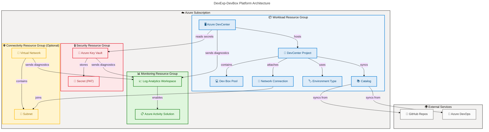

# DevExp-DevBox

[](https://opensource.org/licenses/MIT)
[](https://learn.microsoft.com/azure/azure-resource-manager/bicep/)
[](https://learn.microsoft.com/azure/dev-box/)
[](https://learn.microsoft.com/azure/developer/azure-developer-cli/)

An Azure Dev Box deployment accelerator that provisions a complete Microsoft Dev
Box platform using Infrastructure as Code (Bicep) and the Azure Developer CLI
(`azd`). Designed for platform engineering teams who need a repeatable,
enterprise-grade developer experience environment.

## 📖 DevExp-DevBox Accelerator

**Overview**

> 💡 **Why This Matters**: DevExp-DevBox eliminates weeks of manual Azure Dev
> Box setup by providing a fully automated, production-ready deployment
> accelerator that follows Azure Landing Zone best practices.

> 📌 **How It Works**: The accelerator uses Bicep templates orchestrated by the
> Azure Developer CLI (`azd`) to provision DevCenter, projects, pools, Key
> Vault, networking, and monitoring resources — all driven by YAML configuration
> files with JSON Schema validation.

DevExp-DevBox is an open-source accelerator that automates the end-to-end
provisioning of [Microsoft Dev Box](https://learn.microsoft.com/azure/dev-box/)
environments following Azure Landing Zone principles. It targets platform
engineering teams and IT administrators who want to deliver self-service,
cloud-powered developer workstations with centralized governance, security, and
monitoring.

The accelerator deploys a subscription-scoped Bicep template that creates three
functionally segregated resource groups — Workload, Security, and Monitoring —
plus optional per-project Connectivity resource groups for custom networking.
All configuration is externalized into validated YAML files under
`infra/settings/`, enabling teams to define their entire developer platform as
code and version it alongside their application repositories.

> [!NOTE] This accelerator deploys subscription-scoped resources across multiple
> resource groups. Ensure you have adequate Azure RBAC permissions
> (Contributor + User Access Administrator at subscription level) before
> proceeding.

## 📑 Table of Contents

- [🏗️ Architecture](#architecture)
- [✨ Features](#features)
- [📋 Requirements](#requirements)
- [🚀 Quick Start](#quick-start)
- [📦 Deployment](#deployment)
- [💻 Usage](#usage)
- [⚙️ Configuration](#configuration)
- [🤝 Contributing](#contributing)
- [📄 License](#license)

## 🏗️ Architecture

**Overview**

> 💡 **Why This Matters**: Understanding the resource topology ensures correct
> RBAC scoping, cost attribution, and network isolation across your Dev Box
> platform.

> 📌 **How It Works**: A single subscription-scoped Bicep deployment creates
> three core resource groups with functional segregation, optional per-project
> networking, and centralized diagnostics routed to Log Analytics.

The accelerator follows an **Azure Landing Zone** pattern with functional
segregation across three core resource groups — Workload, Security, and
Monitoring — plus optional per-project Connectivity resource groups for custom
networking. All resources send diagnostic logs and metrics to a centralized Log
Analytics workspace.


```mermaid
---
title: "DevExp-DevBox Platform Architecture"
config:
  theme: base
  look: classic
  layout: dagre
  flowchart:
    htmlLabels: true
---
flowchart TB
    %% ═══════════════════════════════════════════════════════════════════════════
    %% AZURE / FLUENT ARCHITECTURE PATTERN v1.1
    %% (Semantic + Structural + Font + Accessibility Governance)
    %% ═══════════════════════════════════════════════════════════════════════════
    %% PHASE 1 - STRUCTURAL: Direction explicit, flat topology, nesting ≤ 3
    %% PHASE 2 - SEMANTIC: Colors justified, max 5 semantic classes, neutral-first
    %% PHASE 3 - FONT: Dark text on light backgrounds, contrast ≥ 4.5:1
    %% PHASE 4 - ACCESSIBILITY: accTitle/accDescr present, icons on all nodes
    %% PHASE 5 - STANDARD: Governance block present, classDefs centralized
    %% ═══════════════════════════════════════════════════════════════════════════

    accTitle: DevExp-DevBox Platform Architecture
    accDescr: Azure Landing Zone architecture showing the subscription-scoped deployment with Workload, Security, Monitoring, and Connectivity resource groups containing DevCenter, Key Vault, Log Analytics, and networking resources with 17 components and 14 interactions

    subgraph subscription["☁️ Azure Subscription"]
        direction TB

        subgraph workloadRG["📦 Workload Resource Group"]
            direction TB
            DevCenter["🖥️ Azure DevCenter"]:::core
            Project["📂 DevCenter Project"]:::core
            Pool["💻 Dev Box Pool"]:::core
            Catalog["📚 Catalog"]:::core
            EnvType["🏷️ Environment Type"]:::core
            NetConn["🔗 Network Connection"]:::core

            DevCenter -->|"hosts"| Project
            Project -->|"contains"| Pool
            Project -->|"syncs"| Catalog
            Project -->|"uses"| EnvType
            Project -->|"attaches"| NetConn
        end

        subgraph securityRG["🔒 Security Resource Group"]
            direction TB
            KeyVault["🔑 Azure Key Vault"]:::security
            Secret["🔐 Secret (PAT)"]:::security

            KeyVault -->|"stores"| Secret
        end

        subgraph monitoringRG["📊 Monitoring Resource Group"]
            direction TB
            LogAnalytics["📈 Log Analytics Workspace"]:::monitoring
            AzActivity["📋 Azure Activity Solution"]:::monitoring

            LogAnalytics -->|"enables"| AzActivity
        end

        subgraph connectivityRG["🌐 Connectivity Resource Group (Optional)"]
            direction TB
            VNet["🔌 Virtual Network"]:::network
            Subnet["📡 Subnet"]:::network

            VNet -->|"contains"| Subnet
        end

        DevCenter -->|"reads secrets"| KeyVault
        DevCenter -->|"sends diagnostics"| LogAnalytics
        KeyVault -->|"sends diagnostics"| LogAnalytics
        VNet -->|"sends diagnostics"| LogAnalytics
        NetConn -->|"joins"| Subnet
    end

    subgraph external["🌍 External Services"]
        direction TB
        GitHub["🐙 GitHub Repos"]:::external
        ADO["🔷 Azure DevOps"]:::external
    end

    Catalog -->|"syncs from"| GitHub
    Catalog -->|"syncs from"| ADO

    %% SUBGRAPH STYLING (6 subgraphs = 6 style directives)
    style subscription fill:#F3F2F1,stroke:#605E5C,stroke-width:2px
    style workloadRG fill:#EFF6FC,stroke:#0078D4,stroke-width:2px
    style securityRG fill:#FDE7E9,stroke:#E81123,stroke-width:2px
    style monitoringRG fill:#DFF6DD,stroke:#107C10,stroke-width:2px
    style connectivityRG fill:#FFF4CE,stroke:#FFB900,stroke-width:2px
    style external fill:#F3F2F1,stroke:#605E5C,stroke-width:2px

    %% Centralized semantic classDefs (Phase 5 compliant)
    classDef core fill:#DEECF9,stroke:#0078D4,stroke-width:2px,color:#004578
    classDef security fill:#FDE7E9,stroke:#E81123,stroke-width:2px,color:#A4262C
    classDef monitoring fill:#DFF6DD,stroke:#107C10,stroke-width:2px,color:#0B6A0B
    classDef network fill:#FFF4CE,stroke:#FFB900,stroke-width:2px,color:#986F0B
    classDef external fill:#FAFAFA,stroke:#8A8886,stroke-width:2px,color:#323130

    %% Accessibility: WCAG AA verified (4.5:1 contrast ratio)
```

### Resource Groups

The deployment creates three landing zone resource groups following the naming
convention `{landingZone}-{envName}-{location}-RG`:

| Resource Group                          | Purpose                                    | Key Resources                                           |
| --------------------------------------- | ------------------------------------------ | ------------------------------------------------------- |
| 📦 **Workload** (`devexp-workload`)     | DevCenter and project resources            | DevCenter, Projects, Pools, Catalogs, Environment Types |
| 🔒 **Security** (`devexp-security`)     | Secrets management                         | Key Vault, Secrets (source control PAT)                 |
| 📊 **Monitoring** (`devexp-monitoring`) | Centralized observability                  | Log Analytics Workspace, Azure Activity Solution        |
| 🌐 **Connectivity** (per-project)       | Custom networking for Unmanaged VNet types | Virtual Network, Subnets                                |

### Module Structure

```text
infra/main.bicep                         # Entry point (subscription scope)
├── src/management/logAnalytics.bicep    # Log Analytics + diagnostics
├── src/security/security.bicep          # Key Vault orchestrator
│   ├── keyVault.bicep                   # Key Vault resource
│   └── secret.bicep                     # Secret + diagnostics
└── src/workload/workload.bicep          # Workload orchestrator
    ├── core/devCenter.bicep             # DevCenter + identity + RBAC
    │   ├── catalog.bicep                # DevCenter-level catalogs
    │   └── environmentType.bicep        # DevCenter environment types
    └── project/project.bicep            # Project + sub-resources
        ├── projectCatalog.bicep         # Project catalogs
        ├── projectEnvironmentType.bicep # Project environment types
        ├── projectPool.bicep            # Dev Box pools
        └── connectivity.bicep           # Network orchestrator
            ├── vnet.bicep               # VNet + subnets
            └── networkConnection.bicep  # DevCenter ↔ VNet attachment
```

## ✨ Features

**Overview**

> 💡 **Why This Matters**: Every capability is driven by YAML configuration,
> enabling teams to define their entire developer platform as code without
> modifying Bicep templates directly.

> 📌 **How It Works**: Features are organized across four pillars — core
> infrastructure, security, networking, and DevOps tooling — each backed by
> modular Bicep templates with full parameterization.

DevExp-DevBox provides a comprehensive set of features for deploying and
managing Microsoft Dev Box environments at enterprise scale. Every capability is
version-controlled alongside your application repositories and validated through
JSON Schema.

| Feature                          | Description                                                                                               | Source                                    |
| -------------------------------- | --------------------------------------------------------------------------------------------------------- | ----------------------------------------- |
| 🖥️ **DevCenter Provisioning**    | Deploys a fully configured Azure DevCenter with managed identity, catalogs, and environment types         | `src/workload/core/devCenter.bicep`       |
| 📂 **Multi-Project Support**     | Configures multiple DevCenter projects, each with independent pools, catalogs, and networking             | `src/workload/project/project.bicep`      |
| 💻 **Dev Box Pools**             | Creates Dev Box pools with configurable VM SKUs (e.g., 32vCPU/128GB, 16vCPU/64GB) and image definitions   | `src/workload/project/projectPool.bicep`  |
| 📚 **Catalog Integration**       | Syncs catalogs from GitHub or Azure DevOps repositories for environment definitions and image definitions | `src/workload/core/catalog.bicep`         |
| 🏷️ **Environment Types**         | Defines environment types (dev, staging, UAT) at both DevCenter and project levels                        | `src/workload/core/environmentType.bicep` |
| 🔒 **Key Vault Integration**     | Manages source control tokens securely with purge protection and RBAC authorization                       | `src/security/keyVault.bicep`             |
| 📈 **Centralized Monitoring**    | Routes diagnostic logs and metrics from all resources to a shared Log Analytics workspace                 | `src/management/logAnalytics.bicep`       |
| 🔌 **Flexible Networking**       | Supports both Managed and Unmanaged VNet types with configurable address spaces and subnets               | `src/connectivity/connectivity.bicep`     |
| 🔐 **RBAC Automation**           | Assigns roles at subscription, resource group, and resource scopes for DevCenter and project identities   | `src/identity/`                           |
| ⚙️ **YAML-Driven Configuration** | Externalizes all settings into validated YAML files with JSON Schema for IDE autocomplete and validation  | `infra/settings/`                         |
| 🚀 **Azure Developer CLI**       | Integrates with `azd` for streamlined provisioning with pre-provision hooks and environment management    | `azure.yaml`                              |
| 🔄 **Multi-Platform Setup**      | Provides setup scripts for both Windows (PowerShell) and Linux/macOS (Bash)                               | `setUp.ps1`, `setUp.sh`                   |

## 📋 Requirements

**Overview**

> 💡 **Why This Matters**: Verifying prerequisites before deployment prevents
> partial failures and ensures deterministic, repeatable provisioning across
> team environments.

> 📌 **How It Works**: The setup scripts (`setUp.ps1` / `setUp.sh`) validate all
> prerequisites automatically, but you can verify them manually using the
> commands in the table below.

Before deploying the accelerator, ensure you have the required CLI tools
installed and proper Azure permissions configured.

| Requirement                        | Minimum Version | Purpose                                                                                | Installation                                                                               |
| ---------------------------------- | --------------- | -------------------------------------------------------------------------------------- | ------------------------------------------------------------------------------------------ |
| ☁️ **Azure Subscription**          | N/A             | Target for all resource deployments (must be in `Enabled` state)                       | [Azure Free Account](https://azure.microsoft.com/free/)                                    |
| 🔧 **Azure CLI** (`az`)            | Latest          | Azure authentication and resource management                                           | [Install Azure CLI](https://learn.microsoft.com/cli/azure/install-azure-cli)               |
| 🚀 **Azure Developer CLI** (`azd`) | Latest          | Environment management, provisioning, and deployment hooks                             | [Install azd](https://learn.microsoft.com/azure/developer/azure-developer-cli/install-azd) |
| 🐙 **GitHub CLI** (`gh`)           | Latest          | GitHub authentication and token retrieval (required if using GitHub as source control) | [Install gh](https://cli.github.com/)                                                      |
| 📝 **jq**                          | Latest          | JSON parsing (required for Bash setup script only)                                     | [Install jq](https://jqlang.github.io/jq/download/)                                        |
| 🔑 **Azure RBAC**                  | N/A             | Contributor + User Access Administrator at subscription scope                          | Contact your Azure administrator                                                           |

> [!IMPORTANT] The DevCenter managed identity requires **Contributor** and
> **User Access Administrator** roles at the subscription level. Ensure these
> permissions are available before running the deployment.

## 🚀 Quick Start

> [!TIP] Run the setup script first — it validates all prerequisites,
> authenticates with Azure and GitHub, and configures environment variables
> automatically.

### 1. Clone the Repository

```bash
git clone https://github.com/Evilazaro/DevExp-DevBox.git
cd DevExp-DevBox
```

**Expected output:**

```text
Cloning into 'DevExp-DevBox'...
remote: Enumerating objects: done.
remote: Counting objects: 100% done.
Receiving objects: 100% done.
```

### 2. Authenticate with Azure

```bash
az login
azd auth login
```

**Expected output:**

```text
A web browser has been opened at https://login.microsoftonline.com/...
```

### 3. Run the Setup Script

**Windows (PowerShell):**

```powershell
.\setUp.ps1 -EnvName "dev" -SourceControl "github"
```

**Linux / macOS (Bash):**

```bash
./setUp.sh -e "dev" -s "github"
```

**Expected output:**

```text
✅ Azure CLI authenticated successfully
✅ GitHub CLI authenticated successfully
✅ Environment 'dev' initialized
✅ Key Vault secret configured
```

### 4. Provision Azure Resources

```bash
azd provision -e dev
```

**Expected output:**

```text
Provisioning Azure resources (azd provision)
  ...
  (✓) Done: Resource group: devexp-workload-dev-eastus2-RG
  (✓) Done: Resource group: devexp-security-dev-eastus2-RG
  (✓) Done: Resource group: devexp-monitoring-dev-eastus2-RG

SUCCESS: Your application was provisioned in Azure
```

## 📦 Deployment

**Overview**

The deployment leverages the Azure Developer CLI (`azd`) to orchestrate the full
provisioning lifecycle. A pre-provision hook automatically runs the setup script
to configure authentication and environment variables before Bicep templates are
deployed at subscription scope.

> [!WARNING] The deployment creates subscription-level resources and RBAC
> assignments. Running this in a production subscription without review may
> affect existing resources. Use a dedicated development subscription for
> initial testing.

### Deployment Flow

1. **Select platform configuration** — The repository includes two `azd`
   configuration files:
   - `azure.yaml` — Linux/macOS (uses Bash `setUp.sh`)
   - `azure-pwh.yaml` — Windows (uses PowerShell `setUp.ps1`)

   On Windows, rename `azure-pwh.yaml` to `azure.yaml` to use the PowerShell
   hook.

2. **Initialize the environment** — The setup script creates
   `.azure/{envName}/.env` with:
   - `KEY_VAULT_SECRET` — Your source control Personal Access Token
   - `SOURCE_CONTROL_PLATFORM` — `github` or `adogit`

3. **Provision resources** — `azd provision` deploys the Bicep templates:

```bash
azd provision -e dev
```

**Expected output:**

```text
Provisioning Azure resources (azd provision)
  Subscription: <your-subscription-name> (<subscription-id>)
  Location: eastus2

  (✓) Done: Resource group: devexp-monitoring-dev-eastus2-RG
  (✓) Done: Resource group: devexp-security-dev-eastus2-RG
  (✓) Done: Resource group: devexp-workload-dev-eastus2-RG

SUCCESS: Your application was provisioned in Azure
```

The deployment creates resources in this order:

- Monitoring resource group → Log Analytics Workspace
- Security resource group → Key Vault → Secret
- Workload resource group → DevCenter → Projects → Pools

4. **Verify deployment** — Check outputs after provisioning:

```bash
azd env get-values -e dev
```

**Expected output:**

```text
AZURE_DEV_CENTER_NAME="devexp-devcenter"
AZURE_KEY_VAULT_NAME="contoso-abc123-kv"
AZURE_LOG_ANALYTICS_WORKSPACE_NAME="logAnalytics-abc123"
SECURITY_AZURE_RESOURCE_GROUP_NAME="devexp-security-dev-eastus2-RG"
WORKLOAD_AZURE_RESOURCE_GROUP_NAME="devexp-workload-dev-eastus2-RG"
```

### Cleanup

To remove all provisioned resources and associated credentials:

```powershell
.\cleanSetUp.ps1 -EnvName "dev" -Location "eastus2"
```

**Expected output:**

```text
Removing ARM deployments at subscription scope...
Removing resource groups...
Cleanup complete.
```

The cleanup script removes:

- All subscription-level ARM deployments
- Users and role assignments
- Deployment credentials and service principals
- GitHub secrets
- Resource groups and their contents

## 💻 Usage

**Overview**

After deployment, your DevCenter is fully operational. Developers can access
their Dev Box environments through the Azure portal, the Dev Home app, or the
Azure CLI. Platform engineers manage the environment by editing the YAML
configuration files and redeploying.

### Accessing Dev Box Environments

Developers assigned to a project can launch Dev Boxes from the
[Microsoft Dev Portal](https://devportal.microsoft.com/):

1. Sign in with your Azure AD credentials
2. Select the project (e.g., `eShop`)
3. Choose a Dev Box pool (e.g., `backend-engineer` or `frontend-engineer`)
4. Click **Create** to provision a new Dev Box

### Adding a New Project

Add a new project by updating `infra/settings/workload/devcenter.yaml`:

```yaml
projects:
  - name: 'myNewProject'
    network:
      vnetName: 'myNewProject'
      type: 'Managed'
    pools:
      - name: 'general-developer'
        skuName: 'general_i_32c128gb512ssd_v2'
        catalogs:
          - name: 'devboxImages'
            type: 'imageDefinition'
    environmentTypes:
      - name: 'dev'
      - name: 'staging'
```

Then redeploy:

```bash
azd provision -e dev
```

**Expected output:**

```text
Provisioning Azure resources (azd provision)
  (✓) Done: Resource group: devexp-workload-dev-eastus2-RG

SUCCESS: Your application was provisioned in Azure
```

### Adding a New Environment Type

Add environment types at the DevCenter level in
`infra/settings/workload/devcenter.yaml`:

```yaml
environmentTypes:
  - name: 'dev'
  - name: 'staging'
  - name: 'UAT'
  - name: 'production'
```

### Switching Source Control Platforms

The accelerator supports both GitHub and Azure DevOps. To switch:

```powershell
.\setUp.ps1 -EnvName "dev" -SourceControl "adogit"
```

**Expected output:**

```text
✅ Azure DevOps CLI authenticated successfully
✅ Environment 'dev' updated with adogit source control
✅ Key Vault secret configured
```

## ⚙️ Configuration

**Overview**

> 💡 **Why This Matters**: Externalizing configuration into validated YAML files
> lets teams customize their Dev Box platform without touching Bicep templates,
> reducing deployment errors and enabling pull-request-based change management.

> 📌 **How It Works**: Each YAML file under `infra/settings/` has a companion
> JSON Schema (`.schema.json`) that provides IDE autocomplete, inline
> validation, and documentation — so every configuration change is validated
> before deployment.

All deployment settings are externalized into YAML configuration files under
`infra/settings/`. This design enables teams to customize their Dev Box platform
without modifying Bicep templates directly.

### Configuration Files

| File                                                         | Purpose                                                                           | Schema                       |
| ------------------------------------------------------------ | --------------------------------------------------------------------------------- | ---------------------------- |
| 📁 `infra/settings/resourceOrganization/azureResources.yaml` | Landing zone resource group definitions (names, tags, create flags)               | `azureResources.schema.json` |
| 🔒 `infra/settings/security/security.yaml`                   | Key Vault configuration (name, purge protection, RBAC, soft delete)               | `security.schema.json`       |
| ⚙️ `infra/settings/workload/devcenter.yaml`                  | DevCenter, projects, pools, catalogs, networking, identity, and environment types | `devcenter.schema.json`      |

### Deployment Parameters

| Parameter            | Source              | Description                                                | Example       |
| -------------------- | ------------------- | ---------------------------------------------------------- | ------------- |
| 📍 `location`        | `azd env`           | Azure region for deployment (16 supported regions)         | `eastus2`     |
| 🏷️ `environmentName` | `azd env`           | Environment identifier (2-10 characters)                   | `dev`         |
| 🔑 `secretValue`     | `.azure/{env}/.env` | Source control Personal Access Token (stored in Key Vault) | `ghp_xxxx...` |

### Key Vault Settings

| Setting                        | Default     | Description                                                 |
| ------------------------------ | ----------- | ----------------------------------------------------------- |
| 🏷️ `name`                      | `contoso`   | Key Vault name prefix (suffixed with unique string + `-kv`) |
| 🔐 `secretName`                | `gha-token` | Name of the secret storing the source control PAT           |
| 🛡️ `purgeProtection`           | `true`      | Prevents permanent deletion of the Key Vault                |
| 🗑️ `softDelete`                | `true`      | Enables soft delete with configurable retention             |
| 📅 `softDeleteRetentionInDays` | `7`         | Number of days to retain soft-deleted vaults                |
| 🔑 `rbacAuthorization`         | `true`      | Uses Azure RBAC instead of access policies                  |

### Dev Box Pool SKUs

| Pool Profile           | SKU                           | vCPUs | Memory | Storage    |
| ---------------------- | ----------------------------- | ----- | ------ | ---------- |
| 💻 `backend-engineer`  | `general_i_32c128gb512ssd_v2` | 32    | 128 GB | 512 GB SSD |
| 🎨 `frontend-engineer` | `general_i_16c64gb256ssd_v2`  | 16    | 64 GB  | 256 GB SSD |

### Supported Azure Regions

`eastus`, `eastus2`, `westus`, `westus2`, `westus3`, `centralus`, `northeurope`,
`westeurope`, `southeastasia`, `australiaeast`, `japaneast`, `uksouth`,
`canadacentral`, `swedencentral`, `switzerlandnorth`, `germanywestcentral`

## 🤝 Contributing

**Overview**

> 💡 **Why This Matters**: Contributions follow a product-oriented delivery
> model that ensures quality, traceability, and alignment with the accelerator's
> enterprise-grade standards.

> 📌 **How It Works**: All changes require a linked GitHub Issue, a feature
> branch with proper naming, and a pull request with test evidence before merge.

Contributions are welcome. Please read [CONTRIBUTING.md](CONTRIBUTING.md) for
full details on the contribution workflow, branching conventions, coding
standards, and definition of done.

### Quick Contribution Guide

1. **Fork** the repository and create a feature branch:

```bash
git checkout -b feature/123-my-improvement
```

2. **Make changes** following the project conventions:
   - Bicep modules must be parameterized, idempotent, and reusable
   - PowerShell scripts require PS 5.1+, error handling, and `-WhatIf` support
   - All modules need descriptions for parameters, outputs, and purpose

3. **Validate** your changes:

```bash
az deployment sub what-if --location eastus2 --template-file infra/main.bicep --parameters infra/main.parameters.json
```

**Expected output:**

```text
Resource and property changes are indicated with these symbols:
  + Create
  ~ Modify

The deployment will update the following scope:
Scope: /subscriptions/<subscription-id>
```

4. **Submit** a pull request referencing the related issue

### Branch Naming

| Prefix        | Usage                 |
| ------------- | --------------------- |
| 🆕 `feature/` | New capabilities      |
| 🔧 `task/`    | Small units of work   |
| 🐛 `fix/`     | Bug fixes             |
| 📝 `docs/`    | Documentation updates |

## 📄 License

This project is licensed under the [MIT License](LICENSE).

Copyright (c) 2025 Evilázaro Alves
