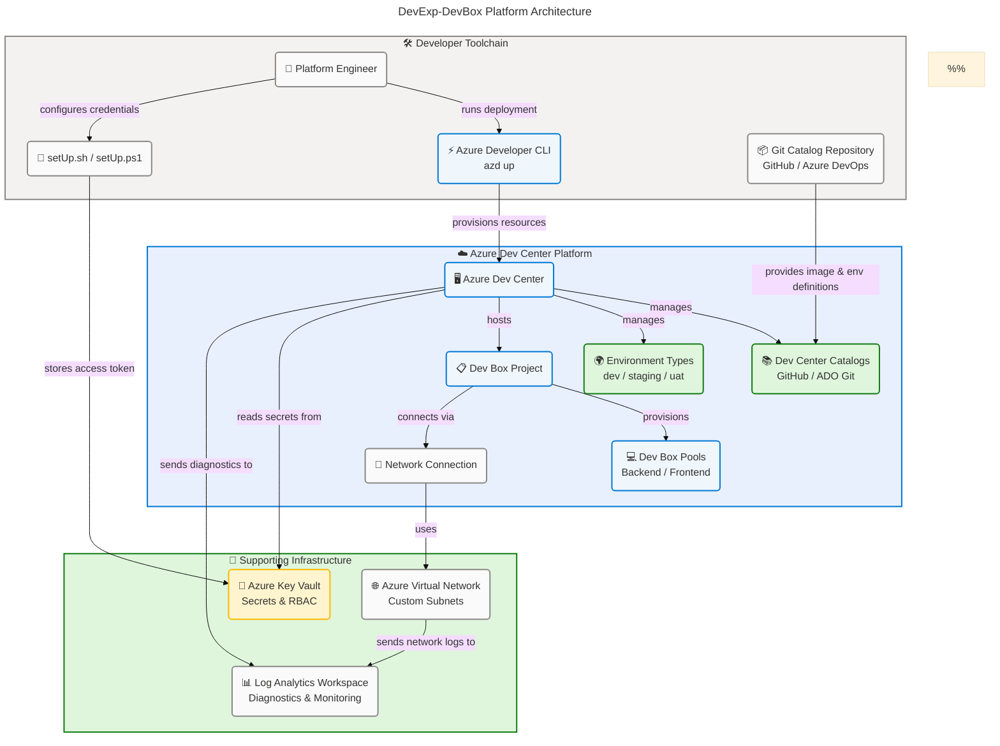

# DevExp-DevBox

[](./LICENSE)
[](https://learn.microsoft.com/en-us/azure/azure-resource-manager/bicep/overview)
[](https://learn.microsoft.com/en-us/azure/developer/azure-developer-cli/overview)
[](https://learn.microsoft.com/en-us/azure/dev-box/overview-what-is-microsoft-dev-box)

An Azure Developer CLI (`azd`) accelerator for provisioning enterprise-grade
[Microsoft Dev Box](https://learn.microsoft.com/en-us/azure/dev-box/overview-what-is-microsoft-dev-box)
environments using Bicep infrastructure-as-code and YAML-driven configuration.

## Table of Contents

- [Overview](#overview)
- [Features](#features)
- [Architecture](#architecture)
- [Quick Start](#quick-start)
- [Deployment](#deployment)
- [Requirements](#requirements)
- [Usage](#usage)
- [Configuration](#configuration)
- [Contributing](#contributing)
- [License](#license)

## Overview

**Overview**

DevExp-DevBox is a production-ready accelerator that automates the end-to-end
provisioning of Microsoft Dev Box environments on Azure. It enables platform
engineering teams to deliver standardized, role-specific developer workstations
at scale — eliminating manual setup time and enforcing organizational security
and governance standards.

The accelerator follows
[Azure Landing Zone](https://learn.microsoft.com/en-us/azure/cloud-adoption-framework/ready/landing-zone/)
principles with segregated resource groups for workload, security, and
monitoring concerns. All infrastructure is defined in Bicep and driven by YAML
configuration files, making it fully repeatable and version-controlled.

Deployment is orchestrated by the Azure Developer CLI (`azd`), with
cross-platform setup scripts that integrate with GitHub and Azure DevOps for
credential management and CI/CD automation.

## Features

**Overview**

DevExp-DevBox delivers a complete platform engineering toolkit for Microsoft Dev
Box. It eliminates the complexity of manually configuring Dev Centers, projects,
pools, and network connectivity — replacing it with a single YAML-driven
configuration model that any team can adopt and extend.

> [!TIP]  
> All infrastructure components are configured through YAML files under
> `infra/settings/`. No changes to Bicep source files are needed for standard
> project onboarding.

| 🚀 Feature                            | 📝 Description                                                                                                     | ✅ Status |
| ------------------------------------- | ------------------------------------------------------------------------------------------------------------------ | --------- |
| 🏢 Config-Driven Dev Center           | Provision Azure Dev Center, catalogs, and environment types from `devcenter.yaml`                                  | ✅ Stable |
| 🗂️ Multi-Project Support              | Deploy multiple team projects, each with isolated pools, catalogs, and environment types                           | ✅ Stable |
| 💻 Role-Specific Dev Box Pools        | Define image definitions and VM SKUs per engineering role (backend, frontend, etc.)                                | ✅ Stable |
| 📚 Catalog Integration                | Connect Dev Box image definitions and environment definitions from GitHub or Azure DevOps Git repos                | ✅ Stable |
| 🔑 Secure Secret Management           | Store GitHub Actions and ADO tokens in Azure Key Vault with RBAC authorization and soft-delete protection          | ✅ Stable |
| 📊 Integrated Observability           | Log Analytics Workspace with diagnostic settings wired to all resources automatically                              | ✅ Stable |
| 🌐 Network Flexibility                | Support both Managed and Unmanaged (custom VNet) network configurations per project                                | ✅ Stable |
| 🏗️ Landing Zone Resource Organization | Segregated resource groups for workload, security, and monitoring following Azure best practices                   | ✅ Stable |
| 🌍 Environment Type Management        | Define multiple deployment environments (`dev`, `staging`, `uat`) per Dev Center and project                       | ✅ Stable |
| 📜 Cross-Platform Setup Scripts       | Bash (`setUp.sh`) and PowerShell (`setUp.ps1`) scripts for environment initialization on Linux, macOS, and Windows | ✅ Stable |

## Architecture

**Overview**

DevExp-DevBox provisions a layered Azure platform: developer toolchain commands
flow through the Azure Developer CLI into a subscription-scoped Bicep deployment
that creates segregated resource groups for workload, security, and monitoring.
The Azure Dev Center sits at the core, referencing Key Vault secrets for private
catalog access, sending diagnostics to Log Analytics, and managing projects that
each have role-specific Dev Box pools connected via Azure Virtual Network.


```mermaid
---
title: "DevExp-DevBox Platform Architecture"
config:
  theme: base
  look: classic
  layout: dagre
  themeVariables:
    fontSize: '16px'
  flowchart:
    htmlLabels: true
---
flowchart TB
    accTitle: DevExp-DevBox Azure Dev Box Platform Architecture
    accDescr: Technology platform architecture showing developer toolchain provisioning Azure Dev Center with projects, role-specific pools, catalogs, environment types, Key Vault for secrets, Log Analytics for monitoring, and Virtual Network for connectivity. Developer=neutral, AzdCLI=core, SetupScript=neutral, GitRepo=neutral, DC=core, Catalogs=success, EnvTypes=success, Project=core, Pools=core, NetConn=neutral, KeyVault=warning, LogAnalytics=neutral, VNet=neutral. WCAG AA compliant.

    %%
    %% AZURE / FLUENT ARCHITECTURE PATTERN v2.0
    %% (Semantic + Structural + Font + Accessibility Governance)
    %%
    %% PHASE 1 - FLUENT UI: All styling uses approved Fluent UI palette only
    %% PHASE 2 - GROUPS: Every subgraph has semantic color via style directive
    %% PHASE 3 - COMPONENTS: Every node has semantic classDef + icon prefix
    %% PHASE 4 - ACCESSIBILITY: accTitle/accDescr present, WCAG AA contrast
    %% PHASE 5 - STANDARD: Governance block present, classDefs centralized
    %%

    subgraph devtools ["🛠️ Developer Toolchain"]
        Developer("👤 Platform Engineer"):::neutral
        AzdCLI("⚡ Azure Developer CLI<br/>azd up"):::core
        SetupScript("📜 setUp.sh / setUp.ps1"):::neutral
        GitRepo("📦 Git Catalog Repository<br/>GitHub / Azure DevOps"):::neutral
    end

    subgraph devcenter ["☁️ Azure Dev Center Platform"]
        DC("🖥️ Azure Dev Center"):::core
        Catalogs("📚 Dev Center Catalogs<br/>GitHub / ADO Git"):::success
        EnvTypes("🌍 Environment Types<br/>dev / staging / uat"):::success
        Project("📋 Dev Box Project"):::core
        Pools("💻 Dev Box Pools<br/>Backend / Frontend"):::core
        NetConn("🔗 Network Connection"):::neutral
    end

    subgraph support ["🔧 Supporting Infrastructure"]
        KeyVault("🔑 Azure Key Vault<br/>Secrets & RBAC"):::warning
        LogAnalytics("📊 Log Analytics Workspace<br/>Diagnostics & Monitoring"):::neutral
        VNet("🌐 Azure Virtual Network<br/>Custom Subnets"):::neutral
    end

    Developer -->|"runs deployment"| AzdCLI
    Developer -->|"configures credentials"| SetupScript
    AzdCLI -->|"provisions resources"| DC
    SetupScript -->|"stores access token"| KeyVault
    GitRepo -->|"provides image & env definitions"| Catalogs
    DC -->|"manages"| Catalogs
    DC -->|"manages"| EnvTypes
    DC -->|"hosts"| Project
    DC -->|"reads secrets from"| KeyVault
    DC -->|"sends diagnostics to"| LogAnalytics
    Project -->|"provisions"| Pools
    Project -->|"connects via"| NetConn
    NetConn -->|"uses"| VNet
    VNet -->|"sends network logs to"| LogAnalytics

    style devtools fill:#F3F2F1,stroke:#8A8886,stroke-width:2px,color:#323130
    style devcenter fill:#E8F0FE,stroke:#0078D4,stroke-width:2px,color:#323130
    style support fill:#DFF6DD,stroke:#107C10,stroke-width:2px,color:#323130

    %% Centralized semantic classDefs (Phase 5 compliant)
    classDef core fill:#EFF6FC,stroke:#0078D4,stroke-width:2px,color:#323130
    classDef success fill:#DFF6DD,stroke:#107C10,stroke-width:2px,color:#323130
    classDef warning fill:#FFF4CE,stroke:#FFB900,stroke-width:2px,color:#323130
    classDef neutral fill:#FAFAFA,stroke:#8A8886,stroke-width:2px,color:#323130
```

### Bicep Module Dependency Chain

The `infra/main.bicep` deploys at subscription scope in the following order:

| 🔢 Order | 📦 Module              | 📁 Source                                  | 🏗️ Resource Group  |
| -------- | ---------------------- | ------------------------------------------ | ------------------ |
| 1️⃣       | 🏗️ Resource Groups     | `infra/main.bicep`                         | Subscription scope |
| 2️⃣       | 📊 Log Analytics       | `src/management/logAnalytics.bicep`        | Monitoring RG      |
| 3️⃣       | 🔑 Key Vault + Secret  | `src/security/security.bicep`              | Security RG        |
| 4️⃣       | 🖥️ Dev Center          | `src/workload/core/devCenter.bicep`        | Workload RG        |
| 5️⃣       | 📚 Catalogs            | `src/workload/core/catalog.bicep`          | Workload RG        |
| 6️⃣       | 🌍 Environment Types   | `src/workload/core/environmentType.bicep`  | Workload RG        |
| 7️⃣       | 📋 Projects            | `src/workload/project/project.bicep`       | Workload RG        |
| 8️⃣       | 🌐 Virtual Networks    | `src/connectivity/vnet.bicep`              | Connectivity RG    |
| 9️⃣       | 🔗 Network Connections | `src/connectivity/networkConnection.bicep` | Workload RG        |
| 🔟       | 💻 Dev Box Pools       | `src/workload/project/projectPool.bicep`   | Workload RG        |

## Quick Start

**Prerequisites**: Install
[Azure CLI](https://learn.microsoft.com/en-us/cli/azure/install-azure-cli),
[Azure Developer CLI](https://learn.microsoft.com/en-us/azure/developer/azure-developer-cli/install-azd),
and [GitHub CLI](https://cli.github.com/) before proceeding.

> [!WARNING]  
> You must have **Owner** or **User Access Administrator** role on the target
> Azure subscription. The Dev Center managed identity requires `Contributor` and
> `User Access Administrator` role assignments at subscription scope (defined in
> `infra/settings/workload/devcenter.yaml`).

**Step 1 — Clone the repository:**

```bash
git clone https://github.com/Evilazaro/DevExp-DevBox.git
cd DevExp-DevBox
```

**Step 2 — Authenticate:**

```bash
azd auth login
az login
```

**Step 3 — Initialize and provision the environment:**

```bash
# Linux / macOS
./setUp.sh -e dev -s github

# Windows (PowerShell)
.\setUp.ps1 -EnvName dev -SourceControl github
```

**Expected Output**:

```
✅ [2026-04-24 10:00:00] Azure CLI authenticated successfully.
✅ [2026-04-24 10:00:05] Azure Developer CLI authenticated successfully.
✅ [2026-04-24 10:00:10] GitHub CLI authenticated successfully.
✅ [2026-04-24 10:00:15] Environment 'dev' initialized.
```

**Step 4 — Deploy all resources:**

```bash
azd up
```

**Expected Output**:

```
Provisioning Azure resources (azd provision)

  (✓) Done: Resource group: devexp-workload-dev-eastus-RG
  (✓) Done: Log Analytics Workspace: logAnalytics-<unique>
  (✓) Done: Key Vault: contoso-<unique>-kv
  (✓) Done: Dev Center: devexp
  (✓) Done: Dev Box Project: eShop
  (✓) Done: Dev Box Pools: backend-engineer, frontend-engineer

SUCCESS: Your up workflow to provision and deploy to Azure completed in 12 minutes.

Outputs:
  AZURE_DEV_CENTER_NAME: devexp
  AZURE_KEY_VAULT_NAME: contoso-<unique>-kv
  AZURE_LOG_ANALYTICS_WORKSPACE_NAME: logAnalytics-<unique>
```

## Deployment

**Overview**

Deployment is fully automated through the Azure Developer CLI and the included
setup scripts. The setup scripts handle authentication, credential provisioning,
and environment variable configuration — then `azd up` provisions all Azure
resources in the correct dependency order.

> [!IMPORTANT]  
> The `setUp.sh` and `setUp.ps1` scripts run as `azd` pre-provision hooks
> defined in `azure.yaml`. They are invoked automatically when you run `azd up`,
> but can also be called directly for credential rotation or environment
> re-initialization.

### Deployment Parameters

Set the following environment variables before running `azd up`, or provide them
interactively when prompted:

```bash
azd env set AZURE_LOCATION eastus
azd env set AZURE_ENV_NAME dev
azd env set SOURCE_CONTROL_PLATFORM github
```

**Expected Output**:

```
SUCCESS: Successfully configured environment 'dev'.
```

### Supported Azure Regions

The following regions are validated in `infra/main.bicep`:

| 🌍 Region               | 🏷️ Value             |
| ----------------------- | -------------------- |
| 🇺🇸 East US              | `eastus`             |
| 🇺🇸 East US 2            | `eastus2`            |
| 🇺🇸 West US              | `westus`             |
| 🇺🇸 West US 2            | `westus2`            |
| 🇺🇸 West US 3            | `westus3`            |
| 🇺🇸 Central US           | `centralus`          |
| 🇪🇺 North Europe         | `northeurope`        |
| 🇪🇺 West Europe          | `westeurope`         |
| 🌏 Southeast Asia       | `southeastasia`      |
| 🇦🇺 Australia East       | `australiaeast`      |
| 🇯🇵 Japan East           | `japaneast`          |
| 🇬🇧 UK South             | `uksouth`            |
| 🇨🇦 Canada Central       | `canadacentral`      |
| 🇸🇪 Sweden Central       | `swedencentral`      |
| 🇨🇭 Switzerland North    | `switzerlandnorth`   |
| 🇩🇪 Germany West Central | `germanywestcentral` |

### Cleanup

To remove all provisioned resources and clean up credentials:

```powershell
.\cleanSetUp.ps1 -EnvName dev -Location eastus
```

**Expected Output**:

```
✅ Subscription deployments deleted.
✅ Role assignments removed.
✅ Service principal deleted.
✅ GitHub secret 'AZURE_CREDENTIALS' removed.
✅ Resource groups deleted.
```

## Requirements

**Overview**

DevExp-DevBox requires standard Azure and developer toolchain components
available on Linux, macOS, and Windows. All tools are freely available and
widely used across platform engineering teams. The Azure subscription must have
sufficient permissions to create resource groups, role assignments, and Dev
Center resources at subscription scope.

> [!TIP]  
> Use the
> [Azure Developer CLI installation guide](https://learn.microsoft.com/en-us/azure/developer/azure-developer-cli/install-azd)
> to install `azd` on any platform with a single command.

> [!IMPORTANT]  
> The `setUp.sh` and `setUp.ps1` scripts validate all prerequisites before
> execution and exit with a clear error message if any dependency is missing.

| 🔧 Prerequisite         | 📝 Description                                                                            | 🔗 Install                                                                                                         |
| ----------------------- | ----------------------------------------------------------------------------------------- | ------------------------------------------------------------------------------------------------------------------ |
| ☁️ Azure Subscription   | Active Azure subscription with Owner or User Access Administrator role                    | [Azure Portal](https://portal.azure.com)                                                                           |
| ⚡ Azure Developer CLI  | `azd` v1.0+ for environment management and deployment orchestration                       | [Install azd](https://learn.microsoft.com/en-us/azure/developer/azure-developer-cli/install-azd)                   |
| 🔵 Azure CLI            | `az` for resource management and authentication                                           | [Install az](https://learn.microsoft.com/en-us/cli/azure/install-azure-cli)                                        |
| 🐙 GitHub CLI           | `gh` for GitHub authentication and secret management (required for GitHub source control) | [Install gh](https://cli.github.com/)                                                                              |
| 🔄 jq                   | JSON processor used in `setUp.sh` for parsing API responses                               | [Install jq](https://jqlang.github.io/jq/download/)                                                                |
| 🖥️ PowerShell 5.1+      | Required for `setUp.ps1` and `cleanSetUp.ps1` on Windows                                  | [Install PowerShell](https://learn.microsoft.com/en-us/powershell/scripting/install/installing-powershell)         |
| 🔐 Azure AD Permissions | Permission to create app registrations and service principals in the target tenant        | [Azure AD docs](https://learn.microsoft.com/en-us/azure/active-directory/develop/app-registrations-training-guide) |

## Usage

**Overview**

After initial deployment, use the YAML configuration files under
`infra/settings/` to add projects, pools, catalogs, and environment types.
Re-run `azd up` to apply changes incrementally. Use the `cleanSetUp.ps1` script
to safely tear down environments without leaving orphaned resources.

### Add a New Dev Box Project

Edit `infra/settings/workload/devcenter.yaml` and append a new project entry
under the `projects` array:

```yaml
projects:
  - name: 'myNewProject'
    description: 'My new Dev Box project.'
    network:
      name: myNewProject
      create: true
      resourceGroupName: 'myNewProject-connectivity-RG'
      virtualNetworkType: Managed
      addressPrefixes:
        - 10.1.0.0/16
    identity:
      type: SystemAssigned
      roleAssignments:
        azureADGroupId: 'aabbccdd-1234-5678-90ab-cdef01234567'
        azureADGroupName: 'My Engineers'
        azureRBACRoles:
          - name: 'Dev Box User'
            id: '45d50f46-0b78-4001-a660-4198cbe8cd05'
            scope: Project
    pools:
      - name: 'developer'
        imageDefinitionName: 'my-dev-image'
        vmSku: general_i_16c64gb256ssd_v2
    environmentTypes:
      - name: 'dev'
        deploymentTargetId: ''
    catalogs:
      - name: 'environments'
        type: environmentDefinition
        sourceControl: gitHub
        visibility: private
        uri: 'https://github.com/MyOrg/MyRepo.git'
        branch: 'main'
        path: '/.devcenter/environments'
    tags:
      environment: 'dev'
      team: 'MyTeam'
      project: 'myNewProject'
```

Then re-deploy:

```bash
azd up
```

**Expected Output**:

```
  (✓) Done: Dev Box Project: myNewProject
  (✓) Done: Dev Box Pools: developer

SUCCESS: Your up workflow to provision and deploy to Azure completed.
```

### Use Azure DevOps as Source Control

Pass `adogit` to the setup script to configure Azure DevOps authentication
instead of GitHub:

```bash
# Linux / macOS
./setUp.sh -e dev -s adogit

# Windows
.\setUp.ps1 -EnvName dev -SourceControl adogit
```

**Expected Output**:

```
✅ [2026-04-24 10:00:10] Azure DevOps CLI authenticated successfully.
✅ [2026-04-24 10:00:15] Environment 'dev' initialized with ADO source control.
```

### View Help for Setup Scripts

```bash
# Linux / macOS
./setUp.sh --help

# Windows
Get-Help .\setUp.ps1 -Detailed
```

**Expected Output**:

```
SYNOPSIS
    setUp.ps1 - Sets up Azure Dev Box environment with GitHub integration

PARAMETER EnvName
    Name of the Azure environment to create

PARAMETER SourceControl
    Source control platform (github or adogit)
```

## Configuration

**Overview**

All configuration is managed through three YAML files under `infra/settings/`.
These files define resource group organization, Key Vault settings, and the full
Dev Center topology. Changes to these files are automatically picked up by the
Bicep modules during `azd up` via `loadYamlContent()` calls.

> [!NOTE]  
> Schema files (`*.schema.json`) are co-located with each YAML configuration
> file. Use them to validate your configuration in VS Code with the
> `yaml-language-server: $schema=` directive already present at the top of each
> file.

### Resource Organization — `infra/settings/resourceOrganization/azureResources.yaml`

Controls how Azure resource groups are created and named. Setting
`create: false` for security or monitoring causes those resources to share the
workload resource group.

| ⚙️ Parameter           | 📝 Description                                          | 🔧 Example         |
| ---------------------- | ------------------------------------------------------- | ------------------ |
| 🏗️ `workload.create`   | Whether to create the workload resource group           | `true`             |
| 📦 `workload.name`     | Base name for the workload resource group               | `devexp-workload`  |
| 🔒 `security.create`   | Whether to create a dedicated security resource group   | `false`            |
| 📊 `monitoring.create` | Whether to create a dedicated monitoring resource group | `false`            |
| 🏷️ `*.tags`            | Azure tags applied to all resources in the landing zone | `environment: dev` |

### Security — `infra/settings/security/security.yaml`

Controls the Azure Key Vault resource provisioned for secret storage.

| ⚙️ Parameter                            | 📝 Description                                                          | 🔧 Default  |
| --------------------------------------- | ----------------------------------------------------------------------- | ----------- |
| 🔑 `keyVault.name`                      | Base name for the Key Vault (a unique suffix is appended automatically) | `contoso`   |
| 🔐 `keyVault.secretName`                | Name of the secret stored for source control token                      | `gha-token` |
| 🛡️ `keyVault.enablePurgeProtection`     | Prevent accidental permanent deletion                                   | `true`      |
| 🗑️ `keyVault.enableSoftDelete`          | Allow recovery of deleted secrets                                       | `true`      |
| 📅 `keyVault.softDeleteRetentionInDays` | Retention period for deleted secrets (7–90 days)                        | `7`         |
| 🔑 `keyVault.enableRbacAuthorization`   | Use Azure RBAC instead of access policies                               | `true`      |

### Dev Center — `infra/settings/workload/devcenter.yaml`

The primary configuration file. Defines the Dev Center instance, global
catalogs, environment types, and all team projects with their pools and network
settings.

| ⚙️ Parameter                                | 📝 Description                                  | 🔧 Example                    |
| ------------------------------------------- | ----------------------------------------------- | ----------------------------- |
| 🏢 `name`                                   | Name of the Azure Dev Center resource           | `devexp`                      |
| 🔄 `catalogItemSyncEnableStatus`            | Enable automatic catalog synchronization        | `Enabled`                     |
| 🌐 `microsoftHostedNetworkEnableStatus`     | Enable Microsoft-hosted networking              | `Enabled`                     |
| 📊 `installAzureMonitorAgentEnableStatus`   | Auto-install Azure Monitor agent on Dev Boxes   | `Enabled`                     |
| 👤 `identity.type`                          | Managed identity type for the Dev Center        | `SystemAssigned`              |
| 📚 `catalogs[].type`                        | Source control type (`gitHub` or `adoGit`)      | `gitHub`                      |
| 🌍 `environmentTypes[].name`                | Environment type name (`dev`, `staging`, `uat`) | `dev`                         |
| 🗂️ `projects[].name`                        | Name of the Dev Box project                     | `eShop`                       |
| 💻 `projects[].pools[].vmSku`               | VM SKU for the Dev Box pool                     | `general_i_32c128gb512ssd_v2` |
| 🖼️ `projects[].pools[].imageDefinitionName` | Image definition name from the catalog          | `eshop-backend-dev`           |
| 🌐 `projects[].network.virtualNetworkType`  | Network type (`Managed` or `Unmanaged`)         | `Managed`                     |

## Contributing

**Overview**

Contributions are welcome from platform engineers, DevOps practitioners, and
anyone working with Microsoft Dev Box. The project follows a
configuration-as-code model, so many improvements can be made purely through
YAML changes without modifying Bicep source files.

> [!NOTE]  
> Please review the
> [Microsoft Dev Box documentation](https://learn.microsoft.com/en-us/azure/dev-box/overview-what-is-microsoft-dev-box)
> and ensure any proposed changes maintain compatibility with the
> `devcenter.schema.json` validation schema.

### How to Contribute

1. **Fork** the repository on GitHub
2. **Create a feature branch** from `main`:

   ```bash
   git checkout -b feature/my-improvement
   ```

3. **Make your changes** — update YAML configs, Bicep modules, or scripts
4. **Test your changes** by deploying to a non-production Azure subscription:

   ```bash
   azd up
   ```

5. **Submit a Pull Request** with a clear description of the change and the
   business value it delivers

### Contribution Guidelines

- 📋 Follow the existing YAML schema conventions (`*.schema.json` co-located
  with each config file)
- 🔑 Never commit secrets, tokens, or credentials — use Key Vault references
- 🧪 Test all Bicep changes against at least one Azure region before submitting
  a PR
- 🏷️ Apply consistent resource tags following the pattern in
  `azureResources.yaml`
- 📖 Reference the
  [Dev Center documentation](https://learn.microsoft.com/en-us/azure/dev-box/)
  when adding new resource types

## License

[MIT](./LICENSE) © 2025 Evilázaro Alves
