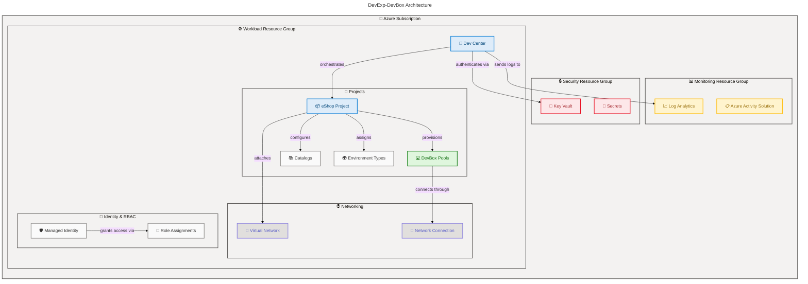

# DevExp-DevBox — Dev Box Adoption & Deployment Accelerator


**Overview**

DevExp-DevBox is an Infrastructure-as-Code accelerator that automates the
provisioning of Microsoft Dev Box environments on Azure. It enables platform
engineering teams to deploy fully configured Dev Centers, projects, catalogs,
DevBox pools, networking, security, identity, and monitoring resources using a
single command.

Built with Azure Bicep and deployed via Azure Developer CLI (`azd`), this
accelerator follows Azure Landing Zone principles to deliver enterprise-grade
developer experiences. Teams can onboard developers to self-service Dev Box
environments in minutes instead of days, reducing manual setup and ensuring
consistent, secure configurations across the organization.

## 📑 Table of Contents

- [Architecture](#-architecture)
- [Features](#-features)
- [Prerequisites](#-prerequisites)
- [Quick Start](#-quick-start)
- [Deployment](#-deployment)
- [Usage](#-usage)
- [Configuration](#-configuration)
- [Contributing](#-contributing)
- [License](#-license)

## 🏗️ Architecture

**Overview**

The accelerator follows an Azure Landing Zone architecture with clear separation
into security, monitoring, and workload resource groups. This separation ensures
that security controls, observability, and workload resources are independently
managed and governed, aligning with enterprise compliance requirements.

The deployment orchestrates resources across three dedicated resource groups,
each scoped to a specific responsibility. Bicep modules load YAML configuration
files at compile time via `loadYamlContent()`, enabling declarative
infrastructure definitions without hardcoded values.


```mermaid
---
title: "DevExp-DevBox Architecture"
config:
  theme: base
  look: classic
  layout: dagre
  flowchart:
    htmlLabels: true
---
flowchart TB
    accTitle: DevExp-DevBox Architecture
    accDescr: Shows the Dev Box accelerator architecture with three resource groups for security, monitoring, and workload, including DevCenter, projects, pools, networking, and identity components

    %% ═══════════════════════════════════════════════════════════════════════════
    %% AZURE / FLUENT ARCHITECTURE PATTERN v1.1
    %% (Semantic + Structural + Font + Accessibility Governance)
    %% ═══════════════════════════════════════════════════════════════════════════
    %% PHASE 1 - STRUCTURAL: Direction explicit, flat topology, nesting ≤ 3
    %% PHASE 2 - SEMANTIC: Colors justified, max 5 semantic classes, neutral-first
    %% PHASE 3 - FONT: Dark text on light backgrounds, contrast ≥ 4.5:1
    %% PHASE 4 - ACCESSIBILITY: accTitle/accDescr present, icons on all nodes
    %% PHASE 5 - STANDARD: Governance block present, classDefs centralized
    %% ═══════════════════════════════════════════════════════════════════════════

    subgraph subscription["🏢 Azure Subscription"]
        direction TB

        subgraph securityRG["🔒 Security Resource Group"]
            direction LR
            kv["🔐 Key Vault"]:::danger
            secret["🔑 Secrets"]:::danger
        end

        subgraph monitoringRG["📊 Monitoring Resource Group"]
            direction LR
            la["📈 Log Analytics"]:::warning
            sol["📋 Azure Activity Solution"]:::warning
        end

        subgraph workloadRG["⚙️ Workload Resource Group"]
            direction TB

            dc["🏢 Dev Center"]:::core

            subgraph projects["📂 Projects"]
                direction LR
                proj["📦 eShop Project"]:::core
                cat["📚 Catalogs"]:::neutral
                env["🌍 Environment Types"]:::neutral
                pool["💻 DevBox Pools"]:::success
            end

            subgraph connectivity["🌐 Networking"]
                direction LR
                vnet["🔗 Virtual Network"]:::data
                nc["🔗 Network Connection"]:::data
            end

            subgraph identity["👤 Identity & RBAC"]
                direction LR
                mi["🛡️ Managed Identity"]:::neutral
                rbac["🔐 Role Assignments"]:::neutral
            end
        end
    end

    dc -->|"orchestrates"| proj
    proj -->|"provisions"| pool
    proj -->|"configures"| cat
    proj -->|"assigns"| env
    proj -->|"attaches"| vnet
    dc -->|"authenticates via"| kv
    dc -->|"sends logs to"| la
    pool -->|"connects through"| nc
    mi -->|"grants access via"| rbac

    style subscription fill:#F3F2F1,stroke:#605E5C,stroke-width:2px
    style securityRG fill:#F3F2F1,stroke:#605E5C,stroke-width:2px
    style monitoringRG fill:#F3F2F1,stroke:#605E5C,stroke-width:2px
    style workloadRG fill:#F3F2F1,stroke:#605E5C,stroke-width:2px
    style projects fill:#F3F2F1,stroke:#605E5C,stroke-width:2px
    style connectivity fill:#F3F2F1,stroke:#605E5C,stroke-width:2px
    style identity fill:#F3F2F1,stroke:#605E5C,stroke-width:2px

    classDef neutral fill:#FAFAFA,stroke:#8A8886,stroke-width:2px,color:#323130
    classDef core fill:#DEECF9,stroke:#0078D4,stroke-width:2px,color:#004578
    classDef success fill:#DFF6DD,stroke:#107C10,stroke-width:2px,color:#0B6A0B
    classDef warning fill:#FFF4CE,stroke:#FFB900,stroke-width:2px,color:#986F0B
    classDef danger fill:#FDE7E9,stroke:#E81123,stroke-width:2px,color:#A4262C
    classDef data fill:#E1DFDD,stroke:#8378DE,stroke-width:2px,color:#5B5FC7
```

**Component Roles:**

| Component            | Purpose                                                                       | Resource Group |
| -------------------- | ----------------------------------------------------------------------------- | -------------- |
| 🏢 Dev Center        | Central management hub for developer environments                             | Workload       |
| 📦 Projects          | Logical groupings of DevBox pools, catalogs, and environment types            | Workload       |
| 💻 DevBox Pools      | Pre-configured VM pools for developer workstations                            | Workload       |
| 📚 Catalogs          | GitHub or Azure DevOps Git repositories for environment and image definitions | Workload       |
| 🌍 Environment Types | Deployment stages such as dev, staging, and UAT                               | Workload       |
| 🔐 Key Vault         | Secure storage for secrets and access tokens                                  | Security       |
| 📈 Log Analytics     | Centralized logging and monitoring workspace                                  | Monitoring     |
| 🔗 Virtual Network   | Network connectivity for unmanaged VNET scenarios                             | Workload       |
| 🛡️ Managed Identity  | SystemAssigned identity with RBAC role assignments                            | Workload       |

## ✨ Features

**Overview**

This accelerator provides a comprehensive set of capabilities for deploying and
managing Microsoft Dev Box infrastructure at enterprise scale. Each feature is
designed to reduce manual provisioning effort and enforce organizational
standards across development environments.

The modular Bicep architecture enables teams to customize deployments through
YAML configuration files without modifying infrastructure code directly. This
separation of configuration from logic ensures reproducibility, auditability,
and safe multi-environment rollouts.

| Feature                       | Description                                                                                                          |
| ----------------------------- | -------------------------------------------------------------------------------------------------------------------- |
| ⚡ One-Command Deployment     | Deploy the entire Dev Box landing zone with a single `azd provision` command                                         |
| 🔒 Enterprise Security        | Key Vault integration with RBAC authorization, purge protection, and soft delete                                     |
| 📊 Centralized Monitoring     | Log Analytics workspace with diagnostic settings on all resources                                                    |
| ⚙️ YAML-Driven Configuration  | Declarative YAML files for DevCenter, security, and resource organization settings                                   |
| 🌐 Flexible Networking        | Support for both Managed and Unmanaged VNET configurations with subnet provisioning                                  |
| 👤 Identity & RBAC            | SystemAssigned managed identities with granular role assignments at subscription, resource group, and project scopes |
| 📚 Catalog Management         | GitHub and Azure DevOps Git catalog integration for environment and image definitions                                |
| 🏗️ Multi-Project Support      | Deploy multiple projects with independent pools, catalogs, and environment types                                     |
| 🔗 Source Control Integration | Automated authentication and token management for GitHub and Azure DevOps                                            |
| 🧹 Clean Teardown             | Automated cleanup script to remove all provisioned resources and credentials                                         |

## 📋 Prerequisites

**Overview**

Before deploying the accelerator, ensure the required tools are installed and
the necessary Azure permissions are in place. The setup scripts validate
prerequisites automatically, but having them pre-installed avoids interruptions
during deployment.

An active Azure subscription with Contributor and User Access Administrator
roles is required because the deployment creates resource groups, assigns RBAC
roles, and provisions resources at the subscription scope.

> [!IMPORTANT] You must have **Contributor** and **User Access Administrator**
> roles on your Azure subscription to deploy this accelerator. The deployment
> creates resource groups and assigns RBAC roles at the subscription scope.

| Prerequisite                   | Version | Purpose                                                     |
| ------------------------------ | ------- | ----------------------------------------------------------- |
| ☁️ Azure Subscription          | Active  | Target subscription for resource deployment                 |
| 🛠️ Azure CLI                   | >= 2.50 | Azure resource management and authentication                |
| 📦 Azure Developer CLI (`azd`) | >= 1.0  | Infrastructure provisioning and environment management      |
| 🔑 GitHub CLI (`gh`)           | >= 2.0  | GitHub authentication and token retrieval (if using GitHub) |
| 💻 PowerShell                  | >= 7.0  | Setup script execution on Windows (`setUp.ps1`)             |
| 🐧 Bash                        | >= 4.0  | Setup script execution on Linux/macOS (`setUp.sh`)          |
| 📋 jq                          | >= 1.6  | JSON processing in Bash setup script                        |

## 🚀 Quick Start

**Overview**

Get a Dev Box environment running in your Azure subscription with these steps.
The setup script handles authentication, environment initialization, and
provisioning automatically.

> [!TIP] Use the PowerShell script (`setUp.ps1`) on Windows or the Bash script
> (`setUp.sh`) on Linux/macOS. Both scripts perform identical operations.

**1. Clone the repository:**

```bash
git clone https://github.com/Evilazaro/DevExp-DevBox.git
cd DevExp-DevBox
```

**Expected output:**

```text
Cloning into 'DevExp-DevBox'...
remote: Enumerating objects: done.
remote: Counting objects: 100% (150/150), done.
Receiving objects: 100% (150/150), done.
```

**2. Authenticate with Azure:**

```bash
az login
azd auth login
```

**Expected output:**

```text
A web browser has been opened at https://login.microsoftonline.com/...
You have logged in. Now let us find all the subscriptions to which you have access...
Logged in to Azure.
```

**3. Run the setup script:**

```powershell
./setUp.ps1 -EnvName "dev" -SourceControl "github"
```

**Expected output:**

```text
✅ Prerequisites validated
✅ Azure authentication confirmed
✅ GitHub CLI authenticated
✅ Environment 'dev' initialized
✅ Provisioning started...
```

> [!NOTE] On Linux/macOS, use `./setUp.sh -e "dev" -s "github"` instead.

## 📦 Deployment

**Overview**

The deployment process uses Azure Developer CLI (`azd`) to provision
infrastructure defined in Bicep templates. The setup scripts automate
authentication, environment configuration, and the `azd provision` command.
Resources deploy in dependency order: Monitoring, then Security, then Workload.

> [!WARNING] Deploying this accelerator provisions Azure resources that incur
> costs. Review the resource configuration in `infra/settings/` before deploying
> to understand the VM SKUs, Key Vault settings, and networking options
> selected.

### Deployment Steps

**1. Configure environment variables:**

The setup script creates an `.azure/{envName}/.env` file with required
variables:

```text
KEY_VAULT_SECRET=<your-github-pat-or-ado-token>
SOURCE_CONTROL_PLATFORM=github
```

**Expected output:** _(no output on success — file is created silently)_

**2. Provision infrastructure:**

```bash
azd provision
```

**Expected output:**

```text
Provisioning Azure resources (azd provision)

Subscription: <your-subscription-name> (<subscription-id>)
Location: eastus2

  (✓) Done: Resource group: devexp-security-dev-eastus2-RG
  (✓) Done: Resource group: devexp-monitoring-dev-eastus2-RG
  (✓) Done: Resource group: devexp-workload-dev-eastus2-RG
  (✓) Done: Log Analytics Workspace
  (✓) Done: Key Vault
  (✓) Done: Dev Center
  (✓) Done: Project: eShop

SUCCESS: Your application was provisioned in Azure.
```

**3. Verify deployment:**

```bash
az resource list --resource-group devexp-workload-dev-eastus2-RG --output table
```

**Expected output:**

```text
Name                Type                                    Location
------------------  --------------------------------------  --------
devexp-devcenter    Microsoft.DevCenter/devcenters           eastus2
eShop               Microsoft.DevCenter/projects             eastus2
```

### Clean Up Resources

To remove all provisioned resources and credentials:

```powershell
./cleanSetUp.ps1 -EnvName "dev" -Location "eastus2"
```

**Expected output:**

```text
Removing subscription-level deployments...
Removing resource groups...
Cleanup completed successfully.
```

## 💻 Usage

**Overview**

After deployment, platform administrators manage infrastructure through YAML
configuration files, while developers access self-service Dev Box environments
through the Azure portal or CLI. The modular architecture supports adding new
projects, pools, and catalogs by updating configuration files and re-running
`azd provision`.

### Adding a New Project

Add a new project entry to `infra/settings/workload/devcenter.yaml`:

```yaml
projects:
  - name: 'newProject'
    description: 'New development project'
    tags:
      environment: 'dev'
      project: 'newProject'
    network:
      virtualNetworkType: 'Managed'
      addressPrefixes: '10.1.0.0/16'
      subnets:
        - name: 'default'
          addressPrefix: '10.1.1.0/24'
    pools:
      - name: 'dev-pool'
        vmSku: 'general_i_16c64gb256ssd_v2'
```

**Expected output:** _(configuration file updated — re-run `azd provision` to
apply)_

### Accessing Dev Box Environments

Developers access their provisioned Dev Box environments through the Microsoft
Dev Box portal:

```text
https://devbox.microsoft.com
```

**Expected output:**

```text
Dev Box portal loads with available pools:
  - backend-engineer (32 vCPU, 128GB RAM, 512GB SSD)
  - frontend-engineer (16 vCPU, 64GB RAM, 256GB SSD)
```

> [!CAUTION] VM SKU availability varies by Azure region. Verify that the
> selected SKUs are available in your target region before deployment by running
> `az devcenter admin sku list --location <region>`.

## ⚙️ Configuration

**Overview**

Configuration is managed through YAML files in the `infra/settings/` directory,
organized by domain. This declarative approach separates infrastructure logic
from environment-specific values, enabling teams to customize deployments
without modifying Bicep modules.

Each YAML file has a corresponding JSON schema for validation. Bicep modules
load these files at compile time using `loadYamlContent()`, ensuring type safety
and early error detection.

| Parameter             | File                  | Description                           | Default                       |
| --------------------- | --------------------- | ------------------------------------- | ----------------------------- |
| ⚙️ DevCenter Name     | `devcenter.yaml`      | Name of the Dev Center resource       | `devexp-devcenter`            |
| 🌍 Environment Types  | `devcenter.yaml`      | Deployment stages (dev, staging, UAT) | `dev, staging, uat`           |
| 💻 Pool VM SKUs       | `devcenter.yaml`      | VM sizes for DevBox pools             | `general_i_32c128gb512ssd_v2` |
| 🔗 Network Type       | `devcenter.yaml`      | Managed or Unmanaged VNET             | `Managed`                     |
| 📁 Address Prefixes   | `devcenter.yaml`      | VNET address space                    | `10.0.0.0/16`                 |
| 🔐 Key Vault Name     | `security.yaml`       | Name prefix for Key Vault resource    | `contoso`                     |
| 🔑 Secret Name        | `security.yaml`       | Name of the stored secret             | `gha-token`                   |
| 🛡️ Purge Protection   | `security.yaml`       | Enable purge protection on Key Vault  | `true`                        |
| 📊 Workload RG Name   | `azureResources.yaml` | Workload resource group name          | `devexp-workload`             |
| 🔒 Security RG Name   | `azureResources.yaml` | Security resource group name          | `devexp-security`             |
| 📈 Monitoring RG Name | `azureResources.yaml` | Monitoring resource group name        | `devexp-monitoring`           |

### Configuration Files

| File                                                         | Purpose                                                               |
| ------------------------------------------------------------ | --------------------------------------------------------------------- |
| 📁 `infra/settings/workload/devcenter.yaml`                  | DevCenter, projects, catalogs, pools, identity, and environment types |
| 🔒 `infra/settings/security/security.yaml`                   | Key Vault settings, secret configuration, and purge protection        |
| 🌍 `infra/settings/resourceOrganization/azureResources.yaml` | Resource group names, tags, and Azure Landing Zone organization       |
| 📋 `infra/main.parameters.json`                              | Bicep deployment parameters linked to `azd` environment variables     |

### Deployment Parameters

The `infra/main.parameters.json` file maps `azd` environment variables to Bicep
parameters:

```json
{
  "parameters": {
    "environmentName": { "value": "${AZURE_ENV_NAME}" },
    "location": { "value": "${AZURE_LOCATION}" },
    "secretValue": { "value": "${KEY_VAULT_SECRET}" }
  }
}
```

**Expected output:** _(configuration reference — no runtime output)_

### Supported Azure Regions

The deployment supports the following Azure regions:

```text
eastus, eastus2, westus, westus2, westus3, centralus,
northeurope, westeurope, southeastasia, australiaeast,
japaneast, uksouth, canadacentral, swedencentral,
switzerlandnorth, germanywestcentral
```

**Expected output:** _(reference list — no runtime output)_

## 🤝 Contributing

**Overview**

Contributions to this accelerator follow a product-oriented delivery model with
Epics, Features, and Tasks. The project values infrastructure quality,
idempotency, and documentation-as-code practices to maintain a reliable and
reproducible deployment experience.

All contributions must adhere to the engineering standards defined in
`CONTRIBUTING.md`, including parameterized Bicep modules, PowerShell 7+
compatibility, and docs-as-code principles.

Please read [CONTRIBUTING.md](CONTRIBUTING.md) for detailed guidelines on:

- Issue management using GitHub Issue Forms (Epics, Features, Tasks)
- Branch naming conventions (`feature/`, `task/`, `fix/`, `docs/`)
- Pull request requirements and validation evidence
- Engineering standards for Bicep, PowerShell, and documentation
- Definition of Done for Tasks, Features, and Epics

> [!NOTE] Every Pull Request must reference the issue it closes, include a
> summary of changes, test or validation evidence, and documentation updates if
> applicable.

## 📄 License

This project is licensed under the [MIT License](LICENSE).

Copyright (c) 2025 Evilázaro Alves
