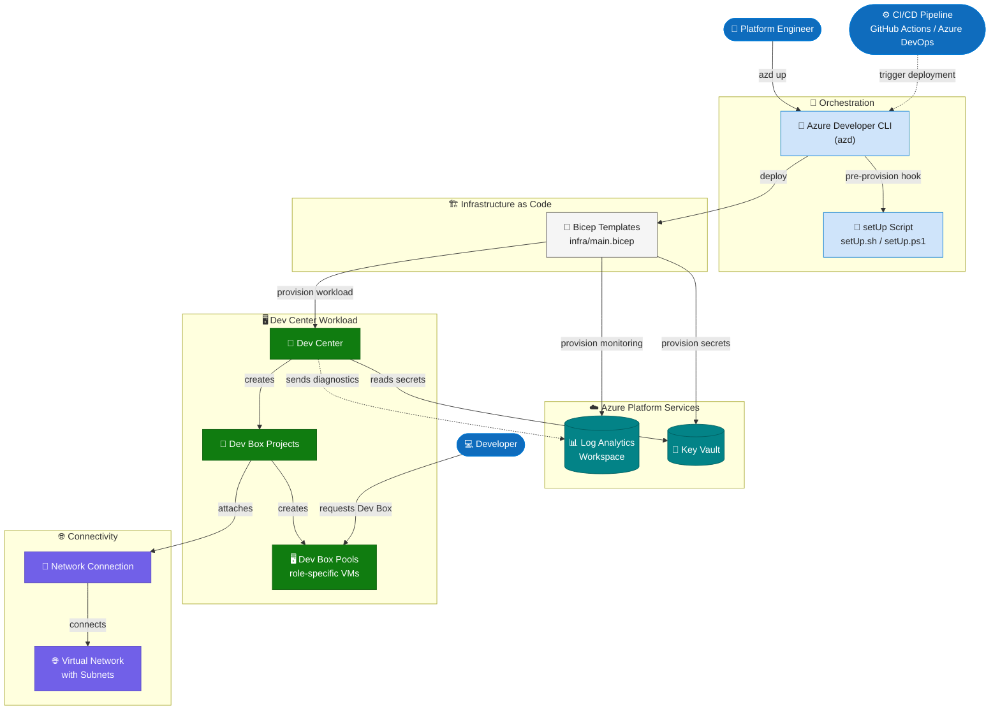

# DevExp-DevBox — Microsoft Dev Box Accelerator


**DevExp-DevBox** is an Infrastructure as Code (IaC) accelerator that provisions
a fully configured
[Microsoft Dev Box](https://learn.microsoft.com/en-us/azure/dev-box/overview-what-is-microsoft-dev-box)
environment on Azure, enabling platform engineering teams to deliver
standardized, cloud-hosted developer workstations at scale.

Platform engineers and development teams face significant toil when onboarding
new contributors: installing tools, configuring networks, and granting the right
permissions can take days. DevExp-DevBox solves this by automating the
end-to-end provisioning of Azure Dev Center, Dev Box projects, role-specific VM
pools, secure networking, Key Vault–backed secrets, and Log Analytics
monitoring—all driven by declarative YAML configuration files.

The accelerator is built with **Azure Bicep** for infrastructure declaration,
**Azure Developer CLI (`azd`)** for orchestration, and **PowerShell/Bash** setup
scripts that integrate with either GitHub or Azure DevOps. Developers gain a
ready-to-use cloud workstation within minutes of a single `azd up` command.

## Table of Contents

- [Features](#features)
- [Architecture](#architecture)
- [Technologies Used](#technologies-used)
- [Quick Start](#quick-start)
- [Configuration](#configuration)
- [Deployment](#deployment)
- [Usage](#usage)
- [Contributing](#contributing)
- [License](#license)

## Features

- 🏢 **Azure Dev Center provisioning** — deploys a Dev Center with catalog sync,
  Microsoft-hosted networking, and Azure Monitor agent support enabled by
  default.
- 📁 **Multi-project support** — creates role-specific Dev Box projects (for
  example, `eShop`) each with their own identity and RBAC assignments.
- 🖥️ **Role-specific Dev Box pools** — configures separate VM pools per
  engineering role (for example, `backend-engineer`, `frontend-engineer`) with
  appropriate SKUs.
- 🌐 **Managed virtual network** — provisions or reuses Azure Virtual Networks
  with configurable address spaces and subnets per project.
- 🔐 **Key Vault integration** — stores and retrieves secrets (for example,
  source control access tokens) with RBAC-based access for the Dev Center
  managed identity.
- 📊 **Centralized monitoring** — deploys a Log Analytics Workspace with
  diagnostic settings for all workload resources.
- 📜 **Declarative YAML configuration** — resource organization, security, and
  Dev Center settings are fully described in version-controlled YAML files; no
  code changes required for common customizations.
- ⚙️ **GitHub and Azure DevOps support** — pre-provision hooks wire up
  credentials for both `github` and `adogit` source control platforms
  automatically.
- 🧹 **Full cleanup automation** — `cleanSetUp.ps1` removes all deployed
  resources, role assignments, service principals, and CI/CD secrets.
- 🏷️ **Azure Landing Zone alignment** — resource groups are organized into
  workload, security, and monitoring landing zones following Azure Cloud
  Adoption Framework guidance.

## Architecture

**DevExp-DevBox** centers on Azure Dev Center as the developer platform hub. A
**Platform Engineer** runs `azd up`, which triggers pre-provision setup scripts
that authenticate to the chosen source control platform before deploying Bicep
templates at subscription scope. The Bicep templates provision a Log Analytics
Workspace for observability, a Key Vault for secrets, and a Dev Center workload
that creates Dev Box Projects and role-specific Pools connected to per-project
Virtual Networks. **Developers** authenticate to the Dev Center and request a
cloud workstation from a pool; **CI/CD pipelines** can trigger the same `azd up`
flow non-interactively.


```mermaid
---
config:
  primaryColor: "#0f6cbd"
  primaryTextColor: "#FFFFFF"
  primaryBorderColor: "#0078d4"
  lineColor: "#242424"
  secondaryColor: "#f5f5f5"
  tertiaryColor: "#cfe4fa"
---
flowchart TB

  %% ── Actors ──────────────────────────────────────────────────────
  PlatEng(["👷 Platform Engineer"])
  Dev(["💻 Developer"])
  CICD(["⚙️ CI/CD Pipeline<br/>GitHub Actions / Azure DevOps"])

  %% ── Orchestration Layer ──────────────────────────────────────────
  subgraph Orchestration["🚀 Orchestration"]
    AZD["🔧 Azure Developer CLI<br/>(azd)"]
    SetUp["📜 setUp Script<br/>setUp.sh / setUp.ps1"]
  end

  %% ── Infrastructure as Code Layer ────────────────────────────────
  subgraph IaC["🏗️ Infrastructure as Code"]
    Bicep["📐 Bicep Templates<br/>infra/main.bicep"]
  end

  %% ── Platform Services ────────────────────────────────────────────
  subgraph Platform["☁️ Azure Platform Services"]
    LogA[("📊 Log Analytics<br/>Workspace")]
    KV[("🔐 Key Vault")]
  end

  %% ── Dev Center Workload ──────────────────────────────────────────
  subgraph Workload["🖥️ Dev Center Workload"]
    DevCenter["🏢 Dev Center"]
    Project["📁 Dev Box Projects"]
    Pool["🖥️ Dev Box Pools<br/>role-specific VMs"]
  end

  %% ── Connectivity ─────────────────────────────────────────────────
  subgraph Network["🌐 Connectivity"]
    NetConn["🔗 Network Connection"]
    VNet["🌐 Virtual Network<br/>with Subnets"]
  end

  %% ── Interactions ─────────────────────────────────────────────────
  PlatEng -- "azd up" --> AZD
  CICD -. "trigger deployment" .-> AZD
  AZD -- "pre-provision hook" --> SetUp
  AZD -- "deploy" --> Bicep
  Bicep -- "provision monitoring" --> LogA
  Bicep -- "provision secrets" --> KV
  Bicep -- "provision workload" --> DevCenter
  DevCenter -- "reads secrets" --> KV
  DevCenter -. "sends diagnostics" .-> LogA
  DevCenter -- "creates" --> Project
  Project -- "creates" --> Pool
  Project -- "attaches" --> NetConn
  NetConn -- "connects" --> VNet
  Dev -- "requests Dev Box" --> Pool

  %% ── Styles ───────────────────────────────────────────────────────
  classDef actor fill:#0f6cbd,stroke:#0078d4,color:#ffffff
  classDef orchestration fill:#cfe4fa,stroke:#0078d4,color:#242424
  classDef iac fill:#f5f5f5,stroke:#605e5c,color:#242424
  classDef datastore fill:#038387,stroke:#025d60,color:#ffffff
  classDef workload fill:#107c10,stroke:#0b5e0b,color:#ffffff
  classDef network fill:#7160e8,stroke:#5b4bc4,color:#ffffff

  class PlatEng,Dev,CICD actor
  class AZD,SetUp orchestration
  class Bicep iac
  class LogA,KV datastore
  class DevCenter,Project,Pool workload
  class VNet,NetConn network
```

## Technologies Used

| Technology                                                                                                    | Type                 | Purpose                                                                 |
| ------------------------------------------------------------------------------------------------------------- | -------------------- | ----------------------------------------------------------------------- |
| [Azure Bicep](https://learn.microsoft.com/en-us/azure/azure-resource-manager/bicep/overview)                  | IaC language         | Declares all Azure resources at subscription scope                      |
| [Azure Developer CLI (`azd`)](https://learn.microsoft.com/en-us/azure/developer/azure-developer-cli/overview) | CLI / orchestrator   | Provisions, deploys, and tears down the full environment                |
| [Azure Dev Center](https://learn.microsoft.com/en-us/azure/dev-box/overview-what-is-microsoft-dev-box)        | Azure PaaS           | Central platform for Dev Box management and project hosting             |
| [Microsoft Dev Box](https://learn.microsoft.com/en-us/azure/dev-box/overview-what-is-microsoft-dev-box)       | Azure PaaS           | Cloud-hosted developer workstation service                              |
| [Azure Key Vault](https://learn.microsoft.com/en-us/azure/key-vault/general/overview)                         | Azure PaaS           | Secure storage for secrets such as source control tokens                |
| [Azure Log Analytics](https://learn.microsoft.com/en-us/azure/azure-monitor/logs/log-analytics-overview)      | Azure PaaS           | Centralized monitoring and diagnostic log collection                    |
| [Azure Virtual Network](https://learn.microsoft.com/en-us/azure/virtual-network/virtual-networks-overview)    | Azure networking     | Per-project network isolation for Dev Box pools                         |
| PowerShell                                                                                                    | Scripting language   | Setup and cleanup automation (`setUp.ps1`, `cleanSetUp.ps1`)            |
| Bash                                                                                                          | Scripting language   | Cross-platform setup automation (`setUp.sh`)                            |
| YAML                                                                                                          | Configuration format | Declarative configuration for Dev Center, resource groups, and security |
| [Azure CLI (`az`)](https://learn.microsoft.com/en-us/cli/azure/)                                              | CLI                  | Azure authentication and resource management                            |
| [GitHub CLI (`gh`)](https://cli.github.com/)                                                                  | CLI                  | GitHub authentication and secret management                             |

## Quick Start

### Prerequisites

| Prerequisite                                                                                                     | Minimum Version | Notes                                                                                |
| ---------------------------------------------------------------------------------------------------------------- | --------------- | ------------------------------------------------------------------------------------ |
| [Azure CLI](https://learn.microsoft.com/en-us/cli/azure/install-azure-cli)                                       | 2.60+           | Required for authentication                                                          |
| [Azure Developer CLI (`azd`)](https://learn.microsoft.com/en-us/azure/developer/azure-developer-cli/install-azd) | 1.9+            | Required for provisioning                                                            |
| [GitHub CLI (`gh`)](https://cli.github.com/)                                                                     | 2.40+           | Required when `SOURCE_CONTROL_PLATFORM=github`                                       |
| PowerShell                                                                                                       | 5.1+            | Required on Windows                                                                  |
| Bash                                                                                                             | 5.0+            | Required on Linux/macOS                                                              |
| Azure subscription                                                                                               | —               | Caller needs **Contributor** and **User Access Administrator** at subscription scope |

### Installation

1. Clone the repository.

   ```bash
   git clone https://github.com/Evilazaro/DevExp-DevBox.git
   cd DevExp-DevBox
   ```

2. Authenticate with Azure CLI and Azure Developer CLI.

   ```bash
   az login
   azd auth login
   ```

3. Authenticate with GitHub CLI (skip if using Azure DevOps).

   ```bash
   gh auth login
   ```

4. Review and customize the YAML configuration files under `infra/settings/` as
   needed (see [Configuration](#configuration)).

5. Deploy the full environment.

   ```bash
   azd up
   ```

   > [!NOTE] `azd up` prompts for the environment name (`AZURE_ENV_NAME`), the
   > target Azure subscription, and the Azure region. It then runs the
   > pre-provision hook to configure the source control integration before
   > deploying all Bicep templates.

## Configuration

All configuration is managed through YAML files in `infra/settings/`. No Bicep
code changes are needed for common customizations.

### Dev Center settings — `infra/settings/workload/devcenter.yaml`

| Option                                 | Default                                              | Description                                       |
| -------------------------------------- | ---------------------------------------------------- | ------------------------------------------------- |
| `name`                                 | `devexp`                                             | Name of the Azure Dev Center resource             |
| `catalogItemSyncEnableStatus`          | `Enabled`                                            | Enables automatic catalog item synchronization    |
| `microsoftHostedNetworkEnableStatus`   | `Enabled`                                            | Enables Microsoft-hosted networking for Dev Boxes |
| `installAzureMonitorAgentEnableStatus` | `Enabled`                                            | Installs the Azure Monitor agent on Dev Boxes     |
| `catalogs[].uri`                       | `https://github.com/microsoft/devcenter-catalog.git` | Git repository URI for a Dev Center catalog       |
| `catalogs[].branch`                    | `main`                                               | Branch to track for catalog synchronization       |
| `projects[].name`                      | `eShop`                                              | Name of the Dev Box project                       |
| `projects[].pools[].vmSku`             | `general_i_32c128gb512ssd_v2`                        | VM SKU for a Dev Box pool                         |
| `environmentTypes[].name`              | `dev`, `staging`, `uat`                              | Names of available deployment environment types   |

**Example — change the Dev Center name and add a project:**

```yaml
# infra/settings/workload/devcenter.yaml
name: 'mydevexp'

projects:
  - name: 'my-team'
    description: 'My team project.'
    pools:
      - name: 'fullstack-engineer'
        imageDefinitionName: 'my-fullstack-image'
        vmSku: general_i_16c64gb256ssd_v2
```

### Resource organization — `infra/settings/resourceOrganization/azureResources.yaml`

| Option              | Default           | Description                                            |
| ------------------- | ----------------- | ------------------------------------------------------ |
| `workload.name`     | `devexp-workload` | Name prefix for the workload resource group            |
| `workload.create`   | `true`            | Whether to create the workload resource group          |
| `security.create`   | `false`           | Whether to create a separate security resource group   |
| `monitoring.create` | `false`           | Whether to create a separate monitoring resource group |

> [!TIP] Set `security.create: true` and provide a distinct `security.name` to
> isolate Key Vault resources in a dedicated resource group, following Azure
> Landing Zone best practices.

### Environment variables

| Variable                  | Default             | Description                                          |
| ------------------------- | ------------------- | ---------------------------------------------------- |
| `AZURE_ENV_NAME`          | _(prompted by azd)_ | Short environment name used in resource group naming |
| `SOURCE_CONTROL_PLATFORM` | `github`            | Source control platform: `github` or `adogit`        |

**Example — set environment variables before running `azd up`:**

```bash
export AZURE_ENV_NAME="dev"
export SOURCE_CONTROL_PLATFORM="github"
azd up
```

## Deployment

1. Complete all steps in [Quick Start](#quick-start).

2. Verify that the account used has **Contributor** and **User Access
   Administrator** roles at subscription scope.

   ```bash
   az role assignment list --assignee $(az account show --query user.name -o tsv) \
     --scope /subscriptions/$(az account show --query id -o tsv) \
     --query "[].roleDefinitionName" -o table
   ```

3. Set the target environment name and source control platform.

   ```bash
   export AZURE_ENV_NAME="dev"
   export SOURCE_CONTROL_PLATFORM="github"
   ```

4. Run the full provisioning pipeline.

   ```bash
   azd up
   ```

   `azd up` performs the following actions in sequence:
   - Runs the pre-provision hook (`setUp.sh` on Linux/macOS, `setUp.ps1` on
     Windows) to authenticate and configure the source control integration.
   - Deploys `infra/main.bicep` at subscription scope, creating resource groups
     and deploying all modules.
   - Outputs the names and IDs of deployed resources (Dev Center, Key Vault, Log
     Analytics Workspace).

5. To tear down all resources, run the cleanup script.

   ```powershell
   .\cleanSetUp.ps1 -EnvName "dev" -Location "eastus2"
   ```

> [!WARNING] `cleanSetUp.ps1` deletes Azure resource groups, removes role
> assignments, deletes service principals, and removes GitHub secrets. This
> action is irreversible. Review the parameters before running.

> [!IMPORTANT] Refer to the
> [project documentation](https://evilazaro.github.io/DevExp-DevBox/) for
> detailed deployment guides and role configuration references.

## Usage

### Verify the deployed Dev Center

After `azd up` completes, confirm the Dev Center is running using the Azure CLI.

```bash
# List Dev Centers in the workload resource group
az devcenter admin devcenter list \
  --resource-group "devexp-workload-dev-eastus2-RG" \
  --query "[].{Name:name, Status:provisioningState}" \
  -o table
```

Expected output:

```
Name       Status
---------  ---------
devexp     Succeeded
```

### List Dev Box projects

```bash
az devcenter admin project list \
  --resource-group "devexp-workload-dev-eastus2-RG" \
  --query "[].{Project:name, Description:description}" \
  -o table
```

### Access a Dev Box as a developer

Developers assigned to a project can create and connect to a Dev Box through the
[Microsoft Dev Box portal](https://devbox.microsoft.com) or by using the Azure
CLI.

```bash
# Create a Dev Box in the backend-engineer pool
az devcenter dev dev-box create \
  --dev-center-name "devexp" \
  --project-name "eShop" \
  --pool-name "backend-engineer" \
  --name "my-devbox" \
  --user-id "me"
```

> [!NOTE] The user must have the **Dev Box User** role on the project to create
> and connect to Dev Boxes.

### Run only the setup script (without full `azd up`)

```powershell
# Windows
.\setUp.ps1 -EnvName "dev" -SourceControl "github"
```

```bash
# Linux / macOS
./setUp.sh -e dev -s github
```

## Contributing

Contributions are welcome. To contribute to this project:

1. Open an issue in the
   [GitHub issue tracker](https://github.com/Evilazaro/DevExp-DevBox/issues) to
   discuss the change before submitting a pull request.
2. Fork the repository and create a feature branch from `main`.
3. Make your changes and ensure all Bicep files pass linting with
   `az bicep build`.
4. Submit a pull request against `main` with a clear description of the change
   and its motivation.
5. A project maintainer will review and merge approved contributions.

> [!NOTE] Please follow the existing YAML configuration patterns and Bicep
> coding conventions when contributing infrastructure changes.

## License

This project is licensed under the **MIT License**. See the [LICENSE](LICENSE)
file for the full license text.
