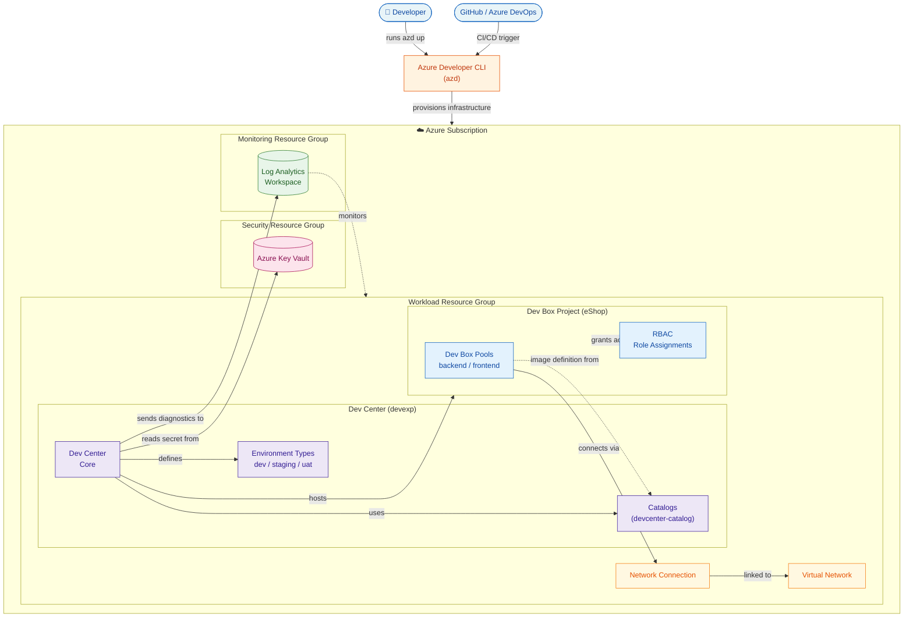

# ContosoDevExp — Microsoft Dev Box Accelerator

[](https://opensource.org/licenses/MIT)
[](https://learn.microsoft.com/en-us/azure/developer/azure-developer-cli/)
[](https://learn.microsoft.com/en-us/azure/azure-resource-manager/bicep/overview)
[](https://azure.microsoft.com)

**ContosoDevExp** is an Azure Developer CLI (azd) accelerator that provisions
and manages enterprise-grade
[Microsoft Dev Box](https://learn.microsoft.com/en-us/azure/dev-box/overview-what-is-microsoft-dev-box)
environments on Azure using Infrastructure as Code (Bicep). It delivers
consistent, cloud-hosted developer workstations that are version-controlled,
repeatable, and aligned with Azure Landing Zone principles.

The accelerator encapsulates all infrastructure concerns — Dev Centers, Dev Box
Projects, Virtual Networks, Azure Key Vault, and Log Analytics — into a single
configuration-driven deployment. Platform engineering teams define workloads,
security policies, and network topology through YAML files, and `azd up` handles
the rest, integrating with either GitHub Actions or Azure DevOps for CI/CD.

Whether you are on-boarding a new engineering team to a cloud workstation or
standardizing developer environments across multiple projects, **ContosoDevExp**
shortens provisioning time from days to minutes while enforcing organizational
governance, least-privilege RBAC, and observability from day one.

---

## Table of Contents

- [Features](#features)
- [Architecture](#architecture)
- [Technologies Used](#technologies-used)
- [Quick Start](#quick-start)
  - [Prerequisites](#prerequisites)
  - [Installation](#installation)
  - [Running Locally](#running-locally)
- [Configuration](#configuration)
  - [Resource Organization](#resource-organization)
  - [Security](#security)
  - [Dev Center and Projects](#dev-center-and-projects)
  - [Environment Variables](#environment-variables)
- [Deployment](#deployment)
- [Usage](#usage)
- [Contributing](#contributing)
- [License](#license)

---

## Features

- 🏗️ **Infrastructure as Code** — Full Bicep deployment scoped to Azure
  Subscription, covering resource groups, Dev Center, Key Vault, VNet, and Log
  Analytics
- 🖥️ **Microsoft Dev Box** — Provisions role-specific Dev Box pools (e.g.,
  backend and frontend engineers) with image definitions and VM SKUs
- 🌐 **Flexible Networking** — Supports both Azure-managed and customer-managed
  (Unmanaged) virtual networks with subnet-level control
- 🔐 **Secure by Default** — Azure Key Vault with RBAC authorization, purge
  protection, and soft-delete stores all sensitive credentials
- 📊 **Built-in Observability** — Log Analytics Workspace with diagnostic
  settings wired to all deployed resources out of the box
- ⚙️ **YAML-Driven Configuration** — All resource organization, security, and
  workload settings are expressed in plain YAML files — no Bicep edits required
  for common changes
- 🔄 **Multi-Source-Control Support** — Integrates with both GitHub (via GitHub
  CLI) and Azure DevOps for CI/CD credential management
- 🏢 **Multi-Project Support** — A single Dev Center can host multiple projects
  (e.g., `eShop`) each with independent pools, catalogs, and environment types
- 🎭 **Role-Based Access** — Least-privilege RBAC assignments for Dev Managers,
  project engineers (`Dev Box User`, `Deployment Environment User`), and the Dev
  Center managed identity
- 🌱 **Environment Lifecycle** — Pre-configured environment types (`dev`,
  `staging`, `uat`) map to Azure deployment targets per project

---

## Architecture

The diagram below shows how the main components of the accelerator are organized
and interact within an Azure Subscription.


```mermaid
flowchart TB
  %% External actors
  Developer(["👤 Developer"])
  GHADO(["GitHub / Azure DevOps"])

  %% CLI layer
  AZD["Azure Developer CLI<br/>(azd)"]

  subgraph AzSub["☁️ Azure Subscription"]

    subgraph MonRG["Monitoring Resource Group"]
      LogAnalytics[("Log Analytics<br/>Workspace")]
    end

    subgraph SecRG["Security Resource Group"]
      KeyVault[("Azure Key Vault")]
    end

    subgraph WkldRG["Workload Resource Group"]

      subgraph DCBlock["Dev Center (devexp)"]
        DevCenter["Dev Center<br/>Core"]
        Catalogs["Catalogs<br/>(devcenter-catalog)"]
        EnvTypes["Environment Types<br/>dev / staging / uat"]
      end

      subgraph ProjBlock["Dev Box Project (eShop)"]
        Pools["Dev Box Pools<br/>backend / frontend"]
        RoleAssign["RBAC<br/>Role Assignments"]
      end

      VNet["Virtual Network"]
      NetConn["Network Connection"]

    end

  end

  %% Relationships
  Developer -->|"runs azd up"| AZD
  GHADO -->|"CI/CD trigger"| AZD
  AZD -->|"provisions infrastructure"| AzSub
  DevCenter -->|"reads secret from"| KeyVault
  DevCenter -->|"sends diagnostics to"| LogAnalytics
  DevCenter -->|"uses"| Catalogs
  DevCenter -->|"defines"| EnvTypes
  DevCenter -->|"hosts"| ProjBlock
  Pools -->|"connects via"| NetConn
  NetConn -->|"linked to"| VNet
  ProjBlock -->|"grants access via"| RoleAssign
  Pools -.->|"image definition from"| Catalogs
  LogAnalytics -.->|"monitors"| WkldRG

  %% Styles
  classDef external fill:#e8f4f8,stroke:#1565C0,color:#0d47a1
  classDef cli fill:#fff3e0,stroke:#E65100,color:#bf360c
  classDef security fill:#fce4ec,stroke:#AD1457,color:#880e4f
  classDef monitoring fill:#e8f5e9,stroke:#2E7D32,color:#1b5e20
  classDef devcenter fill:#ede7f6,stroke:#4527A0,color:#311b92
  classDef project fill:#e3f2fd,stroke:#1565C0,color:#0d47a1
  classDef network fill:#fff8e1,stroke:#F57F17,color:#e65100

  class Developer,GHADO external
  class AZD cli
  class KeyVault security
  class LogAnalytics monitoring
  class DevCenter,Catalogs,EnvTypes devcenter
  class Pools,RoleAssign project
  class VNet,NetConn network
```

> [!NOTE] Solid arrows (`→`) represent direct provisioning or runtime
> dependencies. Dashed arrows (`⇢`) represent indirect or event-driven
> relationships (e.g., image resolution from catalogs, monitoring of the
> workload resource group).

---

## Technologies Used

| Technology                                                                                                             | Role                                                                                   |
| ---------------------------------------------------------------------------------------------------------------------- | -------------------------------------------------------------------------------------- |
| [Azure Bicep](https://learn.microsoft.com/en-us/azure/azure-resource-manager/bicep/overview)                           | Infrastructure as Code — all Azure resources are defined in Bicep modules              |
| [Azure Developer CLI (azd)](https://learn.microsoft.com/en-us/azure/developer/azure-developer-cli/)                    | Orchestrates provisioning, deployment hooks, and environment lifecycle                 |
| [Microsoft Dev Box](https://learn.microsoft.com/en-us/azure/dev-box/overview-what-is-microsoft-dev-box)                | Cloud-hosted developer workstations with role-specific configurations                  |
| [Azure Key Vault](https://learn.microsoft.com/en-us/azure/key-vault/general/overview)                                  | Secure storage for secrets (e.g., source control tokens) with RBAC authorization       |
| [Azure Log Analytics](https://learn.microsoft.com/en-us/azure/azure-monitor/logs/log-analytics-overview)               | Centralized monitoring and diagnostic logs for all deployed resources                  |
| [Azure Virtual Network](https://learn.microsoft.com/en-us/azure/virtual-network/virtual-networks-overview)             | Managed and unmanaged network connectivity for Dev Box pools                           |
| [PowerShell 5.1+](https://learn.microsoft.com/en-us/powershell/scripting/overview)                                     | Windows setup and cleanup automation (`setUp.ps1`, `cleanSetUp.ps1`)                   |
| [Bash](https://www.gnu.org/software/bash/)                                                                             | Linux/macOS setup automation (`setUp.sh`)                                              |
| [YAML](https://yaml.org/)                                                                                              | Declarative configuration for resource organization, security, and Dev Center settings |
| [GitHub Actions](https://docs.github.com/en/actions) / [Azure DevOps](https://learn.microsoft.com/en-us/azure/devops/) | CI/CD platforms for automated provisioning and credential management                   |

---

## Quick Start

### Prerequisites

Before you begin, ensure you have the following installed and authenticated:

| Tool                                                                                                             | Version | Purpose                                      |
| ---------------------------------------------------------------------------------------------------------------- | ------- | -------------------------------------------- |
| [Azure CLI (`az`)](https://learn.microsoft.com/en-us/cli/azure/install-azure-cli)                                | ≥ 2.60  | Azure subscription management                |
| [Azure Developer CLI (`azd`)](https://learn.microsoft.com/en-us/azure/developer/azure-developer-cli/install-azd) | ≥ 1.9   | Provisioning and deployment orchestration    |
| [GitHub CLI (`gh`)](https://cli.github.com/)                                                                     | ≥ 2.0   | Required when using GitHub as source control |
| [PowerShell](https://learn.microsoft.com/en-us/powershell/scripting/install/installing-powershell)               | ≥ 5.1   | Required on Windows                          |
| [jq](https://stedolan.github.io/jq/)                                                                             | ≥ 1.6   | JSON processing in Bash scripts              |

> [!IMPORTANT] You must have **Owner** or **User Access Administrator** rights
> on the target Azure subscription, as the accelerator creates resource groups
> and assigns RBAC roles.

### Installation

**1. Clone the repository**

```bash
git clone https://github.com/Evilazaro/DevExp-DevBox.git
cd DevExp-DevBox
```

**2. Authenticate with Azure and GitHub**

```bash
# Log in to Azure
az login

# Log in to Azure Developer CLI
azd auth login

# Log in to GitHub CLI (if using GitHub)
gh auth login
```

**3. Initialize the azd environment**

```bash
azd env new <your-environment-name>
```

### Running Locally

The `setUp.ps1` (Windows) and `setUp.sh` (Linux/macOS) scripts initialize the
environment and configure source-control integration before provisioning.

**Linux / macOS:**

```bash
./setUp.sh -e <env-name> -s github
```

**Windows (PowerShell):**

```powershell
.\setUp.ps1 -EnvName "<env-name>" -SourceControl "github"
```

> [!TIP] Replace `github` with `adogit` to use Azure DevOps as your source
> control platform.

---

## Configuration

All configuration is expressed in YAML files under `infra/settings/`. No Bicep
files need to be edited for standard deployments.

### Resource Organization

**File:** `infra/settings/resourceOrganization/azureResources.yaml`

Defines the three landing-zone resource groups. Set `create: true` to have the
accelerator create a resource group, or `create: false` to use an existing one.

```yaml
workload:
  create: true
  name: devexp-workload
  tags:
    environment: dev
    project: Contoso-DevExp-DevBox

security:
  create: false # Re-use the workload RG for security resources
  name: devexp-workload

monitoring:
  create: false # Re-use the workload RG for monitoring resources
  name: devexp-workload
```

> [!NOTE] When `create: false` for `security` or `monitoring`, those resources
> are deployed into the `workload` resource group.

### Security

**File:** `infra/settings/security/security.yaml`

Controls Azure Key Vault creation and secret configuration.

```yaml
create: true

keyVault:
  name: contoso # Must be globally unique (3–24 chars)
  secretName: gha-token # Name for the stored source-control token
  enablePurgeProtection: true
  enableSoftDelete: true
  softDeleteRetentionInDays: 7
  enableRbacAuthorization: true
```

> [!WARNING] Key Vault names must be globally unique across all Azure tenants.
> Update `keyVault.name` before deploying to avoid name conflicts.

### Dev Center and Projects

**File:** `infra/settings/workload/devcenter.yaml`

The main configuration for the Dev Center, catalogs, environment types, and
projects. Key sections:

| Section            | Description                                                         |
| ------------------ | ------------------------------------------------------------------- |
| `name`             | Name of the Dev Center resource                                     |
| `catalogs`         | Git repositories containing Dev Box task definitions                |
| `environmentTypes` | Deployment environments (`dev`, `staging`, `uat`)                   |
| `projects`         | One entry per Dev Box project, containing pools, networks, and RBAC |

**Adding a Dev Box pool:**

```yaml
projects:
  - name: eShop
    pools:
      - name: backend-engineer
        imageDefinitionName: eshop-backend-dev
        vmSku: general_i_32c128gb512ssd_v2
      - name: frontend-engineer
        imageDefinitionName: eshop-frontend-dev
        vmSku: general_i_16c64gb256ssd_v2
```

### Environment Variables

The following variables are resolved at deployment time by `azd` and
`infra/main.parameters.json`:

| Variable                  | Description                                             | Example   |
| ------------------------- | ------------------------------------------------------- | --------- |
| `AZURE_ENV_NAME`          | azd environment name                                    | `dev`     |
| `AZURE_LOCATION`          | Azure region for all resources                          | `eastus2` |
| `KEY_VAULT_SECRET`        | Secret value stored in Key Vault (source-control token) | `ghp_...` |
| `SOURCE_CONTROL_PLATFORM` | Source control platform (`github` or `adogit`)          | `github`  |

> [!CAUTION] **Never** commit `KEY_VAULT_SECRET` or any token value to source
> control. Pass this value through `azd env set KEY_VAULT_SECRET <value>` or a
> CI/CD secret.

Set variables using azd:

```bash
azd env set AZURE_LOCATION eastus2
azd env set KEY_VAULT_SECRET <your-token>
azd env set SOURCE_CONTROL_PLATFORM github
```

Supported regions for deployment:

```
eastus  |  eastus2  |  westus  |  westus2  |  westus3
northeurope  |  westeurope  |  southeastasia  |  australiaeast
japaneast  |  uksouth  |  canadacentral  |  swedencentral
switzerlandnorth  |  germanywestcentral
```

---

## Deployment

Deploy the full environment with a single command:

```bash
azd up
```

This command:

1. Runs the `preprovision` hook (`setUp.sh` / `setUp.ps1`) to authenticate and
   configure source-control integration
2. Provisions all Azure resources defined in `infra/main.bicep`
3. Outputs resource names and IDs (Key Vault endpoint, Log Analytics workspace,
   Dev Center name, and project list)

**Deploy infrastructure only (no application code):**

```bash
azd provision
```

**Tear down and clean up:**

```bash
.\cleanSetUp.ps1 -EnvName "<env-name>" -Location "eastus2"
```

> [!WARNING] `cleanSetUp.ps1` deletes subscription deployments, removes role
> assignments, deletes the app registration/service principal, removes GitHub
> secrets, and deletes the resource groups. This action is irreversible. Review
> the script parameters before running.

**Expected outputs after a successful `azd up`:**

| Output                                 | Description                             |
| -------------------------------------- | --------------------------------------- |
| `WORKLOAD_AZURE_RESOURCE_GROUP_NAME`   | Name of the workload resource group     |
| `SECURITY_AZURE_RESOURCE_GROUP_NAME`   | Name of the security resource group     |
| `MONITORING_AZURE_RESOURCE_GROUP_NAME` | Name of the monitoring resource group   |
| `AZURE_KEY_VAULT_NAME`                 | Name of the deployed Key Vault          |
| `AZURE_KEY_VAULT_ENDPOINT`             | URI of the Key Vault                    |
| `AZURE_LOG_ANALYTICS_WORKSPACE_NAME`   | Name of the Log Analytics Workspace     |
| `AZURE_DEV_CENTER_NAME`                | Name of the deployed Dev Center         |
| `AZURE_DEV_CENTER_PROJECTS`            | Array of deployed Dev Box project names |

---

## Usage

**View current azd environment settings:**

```bash
azd env get-values
```

**Re-provision after a configuration change:**

```bash
azd provision
```

**Add a new Dev Box project:**  
Edit `infra/settings/workload/devcenter.yaml`, add an entry under `projects:`,
then run:

```bash
azd provision
```

**Check deployed Dev Center projects:**

```bash
az devcenter admin dev-center list --query "[].{Name:name, Location:location}" -o table
```

**Access a Dev Box (after provisioning):**  
Open the [Microsoft Dev Box portal](https://devbox.microsoft.com) and sign in
with the Azure AD account that has the `Dev Box User` role on the relevant
project.

**Clean up a specific environment:**

```powershell
.\cleanSetUp.ps1 -EnvName "dev" -Location "eastus2"
```

---

## Contributing

Contributions are welcome. To contribute:

1. Fork the repository and create a feature branch from `main`
2. Make your changes, ensuring all Bicep files are valid
   (`bicep build infra/main.bicep`)
3. Test your changes with `azd provision` against a non-production Azure
   subscription
4. Open a pull request with a clear description of what was changed and why

> [!NOTE] Please follow the existing YAML configuration patterns and Bicep
> module conventions when adding new resources. Keep each Bicep module focused
> on a single resource or logical grouping.

For bug reports and feature requests, open an issue at
[github.com/Evilazaro/DevExp-DevBox/issues](https://github.com/Evilazaro/DevExp-DevBox/issues).

**Related documentation:**

- [Microsoft Dev Box deployment guide](https://learn.microsoft.com/en-us/azure/dev-box/concept-dev-box-deployment-guide)
- [Azure Developer CLI documentation](https://learn.microsoft.com/en-us/azure/developer/azure-developer-cli/)
- [Azure Landing Zones](https://learn.microsoft.com/en-us/azure/cloud-adoption-framework/ready/landing-zone/)
- [ContosoDevExp accelerator docs](https://evilazaro.github.io/DevExp-DevBox/docs/)

---

## License

This project is licensed under the [MIT License](./LICENSE).

Copyright © 2025 Evilázaro Alves
