# DevExp-DevBox


DevExp-DevBox is an Azure accelerator that automates the provisioning and
management of
[Microsoft Dev Box](https://learn.microsoft.com/en-us/azure/dev-box/overview-what-is-microsoft-dev-box)
environments using Infrastructure as Code. It deploys a fully configured Dev
Center with project-specific developer workstations, enterprise security, and
centralized monitoring through the
[Azure Developer CLI (azd)](https://learn.microsoft.com/en-us/azure/developer/azure-developer-cli/overview).

**Overview**

Platform engineering teams spend significant time manually configuring developer
environments, managing access controls, and ensuring consistency across
projects. DevExp-DevBox eliminates this overhead by providing a declarative,
YAML-driven approach to Dev Box provisioning that follows Azure Landing Zone
principles and the principle of least privilege.

The accelerator deploys a multi-tier Azure architecture comprising three
resource groups — security, monitoring, and workload — each with purpose-built
resources. Configuration files in YAML define the entire Dev Center topology
including projects, pools, catalogs, environment types, networking, and RBAC
assignments. A single `azd up` command provisions the complete environment with
proper dependency ordering, diagnostic settings, and security controls.

DevExp-DevBox targets organizations adopting Microsoft Dev Box at scale,
enabling them to codify developer environment standards, enforce governance
through tagging and RBAC, and reproduce environments consistently across teams
and projects.

## Table of Contents

- [Architecture](#-architecture)
- [Features](#-features)
- [Requirements](#-requirements)
- [Quick Start](#-quick-start)
- [Deployment](#-deployment)
- [Usage](#-usage)
- [Configuration](#-configuration)
- [Contributing](#-contributing)
- [License](#-license)

## 🏗️ Architecture

**Overview**

DevExp-DevBox follows Azure Landing Zone principles by separating concerns into
distinct resource groups for security, monitoring, and workload. The Bicep
modules are organized to mirror this separation, with each layer deploying its
own resources and passing outputs downstream through module references.

The deployment orchestrator (`infra/main.bicep`) creates three resource groups
at the subscription scope, then deploys modules into each group in dependency
order: monitoring first (Log Analytics), then security (Key Vault with secrets),
and finally the workload (Dev Center, projects, pools, and network
connectivity). All resources emit diagnostic data to the central Log Analytics
workspace.

```mermaid
---
title: DevExp-DevBox Architecture
config:
  theme: base
  flowchart:
    htmlLabels: false
---
flowchart TB
    accTitle: DevExp-DevBox Infrastructure Architecture
    accDescr: Shows the three-tier resource group layout with security, monitoring, and workload layers deployed by Azure Developer CLI

    %% ═══════════════════════════════════════════════════════════════════════════
    %% STANDARD COLOR SCHEME v2.1 - Material Design Compliant
    %% ═══════════════════════════════════════════════════════════════════════════
    %% HIERARCHICAL: Level 1=#E8EAF6 (Indigo 50) - Main container
    %% SEMANTIC: Blue=#BBDEFB (Compute/API) | Green=#C8E6C9 (Workload)
    %%   Orange=#FFE0B2 (Security) | Teal=#B2DFDB (Data/Monitoring)
    %% ═══════════════════════════════════════════════════════════════════════════

    classDef level1Group fill:#E8EAF6,stroke:#3F51B5,stroke-width:3px,color:#000
    classDef mdBlue fill:#BBDEFB,stroke:#1976D2,stroke-width:2px,color:#000
    classDef mdGreen fill:#C8E6C9,stroke:#388E3C,stroke-width:2px,color:#000
    classDef mdOrange fill:#FFE0B2,stroke:#E64A19,stroke-width:2px,color:#000
    classDef mdTeal fill:#B2DFDB,stroke:#00796B,stroke-width:2px,color:#000

    subgraph system["🏢 DevExp-DevBox Infrastructure"]
        direction TB

        azd["🚀 Azure Developer CLI<br/>(azd up)"]:::mdBlue

        subgraph monitoring["📊 Monitoring Resource Group"]
            logAnalytics["📈 Log Analytics<br/>Workspace"]:::mdTeal
        end

        subgraph security["🔒 Security Resource Group"]
            keyVault["🔑 Key Vault"]:::mdOrange
            secrets["📜 Secrets<br/>(GitHub Token)"]:::mdOrange
        end

        subgraph workload["⚙️ Workload Resource Group"]
            devCenter["🖥️ Dev Center"]:::mdGreen
            projects["📁 Projects"]:::mdGreen
            pools["💻 Dev Box Pools"]:::mdGreen
            catalogs["📦 Catalogs"]:::mdGreen
        end

        subgraph connectivity["🌐 Connectivity"]
            vnet["🔗 Virtual Network"]:::mdBlue
            networkConn["🔌 Network Connection"]:::mdBlue
        end

        azd -->|"provisions"| monitoring
        azd -->|"provisions"| security
        azd -->|"provisions"| workload

        keyVault -->|"stores"| secrets
        devCenter -->|"reads secrets from"| keyVault
        devCenter -->|"hosts"| projects
        projects -->|"contain"| pools
        projects -->|"reference"| catalogs
        pools -->|"connect via"| networkConn
        networkConn -->|"attaches to"| vnet

        logAnalytics -->|"collects diagnostics from"| keyVault
        logAnalytics -->|"collects diagnostics from"| devCenter
        logAnalytics -->|"collects diagnostics from"| vnet
    end

    %% SUBGRAPH STYLING (5 subgraphs = 5 style directives)
    style system fill:#E8EAF6,stroke:#3F51B5,stroke-width:3px
    style monitoring fill:#B2DFDB,stroke:#00796B,stroke-width:2px
    style security fill:#FFE0B2,stroke:#E64A19,stroke-width:2px
    style workload fill:#C8E6C9,stroke:#388E3C,stroke-width:2px
    style connectivity fill:#BBDEFB,stroke:#1976D2,stroke-width:2px

    %% Accessibility: WCAG AA verified (4.5:1 contrast ratio)
```



### Infrastructure Layers

| Layer           | Resource Group        | Resources                             | Purpose                               |
| --------------- | --------------------- | ------------------------------------- | ------------------------------------- |
| 🔒 Security     | `devexp-security-*`   | Key Vault, Secrets, RBAC              | Credential storage and access control |
| 📊 Monitoring   | `devexp-monitoring-*` | Log Analytics, Diagnostics            | Centralized logging and observability |
| ⚙️ Workload     | `devexp-workload-*`   | Dev Center, Projects, Pools           | Developer workstation provisioning    |
| 🌐 Connectivity | Per-project           | Virtual Networks, Network Connections | Network isolation for Dev Box pools   |

## ✨ Features

**Overview**

DevExp-DevBox provides a complete platform engineering toolkit for Microsoft Dev
Box adoption. Each feature addresses a specific challenge that organizations
face when scaling developer environments — from eliminating manual provisioning
to enforcing consistent security policies.

The accelerator combines Bicep modules with YAML-driven configuration, allowing
platform teams to define infrastructure once and adapt it per-project through
configuration changes alone. This separation of infrastructure logic from
project-specific settings enables reuse across teams without duplicating code.

| Feature                          | Description                                                                                                                                        | Benefits                                                                                       |
| -------------------------------- | -------------------------------------------------------------------------------------------------------------------------------------------------- | ---------------------------------------------------------------------------------------------- |
| 🚀 **Automated Provisioning**    | Single-command deployment via `azd up` with pre-provision hooks that handle authentication, environment setup, and GitHub/Azure DevOps integration | Reduces environment setup from hours to minutes with repeatable, error-free deployments        |
| 📝 **YAML-Driven Configuration** | All Dev Center settings — projects, pools, catalogs, environment types, RBAC — are defined in validated YAML files with JSON Schema support        | Platform teams modify YAML files instead of Bicep code, lowering the barrier to customization  |
| 🔒 **Enterprise Security**       | Key Vault with RBAC authorization, purge protection, soft delete, and managed identity integration following Azure best practices                  | Secrets are never stored in code or pipelines; access follows the principle of least privilege |
| 📊 **Centralized Monitoring**    | Log Analytics workspace with diagnostic settings on all resources, including Key Vault, Dev Center, and Virtual Networks                           | Single-pane observability for auditing, troubleshooting, and compliance reporting              |
| 🌐 **Network Connectivity**      | Supports both managed and unmanaged virtual networks per project, with automatic subnet creation and Dev Center network connection attachment      | Projects get isolated network configurations while sharing the same Dev Center infrastructure  |

## 📋 Requirements

**Overview**

DevExp-DevBox requires specific CLI tools and Azure permissions to provision
infrastructure correctly. The setup scripts validate these prerequisites at
runtime and provide clear error messages when dependencies are missing.

All tools are cross-platform and freely available. The Azure subscription must
have sufficient quota for the Dev Center resources and the virtual machine SKUs
specified in the pool configurations.

| Category     | Requirement                                                                                                         | More Information                                                    |
| ------------ | ------------------------------------------------------------------------------------------------------------------- | ------------------------------------------------------------------- |
| **Runtime**  | [Azure CLI](https://learn.microsoft.com/en-us/cli/azure/install-azure-cli) (az) 2.50+                               | Required for Azure authentication and resource management           |
| **Runtime**  | [Azure Developer CLI](https://learn.microsoft.com/en-us/azure/developer/azure-developer-cli/install-azd) (azd) 1.0+ | Orchestrates the deployment lifecycle                               |
| **Runtime**  | [GitHub CLI](https://cli.github.com/) (gh) — if using GitHub integration                                            | Handles GitHub authentication and secret management                 |
| **Platform** | Azure Subscription with Owner or Contributor + User Access Administrator roles                                      | Needed to create resource groups, role assignments, and Key Vault   |
| **Platform** | Microsoft Dev Box resource provider registered                                                                      | Register via `az provider register --namespace Microsoft.DevCenter` |
| **System**   | Windows (PowerShell 5.1+), Linux, or macOS                                                                          | Setup scripts provided for both PowerShell and Bash                 |

> ⚠️ **Important**: The setup script creates Azure AD role assignments at the
> subscription scope. Ensure you have sufficient permissions before running
> `azd up`.

## 🚀 Quick Start

**Overview**

The fastest path to a running Dev Box environment takes three commands. The
Azure Developer CLI handles environment initialization, authentication, and
infrastructure provisioning through the pre-configured hooks in `azure.yaml`.

After provisioning completes, developers can access their Dev Box pools through
the [Microsoft Dev Box portal](https://devbox.microsoft.com/) or the Azure
portal.

```bash
# Clone the repository
git clone https://github.com/Evilazaro/DevExp-DevBox.git
cd DevExp-DevBox

# Initialize and deploy
azd init -e dev
azd up
```

> 💡 **Tip**: The `azd up` command combines `azd provision` and `azd deploy`. On
> first run, it prompts for Azure subscription, location, and the GitHub token
> for Key Vault storage.

## 📦 Deployment

**Overview**

Deployment follows a scripted workflow that validates prerequisites,
authenticates to Azure and your source control platform, and then provisions all
infrastructure in the correct dependency order. The setup scripts support both
GitHub and Azure DevOps as source control platforms.

The `azd` pre-provision hook automatically invokes the setup script, which
handles environment variable configuration, CLI authentication verification, and
token retrieval before Bicep deployment begins.

### Step 1: Clone and Initialize

```bash
git clone https://github.com/Evilazaro/DevExp-DevBox.git
cd DevExp-DevBox
azd init -e <environment-name>
```

Replace `<environment-name>` with your target environment identifier (e.g.,
`dev`, `staging`, `prod`).

### Step 2: Provision Infrastructure

**Linux/macOS:**

```bash
azd up
```

The `azure.yaml` hook runs `setUp.sh`, which prompts for source control platform
selection and handles authentication.

**Windows (PowerShell):**

```powershell
# Use the PowerShell-specific azd configuration
Copy-Item azure-pwh.yaml azure.yaml
azd up
```

Alternatively, run the setup script directly:

```powershell
.\setUp.ps1 -EnvName "dev" -SourceControl "github"
```

### Step 3: Verify Deployment

After provisioning completes, verify the deployed resources:

```bash
az resource list --resource-group "devexp-workload-dev-<location>-RG" --output table
```

### Cleanup

Remove all provisioned resources and clean up credentials:

```powershell
.\cleanSetUp.ps1 -EnvName "dev" -Location "eastus2"
```

## 💻 Usage

**Overview**

Once deployed, DevExp-DevBox manages Dev Box environments through YAML
configuration files. Platform teams modify these files to add projects, change
pool sizes, update catalog references, or adjust RBAC assignments, then re-run
`azd provision` to apply changes.

Developers interact with their provisioned Dev Boxes through the Microsoft Dev
Box portal or Visual Studio Code Remote extensions, not directly with this
accelerator.

### Adding a New Project

Add a project entry to `infra/settings/workload/devcenter.yaml`:

```yaml
projects:
  - name: 'my-new-project'
    description: 'New team project'
    network:
      name: my-new-project
      create: true
      resourceGroupName: 'my-new-project-connectivity-RG'
      virtualNetworkType: Managed
      addressPrefixes:
        - 10.1.0.0/16
      subnets:
        - name: my-new-project-subnet
          properties:
            addressPrefix: 10.1.1.0/24
    identity:
      type: SystemAssigned
      roleAssignments:
        - azureADGroupId: '<your-azure-ad-group-id>'
          azureADGroupName: 'My Team Developers'
          azureRBACRoles:
            - name: 'Dev Box User'
              id: '45d50f46-0b78-4001-a660-4198cbe8cd05'
              scope: Project
    pools:
      - name: 'developer'
        imageDefinitionName: 'my-image-def'
        vmSku: general_i_16c64gb256ssd_v2
    environmentTypes:
      - name: 'dev'
        deploymentTargetId: ''
    catalogs:
      - name: 'devboxImages'
        type: imageDefinition
        sourceControl: gitHub
        visibility: private
        uri: 'https://github.com/your-org/your-repo.git'
        branch: 'main'
        path: '/.devcenter/imageDefinitions'
```

Then apply the changes:

```bash
azd provision
```

### Supported VM SKUs

Dev Box pools reference VM SKUs defined in the pool configuration. Common
options:

| SKU                           | vCPUs | RAM    | Storage    | Use Case                         |
| ----------------------------- | ----- | ------ | ---------- | -------------------------------- |
| `general_i_16c64gb256ssd_v2`  | 16    | 64 GB  | 256 GB SSD | Frontend development             |
| `general_i_32c128gb512ssd_v2` | 32    | 128 GB | 512 GB SSD | Backend / full-stack development |

## 🔧 Configuration

**Overview**

DevExp-DevBox uses a layered YAML configuration system with JSON Schema
validation for editor support and correctness guarantees. Configuration files
control every aspect of the deployment — from resource group naming to
individual Dev Box pool specifications.

The configuration follows a separation-of-concerns pattern: resource
organization, security, and workload settings each reside in dedicated files
under `infra/settings/`. This design enables platform teams to delegate
ownership of specific configuration areas while maintaining a single deployment
pipeline.

### Configuration Files

| File                                                      | Purpose                                                              | Schema                       |
| --------------------------------------------------------- | -------------------------------------------------------------------- | ---------------------------- |
| `infra/settings/resourceOrganization/azureResources.yaml` | Resource group names, tags, and landing zone structure               | `azureResources.schema.json` |
| `infra/settings/security/security.yaml`                   | Key Vault name, purge protection, RBAC, secret settings              | `security.schema.json`       |
| `infra/settings/workload/devcenter.yaml`                  | Dev Center, projects, pools, catalogs, environment types, identities | `devcenter.schema.json`      |

### Resource Organization

Control resource group naming and tagging in
`infra/settings/resourceOrganization/azureResources.yaml`:

```yaml
workload:
  create: true
  name: devexp-workload
  tags:
    environment: dev
    division: Platforms
    team: DevExP
    project: Contoso-DevExp-DevBox
    costCenter: IT
    owner: Contoso
```

### Security Settings

Configure Key Vault behavior in `infra/settings/security/security.yaml`:

```yaml
keyVault:
  name: contoso
  secretName: gha-token
  enablePurgeProtection: true
  enableSoftDelete: true
  softDeleteRetentionInDays: 7
  enableRbacAuthorization: true
```

### Environment Variables

The `azd` deployment uses these environment variables (set automatically or
prompted):

```bash
AZURE_ENV_NAME=dev                    # Environment name for resource naming
AZURE_LOCATION=eastus2                # Azure region for deployment
KEY_VAULT_SECRET=<github-token>       # GitHub personal access token
SOURCE_CONTROL_PLATFORM=github        # Source control platform (github | adogit)
```

### Supported Azure Regions

The deployment supports the following regions, configured in `infra/main.bicep`:

`eastus`, `eastus2`, `westus`, `westus2`, `westus3`, `centralus`, `northeurope`,
`westeurope`, `southeastasia`, `australiaeast`, `japaneast`, `uksouth`,
`canadacentral`, `swedencentral`, `switzerlandnorth`, `germanywestcentral`

## 🤝 Contributing

**Overview**

Contributions to DevExp-DevBox help platform engineering teams adopt Microsoft
Dev Box more effectively. Whether you improve Bicep modules, add support for new
VM SKUs, or enhance the setup scripts, every contribution directly impacts
developer productivity across organizations.

The project follows standard GitHub contribution workflows. All infrastructure
changes should be validated against JSON schemas and tested with `azd provision`
in a non-production subscription before submitting a pull request.

### How to Contribute

1. Fork the repository
2. Create a feature branch: `git checkout -b feature/my-improvement`
3. Make changes following the existing code patterns
4. Validate YAML files against their JSON schemas
5. Test with `azd provision` in a development subscription
6. Submit a pull request with a clear description of changes

> ℹ️ **Note**: Bicep files follow the naming conventions established in `src/` —
> each module includes `@description` decorators and typed parameters for
> maintainability.

## 📝 License

This project is licensed under the MIT License. See the [LICENSE](LICENSE) file
for details.
