# DevExp-DevBox

**Azure Dev Box Adoption & Deployment Accelerator**

An enterprise-ready Infrastructure as Code (IaC) solution for automating Azure
Dev Box environment provisioning with integrated security, monitoring, and
role-based access control.

## Overview

**Overview**

DevExp-DevBox is a comprehensive accelerator that simplifies the deployment and
management of Microsoft Dev Box environments in Azure. This solution provides
production-ready Bicep templates, automation scripts, and configuration-as-code
patterns following Azure Landing Zone principles.

> 💡 **Why This Matters**: Reduces Dev Box deployment time from weeks to hours
> by providing pre-configured infrastructure modules, automated setup scripts,
> and GitOps-ready configurations that follow Microsoft best practices for
> security, governance, and scalability.

> 📌 **How It Works**: Uses modular Bicep templates organized by function
> (connectivity, identity, security, workload, management) with YAML-based
> configuration files that define Dev Center settings, projects, pools, and
> access policies. The Azure Developer CLI (azd) orchestrates the deployment
> with GitHub/Azure DevOps authentication handled automatically.

**Key Capabilities:**

- 🚀 **Automated Provisioning**: Deploy complete Dev Box infrastructure with a
  single command
- 🔒 **Security-First**: Integrated Key Vault, RBAC, and Azure Monitor from day
  one
- 🏗️ **Modular Architecture**: Reusable Bicep modules for connectivity,
  identity, security, and workload
- 🎯 **Configuration-as-Code**: YAML-driven settings for Dev Centers, projects,
  and pools
- 🔗 **Platform Integration**: Native GitHub and Azure DevOps authentication
  support
- 📊 **Observability**: Centralized logging and monitoring with Log Analytics

## Architecture

**Overview**

The system follows Azure Landing Zone principles with three resource groups:
**Security** (Key Vault), **Monitoring** (Log Analytics), and **Workload** (Dev
Center, Projects, Pools). Resources communicate through managed identities and
RBAC, with no credential storage.

```mermaid
flowchart LR
    %% Users
    Dev[👤 Developer]
    Admin[👤 Dev Manager]

    %% Deployment
    Dev & Admin -->|Access| Portal[Dev Portal]

    %% Azure Resources
    Portal -->|Creates| DevBox[Dev Box Instance]

    DevBox -.->|Provisioned from| Pool[Dev Box Pool]
    Pool -.->|Uses| Def[Dev Box Definition]
    Pool -.->|Connected to| Net[Virtual Network]

    Pool -->|Part of| Project[Project<br/>eShop]
    Project -->|Managed by| DC[Dev Center]

    %% Security & Monitoring
    DC -->|Secrets from| KV[Key Vault]
    DC -->|Logs to| LA[Log Analytics]

    %% Resource Groups
    KV -.->|In| SERG[Security RG]
    LA -.->|In| MONRG[Monitoring RG]
    DC -.->|In| WLRG[Workload RG]
    Project -.->|In| WLRG
    Pool -.->|In| WLRG

    %% Styling
    classDef userStyle fill:#E1F5FF,stroke:#0078D4,stroke-width:2px
    classDef resourceStyle fill:#E6FFE6,stroke:#107C10,stroke-width:2px
    classDef securityStyle fill:#FFE6E6,stroke:#D13438,stroke-width:2px
    classDef monitorStyle fill:#FFF4E6,stroke:#FF8C00,stroke-width:2px
    classDef rgStyle fill:#F0F0F0,stroke:#605E5C,stroke-width:1px,stroke-dasharray: 5 5

    class Dev,Admin,Portal userStyle
    class DC,Project,Pool,DevBox,Def,Net resourceStyle
    class KV securityStyle
    class LA monitorStyle
    class SERG,MONRG,WLRG rgStyle
```



**Component Responsibilities:**

| Component            | Purpose                                      | Key Resources                      |
| -------------------- | -------------------------------------------- | ---------------------------------- |
| 🔒 **Security Zone** | Secrets management, access control           | Key Vault, RBAC assignments        |
| 📊 **Monitoring**    | Centralized logging, diagnostics             | Log Analytics Workspace            |
| 💼 **Workload Zone** | Dev Box infrastructure, projects, user pools | Dev Center, Projects, Pools, VNets |

## Features

**Overview**

DevExp-DevBox delivers eight core capabilities that accelerate Dev Box adoption
while maintaining enterprise security and governance standards.

> 💡 **Value Proposition**: Each feature is production-tested and aligned with
> Microsoft's Dev Box deployment guide, ensuring compliance with organizational
> roles and responsibilities best practices.

| Feature                           | Description                                                     | Status    | Source Evidence                        |
| --------------------------------- | --------------------------------------------------------------- | --------- | -------------------------------------- |
| 🏗️ **Modular IaC**                | Reusable Bicep modules for all infrastructure components        | ✅ Stable | `src/` modules (8 directories)         |
| 🔐 **Automated Authentication**   | GitHub/Azure DevOps token management with secure secret storage | ✅ Stable | `setUp.sh` L40-100, `setUp.ps1` L1-50  |
| 📦 **Multi-Project Support**      | Deploy isolated projects with dedicated configs and permissions | ✅ Stable | `devcenter.yaml` L88-195               |
| 🌐 **Network Flexibility**        | Managed or custom VNets with subnet configuration               | ✅ Stable | `devcenter.yaml` L93-105               |
| 👥 **RBAC Integration**           | Predefined roles for Dev Managers, developers, and operators    | ✅ Stable | `devcenter.yaml` L26-65                |
| 📊 **Observability**              | Log Analytics integration for all resources                     | ✅ Stable | `main.bicep` L95-107                   |
| 🎯 **Environment Types**          | Pre-configured dev, staging, UAT deployment targets             | ✅ Stable | `devcenter.yaml` L75-84                |
| 🔄 **GitOps-Ready Configuration** | YAML-based settings with JSON schema validation                 | ✅ Stable | `infra/settings/` YAML files + schemas |

## Requirements

**Overview**

Prerequisites are divided into three categories: **mandatory tools** (blocking
deployment), **authentication** (platform-specific), and **Azure permissions**
(RBAC requirements).

> ⚠️ **Important**: All CLI tools must be installed and authenticated before
> running `setUp.sh` or `setUp.ps1`. Missing tools will cause deployment
> failures with error codes in the 1-130 range.

### Mandatory Tools

| Tool                             | Minimum Version | Purpose                          | Installation                                                                                     |
| -------------------------------- | --------------- | -------------------------------- | ------------------------------------------------------------------------------------------------ |
| ✅ **Azure CLI**                 | 2.50.0+         | Azure resource management        | [Install Guide](https://learn.microsoft.com/en-us/cli/azure/install-azure-cli)                   |
| ✅ **Azure Developer CLI (azd)** | 1.5.0+          | Infrastructure deployment        | [Install azd](https://learn.microsoft.com/en-us/azure/developer/azure-developer-cli/install-azd) |
| ✅ **PowerShell** (Windows)      | 5.1+ or 7.0+    | Automation scripts (Windows)     | Pre-installed on Windows 10/11                                                                   |
| ✅ **Bash** (Linux/macOS)        | 4.0+            | Automation scripts (Linux/macOS) | Pre-installed on most systems                                                                    |
| ✅ **jq** (Linux/macOS only)     | 1.6+            | JSON processing in bash scripts  | `apt-get install jq` or `brew install jq`                                                        |

### Authentication Requirements

| Platform            | Tool              | Purpose                               | Setup                                 |
| ------------------- | ----------------- | ------------------------------------- | ------------------------------------- |
| 🐙 **GitHub**       | GitHub CLI (`gh`) | Catalog integration, token management | [Install gh](https://cli.github.com/) |
| 🔷 **Azure DevOps** | Azure CLI (`az`)  | ADO authentication, repo access       | `az devops login`                     |

### Azure Permissions

**Required RBAC Roles** (at subscription scope):

- ✅ **Contributor** - Resource creation and management
- ✅ **User Access Administrator** - RBAC assignment for managed identities
- ✅ **Key Vault Administrator** - Secret management

> 📌 **Note**: These roles are assigned to the Dev Center managed identity
> during deployment. See `devcenter.yaml` lines 36-50 for role definitions.

## Quick Start

**Overview**

Get a running Dev Box environment in 3 steps: authenticate, configure, and
deploy. Total time: 15-20 minutes for a basic setup.

> 💡 **First Time?** The setup script will prompt for missing values
> interactively. You can also set environment variables in advance (see
> Configuration section).

### Step 1: Authenticate

**Linux/macOS:**

```bash
# Login to Azure
az login

# Login to GitHub (if using GitHub catalogs)
gh auth login
```

**Windows (PowerShell):**

```powershell
# Login to Azure
az login

# Login to GitHub (if using GitHub catalogs)
gh auth login
```

### Step 2: Configure Environment

Set required environment variables:

```bash
# Linux/macOS
export AZURE_ENV_NAME="dev"           # Environment name (dev, staging, prod)
export AZURE_LOCATION="eastus2"       # Azure region
export SOURCE_CONTROL_PLATFORM="github"  # Source control (github or adogit)

# Windows (PowerShell)
$env:AZURE_ENV_NAME = "dev"
$env:AZURE_LOCATION = "eastus2"
$env:SOURCE_CONTROL_PLATFORM = "github"
```

### Step 3: Deploy Infrastructure

**Linux/macOS:**

```bash
./setUp.sh -e "dev" -s "github"
```

**Windows (PowerShell):**

```powershell
.\setUp.ps1 -EnvName "dev" -SourceControl "github"
```

**Expected Output:**

```plaintext
✅ [2026-02-12 10:15:30] Starting DevExp-DevBox setup
ℹ️ [2026-02-12 10:15:32] Environment: dev
ℹ️ [2026-02-12 10:15:32] Source Control: github
✅ [2026-02-12 10:16:45] Azure authentication verified
✅ [2026-02-12 10:17:10] GitHub token retrieved
ℹ️ [2026-02-12 10:17:15] Provisioning resources (this may take 10-15 minutes)...
✅ [2026-02-12 10:30:22] Deployment complete!

📊 Resources Created:
   - Dev Center: devexp-devcenter-dev-eastus2
   - Key Vault: devexp-security-xxxxx-kv
   - Log Analytics: logAnalytics-xxxxx
   - Resource Groups: 3 (security, monitoring, workload)
```

> ⚠️ **Troubleshooting**: If deployment fails, check `setup.log` for detailed
> error messages. Common issues: insufficient RBAC permissions (exit code 1),
> missing CLI tools (exit code 1), or authentication timeout (re-run setup
> script).

## Configuration

**Overview**

All infrastructure behavior is controlled through YAML configuration files with
JSON schema validation. This enables GitOps workflows where configuration
changes trigger automated deployments.

### Primary Configuration Files

| File                                                         | Purpose                                    | Schema Validation               |
| ------------------------------------------------------------ | ------------------------------------------ | ------------------------------- |
| 📄 `infra/settings/workload/devcenter.yaml`                  | Dev Center, projects, pools, RBAC          | ✅ `devcenter.schema.json`      |
| 📄 `infra/settings/resourceOrganization/azureResources.yaml` | Resource groups, tags, landing zones       | ✅ `azureResources.schema.json` |
| 📄 `infra/settings/security/security.yaml`                   | Key Vault settings, soft delete, retention | ✅ `security.schema.json`       |
| 📄 `azure.yaml`                                              | Azure Developer CLI deployment hooks       | Built-in azd schema             |

### Key Configuration Sections

**1. Dev Center Settings** (`devcenter.yaml`)

```yaml
# From: infra/settings/workload/devcenter.yaml (lines 17-23)
name: 'devexp-devcenter'
catalogItemSyncEnableStatus: 'Enabled'
microsoftHostedNetworkEnableStatus: 'Enabled'
installAzureMonitorAgentEnableStatus: 'Enabled'

identity:
  type: 'SystemAssigned'
```

**2. RBAC Configuration** (Dev Manager Example)

```yaml
# From: infra/settings/workload/devcenter.yaml (lines 49-60)
orgRoleTypes:
  - type: DevManager
    azureADGroupId: '5a1d1455-e771-4c19-aa03-fb4a08418f22' # Replace with your Azure AD group
    azureADGroupName: 'Platform Engineering Team'
    azureRBACRoles:
      - name: 'DevCenter Project Admin'
        id: '331c37c6-af14-46d9-b9f4-e1909e1b95a0'
        scope: ResourceGroup
```

> 🔧 **Customization Tip**: Copy `devcenter.yaml`, modify project names/pools,
> and update the reference in `src/workload/workload.bicep` line 41 to point to
> your custom file.

**3. Environment Variables** (Runtime Configuration)

| Variable                  | Description                           | Default        | Required               |
| ------------------------- | ------------------------------------- | -------------- | ---------------------- |
| `AZURE_ENV_NAME`          | Environment name (dev, staging, prod) | None           | ✅ Yes                 |
| `AZURE_LOCATION`          | Azure region for deployment           | None           | ✅ Yes                 |
| `SOURCE_CONTROL_PLATFORM` | Source control (github or adogit)     | `github`       | ⚠️ Optional            |
| `KEY_VAULT_SECRET`        | GitHub/ADO personal access token      | Auto-generated | ✅ Yes (auto-prompted) |

**4. Network Configuration Example**

```yaml
# From: infra/settings/workload/devcenter.yaml (lines 93-105)
network:
  name: eShop
  create: true
  resourceGroupName: 'eShop-connectivity-RG'
  virtualNetworkType: Managed
  addressPrefixes:
    - 10.0.0.0/16
  subnets:
    - name: default
      addressPrefix: 10.0.1.0/24
```

### Deployment Parameters

Bicep parameters are auto-populated from environment variables via
`infra/main.parameters.json`:

```json
{
  "parameters": {
    "environmentName": {
      "value": "${AZURE_ENV_NAME}"
    },
    "location": {
      "value": "${AZURE_LOCATION}"
    },
    "secretValue": {
      "value": "${KEY_VAULT_SECRET}"
    }
  }
}
```

> 📌 **Security Note**: Never commit `KEY_VAULT_SECRET` to source control. The
> setup scripts retrieve tokens securely and inject them at deployment time.

## Usage

**Overview**

After deployment, interact with Dev Box environments through the Azure Portal,
CLI, or developer portal. This section covers common operational workflows.

### Accessing Dev Centers

**Via Azure Portal:**

1. Navigate to [Azure Portal](https://portal.azure.com)
2. Search for "Dev centers" or go to the resource group (e.g.,
   `devexp-workload-dev-eastus2-RG`)
3. Select your Dev Center (e.g., `devexp-devcenter`)
4. View projects, pools, and configurations

**Via Azure CLI:**

```bash
# List Dev Centers in subscription
az devcenter admin devcenter list --output table

# Get specific Dev Center details
az devcenter admin devcenter show \
  --name "devexp-devcenter" \
  --resource-group "devexp-workload-dev-eastus2-RG"

# List projects in Dev Center
az devcenter admin project list \
  --dev-center-name "devexp-devcenter" \
  --resource-group "devexp-workload-dev-eastus2-RG"
```

### Creating Dev Boxes (End Users)

**Developers access Dev Boxes via Microsoft Dev Portal:**

1. Go to [https://devportal.microsoft.com](https://devportal.microsoft.com)
2. Sign in with Azure AD credentials
3. Select **My Dev Boxes** → **Create Dev Box**
4. Choose project (e.g., `eShop`) and pool
5. Wait 30-45 minutes for provisioning
6. Connect via Remote Desktop or browser

### Managing Projects (Administrators)

**Add a new project** by editing `devcenter.yaml`:

```yaml
# Add to projects array in devcenter.yaml
projects:
  - name: 'NewProject'
    description: 'My new project description'
    network:
      name: NewProjectNet
      create: true
      resourceGroupName: 'NewProject-connectivity-RG'
      virtualNetworkType: Managed
      addressPrefixes:
        - 10.1.0.0/16
    catalogs:
      - name: 'customTasks'
    environmentTypes:
      - name: 'dev'
    pools:
      - name: 'Windows11Pool'
        devBoxDefinition: 'Windows11-VS2022'
```

Then redeploy:

```bash
./setUp.sh -e "dev" -s "github"
```

### Monitoring and Logs

**View diagnostic logs in Log Analytics:**

```bash
# Get Log Analytics Workspace ID (output from deployment)
WORKSPACE_ID=$(az monitor log-analytics workspace show \
  --resource-group "devexp-monitoring-dev-eastus2-RG" \
  --workspace-name "logAnalytics-xxxxx" \
  --query "customerId" -o tsv)

# Query Dev Center logs (last 24 hours)
az monitor log-analytics query \
  --workspace "$WORKSPACE_ID" \
  --analytics-query "AzureDiagnostics | where ResourceType == 'DEVCENTERS' | where TimeGenerated > ago(24h)" \
  --output table
```

### Common Operations

| Task                        | Command/Action                                                 |
| --------------------------- | -------------------------------------------------------------- |
| 🔄 **Update Configuration** | Edit YAML files → Re-run setup script                          |
| 🗑️ **Delete Environment**   | `azd down` (removes all resources)                             |
| 📊 **View Costs**           | Azure Portal → Cost Management → Filter by resource group tags |
| 🔐 **Rotate Secrets**       | Update Key Vault secret → Restart Dev Center (no redeployment) |

## Deployment

**Overview**

The deployment process follows a four-stage pipeline: **Pre-provisioning**
(authentication), **Provisioning** (Bicep deployment), **Post-provisioning**
(validation), and **Cleanup** (optional teardown).

> ⏱️ **Estimated Time**: 15-20 minutes for initial deployment, 5-10 minutes for
> updates (idempotent operations skip unchanged resources).

### Deployment Architecture


### Deployment Commands

**Full Deployment (recommended for first-time setup):**

```bash
# Linux/macOS
./setUp.sh -e "dev" -s "github"

# Windows
.\setUp.ps1 -EnvName "dev" -SourceControl "github"
```

**Manual Deployment (advanced users):**

```bash
# Initialize azd environment
azd init

# Login to Azure
azd auth login

# Set environment variables
azd env set AZURE_ENV_NAME "dev"
azd env set AZURE_LOCATION "eastus2"
azd env set SOURCE_CONTROL_PLATFORM "github"

# Deploy infrastructure
azd up
```

**Update Existing Deployment:**

```bash
# Make changes to YAML configs, then:
azd up --force  # Force redeployment of all resources
```

**Teardown Environment:**

```bash
# Delete all resources (irreversible!)
azd down --purge  # Includes soft-deleted Key Vault cleanup
```

### Deployment Outputs

After successful deployment, outputs include:

```plaintext
📊 Deployment Outputs:
   AZURE_DEV_CENTER_NAME: devexp-devcenter
   AZURE_KEY_VAULT_NAME: devexp-security-abc123-kv
   AZURE_KEY_VAULT_ENDPOINT: https://devexp-security-abc123-kv.vault.azure.net/
   AZURE_LOG_ANALYTICS_WORKSPACE_ID: /subscriptions/.../logAnalytics-abc123
   SECURITY_AZURE_RESOURCE_GROUP_NAME: devexp-security-dev-eastus2-RG
   MONITORING_AZURE_RESOURCE_GROUP_NAME: devexp-monitoring-dev-eastus2-RG
   WORKLOAD_AZURE_RESOURCE_GROUP_NAME: devexp-workload-dev-eastus2-RG
```

> 💾 **Save Outputs**: These values are stored in `.azure/<env>/.env` for future
> reference.

### CI/CD Integration

**GitHub Actions Example:**

```yaml
name: Deploy Dev Box Infrastructure

on:
  push:
    branches: [main]
    paths:
      - 'infra/**'
      - 'src/**'

jobs:
  deploy:
    runs-on: ubuntu-latest
    steps:
      - uses: actions/checkout@v3

      - name: Install azd
        run: curl -fsSL https://aka.ms/install-azd.sh | bash

      - name: Azure Login
        uses: azure/login@v1
        with:
          creds: ${{ secrets.AZURE_CREDENTIALS }}

      - name: Deploy Infrastructure
        run: |
          azd env set AZURE_ENV_NAME "${{ vars.ENV_NAME }}"
          azd env set AZURE_LOCATION "${{ vars.AZURE_LOCATION }}"
          azd up --no-prompt
        env:
          KEY_VAULT_SECRET: ${{ secrets.GITHUB_TOKEN }}
```

### Deployment Validation Checklist

After deployment, verify the following:

- [ ] ✅ Dev Center created and visible in Azure Portal
- [ ] ✅ Key Vault contains `github-token` secret (or ADO equivalent)
- [ ] ✅ Log Analytics Workspace receiving diagnostic logs
- [ ] ✅ Projects visible in Dev Center (e.g., `eShop`)
- [ ] ✅ RBAC assignments completed (check IAM on resource groups)
- [ ] ✅ Network connections established (if using custom VNets)
- [ ] ✅ Dev Box definitions available in projects

Run validation script:

```bash
# Verify all resources deployed successfully
az resource list --tag project=Contoso-DevExp-DevBox --output table
```

## Contributing

**Overview**

DevExp-DevBox follows a product-oriented delivery model with Epics, Features,
and Tasks. All contributions must follow the branching strategy and engineering
standards outlined in `CONTRIBUTING.md`.

> 📖 **Full Guidelines**: See [CONTRIBUTING.md](CONTRIBUTING.md) for complete
> contribution workflow, issue templates, and coding standards.

### Quick Contribution Guide

**1. Create an Issue**

- Use GitHub Issue Forms: Epic, Feature, or Task
- Required labels: `type:*`, `area:*`, `priority:*`, `status:*`
- Link to parent issue (Features → Epic, Tasks → Feature)

**2. Branch Naming**

```bash
# Feature branches
git checkout -b feature/123-add-custom-image-support

# Task branches
git checkout -b task/456-update-bicep-docs

# Bug fixes
git checkout -b fix/789-rbac-assignment-error
```

**3. Development Standards**

| Type              | Requirements                                       | Example                           |
| ----------------- | -------------------------------------------------- | --------------------------------- |
| 📄 **Bicep**      | Parameterized, idempotent, documented              | See `src/workload/workload.bicep` |
| 🛠️ **PowerShell** | PS7+ compatible, error handling, `-WhatIf` support | See `setUp.ps1` lines 1-50        |
| 📝 **Markdown**   | Purpose, inputs/outputs, examples, troubleshooting | See `CONTRIBUTING.md`             |

**4. Pull Request Checklist**

Before submitting:

- [ ] ✅ Code follows engineering standards (Bicep/PowerShell/Markdown)
- [ ] ✅ All new modules have parameter documentation
- [ ] ✅ Changes validated in dev environment
- [ ] ✅ Documentation updated in same PR
- [ ] ✅ PR description includes: Summary, Test evidence, Breaking changes (if
      any)
- [ ] ✅ References closing issue (e.g., `Closes #123`)

**5. Testing Requirements**

```bash
# Validate Bicep syntax
az bicep build --file infra/main.bicep

# Test deployment in isolated environment
azd env new test-pr-123
azd up
```

### Code Owners

| Area              | Owners               | Contact                |
| ----------------- | -------------------- | ---------------------- |
| 🏗️ **Bicep/IaC**  | Platform Engineering | `area:dev-center`      |
| 🔐 **Security**   | Security Team        | `area:identity-access` |
| 🌐 **Networking** | Network Engineering  | `area:networking`      |
| 📄 **Docs**       | DevExp Documentation | `area:documentation`   |

> 💬 **Questions?** Open a
> [discussion](https://github.com/Evilazaro/DevExp-DevBox/discussions) or reach
> out to code owners via issue labels.

## License

This project is licensed under the **MIT License**.

**Copyright © 2025 Evilázaro Alves**

Permission is hereby granted, free of charge, to any person obtaining a copy of
this software and associated documentation files (the "Software"), to deal in
the Software without restriction, including without limitation the rights to
use, copy, modify, merge, publish, distribute, sublicense, and/or sell copies of
the Software, and to permit persons to whom the Software is furnished to do so,
subject to the following conditions:

The above copyright notice and this permission notice shall be included in all
copies or substantial portions of the Software.

**THE SOFTWARE IS PROVIDED "AS IS", WITHOUT WARRANTY OF ANY KIND, EXPRESS OR
IMPLIED.**

See [LICENSE](LICENSE) for full terms.

## Additional Resources

### Documentation

| Resource                   | Description                              | Link                                                                                                  |
| -------------------------- | ---------------------------------------- | ----------------------------------------------------------------------------------------------------- |
| 📚 **Microsoft Dev Box**   | Official product documentation           | [Learn More](https://learn.microsoft.com/en-us/azure/dev-box/)                                        |
| 🎓 **Deployment Guide**    | Best practices for enterprise deployment | [Deployment Guide](https://learn.microsoft.com/en-us/azure/dev-box/concept-dev-box-deployment-guide)  |
| 🏗️ **Azure Landing Zones** | Infrastructure organization patterns     | [Landing Zones](https://learn.microsoft.com/en-us/azure/cloud-adoption-framework/ready/landing-zone/) |
| 🔐 **RBAC Roles**          | Built-in role definitions                | [Role List](https://learn.microsoft.com/en-us/azure/role-based-access-control/built-in-roles)         |
| 🛠️ **Azure Developer CLI** | azd tool documentation                   | [azd Docs](https://learn.microsoft.com/en-us/azure/developer/azure-developer-cli/)                    |

### Related Projects

- [Microsoft Dev Center Catalog](https://github.com/microsoft/devcenter-catalog) -
  Official catalog repository
- [Azure Verified Modules](https://aka.ms/avm) - Bicep module library

### Support

- 🐛 **Bug Reports**:
  [Create an issue](https://github.com/Evilazaro/DevExp-DevBox/issues/new?template=bug_report.md)
- 💡 **Feature Requests**:
  [Create an issue](https://github.com/Evilazaro/DevExp-DevBox/issues/new?template=feature_request.md)
- 💬 **Discussions**:
  [Join the conversation](https://github.com/Evilazaro/DevExp-DevBox/discussions)

---

**Made with ❤️ by the DevExp Team | Last Updated: 2026-02-12**
