# DevExp-DevBox


DevExp-DevBox is an **Azure Infrastructure-as-Code accelerator** that automates
the provisioning and configuration of **Microsoft Dev Box environments** using
Azure Developer CLI and Bicep templates.

**Overview**

Enterprise development teams face significant challenges when setting up
consistent, secure, and scalable developer workstations. Manual provisioning
leads to **configuration drift, security gaps, and wasted engineering hours**.
DevExp-DevBox solves this by providing a **fully automated,
configuration-driven** approach to deploying Microsoft Dev Box infrastructure on
Azure.

This accelerator targets **platform engineering teams and IT administrators**
who need to deliver **self-service developer environments at scale**. It
provisions the complete Azure resource hierarchy — from resource groups and
networking through security (Key Vault) and monitoring (Log Analytics) to the
Dev Center, projects, pools, and catalogs — using a **single deployment
command**.

The project follows **Azure Landing Zone principles** for resource organization,
separating concerns into **workload, security, and monitoring resource groups**.
All configuration is **externalized into YAML files**, enabling teams to
customize Dev Center settings, project definitions, pool sizes, network
topologies, and RBAC role assignments **without modifying any Bicep templates**.

## Table of Contents

- [Architecture](#-architecture)
- [Features](#-features)
- [Requirements](#-requirements)
- [Quick Start](#-quick-start)
- [Deployment](#-deployment)
- [Usage](#-usage)
- [Configuration](#-configuration)
- [Contributing](#-contributing)
- [License](#-license)

## 🏗️ Architecture

**Overview**

DevExp-DevBox uses a **modular Bicep architecture** organized around **Azure
Landing Zone principles**. The infrastructure separates concerns into **three
resource group layers — security, monitoring, and workload** — each deployed
through dedicated Bicep modules. The main orchestrator (`infra/main.bicep`)
coordinates all module deployments at the **subscription scope**.

The deployment pipeline starts with setup scripts (`setUp.ps1` or `setUp.sh`)
that configure the Azure Developer CLI environment, authenticate with the chosen
source control platform (GitHub or Azure DevOps), and invoke **`azd provision`**
to deploy all resources. Configuration is **loaded at deploy time from YAML
files** in `infra/settings/`, eliminating hard-coded values and enabling
environment-specific customization.

```mermaid
---
title: DevExp-DevBox Infrastructure Architecture
config:
  theme: base
  flowchart:
    htmlLabels: false
---
flowchart TB
    accTitle: DevExp-DevBox Infrastructure Architecture
    accDescr: Shows the three-layer architecture with security, monitoring, and workload resource groups deployed via Azure Developer CLI

    %% ═══════════════════════════════════════════════════════════════════════════
    %% STANDARD COLOR SCHEME v2.1 - Material Design Compliant
    %% ═══════════════════════════════════════════════════════════════════════════
    %% HIERARCHICAL: Level 1=#E8EAF6 (Indigo 50)
    %% SEMANTIC: Blue=#BBDEFB (Compute) | Green=#C8E6C9 (Workload)
    %%   Orange=#FFE0B2 (Security) | Teal=#B2DFDB (Data/Monitoring)
    %% ═══════════════════════════════════════════════════════════════════════════

    classDef level1Group fill:#E8EAF6,stroke:#3F51B5,stroke-width:3px,color:#000
    classDef mdBlue fill:#BBDEFB,stroke:#1976D2,stroke-width:2px,color:#000
    classDef mdGreen fill:#C8E6C9,stroke:#388E3C,stroke-width:2px,color:#000
    classDef mdOrange fill:#FFE0B2,stroke:#E64A19,stroke-width:2px,color:#000
    classDef mdTeal fill:#B2DFDB,stroke:#00796B,stroke-width:2px,color:#000

    subgraph system["🏢 DevExp-DevBox Infrastructure"]
        direction TB

        scripts["🖥️ Setup Scripts<br/>(PowerShell / Bash)"]:::mdBlue
        azd["⚙️ Azure Developer CLI<br/>(azd provision)"]:::mdBlue

        subgraph security["🔒 Security Resource Group"]
            keyvault["🔑 Azure Key Vault<br/>(Secrets & Tokens)"]:::mdOrange
        end

        subgraph monitoring["📊 Monitoring Resource Group"]
            loganalytics["📈 Log Analytics<br/>(Centralized Logging)"]:::mdTeal
        end

        subgraph workload["🛠️ Workload Resource Group"]
            devcenter["🏗️ Dev Center<br/>(Core Platform)"]:::mdGreen
            projects["📁 Projects<br/>(Team Workspaces)"]:::mdGreen
            pools["💻 Dev Box Pools<br/>(VM Definitions)"]:::mdGreen
            catalogs["📦 Catalogs<br/>(Image & Env Definitions)"]:::mdGreen
            network["🌐 Network Connections<br/>(VNet Integration)"]:::mdGreen
        end

        scripts -->|"configures"| azd
        azd -->|"deploys"| security
        azd -->|"deploys"| monitoring
        azd -->|"deploys"| workload
        devcenter -->|"reads secrets from"| keyvault
        devcenter -->|"sends logs to"| loganalytics
        devcenter -->|"manages"| projects
        projects -->|"provisions"| pools
        projects -->|"references"| catalogs
        projects -->|"attaches"| network
    end

    %% SUBGRAPH STYLING (4 subgraphs = 4 style directives)
    style system fill:#E8EAF6,stroke:#3F51B5,stroke-width:3px
    style security fill:#FFE0B2,stroke:#E64A19,stroke-width:2px
    style monitoring fill:#B2DFDB,stroke:#00796B,stroke-width:2px
    style workload fill:#C8E6C9,stroke:#388E3C,stroke-width:2px

    %% Accessibility: WCAG AA verified (4.5:1 contrast ratio)
```



## ✨ Features

**Overview**

DevExp-DevBox provides a comprehensive set of infrastructure automation
capabilities designed to eliminate manual provisioning of developer
environments. These features address the core needs of platform engineering
teams: consistency, security, scalability, and self-service.

Each feature operates through **declarative YAML configuration**, enabling teams
to define their desired state and let the Bicep modules handle the provisioning
logic. This configuration-driven approach means **new projects, pools, and
environments can be added by editing YAML files** rather than writing new
infrastructure code.

| Feature                          | Description                                                                                                | Benefits                                                                                                |
| -------------------------------- | ---------------------------------------------------------------------------------------------------------- | ------------------------------------------------------------------------------------------------------- |
| ⚙️ **Modular Bicep Templates**   | Separated infrastructure modules for security, monitoring, connectivity, identity, and workload resources  | Enables independent deployment and testing of each infrastructure layer                                 |
| 📝 **YAML-Driven Configuration** | All Dev Center settings, projects, pools, and RBAC roles defined in YAML files with JSON Schema validation | Customize environments without modifying Bicep code; schema validation catches errors before deployment |
| 🔒 **Integrated Security**       | Azure Key Vault with RBAC authorization, soft delete, purge protection, and diagnostic logging             | Secrets management follows Azure security best practices with full audit trails                         |
| 📊 **Centralized Monitoring**    | Log Analytics workspace collecting diagnostics from Key Vault, Dev Center, and network resources           | Single pane of glass for operational visibility across all deployed resources                           |
| 🌐 **Flexible Networking**       | Support for both managed and unmanaged virtual networks with configurable subnets per project              | Projects can share or isolate network connectivity based on security requirements                       |
| 🔑 **RBAC Role Assignments**     | Granular role assignments for Dev Center, project, and resource group scopes using Azure AD groups         | Follows least-privilege principles aligned with Microsoft deployment guidance                           |
| 🚀 **Cross-Platform Setup**      | PowerShell (`setUp.ps1`) and Bash (`setUp.sh`) scripts with GitHub and Azure DevOps integration            | Deploy from Windows, macOS, or Linux with your preferred source control platform                        |

## 📋 Requirements

**Overview**

DevExp-DevBox requires **specific Azure platform access and CLI tooling** to
deploy infrastructure successfully. These prerequisites ensure the setup scripts
can authenticate, provision resources, and configure role assignments without
interruption.

**Meeting these requirements before starting deployment** prevents common
failure scenarios such as insufficient permissions, missing CLI tools, or
incompatible runtime versions. The setup scripts **validate tool availability at
runtime** and report clear error messages if any prerequisite is missing.

> ⚠️ **Warning**: Ensure your Azure subscription has both **Contributor** and
> **User Access Administrator** roles assigned before deployment. Insufficient
> permissions are the most common cause of provisioning failures.

| Category          | Requirement                                                             | More Information                                                                                                                      |
| ----------------- | ----------------------------------------------------------------------- | ------------------------------------------------------------------------------------------------------------------------------------- |
| ☁️ Cloud Platform | Azure subscription with Contributor and User Access Administrator roles | [Azure RBAC built-in roles](https://learn.microsoft.com/en-us/azure/role-based-access-control/built-in-roles)                         |
| 🖥️ Runtime        | Azure CLI (`az`) 2.50+                                                  | [Install Azure CLI](https://learn.microsoft.com/en-us/cli/azure/install-azure-cli)                                                    |
| 🖥️ Runtime        | Azure Developer CLI (`azd`)                                             | [Install Azure Developer CLI](https://learn.microsoft.com/en-us/azure/developer/azure-developer-cli/install-azd)                      |
| 🖥️ Runtime        | GitHub CLI (`gh`) — required for GitHub source control                  | [Install GitHub CLI](https://cli.github.com/)                                                                                         |
| 🖥️ Runtime        | PowerShell 5.1+ (Windows) or Bash 4+ (Linux/macOS)                      | [PowerShell docs](https://learn.microsoft.com/en-us/powershell/)                                                                      |
| 🔐 Authentication | GitHub Personal Access Token (for catalog and image definition access)  | [Creating a PAT](https://docs.github.com/en/authentication/keeping-your-account-and-data-secure/managing-your-personal-access-tokens) |
| 🔐 Authentication | Azure AD groups created for Dev Center role assignments                 | [Azure AD groups](https://learn.microsoft.com/en-us/entra/fundamentals/how-to-manage-groups)                                          |

## 🚀 Quick Start

**Overview**

The fastest path to deploying a Dev Box environment uses the Azure Developer CLI
with the included setup scripts. The scripts handle authentication, environment
configuration, and resource provisioning in a single workflow.

This Quick Start assumes you have **all prerequisites installed** and an Azure
subscription with **appropriate permissions**. For detailed step-by-step
instructions, see the [Deployment](#-deployment) section.

```bash
# Clone the repository
git clone https://github.com/Evilazaro/DevExp-DevBox.git
cd DevExp-DevBox

# Run the setup script (Linux/macOS)
./setUp.sh -e "dev" -s "github"

# Or on Windows (PowerShell)
.\setUp.ps1 -EnvName "dev" -SourceControl "github"
```

> ⚠️ **Important**: The setup scripts will prompt for Azure and GitHub
> authentication if not already logged in. Ensure your GitHub Personal Access
> Token has `repo` scope for private catalog access.

## 📦 Deployment

**Overview**

Deployment uses the **Azure Developer CLI (`azd`)** to orchestrate the full
infrastructure provisioning lifecycle. The setup scripts serve as the entry
point, configuring the `azd` environment and triggering the Bicep template
deployment at the **subscription scope**.

The deployment process creates **three resource groups (security, monitoring,
workload)**, provisions all infrastructure modules, configures RBAC assignments,
and establishes network connectivity. All **resource names are generated
dynamically** using the environment name and Azure region.

### Step 1: Authenticate with Azure

```bash
az login
azd auth login
```

### Step 2: Configure Environment Variables

The setup scripts accept two parameters:

| Parameter              | Description                                  | Valid Values                     |
| ---------------------- | -------------------------------------------- | -------------------------------- |
| `EnvName` / `-e`       | Name for the Azure Developer CLI environment | Any string (e.g., `dev`, `prod`) |
| `SourceControl` / `-s` | Source control platform for authentication   | `github` or `adogit`             |

### Step 3: Run Deployment

**Linux/macOS:**

```bash
./setUp.sh -e "dev" -s "github"
```

**Windows (PowerShell):**

```powershell
.\setUp.ps1 -EnvName "dev" -SourceControl "github"
```

The script performs these actions:

1. **Validates all CLI tool dependencies** (`az`, `azd`, `gh`)
2. Creates a new `azd` environment with the specified name
3. **Authenticates with the selected source control platform**
4. **Stores the source control token** in the `azd` environment
5. Runs **`azd provision`** to deploy all Bicep infrastructure

### Step 4: Verify Deployment

```bash
# Check deployed resource groups
az group list --query "[?contains(name, 'devexp')]" -o table

# Verify Dev Center
az devcenter admin devcenter list -o table
```

> 💡 **Tip**: Use `azd env list` to view all configured environments and
> `azd env get-values` to inspect environment variables for a specific
> deployment.

## 💻 Usage

**Overview**

After deployment, platform administrators manage Dev Center resources through
the Azure portal or CLI, while developers use the Dev Box portal to provision
their workstations. The YAML-driven configuration makes it straightforward to
add new projects, pools, or environment types by updating configuration files
and redeploying.

Day-to-day operations involve adding new team projects, adjusting pool VM SKUs,
updating catalog references, and managing RBAC group assignments — all through
**YAML configuration changes followed by `azd provision`** to apply updates.

> 💡 **Tip**: No Bicep code changes are required for routine operations. All
> project, pool, and RBAC modifications are made entirely through YAML files.

### Adding a New Project

Add a project entry to `infra/settings/workload/devcenter.yaml`:

```yaml
projects:
  - name: 'my-new-project'
    description: 'New team project'
    network:
      name: my-new-project
      create: true
      resourceGroupName: 'my-new-project-connectivity-RG'
      virtualNetworkType: Managed
      addressPrefixes:
        - 10.1.0.0/16
      subnets:
        - name: my-new-project-subnet
          properties:
            addressPrefix: 10.1.1.0/24
      tags:
        environment: dev
        team: MyTeam
    identity:
      type: SystemAssigned
      roleAssignments:
        - azureADGroupId: '<your-azure-ad-group-id>'
          azureADGroupName: 'My Team Developers'
          azureRBACRoles:
            - name: 'Dev Box User'
              id: '45d50f46-0b78-4001-a660-4198cbe8cd05'
              scope: Project
    pools:
      - name: 'developer'
        imageDefinitionName: 'my-image-definition'
        vmSku: general_i_16c64gb256ssd_v2
    environmentTypes:
      - name: 'dev'
        deploymentTargetId: ''
    catalogs:
      - name: 'devboxImages'
        type: imageDefinition
        sourceControl: gitHub
        visibility: private
        uri: 'https://github.com/your-org/your-repo.git'
        branch: 'main'
        path: '/.devcenter/imageDefinitions'
    tags:
      environment: dev
      team: MyTeam
      project: my-new-project
```

Then redeploy:

```bash
azd provision
```

### Cleaning Up Resources

Use the cleanup script to remove all deployed infrastructure:

```powershell
.\cleanSetUp.ps1 -EnvName "dev" -Location "eastus2"
```

## 🔧 Configuration

**Overview**

DevExp-DevBox **externalizes all infrastructure settings** into YAML
configuration files stored in `infra/settings/`. Each configuration file has a
**companion JSON Schema** that provides validation and editor intellisense. This
approach **separates infrastructure logic (Bicep templates) from
environment-specific values** (YAML files).

The configuration hierarchy follows **Azure Landing Zone principles**: resource
organization defines the resource group structure, security settings control Key
Vault behavior, and workload settings define the Dev Center, projects, pools,
and catalogs. Teams can **modify any YAML file to customize their deployment**
without touching the Bicep modules.

> 📌 **Important**: The three configuration files below control the entire
> deployment. Review and customize them before running `azd provision`.

### Configuration Files

| File                                                      | Purpose                                                                                       | Schema                       |
| --------------------------------------------------------- | --------------------------------------------------------------------------------------------- | ---------------------------- |
| `infra/settings/resourceOrganization/azureResources.yaml` | Resource group names, creation flags, and tags for workload, security, and monitoring groups  | `azureResources.schema.json` |
| `infra/settings/security/security.yaml`                   | Key Vault name, soft delete, purge protection, RBAC authorization, and secret configuration   | `security.schema.json`       |
| `infra/settings/workload/devcenter.yaml`                  | Dev Center name, identity, catalogs, environment types, projects, pools, and RBAC assignments | `devcenter.schema.json`      |

### Key Vault Configuration

```yaml
# infra/settings/security/security.yaml
create: true
keyVault:
  name: contoso
  secretName: gha-token
  enablePurgeProtection: true
  enableSoftDelete: true
  softDeleteRetentionInDays: 7
  enableRbacAuthorization: true
```

### Resource Organization

```yaml
# infra/settings/resourceOrganization/azureResources.yaml
workload:
  create: true
  name: devexp-workload
  tags:
    environment: dev
    division: Platforms
    team: DevExP

security:
  create: true
  name: devexp-security

monitoring:
  create: true
  name: devexp-monitoring
```

### Azure Developer CLI Configuration

The project includes two `azd` configuration files:

| File             | Platform    | Shell      |
| ---------------- | ----------- | ---------- |
| `azure.yaml`     | Linux/macOS | Bash       |
| `azure-pwh.yaml` | Windows     | PowerShell |

Both configure a **preprovision hook** that runs the appropriate setup script
before `azd provision` deploys the Bicep templates.

### Environment Parameters

```json
// infra/main.parameters.json
{
  "parameters": {
    "environmentName": { "value": "${AZURE_ENV_NAME}" },
    "location": { "value": "${AZURE_LOCATION}" },
    "secretValue": { "value": "${KEY_VAULT_SECRET}" }
  }
}
```

| Parameter          | Description                                 | Source                    |
| ------------------ | ------------------------------------------- | ------------------------- |
| `AZURE_ENV_NAME`   | Environment name for resource naming        | Set by `azd` during setup |
| `AZURE_LOCATION`   | Azure region for deployment                 | Set by `azd` during setup |
| `KEY_VAULT_SECRET` | GitHub/Azure DevOps PAT stored in Key Vault | Set by setup script       |

### Supported Azure Regions

```bicep
@allowed([
  'eastus', 'eastus2', 'westus', 'westus2', 'westus3',
  'centralus', 'northeurope', 'westeurope', 'southeastasia',
  'australiaeast', 'japaneast', 'uksouth', 'canadacentral',
  'swedencentral', 'switzerlandnorth', 'germanywestcentral'
])
param location string
```

## 🤝 Contributing

**Overview**

Contributions to DevExp-DevBox help expand the accelerator's capabilities and
improve the deployment experience for platform engineering teams. Whether adding
support for new VM SKUs, extending the YAML configuration schema, or improving
the setup scripts, every contribution strengthens the project.

The project follows a standard GitHub fork-and-pull-request workflow. **All
infrastructure changes should be validated** by running `azd provision` in a
test environment before submitting a pull request. Bicep best practices —
including **parameter validation, resource tagging, and descriptive output
variables** — are expected in all submissions.

1. Fork the repository
2. Create a feature branch: `git checkout -b feature/my-change`
3. Make your changes and test with `azd provision`
4. Commit with a descriptive message:
   `git commit -m "Add support for custom VM SKUs"`
5. Push and open a pull request

> 💡 **Tip**: Run `az bicep build --file infra/main.bicep` to validate Bicep
> syntax before committing.

## 📝 License

This project is licensed under the MIT License. See the [LICENSE](LICENSE) file
for details.
