# DevExp-DevBox

**Enterprise-Grade Azure Developer Experience Accelerator for Dev Box
Deployment**

[](https://learn.microsoft.com/en-us/azure/dev-box/)
[](https://learn.microsoft.com/en-us/azure/azure-resource-manager/bicep/)
[](LICENSE)
[](https://learn.microsoft.com/en-us/azure/developer/azure-developer-cli/)

> **⚠️ IMPORTANT**: This accelerator automates the deployment of Azure DevCenter
> and Dev Box resources using infrastructure as code. Ensure you have
> appropriate Azure RBAC permissions (`Contributor` +
> `User Access Administrator`) before deployment.

> **💡 TIP**: For a quick 5-minute deployment test, use the `setUp.ps1` script
> with the `-EnvName "dev"` parameter to create a development environment.

---

## 📋 Overview

### Purpose

**DevExp-DevBox** is a comprehensive Infrastructure as Code (IaC) accelerator
that deploys a production-ready Azure Developer Experience platform using
**Azure DevCenter** and **Dev Box**. It enables organizations to provision
standardized developer workstations with role-based access controls, network
isolation, and integrated monitoring — all deployed through automated Bicep
templates and PowerShell scripts.

**Who Should Use This?**

- Platform engineering teams building self-service developer portals
- DevOps engineers modernizing developer infrastructure
- Enterprise IT establishing secure, compliant developer environments
- Organizations migrating from on-premises development workstations to Azure

### Key Value Proposition

This accelerator reduces Azure DevCenter deployment time from weeks to hours by
providing:

**Tier 1 (Strategic Value):**

- **90% faster deployment** vs. manual Azure Portal configuration
- **Enterprise-grade security** with Key Vault integration, RBAC, and network
  policies
- **Cost optimization** through standardized Dev Box pools and auto-shutdown
  policies
- **Compliance readiness** with tagged resources and audit logging

**Tier 2 (Technical Implementation):**

- Modular Bicep architecture (23 reusable modules across 4 domains)
- YAML-driven configuration supporting multiple environments (dev/test/prod)
- Automated GitHub/Azure DevOps integration with token management
- Multi-region support with 18 validated Azure regions

### Project Architecture

**Conceptual Overview:** DevExp-DevBox follows Azure Landing Zone principles,
organizing resources into three logical zones:

1. **Security Landing Zone**: Key Vault for secret management, RBAC role
   assignments
2. **Monitoring Landing Zone**: Log Analytics workspace for centralized
   telemetry
3. **Workload Landing Zone**: DevCenter, Projects, Dev Box pools, network
   connections

```mermaid
---
title: "DevExp-DevBox Architecture - Azure DevCenter Deployment"
config:
  theme: base
  flowchart:
    htmlLabels: false
    curve: cardinal
  themeVariables:
    primaryColor: "#DEECF9"
    primaryTextColor: "#323130"
    primaryBorderColor: "#004578"
    lineColor: "#1976D2"
    secondaryColor: "#DFF6DD"
    tertiaryColor: "#C8F0E7"
---
flowchart TB
    %% Accessibility (WCAG AA Compliant)
    accTitle: DevExp-DevBox Azure DevCenter Architecture Diagram
    accDescr: Multi-tier architecture showing user interaction with Azure Control Plane deploying resources across three landing zones Security Monitoring and Workload with DevCenter projects and Dev Box pools

    %% ============================================
    %% COLOR SCHEME (Microsoft Fluent UI / Azure)
    %% Hierarchical: #FFFFFF (main) → #F3F2F1 (sub)
    %% Semantic: Orange=Security, Grey=Monitoring, Blue=Workload/Process
    %% Teal=Data/Storage, Green=DevCenter Core
    %% ============================================

    %% External Actors
    User["👤 Platform Engineer"]:::azureBlue

    %% Control Plane Layer
    subgraph ControlPlane["🔧 Azure Control Plane"]
        direction TB
        azd["📦 azd up<br/>(Azure Developer CLI)"]:::azureBlue
        setUp["⚙️ setUp.ps1<br/>(PowerShell Automation)"]:::azureBlue
        bicep["📜 main.bicep<br/>(Subscription Scope)"]:::azureBlue
    end

    %% Security Landing Zone
    subgraph SecurityZone["🔐 Security Landing Zone"]
        direction TB
        securityRG["📁 Security Resource Group"]:::warningOrange
        keyVault["🔑 Azure Key Vault<br/>(GitHub/ADO Tokens)"]:::warningOrange
        rbacSecurity["👥 RBAC Assignments<br/>(Contributor + UAA)"]:::warningOrange
    end

    %% Monitoring Landing Zone
    subgraph MonitoringZone["📊 Monitoring Landing Zone"]
        direction TB
        monitoringRG["📁 Monitoring Resource Group"]:::neutralGrey
        logAnalytics["📈 Log Analytics<br/>(Centralized Telemetry)"]:::neutralGrey
    end

    %% Workload Landing Zone
    subgraph WorkloadZone["💼 Workload Landing Zone"]
        direction TB
        workloadRG["📁 Workload Resource Group"]:::azureBlue

        subgraph DevCenterCore["🏢 DevCenter Core"]
            direction TB
            devCenter["🎯 Azure DevCenter<br/>(devexp-devcenter)"]:::successGreen
            catalog["📚 Catalog<br/>(IaC Templates)"]:::successGreen
            envType["🌍 Environment Types<br/>(dev/test/prod)"]:::successGreen
        end

        subgraph Projects["📂 DevCenter Projects"]
            direction TB
            project1["🗂️ Project 1<br/>(Team A)"]:::presenceTeal
            project2["🗂️ Project 2<br/>(Team B)"]:::presenceTeal
        end

        subgraph DevBoxPools["💻 Dev Box Pools"]
            direction TB
            pool1["🖥️ Pool 1<br/>(Windows 11 Pro)"]:::sharedYellow
            pool2["🖥️ Pool 2<br/>(Custom Image)"]:::sharedYellow
        end

        networkConn["🌐 Network Connection<br/>(VNet + Subnet)"]:::presenceTeal
    end

    %% Relationships
    User -->|"1. Executes deployment"| azd
    azd -->|"2. Runs preprovision hook"| setUp
    setUp -->|"3. Configures GitHub/ADO tokens"| keyVault
    azd -->|"4. Deploys infrastructure"| bicep

    bicep -.->|"5a. Provisions security resources"| SecurityZone
    bicep -.->|"5b. Provisions monitoring resources"| MonitoringZone
    bicep -.->|"5c. Provisions workload resources"| WorkloadZone

    securityRG -->|"contains"| keyVault
    securityRG -->|"contains"| rbacSecurity

    monitoringRG -->|"contains"| logAnalytics

    workloadRG -->|"contains"| DevCenterCore
    devCenter -->|"manages"| catalog
    devCenter -->|"defines"| envType
    devCenter -->|"creates"| Projects
    Projects -->|"provisions"| DevBoxPools
    DevBoxPools -->|"connects via"| networkConn

    logAnalytics -.->|"monitors"| devCenter
    keyVault -.->|"secrets used by"| devCenter
    rbacSecurity -.->|"grants access to"| devCenter

    %% SUBGRAPH STYLING (7 subgraphs = 7 style directives) - MRM-S001 compliant
    style ControlPlane fill:#F3F2F1,stroke:#605E5C,stroke-width:2px
    style SecurityZone fill:#FFE0B2,stroke:#E64A19,stroke-width:3px
    style MonitoringZone fill:#F3F2F1,stroke:#605E5C,stroke-width:3px
    style WorkloadZone fill:#DEECF9,stroke:#004578,stroke-width:3px
    style DevCenterCore fill:#DFF6DD,stroke:#0B6A0B,stroke-width:2px
    style Projects fill:#C8F0E7,stroke:#005B4E,stroke-width:2px
    style DevBoxPools fill:#FFF4CE,stroke:#986F0B,stroke-width:2px

    %% AZURE / FLUENT ARCHITECTURE PATTERN v1.1 (Required classDef Palette - 14 declarations)
    classDef level1Group fill:#FFFFFF,stroke:#605E5C,stroke-width:3px,color:#323130
    classDef level2Group fill:#F3F2F1,stroke:#605E5C,stroke-width:2px,color:#323130
    classDef level3Group fill:#E1DFDD,stroke:#605E5C,stroke-width:2px,color:#323130
    classDef level4Group fill:#D2D0CE,stroke:#605E5C,stroke-width:1px,color:#323130
    classDef mainGroup fill:#FFFFFF,stroke:#605E5C,stroke-width:3px,color:#323130
    classDef subGroup fill:#F3F2F1,stroke:#605E5C,stroke-width:2px,color:#323130
    classDef azureBlue fill:#DEECF9,stroke:#004578,stroke-width:2px,color:#323130
    classDef successGreen fill:#DFF6DD,stroke:#0B6A0B,stroke-width:2px,color:#323130
    classDef errorRed fill:#FDE7E9,stroke:#A4262C,stroke-width:2px,color:#323130
    classDef sharedYellow fill:#FFF4CE,stroke:#986F0B,stroke-width:2px,color:#323130
    classDef warningOrange fill:#FFE0B2,stroke:#E64A19,stroke-width:2px,color:#323130
    classDef neutralPurple fill:#E1DFDD,stroke:#5B5FC7,stroke-width:2px,color:#323130
    classDef presenceTeal fill:#C8F0E7,stroke:#005B4E,stroke-width:2px,color:#323130
    classDef neutralGrey fill:#F3F2F1,stroke:#605E5C,stroke-width:2px,color:#323130
```



**Component Interaction Flow:**

1. **User** executes `azd up` to start deployment
2. **Preprovision hook** runs `setUp.ps1` to validate GitHub/Azure DevOps
   authentication
3. **Bicep orchestration** deploys resources across 3 landing zones
   (subscription scope)
4. **DevCenter core** provisions projects, catalogs, and environment types
5. **Dev Box pools** connect to virtual networks for secure developer access
6. **Monitoring integration** sends telemetry to Log Analytics workspace

---

## ✨ Features

**Overview**: DevExp-DevBox provides 25+ features across 5 categories, enabling
end-to-end Azure DevCenter deployment with enterprise governance.

| Feature Category                  | Key Capabilities                                                                                                                                                                                                                                 | Evidence                                                                                                                                                                        |
| --------------------------------- | ------------------------------------------------------------------------------------------------------------------------------------------------------------------------------------------------------------------------------------------------ | ------------------------------------------------------------------------------------------------------------------------------------------------------------------------------- |
| **🏗️ Infrastructure as Code**     | • 23 modular Bicep templates organized by domain<br/>• Subscription-scoped deployment with resource group management<br/>• YAML-based configuration for DevCenter, security, networking                                                          | [`infra/main.bicep`](infra/main.bicep) (153 lines)<br/>[`src/workload/`](src/workload/) (8 modules)<br/>[`infra/settings/`](infra/settings/) (3 YAML configs)                   |
| **🔐 Security & Compliance**      | • Azure Key Vault for secret management (GitHub/ADO tokens)<br/>• RBAC role assignments (Contributor, Key Vault Secrets User/Officer)<br/>• Managed identities for DevCenter and project resources<br/>• Network isolation with VNet integration | [`src/security/`](src/security/) (3 Bicep modules)<br/>[`src/identity/`](src/identity/) (5 RBAC modules)<br/>[`devcenter.yaml`](infra/settings/workload/devcenter.yaml#L27-L49) |
| **⚙️ Automation & Deployment**    | • PowerShell setup script with GitHub CLI integration (758 lines)<br/>• Bash setup script for Linux/macOS environments<br/>• Azure Developer CLI (azd) configuration with hooks<br/>• Clean environment script for teardown                      | [`setUp.ps1`](setUp.ps1#L1-L758)<br/>[`setUp.sh`](setUp.sh)<br/>[`azure.yaml`](azure.yaml#L12-L30)<br/>[`cleanSetUp.ps1`](cleanSetUp.ps1)                                       |
| **📊 Monitoring & Observability** | • Log Analytics workspace for centralized logging<br/>• Azure Monitor agent integration for Dev Boxes<br/>• Resource tagging for cost allocation and governance                                                                                  | [`src/management/logAnalytics.bicep`](src/management/logAnalytics.bicep)<br/>[`devcenter.yaml`](infra/settings/workload/devcenter.yaml#L23)                                     |
| **🌐 Networking & Connectivity**  | • VNet creation with subnet delegation for Dev Boxes<br/>• Network connection resource linking DevCenter to VNets<br/>• Multi-region support (18 validated Azure regions)                                                                        | [`src/connectivity/`](src/connectivity/) (4 Bicep modules)<br/>[`main.bicep`](infra/main.bicep#L4-L21)                                                                          |

**Supported Azure Regions:** `eastus` | `eastus2` | `westus` | `westus2` |
`westus3` | `centralus` | `northeurope` | `westeurope` | `southeastasia` |
`australiaeast` | `japaneast` | `uksouth` | `canadacentral` | `swedencentral` |
`switzerlandnorth` | `germanywestcentral`

---

## 🚀 Getting Started

### Prerequisites

**Mandatory Requirements:**

| Tool                          | Minimum Version                       | Purpose                             | Installation Link                                                                                          |
| ----------------------------- | ------------------------------------- | ----------------------------------- | ---------------------------------------------------------------------------------------------------------- |
| **Azure CLI**                 | 2.50.0+                               | Azure resource management           | [Install Azure CLI](https://learn.microsoft.com/en-us/cli/azure/install-azure-cli)                         |
| **Azure Developer CLI (azd)** | 1.5.0+                                | Orchestrate deployment              | [Install azd](https://learn.microsoft.com/en-us/azure/developer/azure-developer-cli/install-azd)           |
| **PowerShell**                | 5.1+ (Windows)<br/>7.0+ (Linux/macOS) | Run automation scripts              | [Install PowerShell](https://learn.microsoft.com/en-us/powershell/scripting/install/installing-powershell) |
| **GitHub CLI**                | 2.0+                                  | Authenticate with GitHub (optional) | [Install gh](https://cli.github.com/)                                                                      |

**Azure Permissions:**

- **Subscription-level roles**: `Contributor` + `User Access Administrator`
- **Rationale**: Bicep templates create resource groups and assign RBAC roles
  across landing zones

**Validation Commands:**

```bash
# Verify tooling versions
az --version
azd version
pwsh --version
gh --version

# Authenticate with Azure
az login
azd auth login
```

### Quick Start (5 minutes)

**Deploy a test environment in 3 steps:**

```powershell
# 1. Clone the repository
git clone https://github.com/Evilazaro/DevExp-DevBox.git
cd DevExp-DevBox

# 2. Run setup script (prompts for GitHub authentication)
.\setUp.ps1 -EnvName "dev" -SourceControl "github"

# 3. Deploy infrastructure
azd up
```

> **💡 TIP**: The setup script validates Azure authentication, prompts for
> GitHub token (stored in Key Vault), and configures environment variables. See
> [Configuration](#-configuration) for advanced options.

**Expected Output:**

- 3 resource groups created (`security-dev-*`, `monitoring-dev-*`,
  `workload-dev-*`)
- 1 Azure DevCenter with 2 sample projects
- 1 Key Vault with GitHub token secret
- 1 Log Analytics workspace
- Deployment completes in ~8-12 minutes

**Verification:**

```bash
# List deployed resources
az resource list --resource-group "workload-dev-$(az account show --query 'id' -o tsv)-RG" --output table

# Verify DevCenter
az devcenter admin devcenter show --name "devexp-devcenter" --resource-group "workload-dev-*"
```

---

## 📂 Project Structure

```
DevExp-DevBox/
├── 📄 azure.yaml                   # Azure Developer CLI configuration
├── 📄 azure-pwh.yaml               # PowerShell-specific azd config
├── 📜 setUp.ps1                    # PowerShell setup script (758 lines)
├── 📜 setUp.sh                     # Bash setup script (Linux/macOS)
├── 📜 cleanSetUp.ps1               # Environment teardown script
├── 📄 package.json                 # Hugo documentation site dependencies
├── 📁 infra/                       # Infrastructure as Code (Bicep + YAML)
│   ├── 📜 main.bicep               # Subscription-scoped orchestration (153 lines)
│   ├── 📄 main.parameters.json     # Deployment parameters
│   └── 📁 settings/                # YAML configuration files
│       ├── 📁 resourceOrganization/
│       │   ├── 📄 azureResources.yaml      # Landing zone definitions
│       │   └── 📄 azureResources.schema.json
│       ├── 📁 security/
│       │   ├── 📄 security.yaml            # Key Vault configuration
│       │   └── 📄 security.schema.json
│       └── 📁 workload/
│           ├── 📄 devcenter.yaml           # DevCenter configuration (195 lines)
│           └── 📄 devcenter.schema.json
├── 📁 src/                         # Bicep modules organized by domain
│   ├── 📁 connectivity/            # Network resources (4 modules)
│   │   ├── 📜 connectivity.bicep   # VNet orchestration
│   │   ├── 📜 networkConnection.bicep
│   │   ├── 📜 resourceGroup.bicep
│   │   └── 📜 vnet.bicep
│   ├── 📁 identity/                # RBAC role assignments (5 modules)
│   │   ├── 📜 devCenterRoleAssignment.bicep
│   │   ├── 📜 devCenterRoleAssignmentRG.bicep
│   │   ├── 📜 keyVaultAccess.bicep
│   │   ├── 📜 orgRoleAssignment.bicep
│   │   ├── 📜 projectIdentityRoleAssignment.bicep
│   │   └── 📜 projectIdentityRoleAssignmentRG.bicep
│   ├── 📁 management/              # Monitoring resources (1 module)
│   │   └── 📜 logAnalytics.bicep
│   ├── 📁 security/                # Key Vault & secrets (3 modules)
│   │   ├── 📜 keyVault.bicep
│   │   ├── 📜 secret.bicep
│   │   └── 📜 security.bicep
│   └── 📁 workload/                # DevCenter resources (8 modules)
│       ├── 📜 workload.bicep       # Workload orchestration
│       ├── 📁 core/
│       │   ├── 📜 devCenter.bicep  # DevCenter resource
│       │   ├── 📜 catalog.bicep    # IaC template catalog
│       │   └── 📜 environmentType.bicep
│       └── 📁 project/
│           ├── 📜 project.bicep
│           ├── 📜 projectCatalog.bicep
│           ├── 📜 projectPool.bicep
│           └── 📜 projectEnvironmentType.bicep
└── 📁 prompts/                     # Documentation and automation prompts
    ├── 📁 docs/
    ├── 📁 mermaid/
    ├── 📁 readme/
    └── 📁 scripts/
```

**Key Files:**

- **[`azure.yaml`](azure.yaml)**: Defines `azd` lifecycle hooks (preprovision
  script for GitHub authentication)
- **[`infra/main.bicep`](infra/main.bicep)**: Orchestrates resource group
  creation + module deployments
- **[`infra/settings/workload/devcenter.yaml`](infra/settings/workload/devcenter.yaml)**:
  Configures DevCenter projects, pools, catalogs, RBAC
- **[`setUp.ps1`](setUp.ps1)**: Validates prerequisites, authenticates with
  GitHub/ADO, stores tokens in Key Vault

---

## ⚙️ Configuration

### Environment Variables

DevExp-DevBox uses Azure Developer CLI environment variables for deployment
customization:

| Variable                  | Required       | Default           | Description                                        | Example             |
| ------------------------- | -------------- | ----------------- | -------------------------------------------------- | ------------------- |
| `AZURE_ENV_NAME`          | ✅ Yes         | _(none)_          | Environment name (dev/test/prod)                   | `dev`               |
| `AZURE_LOCATION`          | ✅ Yes         | _(none)_          | Azure region for deployment                        | `eastus`            |
| `AZURE_SUBSCRIPTION_ID`   | ✅ Yes         | _(auto-detected)_ | Target Azure subscription                          | `12345678-1234-...` |
| `SOURCE_CONTROL_PLATFORM` | ⚠️ Conditional | `github`          | Source control integration (github/adogit)         | `github`            |
| `GITHUB_TOKEN`            | ⚠️ Conditional | _(prompted)_      | GitHub Personal Access Token (stored in Key Vault) | `ghp_xxxx...`       |
| `ADO_TOKEN`               | ⚠️ Conditional | _(prompted)_      | Azure DevOps PAT (stored in Key Vault)             | `xxxx...`           |

**Setting Variables:**

```bash
# Method 1: azd environment variables
azd env set AZURE_ENV_NAME "dev"
azd env set AZURE_LOCATION "eastus"

# Method 2: PowerShell script parameters
.\setUp.ps1 -EnvName "prod" -SourceControl "github"

# Method 3: Export environment variables (Linux/macOS)
export AZURE_ENV_NAME="dev"
export AZURE_LOCATION="eastus"
```

### YAML Configuration Files

**1. Landing Zone Configuration
([`azureResources.yaml`](infra/settings/resourceOrganization/azureResources.yaml))**

Defines resource group structure and tagging:

```yaml
security:
  create: true # Create security resource group
  name: 'ContosoDevExp-Security'
  tags:
    costCenter: 'IT-Security'

monitoring:
  create: true
  name: 'ContosoDevExp-Monitoring'
  tags:
    costCenter: 'IT-Operations'

workload:
  create: true
  name: 'ContosoDevExp-Workload'
  tags:
    costCenter: 'Engineering'
```

**2. DevCenter Configuration
([`devcenter.yaml`](infra/settings/workload/devcenter.yaml))**

Configures DevCenter resources, projects, pools, and RBAC:

```yaml
name: 'devexp-devcenter'
catalogItemSyncEnableStatus: 'Enabled'
microsoftHostedNetworkEnableStatus: 'Enabled'
installAzureMonitorAgentEnableStatus: 'Enabled'

identity:
  type: 'SystemAssigned'
  roleAssignments:
    devCenter:
      - id: 'b24988ac-6180-42a0-ab88-20f7382dd24c'
        name: 'Contributor'
        scope: 'Subscription'

projects:
  - name: 'project-alpha'
    devBoxPools:
      - name: 'windows-11-pool'
        imageReference: 'microsoftwindowsdesktop_windows-11_win11-22h2-ent'
        computeGalleryImageId: null
        sku: 'general_a_8c32gb_v1'
```

**Customization Guide:**

1. **Add new project**: Append to `projects:` array in `devcenter.yaml`
2. **Change Dev Box SKU**: Modify `sku:` in pool configuration (see
   [available SKUs](https://learn.microsoft.com/en-us/azure/dev-box/how-to-determine-your-dev-box-size))
3. **Add custom RBAC role**: Append to `identity.roleAssignments.orgRoleTypes`
   with role ID from
   [Azure built-in roles](https://learn.microsoft.com/en-us/azure/role-based-access-control/built-in-roles)

> **⚠️ IMPORTANT**: After modifying YAML files, re-run `azd provision` to apply
> changes. Changes to `devcenter.yaml` may require resource recreation.

---

## 🚢 Deployment

### Standard Deployment

**Full deployment workflow:**

```powershell
# 1. Clone repository
git clone https://github.com/Evilazaro/DevExp-DevBox.git
cd DevExp-DevBox

# 2. Run setup script (validates prerequisites + configures GitHub)
.\setUp.ps1 -EnvName "prod" -SourceControl "github"

# 3. Deploy infrastructure
azd up

# 4. Verify deployment
azd show
```

**Deployment Phases:**

1. **Preprovision Hook** (2-3 min): Runs `setUp.ps1`, validates Azure/GitHub
   authentication
2. **Resource Provisioning** (8-12 min): Deploys Bicep templates (resource
   groups → security → monitoring → workload)
3. **Post-Deployment** (<1 min): Outputs resource IDs and DevCenter URL

**Expected Resources Created:**

| Landing Zone   | Resources                                                                                                       | Purpose                      |
| -------------- | --------------------------------------------------------------------------------------------------------------- | ---------------------------- |
| **Security**   | • 1 Key Vault<br/>• 1 Secret (GitHub/ADO token)<br/>• 5 RBAC assignments                                        | Secret management + identity |
| **Monitoring** | • 1 Log Analytics workspace                                                                                     | Centralized telemetry        |
| **Workload**   | • 1 Azure DevCenter<br/>• 2-3 Projects<br/>• 2-4 Dev Box Pools<br/>• 1 Network Connection<br/>• 1 VNet + Subnet | Developer workstations       |

### Incremental Updates

**Update configuration without full redeployment:**

```powershell
# Modify YAML configuration (e.g., add new project)
# Edit: infra/settings/workload/devcenter.yaml

# Apply changes
azd provision
```

**What-If Mode** (preview changes without deploying):

```bash
az deployment sub what-if \
  --location eastus \
  --template-file infra/main.bicep \
  --parameters environmentName=dev secretValue="dummy-for-whatif"
```

### Multi-Environment Deployment

**Deploy dev, test, and prod environments:**

```powershell
# Dev environment
azd env new dev
azd env set AZURE_ENV_NAME "dev"
azd env set AZURE_LOCATION "eastus"
azd up

# Test environment
azd env new test
azd env set AZURE_ENV_NAME "test"
azd env set AZURE_LOCATION "westus"
azd up

# Prod environment
azd env new prod
azd env set AZURE_ENV_NAME "prod"
azd env set AZURE_LOCATION "westeurope"
azd up
```

**Environment Isolation:**

- Each environment deploys to separate resource groups
  (`workload-{env}-{subscription-id}-RG`)
- Separate Key Vaults prevent credential sharing across environments
- Environment-specific tags enable cost tracking

### Teardown

**Clean up all resources:**

```powershell
# Option 1: Use azd (recommended)
azd down --purge

# Option 2: Use cleanup script
.\cleanSetUp.ps1

# Option 3: Manual deletion (Azure Portal)
# Delete resource groups: security-*, monitoring-*, workload-*
```

> **⚠️ WARNING**: `azd down --purge` permanently deletes Key Vault secrets.
> Backup GitHub/ADO tokens before teardown if needed for future deployments.

---

## 🧪 Testing & Validation

### Deployment Validation

**Verify successful deployment:**

```bash
# Check DevCenter resource
az devcenter admin devcenter show \
  --name "devexp-devcenter" \
  --resource-group "$(azd env get-values | grep WORKLOAD_AZURE_RESOURCE_GROUP_NAME | cut -d'=' -f2 | tr -d '"')"

# List projects
az devcenter admin project list \
  --resource-group "$(azd env get-values | grep WORKLOAD_AZURE_RESOURCE_GROUP_NAME | cut -d'=' -f2 | tr -d '"')" \
  --output table

# Verify Key Vault secret
az keyvault secret show \
  --vault-name "$(azd env get-values | grep KEY_VAULT_NAME | cut -d'=' -f2 | tr -d '"')" \
  --name "github-token"
```

### Manual Testing

**Test Dev Box provisioning:**

1. **Navigate to Azure Portal** → Search "DevCenter" → Select `devexp-devcenter`
2. **Select Project** → Choose project (e.g., `project-alpha`)
3. **Create Dev Box**:
   - Name: `test-devbox-01`
   - Pool: Select available pool
   - Click "Create"
4. **Verify Connection**: Wait 15-20 minutes for provisioning, then click
   "Connect via Remote Desktop"

**Expected Result**: Remote Desktop connection launches to Windows 11 Dev Box
with network connectivity.

### Bicep Validation

**Lint and validate Bicep templates:**

```bash
# Lint main template
az bicep lint --file infra/main.bicep

# Validate deployment (no actual deployment)
az deployment sub validate \
  --location eastus \
  --template-file infra/main.bicep \
  --parameters @infra/main.parameters.json
```

---

## 📚 Documentation

| Resource                      | Description                                       | Link                                                                                          |
| ----------------------------- | ------------------------------------------------- | --------------------------------------------------------------------------------------------- |
| **Azure DevCenter Docs**      | Official Microsoft documentation for Dev Box      | [learn.microsoft.com](https://learn.microsoft.com/en-us/azure/dev-box/)                       |
| **Bicep Language**            | Infrastructure as Code syntax reference           | [learn.microsoft.com](https://learn.microsoft.com/en-us/azure/azure-resource-manager/bicep/)  |
| **Azure Developer CLI (azd)** | CLI tool for azd workflows                        | [learn.microsoft.com](https://learn.microsoft.com/en-us/azure/developer/azure-developer-cli/) |
| **Contributing Guide**        | Issue management, PR workflow, branching strategy | [CONTRIBUTING.md](CONTRIBUTING.md)                                                            |
| **Hugo Documentation Site**   | Detailed configuration guides and tutorials       | _(Build with `npm run serve`)_                                                                |

**Additional Resources:**

- **Architecture Decision Records (ADRs)**: _(Not yet documented)_
- **API Reference**: _(Bicep modules do not expose public APIs)_
- **Troubleshooting**: See [Common Issues](#-troubleshooting) section below

---

## 🐛 Troubleshooting

### Common Issues

**Issue 1: `az devcenter` command not found**

**Symptoms:**

```
'az devcenter' is not a recognized command
```

**Root Cause**: Azure CLI DevCenter extension not installed

**Solution:**

```bash
# Install DevCenter extension
az extension add --name devcenter

# Verify installation
az extension show --name devcenter
```

---

**Issue 2: Deployment fails with "Insufficient permissions"**

**Symptoms:**

```
AuthorizationFailed: The client 'user@contoso.com' with object id '<guid>' does not have authorization to perform action 'Microsoft.Authorization/roleAssignments/write'
```

**Root Cause**: User account lacks `User Access Administrator` role at
subscription scope

**Solution:**

```bash
# Verify current roles
az role assignment list --assignee $(az ad signed-in-user show --query id -o tsv) --scope /subscriptions/$(az account show --query id -o tsv)

# Request Owner/UAA role from subscription administrator
# Alternative: Modify devcenter.yaml to remove RBAC role assignments (not recommended for production)
```

---

**Issue 3: GitHub token authentication fails**

**Symptoms:**

```powershell
❌ GitHub authentication failed: Could not resolve to a User with the login of '<username>'
```

**Root Cause**: Invalid GitHub Personal Access Token (PAT) or insufficient
scopes

**Solution:**

1. Generate new PAT:
   [github.com/settings/tokens](https://github.com/settings/tokens)
   - Required scopes: `repo`, `read:org`, `workflow`
2. Re-run setup script:
   ```powershell
   .\setUp.ps1 -EnvName "dev" -SourceControl "github"
   # Paste new token when prompted
   ```

---

**Issue 4: DevCenter resource creation fails with "QuotaExceeded"**

**Symptoms:**

```
QuotaExceeded: The subscription '<subscription-id>' has exceeded the quota for 'DevCenters' in region 'eastus'
```

**Root Cause**: Azure DevCenter regional quota limit reached (default: 1 per
region)

**Solution:**

- **Option 1**: Deploy to different region (modify `AZURE_LOCATION` environment
  variable)
- **Option 2**: Request quota increase:
  [Azure Portal → Subscriptions → Usage + Quotas](https://portal.azure.com/#blade/Microsoft_Azure_Capacity/UsageAndQuota.ReactView)

---

**Issue 5: `azd up` fails during preprovision hook**

**Symptoms:**

```
Error: preprovision hook failed with exit code 1
```

**Root Cause**: `setUp.ps1` script error (check logs for specific failure)

**Debugging:**

```powershell
# Run setUp.ps1 manually to see detailed error
.\setUp.ps1 -EnvName "dev" -SourceControl "github" -Verbose

# Check azd logs
Get-Content $env:USERPROFILE\.azd\<env-name>\logs\*.log
```

**Common Causes:**

- Missing GitHub CLI (`gh`) installation
- Network connectivity issues during GitHub authentication
- Invalid `SOURCE_CONTROL_PLATFORM` value (must be `github` or `adogit`)

---

### Debug Mode

**Enable verbose logging:**

```powershell
# PowerShell setup script
.\setUp.ps1 -EnvName "dev" -SourceControl "github" -Verbose

# Azure CLI deployment
az deployment sub create \
  --location eastus \
  --template-file infra/main.bicep \
  --parameters @infra/main.parameters.json \
  --verbose

# azd deployment
azd up --debug
```

**Log Locations:**

- **azd logs**: `%USERPROFILE%\.azd\<env-name>\logs\`
- **PowerShell script logs**: Console output (redirect with `*> deployment.log`)
- **Azure deployment logs**: Azure Portal → Deployments → View details

---

## 🤝 Contributing

We welcome contributions! Please follow the structured workflow defined in
[CONTRIBUTING.md](CONTRIBUTING.md).

**Quick Contribution Guide:**

1. **Fork the repository**: Click "Fork" in GitHub
2. **Create feature branch**:
   ```bash
   git checkout -b feature/add-custom-image-support
   ```
3. **Make changes**: Follow Bicep best practices and YAML schema validation
4. **Test locally**:
   ```bash
   azd env new test-feature
   azd up
   ```
5. **Submit PR**: Include detailed description, link to related issue (#123)

**Development Workflow:**

```mermaid
---
title: "Contribution Workflow"
config:
  theme: base
  flowchart:
    htmlLabels: false
    curve: cardinal
  themeVariables:
    primaryColor: "#DEECF9"
    primaryTextColor: "#323130"
    primaryBorderColor: "#004578"
---
flowchart LR
    accTitle: DevExp-DevBox Contribution Workflow
    accDescr: Development flow from issue creation through PR merge with testing and validation gates

    %% ============================================
    %% COLOR SCHEME (Microsoft Fluent UI / Azure)
    %% Blue=Input/Planning, Green=Success/Output
    %% Yellow=Warning/Validation, Teal=Process
    %% ============================================

    Issue["📋 Create Issue<br/>(Epic/Feature/Task)"]:::azureBlue
    Branch["🌿 Create Branch<br/>(feature/*)"]:::presenceTeal
    Code["💻 Write Code<br/>(Bicep + PS1)"]:::presenceTeal
    Test["🧪 Test Locally<br/>(azd up)"]:::sharedYellow
    Lint["🔍 Lint & Validate<br/>(az bicep lint)"]:::sharedYellow
    Commit["📝 Commit Changes<br/>(conventional commits)"]:::presenceTeal
    PR["🔄 Create PR<br/>(link to issue)"]:::azureBlue
    Review["👥 Code Review<br/>(2 approvals)"]:::presenceTeal
    Merge["✅ Merge to main"]:::successGreen

    Issue --> Branch --> Code --> Test --> Lint --> Commit --> PR --> Review --> Merge

    %% AZURE / FLUENT ARCHITECTURE PATTERN v1.1 (Required classDef Palette - 14 declarations)
    classDef level1Group fill:#FFFFFF,stroke:#605E5C,stroke-width:3px,color:#323130
    classDef level2Group fill:#F3F2F1,stroke:#605E5C,stroke-width:2px,color:#323130
    classDef level3Group fill:#E1DFDD,stroke:#605E5C,stroke-width:2px,color:#323130
    classDef level4Group fill:#D2D0CE,stroke:#605E5C,stroke-width:1px,color:#323130
    classDef mainGroup fill:#FFFFFF,stroke:#605E5C,stroke-width:3px,color:#323130
    classDef subGroup fill:#F3F2F1,stroke:#605E5C,stroke-width:2px,color:#323130
    classDef azureBlue fill:#DEECF9,stroke:#004578,stroke-width:2px,color:#323130
    classDef successGreen fill:#DFF6DD,stroke:#0B6A0B,stroke-width:2px,color:#323130
    classDef errorRed fill:#FDE7E9,stroke:#A4262C,stroke-width:2px,color:#323130
    classDef sharedYellow fill:#FFF4CE,stroke:#986F0B,stroke-width:2px,color:#323130
    classDef warningOrange fill:#FFE0B2,stroke:#E64A19,stroke-width:2px,color:#323130
    classDef neutralPurple fill:#E1DFDD,stroke:#5B5FC7,stroke-width:2px,color:#323130
    classDef presenceTeal fill:#C8F0E7,stroke:#005B4E,stroke-width:2px,color:#323130
    classDef neutralGrey fill:#F3F2F1,stroke:#605E5C,stroke-width:2px,color:#323130
```



**Issue Labels** (required for all contributions):

- **Type**: `type:epic`, `type:feature`, `type:task`
- **Area**: `area:dev-box`, `area:automation`, `area:networking`,
  `area:documentation`
- **Priority**: `priority:p0`, `priority:p1`, `priority:p2`

**Code Standards:**

- **Bicep**: Follow
  [Azure Bicep Best Practices](https://learn.microsoft.com/en-us/azure/azure-resource-manager/bicep/best-practices)
- **PowerShell**: Use `PSScriptAnalyzer` for linting
- **YAML**: Validate against JSON schemas in `infra/settings/`
- **Commit Messages**: Follow
  [Conventional Commits](https://www.conventionalcommits.org/) (e.g., `feat:`,
  `fix:`, `docs:`)

---

## 📜 License

This project is licensed under the **Apache License 2.0** - see the
[LICENSE](LICENSE) file for full details.

**Key Points:**

- ✅ **Commercial use**: Allowed
- ✅ **Modification**: Allowed
- ✅ **Distribution**: Allowed
- ✅ **Patent use**: Granted
- ⚠️ **Liability**: No warranty provided
- ⚠️ **Trademark use**: Not granted

**Attribution:** When redistributing or modifying this project, please retain
the original copyright notice and link to this repository.

---

## 🙏 Acknowledgments

- **Azure DevCenter Team**: For building the Dev Box platform
- **Azure Bicep Team**: For the infrastructure as code language
- **Azure Developer CLI Team**: For the azd orchestration tooling
- **Microsoft Learn**: For comprehensive Azure documentation

---

## 📞 Support & Contact

**Getting Help:**

| Question Type         | Resource                                                                                    | Response Time     |
| --------------------- | ------------------------------------------------------------------------------------------- | ----------------- |
| **Bug Reports**       | [GitHub Issues](https://github.com/Evilazaro/DevExp-DevBox/issues/new?template=bug.yml)     | 1-3 business days |
| **Feature Requests**  | [GitHub Issues](https://github.com/Evilazaro/DevExp-DevBox/issues/new?template=feature.yml) | 1-2 weeks         |
| **Security Issues**   | Email: [security@contoso.com](mailto:security@contoso.com)                                  | 24 hours          |
| **General Questions** | [GitHub Discussions](https://github.com/Evilazaro/DevExp-DevBox/discussions)                | Community-driven  |

**Microsoft Support Resources:**

- **Azure DevCenter Support**:
  [Azure Support Portal](https://portal.azure.com/#blade/Microsoft_Azure_Support/HelpAndSupportBlade)
- **Azure Bicep Issues**:
  [Azure/bicep GitHub Issues](https://github.com/Azure/bicep/issues)
- **azd Issues**:
  [Azure/azure-dev GitHub Issues](https://github.com/Azure/azure-dev/issues)

---

## 🔄 Changelog

See [CONTRIBUTING.md](CONTRIBUTING.md) for version history and release notes.

**Latest Release**: `v1.0.0` (2026-02-12)

- ✅ Initial release with Azure DevCenter deployment
- ✅ PowerShell automation for GitHub/ADO integration
- ✅ 23 Bicep modules across 4 domains
- ✅ Multi-region support (18 Azure regions)

---

<div align="center">

**Built with ❤️ by the DevExp Team**

[⬆ Back to Top](#devexp-devbox)

</div>
