# Azure DevBox Deployment Accelerator

A production-ready Infrastructure as Code (IaC) solution for deploying Azure DevBox and DevCenter environments using Bicep, with automated provisioning scripts for GitHub and Azure DevOps integration.

## Overview

**Overview**

The Azure DevBox Deployment Accelerator streamlines the deployment of enterprise-grade developer environments on Azure. This accelerator implements a multi-landing zone architecture following Microsoft Cloud Adoption Framework (CAF) best practices, providing security, monitoring, identity, connectivity, and workload components as modular Bicep templates.

> 💡 **Why This Matters**: Reduces Azure DevBox deployment time from days to hours while ensuring compliance with enterprise security and governance standards. Platform teams can provision standardized developer environments at scale with built-in monitoring, identity management, and network isolation.

> 📌 **How It Works**: Uses Azure Developer CLI (azd) orchestration with pre-provision hooks that authenticate with source control platforms, validate prerequisites, and deploy infrastructure through modular Bicep templates organized by landing zone. The automation handles resource group creation, role assignments, networking setup, and DevCenter configuration in a single workflow.

This accelerator supports both GitHub and Azure DevOps for catalog integration, includes comprehensive setup scripts for Windows (PowerShell) and Linux/macOS (Bash), and provides configuration-driven deployment through YAML settings files.

## Quick Start

Get started in under 10 minutes with a complete DevBox environment:

```bash
# Clone the repository
git clone https://github.com/Evilazaro/DevExp-DevBox.git
cd DevExp-DevBox

# Linux/macOS - Run automated setup
./setUp.sh -e prod -s github

# Windows - Run automated setup
.\setUp.ps1 -EnvName prod -SourceControl github

# Deploy infrastructure
azd up
```

**Expected Output:**

```plaintext
✅ Environment 'prod' created successfully
✅ GitHub authentication complete
✅ Prerequisites validated
✅ Provisioning Azure resources...
   → Resource Group: ContosoDevExp-security-prod-eastus-RG
   → Resource Group: ContosoDevExp-monitoring-prod-eastus-RG
   → Resource Group: ContosoDevExp-workload-prod-eastus-RG
   → Key Vault: kv-prod-eastus-xxxxx
   → Log Analytics: logAnalytics
   → DevCenter: dc-prod-eastus
✅ Deployment complete! (Duration: ~8-12 minutes)
```

After deployment, access your DevBox through the [Azure Portal](https://portal.azure.com) → DevCenter.

## Deployment

### Prerequisites

Ensure the following tools and permissions are configured before deployment:

| Requirement           | Minimum Version | Validation Command       |
| --------------------- | --------------- | ------------------------ |
| 🔧 Azure CLI          | 2.50.0+         | `az --version`           |
| 🚀 Azure Developer CLI | 1.5.0+          | `azd version`            |
| 🐙 GitHub CLI         | 2.20.0+         | `gh --version`           |
| 🔑 Azure Subscription | N/A             | `az account show`        |
| 👤 Permissions        | Contributor+    | `az role assignment list` |

> ⚠️ **Important**: The deploying user must have at least **Contributor** role at the subscription level to create resource groups and assign managed identities. **Owner** role is required if enabling role-based access control (RBAC) assignments.

### Step-by-Step Deployment

**1. Authenticate with Azure**

```bash
# Login to Azure CLI
az login

# Set your subscription (if multiple subscriptions exist)
az account set --subscription "Your-Subscription-Name"
```

**2. Authenticate with Source Control Platform**

For GitHub integration:

```bash
# Authenticate with GitHub CLI
gh auth login

# Verify authentication
gh auth status
```

For Azure DevOps integration:

```bash
# Set Azure DevOps organization
az devops configure --defaults organization=https://dev.azure.com/your-org

# Login to Azure DevOps
az devops login
```

**3. Configure Environment Settings**

Edit the configuration files in [`infra/settings/`](infra/settings/):

```yaml
# infra/settings/workload/devcenter.yaml
name: "dc"
location: "eastus"
catalogs:
  - name: "QuickstartTemplates"
    gitHub:
      uri: "https://github.com/microsoft/devcenter-catalog"
      branch: "main"
```

**4. Initialize Azure Developer CLI Environment**

```bash
# Create a new azd environment
azd env new prod

# Set required environment variables
azd env set SOURCE_CONTROL_PLATFORM github
```

**5. Provision and Deploy**

```bash
# Deploy all infrastructure
azd up

# Or run stages individually:
azd provision  # Deploy infrastructure only
azd deploy     # Deploy applications (if applicable)
```

**6. Verify Deployment**

```bash
# Check deployed resources
az resource list --resource-group "ContosoDevExp-workload-prod-eastus-RG" --output table

# View DevCenter details
az devcenter admin devcenter show --name dc-prod-eastus --resource-group ContosoDevExp-workload-prod-eastus-RG
```

### Deployment Architecture Flow

```mermaid
---
title: Deployment Architecture Flow
config:
  theme: base
---
flowchart TB
    accTitle: Azure DevBox Deployment Process Flow
    accDescr: Sequential flowchart showing the Azure DevBox deployment workflow from authentication through final validation, including landing zone creation and service configuration
    
    start([🚀 Start Deployment]):::startEnd
    
    start --> auth[🔐 Authentication]
    auth --> prereq[✅ Validate Prerequisites]
    prereq --> config[⚙️ Load Configuration]
    
    config --> rg[📦 Create Resource Groups]
    rg --> security[🔒 Security Landing Zone]
    rg --> monitoring[📊 Monitoring Landing Zone]
    rg --> workload[💻 Workload Landing Zone]
    
    security --> kv[🔑 Key Vault]
    monitoring --> la[📈 Log Analytics]
    
    kv --> devcenter[🏢 DevCenter]
    la --> devcenter
    
    devcenter --> catalog[📚 Configure Catalogs]
    catalog --> envtypes[🌍 Environment Types]
    envtypes --> projects[📁 DevBox Projects]
    projects --> pools[🎯 Compute Pools]
    
    pools --> validate[✅ Post-Deployment Validation]
    validate --> complete([✨ Deployment Complete]):::startEnd
    
    classDef startEnd fill:#E8F5E9,stroke:#2E7D32,stroke-width:3px,color:#000
    classDef security fill:#FFCDD2,stroke:#C62828,stroke-width:2px,color:#000
    classDef monitoring fill:#FFF3E0,stroke:#E65100,stroke-width:2px,color:#000
    classDef workload fill:#BBDEFB,stroke:#1565C0,stroke-width:2px,color:#000
    classDef config fill:#F3E5F5,stroke:#6A1B9A,stroke-width:2px,color:#000
    
    class security,kv security
    class monitoring,la monitoring
    class workload,devcenter,catalog,envtypes,projects,pools workload
    class auth,prereq,config,validate config
```



## Architecture

**Overview**

The solution implements a multi-landing zone architecture based on Microsoft Cloud Adoption Framework (CAF) principles, separating concerns across security, monitoring, connectivity, identity, and workload domains. Each landing zone is deployed as an isolated resource group with dedicated lifecycle management and RBAC boundaries.

```mermaid
---
title: Azure Multi-Landing Zone Architecture
config:
  theme: base
---
flowchart LR
    accTitle: Azure DevBox Multi-Landing Zone Architecture
    accDescr: Architecture diagram showing the separation of concerns across security, monitoring, identity, workload, and connectivity landing zones with their key resources and external integrations
    
    subgraph Azure["☁️ Azure Subscription"]
        subgraph Security["🔒 Security Landing Zone"]
            kv[🔑 Key Vault]
            secrets[🔐 Secrets/Tokens]
        end
        
        subgraph Monitoring["📊 Monitoring Landing Zone"]
            la[📈 Log Analytics]
            insights[📉 Application Insights]
        end
        
        subgraph Identity["👤 Identity Landing Zone"]
            mi[🆔 Managed Identity]
            rbac[🔐 RBAC Assignments]
        end
        
        subgraph Workload["💻 Workload Landing Zone"]
            dc[🏢 DevCenter]
            projects[📁 Projects]
            pools[🎯 Dev Box Pools]
        end
        
        subgraph Connectivity["🌐 Connectivity Landing Zone"]
            vnet[🔌 Virtual Network]
            nc[🔗 Network Connection]
        end
    end
    
    subgraph External["🌍 External Services"]
        github[🐙 GitHub]
        ado[📦 Azure DevOps]
    end
    
    kv -->|Stores| secrets
    la --> dc
    mi --> dc
    vnet --> nc
    nc --> pools
    dc --> projects
    projects --> pools
    
    github -.->|Catalog| dc
    ado -.->|Catalog| dc
    
    style Azure fill:#FFFFFF,stroke:#0078D4,stroke-width:3px
    style Security fill:#FFCDD2,stroke:#C62828,stroke-width:2px
    style Monitoring fill:#FFF3E0,stroke:#E65100,stroke-width:2px
    style Identity fill:#F3E5F5,stroke:#6A1B9A,stroke-width:2px
    style Workload fill:#BBDEFB,stroke:#1565C0,stroke-width:2px
    style Connectivity fill:#E8F5E9,stroke:#2E7D32,stroke-width:2px
    style External fill:#E0E0E0,stroke:#37474F,stroke-width:2px,stroke-dasharray: 5 5
    
    classDef security fill:#FFCDD2,stroke:#C62828,stroke-width:2px,color:#000
    classDef monitoring fill:#FFF3E0,stroke:#E65100,stroke-width:2px,color:#000
    classDef identity fill:#F3E5F5,stroke:#6A1B9A,stroke-width:2px,color:#000
    classDef workload fill:#BBDEFB,stroke:#1565C0,stroke-width:2px,color:#000
    classDef connectivity fill:#E8F5E9,stroke:#2E7D32,stroke-width:2px,color:#000
    classDef external fill:#E0E0E0,stroke:#37474F,stroke-width:2px,color:#000,stroke-dasharray: 5 5
    
    class kv,secrets security
    class la,insights monitoring
    class mi,rbac identity
    class dc,projects,pools workload
    class vnet,nc connectivity
    class github,ado external
```



**Component Roles:**

| Component                    | Purpose                                    | Key Resources                          |
| ---------------------------- | ------------------------------------------ | -------------------------------------- |
| 🔒 **Security Landing Zone**    | Centralized secrets and key management     | Key Vault, Access Policies             |
| 📊 **Monitoring Landing Zone**  | Observability and diagnostics              | Log Analytics, Application Insights    |
| 👤 **Identity Landing Zone**    | Identity and access management             | Managed Identities, RBAC Assignments   |
| 💻 **Workload Landing Zone**    | DevCenter and DevBox resources             | DevCenter, Projects, Pools, Catalogs   |
| 🌐 **Connectivity Landing Zone** | Network isolation and connectivity         | Virtual Networks, Network Connections  |

## Usage

### Basic Operations

**Create a New DevBox Project**

```bash
# Using Azure CLI
az devcenter admin project create \
  --name "MyProject" \
  --resource-group "ContosoDevExp-workload-prod-eastus-RG" \
  --dev-center-id "/subscriptions/{sub-id}/resourceGroups/{rg}/providers/Microsoft.DevCenter/devcenters/dc-prod-eastus" \
  --description "Development project for Team A"
```

**List Available DevBox Definitions**

```bash
# List all DevBox pools in a project
az devcenter admin pool list \
  --project-name "MyProject" \
  --resource-group "ContosoDevExp-workload-prod-eastus-RG" \
  --output table
```

**Configure Custom Catalog**

Edit [`infra/settings/workload/devcenter.yaml`](infra/settings/workload/devcenter.yaml):

```yaml
catalogs:
  - name: "CustomCatalog"
    gitHub:
      uri: "https://github.com/your-org/your-catalog"
      branch: "main"
      path: "/templates"
      secretIdentifier: "${secretIdentifier}"
```

Redeploy to apply changes:

```bash
azd provision
```

**Clean Up Resources**

```bash
# Delete all deployed resources
azd down --purge --force

# Or delete specific resource groups
az group delete --name "ContosoDevExp-workload-prod-eastus-RG" --yes --no-wait
az group delete --name "ContosoDevExp-security-prod-eastus-RG" --yes --no-wait
az group delete --name "ContosoDevExp-monitoring-prod-eastus-RG" --yes --no-wait
```

### Advanced Scenarios

**Multi-Region Deployment**

Deploy to multiple Azure regions by creating separate environments:

```bash
# Create production environment in East US
azd env new prod-eastus
azd env set AZURE_LOCATION eastus
azd up

# Create production environment in West Europe
azd env new prod-westeurope
azd env set AZURE_LOCATION westeurope
azd up
```

**Custom Network Integration**

The accelerator supports custom virtual network configurations through [`infra/settings/connectivity/`](infra/settings/) YAML files for spoke network integration with hub-and-spoke topologies.

## Features

**Overview**

This accelerator provides seven core capabilities designed to streamline Azure DevBox deployment while maintaining enterprise-grade security, compliance, and operational excellence. Each feature is production-tested and follows Azure Well-Architected Framework principles.

> 💡 **Why This Matters**: Eliminates months of custom development by providing pre-built, validated infrastructure patterns. Teams can focus on developer productivity instead of infrastructure plumbing, reducing time-to-first-DevBox from weeks to hours.

> 📌 **How It Works**: Features are implemented as modular Bicep templates with dependency injection, allowing selective enablement through YAML configuration. Each module follows interface contracts for testing and can be deployed independently or as part of the complete accelerator.

| Feature                              | Description                                                | Status    | Configuration File                          |
| ------------------------------------ | ---------------------------------------------------------- | --------- | ------------------------------------------- |
| 🏗️ **Multi-Landing Zone Architecture** | CAF-compliant separation of security/monitoring/workload   | ✅ Stable | `infra/settings/resourceOrganization/`      |
| 🔐 **Integrated Secrets Management**    | Azure Key Vault with automated secret rotation             | ✅ Stable | `infra/settings/security/`                  |
| 📊 **Centralized Monitoring**           | Log Analytics workspace with diagnostic settings           | ✅ Stable | N/A (auto-configured)                       |
| 🐙 **GitHub Integration**               | Automated catalog sync from GitHub repositories            | ✅ Stable | `infra/settings/workload/devcenter.yaml`    |
| 📦 **Azure DevOps Integration**         | Automated catalog sync from Azure DevOps Git repositories  | ✅ Stable | `infra/settings/workload/devcenter.yaml`    |
| 🔄 **Automated Setup Scripts**          | Cross-platform scripts (PowerShell/Bash) for provisioning  | ✅ Stable | `setUp.ps1` / `setUp.sh`                    |
| ⚙️ **Configuration-Driven Deployment**  | YAML-based settings for environment-specific customization | ✅ Stable | `infra/settings/` (all YAML files)          |

## Requirements

**Overview**

Successful deployment requires specific Azure permissions, CLI tools, and source control platform access. All prerequisites are validated automatically during the setup phase through the pre-provisioning hooks defined in [`azure.yaml`](azure.yaml).

> ⚠️ **Prerequisites Validation**: The setup scripts execute automatic checks for all required tools and permissions. If any prerequisite fails validation, deployment will halt with detailed error messages and remediation steps.

### Infrastructure Requirements

| Requirement                  | Details                                          | Validation                     |
| ---------------------------- | ------------------------------------------------ | ------------------------------ |
| 🔑 **Azure Subscription**       | Active subscription with available quota         | `az account show`              |
| 👤 **RBAC Permissions**         | Contributor or Owner at subscription level       | `az role assignment list`      |
| 📍 **Azure Region**             | Supported region for DevCenter (see list below)  | Check `infra/main.bicep`       |
| 💵 **Resource Quotas**          | Sufficient vCPU quota for DevBox SKUs            | `az vm list-usage`             |
| 🌐 **Network Configuration**    | CIDR ranges for VNet (if using custom networks)  | Configure in settings          |

**Supported Azure Regions:**

`eastus`, `eastus2`, `westus`, `westus2`, `westus3`, `centralus`, `northeurope`, `westeurope`, `southeastasia`, `australiaeast`, `japaneast`, `uksouth`, `canadacentral`, `swedencentral`, `switzerlandnorth`, `germanywestcentral`

### Development Tools

| Tool                         | Minimum Version | Installation                                          |
| ---------------------------- | --------------- | ----------------------------------------------------- |
| 🔧 **Azure CLI**                | 2.50.0          | [Install Guide](https://aka.ms/azure-cli)             |
| 🚀 **Azure Developer CLI (azd)** | 1.5.0           | [Install Guide](https://aka.ms/azd)                   |
| 🐙 **GitHub CLI (gh)**          | 2.20.0          | [Install Guide](https://cli.github.com/)              |
| 🪟 **PowerShell**               | 5.1+ or 7.0+    | Pre-installed on Windows                              |
| 🐧 **Bash**                     | 4.0+            | Pre-installed on Linux/macOS                          |
| 📊 **jq (JSON processor)**      | 1.6+            | [Install Guide](https://stedolan.github.io/jq/)       |

### Source Control Access

| Platform              | Required Access                             | Configuration                |
| --------------------- | ------------------------------------------- | ---------------------------- |
| 🐙 **GitHub**            | Personal Access Token (PAT) with repo scope | Stored in Azure Key Vault    |
| 📦 **Azure DevOps**      | PAT with Code (Read) permissions            | Stored in Azure Key Vault    |

## Configuration

**Overview**

The accelerator uses a configuration-driven approach with YAML files organized by landing zone and concern area. All settings files are located in [`infra/settings/`](infra/settings/) and support environment-specific overrides through azd environment variables.

> 💡 **Configuration Philosophy**: Infrastructure configuration is declarative and version-controlled, enabling GitOps workflows and reproducible deployments across environments. Changes to YAML files automatically trigger infrastructure updates on the next `azd provision` execution.

### Configuration Structure

```
infra/settings/
├── resourceOrganization/
│   └── azureResources.yaml       # Landing zone definitions and tags
├── security/
│   └── (security-specific settings)
└── workload/
    └── devcenter.yaml            # DevCenter, catalogs, environment types
```

### Key Configuration Files

**Resource Organization** - [`infra/settings/resourceOrganization/azureResources.yaml`](infra/settings/resourceOrganization/azureResources.yaml)

```yaml
# Define landing zone resource groups
security:
  name: "ContosoDevExp-security"
  create: true
  tags:
    environment: "production"
    costCenter: "IT-Infrastructure"
    owner: "platform-team@contoso.com"

monitoring:
  name: "ContosoDevExp-monitoring"
  create: true
  tags:
    environment: "production"
    costCenter: "IT-Infrastructure"

workload:
  name: "ContosoDevExp-workload"
  create: true
  tags:
    environment: "production"
    costCenter: "Development"
```

**DevCenter Configuration** - [`infra/settings/workload/devcenter.yaml`](infra/settings/workload/devcenter.yaml)

```yaml
# DevCenter base configuration
name: "dc"
location: "eastus"

# Configure catalog sources
catalogs:
  - name: "QuickstartTemplates"
    gitHub:
      uri: "https://github.com/microsoft/devcenter-catalog"
      branch: "main"
      secretIdentifier: "${secretIdentifier}"

# Define environment types
environmentTypes:
  - name: "Development"
    tags:
      purpose: "dev"
  - name: "Testing"
    tags:
      purpose: "test"
  - name: "Production"
    tags:
      purpose: "prod"
```

### Environment-Specific Configuration

Override default values using azd environment variables:

```bash
# Set custom DevCenter name
azd env set DEVCENTER_NAME "mycompany-devcenter"

# Set custom location
azd env set AZURE_LOCATION "westeurope"

# Set custom resource group suffix
azd env set RESOURCE_GROUP_SUFFIX "prod-we"
```

### Secrets Configuration

Configure secrets in Azure Key Vault after deployment:

```bash
# Store GitHub Personal Access Token
az keyvault secret set \
  --vault-name "kv-prod-eastus-xxxxx" \
  --name "github-pat" \
  --value "ghp_your_token_here"

# Store Azure DevOps PAT
az keyvault secret set \
  --vault-name "kv-prod-eastus-xxxxx" \
  --name "ado-pat" \
  --value "your_ado_token_here"
```

The setup scripts automatically retrieve and configure these secrets during provisioning.

## Contributing

**Overview**

This project follows a product-oriented contribution model with strict issue hierarchy (Epics → Features → Tasks), comprehensive branching strategy, and automated quality gates. All contributions must align with the project's architectural principles and pass validation checks before merge.

> 📌 **Contribution Standards**: Every change requires an associated GitHub issue, must pass all CI/CD checks, and must maintain or improve code coverage. The project follows semantic versioning and generates automated changelogs from commit messages using conventional commit format.

Please review the complete contribution guidelines in [`CONTRIBUTING.md`](CONTRIBUTING.md) before submitting pull requests. Key requirements include:

### Quick Contribution Checklist

- [ ] ✅ Create or select a GitHub issue (Epic/Feature/Task)
- [ ] 🌿 Create feature branch: `feature/issue-123-short-description`
- [ ] 💻 Make changes following coding standards
- [ ] ✅ Test locally using `azd provision` and `azd deploy`
- [ ] 📝 Update documentation if adding/changing features
- [ ] 🧪 Add/update tests for new functionality
- [ ] 🔍 Run validation scripts: `.\prompts\scripts\validate-mermaid.ps1`
- [ ] 📤 Create pull request with descriptive title
- [ ] 🏷️ Link PR to issue using closing keyword (e.g., "Closes #123")
- [ ] 👀 Address code review feedback
- [ ] ✅ Ensure all CI/CD checks pass

### Required Labels

Every pull request must have:

- **Type**: `type:feature`, `type:bugfix`, `type:docs`, `type:refactor`
- **Area**: One or more from `area:dev-box`, `area:dev-center`, `area:networking`, `area:identity-access`, `area:governance`, `area:automation`, `area:documentation`
- **Priority**: `priority:p0` (critical), `priority:p1` (high), `priority:p2` (normal)

### Code Quality Standards

| Standard                | Requirement                                        | Validation                       |
| ----------------------- | -------------------------------------------------- | -------------------------------- |
| 📐 **Bicep Linting**       | All Bicep files pass `az bicep lint`               | Automated in CI/CD               |
| 🧹 **PowerShell Analyzer** | No errors from PSScriptAnalyzer                    | Automated in CI/CD               |
| 📝 **Documentation**       | All modules have inline comments                   | Manual review                    |
| 🧪 **Testing**             | Integration tests for infrastructure changes       | `azd provision` in test env      |
| 🔒 **Security**            | No secrets in code, use Key Vault references       | Secret scanning enabled          |

## License

This project is licensed under the **MIT License** - see the [`LICENSE`](LICENSE) file for full details.

```
MIT License

Copyright (c) 2025 Evilázaro Alves

Permission is hereby granted, free of charge, to any person obtaining a copy
of this software and associated documentation files (the "Software"), to deal
in the Software without restriction, including the limitation the rights
to use, copy, modify, merge, publish, distribute, sublicense, and/or sell
copies of the Software, and to permit persons to whom the Software is
furnished to do so, subject to the following conditions:

The above copyright notice and this permission notice shall be included in all
copies or substantial portions of the Software.
```

## Additional Resources

| Resource              | Link                                                              |
| --------------------- | ----------------------------------------------------------------- |
| 📖 **Azure DevBox Docs** | [aka.ms/devbox](https://aka.ms/devbox)                            |
| 🏢 **DevCenter Docs**    | [aka.ms/devcenter](https://aka.ms/devcenter)                      |
| 🚀 **Azure CLI**         | [aka.ms/azure-cli](https://aka.ms/azure-cli)                      |
| 🔧 **Bicep Docs**        | [aka.ms/bicep](https://aka.ms/bicep)                              |
| 📚 **azd Templates**     | [azure.github.io/awesome-azd](https://azure.github.io/awesome-azd) |

## Support

For issues and questions:

- 🐛 **Bug Reports**: [Create an issue](https://github.com/Evilazaro/DevExp-DevBox/issues/new?template=bug_report.md)
- 💡 **Feature Requests**: [Create an issue](https://github.com/Evilazaro/DevExp-DevBox/issues/new?template=feature_request.md)
- 📧 **Direct Contact**: See [`CONTRIBUTING.md`](CONTRIBUTING.md) for team contact information

---

**Made with ❤️ by the DevExp Team** • Accelerating Azure DevBox adoption for enterprise development teams.
