# DevExp-DevBox

[](https://opensource.org/licenses/MIT)
[](https://learn.microsoft.com/en-us/azure/dev-box/)
[](https://learn.microsoft.com/en-us/azure/azure-resource-manager/bicep/)
[](https://learn.microsoft.com/en-us/azure/developer/azure-developer-cli/)

A **Dev Box Adoption and Deployment Accelerator** that automates the
provisioning of
[Microsoft Dev Box](https://learn.microsoft.com/en-us/azure/dev-box/overview-what-is-microsoft-dev-box)
environments on Azure using Infrastructure as Code (Bicep), declarative YAML
configuration, and cross-platform automation scripts.

## 📑 Table of Contents

- [✨ Features](#-features)
- [🏗️ Architecture](#-architecture)
- [📋 Requirements](#-requirements)
- [🚀 Quick Start](#-quick-start)
- [⚙️ Configuration](#-configuration)
- [🧹 Cleanup](#-cleanup)
- [📂 Project Structure](#-project-structure)
- [🤝 Contributing](#-contributing)
- [📄 License](#-license)

## ✨ Features

**Overview**

DevExp-DevBox provides a turnkey accelerator for platform engineering teams to
deploy and manage Microsoft Dev Box at scale. It follows Azure Landing Zone
principles, enforces security best practices with Azure Key Vault and RBAC, and
supports declarative YAML-driven configuration for Dev Center resources,
projects, pools, catalogs, and environment types.

| Feature                              | Description                                                                                                                            | Status    |
| ------------------------------------ | -------------------------------------------------------------------------------------------------------------------------------------- | --------- |
| 🏢 Azure Dev Center Provisioning     | Deploys a fully configured Dev Center with managed identity, catalogs, and environment types                                           | ✅ Stable |
| 📂 Dev Box Project Management        | Creates projects with role-specific pools (e.g., backend-engineer, frontend-engineer) and per-project RBAC                             | ✅ Stable |
| 📝 YAML-Driven Configuration         | Declarative configuration for Dev Center, security, networking, and resource organization via YAML files with JSON Schema validation   | ✅ Stable |
| 🌐 Network Connectivity              | Supports both managed and unmanaged virtual networks with automated VNet, subnet, and network connection provisioning                  | ✅ Stable |
| 🔒 Security and Key Vault            | Automated Key Vault deployment with RBAC authorization, soft delete, purge protection, and secret management for source control tokens | ✅ Stable |
| 📊 Centralized Monitoring            | Log Analytics workspace with diagnostic settings for Dev Center and Key Vault resources                                                | ✅ Stable |
| 🌍 Multi-Environment Support         | Environment types for dev, staging, and UAT with configurable deployment targets                                                       | ✅ Stable |
| ⚙️ Cross-Platform Automation         | Setup scripts for both PowerShell (Windows) and Bash (Linux/macOS) with Azure Developer CLI integration                                | ✅ Stable |
| 🔗 Source Control Integration        | GitHub and Azure DevOps Git support for catalogs, image definitions, and environment definitions                                       | ✅ Stable |

## 🏗️ Architecture

```mermaid
---
title: "DevExp-DevBox Architecture"
config:
  theme: base
  look: classic
  layout: dagre
  themeVariables:
    fontSize: '16px'
  flowchart:
    htmlLabels: true
---
flowchart TB
    accTitle: DevExp-DevBox Infrastructure Architecture
    accDescr: Architecture diagram showing the DevExp-DevBox accelerator components organized into Security, Monitoring, and Workload landing zones deployed via Azure Developer CLI

    %% ═══════════════════════════════════════════════════════════════════════════
    %% AZURE / FLUENT ARCHITECTURE PATTERN v1.1
    %% (Semantic + Structural + Font + Accessibility Governance)
    %% ═══════════════════════════════════════════════════════════════════════════
    %% PHASE 1 - STRUCTURAL: Direction explicit, flat topology, nesting ≤ 3
    %% PHASE 2 - SEMANTIC: Colors justified, max 5 semantic classes, neutral-first
    %% PHASE 3 - FONT: Dark text on light backgrounds, contrast ≥ 4.5:1
    %% PHASE 4 - ACCESSIBILITY: accTitle/accDescr present, icons on all nodes
    %% PHASE 5 - STANDARD: Governance block present, classDefs centralized
    %% ═══════════════════════════════════════════════════════════════════════════

    classDef neutral fill:#FAFAFA,stroke:#8A8886,stroke-width:2px,color:#323130
    classDef primary fill:#EFF6FC,stroke:#0078D4,stroke-width:2px,color:#003B6F
    classDef security fill:#FFF4CE,stroke:#FFB900,stroke-width:2px,color:#3B2C00
    classDef external fill:#E1DFDD,stroke:#605E5C,stroke-width:2px,color:#323130

    subgraph automation["⚙️ Automation Layer"]
        direction LR
        AZD["🚀 Azure Developer CLI\nazd up"]:::external
        PS["📜 setUp.ps1\nWindows"]:::external
        SH["📜 setUp.sh\nLinux / macOS"]:::external
        AZD --> PS
        AZD --> SH
    end

    subgraph infra["📦 Azure Subscription"]
        direction TB

        subgraph securityLZ["🔒 Security Landing Zone"]
            direction LR
            KV["🔑 Azure Key Vault\nSecrets + RBAC"]:::security
        end

        subgraph monitoringLZ["📊 Monitoring Landing Zone"]
            direction LR
            LA["📈 Log Analytics\nDiagnostics"]:::primary
        end

        subgraph workloadLZ["🖥️ Workload Landing Zone"]
            direction TB
            DC["🏢 Dev Center\nManaged Identity"]:::primary
            CAT["📚 Catalogs\nGitHub / ADO Git"]:::neutral
            ENV["🌐 Environment Types\nDev / Staging / UAT"]:::neutral
            PROJ["📂 Projects\neShop"]:::primary
            POOL["💻 Dev Box Pools\nBackend / Frontend"]:::neutral
            NET["🌐 Network\nVNet + Subnet"]:::neutral

            DC --> CAT
            DC --> ENV
            DC --> PROJ
            PROJ --> POOL
            PROJ --> NET
        end
    end

    subgraph config["📝 YAML Configuration"]
        direction LR
        DCY["⚙️ devcenter.yaml"]:::neutral
        SECY["🔒 security.yaml"]:::neutral
        RESY["📦 azureResources.yaml"]:::neutral
    end

    PS -->|"provisions"| infra
    SH -->|"provisions"| infra
    config -->|"drives"| infra
    LA -->|"diagnostics"| DC
    LA -->|"diagnostics"| KV
    KV -->|"secrets"| DC

    style automation fill:#F3F2F1,stroke:#605E5C,stroke-width:2px
    style infra fill:#F3F2F1,stroke:#605E5C,stroke-width:2px
    style securityLZ fill:#F3F2F1,stroke:#605E5C,stroke-width:2px
    style monitoringLZ fill:#F3F2F1,stroke:#605E5C,stroke-width:2px
    style workloadLZ fill:#F3F2F1,stroke:#605E5C,stroke-width:2px
    style config fill:#F3F2F1,stroke:#605E5C,stroke-width:2px
```



## 📋 Requirements

**Overview**

The following prerequisites are required to deploy the DevExp-DevBox
accelerator. All tools must be installed and authenticated before running the
setup scripts.

| Requirement                                                                                                       | Minimum Version | Purpose                                                                                        |
| ----------------------------------------------------------------------------------------------------------------- | --------------- | ---------------------------------------------------------------------------------------------- |
| 🖥️ [Azure CLI](https://learn.microsoft.com/en-us/cli/azure/install-azure-cli)                                     | Latest          | Azure resource management and authentication                                                   |
| 🚀 [Azure Developer CLI (azd)](https://learn.microsoft.com/en-us/azure/developer/azure-developer-cli/install-azd) | Latest          | Environment provisioning and deployment orchestration                                          |
| 🐙 [GitHub CLI](https://cli.github.com/)                                                                          | Latest          | GitHub authentication and token retrieval (if using GitHub)                                    |
| 📜 [PowerShell](https://learn.microsoft.com/en-us/powershell/scripting/install/installing-powershell)             | 5.1+            | Setup automation on Windows                                                                    |
| 🐚 [Bash](https://www.gnu.org/software/bash/)                                                                     | 4.0+            | Setup automation on Linux/macOS                                                                |
| ☁️ Azure Subscription                                                                                              | N/A             | An active Azure subscription with Owner or Contributor + User Access Administrator permissions |

> **Note**: The setup scripts automatically validate that all required CLI tools
> are installed and that authentication is active before proceeding with
> provisioning.

## 🚀 Quick Start

**Overview**

Get a Dev Box environment running in minutes using the Azure Developer CLI or
the platform-specific setup scripts.

### Option 1: Azure Developer CLI (Recommended)

```bash
# Clone the repository
git clone https://github.com/Evilazaro/DevExp-DevBox.git
cd DevExp-DevBox

# Authenticate with Azure
az login
azd auth login

# Authenticate with GitHub (for catalog access)
gh auth login

# Initialize and provision the environment
azd init
azd up
```

**Expected Output**:

```text
Provisioning Azure resources (azd provision)
  ✅ Security Resource Group created
  ✅ Monitoring Resource Group created
  ✅ Workload Resource Group created
  ✅ Key Vault deployed
  ✅ Log Analytics Workspace deployed
  ✅ Dev Center provisioned
  ✅ Projects and pools configured

SUCCESS: Your Azure Dev Box environment is ready!
```

### Option 2: PowerShell (Windows)

```powershell
# Clone the repository
git clone https://github.com/Evilazaro/DevExp-DevBox.git
cd DevExp-DevBox

# Run setup with environment name and source control platform
.\setUp.ps1 -EnvName "dev" -SourceControl "github"
```

### Option 3: Bash (Linux/macOS)

```bash
# Clone the repository
git clone https://github.com/Evilazaro/DevExp-DevBox.git
cd DevExp-DevBox

# Run setup with environment name and source control platform
./setUp.sh -e "dev" -s "github"
```

> **Tip**: Both setup scripts support Azure DevOps as an alternative source
> control platform. Use `"adogit"` instead of `"github"` for the source control
> parameter.

## ⚙️ Configuration

**Overview**

DevExp-DevBox uses declarative YAML configuration files located in
`infra/settings/` to define all Azure resources. Each configuration file has an
associated JSON Schema for validation. Modify these files to customize your
deployment without changing the Bicep infrastructure code.

### Resource Organization

Defines the Azure resource group structure following Landing Zone principles.

**File**: `infra/settings/resourceOrganization/azureResources.yaml`

```yaml
# Resource groups organized by function
workload:
  create: true
  name: devexp-workload
  tags:
    environment: dev
    division: Platforms
    team: DevExP

security:
  create: true
  name: devexp-security

monitoring:
  create: true
  name: devexp-monitoring
```

### Dev Center

Configures the Dev Center resource, identity, catalogs, environment types, and
projects.

**File**: `infra/settings/workload/devcenter.yaml`

```yaml
# Dev Center core settings
name: 'devexp-devcenter'
catalogItemSyncEnableStatus: 'Enabled'
microsoftHostedNetworkEnableStatus: 'Enabled'
installAzureMonitorAgentEnableStatus: 'Enabled'

# Identity configuration
identity:
  type: 'SystemAssigned'
  roleAssignments:
    devCenter:
      - id: 'b24988ac-6180-42a0-ab88-20f7382dd24c'
        name: 'Contributor'
        scope: 'Subscription'

# Environment types
environmentTypes:
  - name: 'dev'
  - name: 'staging'
  - name: 'UAT'

# Projects with role-specific pools
projects:
  - name: 'eShop'
    pools:
      - name: 'backend-engineer'
        vmSku: general_i_32c128gb512ssd_v2
      - name: 'frontend-engineer'
        vmSku: general_i_16c64gb256ssd_v2
```

### Security

Configures Azure Key Vault settings for secret management.

**File**: `infra/settings/security/security.yaml`

```yaml
create: true
keyVault:
  name: contoso
  enablePurgeProtection: true
  enableSoftDelete: true
  softDeleteRetentionInDays: 7
  enableRbacAuthorization: true
```

> **Warning**: Do not commit secret values to source control. The setup scripts
> securely retrieve tokens from GitHub CLI or Azure DevOps CLI and pass them as
> deployment parameters.

### 🧹 Cleanup

To tear down all provisioned resources, run the cleanup script. It removes subscription deployments, RBAC role assignments, service principals, GitHub secrets, and resource groups.

```powershell
.\cleanSetUp.ps1
```

Optionally specify a target environment and region:

```powershell
.\cleanSetUp.ps1 -EnvName "dev" -Location "eastus2"
```

> **Warning**: The cleanup operation is destructive and cannot be undone. Verify the target environment before running.

## 📂 Project Structure

**Overview**

The repository follows a modular structure separating infrastructure
definitions, source modules, configuration, and automation.

```text
DevExp-DevBox/
├── infra/                          # Infrastructure entry point
│   ├── main.bicep                  # Subscription-scoped orchestrator
│   ├── main.parameters.json        # Parameter file for azd
│   └── settings/                   # YAML configuration files
│       ├── resourceOrganization/   # Resource group definitions
│       ├── security/               # Key Vault configuration
│       └── workload/               # Dev Center configuration
├── src/                            # Bicep modules
│   ├── connectivity/               # VNet, subnet, network connections
│   ├── identity/                   # RBAC role assignments
│   ├── management/                 # Log Analytics workspace
│   ├── security/                   # Key Vault and secrets
│   └── workload/                   # Dev Center, projects, pools
│       ├── core/                   # Dev Center, catalogs, environment types
│       └── project/                # Projects, pools, catalogs, connectivity
├── azure.yaml                      # azd config (Linux/macOS)
├── azure-pwh.yaml                  # azd config (Windows/PowerShell)
├── setUp.ps1                       # PowerShell setup script
├── setUp.sh                        # Bash setup script
├── cleanSetUp.ps1                  # Cleanup script
├── CONTRIBUTING.md                 # Contribution guidelines
├── LICENSE                         # MIT License
└── package.json                    # Documentation tooling
```

## 🤝 Contributing

**Overview**

Contributions are welcome and follow a product-oriented delivery model with
Epics, Features, and Tasks tracked via GitHub Issues. All infrastructure code
must be parameterized, idempotent, and reusable across environments.

Please read [CONTRIBUTING.md](./CONTRIBUTING.md) for detailed guidelines on:

- Issue management and required labels
- Branch naming conventions (e.g., `feature/<short-name>`)
- Pull request requirements
- Engineering standards for Bicep, PowerShell, and documentation
- Validation expectations and definition of done

```bash
# Create a feature branch
git checkout -b feature/your-feature-name

# Make your changes and run validation
az deployment sub what-if --location eastus2 --template-file infra/main.bicep

# Submit a pull request
git push origin feature/your-feature-name
```

## 📄 License

[MIT](./LICENSE) — Copyright (c) 2025 Evilázaro Alves
