# DevExp-DevBox


A production-ready **Infrastructure as Code accelerator** for deploying
[Microsoft Dev Box](https://learn.microsoft.com/azure/dev-box/overview-what-is-microsoft-dev-box)
environments using Azure Bicep, the Azure Developer CLI (`azd`), and automated
setup scripts.

Overview

DevExp-DevBox eliminates the manual, error-prone process of provisioning
enterprise-grade developer workstation platforms on Azure. It codifies Microsoft
Dev Box best practices into reusable Bicep modules and cross-platform automation
scripts, enabling platform engineering teams to deploy fully configured Dev
Centers, projects, pools, catalogs, and environment types in a single command.

> 💡 **Why This Matters**: Manually provisioning Dev Box environments across
> resource groups, identity assignments, networking, and security configurations
> typically takes days of Azure portal configuration. This accelerator reduces
> deployment time to under 45 minutes while enforcing organizational standards
> for RBAC, tagging, and resource segregation aligned with the
> [Azure Cloud Adoption Framework](https://learn.microsoft.com/azure/cloud-adoption-framework/ready/landing-zone/).

> 📌 **How It Works**: The setup scripts (`setUp.ps1` / `setUp.sh`) validate all
> prerequisites — Azure CLI, Azure Developer CLI, and source control
> authentication — before invoking `azd provision`. Bicep modules load
> YAML-based configuration files from `infra/settings/` to define resource
> organization, security policies, and Dev Center topology. This
> configuration-as-code approach enables repeatable deployments across
> environments (dev, staging, UAT) without modifying infrastructure templates.

## 🏗️ Architecture

Overview

DevExp-DevBox follows **Azure Landing Zone principles** to segregate resources
by function across three resource groups (Security, Monitoring, Workload) and
uses modular Bicep templates organized into **five infrastructure domains**:
workload, security, identity, connectivity, and management.

> 💡 **Why This Matters**: Separating infrastructure into distinct resource
> groups and Bicep module domains enables independent lifecycle management,
> granular RBAC, and clear cost attribution — critical requirements for
> enterprise platform engineering teams managing multi-project Dev Centers.

> 📌 **How It Works**: The orchestrator module (`infra/main.bicep`) creates
> three resource groups and delegates to domain-specific modules. YAML
> configuration files drive resource naming, tagging, and topology without
> requiring Bicep template changes. The identity module manages RBAC role
> assignments using system-assigned managed identities with **least-privilege**
> principles.

```mermaid
---
title: DevExp-DevBox Architecture
config:
  theme: base
  look: classic
  layout: dagre
  themeVariables:
    fontSize: '16px'
  flowchart:
    htmlLabels: true
---
flowchart TB
    accTitle: DevExp-DevBox Platform Architecture
    accDescr: Shows the five infrastructure domains of the Dev Box accelerator across three Azure resource groups, with setup automation orchestrating Bicep-based provisioning of security, monitoring, and workload resources

    %% ═══════════════════════════════════════════════════════════════════════════
    %% AZURE / FLUENT ARCHITECTURE PATTERN v1.1
    %% (Semantic + Structural + Font + Accessibility Governance)
    %% ═══════════════════════════════════════════════════════════════════════════
    %% PHASE 1 - STRUCTURAL: Direction explicit, flat topology, nesting ≤ 3
    %% PHASE 2 - SEMANTIC: Colors justified, max 5 semantic classes, neutral-first
    %% PHASE 3 - FONT: Dark text on light backgrounds, contrast ≥ 4.5:1
    %% PHASE 4 - ACCESSIBILITY: accTitle/accDescr present, icons on all nodes
    %% PHASE 5 - STANDARD: Governance block present, classDefs centralized
    %% ═══════════════════════════════════════════════════════════════════════════

    user["👤 Platform Engineer"]:::core

    subgraph automation["🛠️ Setup Automation"]
        direction LR
        ps1["⚙️ setUp.ps1<br/>(Windows)"]:::core
        sh["🐚 setUp.sh<br/>(Linux/macOS)"]:::core
        azd["🚀 Azure Developer CLI"]:::core
    end

    subgraph infra["📝 Bicep Templates"]
        direction LR
        main["📦 main.bicep<br/>(Orchestrator)"]:::success
        settings["⚙️ YAML Settings<br/>(Configuration)"]:::success
    end

    subgraph securityRg["🔒 Security Resource Group"]
        direction LR
        kv["🔐 Azure Key Vault"]:::danger
        secrets["🔑 Secrets Management"]:::danger
    end

    subgraph monitoringRg["📊 Monitoring Resource Group"]
        direction LR
        la["📈 Log Analytics<br/>Workspace"]:::warning
        diag["📋 Diagnostic Settings"]:::warning
    end

    subgraph workloadRg["💻 Workload Resource Group"]
        direction TB
        dc["🖥️ Dev Center"]:::success
        catalog["📋 Catalogs"]:::success
        envType["🌍 Environment Types"]:::success
        project["📂 Projects"]:::success
        pool["💻 Dev Box Pools"]:::success
        net["🔗 Network Connectivity"]:::data
        rbac["🔒 RBAC Assignments"]:::data
    end

    user -->|"executes"| ps1
    user -->|"executes"| sh
    ps1 -->|"invokes"| azd
    sh -->|"invokes"| azd
    azd -->|"deploys"| main
    main -->|"loads"| settings
    main -->|"provisions"| kv
    main -->|"provisions"| la
    main -->|"provisions"| dc
    kv -->|"stores tokens for"| catalog
    la -->|"collects logs from"| dc
    la -->|"collects logs from"| kv
    dc -->|"hosts"| project
    project -->|"contains"| pool
    project -->|"uses"| envType
    project -->|"syncs"| catalog
    project -->|"attaches"| net
    dc -->|"enforces"| rbac

    %% Centralized classDefs
    classDef core fill:#DEECF9,stroke:#0078D4,stroke-width:2px,color:#004578
    classDef success fill:#DFF6DD,stroke:#107C10,stroke-width:2px,color:#0B6A0B
    classDef warning fill:#FFF4CE,stroke:#FFB900,stroke-width:2px,color:#986F0B
    classDef danger fill:#FDE7E9,stroke:#E81123,stroke-width:2px,color:#A4262C
    classDef data fill:#E1DFDD,stroke:#8378DE,stroke-width:2px,color:#3B3F94

    %% Subgraph styling (5 subgraphs = 5 style directives)
    style automation fill:#F3F2F1,stroke:#605E5C,stroke-width:2px,color:#323130
    style infra fill:#F3F2F1,stroke:#605E5C,stroke-width:2px,color:#323130
    style securityRg fill:#F3F2F1,stroke:#605E5C,stroke-width:2px,color:#323130
    style monitoringRg fill:#F3F2F1,stroke:#605E5C,stroke-width:2px,color:#323130
    style workloadRg fill:#F3F2F1,stroke:#605E5C,stroke-width:2px,color:#323130
```



## 📑 Table of Contents

- [Quick Start](#-quick-start)
- [Deployment](#-deployment)
- [Usage](#-usage)
- [Features](#-features)
- [Requirements](#-requirements)
- [Configuration](#-configuration)
- [Project Structure](#-project-structure)
- [Contributing](#-contributing)
- [License](#-license)

## 🚀 Quick Start

Overview

Get a fully provisioned Dev Box environment running in under 45 minutes. This
guide walks through cloning the repository, authenticating with Azure and
GitHub, and deploying all infrastructure using a single setup command.

### Windows (PowerShell)

```powershell
git clone https://github.com/Evilazaro/DevExp-DevBox.git
cd DevExp-DevBox
.\setUp.ps1 -EnvName "dev" -SourceControl "github"
```

Expected output:

```text
✅ [2026-02-26 10:00:00] All required tools are available
✅ [2026-02-26 10:00:05] GitHub authentication verified successfully
✅ [2026-02-26 10:00:10] Azure Developer CLI environment 'dev' initialized successfully
✅ [2026-02-26 10:00:15] Dev Box environment 'dev' setup successfully
```

### Linux / macOS (Bash)

```bash
git clone https://github.com/Evilazaro/DevExp-DevBox.git
cd DevExp-DevBox
chmod +x setUp.sh
./setUp.sh -e "dev" -s "github"
```

> ⚠️ **Important**: You **must be authenticated** with both Azure CLI
> (`az login`) and GitHub CLI (`gh auth login`) before running the setup
> scripts. The scripts validate authentication status and exit with actionable
> error messages if credentials are missing.

## 📦 Deployment

Overview

DevExp-DevBox supports two deployment workflows: **automated provisioning** via
setup scripts that handle authentication, environment configuration, and
resource deployment end-to-end, and **manual `azd` provisioning** for advanced
scenarios requiring custom environment variables or CI/CD integration.

> 💡 **Why This Matters**: The automated workflow reduces a complex multi-tool
> provisioning process to a single command, while the manual workflow provides
> granular control for teams integrating Dev Box deployment into existing CI/CD
> pipelines or managing multiple environments.

> 📌 **How It Works**: Both workflows invoke `azd provision` which reads
> `azure.yaml` (Linux/macOS) or `azure-pwh.yaml` (Windows) to execute
> pre-provisioning hooks, then deploys the Bicep templates in `infra/main.bicep`
> with parameters from `infra/main.parameters.json`. The setup scripts add
> authentication validation and token management as a prerequisite layer.

### Automated Deployment (Recommended)

```powershell
# Windows - creates environment and provisions all Azure resources
.\setUp.ps1 -EnvName "prod" -SourceControl "github"
```

```bash
# Linux/macOS - creates environment and provisions all Azure resources
./setUp.sh -e "prod" -s "github"
```

The setup scripts perform the following steps:

1. Validate required CLI tools (`az`, `azd`, `gh`)
2. Verify Azure and GitHub authentication
3. Retrieve and securely store the GitHub token
4. Initialize the `azd` environment with configuration
5. Invoke `azd provision` to deploy Bicep templates

### Manual Deployment

```bash
# Initialize azd environment
azd init -e "dev"

# Set required environment variables
azd env set KEY_VAULT_SECRET "$(gh auth token)"
azd env set SOURCE_CONTROL_PLATFORM "github"

# Deploy infrastructure
azd provision -e "dev"
```

### Azure DevOps Integration

The accelerator also supports Azure DevOps as a source control platform:

```powershell
.\setUp.ps1 -EnvName "dev" -SourceControl "adogit"
```

> 💡 **Tip**: When using Azure DevOps, you will be prompted to enter your
> Personal Access Token (PAT) securely. The token is stored in Azure Key Vault,
> never persisted to disk in plaintext.

### Cleanup

Remove all provisioned resources and associated credentials:

```powershell
.\cleanSetUp.ps1 -EnvName "dev" -Location "eastus2"
```

The cleanup script removes subscription deployments, RBAC role assignments,
service principals, GitHub secrets, and Azure resource groups.

## 💻 Usage

Overview

After deployment, platform engineers configure Dev Box environments through YAML
settings files, while developers access their Dev Boxes through the Azure portal
or Developer Portal. The **configuration-as-code** model enables
version-controlled changes to Dev Center topology, project definitions, and pool
configurations.

### Managing Dev Center Configuration

All Dev Center settings are defined in `infra/settings/workload/devcenter.yaml`.
To add a new project:

```yaml
projects:
  - name: 'my-new-project'
    description: 'New team project'
    network:
      name: my-new-project
      create: true
      resourceGroupName: 'my-project-connectivity-RG'
      virtualNetworkType: Managed
      addressPrefixes:
        - 10.1.0.0/16
      subnets:
        - name: my-project-subnet
          properties:
            addressPrefix: 10.1.1.0/24
    pools:
      - name: 'developer'
        imageDefinitionName: 'my-project-developer'
        vmSku: general_i_16c64gb256ssd_v2
    environmentTypes:
      - name: 'dev'
        deploymentTargetId: ''
```

### Managing Resource Organization

Resource group naming and tagging conventions are defined in
`infra/settings/resourceOrganization/azureResources.yaml`:

```yaml
workload:
  create: true
  name: devexp-workload
  tags:
    environment: dev
    division: Platforms
    team: DevExP
    project: Contoso-DevExp-DevBox
    costCenter: IT
    owner: Contoso
```

### Managing Security Settings

Key Vault configuration including purge protection, soft delete, and RBAC
authorization is defined in `infra/settings/security/security.yaml`:

```yaml
keyVault:
  name: contoso
  enablePurgeProtection: true
  enableSoftDelete: true
  softDeleteRetentionInDays: 7
  enableRbacAuthorization: true
```

## ✨ Features

Overview

DevExp-DevBox provides a comprehensive set of capabilities organized across
infrastructure provisioning, security, identity management, networking, and
observability — all driven by declarative YAML configuration files and modular
Bicep templates.

> 💡 **Why This Matters**: Each feature aligns with Microsoft's recommended
> practices for Dev Box deployment, including the
> [Dev Box Deployment Guide](https://learn.microsoft.com/azure/dev-box/concept-dev-box-deployment-guide)
> organizational roles and responsibilities model, ensuring enterprise-grade
> governance from day one.

> 📌 **How It Works**: Features are implemented as independent Bicep modules
> under `src/`, loaded by the orchestrator in `infra/main.bicep`. Configuration
> is externalized to YAML files with JSON Schema validation, enabling changes
> without modifying infrastructure code.

| Feature                          | Description                                                                                                           | Source                                    |
| -------------------------------- | --------------------------------------------------------------------------------------------------------------------- | ----------------------------------------- |
| 🖥️ **Dev Center Provisioning**   | Deploys Azure Dev Center with catalog sync, Microsoft-hosted networking, and Azure Monitor agent                      | `src/workload/core/devCenter.bicep`       |
| 📂 **Multi-Project Support**     | Creates isolated projects with team-specific pools, catalogs, and environment types                                   | `src/workload/project/project.bicep`      |
| 💻 **Dev Box Pools**             | Configures role-specific Dev Box pools with custom VM SKUs and image definitions                                      | `src/workload/project/projectPool.bicep`  |
| 📋 **Catalog Integration**       | Syncs Dev Box image definitions and environment templates from GitHub or Azure DevOps repositories                    | `src/workload/core/catalog.bicep`         |
| 🌍 **Environment Types**         | Defines lifecycle stages (dev, staging, UAT) with optional deployment target subscriptions                            | `src/workload/core/environmentType.bicep` |
| 🔐 **Key Vault Security**        | Provisions Azure Key Vault with purge protection, soft delete, RBAC authorization, and secret management              | `src/security/keyVault.bicep`             |
| 🔒 **RBAC Management**           | Assigns least-privilege roles (Contributor, User Access Admin, Key Vault Secrets User/Officer) via managed identities | `src/identity/`                           |
| 🔗 **Network Connectivity**      | Creates VNets, subnets, and Dev Center network connections for managed or unmanaged virtual network topologies        | `src/connectivity/connectivity.bicep`     |
| 📈 **Centralized Monitoring**    | Deploys Log Analytics workspace with diagnostic settings forwarding logs and metrics from Dev Center and Key Vault    | `src/management/logAnalytics.bicep`       |
| ⚙️ **YAML-Driven Configuration** | Externalizes all settings (resources, security, workload topology) to validated YAML files with JSON Schema           | `infra/settings/`                         |
| 🛠️ **Cross-Platform Automation** | PowerShell and Bash setup scripts with authentication validation, token management, and interactive prompts           | `setUp.ps1`, `setUp.sh`                   |
| 🧹 **Infrastructure Cleanup**    | Comprehensive teardown script removing deployments, role assignments, service principals, and GitHub secrets          | `cleanSetUp.ps1`                          |

## 📋 Requirements

Overview

Organizations deploying DevExp-DevBox need five categories of prerequisites
spanning Azure permissions, CLI tooling, and development environments. This
section defines minimum versions and installation guidance for each component,
organized by tool category to streamline validation and troubleshooting.

> 💡 **Why This Matters**: Missing or outdated prerequisites cause
> mid-deployment failures that require restarting the provisioning process. The
> setup scripts validate all requirements before initiating Azure resource
> provisioning, halting execution with actionable error messages if requirements
> are unmet.

> 📌 **How It Works**: The setup scripts (`setUp.ps1` / `setUp.sh`) invoke
> `Test-CommandAvailability` (PowerShell) or `test_command_availability` (Bash)
> to verify each CLI tool is installed and accessible. Authentication status is
> checked via `az account show`, `gh auth status`, and
> `az devops configure --list` before proceeding to provisioning.

### Prerequisites

| Requirement                | Version  | Purpose                                                       | Installation                                                                              |
| -------------------------- | -------- | ------------------------------------------------------------- | ----------------------------------------------------------------------------------------- |
| ⚙️ **Azure CLI**           | ≥ 2.60.0 | Azure resource management and authentication                  | [Install](https://learn.microsoft.com/cli/azure/install-azure-cli)                        |
| 🚀 **Azure Developer CLI** | ≥ 1.5.0  | Infrastructure deployment automation via `azd provision`      | [Install](https://learn.microsoft.com/azure/developer/azure-developer-cli/install-azd)    |
| 🐙 **GitHub CLI**          | ≥ 2.40.0 | GitHub authentication and token retrieval (when using GitHub) | [Install](https://cli.github.com/)                                                        |
| 💻 **PowerShell**          | ≥ 7.4    | Setup script execution on Windows                             | [Install](https://learn.microsoft.com/powershell/scripting/install/installing-powershell) |
| 🐚 **Bash**                | ≥ 4.0    | Setup script execution on Linux/macOS                         | Pre-installed on Linux/macOS                                                              |
| 📦 **jq**                  | ≥ 1.6    | JSON processing in Bash scripts                               | [Install](https://jqlang.github.io/jq/download/)                                          |

### Azure Permissions

| Permission Level                 | Scope          | Required Actions                                                        |
| -------------------------------- | -------------- | ----------------------------------------------------------------------- |
| 🔑 **Contributor**               | Subscription   | Create resource groups, Dev Center, Key Vault, Log Analytics            |
| 🔒 **User Access Administrator** | Subscription   | Assign RBAC roles to Dev Center managed identity and project identities |
| 🔐 **Key Vault Secrets Officer** | Resource Group | Store and manage GitHub tokens and authentication secrets               |

### Supported Azure Regions

The accelerator supports deployment to the following regions, as defined in
`infra/main.bicep`:

`eastus`, `eastus2`, `westus`, `westus2`, `westus3`, `centralus`, `northeurope`,
`westeurope`, `southeastasia`, `australiaeast`, `japaneast`, `uksouth`,
`canadacentral`, `swedencentral`, `switzerlandnorth`, `germanywestcentral`

## ⚙️ Configuration

Overview

DevExp-DevBox uses a layered YAML configuration system with JSON Schema
validation, organized into three domains: resource organization, security, and
workload topology. All configuration files reside in `infra/settings/` and are
loaded at deployment time by Bicep's `loadYamlContent()` function.

> 💡 **Why This Matters**: Externalizing configuration from Bicep templates
> allows platform teams to customize deployments — adding projects, changing VM
> SKUs, or adjusting security policies — without modifying infrastructure code
> or understanding Bicep syntax.

> 📌 **How It Works**: Each YAML file has a companion JSON Schema
> (`.schema.json`) that provides IntelliSense and validation in VS Code. The
> Bicep orchestrator loads these files at deployment time using
> `loadYamlContent()`, converting YAML values into typed Bicep parameters.

| Configuration File                                           | Purpose                                                                 | Schema                       |
| ------------------------------------------------------------ | ----------------------------------------------------------------------- | ---------------------------- |
| ⚙️ `infra/settings/resourceOrganization/azureResources.yaml` | Resource group naming, creation flags, and tagging conventions          | `azureResources.schema.json` |
| 🔒 `infra/settings/security/security.yaml`                   | Key Vault name, purge protection, soft delete, RBAC settings            | `security.schema.json`       |
| 🖥️ `infra/settings/workload/devcenter.yaml`                  | Dev Center name, identity, catalogs, environment types, projects, pools | `devcenter.schema.json`      |

### Key Configuration Parameters

#### Dev Center Identity and RBAC

The Dev Center uses a system-assigned managed identity with role assignments
defined in `devcenter.yaml`:

```yaml
identity:
  type: 'SystemAssigned'
  roleAssignments:
    devCenter:
      - id: 'b24988ac-6180-42a0-ab88-20f7382dd24c'
        name: 'Contributor'
        scope: 'Subscription'
      - id: '18d7d88d-d35e-4fb5-a5c3-7773c20a72d9'
        name: 'User Access Administrator'
        scope: 'Subscription'
```

#### Project Dev Box Pools

Each project defines role-specific Dev Box pools with VM SKU and image
definition:

```yaml
pools:
  - name: 'backend-engineer'
    imageDefinitionName: 'eShop-backend-engineer'
    vmSku: general_i_32c128gb512ssd_v2
  - name: 'frontend-engineer'
    imageDefinitionName: 'eShop-frontend-engineer'
    vmSku: general_i_16c64gb256ssd_v2
```

#### Environment Variables

| Variable                  | Description                                | Set By                        |
| ------------------------- | ------------------------------------------ | ----------------------------- |
| `AZURE_ENV_NAME`          | Environment name for `azd`                 | Setup script parameter        |
| `AZURE_LOCATION`          | Target Azure region                        | `azd` environment config      |
| `KEY_VAULT_SECRET`        | GitHub token or Azure DevOps PAT           | Setup script (auto-retrieved) |
| `SOURCE_CONTROL_PLATFORM` | Source control type (`github` or `adogit`) | Setup script parameter        |

## 📁 Project Structure

Overview

The repository follows a **domain-driven organization** aligned with Azure
Landing Zone principles. Infrastructure templates are separated by functional
area (security, identity, connectivity, management, workload), configuration is
externalized to YAML files, and automation scripts provide cross-platform
deployment support.

```text
DevExp-DevBox/
├── azure.yaml                  # azd config (Linux/macOS)
├── azure-pwh.yaml              # azd config (Windows/PowerShell)
├── setUp.ps1                   # Setup automation (Windows)
├── setUp.sh                    # Setup automation (Linux/macOS)
├── cleanSetUp.ps1              # Infrastructure cleanup
├── infra/
│   ├── main.bicep              # Orchestrator - creates RGs and delegates to modules
│   ├── main.parameters.json    # Deployment parameters template
│   └── settings/
│       ├── resourceOrganization/
│       │   ├── azureResources.yaml         # Resource group definitions
│       │   └── azureResources.schema.json  # JSON Schema validation
│       ├── security/
│       │   ├── security.yaml               # Key Vault configuration
│       │   └── security.schema.json        # JSON Schema validation
│       └── workload/
│           ├── devcenter.yaml              # Dev Center topology
│           └── devcenter.schema.json       # JSON Schema validation
└── src/
    ├── connectivity/           # VNet, subnet, network connection modules
    ├── identity/               # RBAC role assignment modules
    ├── management/             # Log Analytics workspace module
    ├── security/               # Key Vault and secret modules
    └── workload/
        ├── workload.bicep      # Workload orchestrator
        ├── core/               # Dev Center, catalog, environment type modules
        └── project/            # Project, pool, catalog, environment type modules
```

## 🤝 Contributing

Overview

DevExp-DevBox follows a product-oriented delivery model with Epics, Features,
and Tasks tracked through GitHub Issues. Contributions **must follow** the
branching conventions, engineering standards for Bicep and PowerShell, and
validation requirements defined in the project's contributing guide.

> 💡 **Tip**: Review [CONTRIBUTING.md](CONTRIBUTING.md) for the complete guide
> including issue templates, label requirements, PR workflows, and the
> Definition of Done for Tasks, Features, and Epics.

### Quick Contribution Guide

1. **Fork** the repository and create a branch following the naming convention:
   - `feature/<short-name>` for new capabilities
   - `fix/<short-name>` for bug fixes
   - `docs/<short-name>` for documentation updates

2. **Follow engineering standards**:
   - Bicep modules **must be parameterized, idempotent, and reusable** across
     environments
   - PowerShell scripts **must be PowerShell 7+ compatible** with clear error
     handling
   - All modules and scripts **must include** purpose, inputs/outputs, and
     example usage

3. **Submit a PR** referencing the issue it closes (e.g., `Closes #123`) with a
   summary of changes, test/validation evidence, and documentation updates

### Required Labels

Every issue **must have labels** for **Type** (`type:epic`, `type:feature`,
`type:task`), **Area** (e.g., `area:dev-box`, `area:identity-access`),
**Priority** (`priority:p0`-`priority:p2`), and **Status** (`status:triage` →
`status:done`).

## 📄 License

This project is licensed under the **MIT License**. See [LICENSE](LICENSE) for
details.

Copyright (c) 2025 Evilázaro Alves
