# DevExp-DevBox


**Azure Developer Experience Platform with Microsoft Dev Box**

DevExp-DevBox is an enterprise-ready infrastructure-as-code solution for
deploying and managing Azure DevCenter and Microsoft Dev Box environments. It
provides a comprehensive platform for developer experience teams to deliver
standardized, cloud-based development workstations with role-based access
control, automated provisioning, and integrated security.

## Table of Contents

- [Overview](#overview)
- [Architecture](#architecture)
- [Quick Start](#quick-start)
- [Deployment](#deployment)
- [Features](#features)
- [Requirements](#requirements)
- [Configuration](#configuration)
- [Usage](#usage)
- [Project Structure](#project-structure)
- [Contributing](#contributing)
- [License](#license)

## Overview

**Overview**

DevExp-DevBox accelerates the deployment of Microsoft Dev Box environments by
providing pre-configured Bicep modules, YAML-based settings, and automated setup
scripts. This solution is designed for platform engineering teams who need to
provision secure, compliant, and scalable developer workstations across their
organization.

**Tier 1 (Why This Matters)**: Traditional developer workstation management is
time-consuming, inconsistent, and difficult to scale. DevExp-DevBox reduces
setup time from days to hours, ensures configuration consistency across teams,
and provides centralized governance through Azure DevCenter. Organizations can
onboard new developers in minutes rather than days, while maintaining security
and compliance standards.

**Tier 2 (How It Works)**: The solution uses Azure Bicep modules to deploy Azure
DevCenter infrastructure across multiple landing zones (security, monitoring,
connectivity, workload). YAML configuration files define Dev Center settings,
projects, catalogs, and environment types. Automated PowerShell and Bash setup
scripts handle authentication, resource provisioning, and GitHub integration.
The modular architecture allows teams to customize networking, identity, and
security configurations while maintaining a consistent deployment pattern.

This project is ideal for:

- Platform engineering teams building internal developer platforms
- Organizations adopting cloud-based development environments
- DevOps teams standardizing developer tooling and workflows
- Enterprises requiring secure, compliant development environments

## Architecture

**Overview**

The DevExp-DevBox solution follows Azure Landing Zone best practices with clear
separation of concerns across multiple resource groups and identity boundaries.

```mermaid
flowchart TB
    accTitle: DevExp-DevBox Architecture
    accDescr: Multi-tier Azure DevCenter deployment with modular Bicep infrastructure across security, connectivity, identity, workload, and monitoring layers

    subgraph main["🏗️ DevExp-DevBox Solution"]
        direction TB

        subgraph setup["🚀 Setup & Deployment"]
            azd["🔧 Azure Developer CLI<br/>(azd)"]
            ps1["💻 setUp.ps1<br/>(Windows)"]
            sh["🐧 setUp.sh<br/>(Linux/macOS)"]
        end

        subgraph config["⚙️ Configuration Layer"]
            yamlSec["🔐 security.yaml<br/>(Key Vault)"]
            yamlDC["📦 devcenter.yaml<br/>(Dev Center)"]
            yamlOrg["🗂️ azureResources.yaml<br/>(Landing Zones)"]
        end

        subgraph infra["📋 Bicep Infrastructure"]
            mainBicep["🎯 main.bicep<br/>(Orchestrator)"]

            subgraph modules["📦 Bicep Modules"]
                sec["🔒 Security<br/>(Key Vault)"]
                conn["🌐 Connectivity<br/>(VNet, Network)"]
                ident["👤 Identity<br/>(RBAC, Access)"]
                work["💼 Workload<br/>(Dev Center)"]
                mon["📊 Management<br/>(Log Analytics)"]
            end
        end

        subgraph azure["☁️ Azure Resources"]
            direction LR

            subgraph azLz["🗂️ Landing Zones"]
                rgSec["🔐 Security RG"]
                rgMon["📊 Monitoring RG"]
                rgWork["💼 Workload RG"]
            end

            subgraph azRes["🎯 Deployed Resources"]
                kv["🔑 Key Vault"]
                la["📈 Log Analytics"]
                dc["🖥️ DevCenter"]
                proj["📁 Projects"]
                pools["🗄️ Dev Box Pools"]
            end
        end
    end

    azd --> ps1
    azd --> sh
    ps1 --> mainBicep
    sh --> mainBicep

    yamlSec --> mainBicep
    yamlDC --> mainBicep
    yamlOrg --> mainBicep

    mainBicep --> sec
    mainBicep --> conn
    mainBicep --> ident
    mainBicep --> work
    mainBicep --> mon

    sec --> rgSec
    mon --> rgMon
    work --> rgWork

    rgSec --> kv
    rgMon --> la
    rgWork --> dc
    rgWork --> proj
    rgWork --> pools

    %% Main container - Indigo 100 (hierarchical level 1)
    style main fill:#C5CAE9,stroke:#3F51B5,stroke-width:3px,color:#000

    %% Level 2: Functional siblings with distinct semantic colors
    %% Setup & Deployment - Blue 100 (semantic: deployment/tooling)
    style setup fill:#BBDEFB,stroke:#1976D2,stroke-width:2px,color:#000

    %% Configuration Layer - Amber 100 (semantic: configuration)
    style config fill:#FFECB3,stroke:#F57C00,stroke-width:2px,color:#000

    %% Bicep Infrastructure - Purple 100 (semantic: infrastructure-as-code)
    style infra fill:#E1BEE7,stroke:#7B1FA2,stroke-width:2px,color:#000

    %% Azure Resources - Cyan 100 (semantic: cloud resources)
    style azure fill:#B2EBF2,stroke:#00796B,stroke-width:2px,color:#000

    %% Level 3: Nested subgraphs (distinct 100-level colors)
    %% Bicep Modules - Deep Purple 100 (nested under Bicep Infrastructure)
    style modules fill:#D1C4E9,stroke:#512DA8,stroke-width:2px,color:#000

    %% Landing Zones - Teal 100 (nested under Azure Resources)
    style azLz fill:#B2DFDB,stroke:#00796B,stroke-width:2px,color:#000

    %% Deployed Resources - Light Blue 100 (nested under Azure Resources)
    style azRes fill:#B3E5FC,stroke:#0277BD,stroke-width:2px,color:#000

    %% Color Documentation Block
    %% Material Design 100-level palette (WCAG AA compliant - 4.5:1 contrast ratio)
    %% Indigo 100 (#C5CAE9): Main container (hierarchical level 1)
    %% Blue 100 (#BBDEFB): Deployment tools and automation
    %% Amber 100 (#FFECB3): Configuration and settings
    %% Purple 100 (#E1BEE7): Infrastructure-as-code templates
    %% Cyan 100 (#B2EBF2): Cloud resources and services
    %% Deep Purple 100 (#D1C4E9): Bicep modules (nested)
    %% Teal 100 (#B2DFDB): Landing zones (nested)
    %% Light Blue 100 (#B3E5FC): Deployed resources (nested)
```



**Component Roles:**

| Component                | Purpose                               | Key Technologies                                 |
| ------------------------ | ------------------------------------- | ------------------------------------------------ |
| **Setup Scripts**        | Automated deployment orchestration    | Azure CLI, Azure Developer CLI (azd), GitHub CLI |
| **Configuration Layer**  | YAML-based settings for customization | YAML schemas, environment-specific configs       |
| **Bicep Infrastructure** | Infrastructure-as-code modules        | Azure Bicep, modular templates                   |
| **Landing Zones**        | Resource organization by function     | Resource groups with RBAC and tagging            |
| **Azure Resources**      | Deployed cloud infrastructure         | Key Vault, DevCenter, Projects, Dev Box Pools    |

> **Note**: The architecture supports both Microsoft-hosted networks and custom
> virtual network connectivity for enterprise scenarios.

## Quick Start

**Overview**

Get a minimal DevExp-DevBox environment running in under 10 minutes with default
settings.

### Prerequisites Check

Verify you have the required tools installed:

```bash
# Check Azure CLI
az --version

# Check Azure Developer CLI
azd version

# Check GitHub CLI (if using GitHub integration)
gh --version
```

### Minimal Setup (Linux/macOS)

```bash
# Clone the repository
git clone https://github.com/Evilazaro/DevExp-DevBox.git
cd DevExp-DevBox

# Run setup script with default GitHub integration
./setUp.sh -e dev -s github
```

### Minimal Setup (Windows)

```powershell
# Clone the repository
git clone https://github.com/Evilazaro/DevExp-DevBox.git
cd DevExp-DevBox

# Run setup script with default GitHub integration
.\setUp.ps1 -EnvName dev -SourceControl github
```

**Expected Output:**

```plaintext
✓ Authenticating with Azure...
✓ Creating environment 'dev'...
✓ Validating GitHub credentials...
✓ Provisioning Azure resources...
✓ Deploying DevCenter infrastructure...

Successfully deployed DevExp-DevBox environment: dev
DevCenter Name: devexp-devcenter
Resource Group: workload-dev-eastus-RG
```

> ⚠️ **First Deployment**: Initial deployment takes approximately 15-20 minutes
> to provision all Azure resources. Subsequent deployments are faster due to
> incremental changes.

> 💡 **Tip**: Use `azd monitor` to track resource deployment progress in the
> Azure portal.

## Deployment

**Overview**

Complete deployment guide with authentication, configuration, and provisioning
steps for both Windows and Linux/macOS environments.

### Step 1: Prerequisites Installation

Ensure all required tools are installed and authenticated:

```bash
# Install Azure CLI (if not already installed)
# Linux/macOS:
curl -L https://aka.ms/InstallAzureCLIDeb | sudo bash

# Windows (PowerShell):
# Download and run: https://aka.ms/installazurecliwindows

# Install Azure Developer CLI (azd)
# Linux/macOS:
curl -fsSL https://aka.ms/install-azd.sh | bash

# Windows (PowerShell):
powershell -ex AllSigned -c "Invoke-RestMethod 'https://aka.ms/install-azd.ps1' | Invoke-Expression"

# Install GitHub CLI (for GitHub integration)
# Linux/macOS:
# See https://github.com/cli/cli#installation

# Windows (PowerShell):
winget install --id GitHub.cli
```

### Step 2: Authentication

Authenticate with Azure and your source control platform:

```bash
# Authenticate with Azure
az login

# Set your subscription (if you have multiple)
az account set --subscription <subscription-id>

# Authenticate with GitHub (if using GitHub integration)
gh auth login
```

### Step 3: Configuration

Customize deployment settings by editing YAML configuration files:

```bash
# Edit Key Vault settings
nano infra/settings/security/security.yaml

# Edit DevCenter configuration
nano infra/settings/workload/devcenter.yaml

# Edit resource organization
nano infra/settings/resourceOrganization/azureResources.yaml
```

**Key configuration parameters:**

| File                  | Parameter       | Description                    | Example             |
| --------------------- | --------------- | ------------------------------ | ------------------- |
| `security.yaml`       | `keyVault.name` | Globally unique Key Vault name | `contoso-kv-dev`    |
| `devcenter.yaml`      | `name`          | DevCenter resource name        | `contoso-devcenter` |
| `azureResources.yaml` | `workload.name` | Workload resource group prefix | `workload`          |

### Step 4: Deploy Infrastructure

Run the setup script for your platform:

**Linux/macOS:**

```bash
# Full deployment with all options
./setUp.sh -e <environment-name> -s <github|adogit>

# Example: Deploy production environment with GitHub
./setUp.sh -e prod -s github
```

**Windows:**

```powershell
# Full deployment with all options
.\setUp.ps1 -EnvName <environment-name> -SourceControl <github|adogit>

# Example: Deploy production environment with GitHub
.\setUp.ps1 -EnvName prod -SourceControl github
```

**Script parameters:**

| Parameter               | Description             | Required | Values                               |
| ----------------------- | ----------------------- | -------- | ------------------------------------ |
| `-e` / `-EnvName`       | Environment name        | Yes      | Any alphanumeric string (2-10 chars) |
| `-s` / `-SourceControl` | Source control platform | Yes      | `github` or `adogit`                 |

### Step 5: Verify Deployment

Check deployment status and outputs:

```bash
# View azd environment outputs
azd env get-values

# Check deployed resources in Azure portal
az resource list --resource-group workload-<env>-<location>-RG --output table

# Verify DevCenter deployment
az devcenter admin dev-center show \
  --name devexp-devcenter \
  --resource-group workload-<env>-<location>-RG
```

**Deployment artifacts created:**

- ✅ Security Resource Group with Key Vault
- ✅ Monitoring Resource Group with Log Analytics workspace
- ✅ Workload Resource Group with DevCenter and Projects
- ✅ Network connectivity resources (VNet, network connections)
- ✅ RBAC role assignments for DevCenter operations

### Step 6: Post-Deployment Configuration

After successful deployment, configure Dev Box pools and definitions:

```bash
# Add Dev Box definitions (VM images and configurations)
az devcenter admin devbox-definition create \
  --name "Windows11-VisualStudio2022" \
  --dev-center-name devexp-devcenter \
  --resource-group workload-<env>-<location>-RG \
  --image-reference id="/subscriptions/<sub-id>/resourceGroups/<rg>/providers/Microsoft.DevCenter/devcenters/<dc-name>/galleries/default/images/windows11_ent_vs2022" \
  --sku-name "general_a_8c32gb_v1"

# Create Dev Box pools
az devcenter admin pool create \
  --name "developer-pool" \
  --dev-center-name devexp-devcenter \
  --project-name "contoso-project" \
  --resource-group workload-<env>-<location>-RG \
  --devbox-definition-name "Windows11-VisualStudio2022" \
  --network-connection-name "devexp-network-connection"
```

> **Note**: See [Configuration](#configuration) section for detailed settings
> explanation.

## Features

**Overview**

DevExp-DevBox provides a comprehensive set of capabilities for enterprise
developer experience platforms, from automated provisioning to security
compliance.

**Tier 1 (Why This Matters)**: These features eliminate manual setup
bottlenecks, reduce configuration drift, ensure security compliance, and enable
self-service developer workflows. Organizations save 70-80% of the time
typically spent on developer onboarding and environment setup.

**Tier 2 (How It Works)**: Each feature is implemented through modular Bicep
templates that deploy specific Azure resources with pre-configured policies,
RBAC assignments, and monitoring. YAML configuration files provide declarative
customization without code changes. The setup scripts orchestrate deployment
sequencing and dependency management.

| Feature                            | Description                                                                                                | Status    | Configuration File                 |
| ---------------------------------- | ---------------------------------------------------------------------------------------------------------- | --------- | ---------------------------------- |
| **Automated DevCenter Deployment** | One-command deployment of complete DevCenter infrastructure with projects, catalogs, and environment types | ✅ Stable | `devcenter.yaml`                   |
| **Multi-Platform Support**         | Cross-platform setup scripts for Windows (PowerShell) and Linux/macOS (Bash)                               | ✅ Stable | `setUp.ps1`, `setUp.sh`            |
| **YAML-Based Configuration**       | Declarative infrastructure customization without modifying Bicep code                                      | ✅ Stable | `infra/settings/*.yaml`            |
| **Landing Zone Architecture**      | Pre-configured resource groups for security, monitoring, connectivity, and workload separation             | ✅ Stable | `azureResources.yaml`              |
| **Integrated Security**            | Azure Key Vault for secrets management with RBAC-based access control                                      | ✅ Stable | `security.yaml`                    |
| **Identity & Access Management**   | Built-in RBAC role assignments for DevCenter operations, project management, and user access               | ✅ Stable | `devcenter.yaml` (roleAssignments) |
| **Network Connectivity**           | Support for both Microsoft-hosted networks and custom VNet integration                                     | ✅ Stable | `connectivity.bicep`               |
| **Monitoring & Diagnostics**       | Log Analytics workspace integration for centralized logging and diagnostics                                | ✅ Stable | `logAnalytics.bicep`               |
| **Source Control Integration**     | Native GitHub and Azure DevOps Git integration for catalogs and repositories                               | ✅ Stable | Setup scripts                      |
| **Modular Bicep Templates**        | Reusable infrastructure modules for security, connectivity, identity, and workload components              | ✅ Stable | `src/*.bicep`                      |
| **Schema-Validated Configuration** | JSON schemas for YAML files ensure configuration correctness before deployment                             | ✅ Stable | `*.schema.json`                    |
| **Idempotent Deployments**         | Re-run deployments safely without duplicating resources using Bicep incremental mode                       | ✅ Stable | `main.bicep`                       |

## Requirements

**Overview**

Prerequisites and dependencies for deploying and managing DevExp-DevBox
infrastructure.

### System Requirements

| Requirement                   | Version  | Purpose                                                 | Installation                                                                                     |
| ----------------------------- | -------- | ------------------------------------------------------- | ------------------------------------------------------------------------------------------------ |
| **Azure CLI**                 | ≥ 2.50.0 | Azure resource management                               | [Install Azure CLI](https://learn.microsoft.com/en-us/cli/azure/install-azure-cli)               |
| **Azure Developer CLI (azd)** | ≥ 1.5.0  | Infrastructure deployment orchestration                 | [Install azd](https://learn.microsoft.com/en-us/azure/developer/azure-developer-cli/install-azd) |
| **GitHub CLI**                | ≥ 2.30.0 | GitHub authentication and integration (if using GitHub) | [Install GitHub CLI](https://cli.github.com/)                                                    |
| **PowerShell**                | ≥ 5.1    | Windows setup script execution                          | Pre-installed on Windows                                                                         |
| **Bash**                      | ≥ 4.0    | Linux/macOS setup script execution                      | Pre-installed on Linux/macOS                                                                     |

### Azure Requirements

| Requirement             | Details                                                                                                                 |
| ----------------------- | ----------------------------------------------------------------------------------------------------------------------- |
| **Azure Subscription**  | Active subscription with Owner or Contributor + User Access Administrator roles                                         |
| **Service Principals**  | AAD permissions to create and assign service principals (for automation scenarios)                                      |
| **Resource Providers**  | Registered providers: `Microsoft.DevCenter`, `Microsoft.KeyVault`, `Microsoft.Network`, `Microsoft.OperationalInsights` |
| **Quota Availability**  | Sufficient quota for VM SKUs used by Dev Box definitions                                                                |
| **Region Availability** | Target region must support Azure DevCenter (see supported regions)                                                      |

**Register required resource providers:**

```bash
az provider register --namespace Microsoft.DevCenter
az provider register --namespace Microsoft.KeyVault
az provider register --namespace Microsoft.Network
az provider register --namespace Microsoft.OperationalInsights
```

### Permissions Required

The user or service principal running deployment must have:

- **Subscription Level**:
  - `Contributor` role (to create resources)
  - `User Access Administrator` role (to assign RBAC permissions)
- **Azure Active Directory**:
  - Permissions to create service principals and app registrations
  - Permissions to assign directory roles (if using AAD integration)

### Source Control Requirements

For GitHub integration:

- GitHub account with appropriate repository access
- Personal Access Token (PAT) with `repo` and `admin:org` scopes
- GitHub organization (for catalog integration)

For Azure DevOps Git integration:

- Azure DevOps organization and project
- Personal Access Token with Code Read/Write permissions

### Network Requirements

For custom VNet scenarios:

- Address space planning for Dev Box subnets (minimum `/24` subnet)
- Network connectivity to corporate resources (if required)
- DNS configuration for custom domains
- Firewall rules allowing DevCenter management traffic

## Configuration

**Overview**

Customize DevExp-DevBox deployments through YAML configuration files located in
`infra/settings/`. Each file is validated against JSON schemas to ensure
correctness.

### Configuration Files Structure

```plaintext
infra/settings/
├── resourceOrganization/
│   ├── azureResources.yaml       # Landing zone resource groups
│   └── azureResources.schema.json
├── security/
│   ├── security.yaml              # Key Vault configuration
│   └── security.schema.json
└── workload/
    ├── devcenter.yaml             # DevCenter and projects
    └── devcenter.schema.json
```

### Key Vault Configuration (`security.yaml`)

Controls Azure Key Vault deployment for secrets management:

```yaml
# Enable/disable Key Vault creation
create: true

keyVault:
  # Globally unique name (3-24 alphanumeric characters)
  name: contoso-kv

  # Description for documentation
  description: Development Environment Key Vault

  # Secret name for GitHub/ADO token
  secretName: gha-token

  # Security settings
  enablePurgeProtection: true # Prevent permanent deletion
  enableSoftDelete: true # Allow recovery of deleted secrets
  softDeleteRetentionInDays: 7 # Retention: 7-90 days
  enableRbacAuthorization: true # Use Azure RBAC (recommended)

  # Resource tags
  tags:
    environment: dev
    division: Platforms
    team: DevExp
    project: DevExp-DevBox
```

**Key settings explained:**

- `enablePurgeProtection`: Protection against accidental permanent deletion
  (cannot be disabled once enabled)
- `enableRbacAuthorization`: Use Azure RBAC instead of vault access policies
  (recommended for modern deployments)
- `softDeleteRetentionInDays`: Number of days to retain deleted secrets
  (default: 7, max: 90)

### DevCenter Configuration (`devcenter.yaml`)

Controls DevCenter resource and project settings:

```yaml
# DevCenter resource name
name: 'devexp-devcenter'

# Feature flags
catalogItemSyncEnableStatus: 'Enabled' # Enable catalog sync
microsoftHostedNetworkEnableStatus: 'Enabled' # Use Microsoft-hosted networks
installAzureMonitorAgentEnableStatus: 'Enabled' # Enable monitoring agent

# Managed identity for DevCenter
identity:
  type: 'SystemAssigned'

  # RBAC role assignments
  roleAssignments:
    devCenter:
      - id: 'b24988ac-6180-42a0-ab88-20f7382dd24c'
        name: 'Contributor'
        scope: 'Subscription'

      - id: '4633458b-17de-408a-b874-0445c86b69e6'
        name: 'Key Vault Secrets User'
        scope: 'ResourceGroup'

# Projects configuration
projects:
  - name: 'contoso-project'
    description: 'Development project for Contoso application'
    maxDevBoxesPerUser: 3

    # Environment types for this project
    environmentTypes:
      - name: 'Development'
        deploymentTargetId: '/subscriptions/<sub-id>/resourceGroups/<rg-name>'
        status: 'Enabled'
```

**Important settings:**

- `maxDevBoxesPerUser`: Limit number of Dev Boxes per user (cost control)
- `catalogItemSyncEnableStatus`: Enable automatic synchronization of environment
  definitions from catalogs
- `microsoftHostedNetworkEnableStatus`: Use Microsoft-managed networking
  (simpler) vs custom VNet (more control)

### Resource Organization (`azureResources.yaml`)

Defines landing zone resource groups:

```yaml
# Security landing zone
security:
  create: true
  name: security
  tags:
    landingZone: security
    purpose: 'Key Vault and secrets management'

# Monitoring landing zone
monitoring:
  create: true
  name: monitoring
  tags:
    landingZone: monitoring
    purpose: 'Log Analytics and diagnostics'

# Workload landing zone (DevCenter resources)
workload:
  create: true
  name: workload
  tags:
    landingZone: workload
    purpose: 'DevCenter and Dev Box pools'
```

**Best practices:**

- Keep `create: true` for new deployments
- Set `create: false` and specify existing resource group names to deploy into
  pre-existing resource groups
- Use consistent tagging strategy across all landing zones

### Environment Variables

The setup scripts use these environment variables (automatically set by azd):

| Variable                  | Description         | Example Value                          |
| ------------------------- | ------------------- | -------------------------------------- |
| `AZURE_ENV_NAME`          | Environment name    | `dev`, `prod`                          |
| `AZURE_LOCATION`          | Deployment region   | `eastus`, `westeurope`                 |
| `AZURE_SUBSCRIPTION_ID`   | Target subscription | `xxxxxxxx-xxxx-xxxx-xxxx-xxxxxxxxxxxx` |
| `SOURCE_CONTROL_PLATFORM` | Source control type | `github`, `adogit`                     |

**Setting custom environment variables:**

```bash
# Using azd env set
azd env set AZURE_LOCATION westus2
azd env set SOURCE_CONTROL_PLATFORM github

# Verify settings
azd env get-values
```

## Usage

**Overview**

Common operations and workflows after successful deployment.

### Managing Dev Box Pools

Create and manage Dev Box pools for different teams or projects:

```bash
# List available Dev Box definitions
az devcenter admin devbox-definition list \
  --dev-center-name devexp-devcenter \
  --resource-group workload-dev-eastus-RG \
  --output table

# Create a new Dev Box pool
az devcenter admin pool create \
  --name "backend-team-pool" \
  --dev-center-name devexp-devcenter \
  --project-name "contoso-project" \
  --resource-group workload-dev-eastus-RG \
  --devbox-definition-name "Windows11-VisualStudio2022" \
  --network-connection-name "devexp-network-connection" \
  --local-administrator "Enabled"

# Update pool settings
az devcenter admin pool update \
  --name "backend-team-pool" \
  --project-name "contoso-project" \
  --resource-group workload-dev-eastus-RG \
  --stop-on-disconnect status=Enabled grace-period-minutes=60
```

### Managing Projects

Add or modify DevCenter projects:

```bash
# List existing projects
az devcenter admin project list \
  --dev-center-name devexp-devcenter \
  --resource-group workload-dev-eastus-RG

# Create new project
az devcenter admin project create \
  --name "new-project" \
  --dev-center-id "/subscriptions/<sub-id>/resourceGroups/<rg>/providers/Microsoft.DevCenter/devcenters/devexp-devcenter" \
  --resource-group workload-dev-eastus-RG \
  --location eastus
```

### User Operations

End users can create and manage their Dev Boxes through Azure portal or CLI:

```bash
# List available pools (as developer user)
az devcenter dev pool list \
  --project-name "contoso-project" \
  --dev-center "devexp-devcenter"

# Create a Dev Box
az devcenter dev dev-box create \
  --name "my-devbox" \
  --project-name "contoso-project" \
  --pool-name "backend-team-pool" \
  --dev-center "devexp-devcenter"

# Start/Stop Dev Box
az devcenter dev dev-box start --name "my-devbox" --project-name "contoso-project"
az devcenter dev dev-box stop --name "my-devbox" --project-name "contoso-project"
```

### Updating Configuration

To modify existing deployment:

```bash
# 1. Edit YAML configuration files
nano infra/settings/workload/devcenter.yaml

# 2. Re-run deployment (incremental update)
azd up

# 3. Verify changes
azd env get-values
```

### Monitoring and Diagnostics

Access deployment logs and metrics:

```bash
# View deployment logs
azd monitor --overview

# Query Log Analytics for DevCenter events
az monitor log-analytics query \
  --workspace "log-analytics-workspace-id" \
  --analytics-query "AzureDiagnostics | where ResourceProvider == 'MICROSOFT.DEVCENTER' | take 100"

# Check Key Vault access logs
az monitor diagnostic-settings list \
  --resource "/subscriptions/<sub-id>/resourceGroups/<rg>/providers/Microsoft.KeyVault/vaults/<kv-name>"
```

### Cleanup and Teardown

Remove deployed resources:

```bash
# Clean up environment and all resources
azd down

# Or manually clean using cleanup script
.\cleanSetUp.ps1  # Windows
./cleanSetUp.sh   # Linux/macOS
```

> ⚠️ **Warning**: `azd down` permanently deletes all resources. Ensure you have
> backups of any important configurations or data.

## Project Structure

**Overview**

Repository organization and file locations for navigation and maintenance.

```plaintext
DevExp-DevBox/
├── infra/                          # Infrastructure-as-code
│   ├── main.bicep                  # Main orchestration template
│   ├── main.parameters.json        # Parameter values
│   └── settings/                   # YAML configuration
│       ├── resourceOrganization/   # Landing zone configs
│       ├── security/               # Key Vault configs
│       └── workload/               # DevCenter configs
│
├── src/                            # Bicep modules
│   ├── connectivity/               # Network resources
│   │   ├── connectivity.bicep      # Network orchestration
│   │   ├── networkConnection.bicep # DevCenter network attachment
│   │   ├── resourceGroup.bicep     # Network RG creation
│   │   └── vnet.bicep              # Virtual network
│   │
│   ├── identity/                   # RBAC and access
│   │   ├── devCenterRoleAssignment.bicep
│   │   ├── keyVaultAccess.bicep
│   │   ├── orgRoleAssignment.bicep
│   │   └── projectIdentityRoleAssignment.bicep
│   │
│   ├── management/                 # Monitoring
│   │   └── logAnalytics.bicep      # Log Analytics workspace
│   │
│   ├── security/                   # Security resources
│   │   ├── keyVault.bicep          # Key Vault deployment
│   │   ├── secret.bicep            # Secret creation
│   │   └── security.bicep          # Security orchestration
│   │
│   └── workload/                   # DevCenter resources
│       ├── workload.bicep          # Workload orchestration
│       └── core/                   # DevCenter components
│           ├── catalog.bicep       # Environment catalogs
│           ├── devCenter.bicep     # DevCenter resource
│           └── environmentType.bicep
│       └── project/                # Project components
│           ├── project.bicep       # Project resource
│           ├── projectCatalog.bicep
│           ├── projectEnvironmentType.bicep
│           └── projectPool.bicep   # Dev Box pools
│
├── prompts/                        # Documentation generation
│   ├── readme/                     # README tooling
│   └── mermaid/                    # Diagram generation
│
├── azure.yaml                      # Azure Developer CLI config (Linux/macOS)
├── azure-pwh.yaml                  # Azure Developer CLI config (Windows)
├── package.json                    # Node.js dependencies (docs)
├── setUp.ps1                       # Windows deployment script
├── setUp.sh                        # Linux/macOS deployment script
├── cleanSetUp.ps1                  # Windows cleanup script
└── LICENSE                         # MIT License
```

**Key files explained:**

| File/Directory           | Purpose                                                   |
| ------------------------ | --------------------------------------------------------- |
| `infra/main.bicep`       | Main entry point - orchestrates all module deployments    |
| `infra/settings/*.yaml`  | Declarative configuration files for customization         |
| `src/*/`                 | Reusable Bicep modules for different Azure resource types |
| `setUp.ps1` / `setUp.sh` | Platform-specific deployment automation scripts           |
| `azure.yaml`             | Azure Developer CLI configuration with deployment hooks   |

## Contributing

**Overview**

We welcome contributions to improve DevExp-DevBox for the community.

### How to Contribute

1. **Fork the repository**

```bash
gh repo fork Evilazaro/DevExp-DevBox --clone
cd DevExp-DevBox
```

2. **Create a feature branch**

```bash
git checkout -b feature/your-feature-name
```

3. **Make your changes**
   - Follow existing code style and patterns
   - Update YAML schemas if adding configuration options
   - Add inline documentation to Bicep files
   - Test changes in a non-production environment

4. **Validate your changes**

```bash
# Validate Bicep syntax
az bicep build --file infra/main.bicep

# Test deployment in dev environment
azd up --environment dev-test
```

5. **Commit with descriptive messages**

```bash
git add .
git commit -m "feat: add support for custom network configurations"
```

6. **Push and create pull request**

```bash
git push origin feature/your-feature-name
gh pr create --title "Add custom network support" --body "Description of changes"
```

### Contribution Guidelines

- **Code Style**: Follow existing Bicep and YAML conventions
- **Documentation**: Update README.md and inline comments for significant
  changes
- **Testing**: Test deployments end-to-end before submitting PR
- **Security**: Never commit secrets, tokens, or sensitive data
- **Schemas**: Update JSON schemas when adding new YAML configuration properties

### Reporting Issues

Found a bug or have a feature request?

```bash
gh issue create --title "Bug: DevCenter deployment fails with custom VNet" --body "Description..."
```

Or visit: [GitHub Issues](https://github.com/Evilazaro/DevExp-DevBox/issues)

## License

This project is licensed under the **MIT License** - see the [LICENSE](LICENSE)
file for details.

**MIT License Summary:**

- ✅ Commercial use
- ✅ Modification
- ✅ Distribution
- ✅ Private use
- ❌ Liability
- ❌ Warranty

---

**Maintainer**: Evilázaro Alves ([GitHub](https://github.com/Evilazaro))  
**Documentation**: [DevExp-DevBox Docs](https://evilazaro.github.io/DevExp-DevBox/)  
**Support**:
[Create an issue](https://github.com/Evilazaro/DevExp-DevBox/issues/new)
