# Dev Box Adoption & Deployment Accelerator


An enterprise-ready Infrastructure-as-Code solution for deploying and managing
Azure Dev Box environments at scale using Azure Developer CLI (azd) and Bicep.

## Table of Contents

- [Overview](#overview)
- [Architecture](#️-architecture)
- [Features](#-features)
- [Requirements](#-requirements)
- [Quick Start](#-quick-start)
- [Deployment](#-deployment)
- [Usage](#-usage)
- [Configuration](#-configuration)
- [Project Structure](#-project-structure)
- [Contributing](#-contributing)
- [License](#-license)

## Overview

**Overview**

> 💡 **Why This Matters**: Manual Dev Box provisioning is time-consuming,
> error-prone, and difficult to standardize across teams. This accelerator
> reduces deployment time from weeks to hours while ensuring compliance with
> Azure Landing Zone best practices, enabling organizations to onboard
> developers 10x faster with consistent, secure, and compliant cloud workstation
> environments.

> 📌 **How It Works**: The accelerator leverages Azure Developer CLI (azd)
> orchestration to provision a complete Dev Box infrastructure through modular
> Bicep templates. It automatically deploys Dev Centers, manages project
> hierarchies, configures role-based access control, establishes network
> connectivity, and integrates with GitHub or Azure DevOps catalogs—all driven
> by declarative YAML configuration files that enable environment-specific
> customization without code changes.

This project provides a **production-ready Dev Box Adoption & Deployment
Accelerator** designed for platform engineering teams who need to rapidly deploy
Azure Dev Box infrastructure following Microsoft best practices. The solution
implements a comprehensive Infrastructure-as-Code approach using Bicep modules
organized by Azure Landing Zone principles, ensuring clear separation of
concerns across workload, security, monitoring, connectivity, and identity
domains.

The accelerator supports both GitHub and Azure DevOps integration, includes
automated setup scripts for Linux/macOS and Windows environments, and provides
extensive configuration options through YAML-based settings. It delivers a
repeatable, auditable deployment process that scales from proof-of-concept to
enterprise-wide rollouts.

## 🏗️ Architecture

**Overview**

> 💡 **Why This Matters**: Understanding the modular architecture is crucial for
> customization, troubleshooting, and extending the accelerator to meet
> organization-specific requirements. The design follows Azure's recommended
> separation of concerns to enable independent scaling, security boundaries, and
> lifecycle management of each infrastructure layer.

> 📌 **How It Works**: The architecture implements a layered approach with
> subscription-level orchestration (`main.bicep`) coordinating specialized
> modules for each infrastructure domain. Resource groups are automatically
> created based on YAML configuration, with Dev Center as the central management
> plane coordinating projects, catalogs, environment types, and network
> connections through user-assigned managed identities and role-based access
> control.

```mermaid
---
title: Dev Box Accelerator Architecture
config:
  theme: base
  themeVariables:
    primaryColor: "#0078D4"
    primaryTextColor: "#000"
    primaryBorderColor: "#0078D4"
    lineColor: "#666"
    secondaryColor: "#50E6FF"
    tertiaryColor: "#F3F2F1"
---
flowchart TB
    subgraph main["🎯 Orchestration Layer"]
        azd["⚙️ Azure Developer CLI (azd)"]
        mainBicep["📄 main.bicep (Subscription Scope)"]
    end

    subgraph workload["💼 Workload Resource Group"]
        devCenter["🖥️ Dev Center"]
        projects["📁 Projects"]
        catalogs["📚 Catalogs"]
        envTypes["🌍 Environment Types"]
        pools["🏊 Dev Box Pools"]
    end

    subgraph security["🔒 Security Resource Group"]
        keyVault["🔑 Key Vault"]
        secrets["🔐 Secrets"]
    end

    subgraph monitoring["📊 Monitoring Resource Group"]
        logAnalytics["📈 Log Analytics"]
    end

    subgraph connectivity["🌐 Connectivity Layer"]
        vnet["🔗 Virtual Network"]
        networkConn["🔌 Network Connection"]
    end

    subgraph identity["👤 Identity & Access"]
        managedId["🆔 Managed Identity"]
        rbac["🛡️ RBAC Assignments"]
    end

    azd -->|"executes"| mainBicep
    mainBicep -->|"deploys"| workload
    mainBicep -->|"deploys"| security
    mainBicep -->|"deploys"| monitoring
    mainBicep -->|"deploys"| connectivity
    mainBicep -->|"configures"| identity

    devCenter -->|"manages"| projects
    devCenter -->|"syncs"| catalogs
    devCenter -->|"defines"| envTypes
    projects -->|"contain"| pools

    devCenter -->|"accesses"| keyVault
    keyVault -->|"stores"| secrets

    devCenter -->|"logs to"| logAnalytics
    projects -->|"logs to"| logAnalytics

    projects -->|"uses"| networkConn
    networkConn -->|"connects"| vnet

    devCenter -->|"uses"| managedId
    managedId -->|"enforces"| rbac

    style main fill:#FFFFFF,stroke:#0078D4,stroke-width:2px
    style workload fill:#E8F4FD,stroke:#0078D4,stroke-width:2px
    style security fill:#FFF4E5,stroke:#D83B01,stroke-width:2px
    style monitoring fill:#E5F5E8,stroke:#107C10,stroke-width:2px
    style connectivity fill:#F3E5F5,stroke:#8764B8,stroke-width:2px
    style identity fill:#FFF0F5,stroke:#E3008C,stroke-width:2px
```



**Component Responsibilities**

- **🎯 Orchestration Layer**: Azure Developer CLI (azd) executes the
  subscription-scoped `main.bicep` template which orchestrates all resource
  deployments and applies YAML-driven configuration
- **💼 Workload Resources**: Dev Center serves as the central management hub,
  coordinating multiple projects, syncing configuration catalogs from
  GitHub/Azure DevOps, managing environment types (dev/staging/prod), and
  provisioning Dev Box pools
- **🔒 Security Resources**: Azure Key Vault stores sensitive configuration
  including GitHub tokens and Azure DevOps PATs, with access controlled through
  managed identity and RBAC
- **📊 Monitoring Resources**: Log Analytics workspace provides centralized
  logging and diagnostic data collection for all Dev Center and project
  resources
- **🌐 Connectivity Layer**: Virtual networks and network connections enable Dev
  Box instances to access organizational resources with appropriate security
  boundaries
- **👤 Identity & Access**: System-assigned and user-assigned managed identities
  combined with role-based access control implement least-privilege access
  across all components

## ✨ Features

**Overview**

> 💡 **Why This Matters**: These features eliminate weeks of manual
> infrastructure setup and policy configuration, reducing human error while
> ensuring consistent compliance with organizational standards. Teams can focus
> on development rather than infrastructure management, accelerating
> time-to-productivity for new developers from days to hours.

> 📌 **How It Works**: Each feature is implemented through modular Bicep
> templates and declarative YAML configuration files, enabling automated
> provisioning through a single `azd up` command. The modular architecture
> allows organizations to customize individual features without impacting the
> broader infrastructure, supporting both standard deployments and
> organization-specific requirements.

| Feature                               | Description                                                                                                                                    | Benefits                                                                                                                      |
| ------------------------------------- | ---------------------------------------------------------------------------------------------------------------------------------------------- | ----------------------------------------------------------------------------------------------------------------------------- |
| 🚀 **One-Command Deployment**         | Deploy complete Dev Box infrastructure using `azd up` with all resources, policies, and configurations                                         | Reduces deployment time from weeks to under 1 hour, eliminates manual configuration errors, ensures reproducible environments |
| 🏗️ **Modular Bicep Architecture**     | Infrastructure organized into focused modules (workload, security, monitoring, connectivity, identity) following Azure Landing Zone principles | Enables independent updates, simplifies troubleshooting, supports team-specific customization, promotes code reuse            |
| 📋 **Declarative YAML Configuration** | All settings managed through version-controlled YAML files including Dev Center, projects, catalogs, environment types, and resource tagging   | Supports GitOps workflows, enables environment-specific configs without code changes, provides audit trail for all changes    |
| 🔐 **Enterprise Security**            | Built-in Key Vault integration, managed identity authentication, role-based access control, and Azure policy compliance                        | Meets enterprise security requirements, enforces least-privilege access, protects secrets, enables compliance auditing        |
| 🌍 **Multi-Environment Support**      | Separate configurations for dev, staging, and production environments with environment-specific settings and access controls                   | Supports full SDLC workflow, prevents cross-environment contamination, enables isolated testing                               |
| 📦 **Catalog Integration**            | Automated synchronization with GitHub and Azure DevOps repositories for Dev Box definitions and custom tasks                                   | Centralizes configuration management, enables version control, supports continuous updates                                    |
| 🌐 **Network Connectivity**           | Configurable virtual network integration with subnet delegation and network security groups                                                    | Enables access to organizational resources, maintains security boundaries, supports hybrid scenarios                          |
| 👥 **Role-Based Governance**          | Pre-configured RBAC roles for Dev Managers, Project Admins, and Dev Box Users aligned with Microsoft best practices                            | Implements separation of duties, simplifies permission management, ensures appropriate access levels                          |
| 📊 **Monitoring Integration**         | Automatic Log Analytics workspace provisioning with diagnostic settings for all Dev Center resources                                           | Provides operational visibility, enables troubleshooting, supports compliance reporting                                       |
| 🔄 **Cross-Platform Scripts**         | Setup automation for both Windows (PowerShell) and Linux/macOS (Bash) environments                                                             | Supports diverse development teams, ensures consistent deployment experience, reduces platform-specific issues                |

## 📋 Requirements

**Overview**

> 💡 **Why This Matters**: Meeting these prerequisites ensures smooth deployment
> and prevents mid-deployment failures due to missing dependencies, insufficient
> permissions, or quota limitations. Proper preparation enables first-time
> deployment success and reduces troubleshooting time.

> 📌 **How It Works**: The accelerator validates tool availability and Azure
> permissions during the pre-provisioning phase, failing fast if requirements
> aren't met. The scripts check for Azure CLI authentication, verify
> subscription access, validate quota availability, and ensure required resource
> providers are registered before initiating deployment.

| Category                     | Requirements                                                                                                                                   | More Information                                                                                                                                                                                                                                           |
| ---------------------------- | ---------------------------------------------------------------------------------------------------------------------------------------------- | ---------------------------------------------------------------------------------------------------------------------------------------------------------------------------------------------------------------------------------------------------------- |
| ☁️ **Azure Subscription**    | Active Azure subscription with Owner or Contributor + User Access Administrator roles; Sufficient quota for Dev Box resources in target region | [Azure subscription](https://azure.microsoft.com/free/), [RBAC roles](https://learn.microsoft.com/azure/role-based-access-control/built-in-roles)                                                                                                          |
| 🔑 **Azure CLI**             | Azure CLI version 2.50.0 or later installed and authenticated (`az login`)                                                                     | [Install Azure CLI](https://learn.microsoft.com/cli/azure/install-azure-cli)                                                                                                                                                                               |
| ⚡ **Azure Developer CLI**   | Azure Developer CLI (azd) version 1.5.0 or later installed and initialized                                                                     | [Install azd](https://learn.microsoft.com/azure/developer/azure-developer-cli/install-azd)                                                                                                                                                                 |
| 🛠️ **Git**                   | Git version 2.30 or later for cloning repository and managing catalog synchronization                                                          | [Install Git](https://git-scm.com/downloads)                                                                                                                                                                                                               |
| 🌐 **Source Control Access** | GitHub account with Personal Access Token (PAT) OR Azure DevOps organization with PAT                                                          | [GitHub PAT](https://docs.github.com/authentication/keeping-your-account-and-data-secure/creating-a-personal-access-token), [Azure DevOps PAT](https://learn.microsoft.com/azure/devops/organizations/accounts/use-personal-access-tokens-to-authenticate) |
| 💻 **PowerShell** (Windows)  | PowerShell 7.2+ for Windows deployment scripts                                                                                                 | [Install PowerShell](https://learn.microsoft.com/powershell/scripting/install/installing-powershell)                                                                                                                                                       |
| 🐧 **Bash** (Linux/macOS)    | Bash 4.0+ with `jq` utility for Unix-based deployment scripts                                                                                  | [jq](https://stedolan.github.io/jq/download/)                                                                                                                                                                                                              |
| 🔒 **Azure Permissions**     | Permission to create resource groups, Key Vaults, and Dev Center resources at subscription scope                                               | [Azure subscription roles](https://learn.microsoft.com/azure/role-based-access-control/overview)                                                                                                                                                           |
| 📍 **Supported Regions**     | One of: eastus, eastus2, westus2, westus3, centralus, northeurope, westeurope, southeastasia, australiaeast, uksouth, etc.                     | [Dev Box availability](https://azure.microsoft.com/global-infrastructure/services/?products=dev-box)                                                                                                                                                       |

## 🚀 Quick Start

Get started in under 3 minutes with this minimal example:

```bash
# Clone the repository
git clone https://github.com/evilazaro/ContosoDevExp.git
cd ContosoDevExp

# Authenticate with Azure
az login
azd auth login

# Deploy with interactive prompts
azd up
```

**Expected Output:**

```plaintext
? Enter a new environment name: dev
? Select an Azure Subscription to use: Contoso Dev Subscription (xxxxxxxx-xxxx-xxxx-xxxx-xxxxxxxxxxxx)
? Select an Azure location to use: eastus2

Provisioning Azure resources (azd provision)
Provisioned 1/12 resources  (Security Resource Group created)
Provisioned 8/12 resources  (Dev Center deployed)
Provisioned 12/12 resources (Deployment complete)

SUCCESS: Your Dev Box environment is ready!
- Dev Center: devexp-devcenter-dev-eastus2
- Resource Group: devexp-workload-dev-eastus2-RG
- Portal URL: https://portal.azure.com/#resource/subscriptions/xxx/resourceGroups/devexp-workload-dev-eastus2-RG
```

## 📦 Deployment

**Step-by-step deployment instructions:**

### 1. Prerequisites Setup

Ensure all required tools are installed:

```bash
# Verify Azure CLI
az --version  # Should be 2.50.0+

# Verify Azure Developer CLI
azd version  # Should be 1.5.0+

# Verify Git
git --version  # Should be 2.30+
```

### 2. Clone and Configure

```bash
# Clone the repository
git clone https://github.com/evilazaro/ContosoDevExp.git
cd ContosoDevExp

# (Optional) Review configuration files
cat infra/settings/workload/devcenter.yaml
cat infra/settings/resourceOrganization/azureResources.yaml
```

### 3. Prepare Secrets

Create a GitHub Personal Access Token (PAT) or Azure DevOps PAT:

```bash
# For GitHub: Create PAT at https://github.com/settings/tokens
# Required scopes: repo (all), admin:org (read:org)

# For Azure DevOps: Create PAT at https://dev.azure.com/[org]/_usersSettings/tokens
# Required scopes: Code (Read), Build (Read & execute)

# Store securely - you'll need this during deployment
```

### 4. Run Deployment

**Option A - Linux/macOS:**

```bash
# Make script executable
chmod +x setUp.sh

# Run setup with environment name and platform
./setUp.sh -e "dev" -s "github"
```

**Expected Output:**

```plaintext
ℹ️  [2026-02-11 10:15:23] Starting Dev Box environment setup...
⚡ Validating prerequisites...
✅ Azure CLI: Found (version 2.52.0)
✅ Azure Developer CLI: Found (version 1.5.1)
✅ Git: Found (version 2.39.1)
⚡ Enter your GitHub Personal Access Token: ****
✅ Token validated successfully
⚡ Initializing azd environment 'dev'...
⚡ Provisioning Azure resources...
✅ Setup completed successfully!
```

**Option B - Windows:**

```powershell
# Run PowerShell setup script
.\setUp.ps1 -EnvironmentName "dev" -SourceControlPlatform "github"
```

### 5. Verify Deployment

```bash
# List deployed resources
az resource list --resource-group devexp-workload-dev-eastus2-RG --output table

# Check Dev Center status
az devcenter dev-center show \
  --name devexp-devcenter-dev-eastus2 \
  --resource-group devexp-workload-dev-eastus2-RG \
  --query "{Name:name, Status:provisioningState, Location:location}" \
  --output table
```

**Expected Output:**

```plaintext
Name                           Status     Location
-----------------------------  ---------  ----------
devexp-devcenter-dev-eastus2   Succeeded  eastus2
```

### 6. Access Dev Center

Navigate to the Azure Portal to manage your Dev Center:

1. Open https://portal.azure.com
2. Search for "Dev centers"
3. Select `devexp-devcenter-dev-eastus2`
4. Review Projects, Catalogs, and Environment Types

## 💻 Usage

### Creating a Dev Box Project

After deployment, create your first Dev Box project:

```bash
# Define project variables
PROJECT_NAME="contoso-web-team"
DEV_CENTER_NAME="devexp-devcenter-dev-eastus2"
RESOURCE_GROUP="devexp-workload-dev-eastus2-RG"

# Create project
az devcenter admin project create \
  --name $PROJECT_NAME \
  --dev-center-name $DEV_CENTER_NAME \
  --resource-group $RESOURCE_GROUP \
  --description "Dev Boxes for web development team" \
  --location eastus2
```

**Expected Output:**

```json
{
  "name": "contoso-web-team",
  "provisioningState": "Succeeded",
  "devCenterUri": "https://devexp-devcenter-dev-eastus2.devcenter.azure.com/",
  "description": "Dev Boxes for web development team"
}
```

### Syncing Catalog Updates

Manually trigger catalog synchronization:

```bash
# Sync catalog to pull latest Dev Box definitions
az devcenter admin catalog sync \
  --dev-center-name $DEV_CENTER_NAME \
  --catalog-name "customTasks" \
  --resource-group $RESOURCE_GROUP
```

### Querying Environment Types

List available environment types:

```bash
# List environment types
az devcenter admin environment-type list \
  --dev-center-name $DEV_CENTER_NAME \
  --resource-group $RESOURCE_GROUP \
  --output table
```

**Expected Output:**

```plaintext
Name      Status     Creator Roles
--------  ---------  -------------
dev       Enabled    Contributor
staging   Enabled    Contributor
```

### Updating Resource Configuration

Modify configuration and redeploy:

```bash
# Edit configuration
nano infra/settings/workload/devcenter.yaml

# Update only changed resources
azd provision
```

### Monitoring Dev Center Health

Query diagnostic logs:

```bash
# Get last 10 Dev Center operation logs
az monitor activity-log list \
  --resource-group $RESOURCE_GROUP \
  --resource-id "/subscriptions/{subscription-id}/resourceGroups/${RESOURCE_GROUP}/providers/Microsoft.DevCenter/devcenters/${DEV_CENTER_NAME}" \
  --max-events 10 \
  --query "[].{Time:eventTimestamp, Operation:operationName, Status:status}" \
  --output table
```

## 🔧 Configuration

**Overview**

> 💡 **Why This Matters**: Proper configuration ensures the accelerator meets
> organization-specific requirements including naming conventions, tagging
> policies, network topology, and access control. Centralized YAML-based
> configuration enables consistency across environments while supporting
> customization without modifying infrastructure code.

> 📌 **How It Works**: Configuration is hierarchically organized across multiple
> YAML files loaded by Bicep templates at deployment time. Settings cascade from
> resource organization (resource groups) → security policies → workload
> configuration (Dev Center, projects, catalogs), with environment-specific
> overrides applied through azd environment variables.

### Primary Configuration Files

| File                                                      | Purpose                                                          | Key Settings                                             |
| --------------------------------------------------------- | ---------------------------------------------------------------- | -------------------------------------------------------- |
| `infra/settings/resourceOrganization/azureResources.yaml` | Defines resource group structure and tagging strategy            | Resource group names, tags, creation flags               |
| `infra/settings/workload/devcenter.yaml`                  | Configures Dev Center, projects, catalogs, and environment types | Dev Center name, identity, RBAC roles, catalog repos     |
| `infra/settings/security/security.yaml`                   | Specifies Key Vault settings and secret management policies      | Key Vault name, access policies, secret expiration       |
| `azure.yaml`                                              | Azure Developer CLI orchestration configuration                  | Project name, deployment hooks, environment setup script |

### Key Configuration Examples

**Resource Organization:**

```yaml
# infra/settings/resourceOrganization/azureResources.yaml
workload:
  create: true
  name: devexp-workload
  tags:
    environment: dev
    division: Platforms
    team: DevExp
    project: Contoso-DevExp-DevBox
    costCenter: IT
```

**Dev Center Configuration:**

```yaml
# infra/settings/workload/devcenter.yaml
name: 'devexp-devcenter'
catalogItemSyncEnableStatus: 'Enabled'
microsoftHostedNetworkEnableStatus: 'Enabled'

catalogs:
  - name: 'customTasks'
    type: gitHub
    uri: 'https://github.com/microsoft/devcenter-catalog.git'
    branch: 'main'
    path: './Tasks'

environmentTypes:
  - name: 'dev'
  - name: 'staging'
  - name: 'prod'
```

**Environment Variables:**

Set via `azd env set` or `.azure/<environment>/.env`:

```bash
# Required
AZURE_LOCATION=eastus2
AZURE_SUBSCRIPTION_ID=xxxxxxxx-xxxx-xxxx-xxxx-xxxxxxxxxxxx
SOURCE_CONTROL_PLATFORM=github  # or "adogit"

# Secrets (stored in Key Vault after first deployment)
GITHUB_TOKEN=ghp_xxxxx  # Set during setup, not committed
```

### Customization Scenarios

**Changing Naming Conventions:**

Edit `infra/settings/resourceOrganization/azureResources.yaml` to match your
organization's standards:

```yaml
workload:
  name: mycompany-platform-engineering # Custom name prefix
```

**Adding Custom Catalogs:**

Add new catalog entries to `devcenter.yaml`:

```yaml
catalogs:
  - name: 'myOrgTasks'
    type: gitHub
    uri: 'https://github.com/myorg/custom-devcenter-catalog.git'
    branch: 'production'
    path: './CustomTasks'
```

**Configuring Additional Environment Types:**

```yaml
environmentTypes:
  - name: 'dev'
  - name: 'test'
  - name: 'staging'
  - name: 'prod'
  - name: 'sandbox' # Additional environment
```

## 📂 Project Structure

```plaintext
.
├── azure.yaml                      # Azure Developer CLI configuration
├── azure-pwh.yaml                  # Windows-specific azd configuration
├── setUp.sh                        # Linux/macOS deployment script
├── setUp.ps1                       # Windows PowerShell deployment script
├── cleanSetUp.ps1                  # Cleanup script
├── package.json                    # Documentation site dependencies (Hugo/Docsy)
├── LICENSE                         # MIT License
├── CONTRIBUTING.md                 # Contribution guidelines
│
├── infra/                          # Infrastructure definitions
│   ├── main.bicep                  # Main orchestration template (subscription scope)
│   ├── main.parameters.json        # Parameter file for main.bicep
│   │
│   └── settings/                   # YAML-based configuration
│       ├── resourceOrganization/
│       │   ├── azureResources.yaml        # Resource group definitions
│       │   └── azureResources.schema.json # JSON schema for validation
│       ├── security/
│       │   ├── security.yaml              # Key Vault configuration
│       │   └── security.schema.json       # JSON schema for validation
│       └── workload/
│           └── devcenter.yaml             # Dev Center configuration
│
└── src/                            # Modular Bicep templates
    ├── connectivity/               # Networking resources
    │   ├── connectivity.bicep      # Network module orchestrator
    │   ├── networkConnection.bicep # Dev Center network connections
    │   ├── resourceGroup.bicep     # Network resource group
    │   └── vnet.bicep              # Virtual network and subnets
    │
    ├── identity/                   # RBAC and access control
    │   ├── devCenterRoleAssignment.bicep      # Dev Center RBAC
    │   ├── devCenterRoleAssignmentRG.bicep    # Resource group RBAC
    │   ├── keyVaultAccess.bicep               # Key Vault access policies
    │   ├── orgRoleAssignment.bicep            # Org-level roles
    │   ├── projectIdentityRoleAssignment.bicep      # Project RBAC
    │   └── projectIdentityRoleAssignmentRG.bicep    # Project RG RBAC
    │
    ├── management/                 # Monitoring and logging
    │   └── logAnalytics.bicep      # Log Analytics workspace
    │
    ├── security/                   # Security resources
    │   ├── security.bicep          # Security module orchestrator
    │   ├── keyVault.bicep          # Key Vault resource
    │   └── secret.bicep            # Key Vault secrets
    │
    └── workload/                   # Dev Box workload resources
        ├── workload.bicep          # Workload module orchestrator
        ├── core/
        │   ├── devCenter.bicep        # Dev Center resource
        │   ├── catalog.bicep          # Catalog definitions
        │   └── environmentType.bicep  # Environment type configs
        └── project/
            ├── project.bicep             # Dev Box project
            ├── projectCatalog.bicep      # Project-level catalogs
            ├── projectEnvironmentType.bicep  # Project environment types
            └── projectPool.bicep         # Dev Box pools
```

## 🤝 Contributing

**Overview**

> 💡 **Why This Matters**: Community contributions drive continuous improvement
> of the accelerator, adding new features, fixing bugs, improving documentation,
> and sharing best practices learned from real-world deployments. Your
> contributions help organizations worldwide accelerate their Dev Box adoption.

> 📌 **How It Works**: Contributions follow a structured Epic → Feature → Task
> hierarchy with automated issue templates, clear labeling requirements, and a
> pull request workflow that includes automated validation checks. This process
> ensures high-quality contributions while maintaining project consistency and
> enabling efficient collaboration.

We welcome contributions from the community! This project follows a
**product-oriented** delivery model with three levels:

- **Epics**: High-level capabilities delivering measurable business outcomes
- **Features**: Concrete, testable deliverables within an Epic
- **Tasks**: Small, verifiable units of work within a Feature

### How to Contribute

1. **Fork the repository** and create a feature branch
2. **Create an issue** using the appropriate template:
   - Epic: `.github/ISSUE_TEMPLATE/epic.yml`
   - Feature: `.github/ISSUE_TEMPLATE/feature.yml`
   - Task: `.github/ISSUE_TEMPLATE/task.yml`
3. **Label your issue** with required labels:
   - **Type**: `type:epic`, `type:feature`, or `type:task`
   - **Area**: `area:dev-box`, `area:networking`, `area:identity-access`, etc.
   - **Priority**: `priority:p0`, `priority:p1`, or `priority:p2`
4. **Link dependencies**: Features must link to parent Epic, Tasks must link to
   parent Feature
5. **Submit a pull request** with clear description and references to related
   issues
6. **Pass automated checks**: Ensure Bicep linting, YAML validation, and script
   tests pass

### Development Guidelines

```bash
# Run local Bicep validation
az bicep build --file infra/main.bicep

# Validate YAML schemas
# (Install yamllint: pip install yamllint)
yamllint infra/settings/**/*.yaml

# Test deployment to dev environment
azd provision --environment dev
```

### Code Standards

- Use consistent naming conventions across all resources
- Add comments explaining complex logic or non-obvious configuration
- Update documentation when adding new features or changing behavior
- Follow existing file organization and module structure
- Ensure all Bicep templates include parameter descriptions

For detailed contribution guidelines, see [CONTRIBUTING.md](CONTRIBUTING.md).

## 📝 License

This project is licensed under the **MIT License** - see the [LICENSE](LICENSE)
file for details.

**Summary**: You are free to use, modify, and distribute this software for any
purpose, including commercial applications, as long as you include the original
copyright notice and license text.

Copyright © 2025 Evilázaro Alves

---

**Need Help?**

- 📚 Review
  [Microsoft Dev Box documentation](https://learn.microsoft.com/azure/dev-box/)
- 🐛 Report issues via
  [GitHub Issues](https://github.com/evilazaro/ContosoDevExp/issues)
- 💬 Join discussions in
  [GitHub Discussions](https://github.com/evilazaro/ContosoDevExp/discussions)
- 📧 Contact: [devexp@contoso.com](mailto:devexp@contoso.com)

---

Built with ❤️ by the DevExp Platform Engineering Team
