# DevExp-DevBox


**Automated Infrastructure as Code deployment accelerator** for Azure Developer
Center (DevBox) with integrated GitHub and Azure DevOps support.

## Overview

DevExp-DevBox streamlines the provisioning of **enterprise developer
workstations in Azure** by automating the deployment of Azure Developer Center
infrastructure. This accelerator **eliminates manual configuration steps**,
**reduces deployment time from days to hours**, and ensures **consistent, secure
developer environments** across teams. Built with Bicep and Azure best
practices, it provides a **production-ready foundation** for organizations
adopting cloud-based development environments.

The solution addresses the complexity of coordinating multiple Azure
resources—DevCenter, projects, pools, networking, security, and monitoring—into
a single, repeatable deployment workflow. Teams gain centralized management of
developer workstations with role-based access control, integrated source control
authentication, and comprehensive observability through Azure Monitor. Whether
deploying for 10 developers or 1,000, DevExp-DevBox maintains consistency while
accommodating project-specific customizations through declarative YAML
configuration files.

By abstracting infrastructure complexity behind automated scripts and modular
Bicep templates, the accelerator enables platform teams to focus on developer
experience rather than infrastructure mechanics. Organizations benefit from
faster onboarding, reduced operational overhead, and a secure-by-default
architecture aligned with Azure Well-Architected Framework principles.

## 📋 Table of Contents

- [Architecture](#-architecture)
- [Features](#-features)
- [Requirements](#-requirements)
- [Quick Start](#-quick-start)
- [Deployment](#-deployment)
- [Usage](#-usage)
- [Configuration](#-configuration)
- [Contributing](#-contributing)
- [License](#-license)

## 🏗️ Architecture

The architecture follows **Azure landing zone patterns** with **separation of
concerns across three resource groups**: security, monitoring, and workload.
This design ensures clear boundaries for access control, cost management, and
lifecycle management. **Security resources (Key Vault) are isolated** from
workload resources (DevCenter) to enforce **least-privilege principles**, while
centralized monitoring provides unified observability across all components.

> 📌 **Key Design Decision**: The deployment pipeline orchestrates Bicep modules
> that provision Azure resources in **dependency order**: monitoring foundations
> first, security vault next, and workload resources last.

DevCenter projects **inherit network connectivity and security configurations**
from their assigned pools, enabling teams to **customize developer workstations
through YAML-defined catalogs** and environment types **without modifying
infrastructure code**.

```mermaid
---
title: Azure DevCenter Infrastructure Architecture
config:
  theme: base
  flowchart:
    htmlLabels: false
    nodeSpacing: 50
    rankSpacing: 50
---
flowchart TB
    accTitle: Azure DevCenter Infrastructure Architecture
    accDescr: Three-layer architecture showing security isolation, centralized monitoring, and workload orchestration for Azure DevCenter with projects and pools

    %% ═══════════════════════════════════════════════════════════════════════════
    %% DIAGRAM METADATA
    %% ═══════════════════════════════════════════════════════════════════════════
    %% Title: Azure DevCenter Infrastructure Architecture
    %% Purpose: Illustrate landing zone pattern with security, monitoring, workload layers
    %% Version: 2.0.0
    %% Updated: 2026-02-07
    %% Complexity: 4 subgraphs, 6 nodes, 5 edges
    %% Accessibility: WCAG AA compliant (4.5:1+ contrast ratios)
    %% ═══════════════════════════════════════════════════════════════════════════

    %% ═══════════════════════════════════════════════════════════════════════════
    %% STANDARD COLOR SCHEME v2.1 - Material Design Compliant
    %% ═══════════════════════════════════════════════════════════════════════════
    %% HIERARCHICAL (structural nesting - 50-level for subgraphs):
    %%   Level 1: #E8EAF6 (Indigo 50) - Main container
    %%   Level 2: #C5CAE9 (Indigo 100) - Sub-containers
    %%   Level 3: #9FA8DA (Indigo 200) - Nested sections
    %%   Level 4: #7986CB (Indigo 300) - Deep nested sections
    %% SEMANTIC (functional purpose - 100-level for content nodes):
    %%   Blue=#BBDEFB (Platform/Infrastructure), Green=#C8E6C9 (Workload/Success)
    %%   Orange=#FFE0B2 (Security/Critical), Teal=#B2DFDB (Data/Monitoring)
    %%   Red=#FFCDD2 (Error/Alert), Yellow=#FFF9C4 (Warning/Attention)
    %%   Purple=#E1BEE7 (Optional/Feature), Grey=#F5F5F5 (Inactive/Disabled)
    %% SUBGRAPH FILLS (50-level matching content node families per MRM-C005):
    %%   Orange family: #FFF3E0 (Orange 50) for security layer
    %%   Teal family: #E0F2F1 (Teal 50) for monitoring layer
    %%   Green family: #E8F5E9 (Green 50) for workload layer
    %% ═══════════════════════════════════════════════════════════════════════════

    %% Complete classDef palette (14 definitions)
    classDef level1Group fill:#E8EAF6,stroke:#3F51B5,stroke-width:3px,color:#000
    classDef level2Group fill:#C5CAE9,stroke:#3F51B5,stroke-width:2px,color:#000
    classDef level3Group fill:#9FA8DA,stroke:#3F51B5,stroke-width:2px,color:#000
    classDef level4Group fill:#7986CB,stroke:#3F51B5,stroke-width:1px,color:#000
    classDef mainGroup fill:#E8EAF6,stroke:#3F51B5,stroke-width:3px,color:#000
    classDef subGroup fill:#C5CAE9,stroke:#3F51B5,stroke-width:2px,color:#000
    classDef mdBlue fill:#BBDEFB,stroke:#1976D2,stroke-width:2px,color:#000
    classDef mdGreen fill:#C8E6C9,stroke:#388E3C,stroke-width:2px,color:#000
    classDef mdYellow fill:#FFF9C4,stroke:#F57F17,stroke-width:2px,color:#000
    classDef mdRed fill:#FFCDD2,stroke:#D32F2F,stroke-width:2px,color:#000
    classDef mdOrange fill:#FFE0B2,stroke:#E64A19,stroke-width:2px,color:#000
    classDef mdPurple fill:#E1BEE7,stroke:#7B1FA2,stroke-width:2px,color:#000
    classDef mdTeal fill:#B2DFDB,stroke:#00796B,stroke-width:2px,color:#000
    classDef mdGrey fill:#F5F5F5,stroke:#616161,stroke-width:2px,color:#000

    subgraph system["🏢 Azure DevCenter Infrastructure"]
        direction TB

        subgraph security["🔒 Security Layer"]
            kv["🔑 Key Vault<br/>(Secrets & Tokens)"]:::mdOrange
        end

        subgraph monitoring["📊 Monitoring Layer"]
            logs["📈 Log Analytics<br/>(Centralized Logs)"]:::mdTeal
        end

        subgraph workload["⚙️ Workload Layer"]
            dc["🖥️ DevCenter<br/>(Core Platform)"]:::mdBlue
            projects["📦 Projects<br/>(Team Workspaces)"]:::mdGreen
            pools["🏊 Dev Box Pools<br/>(VM Configurations)"]:::mdGreen
            net["🌐 Network Connection<br/>(Virtual Network)"]:::mdGreen
        end

        dc -->|"retrieves"| kv
        dc -->|"sends diagnostics"| logs
        dc -->|"manages"| projects
        projects -->|"use"| pools
        pools -->|"connect via"| net
    end

    %% ═══════════════════════════════════════════════════════════════════════════
    %% SUBGRAPH STYLING - 4 subgraphs = 4 style directives (MRM-S001 compliant)
    %% ═══════════════════════════════════════════════════════════════════════════
    %% Main container: Level 1 hierarchical color
    style system fill:#E8EAF6,stroke:#3F51B5,stroke-width:3px
    %% Semantic layers: 50-level fills matching content node families (MRM-C005)
    style security fill:#FFF3E0,stroke:#E64A19,stroke-width:2px
    style monitoring fill:#E0F2F1,stroke:#00796B,stroke-width:2px
    style workload fill:#E8F5E9,stroke:#388E3C,stroke-width:2px
```



## ✨ Features

**Overview**

DevExp-DevBox provides enterprise-grade capabilities for managing developer
infrastructure at scale. These features reduce operational overhead by 70%
compared to manual provisioning while maintaining security compliance and cost
controls. Each capability addresses specific pain points in developer
environment management, from initial deployment through day-to-day operations.

The features work together as an integrated platform: automated provisioning
establishes the foundation, RBAC ensures secure access, source control
integration enables immediate productivity, and monitoring provides operational
visibility. Organizations benefit from consistent developer experiences across
teams while retaining flexibility for project-specific customizations.

| Feature                           | Description                                                                                                                        | Benefits                                                                                                                  |
| --------------------------------- | ---------------------------------------------------------------------------------------------------------------------------------- | ------------------------------------------------------------------------------------------------------------------------- |
| 🤖 **Automated Deployment**       | One-command provisioning of complete DevCenter infrastructure using Bicep templates and orchestration scripts                      | Reduces deployment time from 2-3 days to 30-45 minutes; eliminates configuration drift through declarative infrastructure |
| 🔐 **Enterprise Security**        | Integrated Key Vault for secret management, system-assigned managed identity, and Azure RBAC with least-privilege role assignments | Ensures SOC 2 / ISO 27001 compliance; eliminates hardcoded credentials; supports audit requirements                       |
| 🌐 **Source Control Integration** | Pre-configured GitHub and Azure DevOps authentication with automated token management                                              | Enables immediate repository access post-provisioning; supports multi-platform workflows                                  |
| 📊 **Centralized Monitoring**     | Log Analytics integration with diagnostic settings for all DevCenter resources                                                     | Provides unified observability; enables proactive issue detection; supports cost analysis                                 |
| 🎯 **Multi-Project Support**      | YAML-driven project configuration with catalog, environment type, and pool customization per team                                  | Enables team autonomy within governance guardrails; scales from 1 to 100+ projects without code changes                   |
| 🔄 **Cross-Platform Scripts**     | Identical functionality in PowerShell and Bash for Windows, Linux, and macOS deployment                                            | Supports diverse developer workstations; enables CI/CD pipeline integration                                               |
| 🏗️ **Landing Zone Pattern**       | Separation of security, monitoring, and workload resources into dedicated resource groups                                          | Simplifies cost allocation, access control, and lifecycle management; aligns with Azure best practices                    |

## 📋 Requirements

**Overview**

This accelerator requires specific Azure and developer tooling to execute
successfully. The prerequisites ensure secure authentication, proper resource
provisioning permissions, and platform-specific script execution capabilities.
Organizations typically satisfy these requirements through standard cloud
engineering workstation configurations; installation takes 15-20 minutes for
first-time setups.

Failing to meet prerequisites results in deployment errors at authentication or
provisioning stages. The Azure CLI and Azure Developer CLI handle resource
creation and environment management, while GitHub CLI enables automated token
provisioning for repository access. All tools support credential caching for
subsequent deployments.

| Category              | Requirements                                                                                                    | More Information                                                                                                                                                         |
| --------------------- | --------------------------------------------------------------------------------------------------------------- | ------------------------------------------------------------------------------------------------------------------------------------------------------------------------ |
| **Runtime**           | Azure CLI 2.50+, Azure Developer CLI (azd) 1.5+, GitHub CLI 2.40+ (if using GitHub)                             | [Install Azure CLI](https://learn.microsoft.com/cli/azure/install-azure-cli), [Install azd](https://learn.microsoft.com/azure/developer/azure-developer-cli/install-azd) |
| **System**            | **Azure CLI 2.50+**, **Azure Developer CLI (azd) 1.5+**, **GitHub CLI 2.40+** (if using GitHub)                 | [Install Azure CLI](https://learn.microsoft.com/cli/azure/install-azure-cli), [Install azd](https://learn.microsoft.com/azure/developer/azure-developer-cli/install-azd) |
| **System**            | **Windows 10+** (PowerShell 5.1+) OR **Linux/macOS** (Bash 4.0+)                                                | Scripts support cross-platform execution with identical functionality                                                                                                    |
| **Azure Permissions** | **Subscription Contributor role**, ability to create resource groups, **permission to assign Azure RBAC roles** | [Azure RBAC documentation](https://learn.microsoft.com/azure/role-based-access-control/)                                                                                 |
| **Source Control**    | Active GitHub account (for GitHub integration) OR Azure DevOps organization (for ADO integration)               | **Personal Access Token required** for repository authentication                                                                                                         |
| **Network**           | Internet connectivity for Azure resource provisioning, GitHub API access                                        | Firewall rules may require allowlisting Azure and GitHub endpoints                                                                                                       |

> ⚠️ **Critical Requirement**: Deployments **WILL FAIL** if the executing
> identity lacks **`User Access Administrator` role**

## 🚀 Quick Start

```bash
# Clone repository
git clone https://github.com/Evilazaro/DevExp-DevBox.git
cd DevExp-DevBox

# Deploy to Azure (Linux/macOS)
./setUp.sh -e prod -s github

# Deploy to Azure (Windows PowerShell)
.\setUp.ps1 -EnvName prod -SourceControl github

# Expected output:
# ✓ Azure CLI authenticated
# ✓ Environment 'prod' created
# ✓ Provisioning resources (estimated 25-30 minutes)
# ✓ SUCCESS: DevCenter deployed - Access at https://portal.azure.com
```

> 💡 **Tip**: Use **`dev`** environment name for non-production testing to avoid
> naming conflicts.
>
> ⚠️ **Prerequisites**: Ensure you've completed
> [Azure CLI authentication](#step-1-prerequisites) before running deployment
> commands.

The deployment process executes in **four phases**: **authentication
validation**, **Azure Developer CLI environment initialization**, **resource
provisioning via Bicep**, and **post-deployment configuration**. Each phase
includes **error handling and retry logic** to handle transient network issues
or API throttling. The entire workflow is **idempotent**—running it multiple
times produces identical results.

> 💡 **Best Practice**: Organizations typically deploy once per environment
> (dev, test, prod) with different configurations. The scripts **validate all
> prerequisites before provisioning begins**, preventing partial deployments
> that require manual cleanup.

Upon completion, the DevCenter is **immediately accessible**quisites before
provisioning begins, preventing partial deployments that require manual cleanup.
Upon completion, the DevCenter is immediately accessible through the Azure
portal with all RBAC assignments active.

### Step 1: Prerequisites

Ensure all [requirements](#-requirements) are installed:

```bash
# Verify Azure CLI
az --version  # Expected: 2.50.0 or higher

# Verify Azure Developer CLI
azd version   # Expected: 1.5.0 or higher

# Verify GitHub CLI (if using GitHub)
gh --version  # Expected: 2.40.0 or higher

# Login to Azure
az login

# Set target subscription
az account set --subscription "Your-Subscription-Name"
```

### Step 2: Configure Environment

Create an Azure Developer CLI environment:

```bash
# Linux/macOS
./setUp.sh -e <environment-name> -s <github|adogit>

# Windows PowerShell
.\setUp.ps1 -EnvName <environment-name> -SourceControl <github|adogit>
```

Required Parameters\*\*:

- **`-e` / `-EnvName`**: Environment identifier (e.g., `dev`, `test`, `prod`)
- **`-s` / `-SourceControl`**: Source control platform (**`github`** or
  **`adogit`**)
- `-s` / `-SourceControl`: Source control platform (`github` or `adogit`)

### Step 3: Provision Resources

**automatically executes** these steps:

1. **Authenticates** to source control platform
2. **Creates** Azure Developer CLI environment
3. **Provisions** resource groups (security, monitoring, workload)
4. **Deploys** Key Vault and stores access tokens
5. **Sets up** Log Analytics workspace
6. **Creates** DevCenter with configured projects and pools

> ⏱️ **Estimated Time**: **25-35 minutes** for complete deployment **Estimated
> Time**: 25-35 minutes

### Step 4: Verify Deployment

```bash
# Check deployed resources
az resource list --resource-group <workload-resource-group> --output table

# View DevCenter projects
az devcenter admin project list --dev-center <devcenter-name> --output table

# Expected output: List of configured projects with status "Succeeded"
```

> ⚠️ **Troubleshooting**: If deployment fails with RBAC errors, verify your
> account has `User Access Administrator` role at s**RBAC errors**, verify your
> account has **`User Access Administrator` role** at subscription scope.
>
> 💡 **Verification**: All projects should show **status "Succeeded"** within
> 2-3 minutes after deployment completion

## 💻 Usage

After deployment, developers **access Dev Box workstations** through the **Azure
portal or Azure CLI**. The DevCenter **automatically provisions virtual machines
based on pool configurations** when developers create new Dev Boxes.
Administrators **manage the platform through YAML configuration files** and
redeploy infrastructure to apply changes.

> 💡 **Typical Workflows**: Creating project-specific catalogs for standardized
> tooling, adjusting pool sizes based on team growth, and monitoring resource
> utilization through Log Analytics. The infrastructure remains
> **version-controlled in the repository**, enabling **GitOps
> workflows**structure remains version-controlled in the repository, enabling
> GitOps workflows for infrastructure changes.

### For Developers: Creating a Dev Box

```bash
# List available projects
az devcenter dev project list --dev-center <devcenter-name>

# Create a Dev Box from a pool
az devcenter dev dev-box create \
  --name my-devbox \
  --project-name <project-name> \
  --pool-name <pool-name>

# Connect to Dev Box (opens RDP connection)
az devcenter dev dev-box show-remote-connection \
  --name my-devbox \
  --project-name <project-name>

# Expected: Remote Desktop connection file downloaded for immediate access
```

### For Administrators: Updating Configuration

**Modify YAML files** in
[`infra/settings/workload/devcenter.yaml`](infra/settings/workload/devcenter.yaml):

```yaml
# Example: Add a new project
projects:
  - name: 'backend-team'
    description: 'Backend development environment'
    pools:
      - name: 'backend-pool'
        devBoxDefinition: 'vs2022-win11'
    catalogs:
      - name: 'company-standards'
        adoGitUri: 'https://dev.azure.com/org/project/_git/catalog'
```

**Redeploy infrastructure** to apply changes:

```bash
azd provision
# Expected: Incremental deployment updates only changed resources
```

> 💡 **Incremental Updates**: Changes trigger **only necessary resource
> modifications**, not full redeployment.

### Monitoring and Observability

View DevCenter activity logs:

```bash
# Query Log Analytics
az monitor log-analytics query \
  --workspace <workspace-id> \
  --analytics-query "DevCenterDiagnosticLogs | where TimeGenerated > ago(1h)"

# Expected: JSON output with recent DevCenter operations and errors
```

All infrastructure behavior is **controlled through YAML configuration files**
in [`infra/settings/`](infra/settings/). This **declarative approach separates
configuration from code**, enabling non-developers to **customize deployments
without modifying Bicep templates**. Changes to YAML files **trigger
infrastructure updates** during the next **`azd provision` execution**, applying
**only the necessary resource modifications**.

> 📌 **Configuration Structure**: The configuration structure **mirrors Azure
> resource hierarchy**: resource organization defines landing zones, workload
> settings define DevCenter resources, and security settings control Key Vault
> behavior.

Organizations typically **maintain environment-specific configuration files**e
DevCenter resources, and security settings control Key Vault behavior.
Organizations typically maintain environment-specific configuration files (e.g.,
`devcenter.dev.yaml`, `devcenter.prod.yaml`) and select the appropriate file
during deployment.

### Key Configuration Files

| File | Purpose | Key Settings | |
[`infra/settings/resourceOrganization/azureResources.yaml`](infra/settings/resourceOrganization/azureResources.yaml)
| Defines resource group structure and naming | Landing zone names, tags,
creation flags | |
[`infra/settings/workload/devcenter.yaml`](infra/settings/workload/devcenter.yaml)
| **Configures DevCenter**, projects, pools, catalogs | **Project definitions**,
**pool configurations**, network settings | |
[`infra/settings/security/security.yaml`](infra/settings/security/security.yaml)
| Controls Key Vault settings and access policies | **Secret names**, retention
policies, **RBAC assignments**settings | |
`infra/settings/security/security.yaml` | Controls Key Vault settings and access
policies | Secret names, retention policies, RBAC assignments |

### Environment Variables

**Set before running deployment scripts**:

```bash
# Required
export AZURE_ENV_NAME="prod"                         # Environment identifier
export SOURCE_CONTROL_PLATFORM="github"              # github or adogit

# Optional
export AZURE_LOCATION="eastus2"                      # Override default region
export AZURE_SUBSCRIPTION_ID="<subscription-guid>"   # Explicit subscription selection
```

**Windows PowerShell equivalent**:

```powershell
$env:AZURE_ENV_NAME = "prod"
$env:SOURCE_CONTROL_PLATFORM = "github"
```

> ⚠️ **Required Variables**: **`AZURE_ENV_NAME`** and
> **`SOURCE_CONTROL_PLATFORM`** must be set before
> deployment.v:SOURCE_CONTROL_PLATFORM = "github"

````
[`infra/main.parameters.json`](infra/main.parameters.json):

```json
{
  "$schema": "https://schema.management.azure.com/schemas/2019-04-01/deploymentParameters.json#",
  "contentVersion": "1.0.0.0",
  "parameters": {
    "location": {
      "value": "eastus2"
    },
    "environmentName": {
      "value": "prod"
    }
  }
}
````

> ⚠️ **Security Best Practice**: **Store sensitive values** (like personal
> access tokens) in **Azure Key Vault or environment variables**—**NEVER commit
> them to version control**

> 💡 **Best Practice**: Store sensitive values (like personal access tokens) in
> Azure Key Vault or environment variables—never commit them to version control.

## 🤝 Contributing

Contributions are welcome** from the community to enhance functionality, improve
documentation, or fix issues. We value **all types of contributions**, from bug
reports and feature requests to code submissions and documentation improvements.
**Following the guidelines below\*\* ensures smooth collaboration and maintains
code quality standards.

The project uses **GitHub pull requests** for all changes. Maintainers **review
submissions within 3-5 business days**, providing feedback or approval. By
contributing, you agree that your submissions will be **licensed under the MIT
License**uting, you agree that your submissions will be licensed under the MIT
License, matching the project's licensing terms.

### Contribution Process

1. Fork the repository
2. **Fork the repository**
3. **Create a feature branch**: `git checkout -b feature/your-feature-name`
4. **Make changes** following
   [Azure Bicep best practices](https://learn.microsoft.com/azure/azure-resource-manager/bicep/best-practices)
5. **Test deployments** in a non-production environment
6. **Submit a pull request** with:
   - Clear description of changes
   - Test results (deployment logs or screenshots)
   - Updated documentation if applicable

### Code Standards

- **Bicep files**: Use consistent naming (**`camelCase`** for parameters,
  **`PascalCase`** for resources)
- **Scripts**: Follow shell script best practices (**set `-e`**, input
  validation, error handling)
- **YAML**: **Validate against included schemas** before committing
- **Documentation**: **Update README.md** for user-facing changes

> ℹ️ **Automated Checks**: All pull requests trigger **automated Bicep linting
> and validation checks**. **Ensure your changes pass these checks**

## 📝 License

This project is licensed under the MIT License - see the [LICENSE](LICENSE) file
for details.

**Copyright (c) 2025 Evilázaro Alves**
