# DevExp-DevBox

[](./LICENSE)
[](https://azure.microsoft.com)
[](https://learn.microsoft.com/en-us/azure/azure-resource-manager/bicep/overview)
[](https://learn.microsoft.com/en-us/azure/developer/azure-developer-cli/overview)
[](https://learn.microsoft.com/en-us/powershell/)

**Dev Box Adoption & Deployment Accelerator** — an Infrastructure as Code solution built with Azure Bicep and the Azure Developer CLI (`azd`) that provisions a fully configured [Microsoft Dev Box](https://learn.microsoft.com/en-us/azure/dev-box/overview-what-is-microsoft-dev-box) landing zone, complete with Dev Centers, projects, network isolation, Key Vault secrets management, and centralized monitoring.

> 📖 Full documentation: [evilazaro.github.io/DevExp-DevBox](https://evilazaro.github.io/DevExp-DevBox)

## Features

**Overview**

DevExp-DevBox removes the complexity of bootstrapping a secure, production-ready Dev Box environment. It applies Azure Landing Zone principles to segregate workloads, security, and monitoring resources, then wires everything together — role assignments, network connections, catalogs, and environment types — so development teams can start working in cloud-hosted workstations within minutes, not days.

| Feature | Description | Status |
|---|---|---|
| **Dev Center Provisioning** | Deploys a fully configured Azure Dev Center with system-assigned identity, catalog sync, and Azure Monitor agent | ✅ Stable |
| **Multi-Project Support** | Provisions independent Dev Box projects with per-project pools, catalogs, and environment types | ✅ Stable |
| **Managed Network Isolation** | Creates dedicated VNets with configurable address spaces and network connections per project | ✅ Stable |
| **Azure Key Vault Integration** | Stores and manages sensitive secrets (e.g., GitHub Actions tokens) with RBAC authorization and soft-delete protection | ✅ Stable |
| **Centralized Monitoring** | Deploys a Log Analytics Workspace connected to all Dev Center resources for unified observability | ✅ Stable |
| **RBAC & Identity Management** | Applies least-privilege role assignments for Dev Managers, project identities, and the Dev Center system identity | ✅ Stable |
| **Multi-Environment Automation** | One-command setup via `setUp.ps1` / `setUp.sh` supporting `github` and `adogit` source-control platforms | ✅ Stable |
| **YAML-Driven Configuration** | All resource names, tags, environments, and Dev Box pool definitions are driven from versioned YAML files | ✅ Stable |
| **Azure Landing Zone Alignment** | Resources are organized into dedicated resource groups for workload, security, and monitoring separation | ✅ Stable |

## Quick Start

### Prerequisites

| Tool | Version | Install |
|---|---|---|
| [Azure CLI](https://learn.microsoft.com/en-us/cli/azure/install-azure-cli) | Latest | `winget install Microsoft.AzureCLI` |
| [Azure Developer CLI (azd)](https://learn.microsoft.com/en-us/azure/developer/azure-developer-cli/install-azd) | Latest | `winget install Microsoft.Azd` |
| [PowerShell](https://learn.microsoft.com/en-us/powershell/scripting/install/installing-powershell) | 5.1+ | Built-in on Windows |
| [GitHub CLI](https://cli.github.com/) | Latest | `winget install GitHub.cli` _(required for GitHub integration)_ |
| Azure Subscription | — | [Create a free account](https://azure.microsoft.com/free/) |

### Deploy in 3 Steps

**1. Clone the repository**

```bash
git clone https://github.com/Evilazaro/DevExp-DevBox.git
cd DevExp-DevBox
```

**2. Configure your environment** — customize `infra/settings/` YAML files as needed (optional)

```yaml
# infra/settings/workload/devcenter.yaml — example: add/edit projects
projects:
  - name: "MyTeamProject"
    description: "My team's Dev Box project"
```

**3. Run the setup script**

```powershell
# Windows (PowerShell)
.\setUp.ps1 -EnvName "dev" -SourceControl "github"
```

```bash
# Linux / macOS
chmod +x setUp.sh
./setUp.sh -e dev -s github
```

Or deploy end-to-end with the Azure Developer CLI:

```bash
azd up
```

> **Expected output**: `azd` provisions three resource groups (`devexp-workload-dev-<region>-RG`, `devexp-security-dev-<region>-RG`, `devexp-monitoring-dev-<region>-RG`) and outputs the deployed Dev Center name.

## Architecture

```mermaid
---
title: DevExp-DevBox Landing Zone Architecture
config:
  theme: base
  themeVariables:
    fontSize: '16px'
  flowchart:
    htmlLabels: false
---
flowchart TB
    accTitle: DevExp-DevBox Landing Zone Architecture
    accDescr: Azure Landing Zone layout with Security, Monitoring and Workload resource groups. The Dev Center hosts projects with managed network connections.

    classDef external fill:#FFF4CE,stroke:#986F0B,stroke-width:2px,color:#3B2C00
    classDef primary  fill:#DAEAF7,stroke:#0078D4,stroke-width:2px,color:#004578
    classDef neutral  fill:#FAFAFA,stroke:#8A8886,stroke-width:2px,color:#323130
    classDef success  fill:#DFF6DD,stroke:#107C10,stroke-width:2px,color:#054B16

    Developer["👩‍💻 Developer"]:::external
    DevManager["🛡️ Dev Manager\n(Platform Engineering)"]:::external

    subgraph sub["☁️ Azure Subscription"]
        direction TB

        subgraph secRG["🔒 devexp-security-RG"]
            KV["🔑 Azure Key Vault\n(contoso)"]:::primary
        end

        subgraph monRG["📊 devexp-monitoring-RG"]
            LA["📈 Log Analytics\nWorkspace"]:::success
        end

        subgraph wlRG["⚙️ devexp-workload-RG"]
            DC["🏢 Dev Center\n(devexp-devcenter)"]:::primary

            subgraph proj["📁 Project: eShop"]
                direction LR
                Pool["💻 Dev Box Pool"]:::neutral
                Cat["📚 Catalog"]:::neutral
                EnvTypes["🌿 Env Types\ndev / staging / UAT"]:::neutral
            end

            DC --> proj
        end

        subgraph netRG["🌐 eShop-connectivity-RG"]
            direction LR
            VNet["🔗 VNet\n10.0.0.0/16"]:::neutral
            NC["🔌 Network Connection"]:::neutral
            VNet --> NC
        end
    end

    Developer -->|"Connects via browser"| Pool
    DevManager -->|"Manages projects & pools"| DC
    DC -->|"Reads secrets"| KV
    DC -->|"Sends telemetry"| LA
    NC -->|"Attached to"| DC

    style sub    fill:#FFFFFF,stroke:#8A8886,stroke-width:2px
    style secRG  fill:#FFFFFF,stroke:#0078D4,stroke-width:1px,stroke-dasharray:4 4
    style monRG  fill:#FFFFFF,stroke:#107C10,stroke-width:1px,stroke-dasharray:4 4
    style wlRG   fill:#FFFFFF,stroke:#8A8886,stroke-width:1px,stroke-dasharray:4 4
    style netRG  fill:#FFFFFF,stroke:#8A8886,stroke-width:1px,stroke-dasharray:4 4
    style proj   fill:#F3F2F1,stroke:#8A8886,stroke-width:1px
```



### Resource Group Layout

| Resource Group | Purpose | Key Resources |
|---|---|---|
| `devexp-workload-<env>-<region>-RG` | Dev Center workloads | Dev Center, Projects, Pools, Catalogs |
| `devexp-security-<env>-<region>-RG` | Secrets & key management | Azure Key Vault |
| `devexp-monitoring-<env>-<region>-RG` | Observability | Log Analytics Workspace |
| `<project>-connectivity-RG` | Per-project networking | VNet, Network Connection |

## Repository Structure

```text
DevExp-DevBox/
├── azure.yaml                     # Azure Developer CLI (azd) project definition
├── setUp.ps1                      # Windows/PowerShell setup automation
├── setUp.sh                       # Linux/macOS setup automation
├── cleanSetUp.ps1                 # Teardown/cleanup script
├── infra/
│   ├── main.bicep                 # Entry-point Bicep template (subscription scope)
│   ├── main.parameters.json       # azd parameter bindings
│   └── settings/
│       ├── resourceOrganization/
│       │   └── azureResources.yaml   # Resource group names, tags, landing zone config
│       ├── security/
│       │   └── security.yaml         # Key Vault configuration
│       └── workload/
│           └── devcenter.yaml        # Dev Center, projects, pools, catalogs
└── src/
    ├── connectivity/              # VNet, network connections, resource groups
    ├── identity/                  # Role assignments (Dev Center, projects, org)
    ├── management/                # Log Analytics workspace
    ├── security/                  # Key Vault, secrets
    └── workload/
        ├── workload.bicep         # Workload orchestration module
        ├── core/                  # Dev Center, catalog, environment type modules
        └── project/               # Project, pool, catalog, environment type modules
```

## Configuration

**Overview**

All environment-specific settings live in versioned YAML files under `infra/settings/` and are loaded at deploy time via Bicep's `loadYamlContent()` function. There are no hard-coded environment values in any Bicep template — every resource name, tag, and behavior is controlled through these files.

### Resource Organization

`infra/settings/resourceOrganization/azureResources.yaml` controls which resource groups are created and their tags:

```yaml
workload:
  create: true
  name: devexp-workload

security:
  create: true
  name: devexp-security

monitoring:
  create: true
  name: devexp-monitoring
```

### Dev Center

`infra/settings/workload/devcenter.yaml` defines the Dev Center, projects, pools, catalogs, and environment types:

```yaml
name: "devexp-devcenter"
catalogItemSyncEnableStatus: "Enabled"

catalogs:
  - name: "customTasks"
    type: gitHub
    uri: "https://github.com/microsoft/devcenter-catalog.git"
    branch: "main"
    path: "./Tasks"

environmentTypes:
  - name: "dev"
  - name: "staging"
  - name: "UAT"

projects:
  - name: "eShop"
    description: "eShop project"
```

### Security

`infra/settings/security/security.yaml` configures Azure Key Vault:

```yaml
keyVault:
  name: contoso
  secretName: gha-token
  enablePurgeProtection: true
  enableSoftDelete: true
  enableRbacAuthorization: true
```

### Deployment Parameters

| Parameter | Description | Example |
|---|---|---|
| `location` | Azure region for deployment | `eastus2` |
| `environmentName` | Short environment label (`dev`, `test`, `prod`) | `dev` |
| `secretValue` | GitHub Actions token stored in Key Vault | _(sensitive)_ |

## Documentation

Full documentation is published at **[evilazaro.github.io/DevExp-DevBox](https://evilazaro.github.io/DevExp-DevBox)** and covers:

- [Resource Organization](https://evilazaro.github.io/DevExp-DevBox/docs/configureresources/resourceorganization/)
- [Dev Center Configuration](https://evilazaro.github.io/DevExp-DevBox/docs/configureresources/workload/)
- [Security Configuration](https://evilazaro.github.io/DevExp-DevBox/docs/configureresources/security/)

Additional references:

- [Microsoft Dev Box documentation](https://learn.microsoft.com/en-us/azure/dev-box/overview-what-is-microsoft-dev-box)
- [Azure Developer CLI documentation](https://learn.microsoft.com/en-us/azure/developer/azure-developer-cli/overview)
- [Azure Bicep documentation](https://learn.microsoft.com/en-us/azure/azure-resource-manager/bicep/overview)
- [Azure Landing Zones](https://learn.microsoft.com/en-us/azure/cloud-adoption-framework/ready/landing-zone/)

## Contributing

**Overview**

Contributions are welcome and follow a product-oriented delivery model using Epics, Features, and Tasks tracked through GitHub Issues. All infrastructure changes must be parameterized, idempotent, and validated before merging. See [CONTRIBUTING.md](./CONTRIBUTING.md) for the full workflow.

### Issue Types

| Type | Label | Template |
|---|---|---|
| Epic | `type:epic` | `.github/ISSUE_TEMPLATE/epic.yml` |
| Feature | `type:feature` | `.github/ISSUE_TEMPLATE/feature.yml` |
| Task | `type:task` | `.github/ISSUE_TEMPLATE/task.yml` |

### Branch Naming

```text
feature/<issue-number>-<short-name>
task/<issue-number>-<short-name>
fix/<issue-number>-<short-name>
docs/<issue-number>-<short-name>
```

### Pull Request Requirements

Every PR must:

- Reference its closing issue (e.g., `Closes #123`)
- Include a summary of changes, validation evidence, and docs updates

### Engineering Standards

- Bicep modules **must** be parameterized (no hard-coded environment values)
- Bicep modules **must** be idempotent
- All YAML configuration files **must** pass schema validation
- PowerShell scripts **must** follow the patterns in `setUp.ps1`

## License

This project is licensed under the [MIT License](./LICENSE).

> Built with ❤️ by the **DevExP Team** · [Report an issue](https://github.com/Evilazaro/DevExp-DevBox/issues)
