# DevExp-DevBox

An enterprise-grade Azure Dev Box deployment accelerator that automates
infrastructure provisioning, security configuration, and developer environment
setup using Infrastructure as Code (Bicep) and cross-platform automation
scripts.

## Overview

**DevExp-DevBox** is a comprehensive solution for organizations adopting
Microsoft Dev Box at scale. It provides production-ready Infrastructure as Code
templates, automated deployment workflows, and security best practices aligned
with Azure Landing Zone principles.

> 💡 **Why This Matters**: Setting up Dev Box environments manually is
> time-consuming and error-prone. This accelerator reduces deployment time from
> days to hours while ensuring consistent security posture, monitoring, and
> compliance across all developer environments.

> 📌 **How It Works**: The accelerator uses Azure Developer CLI (azd) with Bicep
> templates to provision three isolated resource groups (Security, Monitoring,
> Workload) containing Key Vault for secrets management, Log Analytics for
> centralized monitoring, and DevCenter with projects and pools for developer
> workstations. Cross-platform setup scripts handle authentication, environment
> configuration, and resource provisioning automatically.

**Key Capabilities**:

|            Capability             | Description                                                        |  Status   |
| :-------------------------------: | ------------------------------------------------------------------ | :-------: |
|   🏗️ **Infrastructure as Code**   | Bicep templates for all Azure resources with parameter validation  | ✅ Stable |
|    🔐 **Enterprise Security**     | Key Vault integration with RBAC, purge protection, and soft delete | ✅ Stable |
|   📊 **Centralized Monitoring**   | Log Analytics workspace for audit logs and diagnostics             | ✅ Stable |
|    🖥️ **DevCenter Management**    | Automated project, pool, and environment type configuration        | ✅ Stable |
|   🌐 **Cross-Platform Support**   | PowerShell (Windows) and Bash (Linux/macOS) setup scripts          | ✅ Stable |
| 🔗 **Source Control Integration** | GitHub and Azure DevOps catalog support                            | ✅ Stable |

## Architecture

**Overview**

The solution follows a three-tier Azure Landing Zone architecture separating
security, monitoring, and workload resources for optimal governance and cost
management.

```mermaid
---
config:
  theme: base
---
flowchart TB
    accTitle: Azure Dev Box Architecture Diagram
    accDescr: Three-tier architecture showing Security Resource Group with Key Vault, Monitoring Resource Group with Log Analytics, and Workload Resource Group containing DevCenter managing multiple projects. External actors include developers, setup scripts, and Bicep templates.

    subgraph Azure["☁️ Azure Subscription"]
        direction TB

        subgraph Security["🔐 Security Resource Group"]
            KV["🔑 Azure Key Vault<br/>(Secrets Management)"]
        end

        subgraph Monitoring["📊 Monitoring Resource Group"]
            LA["📈 Log Analytics<br/>(Centralized Logging)"]
        end

        subgraph Workload["🖥️ Workload Resource Group"]
            DC["🏢 DevCenter<br/>(Dev Box Management)"]
            P1["📦 Project 1<br/>(Pools + Environments)"]
            P2["📦 Project 2<br/>(Pools + Environments)"]
            PN["📦 Project N<br/>(Pools + Environments)"]
        end

        KV -.->|Secrets| DC
        LA -.->|Diagnostics| DC
        LA -.->|Diagnostics| KV
        DC --> P1
        DC --> P2
        DC --> PN
    end

    User["👤 Developer"] -->|Azure CLI/Portal| DC
    Setup["⚙️ Setup Scripts<br/>(PowerShell/Bash)"] -->|Provision| Azure
    Bicep["📄 Bicep Templates"] -->|Deploy| Azure

    %% Main container (Level 1) - Always white
    style Azure fill:#FFFFFF,stroke:#3F51B5,stroke-width:3px

    %% Functional siblings (Level 2) - Different semantic colors
    style Security fill:#FFCDD2,stroke:#C62828,stroke-width:2px
    style Monitoring fill:#FFF9C4,stroke:#F57F17,stroke-width:2px
    style Workload fill:#BBDEFB,stroke:#1565C0,stroke-width:2px

    %% Content nodes - Semantic colors matching parent
    style KV fill:#FFCDD2,stroke:#C62828,stroke-width:2px
    style LA fill:#FFF9C4,stroke:#F57F17,stroke-width:2px
    style DC fill:#BBDEFB,stroke:#1565C0,stroke-width:2px
    style P1 fill:#BBDEFB,stroke:#1565C0,stroke-width:1px
    style P2 fill:#BBDEFB,stroke:#1565C0,stroke-width:1px
    style PN fill:#BBDEFB,stroke:#1565C0,stroke-width:1px
```



**Component Roles**:

- **🔐 Security Resource Group**: Isolated Key Vault for storing GitHub/ADO
  tokens, certificates, and secrets with RBAC authorization
- **📊 Monitoring Resource Group**: Log Analytics workspace collecting
  diagnostics from all resources for compliance auditing
- **🖥️ Workload Resource Group**: DevCenter instance managing multiple projects,
  each with custom pools and environment configurations
- **⚙️ Setup Scripts**: Cross-platform automation handling Azure authentication,
  environment variable configuration, and `azd` provisioning
- **📄 Bicep Templates**: Modular infrastructure definitions with type-safe
  parameters and YAML-based configuration

## Quick Start

**Overview**

Get a Dev Box environment running in under 10 minutes with these minimal setup
steps.

### Prerequisites

Ensure you have these tools installed before proceeding:

- [Azure CLI](https://learn.microsoft.com/cli/azure/install-azure-cli) v2.50.0+
- [Azure Developer CLI (azd)](https://learn.microsoft.com/azure/developer/azure-developer-cli/install-azd)
  v1.5.0+
- [GitHub CLI](https://cli.github.com/) (for GitHub integration)
- PowerShell 5.1+ (Windows) or Bash 4.0+ (Linux/macOS)

### Step 1: Clone Repository

```bash
git clone https://github.com/Evilazaro/DevExp-DevBox.git
cd DevExp-DevBox
```

### Step 2: Authenticate with Azure

```bash
az login
azd auth login
```

**Expected Output:**

```
A web browser has been opened at https://login.microsoftonline.com/...
Successfully logged in to Azure.
```

### Step 3: Run Setup Script

**On Linux/macOS:**

```bash
chmod +x setUp.sh
./setUp.sh -e "dev" -s "github"
```

**On Windows:**

```powershell
.\setUp.ps1 -EnvName "dev" -SourceControl "github"
```

**Expected Output:**

```
✅ [2026-02-11 10:30:15] Environment 'dev' created successfully
✅ [2026-02-11 10:30:45] GitHub token configured
✅ [2026-02-11 10:35:20] Azure resources provisioned
ℹ️ [2026-02-11 10:35:22] DevCenter Name: devexp-workload-dev-eastus-dc
```

### Step 4: Verify Deployment

```bash
az devcenter dev-center list --resource-group devexp-workload-dev-eastus-RG
```

**Expected Output:**

```json
[
  {
    "name": "devexp-workload-dev-eastus-dc",
    "location": "eastus",
    "provisioningState": "Succeeded"
  }
]
```

> ⚠️ **Important**: The setup script requires a GitHub Personal Access Token
> with `repo` and `admin:org` scopes for catalog integration. Generate one at
> [GitHub Settings](https://github.com/settings/tokens).

## Deployment

**Overview**

This section provides comprehensive deployment guidance for production
environments with custom configuration.

### Deployment Phases

The accelerator follows a three-phase deployment model:

```mermaid
---
config:
  theme: base
---
flowchart LR
    accTitle: Deployment Phases Workflow
    accDescr: Three-phase deployment process showing Pre-Provision validation, Resource provisioning, and Post-Provision configuration steps in sequence.

    A["1️⃣ Pre-Provision<br/>(Validation)"] --> B["2️⃣ Provision<br/>(Resource Creation)"]
    B --> C["3️⃣ Post-Provision<br/>(Configuration)"]

    style A fill:#FFF9C4,stroke:#F57F17,stroke-width:2px
    style B fill:#BBDEFB,stroke:#1565C0,stroke-width:2px
    style C fill:#C8E6C9,stroke:#2E7D32,stroke-width:2px
```



### Phase 1: Pre-Provision Validation

The setup scripts validate dependencies and authentication before modifying
Azure resources.

**Validation Steps:**

1. **CLI Tools Check**: Verifies `az`, `azd`, and optionally `gh` CLI are
   installed
2. **Authentication Check**: Confirms valid Azure and source control credentials
3. **Subscription Access**: Validates contributor role on target subscription
4. **Configuration Validation**: Parses YAML configuration files for syntax
   errors

**Example Pre-Provision Output:**

```
ℹ️ [2026-02-11 10:25:10] Checking Azure CLI installation...
✅ [2026-02-11 10:25:11] Azure CLI version 2.56.0 found
ℹ️ [2026-02-11 10:25:12] Checking Azure Developer CLI installation...
✅ [2026-02-11 10:25:13] azd version 1.6.0 found
ℹ️ [2026-02-11 10:25:14] Validating Azure authentication...
✅ [2026-02-11 10:25:16] Authenticated as user@contoso.com
```

### Phase 2: Resource Provisioning

The `azd provision` command deploys Bicep templates in dependency order.

**Provisioning Sequence:**

```bash
# Create azd environment
azd env new dev

# Set required parameters
azd env set AZURE_LOCATION eastus
azd env set SOURCE_CONTROL_PLATFORM github

# Provision infrastructure
azd provision
```

**Expected Output:**

```
Provisioning Azure resources (azd provision)
  (✓) Done: Resource group: devexp-security-dev-eastus-RG
  (✓) Done: Resource group: devexp-monitoring-dev-eastus-RG
  (✓) Done: Resource group: devexp-workload-dev-eastus-RG
  (✓) Done: Deploying module: monitoring (Log Analytics Workspace)
  (✓) Done: Deploying module: security (Key Vault)
  (✓) Done: Deploying module: workload (DevCenter)

SUCCESS: Your application was provisioned in Azure in 8 minutes 42 seconds.
```

### Phase 3: Post-Provision Configuration

Configure DevCenter projects, pools, and environment types using Azure Portal or
CLI.

**Manual Configuration Steps:**

1. Navigate to [Azure Portal](https://portal.azure.com)
2. Open the DevCenter resource (`devexp-workload-dev-eastus-dc`)
3. Configure catalogs, images, and network connections as needed

**OR** use the CLI:

```bash
# List deployed projects
az devcenter admin project list \
  --dev-center-name devexp-workload-dev-eastus-dc \
  --resource-group devexp-workload-dev-eastus-RG

# Add catalog to project
az devcenter admin catalog create \
  --dev-center-name devexp-workload-dev-eastus-dc \
  --name "my-catalog" \
  --git-hub repo-url="https://github.com/myorg/catalog" \
  --path="/Environments" \
  --branch="main"
```

### Custom Configuration

Modify YAML files in [`infra/settings/`](infra/settings/) before provisioning:

**Resource Organization**
([`resourceOrganization/azureResources.yaml`](infra/settings/resourceOrganization/azureResources.yaml)):

```yaml
workload:
  create: true
  name: devexp-workload
  tags:
    environment: prod # Change to prod, test, etc.
    costCenter: Engineering
```

**Security Settings**
([`security/security.yaml`](infra/settings/security/security.yaml)):

```yaml
keyVault:
  enablePurgeProtection: true
  enableSoftDelete: true
  softDeleteRetentionInDays: 90
  enableRbacAuthorization: true
```

> 💡 **Tip**: Use separate `azd` environments for dev, test, and prod
> deployments to isolate resources and prevent accidental changes.

## Usage

### Creating a Dev Box

Once deployed, developers can create Dev Boxes through the Azure Portal or CLI.

**Using Azure Portal:**

1. Navigate to [Microsoft Dev Box Portal](https://devbox.microsoft.com)
2. Select a project from the dropdown
3. Click **+ New Dev Box**
4. Choose pool, name, and create

**Using Azure CLI:**

```bash
az devcenter dev dev-box create \
  --name "mydevbox" \
  --project-name "ContosoProject" \
  --pool-name "GeneralPurpose" \
  --user-id "user@contoso.com"
```

**Expected Output:**

```json
{
  "name": "mydevbox",
  "provisioningState": "Creating",
  "poolName": "GeneralPurpose",
  "hardwareProfile": {
    "vCPUs": 8,
    "memoryGB": 32
  }
}
```

### Managing Environments

Deploy infrastructure-as-code templates from catalogs into Azure subscriptions:

```bash
# List available environment definitions
az devcenter dev environment-definition list \
  --project-name "ContosoProject" \
  --dev-center-name "devexp-workload-dev-eastus-dc"

# Create environment from definition
az devcenter dev environment create \
  --name "myenv" \
  --project-name "ContosoProject" \
  --environment-definition-name "WebApp" \
  --environment-type "Dev" \
  --parameters '{"location": "eastus"}'
```

### Monitoring and Diagnostics

Query Log Analytics workspace for audit logs and diagnostics:

```bash
# Get workspace ID
WORKSPACE_ID=$(az monitor log-analytics workspace show \
  --resource-group devexp-monitoring-dev-eastus-RG \
  --workspace-name logAnalytics \
  --query customerId -o tsv)

# Query DevCenter operations
az monitor log-analytics query \
  --workspace "$WORKSPACE_ID" \
  --analytics-query "AzureDiagnostics | where ResourceProvider == 'MICROSOFT.DEVCENTER' | take 100"
```

## Features

**Overview**

DevExp-DevBox provides enterprise-grade capabilities for organizations managing
developer environments at scale.

> 💡 **Why These Features Matter**: Traditional manual Dev Box setup requires
> multiple teams (networking, security, operations) coordinating across weeks.
> This accelerator consolidates those efforts into repeatable, auditable
> automation that reduces human error and accelerates developer onboarding from
> weeks to hours.

> 📌 **How They Work**: The solution uses modular Bicep templates where each
> component (security, monitoring, workload) deploys independently with explicit
> dependencies. YAML configuration files drive resource naming, tagging, and
> settings, making it easy to customize without modifying code. Cross-platform
> scripts orchestrate the Azure Developer CLI to handle authentication,
> parameter injection, and deployment sequencing automatically.

|               Feature                | Description                                                                                              | Benefits                                                           |  Status   |
| :----------------------------------: | -------------------------------------------------------------------------------------------------------- | ------------------------------------------------------------------ | :-------: |
|  🏗️ **Modular Bicep Architecture**   | Infrastructure split into reusable modules (security, monitoring, workload) with type-safe parameters    | Maintainable, testable IaC with clear separation of concerns       | ✅ Stable |
|   🔐 **Zero-Trust Security Model**   | Key Vault with RBAC, managed identities, purge protection, and soft delete (90-day retention)            | Eliminates hard-coded secrets, provides audit trail for all access | ✅ Stable |
|   📊 **Centralized Observability**   | Log Analytics workspace capturing diagnostics from all resources with pre-configured retention           | Simplifies compliance auditing, troubleshooting, and cost analysis | ✅ Stable |
|     🖥️ **DevCenter Automation**      | Declarative project, pool, and environment type configuration via YAML                                   | Eliminates manual portal clicks, enables GitOps workflows          | ✅ Stable |
|    🌐 **Cross-Platform Scripts**     | Identical functionality in PowerShell (Windows) and Bash (Linux/macOS) with comprehensive error handling | Supports diverse developer workstation environments                | ✅ Stable |
|       🔗 **Multi-SCM Support**       | GitHub and Azure DevOps catalog integration with token management                                        | Works with existing source control investments                     | ✅ Stable |
| 🏷️ **Azure Landing Zone Compliance** | Resource groups organized by function (security, monitoring, workload) with consistent tagging           | Aligns with Microsoft Cloud Adoption Framework best practices      | ✅ Stable |
|   📋 **YAML-Driven Configuration**   | Resource naming, tags, and settings externalized to YAML files with JSON schema validation               | Non-developers can customize deployments without learning Bicep    | ✅ Stable |

## Requirements

**Overview**

This section outlines all prerequisites for deploying and managing the Dev Box
accelerator.

> 💡 **Why These Requirements**: The accelerator relies on modern Azure CLI
> tools and role-based permissions to provision resources securely. Without
> these prerequisites, deployments will fail or operate with degraded security
> posture.

> 📌 **How to Validate**: Run the setup script with the `-h` flag to trigger
> built-in dependency checks before provisioning. The script will report missing
> tools and invalid permissions with actionable remediation steps.

### Azure Prerequisites

|        Requirement        | Version   | Purpose                                             |             Validation Command              |
| :-----------------------: | --------- | --------------------------------------------------- | :-----------------------------------------: |
| 🔵 **Azure Subscription** | Active    | Target subscription for resource deployment         |              `az account show`              |
|  👤 **Contributor Role**  | Required  | Permission to create resources and role assignments | `az role assignment list --assignee <user>` |
|  🌍 **Supported Region**  | See below | DevCenter service availability                      |    `az account list-locations -o table`     |

**Supported Azure Regions** (as of February 2026):

- `eastus`, `eastus2`, `westus`, `westus2`, `westus3`, `centralus`
- `northeurope`, `westeurope`, `uksouth`
- `southeastasia`, `australiaeast`, `japaneast`
- `canadacentral`, `swedencentral`, `switzerlandnorth`, `germanywestcentral`

### CLI Tools

|            Tool            |  Minimum Version   |                                         Installation                                         |
| :------------------------: | :----------------: | :------------------------------------------------------------------------------------------: |
|      🔷 **Azure CLI**      |       2.50.0       |           [Install Guide](https://learn.microsoft.com/cli/azure/install-azure-cli)           |
| ⚡ **Azure Developer CLI** |       1.5.0        | [Install Guide](https://learn.microsoft.com/azure/developer/azure-developer-cli/install-azd) |
|     🐙 **GitHub CLI**      | 2.20.0 (optional)  |                           [Install Guide](https://cli.github.com/)                           |
|     💻 **PowerShell**      |   5.1+ (Windows)   |                                   Pre-installed on Windows                                   |
|        🐚 **Bash**         | 4.0+ (Linux/macOS) |                                 Pre-installed on Linux/macOS                                 |
|         📦 **jq**          | 1.6+ (Linux/macOS) |                          `sudo apt install jq` or `brew install jq`                          |

**Validation Script:**

```bash
# Check all dependencies
./setUp.sh -h

# Expected output:
# ✅ Azure CLI: 2.56.0
# ✅ Azure Developer CLI: 1.6.0
# ✅ GitHub CLI: 2.40.0
# ✅ jq: 1.6
```

### Source Control

For catalog integration, one of the following is required:

|      Platform       | Requirements                                          |
| :-----------------: | ----------------------------------------------------- |
|    🐙 **GitHub**    | Personal Access Token with `repo`, `admin:org` scopes |
| ⚙️ **Azure DevOps** | Personal Access Token with `Code (Read)` permission   |

**Token Storage:** Tokens are securely stored in Azure Key Vault and never
logged or displayed after initial configuration.

### Network Requirements

|       Requirement        | Purpose                                                         |
| :----------------------: | --------------------------------------------------------------- |
| 🌐 **Outbound Internet** | Access to Azure management APIs, GitHub/ADO                     |
|  🔓 **Firewall Rules**   | Allow traffic to `*.azure.com`, `*.microsoft.com`, `github.com` |

> ⚠️ **Security Note**: For environments with restrictive network policies,
> configure Azure Private Link for Key Vault and DevCenter resources. See
> [Azure Private Link documentation](https://learn.microsoft.com/azure/private-link/)
> for guidance.

### Development Environment

|    Requirement     | Purpose                                                    |
| :----------------: | ---------------------------------------------------------- |
| 💾 **Disk Space**  | 500 MB for cloned repository and cached dependencies       |
|   🧠 **Memory**    | 2 GB RAM (for CLI tools and script execution)              |
| 📝 **Text Editor** | Any editor supporting YAML and Bicep (VS Code recommended) |

## Configuration

**Overview**

All deployment settings are externalized to YAML configuration files for easy
customization without modifying code.

> 💡 **Why Configuration Matters**: Hardcoding resource names and settings in
> templates creates brittle, environment-specific code that's difficult to
> maintain. Externalizing configuration to YAML files enables
> infrastructure-as-code reusability across environments (dev, test, prod) while
> maintaining security and compliance standards.

> 📌 **How It Works**: Bicep's `loadYamlContent()` function reads YAML files at
> deployment time, providing type-safe parameter injection. JSON schemas
> validate configuration structure before deployment, catching errors early. The
> setup scripts inject runtime values (like GitHub tokens) as secure parameters,
> keeping secrets out of source control.

### Configuration Files

|                                        File                                         | Purpose                                                      |                                         Schema Validation                                         |
| :---------------------------------------------------------------------------------: | ------------------------------------------------------------ | :-----------------------------------------------------------------------------------------------: |
| 📄 [`azureResources.yaml`](infra/settings/resourceOrganization/azureResources.yaml) | Resource group names, tags, and Landing Zone organization    | ✅ [`azureResources.schema.json`](infra/settings/resourceOrganization/azureResources.schema.json) |
|             🔐 [`security.yaml`](infra/settings/security/security.yaml)             | Key Vault settings (purge protection, soft delete retention) |             ✅ [`security.schema.json`](infra/settings/security/security.schema.json)             |
|                   🖥️ [`devcenter.yaml`](infra/settings/workload/)                   | DevCenter projects, pools, catalogs, environment types       |                                        ✅ Schema embedded                                         |

### Example: Customizing Resource Groups

Edit
[`infra/settings/resourceOrganization/azureResources.yaml`](infra/settings/resourceOrganization/azureResources.yaml):

```yaml
workload:
  create: true
  name: contoso-devbox # Custom name
  tags:
    environment: prod
    division: Engineering
    team: Platform
    costCenter: CC-12345
    owner: platform-team@contoso.com
```

**Result:** Resource group created as `contoso-devbox-prod-eastus-RG`

### Example: Configuring Key Vault Security

Edit
[`infra/settings/security/security.yaml`](infra/settings/security/security.yaml):

```yaml
keyVault:
  name: contoso-kv
  enablePurgeProtection: true # 🔒 Prevent permanent deletion
  enableSoftDelete: true # 🗑️ Allow recovery within retention period
  softDeleteRetentionInDays: 90 # Retention period
  enableRbacAuthorization: true # ✅ Use RBAC instead of access policies
```

**Security Impact:**

- **Purge Protection**: Deleted vaults cannot be permanently removed, preventing
  accidental data loss
- **Soft Delete**: 90-day recovery window for deleted secrets/vaults
- **RBAC Authorization**: Fine-grained permissions using Azure AD roles instead
  of legacy access policies

### Environment-Specific Configuration

Use separate `azd` environments for each deployment stage:

```bash
# Development environment
azd env new dev
azd env set AZURE_LOCATION eastus2
azd env set SOURCE_CONTROL_PLATFORM github
azd provision

# Production environment
azd env new prod
azd env set AZURE_LOCATION centralus
azd env set SOURCE_CONTROL_PLATFORM github
azd provision
```

**Result:** Isolated resource groups (`devexp-workload-dev-eastus2-RG` vs
`devexp-workload-prod-centralus-RG`)

### Secret Management

Sensitive values (GitHub tokens, certificates) are handled via secure
parameters:

```bash
# Setup script prompts for secrets (never logged)
./setUp.sh -e "prod" -s "github"
# Prompt: Enter GitHub Personal Access Token: ****

# Secrets stored in Key Vault, never in source control
```

**Bicep Parameter Handling:**

```bicep
@description('Secret value for Key Vault - GitHub Access Token')
@secure()
param secretValue string  // ✅ Marked secure, never logged
```

### Configuration Validation

Validate YAML syntax before deployment:

```bash
# Install YAML linter
npm install -g yaml-validator

# Validate schema compliance
yaml-validator infra/settings/**/*.yaml
```

**Expected Output:**

```
✅ azureResources.yaml: Valid
✅ security.yaml: Valid
✅ devcenter.yaml: Valid
```

> 💡 **Tip**: Use VS Code with the
> [YAML extension](https://marketplace.visualstudio.com/items?itemName=redhat.vscode-yaml)
> for real-time schema validation and IntelliSense while editing configuration
> files.

## Contributing

**Overview**

Contributions are welcome! This project follows a structured issue management
workflow with Epics, Features, and Tasks.

> 💡 **Why Structured Contributions**: Large infrastructure projects require
> coordination across multiple work streams. The Epic → Feature → Task hierarchy
> ensures changes align with project goals, maintain quality standards, and can
> be tracked for completeness.

> 📌 **How to Contribute**: All changes must link to a GitHub Issue (Task or
> Feature). Use the provided issue templates to describe your change, then
> reference the issue number in your pull request. This creates a traceable
> audit trail from requirement to implementation.

### Getting Started

1. **Fork the repository** and clone your fork locally
2. **Create an issue** using the appropriate template:
   - **Epic** (`.github/ISSUE_TEMPLATE/epic.yml`): Major capability spanning
     multiple features
   - **Feature** (`.github/ISSUE_TEMPLATE/feature.yml`): Concrete deliverable
     within an epic
   - **Task** (`.github/ISSUE_TEMPLATE/task.yml`): Small, verifiable unit of
     work
3. **Create a branch** following naming convention:
   `{type}/{issue-number}-{short-description}`
4. **Make your changes** and test thoroughly
5. **Submit a pull request** linking to your issue

### Branch Naming Convention

```
feature/42-add-azure-firewall-support
bugfix/87-fix-keyvault-rbac-assignment
docs/15-update-deployment-guide
```

### Required Labels

Every issue must have:

- **Type**: `type:epic`, `type:feature`, or `type:task`
- **Area**: `area:dev-box`, `area:networking`, `area:security`, etc.
- **Priority**: `priority:p0` (critical), `priority:p1` (important),
  `priority:p2` (nice-to-have)
- **Status**: `status:triage` → `status:ready` → `status:in-progress` →
  `status:done`

### Pull Request Checklist

- [ ] Linked to a GitHub Issue (e.g., "Closes #42")
- [ ] Bicep templates pass `az bicep build` validation
- [ ] YAML configuration files pass schema validation
- [ ] Setup scripts tested on Windows (PowerShell) and Linux (Bash)
- [ ] Documentation updated in README if user-facing changes
- [ ] No secrets or credentials in code or commit history

### Code Style

**Bicep:**

- Follow
  [Bicep best practices](https://learn.microsoft.com/azure/azure-resource-manager/bicep/best-practices)
- Use `@description()` decorators for all parameters and resources
- Leverage User-defined types instead of generic `object` or `array`

**PowerShell:**

- Follow
  [PowerShell Practice and Style Guide](https://poshcode.gitbook.io/powershell-practice-and-style/)
- Use approved verbs (`Get-`, `Set-`, `New-`, etc.)
- Include comment-based help for all functions

**Bash:**

- Follow
  [Google Shell Style Guide](https://google.github.io/styleguide/shellguide.html)
- Use `set -euo pipefail` for error handling
- Include function documentation comments

### Testing

Before submitting, verify:

```bash
# Bicep validation
az bicep build --file infra/main.bicep

# YAML validation
yaml-validator infra/settings/**/*.yaml

# Script syntax (PowerShell)
pwsh -Command "Test-ScriptFileInfo -Path setUp.ps1"

# Script syntax (Bash)
shellcheck setUp.sh
```

### Reporting Issues

Use GitHub Issues for:

- 🐛 **Bugs**: Deployment failures, script errors, incorrect documentation
- ✨ **Feature Requests**: New capabilities or enhancements
- 📖 **Documentation**: Typos, clarifications, or missing guidance

**Bug Report Template Should Include:**

- Steps to reproduce
- Expected vs actual behavior
- Environment details (OS, CLI versions, Azure region)
- Relevant error messages or logs

> ⚠️ **Security Vulnerabilities**: Do **NOT** report security issues publicly.
> Email security@contoso.com with details.

### License

By contributing, you agree that your contributions will be licensed under the
MIT License.

## License

This project is licensed under the **MIT License** - see the
[`LICENSE`](LICENSE) file for details.

**Copyright © 2025 Evilázaro Alves**

```
MIT License

Permission is hereby granted, free of charge, to any person obtaining a copy
of this software and associated documentation files (the "Software"), to deal
in the Software without restriction, including without limitation the rights
to use, copy, modify, merge, publish, distribute, sublicense, and/or sell
copies of the Software, and to permit persons to whom the Software is
furnished to do so, subject to the following conditions:

[Full license text in LICENSE file]
```

---

## Additional Resources

|                                                  Resource                                                  | Description                              |
| :--------------------------------------------------------------------------------------------------------: | ---------------------------------------- |
|              📚 [Microsoft Dev Box Documentation](https://learn.microsoft.com/azure/dev-box/)              | Official product documentation           |
|      🏗️ [Azure Developer CLI Docs](https://learn.microsoft.com/azure/developer/azure-developer-cli/)       | `azd` command reference and guides       |
|  🔐 [Azure Key Vault Best Practices](https://learn.microsoft.com/azure/key-vault/general/best-practices)   | Security and governance guidance         |
| 📊 [Log Analytics Query Language](https://learn.microsoft.com/azure/azure-monitor/logs/log-query-overview) | KQL reference for diagnostics            |
|  🎓 [Azure Landing Zones](https://learn.microsoft.com/azure/cloud-adoption-framework/ready/landing-zone/)  | Architecture patterns and best practices |

---

**Project Maintainer**: Evilázaro Alves
([@Evilazaro](https://github.com/Evilazaro))  
**Repository**: [github.com/Evilazaro/DevExp-DevBox](https://github.com/Evilazaro/DevExp-DevBox)  
**Issues**:
[Report bugs or request features](https://github.com/Evilazaro/DevExp-DevBox/issues)  
**Discussions**:
[Ask questions or share ideas](https://github.com/Evilazaro/DevExp-DevBox/discussions)
