# Microsoft Dev Box Accelerator


Enterprise-ready Infrastructure as Code (IaC) accelerator for deploying
Microsoft Dev Box environments using Azure Developer CLI (azd) and Bicep.

**Overview**

The Microsoft Dev Box Accelerator provides a comprehensive, production-grade
infrastructure foundation for organizations adopting Microsoft Dev Box as their
cloud-based developer workstation platform. This accelerator addresses the
common challenge of setting up secure, scalable, and well-governed Dev Box
environments by providing pre-configured Bicep modules, automated deployment
scripts, and enterprise security patterns.

Built on Azure Landing Zone principles, the accelerator enables platform
engineering teams to rapidly provision Dev Center resources, configure
role-based access control, establish secure secret management with Key Vault,
and implement centralized monitoring. Whether you're modernizing developer
workstations for a single team or scaling across an enterprise, this accelerator
provides the infrastructure patterns and automation needed to succeed.

The project follows Microsoft's best practices for Dev Box deployments,
incorporating security-first design, infrastructure as code principles, and
configuration-driven customization through YAML-based settings files.

## 📑 Table of Contents

- [Architecture](#️-architecture)
- [Features](#-features)
- [Requirements](#-requirements)
- [Quick Start](#-quick-start)
- [Deployment](#-deployment)
- [Usage](#-usage)
- [Configuration](#-configuration)
- [Contributing](#-contributing)
- [License](#-license)

## 🏗️ Architecture

**Overview**

The Microsoft Dev Box Accelerator implements a multi-tier architecture following
Azure Landing Zone design principles, ensuring proper separation of concerns
between security, monitoring, and workload resources. This architecture enables
enterprise-grade governance while maintaining flexibility for team-specific
customizations.

The infrastructure is organized into three distinct resource groups: Security
(Key Vault and secrets management), Monitoring (Log Analytics workspace and
diagnostics), and Workload (Dev Center, projects, and pools). This separation
allows organizations to apply different access policies and compliance controls
to each tier while maintaining operational visibility across the entire
platform.

```mermaid
%%{init: {"flowchart": {"htmlLabels": false}} }%%
flowchart TB
    %% ============================================
    %% MATERIAL DESIGN COLOR SCHEME - STANDARD v2.1
    %% Level 1 (Main): #E8EAF6 - Top-level platform container
    %% Level 2 (Functional): Semantic colors per layer purpose
    %%   - Security: #F3E5F5 (Purple tint)
    %%   - Monitoring: #FFFDE7 (Yellow tint)
    %%   - Workload: #E3F2FD (Blue tint)
    %% Level 3 (Nested): #FFF3E0 - Projects subgroup
    %% ============================================
    classDef mainGroup fill:#E8EAF6,stroke:#3F51B5,stroke-width:3px,color:#000
    classDef mdBlue fill:#BBDEFB,stroke:#1976D2,stroke-width:2px,color:#000
    classDef mdGreen fill:#C8E6C9,stroke:#388E3C,stroke-width:2px,color:#000
    classDef mdOrange fill:#FFE0B2,stroke:#E64A19,stroke-width:2px,color:#000
    classDef mdPurple fill:#E1BEE7,stroke:#7B1FA2,stroke-width:2px,color:#000
    classDef mdYellow fill:#FFF9C4,stroke:#F57F17,stroke-width:2px,color:#000

    subgraph platform["🏗️ Dev Box Platform Architecture"]
        direction TB

        subgraph security["🔐 Security Resource Group"]
            kv["🔑 Azure Key Vault<br/>Secrets Management"]:::mdPurple
        end

        subgraph monitoring["📊 Monitoring Resource Group"]
            la["📈 Log Analytics<br/>Centralized Logging"]:::mdYellow
        end

        subgraph workload["⚙️ Workload Resource Group"]
            dc["🖥️ Dev Center<br/>Core Platform"]:::mdBlue
            cat["📦 Catalogs<br/>Image & Environment Definitions"]:::mdGreen
            envTypes["🏷️ Environment Types<br/>Dev, Staging, UAT"]:::mdGreen

            subgraph projects["📁 Projects"]
                proj["🛒 Project<br/>eShop"]:::mdOrange
                pools["💻 Dev Box Pools<br/>Backend, Frontend"]:::mdOrange
                net["🌐 Virtual Network<br/>Project Connectivity"]:::mdOrange
            end
        end

        dc --> cat
        dc --> envTypes
        dc --> proj
        proj --> pools
        proj --> net
        dc -->|"Diagnostic Logs"| la
        dc -->|"Secret Access"| kv
        pools -->|"Network Connection"| net
    end

    style platform fill:#E8EAF6,stroke:#3F51B5,stroke-width:3px
    style security fill:#F3E5F5,stroke:#7B1FA2,stroke-width:2px
    style monitoring fill:#FFFDE7,stroke:#F57F17,stroke-width:2px
    style workload fill:#E3F2FD,stroke:#1976D2,stroke-width:2px
    style projects fill:#FFF3E0,stroke:#E64A19,stroke-width:2px
```



## ✨ Features

**Overview**

The accelerator provides a comprehensive feature set designed to address the
full lifecycle of Dev Box environment management, from initial deployment
through ongoing operations. Each feature has been architected to work cohesively
while remaining modular enough to customize for specific organizational
requirements.

The feature set emphasizes security, automation, and governance—critical
concerns for enterprise platform engineering teams. By combining infrastructure
as code with configuration-driven customization, the accelerator enables teams
to maintain consistency across environments while adapting to project-specific
needs.

| Feature                       | Description                                                                                                                                    | Benefits                                                                                                   |
| ----------------------------- | ---------------------------------------------------------------------------------------------------------------------------------------------- | ---------------------------------------------------------------------------------------------------------- |
| 🏢 **Dev Center Management**  | Automated provisioning of Azure Dev Center with system-assigned managed identity, catalog synchronization, and Azure Monitor agent integration | Eliminates manual configuration and ensures consistent, secure Dev Center deployments                      |
| 🔐 **Enterprise Security**    | Azure Key Vault integration with RBAC authorization, soft delete protection, and automated secret management for source control tokens         | Protects sensitive credentials while enabling automated deployments without exposing secrets               |
| 📊 **Centralized Monitoring** | Log Analytics workspace deployment with diagnostic settings for all resources and centralized operational visibility                           | Enables proactive monitoring, troubleshooting, and compliance reporting across the platform                |
| 🌐 **Network Connectivity**   | Configurable virtual network provisioning with managed or unmanaged network types and project-specific subnet configurations                   | Provides secure, isolated network connectivity for Dev Box instances with flexibility for hybrid scenarios |
| 👥 **RBAC Integration**       | Azure AD group-based role assignments with principle of least privilege, supporting Dev Manager and Developer personas                         | Ensures secure access control aligned with organizational roles and responsibilities                       |
| 📦 **Catalog Management**     | GitHub and Azure DevOps catalog integration for image definitions and environment configurations                                               | Enables GitOps-style management of Dev Box images and deployment environments                              |
| 🎯 **Multi-Project Support**  | Project-based organization with independent pools, environment types, and identity configurations                                              | Scales from single team deployments to enterprise-wide platform implementations                            |

## 📋 Requirements

**Overview**

Before deploying the Dev Box Accelerator, ensure your environment meets the
following prerequisites. These requirements ensure a successful deployment and
ongoing operation of the Dev Box platform.

The accelerator is designed to work with standard Azure enterprise environments.
Most organizations with existing Azure infrastructure will find they already
meet many of these requirements. The setup scripts include validation checks to
verify prerequisites before proceeding with deployment.

| Category               | Requirements                                                                                    | More Information                                                                                                                                                                     |
| ---------------------- | ----------------------------------------------------------------------------------------------- | ------------------------------------------------------------------------------------------------------------------------------------------------------------------------------------ |
| **Azure Subscription** | Active Azure subscription with Owner or Contributor + User Access Administrator roles           | [Azure RBAC Roles](https://learn.microsoft.com/en-us/azure/role-based-access-control/built-in-roles)                                                                                 |
| **CLI Tools**          | Azure CLI (az) 2.50+, Azure Developer CLI (azd) 1.5+                                            | [Install Azure CLI](https://learn.microsoft.com/en-us/cli/azure/install-azure-cli), [Install azd](https://learn.microsoft.com/en-us/azure/developer/azure-developer-cli/install-azd) |
| **Source Control**     | GitHub CLI (gh) for GitHub integration, or Azure DevOps access                                  | [GitHub CLI](https://cli.github.com/), [Azure DevOps](https://dev.azure.com/)                                                                                                        |
| **Azure AD**           | Azure AD tenant with ability to create security groups                                          | [Azure AD Groups](https://learn.microsoft.com/en-us/azure/active-directory/fundamentals/active-directory-groups-create-azure-portal)                                                 |
| **Permissions**        | Microsoft.DevCenter resource provider registered, Key Vault Secrets User role for secret access | [Register Resource Providers](https://learn.microsoft.com/en-us/azure/azure-resource-manager/management/resource-providers-and-types)                                                |
| **Operating System**   | Windows (PowerShell 5.1+) or Linux/macOS (Bash)                                                 | Cross-platform support via setup scripts                                                                                                                                             |

> ⚠️ **Important**: Ensure you have a GitHub Personal Access Token (PAT) or
> Azure DevOps token ready for source control integration. The setup script will
> prompt for this token securely.

## 🚀 Quick Start

**Overview**

Get started with the Dev Box Accelerator in minutes using the Azure Developer
CLI. The quick start guide walks through the essential steps to deploy a fully
functional Dev Box environment, allowing you to evaluate the platform before
customizing for production use.

```bash
# Clone the repository
git clone https://github.com/Evilazaro/DevExp-DevBox.git
cd DevExp-DevBox

# Initialize and deploy with Azure Developer CLI
azd init
azd up
```

> 💡 **Tip**: For production deployments, review the Configuration section to
> customize the YAML settings files before running `azd up`.

## 📦 Deployment

**Overview**

The deployment process leverages Azure Developer CLI (azd) to orchestrate
infrastructure provisioning through Bicep templates. The accelerator supports
both interactive and automated deployment scenarios, with cross-platform setup
scripts handling prerequisite validation and environment configuration.

Understanding the deployment flow helps platform engineers troubleshoot issues
and customize the process for CI/CD integration. The deployment creates
resources across three resource groups following Azure Landing Zone patterns.

### Prerequisites Verification

Before deploying, verify all prerequisites are installed:

```bash
# Verify Azure CLI
az --version

# Verify Azure Developer CLI
azd version

# Verify GitHub CLI (if using GitHub)
gh --version

# Login to Azure
az login
azd auth login
```

### Windows Deployment

```powershell
# Run the setup script
.\setUp.ps1 -EnvName "dev" -SourceControl "github"
```

### Linux/macOS Deployment

```bash
# Make the script executable
chmod +x setUp.sh

# Run the setup script
./setUp.sh -e "dev" -s "github"
```

### Manual Deployment with azd

```bash
# Initialize the environment
azd init -e dev

# Set environment variables
azd env set SOURCE_CONTROL_PLATFORM github

# Provision infrastructure
azd provision

# Deploy (if applicable)
azd deploy
```

### Deployment Verification

After deployment, verify resources were created successfully:

```bash
# List deployed resource groups
az group list --query "[?contains(name, 'devexp')]" -o table

# Verify Dev Center
az devcenter admin devcenter list -o table
```

> ⚠️ **Note**: Initial deployment takes approximately 15-20 minutes. The Dev
> Center provisioning is the longest-running operation.

## 💻 Usage

**Overview**

Once deployed, the Dev Box Accelerator provides a fully operational Dev Center
platform. Platform administrators can manage resources through the Azure portal,
Azure CLI, or infrastructure as code updates. Developers access Dev Boxes
through the Microsoft Dev Home app or web portal.

This section covers common operational tasks for both platform administrators
and end users, helping teams maximize the value of their Dev Box investment.

### Accessing Dev Boxes (For Developers)

Developers can access their Dev Boxes through multiple methods:

```bash
# List available Dev Boxes
az devcenter dev dev-box list --project-name "eShop" -o table

# Create a new Dev Box
az devcenter dev dev-box create \
  --name "my-devbox" \
  --project-name "eShop" \
  --pool-name "backend-engineer" \
  --dev-center "devexp-devcenter"

# Connect to Dev Box (opens RDP)
az devcenter dev dev-box connect \
  --name "my-devbox" \
  --project-name "eShop"
```

### Managing Dev Center (For Administrators)

```bash
# List all projects
az devcenter admin project list --dev-center "devexp-devcenter" -o table

# List pools in a project
az devcenter admin pool list \
  --project-name "eShop" \
  --resource-group "devexp-workload-dev-eastus-RG" \
  -o table

# Update pool settings
az devcenter admin pool update \
  --name "backend-engineer" \
  --project-name "eShop" \
  --resource-group "devexp-workload-dev-eastus-RG" \
  --local-administrator "Enabled"
```

### Updating Infrastructure

To update the infrastructure after modifying configuration files:

```bash
# Preview changes
azd provision --preview

# Apply changes
azd provision
```

> 💡 **Tip**: Use the `--preview` flag to review changes before applying them to
> production environments.

## 🔧 Configuration

**Overview**

The Dev Box Accelerator uses YAML-based configuration files to define
infrastructure settings, enabling GitOps-style management and version control of
your Dev Box platform. This configuration-driven approach separates
infrastructure logic (Bicep) from environment-specific settings, making it easy
to maintain multiple environments or customize for organizational requirements.

Configuration files are validated against JSON schemas, providing immediate
feedback when settings are invalid. This design catches configuration errors
before deployment, reducing troubleshooting time and improving deployment
reliability.

### Configuration File Structure

```text
infra/settings/
├── resourceOrganization/
│   ├── azureResources.yaml      # Resource group definitions
│   └── azureResources.schema.json
├── security/
│   ├── security.yaml            # Key Vault settings
│   └── security.schema.json
└── workload/
    ├── devcenter.yaml           # Dev Center, projects, pools
    └── devcenter.schema.json
```

### Dev Center Configuration

The primary configuration file `infra/settings/workload/devcenter.yaml` defines:

```yaml
# Dev Center core settings
name: 'devexp-devcenter'
catalogItemSyncEnableStatus: 'Enabled'
microsoftHostedNetworkEnableStatus: 'Enabled'

# Projects configuration
projects:
  - name: 'eShop'
    description: 'eShop project'

    # Dev Box pools
    pools:
      - name: 'backend-engineer'
        imageDefinitionName: 'eShop-backend-engineer'
        vmSku: general_i_32c128gb512ssd_v2
      - name: 'frontend-engineer'
        imageDefinitionName: 'eShop-frontend-engineer'
        vmSku: general_i_16c64gb256ssd_v2

    # Environment types
    environmentTypes:
      - name: 'dev'
      - name: 'staging'
      - name: 'UAT'
```

### Resource Organization

Configure resource groups in
`infra/settings/resourceOrganization/azureResources.yaml`:

```yaml
workload:
  create: true
  name: devexp-workload
  tags:
    environment: dev
    team: DevExP
    project: Contoso-DevExp-DevBox

security:
  create: true
  name: devexp-security
  tags:
    environment: dev
    landingZone: security
```

### Key Vault Configuration

Manage secrets settings in `infra/settings/security/security.yaml`:

```yaml
keyVault:
  name: contoso
  secretName: gha-token
  enablePurgeProtection: true
  enableSoftDelete: true
  softDeleteRetentionInDays: 7
  enableRbacAuthorization: true
```

### Environment Variables

The following environment variables can be set before deployment:

| Variable                  | Description                          | Default  |
| ------------------------- | ------------------------------------ | -------- |
| `AZURE_ENV_NAME`          | Environment name (dev, test, prod)   | Required |
| `AZURE_LOCATION`          | Azure region for deployment          | Required |
| `SOURCE_CONTROL_PLATFORM` | Source control type (github, adogit) | github   |

```bash
# Set environment variables
azd env set AZURE_LOCATION eastus
azd env set SOURCE_CONTROL_PLATFORM github
```

> ⚠️ **Security Note**: Never commit secrets or tokens to configuration files.
> Use Azure Key Vault and environment variables for sensitive values.

## 🤝 Contributing

**Overview**

Contributions to the Dev Box Accelerator are welcome and appreciated. Whether
you're fixing bugs, improving documentation, or proposing new features, your
involvement helps the community build better developer experiences.

The project follows standard GitHub contribution workflows, with pull requests
reviewed by maintainers before merging. We value clear communication,
well-tested code, and adherence to the existing code style and patterns
established in the repository.

### How to Contribute

1. **Fork the repository** and create a feature branch
2. **Make your changes** following the existing code patterns
3. **Test your changes** using a development Azure subscription
4. **Submit a pull request** with a clear description of changes

### Development Guidelines

- Follow Bicep best practices for infrastructure code
- Use meaningful commit messages
- Update documentation for new features
- Add JSON schemas for new YAML configuration files

### Reporting Issues

Use [GitHub Issues](https://github.com/Evilazaro/DevExp-DevBox/issues) to report
bugs or request features. Include:

- Clear description of the issue
- Steps to reproduce (for bugs)
- Expected vs actual behavior
- Environment details (OS, CLI versions)

## 📝 License

This project is licensed under the MIT License - see the [LICENSE](LICENSE) file
for details.

---

**Built with ❤️ by the DevExp Team** |
[Documentation](https://evilazaro.github.io/DevExp-DevBox/) |
[Issues](https://github.com/Evilazaro/DevExp-DevBox/issues)
