# DevExp-DevBox


**Enterprise-grade Infrastructure as Code (IaC) solution** for provisioning and
managing **Azure DevCenter and Dev Box environments**. This accelerator
implements **Azure Landing Zone best practices** with **modular Bicep
templates**, **automated deployment workflows**, and **comprehensive identity
management** for scalable developer workstation platforms.

## Table of Contents

- [Overview](#overview)
- [Architecture](#architecture)
- [Quick Start](#quick-start)
- [Deployment](#deployment)
- [Features](#features)
- [Requirements](#requirements)
- [Configuration](#configuration)
- [Usage](#usage)
- [Project Structure](#project-structure)
- [Contributing](#contributing)
- [License](#license)

## Overview

**Why This Matters**: Developer experience platform engineering **requires
consistent, secure, and scalable infrastructure**. This accelerator **reduces
provisioning time from days to hours** while **ensuring compliance with Azure
Landing Zone principles**, enabling platform teams to deliver **standardized
developer environments with minimal manual intervention**.

**How It Works**: The solution leverages **Azure Bicep modules organized by
functional domains** (connectivity, identity, management, security, workload)
with **YAML-based configuration files**. **Deployment automation via Azure
Developer CLI (azd)** integrates with GitHub or Azure DevOps, provisioning
complete DevCenter environments including **network isolation**, **RBAC
assignments**, **Key Vault secrets management**, and **Log Analytics
monitoring**.

### Key Capabilities

This infrastructure accelerator provides **three core capabilities** for
enterprise developer platforms:

1. **Landing Zone Organization**: **Segregates resources across security,
   monitoring, and workload resource groups** following **Microsoft Cloud
   Adoption Framework patterns**
2. **DevCenter Workload Provisioning**: **Deploys Dev Box projects** with
   **customizable compute pools, environment types, and catalog integrations**
3. **Automated Identity & Access**: **Configures system-assigned managed
   identities** with **role-based access control (RBAC) assignments** scoped to
   subscriptions and resource groups

## Architecture

**Overview**

The architecture follows Azure Landing Zone principles with clear separation
between platform services (security, monitoring) and application workloads
(DevCenter resources). All components communicate through Azure managed
identities and private endpoints where applicable.

**Component Interactions**: The main orchestrator (`main.bicep`) provisions
three resource group landing zones at subscription scope, then deploys modular
components within each zone. DevCenter resources reference Key Vault secrets via
managed identity, while all resources send diagnostic logs to a centralized Log
Analytics workspace.

```mermaid
---
title: Azure DevCenter Infrastructure Architecture
config:
  theme: base
  flowchart:
    htmlLabels: false
---
flowchart TB
    accTitle: Azure DevCenter Infrastructure Architecture
    accDescr: Three-tier landing zone architecture with security, monitoring, and workload separation showing 5 subgraphs and 15 components

    %% ═══════════════════════════════════════════════════════════════════════════
    %% STANDARD COLOR SCHEME v2.1 - Material Design Compliant
    %% ═══════════════════════════════════════════════════════════════════════════
    %% SUBGRAPH HIERARCHY (Indigo progression):
    %%   Level 1: #E8EAF6 | Level 2: #C5CAE9 | Level 3: #9FA8DA | Level 4: #7986CB
    %% SEMANTIC COLORS (functional purpose):
    %%   Blue=#BBDEFB (Monitoring/API) | Green=#C8E6C9 (Workload) | Orange=#FFE0B2 (Security)
    %%   Teal=#B2DFDB (Data) | Yellow=#FFF9C4 (Analytics) | Purple=#E1BEE7 (Network)
    %% ═══════════════════════════════════════════════════════════════════════════

    %% Complete classDef palette (8 semantic + 4 hierarchical)
    classDef level1Group fill:#E8EAF6,stroke:#3F51B5,stroke-width:3px,color:#000
    classDef level2Group fill:#C5CAE9,stroke:#3F51B5,stroke-width:2px,color:#000
    classDef mdBlue fill:#BBDEFB,stroke:#1976D2,stroke-width:2px,color:#000
    classDef mdGreen fill:#C8E6C9,stroke:#388E3C,stroke-width:2px,color:#000
    classDef mdOrange fill:#FFE0B2,stroke:#E64A19,stroke-width:2px,color:#000
    classDef mdTeal fill:#B2DFDB,stroke:#00796B,stroke-width:2px,color:#000
    classDef mdYellow fill:#FFF9C4,stroke:#F57F17,stroke-width:2px,color:#000
    classDef mdPurple fill:#E1BEE7,stroke:#7B1FA2,stroke-width:2px,color:#000

    subgraph Subscription["🔷 Azure Subscription"]
        direction TB

        subgraph SecurityRG["🛡️ Security Resource Group"]
            direction LR
            kv["🔐 Key Vault<br/>Secret Value Storage"]:::mdOrange
            secrets["🔑 Secrets<br/>GitHub/ADO Tokens"]:::mdOrange
        end

        subgraph MonitoringRG["📊 Monitoring Resource Group"]
            direction LR
            la["📈 Log Analytics<br/>Centralized Logs"]:::mdBlue
        end

        subgraph WorkloadRG["⚙️ Workload Resource Group"]
            direction TB
            dc["🏢 Dev Center<br/>Central Management"]:::mdGreen
            proj["📦 Projects<br/>Team Workspaces"]:::mdGreen
            pool["💻 Dev Box Pools<br/>Compute Resources"]:::mdGreen
            env["🌐 Environment Types<br/>Dev/Test/Prod"]:::mdGreen
            cat["📚 Catalogs<br/>GitHub Integration"]:::mdGreen

            dc -->|"manages"| proj
            proj -->|"provisions"| pool
            proj -->|"defines"| env
            dc -->|"syncs"| cat
        end

        subgraph Connectivity["🔌 Network Layer"]
            direction LR
            vnet["🌐 Virtual Network<br/>10.0.0.0/16"]:::mdPurple
            nc["🔗 Network Connection<br/>Managed Networking"]:::mdPurple
            vnet -->|"provides"| nc
        end
    end

    dc -.->|"authenticates via"| kv
    dc -.->|"sends logs to"| la
    pool -.->|"attaches to"| nc
    proj -.->|"streams metrics to"| la

    %% ============================================
    %% SUBGRAPH STYLING (count: 5 subgraphs = 5 style directives)
    %% ============================================
    style Subscription fill:#E8EAF6,stroke:#3F51B5,stroke-width:3px
    style SecurityRG fill:#FFE0B2,stroke:#E64A19,stroke-width:2px
    style MonitoringRG fill:#BBDEFB,stroke:#1976D2,stroke-width:2px
    style WorkloadRG fill:#C8E6C9,stroke:#388E3C,stroke-width:2px
    style Connectivity fill:#E1BEE7,stroke:#7B1FA2,stroke-width:2px

    %% Accessibility: WCAG AA verified (4.5:1 contrast ratio)
```



**Component Roles:**

- **Security Layer**: Stores sensitive credentials (GitHub/Azure DevOps tokens)
  in Key Vault with access controlled via RBAC
- **Monitoring Layer**: Aggregates diagnostic logs from all resources for
  centralized observability and compliance auditing
- **Workload Layer**: Hosts DevCenter core resources, projects, and compute
  pools with catalog-based environment definitions
- **Network Layer**: Provides secure network connectivity for Dev Box instances
  with optional private endpoints

## Quick Start

Get your first DevCenter environment deployed in **under 10 minutes** with this
minimal example.

> ⚠️ **Prerequisites**: **MUST have installed**:
> [**Azure CLI**](https://learn.microsoft.com/en-us/cli/azure/install-azure-cli),
> [**Azure Developer CLI (azd)**](https://learn.microsoft.com/en-us/azure/developer/azure-developer-cli/install-azd),
> and [**GitHub CLI (gh)**](https://cli.github.com/) **before proceeding**.

```bash
# Clone the repository
git clone https://github.com/Evilazaro/DevExp-DevBox.git
cd DevExp-DevBox

# Run automated setup script
./setUp.sh -e "dev" -s "github"

# Deploy infrastructure
azd up
```

**Expected Output:**

```plaintext
✅ Environment 'dev' initialized successfully
✅ GitHub authentication configured
✅ Provisioning resources...
   • Resource Group: devexp-security-dev-eastus-RG
   • Resource Group: devexp-monitoring-dev-eastus-RG
   • Resource Group: devexp-workload-dev-eastus-RG
   • Key Vault: kv-devexp-dev-eastus
   • Log Analytics: logAnalytics-dev
   • Dev Center: devexp-devcenter
✅ Deployment complete in 8m 42s
```

## Deployment

### Prerequisites Validation

**MUST verify** all required tools are installed and authenticated:

```bash
# Check Azure CLI
az --version
az account show

# Check Azure Developer CLI
azd version

# Check GitHub CLI (if using GitHub)
gh --version
gh auth status
```

### Step-by-Step Deployment

**Step 1: Environment Configuration**

Configure your deployment environment using the setup script:

```bash
# For Linux/macOS
./setUp.sh -e "prod" -s "github"

# For Windows
.\setUp.ps1 -EnvironmentName "prod" -SourceControlPlatform "github"
```

**Step 2: Configure Resource Settings**

**MUST edit** the YAML configuration files to match your organizational
requirements:

```yaml
# infra/settings/resourceOrganization/azureResources.yaml
workload:
  create: true
  name: devexp-workload # **Customize resource group name**
  tags:
    environment: prod
    division: Platforms
    team: DevExP
```

**Step 3: Set Required Parameters**

**MUST create or update** `infra/main.parameters.json`:

```json
{
  "$schema": "https://schema.management.azure.com/schemas/2019-04-01/deploymentParameters.json#",
  "contentVersion": "1.0.0.0",
  "parameters": {
    "location": {
      "value": "eastus"
    },
    "environmentName": {
      "value": "prod"
    },
    "secretValue": {
      "reference": {
        "keyVault": {
          "id": "/subscriptions/12345678-1234-1234-1234-123456789abc/resourceGroups/devexp-security-prod-eastus-RG/providers/Microsoft.KeyVault/vaults/kv-devexp-prod"
        },
        "secretName": "github-token"
      }
    }
  }
}
```

**Step 4: Execute Deployment**

```bash
# Provision all resources
azd up

# Alternative: Deploy only Bicep infrastructure
az deployment sub create \
  --location eastus \
  --template-file infra/main.bicep \
  --parameters @infra/main.parameters.json
```

**Step 5: Verify Deployment**

```bash
# List created resource groups
az group list --query "[?tags.project=='Contoso-DevExp-DevBox'].name" -o table

# Verify DevCenter
az devcenter admin dev-center show \
  --name devexp-devcenter \
  --resource-group devexp-workload-prod-eastus-RG
```

> 💡 **Deployment Time**: Typical deployment takes **8-12 minutes** for a
> complete environment including all three landing zones.

### Deployment Troubleshooting

**Common Issues:**

| Issue                              | Solution                                                                         |
| ---------------------------------- | -------------------------------------------------------------------------------- |
| `ERROR: InvalidTemplateDeployment` | **Validate Bicep syntax** with `az bicep build --file infra/main.bicep`          |
| `ERROR: AuthorizationFailed`       | **MUST have Contributor role** on the subscription                               |
| `ERROR: ResourceGroupNotFound`     | **Verify resource groups exist** or **set `create: true`** in YAML configuration |
| `ERROR: KeyVaultAccessDenied`      | **Add your user principal** to Key Vault access policies                         |

## Features

**Overview**

This section describes the **core capabilities** of the DevCenter accelerator,
organized by **functional domain**. Each feature maps to **specific Bicep
modules** in the `src/` directory and **YAML configuration files** in
`infra/settings/`.

**Tier 1 (Why This Matters)**: Enterprise organizations need **reproducible,
secure, and compliant infrastructure** for developer platforms. These features
**reduce operational overhead by 70%** while **ensuring alignment with Microsoft
Cloud Adoption Framework and Azure Well-Architected Framework principles**.

**Tier 2 (How It Works)**: Features are implemented as **parameterized Bicep
modules** with **YAML-based configuration overlays**. Deployment orchestration
uses **Azure Developer CLI (azd) hooks** for pre/post-provisioning automation,
while runtime operations leverage **Azure managed identities for passwordless
authentication**.

| Feature                           | Description                                                                                      | Status    | Module                                                                             |
| --------------------------------- | ------------------------------------------------------------------------------------------------ | --------- | ---------------------------------------------------------------------------------- |
| 🏗️ **Landing Zone Organization**  | Creates separate resource groups for security, monitoring, and workload following CAF principles | ✅ Stable | [`main.bicep`](infra/main.bicep)                                                   |
| 🔧 **DevCenter Provisioning**     | Deploys core DevCenter resource with system-assigned managed identity and RBAC                   | ✅ Stable | [`src/workload/core/devCenter.bicep`](src/workload/core/devCenter.bicep)           |
| 📦 **Project Management**         | Creates DevCenter projects with environment types and catalog associations                       | ✅ Stable | [`src/workload/project/project.bicep`](src/workload/project/project.bicep)         |
| 💻 **Compute Pool Configuration** | Provisions Dev Box compute pools with SKU and capacity management                                | ✅ Stable | [`src/workload/project/projectPool.bicep`](src/workload/project/projectPool.bicep) |
| 🌐 **Network Connectivity**       | Configures virtual networks and network connections for Dev Box isolation                        | ✅ Stable | [`src/connectivity/`](src/connectivity/)                                           |
| 🔐 **Key Vault Integration**      | Manages secrets (GitHub/ADO tokens) with managed identity access                                 | ✅ Stable | [`src/security/keyVault.bicep`](src/security/keyVault.bicep)                       |
| 📊 **Log Analytics Monitoring**   | Centralized logging and diagnostics for compliance and troubleshooting                           | ✅ Stable | [`src/management/logAnalytics.bicep`](src/management/logAnalytics.bicep)           |
| 📚 **Catalog Integration**        | Syncs environment definitions from GitHub or Azure DevOps repositories                           | ✅ Stable | [`src/workload/core/catalog.bicep`](src/workload/core/catalog.bicep)               |
| 👤 **RBAC Automation**            | Assigns built-in Azure roles to managed identities at subscription/RG scope                      | ✅ Stable | [`src/identity/`](src/identity/)                                                   |
| ⚙️ **YAML-Driven Configuration**  | Declarative resource definitions with schema validation                                          | ✅ Stable | [`infra/settings/`](infra/settings/)                                               |

## Requirements

**Overview**

This section lists **all prerequisites and dependencies REQUIRED** to deploy and
manage the DevCenter infrastructure. **MUST ensure all requirements are met
before attempting deployment** to avoid provisioning failures.

### System Requirements

| Component                     | Version | Purpose                                 | Installation Link                                                                                  |
| ----------------------------- | ------- | --------------------------------------- | -------------------------------------------------------------------------------------------------- |
| **Azure CLI**                 | ≥2.50.0 | Azure resource management               | [Install Guide](https://learn.microsoft.com/en-us/cli/azure/install-azure-cli)                     |
| **Azure Developer CLI (azd)** | ≥1.5.0  | Deployment orchestration                | [Install Guide](https://learn.microsoft.com/en-us/azure/developer/azure-developer-cli/install-azd) |
| **GitHub CLI (gh)**           | ≥2.30.0 | GitHub authentication (if using GitHub) | [Install Guide](https://cli.github.com/)                                                           |
| **Bash**                      | ≥4.0    | Script execution (Linux/macOS)          | Pre-installed on most systems                                                                      |
| **PowerShell**                | ≥7.0    | Script execution (Windows)              | [Install Guide](https://learn.microsoft.com/powershell/scripting/install/installing-powershell)    |
| **jq**                        | ≥1.6    | JSON processing in scripts              | [Install Guide](https://stedolan.github.io/jq/download/)                                           |

### Azure Subscription Requirements

| Requirement               | Details                                                                                                                         |
| ------------------------- | ------------------------------------------------------------------------------------------------------------------------------- |
| **Azure Subscription**    | **Active subscription** with **Contributor or Owner role**                                                                      |
| **Resource Providers**    | **MUST be registered**: `Microsoft.DevCenter`, `Microsoft.Network`, `Microsoft.KeyVault`, `Microsoft.OperationalInsights`       |
| **Regional Availability** | **DevCenter supported in**: East US, East US 2, West US 2, West US 3, West Europe, North Europe, Australia East, Canada Central |
| **Quotas**                | **Sufficient compute quota** for Dev Box SKUs (e.g., `Standard_DS4_v2`, `Standard_D8s_v3`)                                      |
| **API Version**           | **ARM API version 2025-04-01 or later**                                                                                         |

### Access Permissions

| Permission                    | Scope          | Purpose                                      |
| ----------------------------- | -------------- | -------------------------------------------- |
| **Contributor**               | Subscription   | Create/manage resource groups and resources  |
| **User Access Administrator** | Subscription   | Assign RBAC roles to managed identities      |
| **Key Vault Administrator**   | Resource Group | Manage Key Vault secrets and access policies |

### Source Control Integration Requirements

**For GitHub Integration:**

- **GitHub personal access token (PAT)** with `repo` scope
- **Authenticated GitHub CLI session** (`gh auth login`)
- **Repository access** for catalog integration

**For Azure DevOps Integration:**

- **Azure DevOps PAT** with `Code (Read)` scope
- **Organization and project access** configured

> ⚠️ **Security Note**: **MUST store access tokens in Azure Key Vault**. **NEVER
> commit tokens to source control**. The setup scripts automatically configure
> Key Vault references.

> 💡 **Tip**: Generate GitHub PATs at
> [github.com/settings/tokens](https://github.com/settings/tokens) with
> **minimum required scopes** to follow **least-privilege principles**.

## Configuration

**Overview**

Configuration uses a **declarative YAML-based approach** with **schema
validation**. All resource definitions, naming conventions, and deployment
parameters are **externalized to files in `infra/settings/`**, enabling
**environment-specific customization without modifying Bicep code**.

### Configuration Files Structure

```plaintext
infra/settings/
├── resourceOrganization/
│   ├── azureResources.yaml       # Resource group definitions
│   └── azureResources.schema.json
├── security/
│   ├── security.yaml              # Key Vault and secret settings
│   └── security.schema.json
└── workload/
    ├── devcenter.yaml             # DevCenter configuration
    └── devcenter.schema.json
```

### Resource Organization Configuration

**Configure resource groups and tagging** in
`infra/settings/resourceOrganization/azureResources.yaml`:

```yaml
workload:
  create: true # **Set to false to use existing RG**
  name: devexp-workload # **Resource group name prefix**
  description: prodExp
  tags:
    environment: prod # **Deployment environment**
    division: Platforms # **Business division**
    team: DevExP # **Owning team**
    project: Contoso-DevExp-DevBox # **Project identifier**
    costCenter: IT # **Financial allocation**
    owner: Contoso # **Resource owner**
    landingZone: Workload # **Landing zone type**
```

### DevCenter Workload Configuration

Configure DevCenter resources in `infra/settings/workload/devcenter.yaml`:

```yaml
name: 'devexp-devcenter'
catalogItemSyncEnableStatus: 'Enabled'
microsoftHostedNetworkEnableStatus: 'Enabled'
installAzureMonitorAgentEnableStatus: 'Enabled'

identity:
  type: 'SystemAssigned'
  roleAssignments:
    devCenter:
      - id: 'b24988ac-6180-42a0-ab88-20f7382dd24c'
        name: 'Contributor'
        scope: 'Subscription'
      - id: '4633458b-17de-408a-b874-0445c86b69e6'
        name: 'Key Vault Secrets User'
        scope: 'ResourceGroup'

projects:
  - name: 'Platform-Engineers'
    description: 'Dev Box project for platform engineering team'
    maxDevBoxesPerUser: 5
    displayName: 'Platform Engineers'
```

### Environment-Specific Parameters

Set deployment parameters in `infra/main.parameters.json`:

```json
{
  "parameters": {
    "location": {
      "value": "eastus"
    },
    "environmentName": {
      "value": "prod"
    },
    "secretValue": {
      "reference": {
        "keyVault": {
          "id": "/subscriptions/12345678-1234-1234-1234-123456789abc/resourceGroups/devexp-security-prod-eastus-RG/providers/Microsoft.KeyVault/vaults/kv-devexp-prod"
        },
        "secretName": "github-token"
      }
    }
  }
}
```

### Azure Developer CLI Configuration

Configure azd behavior in `azure.yaml`:

```yaml
name: ContosoDevExp

hooks:
  preprovision:
    shell: sh
    continueOnError: false
    interactive: true
    run: ./setup.sh -e ${AZURE_ENV_NAME} -s ${SOURCE_CONTROL_PLATFORM}
```

> 💡 **Best Practice**: **Use separate parameter files for each environment**
> (e.g., `main.parameters.dev.json`, `main.parameters.prod.json`) to **maintain
> environment isolation** and **prevent configuration drift**.

## Usage

### Creating a New Dev Box Project

**Add a new project** to `infra/settings/workload/devcenter.yaml`:

```yaml
projects:
  - name: 'Data-Science-Team'
    description: 'Dev Box project for data science workloads'
    maxDevBoxesPerUser: 3
    displayName: 'Data Science Team'
    environmentTypes:
      - name: 'Development'
        deploymentTargetId: '/subscriptions/12345678-1234-1234-1234-123456789abc'
        status: 'Enabled'
```

**Deploy the updated configuration**:

```bash
azd deploy
```

### Updating Compute Pool SKUs

Modify pool definitions in `devcenter.yaml`:

```yaml
pools:
  - name: 'high-compute-pool'
    devBoxDefinitionName: 'DataScience-GPU'
    networkConnectionResourceId: '/subscriptions/12345678-1234-1234-1234-123456789abc/resourceGroups/devexp-workload-prod-eastus-RG/providers/Microsoft.DevCenter/networkConnections/devexp-network-connection'
    licenseType: 'Windows_Client'
    localAdministrator: 'Enabled'
```

### Managing Access Control

**Grant users DevCenter access** by assigning **Azure RBAC roles**:

```bash
# Assign DevCenter Project Admin role
az role assignment create \
  --assignee user@contoso.com \
  --role "DevCenter Project Admin" \
  --scope /subscriptions/12345678-1234-1234-1234-123456789abc/resourceGroups/devexp-workload-prod-eastus-RG/providers/Microsoft.DevCenter/projects/Platform-Engineers

# Assign DevCenter Dev Box User role
az role assignment create \
  --assignee user@contoso.com \
  --role "DevCenter Dev Box User" \
  --scope /subscriptions/12345678-1234-1234-1234-123456789abc/resourceGroups/devexp-workload-prod-eastus-RG/providers/Microsoft.DevCenter/projects/Platform-Engineers
```

### Monitoring and Diagnostics

Query logs in Log Analytics workspace:

```kusto
// View DevCenter activity logs
AzureDiagnostics
| where ResourceProvider == "MICROSOFT.DEVCENTER"
| where TimeGenerated > ago(24h)
| project TimeGenerated, OperationName, ResultType, ResultDescription
| order by TimeGenerated desc
```

### Updating GitHub Catalog

Update catalog sync settings:

```yaml
catalogs:
  - name: 'environment-definitions'
    gitHub:
      uri: 'https://github.com/contoso/devcenter-catalog'
      branch: 'main'
      secretIdentifier: 'https://kv-devexp-prod.vault.azure.net/secrets/github-token/abc123def456'
      path: '/environments'
```

## Project Structure

```plaintext
DevExp-DevBox/
├── infra/                          # Infrastructure as Code
│   ├── main.bicep                  # Main orchestration template
│   ├── main.parameters.json        # Deployment parameters
│   └── settings/                   # YAML configuration files
│       ├── resourceOrganization/   # Resource group definitions
│       ├── security/               # Key Vault and secrets
│       └── workload/               # DevCenter configuration
├── src/                            # Bicep modules
│   ├── connectivity/               # Network resources (VNet, Network Connections)
│   ├── identity/                   # RBAC and role assignments
│   ├── management/                 # Log Analytics workspace
│   ├── security/                   # Key Vault, secrets
│   └── workload/                   # DevCenter resources
│       ├── core/                   # DevCenter, catalogs, environment types
│       └── project/                # Projects, pools, project catalogs
├── prompts/                        # Documentation templates
├── azure.yaml                      # Azure Developer CLI configuration
├── azure-pwh.yaml                  # Windows-specific azd config
├── setUp.sh                        # Linux/macOS setup script
├── setUp.ps1                       # Windows setup script
├── cleanSetUp.ps1                  # Cleanup script
├── package.json                    # Node.js tooling dependencies
└── LICENSE                         # MIT License
```

### Key Module Descriptions

| Module                                                    | Purpose                                                                                       |
| --------------------------------------------------------- | --------------------------------------------------------------------------------------------- |
| [`main.bicep`](infra/main.bicep)                          | Subscription-scoped orchestrator creating resource groups and coordinating module deployments |
| [`devCenter.bicep`](src/workload/core/devCenter.bicep)    | Provisions core DevCenter resource with managed identity and role assignments                 |
| [`project.bicep`](src/workload/project/project.bicep)     | Creates DevCenter projects with capacity settings and environment type associations           |
| [`keyVault.bicep`](src/security/keyVault.bicep)           | Deploys Key Vault with RBAC authorization and secret management                               |
| [`logAnalytics.bicep`](src/management/logAnalytics.bicep) | Creates Log Analytics workspace for centralized monitoring                                    |
| [`vnet.bicep`](src/connectivity/vnet.bicep)               | Configures virtual network with subnets for Dev Box instances                                 |

## Contributing

**Overview**

Contributions are welcome! This project follows industry-standard practices for
collaboration, including feature branches, pull requests, and automated
validation.

### Contribution Workflow

1. **Fork the Repository**

   ```bash
   gh repo fork Evilazaro/DevExp-DevBox --clone
   ```

2. **Create a Feature Branch**

   ```bash
   git checkout -b feature/add-new-pool-definition
   ```

3. **Make Changes**
   - Update Bicep modules in `src/`
   - Modify YAML configuration in `infra/settings/`
   - Add tests or validation scripts if applicable

4. **Validate Bicep Syntax**

   ```bash
   az bicep build --file infra/main.bicep
   ```

5. **Commit Changes**

   ```bash
   git add .
   git commit -m "feat: add high-memory pool definition for data workloads"
   ```

6. **Push and Create Pull Request**
   ```bash
   git push origin feature/add-new-pool-definition
   gh pr create --title "Add high-memory pool definition" --body "Adds support for 64GB RAM Dev Box SKUs"
   ```

### Coding Standards

- **Bicep**: **MUST follow**
  [**Azure Bicep best practices**](https://learn.microsoft.com/en-us/azure/azure-resource-manager/bicep/best-practices)
- **YAML**: **MUST validate** against provided JSON schemas before committing
- **Shell Scripts**: **MUST use ShellCheck** for linting Bash scripts
- **PowerShell**: **MUST follow**
  [**PowerShell best practices**](https://learn.microsoft.com/powershell/scripting/developer/cmdlet/strongly-encouraged-development-guidelines)

### Reporting Issues

Use the [GitHub Issues](https://github.com/Evilazaro/DevExp-DevBox/issues) page
to report bugs or request features. **MUST include**:

- **Detailed description** of the issue
- **Steps to reproduce**
- **Expected vs. actual behavior**
- **Relevant error messages or logs**
- **Environment details** (Azure region, azd version, OS)

> 📝 **Note**: For **security vulnerabilities**, **MUST report privately** via GitHub
> Security Advisories instead of public issues.

## License

This project is licensed under the **MIT License**. See the [`LICENSE`](LICENSE)
file for full details.

Copyright (c) 2025 Evilázaro Alves

---

**Maintained by**: [Evilazaro](https://github.com/Evilazaro)  
**Documentation**: [evilazaro.github.io/DevExp-DevBox](https://evilazaro.github.io/DevExp-DevBox)  
**Issues**:
[GitHub Issues](https://github.com/Evilazaro/DevExp-DevBox/issues)
