# DevExp-DevBox


Azure Dev Box Accelerator that automates provisioning of Microsoft Dev Box
environments using Infrastructure as Code (IaC) with Azure Bicep and Azure
Developer CLI (azd).

**Overview**

This accelerator enables platform engineering teams to rapidly deploy
standardized developer workstations in Azure. It implements Azure Landing Zone
principles with built-in security, monitoring, and role-based access control.

The solution provides a complete infrastructure foundation for Microsoft Dev
Box, including Dev Center configuration, project management, identity
integration, and network connectivity. Teams can customize environments through
YAML configuration files without modifying Bicep code directly.

DevExp-DevBox follows enterprise best practices for resource organization,
secrets management, and governance. It supports both GitHub and Azure DevOps for
source control integration, enabling seamless catalog management for Dev Box
images and deployment environments.

## 📑 Table of Contents

- [Architecture](#-architecture)
- [Features](#-features)
- [Requirements](#-requirements)
- [Quick Start](#-quick-start)
- [Deployment](#-deployment)
- [Usage](#-usage)
- [Configuration](#-configuration)
- [Contributing](#-contributing)
- [License](#-license)

## 🏗️ Architecture

**Overview**

The architecture follows Azure Landing Zone principles with clear separation of
concerns across security, monitoring, and workload layers. Each layer deploys to
dedicated resource groups for governance and cost management.

The modular design enables independent scaling and updates of each component.
Dev Center serves as the central hub, connecting projects, catalogs, and
environment types with consistent identity and network configurations.

```mermaid
---
title: DevExp-DevBox Architecture
config:
  theme: base
  flowchart:
    htmlLabels: false
---
flowchart TB
    accTitle: DevExp-DevBox Architecture Diagram
    accDescr: Shows the three-tier architecture with Security, Monitoring, and Workload layers

    %% ═══════════════════════════════════════════════════════════════════════════
    %% STANDARD COLOR SCHEME v2.1 - Material Design Compliant
    %% ═══════════════════════════════════════════════════════════════════════════
    %% HIERARCHICAL: Level 1=#E8EAF6 (Indigo 50)
    %% SEMANTIC: Blue=#BBDEFB (API) | Green=#C8E6C9 (Workload)
    %%   Orange=#FFE0B2 (Security) | Teal=#B2DFDB (Data)
    %% ═══════════════════════════════════════════════════════════════════════════

    classDef level1Group fill:#E8EAF6,stroke:#3F51B5,stroke-width:3px,color:#000
    classDef mdBlue fill:#BBDEFB,stroke:#1976D2,stroke-width:2px,color:#000
    classDef mdGreen fill:#C8E6C9,stroke:#388E3C,stroke-width:2px,color:#000
    classDef mdOrange fill:#FFE0B2,stroke:#E64A19,stroke-width:2px,color:#000
    classDef mdTeal fill:#B2DFDB,stroke:#00796B,stroke-width:2px,color:#000

    subgraph system["🏢 DevExp-DevBox Infrastructure"]
        direction TB

        subgraph security["🔒 Security Layer"]
            kv["🔑 Key Vault<br/>Secrets Management"]:::mdOrange
        end

        subgraph monitoring["📊 Monitoring Layer"]
            la["📈 Log Analytics<br/>Centralized Logging"]:::mdTeal
        end

        subgraph workload["⚙️ Workload Layer"]
            dc["🖥️ Dev Center<br/>Core Platform"]:::mdGreen
            proj["📁 Projects<br/>Team Workspaces"]:::mdGreen
            pools["💻 Dev Box Pools<br/>Developer VMs"]:::mdBlue
            net["🌐 Virtual Networks<br/>Connectivity"]:::mdBlue
        end

        kv -->|"provides secrets"| dc
        la -->|"collects logs"| dc
        la -->|"collects logs"| kv
        dc -->|"manages"| proj
        proj -->|"contains"| pools
        proj -->|"connects via"| net
    end

    %% SUBGRAPH STYLING (4 subgraphs = 4 style directives)
    style system fill:#E8EAF6,stroke:#3F51B5,stroke-width:3px
    style security fill:#FFE0B2,stroke:#E64A19,stroke-width:2px
    style monitoring fill:#B2DFDB,stroke:#00796B,stroke-width:2px
    style workload fill:#C8E6C9,stroke:#388E3C,stroke-width:2px

    %% Accessibility: WCAG AA verified (4.5:1 contrast ratio)
```



## ✨ Features

**Overview**

DevExp-DevBox provides a comprehensive set of capabilities for enterprise Dev
Box deployments. The features address common platform engineering challenges
including developer onboarding, environment consistency, and security
compliance.

Each capability integrates with Azure native services, ensuring compatibility
with existing Azure governance and monitoring investments. The YAML-driven
configuration approach reduces the learning curve for teams already familiar
with Azure DevOps or GitHub workflows.

| Feature                  | Description                                                                                       | Benefits                                                       |
| ------------------------ | ------------------------------------------------------------------------------------------------- | -------------------------------------------------------------- |
| 🖥️ Dev Center Management | Automated provisioning of Azure Dev Center with catalogs, environment types, and role assignments | Centralized platform for all developer workstations            |
| 📁 Project Configuration | Multi-project support with isolated networks, pools, and custom catalogs per team                 | Team autonomy with consistent governance                       |
| 🔐 Security Integration  | Key Vault for secrets, RBAC for access control, and managed identities for authentication         | Enterprise-grade security without manual credential management |
| 📊 Monitoring & Logging  | Log Analytics integration for diagnostics and operational insights                                | Proactive issue detection and compliance auditing              |
| 🌐 Network Connectivity  | Virtual network provisioning with subnet isolation per project                                    | Secure network boundaries for development environments         |
| ⚙️ YAML Configuration    | Declarative configuration files for Dev Center, projects, and security settings                   | Infrastructure changes without Bicep expertise                 |

## 📋 Requirements

**Overview**

The accelerator requires specific Azure services and CLI tools for deployment.
Ensure your Azure subscription has the necessary permissions and resource
providers enabled before deployment.

The setup scripts handle authentication and environment initialization. They
validate prerequisites automatically and provide clear guidance when
dependencies are missing.

| Category           | Requirements                                             | More Information                                                                                                                                                     |
| ------------------ | -------------------------------------------------------- | -------------------------------------------------------------------------------------------------------------------------------------------------------------------- |
| Runtime            | Azure CLI 2.50+, Azure Developer CLI 1.0+                | [Azure CLI](https://learn.microsoft.com/en-us/cli/azure/install-azure-cli), [azd](https://learn.microsoft.com/en-us/azure/developer/azure-developer-cli/install-azd) |
| Source Control     | GitHub CLI or Azure DevOps CLI                           | [GitHub CLI](https://cli.github.com/), [Azure DevOps CLI](https://learn.microsoft.com/en-us/azure/devops/cli/)                                                       |
| System             | Windows, macOS, or Linux                                 | PowerShell 5.1+ (Windows), Bash (macOS/Linux)                                                                                                                        |
| Azure Subscription | Contributor access, Dev Center resource provider enabled | [Dev Box Prerequisites](https://learn.microsoft.com/en-us/azure/dev-box/quickstart-configure-dev-box-service)                                                        |

## 🚀 Quick Start

**Overview**

The quickest path to deployment uses the Azure Developer CLI with the provided
setup script. This script handles authentication, environment creation, and
resource provisioning in a single command.

After deployment, you can access the Dev Center through the Azure Portal or
assign developers to projects using Azure AD group membership.

```bash
# Clone the repository
git clone https://github.com/Evilazaro/DevExp-DevBox.git
cd DevExp-DevBox

# Run the setup script (Linux/macOS)
./setUp.sh -e "dev" -s "github"
# Output: SUCCESS: Azure Dev Box environment provisioned successfully
```

> ⚠️ **Prerequisites**: Ensure Azure CLI and Azure Developer CLI are installed
> and authenticated before running the setup script.

## 📦 Deployment

**Overview**

Deployment consists of three phases: authentication, environment initialization,
and Azure resource provisioning. The setup scripts orchestrate these phases and
provide progress feedback throughout the process.

The infrastructure deploys three resource groups following Azure Landing Zone
patterns. Security resources deploy first, followed by monitoring, and finally
the workload components.

### Windows Deployment

```powershell
# Authenticate with Azure
az login

# Run the PowerShell setup script
.\setUp.ps1 -EnvName "prod" -SourceControl "github"
# Output: ✅ SUCCESS: Your Azure resources have been provisioned
```

### Linux/macOS Deployment

```bash
# Authenticate with Azure
az login

# Run the Bash setup script
./setUp.sh -e "prod" -s "github"
# Output: SUCCESS: Azure Dev Box environment provisioned successfully
```

> 💡 **Tip**: Use environment names like `dev`, `staging`, or `prod` to create
> isolated deployments for different stages of your development lifecycle.

### Manual Deployment with azd

```bash
# Initialize the Azure Developer CLI environment
azd init

# Provision Azure resources
azd provision

# Verify deployment
az devcenter admin devcenter list --query "[].name" -o table
# Output:
# Name
# ----------------
# devexp-devcenter
```

## 💻 Usage

**Overview**

After deployment, platform administrators configure Dev Center through YAML
files while developers access Dev Boxes through the Azure Portal or Visual
Studio. The configuration-driven approach enables GitOps workflows for
infrastructure changes.

Dev Box pools define the VM specifications and images available to developers.
Projects group pools and establish access boundaries using Azure AD groups.

### Accessing Dev Boxes

Developers access their Dev Boxes through the Microsoft Dev Box portal:

1. Navigate to [https://devbox.microsoft.com](https://devbox.microsoft.com)
2. Sign in with your Azure AD credentials
3. Select your assigned project and create a Dev Box from available pools

### Managing Projects

```yaml
# infra/settings/workload/devcenter.yaml
projects:
  - name: 'eShop'
    description: 'eShop development project'
    pools:
      - name: 'backend-engineer'
        imageDefinitionName: 'eShop-backend-engineer'
        vmSku: general_i_32c128gb512ssd_v2
      - name: 'frontend-engineer'
        imageDefinitionName: 'eShop-frontend-engineer'
        vmSku: general_i_16c64gb256ssd_v2
```

## 🔧 Configuration

**Overview**

Configuration files in `infra/settings/` control all aspects of the deployment.
The YAML schema files provide IntelliSense support in compatible editors.
Changes to configuration trigger infrastructure updates when re-running
`azd provision`.

The modular structure separates concerns: `resourceOrganization/` defines
resource groups, `security/` manages Key Vault settings, and `workload/`
configures Dev Center and projects.

### Environment Variables

```bash
# Required for deployment
AZURE_ENV_NAME=dev                    # Environment name (dev, staging, prod)
SOURCE_CONTROL_PLATFORM=github        # Source control platform (github or adogit)
AZURE_LOCATION=eastus                 # Azure region for deployment
```

### Key Vault Configuration

```yaml
# infra/settings/security/security.yaml
keyVault:
  name: contoso
  enablePurgeProtection: true
  enableSoftDelete: true
  softDeleteRetentionInDays: 7
  enableRbacAuthorization: true
```

### Resource Organization

```yaml
# infra/settings/resourceOrganization/azureResources.yaml
workload:
  create: true
  name: devexp-workload
  tags:
    environment: dev
    team: DevExP
```

> ℹ️ **Note**: All configuration files include JSON Schema references for
> validation. Use an editor with YAML schema support for the best authoring
> experience.

## 🤝 Contributing

**Overview**

Contributions improve the accelerator for the entire Azure developer community.
The project welcomes bug reports, feature requests, and pull requests from teams
using Dev Box in production.

The codebase follows Azure best practices for Bicep modules, including parameter
validation, output documentation, and consistent naming conventions.
Contributors should ensure their changes maintain these standards.

### Getting Started

1. Fork the repository
2. Create a feature branch: `git checkout -b feature/my-feature`
3. Make your changes following the existing code style
4. Test your changes: `azd provision --preview`
5. Submit a pull request with a clear description

### Code Style

- Use descriptive parameter names with `@description` decorators in Bicep
- Include `@minLength`, `@maxLength`, or `@allowed` validators where appropriate
- Document all module outputs with descriptions
- Follow the existing YAML structure for configuration files

## 📝 License

MIT License - see [LICENSE](LICENSE) file.

Copyright (c) 2025 Evilázaro Alves
