# DevExp-DevBox

[](https://github.com/Evilazaro/DevExp-DevBox/actions/workflows/ci.yml)
[](https://github.com/Evilazaro/DevExp-DevBox/actions/workflows/deploy.yml)
[](https://github.com/Evilazaro/DevExp-DevBox/actions/workflows/release.yml)
[](https://opensource.org/licenses/MIT)


An enterprise-grade **Infrastructure-as-Code (IaC)** solution built with **Azure Bicep** for deploying and managing **Microsoft Dev Box** environments at scale. This accelerator implements **Azure Landing Zone** principles with a modular architecture that separates concerns across security, monitoring, connectivity, and workload layers—enabling platform engineering teams to provision consistent, secure developer workstations in minutes.

Whether you're setting up a development environment for a small team or deploying Dev Boxes across an enterprise, DevExp-DevBox provides the automation, governance, and flexibility you need. The solution integrates seamlessly with **GitHub Actions** for CI/CD, uses **OIDC federation** for passwordless Azure authentication, and supports **PowerShell DSC** for customizing Dev Box images with role-specific tooling.

---

## 📑 Table of Contents

| Section | Description |
| :------- | :----------- |
| [✨ Features](#-features) | Key capabilities and highlights |
| [🏗️ Architecture](#️-architecture) | Landing zone design and service overview |
| [📋 Prerequisites](#-prerequisites) | Required tools and Azure permissions |
| [🚀 Quick Start](#-quick-start) | Step-by-step deployment guide |
| [📁 Project Structure](#-project-structure) | Repository directory layout |
| [⚙️ Configuration](#️-configuration) | YAML settings and customization options |
| [🔄 CI/CD Pipelines](#-cicd-pipelines) | GitHub Actions workflows |
| [📦 Module Reference](#-module-reference) | Bicep module catalog |
| [🧹 Cleanup](#-cleanup) | Resource removal options |
| [🤝 Contributing](#-contributing) | Development guidelines |
| [📄 License](#-license) | MIT License information |
| [📚 Additional Resources](#-additional-resources) | Documentation and external links |

---

## ✨ Features

| Feature | Description |
| :------- | :----------- |
| **🏢 Landing Zone Architecture** | Implements Azure best practices with segregated resource groups for Security, Monitoring, and Workload layers |
| **📄 Configuration-as-Code** | YAML-based configuration with JSON Schema validation for type safety and IDE IntelliSense |
| **🧩 Modular Bicep Design** | Reusable, composable modules with clear input/output contracts and typed parameters |
| **🔐 OIDC Authentication** | Passwordless GitHub Actions deployment using Azure AD federated credentials |
| **📊 Multi-Project Support** | Deploy multiple Dev Box projects with distinct pools, catalogs, and access controls |
| **👥 Role-Based Access Control** | Hierarchical RBAC with Managed Identities following least-privilege principles |
| **⚙️ DSC Customization** | PowerShell Desired State Configuration (DSC) for Dev Box image customization |
| **🚀 Automated Provisioning** | Azure Developer CLI (azd) integration for streamlined setup and deployment |
| **📈 Centralized Monitoring** | Log Analytics workspace integration for unified observability |
| **🌐 Network Flexibility** | Support for both Microsoft-managed and custom VNet configurations |

<div align="right">
  <a href="#-table-of-contents">⬆️ Back to Top</a>
</div>

---

## 🏗️ Architecture

DevExp-DevBox implements a **Landing Zone** pattern that organizes Azure resources by function, ensuring proper separation of concerns and alignment with the [Azure Well-Architected Framework](https://learn.microsoft.com/azure/well-architected/).

### Overview

The solution deploys a centralized **Azure DevCenter** that serves as the management hub for all developer workstations. Resources are organized into three distinct landing zones:

- **Security Landing Zone** — Houses Azure Key Vault for secrets management and credential storage
- **Monitoring Landing Zone** — Contains Log Analytics workspace for centralized logging and diagnostics
- **Workload Landing Zone** — Deploys DevCenter, projects, pools, and network connectivity

This separation ensures that security-sensitive resources are isolated, monitoring is centralized, and workload components can scale independently. The modular Bicep architecture enables teams to customize configurations through YAML files while maintaining infrastructure consistency across environments.

> 📖 For detailed architecture documentation including TOGAF-aligned decision records, see the [Architecture Documentation](./docs/architecture/).

### High-Level Architecture

```mermaid
flowchart TB
    subgraph SUB["☁️ Azure Subscription"]
        subgraph Security["🔐 Security Landing Zone"]
            KV["🔑 Key Vault<br/>Secrets & Credentials"]
        end
        
        subgraph Monitoring["📊 Monitoring Landing Zone"]
            LA["📈 Log Analytics<br/>Centralized Logging"]
        end
        
        subgraph Workload["📦 Workload Landing Zone"]
            DC["🖥️ DevCenter<br/>Management Hub"]
            
            subgraph Projects["📁 Projects"]
                P1["📋 Project 1"]
                P2["📋 Project 2"]
            end
            
            subgraph Pools["🏊 Dev Box Pools"]
                POOL1["💻 Frontend Pool"]
                POOL2["💻 Backend Pool"]
            end
        end
        
        subgraph Connectivity["🌐 Connectivity"]
            VNET["🔗 Virtual Network"]
            NC["🔌 Network Connection"]
        end
    end
    
    subgraph External["🌍 External Resources"]
        GH["📚 GitHub Catalog<br/>DSC Configurations"]
    end
    
    DC --> P1 & P2
    P1 & P2 --> POOL1 & POOL2
    POOL1 & POOL2 --> NC
    NC --> VNET
    DC -.->|"Sync"| GH
    DC -.->|"Read Secrets"| KV
    KV & DC & VNET -->|"Diagnostics"| LA
    
    classDef security fill:#FEE2E2,stroke:#DC2626,stroke-width:2px
    classDef monitoring fill:#DBEAFE,stroke:#2563EB,stroke-width:2px
    classDef workload fill:#D1FAE5,stroke:#059669,stroke-width:2px
    classDef connectivity fill:#FEF3C7,stroke:#D97706,stroke-width:2px
    classDef external fill:#F3E8FF,stroke:#7C3AED,stroke-width:2px
    
    class Security,KV security
    class Monitoring,LA monitoring
    class Workload,DC,Projects,P1,P2,Pools,POOL1,POOL2 workload
    class Connectivity,VNET,NC connectivity
    class External,GH external
```



### Azure Services Deployed

| Service | Purpose |
| :------- | :------- |
| **Azure DevCenter** | Central hub for developer workstation management |
| **Dev Box Projects** | Project-level organization with team-specific configurations |
| **Dev Box Pools** | VM allocation with role-specific SKUs and images |
| **Azure Key Vault** | Secure storage for secrets (e.g., GitHub PAT for catalogs) |
| **Log Analytics** | Centralized logging and monitoring for all resources |
| **Virtual Network** | Network isolation with managed or custom VNet options |

### Module Dependency Flow

```mermaid
flowchart LR
    subgraph Orchestration["🎯 Orchestration"]
        MAIN["main.bicep<br/>(Subscription Scope)"]
    end
    
    subgraph LandingZones["🏗️ Landing Zone Modules"]
        SEC["security.bicep"]
        MON["logAnalytics.bicep"]
        WL["workload.bicep"]
    end
    
    subgraph CoreResources["⚙️ Core Resources"]
        KV["keyVault.bicep"]
        LA["logAnalytics.bicep"]
        DC["devCenter.bicep"]
        VNET["vnet.bicep"]
    end
    
    subgraph ProjectResources["📁 Project Resources"]
        PROJ["project.bicep"]
        POOL["projectPool.bicep"]
        PCAT["projectCatalog.bicep"]
    end
    
    MAIN --> SEC & MON & WL
    SEC --> KV
    MON --> LA
    WL --> DC & VNET
    DC --> PROJ
    PROJ --> POOL & PCAT
    
    KV -.->|"secrets"| DC
    LA -.->|"diagnostics"| DC
    VNET -.->|"network"| POOL
    
    classDef orch fill:#818CF8,stroke:#4F46E5,color:#FFFFFF
    classDef lz fill:#4F46E5,stroke:#3730A3,color:#FFFFFF
    classDef core fill:#10B981,stroke:#059669,color:#FFFFFF
    classDef proj fill:#F59E0B,stroke:#D97706,color:#000000
    
    class MAIN orch
    class SEC,MON,WL lz
    class KV,LA,DC,VNET core
    class PROJ,POOL,PCAT proj
```



<div align="right">
  <a href="#-table-of-contents">⬆️ Back to Top</a>
</div>

---

## 📋 Prerequisites

Ensure you have the following tools installed before proceeding:

| Tool | Version | Purpose | Installation |
| :---- | :-----: | :------- | :------------ |
| **Azure CLI** | 2.50+ | Azure resource management | [Install Azure CLI](https://docs.microsoft.com/cli/azure/install-azure-cli) |
| **Azure Developer CLI (azd)** | Latest | Deployment orchestration | [Install azd](https://learn.microsoft.com/azure/developer/azure-developer-cli/install-azd) |
| **GitHub CLI** | 2.0+ | Repository and secret management | [Install gh](https://cli.github.com/) |
| **Bicep CLI** | 0.20+ | Template compilation | Included with Azure CLI |
| **PowerShell** | 7.0+ | Script execution | [Install PowerShell](https://docs.microsoft.com/powershell/scripting/install/installing-powershell) |

### Azure Requirements

- ✅ An active Azure subscription with **Owner** or **Contributor + User Access Administrator** permissions
- ✅ Azure AD permissions to create App Registrations (for OIDC setup)
- ✅ Registered resource providers:

```bash
# Register required resource providers
az provider register --namespace Microsoft.DevCenter
az provider register --namespace Microsoft.KeyVault
az provider register --namespace Microsoft.Network
az provider register --namespace Microsoft.OperationalInsights
```

### Verify Prerequisites

```bash
# Check Azure CLI
az --version

# Check azd
azd version

# Check GitHub CLI
gh --version

# Check PowerShell
pwsh --version
```

---

## 🚀 Quick Start

Deploy your Dev Box environment in 4 steps:

### 1️⃣ Clone the Repository

```bash
git clone https://github.com/Evilazaro/DevExp-DevBox.git
cd DevExp-DevBox
```

### 2️⃣ Authenticate with Azure and GitHub

```bash
# Login to Azure (interactive)
az login

# Set your target subscription
az account set --subscription "<subscription-id>"

# Login to GitHub (required for OIDC credential setup)
gh auth login
```

### 3️⃣ Run the Setup Script

The setup script performs the following:

- ✅ Initializes Azure Developer CLI environment
- ✅ Creates Azure AD App Registration for OIDC
- ✅ Configures federated credentials for GitHub Actions
- ✅ Sets up GitHub repository secrets and variables

**Linux/macOS:**

```bash
chmod +x setUp.sh
./setUp.sh -e <environment-name> -s github
```

**Windows (PowerShell):**

```powershell
.\setUp.ps1 -EnvName <environment-name> -SourceControl github
```

> [!NOTE]
> **Parameters:**
>
> - `-e` / `-EnvName`: Environment identifier (e.g., `dev`, `staging`, `prod`)
> - `-s` / `-SourceControl`: Source control platform (`github` or `adogit`)

### 4️⃣ Provision Infrastructure

```bash
# Deploy all resources to Azure
azd provision
```

The deployment takes approximately **15-30 minutes** depending on the number of projects and pools configured.

> [!TIP]
> For automated CI/CD deployments, use the GitHub Actions workflow. See [CI/CD Pipelines](#-cicd-pipelines).

<div align="right">
  <a href="#-table-of-contents">⬆️ Back to Top</a>
</div>

---

## 📁 Project Structure

<details>
<summary>Click to expand full directory tree</summary>

```text
DevExp-DevBox/
├── 📄 azure.yaml                    # azd configuration (Linux/macOS)
├── 📄 azure-pwh.yaml                # azd configuration (Windows PowerShell)
├── 📄 setUp.sh                      # Setup script (Bash)
├── 📄 setUp.ps1                     # Setup script (PowerShell)
├── 📄 cleanSetUp.ps1                # Cleanup script
├── 📄 package.json                  # Hugo documentation dependencies
│
├── 📁 .configuration/               # Runtime configurations
│   ├── 📁 devcenter/workloads/      # DSC configurations for Dev Box images
│   │   ├── common-config.dsc.yaml
│   │   ├── common-backend-config.dsc.yaml
│   │   └── ...
│   ├── 📁 powershell/               # PowerShell utility scripts
│   └── 📁 setup/                    # Setup helper scripts
│       ├── 📁 Azure/                # Azure credential management
│       └── 📁 GitHub/               # GitHub secret management
│
├── 📁 .github/                      # GitHub Actions configuration
│   ├── 📁 actions/ci/               # Reusable composite actions
│   │   ├── bicep-standard-ci/       # Bicep build action
│   │   └── generate-release/        # Semantic versioning action
│   └── 📁 workflows/
│       ├── ci.yml                   # Continuous Integration
│       ├── deploy.yml               # Azure deployment
│       └── release.yml              # Release management
│
├── 📁 docs/                         # TOGAF-aligned documentation
│   ├── 📁 architecture/             # Architecture decision records
│   ├── 📁 devops/                   # CI/CD documentation
│   └── 📁 scripts/                  # Script usage guides
│
├── 📁 infra/                        # Bicep orchestration layer
│   ├── 📄 main.bicep                # Entry point (subscription scope)
│   ├── 📄 main.parameters.json      # Parameter file
│   └── 📁 settings/                 # YAML configuration files
│       ├── 📁 resourceOrganization/ # Landing zone resource groups
│       ├── 📁 security/             # Key Vault settings
│       └── 📁 workload/             # DevCenter configuration
│
└── 📁 src/                          # Reusable Bicep modules
    ├── 📁 connectivity/             # Network resources
    │   ├── connectivity.bicep
    │   ├── vnet.bicep
    │   └── networkConnection.bicep
    ├── 📁 identity/                 # RBAC assignments
    │   ├── devCenterRoleAssignment.bicep
    │   └── projectIdentityRoleAssignment.bicep
    ├── 📁 management/               # Monitoring resources
    │   └── logAnalytics.bicep
    ├── 📁 security/                 # Security resources
    │   ├── keyVault.bicep
    │   ├── secret.bicep
    │   └── security.bicep
    └── 📁 workload/                 # DevCenter resources
        ├── workload.bicep
        ├── 📁 core/                 # DevCenter core modules
        │   ├── devCenter.bicep
        │   ├── catalog.bicep
        │   └── environmentType.bicep
        └── 📁 project/              # Project-level modules
            ├── project.bicep
            ├── projectPool.bicep
            ├── projectCatalog.bicep
            └── projectEnvironmentType.bicep
```

</details>

<div align="right">
  <a href="#-table-of-contents">⬆️ Back to Top</a>
</div>

---

## ⚙️ Configuration

DevExp-DevBox uses **YAML configuration files** with JSON Schema validation for a type-safe, IDE-friendly experience. Each configuration file has a corresponding JSON Schema that provides IntelliSense and validation in VS Code.

### Configuration Files

| File | Purpose | Schema |
| :---- | :------- | :------ |
| [azureResources.yaml](./infra/settings/resourceOrganization/azureResources.yaml) | Resource group naming, tagging, and landing zone organization | [azureResources.schema.json](./infra/settings/resourceOrganization/azureResources.schema.json) |
| [security.yaml](./infra/settings/security/security.yaml) | Key Vault configuration and access policies | [security.schema.json](./infra/settings/security/security.schema.json) |
| [devcenter.yaml](./infra/settings/workload/devcenter.yaml) | DevCenter, projects, pools, catalogs, and RBAC | [devcenter.schema.json](./infra/settings/workload/devcenter.schema.json) |

### Landing Zone Configuration

Configure resource groups in `infra/settings/resourceOrganization/azureResources.yaml`:

```yaml
# Workload Resource Group - Dev Center and projects
workload:
  create: true
  name: devexp-workload
  tags:
    environment: dev
    project: Contoso-DevExp-DevBox
    costCenter: IT

# Security Resource Group - Key Vault
security:
  create: true
  name: devexp-security
  tags:
    environment: dev
    landingZone: Security

# Monitoring Resource Group - Log Analytics
monitoring:
  create: true
  name: devexp-monitoring
  tags:
    environment: dev
    landingZone: Monitoring
```

### Example: Adding a New Project

Edit `infra/settings/workload/devcenter.yaml` to add a project:

```yaml
projects:
  - name: "my-new-project"
    description: "My team's development environment"
    
    # Network configuration
    network:
      name: my-project-vnet
      create: true
      virtualNetworkType: Managed  # Or "Unmanaged" for custom VNets
      addressPrefixes:
        - 10.1.0.0/16
      subnets:
        - name: devbox-subnet
          properties:
            addressPrefix: 10.1.1.0/24
    
    # Identity and access control
    identity:
      type: SystemAssigned
      roleAssignments:
        - azureADGroupId: "<your-aad-group-id>"
          azureADGroupName: "My Team Developers"
          azureRBACRoles:
            - name: "Dev Box User"
              id: "45d50f46-0b78-4001-a660-4198cbe8cd05"
              scope: Project
    
    # Dev Box pools
    pools:
      - name: "standard-pool"
        imageDefinitionName: "my-image-definition"
        vmSku: general_i_16c64gb256ssd_v2
    
    # Environment types available to this project
    environmentTypes:
      - name: "dev"
        deploymentTargetId: ""
```

### VM SKU Options

| SKU | vCPUs | RAM | Storage | Use Case |
| :--- | :----: | :--: | :------: | :-------- |
| `general_i_8c32gb256ssd_v2` | 8 | 32 GB | 256 GB | Light development |
| `general_i_16c64gb256ssd_v2` | 16 | 64 GB | 256 GB | Standard development |
| `general_i_32c128gb512ssd_v2` | 32 | 128 GB | 512 GB | Heavy workloads, builds |

### DSC Customization

Dev Box images can be customized using PowerShell Desired State Configuration (DSC). Sample configurations are provided in `.configuration/devcenter/workloads/`:

| Configuration | Purpose |
| :------------- | :------- |
| `common-config.dsc.yaml` | Base configuration for all Dev Boxes |
| `common-backend-config.dsc.yaml` | Backend developer tools (Azure CLI, .NET SDK, Docker) |
| `common-frontend-usertasks-config.dsc.yaml` | Frontend developer tools (Node.js, npm) |
| `winget-upgrade-packages.dsc.yaml` | Automated package updates |

#### Example: Backend Developer DSC

```yaml
# .configuration/devcenter/workloads/common-backend-config.dsc.yaml
properties:
  configurationVersion: "0.2.0"
  resources:
    # Azure CLI
    - resource: Microsoft.WinGet.DSC/WinGetPackage
      id: Microsoft.AzureCLI
      settings:
        id: Microsoft.AzureCLI

    # Azure Developer CLI
    - resource: Microsoft.WinGet.DSC/WinGetPackage
      id: Microsoft.Azd
      settings:
        id: Microsoft.Azd

    # Visual Studio Code
    - resource: Microsoft.WinGet.DSC/WinGetPackage
      id: Microsoft.VisualStudioCode
      settings:
        id: Microsoft.VisualStudioCode
```

<div align="right">
  <a href="#-table-of-contents">⬆️ Back to Top</a>
</div>

---

## 🔄 CI/CD Pipelines

DevExp-DevBox includes a complete CI/CD pipeline architecture using GitHub Actions with **OIDC-based authentication** for secure, passwordless Azure deployments. The pipeline follows DevOps best practices with semantic versioning, artifact management, and environment-specific deployment gates.

### Pipeline Architecture

```mermaid
flowchart TB
    subgraph Triggers["🎯 Triggers"]
        direction LR
        T1["🌿 Push: feature/**"]
        T2["🔧 Push: fix/**"]
        T3["📝 PR to main"]
        T4["🖱️ Manual: Deploy"]
        T5["🖱️ Manual: Release"]
    end
    
    subgraph CI["🔄 Continuous Integration (ci.yml)"]
        direction TB
        CI1["📊 generate-tag-version<br/>Semantic Version Calculation"]
        CI2["🔨 build<br/>Bicep Compilation & Validation"]
        CI1 --> CI2
    end
    
    subgraph Deploy["🚀 Deployment (deploy.yml)"]
        direction TB
        D1["✅ Validate Variables<br/>Check Required Secrets"]
        D2["🔨 Build Bicep<br/>Compile Templates"]
        D3["🔐 OIDC Auth<br/>Federated Credentials"]
        D4["☁️ azd provision<br/>Deploy to Azure"]
        D1 --> D2 --> D3 --> D4
    end
    
    subgraph Release["🏷️ Release (release.yml)"]
        direction TB
        R1["📊 generate-release<br/>Tag & Changelog"]
        R2["🔨 build<br/>Final Artifacts"]
        R3["🎉 publish-release<br/>GitHub Release"]
        R1 --> R2 --> R3
    end
    
    T1 & T2 & T3 --> CI
    T4 --> Deploy
    T5 --> Release
    
    classDef trigger fill:#E0E7FF,stroke:#4F46E5,stroke-width:2px
    classDef ci fill:#DBEAFE,stroke:#2563EB,stroke-width:2px
    classDef deploy fill:#D1FAE5,stroke:#059669,stroke-width:2px
    classDef release fill:#FEF3C7,stroke:#D97706,stroke-width:2px
    
    class Triggers,T1,T2,T3,T4,T5 trigger
    class CI,CI1,CI2 ci
    class Deploy,D1,D2,D3,D4 deploy
    class Release,R1,R2,R3 release
```



### Workflows Overview

| Workflow | File | Trigger | Purpose |
| :-------- | :---- | :------- | :------- |
| **Continuous Integration** | `.github/workflows/ci.yml` | Push to `feature/**`, `fix/**`; PRs to `main` | Build and validate Bicep templates |
| **Deploy to Azure** | `.github/workflows/deploy.yml` | Manual dispatch | Provision infrastructure to Azure |
| **Release** | `.github/workflows/release.yml` | Manual dispatch | Generate semantic versions and GitHub releases |

### Required GitHub Configuration

#### Repository Variables

| Variable | Description | Example |
| :-------- | :----------- | :------- |
| `AZURE_CLIENT_ID` | App Registration client ID | `xxxxxxxx-xxxx-xxxx-xxxx-xxxxxxxxxxxx` |
| `AZURE_TENANT_ID` | Azure AD tenant ID | `xxxxxxxx-xxxx-xxxx-xxxx-xxxxxxxxxxxx` |
| `AZURE_SUBSCRIPTION_ID` | Target subscription ID | `xxxxxxxx-xxxx-xxxx-xxxx-xxxxxxxxxxxx` |
| `AZURE_LOCATION` | Default Azure region | `eastus2` |

#### Repository Secrets

| Secret | Description |
| :------ | :----------- |
| `KEY_VAULT_SECRET` | GitHub Personal Access Token for private catalog access |

### Deploying via GitHub Actions

1. Navigate to **Actions** → **Deploy to Azure**
2. Click **Run workflow**
3. Configure deployment parameters:
   - `AZURE_ENV_NAME`: Environment name (e.g., `dev`, `staging`, `prod`)
   - `AZURE_LOCATION`: Azure region (e.g., `eastus2`, `westus2`)
4. Click **Run workflow**

### Setting Up OIDC Authentication

The setup scripts automatically configure OIDC, but you can also set it up manually:

```powershell
# Create App Registration and federated credentials
.\.configuration\setup\powershell\Azure\generateDeploymentCredentials.ps1
```

> [!NOTE]
> For comprehensive CI/CD pipeline documentation including reusable actions, versioning strategy, and best practices, see the [DevOps Documentation](./docs/devops/README.md).

<div align="right">
  <a href="#-table-of-contents">⬆️ Back to Top</a>
</div>

---

## 📦 Module Reference

<details>
<summary>Click to expand module catalog</summary>

### Core Modules

| Module | Path | Description |
| :------ | :---- | :----------- |
| `main.bicep` | `infra/main.bicep` | Orchestration entry point (subscription scope) |

### Security Layer

| Module | Path | Description |
| :------ | :---- | :----------- |
| `security.bicep` | `src/security/security.bicep` | Security landing zone orchestrator |
| `keyVault.bicep` | `src/security/keyVault.bicep` | Azure Key Vault with RBAC |
| `secret.bicep` | `src/security/secret.bicep` | Key Vault secret management |

### Management Layer

| Module | Path | Description |
| :------ | :---- | :----------- |
| `logAnalytics.bicep` | `src/management/logAnalytics.bicep` | Log Analytics workspace |

### Connectivity Layer

| Module | Path | Description |
| :------ | :---- | :----------- |
| `connectivity.bicep` | `src/connectivity/connectivity.bicep` | Connectivity orchestrator |
| `vnet.bicep` | `src/connectivity/vnet.bicep` | Virtual network with subnets |
| `networkConnection.bicep` | `src/connectivity/networkConnection.bicep` | DevCenter network connection |
| `resourceGroup.bicep` | `src/connectivity/resourceGroup.bicep` | Connectivity resource group |

### Workload Layer

| Module | Path | Description |
| :------ | :---- | :----------- |
| `workload.bicep` | `src/workload/workload.bicep` | Workload orchestrator |
| `devCenter.bicep` | `src/workload/core/devCenter.bicep` | DevCenter resource |
| `catalog.bicep` | `src/workload/core/catalog.bicep` | DevCenter catalog |
| `environmentType.bicep` | `src/workload/core/environmentType.bicep` | Environment type definition |
| `project.bicep` | `src/workload/project/project.bicep` | DevCenter project |
| `projectPool.bicep` | `src/workload/project/projectPool.bicep` | Dev Box pool |
| `projectCatalog.bicep` | `src/workload/project/projectCatalog.bicep` | Project-level catalog |
| `projectEnvironmentType.bicep` | `src/workload/project/projectEnvironmentType.bicep` | Project environment type |

### Identity Layer

| Module | Path | Description |
| :------ | :---- | :----------- |
| `devCenterRoleAssignment.bicep` | `src/identity/devCenterRoleAssignment.bicep` | DevCenter RBAC |
| `projectIdentityRoleAssignment.bicep` | `src/identity/projectIdentityRoleAssignment.bicep` | Project RBAC |
| `keyVaultAccess.bicep` | `src/identity/keyVaultAccess.bicep` | Key Vault access policies |
| `orgRoleAssignment.bicep` | `src/identity/orgRoleAssignment.bicep` | Organization-level RBAC |

</details>

<div align="right">
  <a href="#-table-of-contents">⬆️ Back to Top</a>
</div>

---

## 🧹 Cleanup

Remove all deployed resources when no longer needed.

### Option 1: Azure Developer CLI (Recommended)

```bash
# Remove all resources and purge Key Vault
azd down --purge --force
```

### Option 2: Cleanup Script (Full Cleanup)

The cleanup script performs a comprehensive teardown:

```powershell
.\cleanSetUp.ps1 -EnvName <environment-name> -Location <azure-region>
```

**What the cleanup script removes:**

| Resource Type | Action |
| :------------- | :------ |
| Subscription Deployments | Deletes all ARM deployments |
| Role Assignments | Removes user and managed identity RBAC |
| Service Principals | Deletes OIDC app registrations |
| GitHub Secrets | Removes Azure credential secrets |
| Resource Groups | Deletes Security, Monitoring, Workload, and Connectivity RGs |

### Option 3: Manual Cleanup

```bash
# List resource groups
az group list --query "[?starts_with(name, 'devexp-')].name" -o tsv

# Delete specific resource groups
az group delete --name devexp-workload-<env>-<region>-RG --yes --no-wait
az group delete --name devexp-security-<env>-<region>-RG --yes --no-wait
az group delete --name devexp-monitoring-<env>-<region>-RG --yes --no-wait
```

> [!WARNING]
> Key Vault soft-delete is enabled by default. Use `--purge` flag or manually purge deleted vaults to fully remove secrets.

<div align="right">
  <a href="#-table-of-contents">⬆️ Back to Top</a>
</div>

---

## 🤝 Contributing

Contributions are welcome! We follow a standard GitHub workflow.

### How to Contribute

1. **Fork** the repository
2. **Create** a feature branch:

   ```bash
   git checkout -b feature/amazing-feature
   ```

3. **Make** your changes following the guidelines below
4. **Test** locally:

   ```bash
   az bicep build --file infra/main.bicep
   ```

5. **Commit** your changes:

   ```bash
   git commit -m 'feat: add amazing feature'
   ```

6. **Push** to the branch:

   ```bash
   git push origin feature/amazing-feature
   ```

7. **Open** a Pull Request to `main`

### Development Guidelines

| Area | Guideline |
| :---- | :--------- |
| **Bicep** | Follow [Bicep best practices](https://learn.microsoft.com/azure/azure-resource-manager/bicep/best-practices) |
| **Parameters** | Include `@description()` decorators for all parameters |
| **Resources** | Add appropriate tags to all resources |
| **Naming** | Use consistent naming conventions (camelCase for variables, kebab-case for resources) |
| **Documentation** | Update README and architecture docs for configuration changes |
| **Testing** | Validate Bicep files compile before submitting PRs |

### Commit Message Convention

We use [Conventional Commits](https://www.conventionalcommits.org/):

```text
feat: add new Dev Box pool configuration
fix: correct Key Vault access policy
docs: update README with DSC examples
refactor: simplify network module
```

<div align="right">
  <a href="#-table-of-contents">⬆️ Back to Top</a>
</div>

---

## 📄 License

This project is licensed under the **MIT License** — see the [LICENSE](LICENSE) file for details.

---

## 📚 Additional Resources

### Documentation

| Resource | Description |
| :-------- | :----------- |
| [Architecture Documentation](./docs/architecture/) | TOGAF-aligned architecture decision records |
| [DevOps Documentation](./docs/devops/README.md) | Comprehensive CI/CD pipeline documentation |
| [Script Documentation](./docs/scripts/README.md) | Setup and configuration script guides |

### External References

| Resource | Link |
| :-------- | :---- |
| Microsoft Dev Box | [Documentation](https://learn.microsoft.com/azure/dev-box/overview-what-is-microsoft-dev-box) |
| Azure DevCenter | [Documentation](https://learn.microsoft.com/azure/deployment-environments/overview-what-is-azure-deployment-environments) |
| Azure Bicep | [Documentation](https://learn.microsoft.com/azure/azure-resource-manager/bicep/) |
| Azure Landing Zones | [Cloud Adoption Framework](https://learn.microsoft.com/azure/cloud-adoption-framework/ready/landing-zone/) |
| Azure Developer CLI | [Documentation](https://learn.microsoft.com/azure/developer/azure-developer-cli/) |

### Support

- 🐛 **Issues:** [GitHub Issues](https://github.com/Evilazaro/DevExp-DevBox/issues)
- 💬 **Discussions:** [GitHub Discussions](https://github.com/Evilazaro/DevExp-DevBox/discussions)

<div align="right">
  <a href="#-table-of-contents">⬆️ Back to Top</a>
</div>

---

<p align="center">
  Built with ❤️ by the <a href="https://github.com/Evilazaro">DevExp Team</a>
</p>
