# Azure Dev Box Accelerator


Azure Developer Experience (DevEx) accelerator for deploying and managing
Microsoft Dev Box infrastructure using Infrastructure as Code (Bicep) and Azure
Developer CLI (azd).

**Overview**

The Azure Dev Box Accelerator addresses the complexity of deploying
enterprise-grade cloud-based developer workstations at scale. It provides
production-ready Infrastructure as Code templates, automated setup scripts, and
role-based access controls that follow Azure Well-Architected Framework
principles.

This accelerator targets platform engineering teams and IT administrators who
need to rapidly provision secure, standardized development environments for
10-1000+ developers. Unlike manual portal-based deployments, this solution
enables repeatable, version-controlled infrastructure that deploys in 15-30
minutes.

The solution differentiates through comprehensive automation: single-command
deployment, YAML-driven configuration, multi-project support with isolated
networking, and built-in monitoring. It eliminates weeks of infrastructure
planning and configuration by encoding Microsoft's recommended practices into
reusable Bicep modules.

## Table of Contents

- [Architecture](#️-architecture)
- [Features](#-features)
- [Requirements](#-requirements)
- [Quick Start](#-quick-start)
- [Configuration](#️-configuration)
- [Deployment](#-deployment)
- [Project Structure](#-project-structure)
- [Contributing](#-contributing)
- [License](#-license)

## 🏗️ Architecture

**Overview**

The accelerator uses a multi-tier landing zone architecture with three primary
resource groups: Security (Key Vault for secrets management), Monitoring (Log
Analytics for centralized observability), and Workload (Dev Center, projects,
and network connections). This separation follows Azure best practices for
security boundaries and operational management.

The Bicep modules deploy resources declaratively with YAML-based configuration
files that define Dev Center settings, project configurations, network topology,
and role assignments. The Azure Developer CLI (azd) orchestrates the deployment
workflow, managing environment initialization, resource provisioning, and secret
injection.

```mermaid
%%{init: {'theme':'base', 'themeVariables': {'primaryColor':'#0078D4','primaryTextColor':'#fff','primaryBorderColor':'#004578','lineColor':'#004578','secondaryColor':'#50E6FF','tertiaryColor':'#E5F3FF','noteTextColor':'#000','noteBkgColor':'#FFF','textColor':'#000','fontSize':'14px'}}}%%

graph TB
    accTitle: Azure Dev Box Accelerator Architecture
    accDescr: Multi-tier landing zone architecture with security, monitoring, and workload tiers

    subgraph "🔐 Security Landing Zone"
        KV[("🔑 Azure Key Vault<br/>Secrets Management")]
        KV_SECRET["Secret: GitHub Token"]
    end

    subgraph "📊 Monitoring Landing Zone"
        LA[("📈 Log Analytics<br/>Workspace")]
        MONITOR["Azure Monitor Agent"]
    end

    subgraph "🛠️ Workload Landing Zone"
        DC["🏢 Dev Center<br/>(ContosoDevExp)"]

        subgraph "Projects"
            PROJ1["📦 eShop Project"]
            PROJ2["📦 Additional Projects"]
        end

        subgraph "Networking"
            VNET["🌐 Virtual Network<br/>(Managed/Unmanaged)"]
            NC["Network Connection"]
        end

        subgraph "Catalogs"
            CAT["📚 GitHub Catalog<br/>(devcenter-catalog)"]
        end
    end

    subgraph "👥 Identity & Access"
        RBAC["🔒 RBAC Assignments"]
        AAD["Azure AD Groups"]
        SYS_ID["System Assigned<br/>Managed Identity"]
    end

    subgraph "🖥️ Dev Box Instances"
        DB1["Developer Workstation 1"]
        DB2["Developer Workstation 2"]
        DB3["Developer Workstation N"]
    end

    %% Connections
    DC --> KV_SECRET
    DC --> LA
    DC --> SYS_ID
    DC --> PROJ1
    DC --> PROJ2
    DC --> CAT

    PROJ1 --> NC
    NC --> VNET

    KV --> KV_SECRET
    LA --> MONITOR

    RBAC --> AAD
    RBAC --> DC
    SYS_ID --> KV

    PROJ1 -.-> DB1
    PROJ1 -.-> DB2
    PROJ1 -.-> DB3

    style KV fill:#0078D4,stroke:#004578,color:#fff
    style LA fill:#0078D4,stroke:#004578,color:#fff
    style DC fill:#0078D4,stroke:#004578,color:#fff
    style RBAC fill:#50E6FF,stroke:#004578,color:#000
    style VNET fill:#E5F3FF,stroke:#004578,color:#000
    style DB1 fill:#E5F3FF,stroke:#004578,color:#000
    style DB2 fill:#E5F3FF,stroke:#004578,color:#000
    style DB3 fill:#E5F3FF,stroke:#004578,color:#000
```



## ✨ Features

**Overview**

The accelerator provides production-ready infrastructure components that
eliminate manual configuration and reduce deployment time from weeks to minutes.
All features are implemented as modular Bicep templates with YAML-driven
configuration for customization without code changes.

| Feature                      | Description                                                            | Implementation                                                         | Status    |
| ---------------------------- | ---------------------------------------------------------------------- | ---------------------------------------------------------------------- | --------- |
| 🚀 Single-Command Deployment | Automated end-to-end infrastructure provisioning                       | [setUp.sh](setUp.sh) / [setUp.ps1](setUp.ps1)                          | ✅ Stable |
| 🏗️ Landing Zone Architecture | Multi-tier resource organization (Security/Monitoring/Workload)        | [infra/main.bicep](infra/main.bicep)                                   | ✅ Stable |
| 🔐 Security Best Practices   | Key Vault integration with RBAC, managed identities, secret management | [src/security/](src/security/)                                         | ✅ Stable |
| 📊 Built-in Observability    | Log Analytics workspace with Azure Monitor Agent                       | [src/management/logAnalytics.bicep](src/management/logAnalytics.bicep) | ✅ Stable |
| 🎯 YAML-Driven Configuration | Declarative resource definitions without modifying code                | [infra/settings/](infra/settings/)                                     | ✅ Stable |
| 🌐 Network Isolation         | Managed/unmanaged VNet options with customizable address spaces        | [src/connectivity/](src/connectivity/)                                 | ✅ Stable |
| 👥 Role-Based Access Control | Pre-configured RBAC for Dev Managers and project teams                 | [src/identity/](src/identity/)                                         | ✅ Stable |
| 📦 Multi-Project Support     | Independent projects with isolated catalogs and environments           | [devcenter.yaml](infra/settings/workload/devcenter.yaml)               | ✅ Stable |
| 🔄 GitHub Integration        | Automated catalog sync from GitHub repositories                        | [setUp.sh](setUp.sh):L200-L250                                         | ✅ Stable |
| 🏷️ Environment Types         | Dev/Staging/UAT environment configurations                             | [devcenter.yaml](infra/settings/workload/devcenter.yaml):L80-L86       | ✅ Stable |

## 📋 Requirements

**Overview**

The accelerator requires Azure subscription access with Contributor permissions
and command-line tools for authentication and deployment. Installation takes
5-10 minutes and is supported on Windows, Linux, and macOS.

### **Azure Requirements**

| Requirement         | Minimum Version | Purpose                                      | Validation                         |
| ------------------- | --------------- | -------------------------------------------- | ---------------------------------- |
| Azure Subscription  | N/A             | Resource deployment target                   | Owner or Contributor role required |
| Azure CLI           | v2.50.0+        | Azure authentication and resource management | `az --version`                     |
| Azure Developer CLI | v1.5.0+         | Infrastructure deployment orchestration      | `azd version`                      |
| Resource Quotas     | See below       | Ensure sufficient capacity                   | Check subscription limits          |

**Required Resource Quotas**:

- Dev Center: 1 per subscription (per region)
- Virtual Networks: Varies by project count
- Key Vault: 1 per deployment
- Log Analytics Workspace: 1 per deployment

### **Source Control Requirements**

#### **Option 1: GitHub** (Recommended)

| Tool                         | Minimum Version | Installation                                |
| ---------------------------- | --------------- | ------------------------------------------- |
| GitHub CLI                   | v2.30.0+        | [Download gh](https://cli.github.com/)      |
| GitHub Account               | N/A             | Free or paid account with repository access |
| GitHub Personal Access Token | Classic token   | Scopes: `repo`, `admin:org`, `user`         |

#### **Option 2: Azure DevOps**

| Tool                      | Minimum Version | Installation                                                                                                             |
| ------------------------- | --------------- | ------------------------------------------------------------------------------------------------------------------------ |
| Azure DevOps PAT          | N/A             | [Create PAT](https://learn.microsoft.com/azure/devops/organizations/accounts/use-personal-access-tokens-to-authenticate) |
| Azure DevOps Organization | N/A             | Valid organization with project permissions                                                                              |

### **Local Development Requirements**

| Tool       | Platform    | Purpose                             |
| ---------- | ----------- | ----------------------------------- |
| PowerShell | Windows     | Windows automation script execution |
| Bash       | Linux/macOS | Unix automation script execution    |
| jq         | Linux/macOS | JSON processing in bash scripts     |

## 🚀 Quick Start

**Installation**:

```bash
# Clone the repository
git clone https://github.com/Evilazaro/DevExp-DevBox.git
cd DevExp-DevBox

# Linux/macOS: Make setup script executable
chmod +x setUp.sh
```

**Basic Usage**:

```bash
# Linux/macOS
./setUp.sh -e "dev" -s "github"

# Windows PowerShell
.\setUp.ps1 -EnvName "dev" -SourceControl "github"
```

**Expected Output**:

```
ℹ️  [2026-02-12 10:30:15] Starting Azure Dev Box setup...
✅ [2026-02-12 10:30:20] Azure CLI authenticated
✅ [2026-02-12 10:30:25] Azure Developer CLI initialized
ℹ️  [2026-02-12 10:30:30] Provisioning infrastructure...
✅ [2026-02-12 10:45:00] Deployment completed successfully
✅ [2026-02-12 10:45:05] Dev Center: devexp-devcenter-dev-eastus
✅ [2026-02-12 10:45:05] Projects: eShop
```

**Verification**:

```bash
# Verify deployed resources
az resource list --resource-group "devexp-workload-dev-eastus-RG" --output table
```

## ⚙️ Configuration

**Overview**

Configuration is centralized in YAML files under
[infra/settings/](infra/settings/) to enable infrastructure customization
without modifying Bicep code. Each YAML file has a corresponding JSON schema for
validation and IntelliSense support in VS Code.

### **Core Configuration Files**

| File                                                                           | Purpose                                                    | Schema                                                                                       |
| ------------------------------------------------------------------------------ | ---------------------------------------------------------- | -------------------------------------------------------------------------------------------- |
| [azureResources.yaml](infra/settings/resourceOrganization/azureResources.yaml) | Landing zone resource group names and tags                 | [azureResources.schema.json](infra/settings/resourceOrganization/azureResources.schema.json) |
| [devcenter.yaml](infra/settings/workload/devcenter.yaml)                       | Dev Center settings, projects, catalogs, environment types | [devcenter.schema.json](infra/settings/workload/devcenter.schema.json)                       |
| [security.yaml](infra/settings/security/security.yaml)                         | Key Vault configuration and access policies                | [security.schema.json](infra/settings/security/security.schema.json)                         |

### **Customization Examples**

**Add a new project**
([devcenter.yaml](infra/settings/workload/devcenter.yaml)):

```yaml
projects:
  - name: 'MyNewProject'
    description: 'Custom project for team X'
    network:
      name: MyProjectNet
      create: true
      resourceGroupName: 'MyProject-connectivity-RG'
      virtualNetworkType: Managed
      addressPrefixes:
        - 10.1.0.0/16
```

**Customize resource tags**
([azureResources.yaml](infra/settings/resourceOrganization/azureResources.yaml)):

```yaml
security:
  name: 'custom-security'
  create: true
  tags:
    environment: 'production'
    costCenter: 'Engineering'
    owner: 'platform-team@contoso.com'
```

**Configure RBAC assignments**
([devcenter.yaml](infra/settings/workload/devcenter.yaml)):

```yaml
identity:
  roleAssignments:
    orgRoleTypes:
      - type: DevManager
        azureADGroupId: 'your-azure-ad-group-id'
        azureADGroupName: 'Platform Engineering Team'
        azureRBACRoles:
          - name: 'DevCenter Project Admin'
            id: '331c37c6-af14-46d9-b9f4-e1909e1b95a0'
            scope: ResourceGroup
```

### **Environment Variables**

The deployment scripts use these environment variables:

| Variable                  | Required    | Default  | Description                             |
| ------------------------- | ----------- | -------- | --------------------------------------- |
| `AZURE_ENV_NAME`          | Yes         | N/A      | Environment name (dev/staging/prod)     |
| `SOURCE_CONTROL_PLATFORM` | No          | `github` | Source control platform (github/adogit) |
| `AZURE_LOCATION`          | No          | `eastus` | Azure region for deployment             |
| `GITHUB_TOKEN`            | Conditional | N/A      | Required for GitHub integration         |

## 🚀 Deployment

### **Step-by-Step Deployment**

**1. Prerequisites Validation**:

```bash
# Verify installed tools
az --version          # Azure CLI
azd version           # Azure Developer CLI
gh --version          # GitHub CLI (if using GitHub)
```

**2. Authentication**:

```bash
# Authenticate with Azure
az login

# Authenticate with GitHub (if using GitHub)
gh auth login
```

**3. Configure Settings**:

Edit
[infra/settings/workload/devcenter.yaml](infra/settings/workload/devcenter.yaml)
and
[infra/settings/resourceOrganization/azureResources.yaml](infra/settings/resourceOrganization/azureResources.yaml)
according to your requirements.

**4. Initialize Environment**:

```bash
# Linux/macOS
./setUp.sh -e "prod" -s "github"

# Windows PowerShell
.\setUp.ps1 -EnvName "prod" -SourceControl "github"
```

**5. Monitor Deployment**:

The script will:

- Create Azure environment context
- Validate GitHub/Azure DevOps authentication
- Store secrets in Key Vault
- Provision infrastructure via `azd up`
- Configure RBAC assignments
- Set up network connections

**6. Post-Deployment Verification**:

```bash
# List deployed Dev Centers
az devcenter admin devcenter list --query "[].{Name:name, Location:location}" --output table

# List projects
az devcenter admin project list --dev-center-name "devexp-devcenter" --resource-group "devexp-workload-prod-eastus-RG" --output table
```

### **Deployment Options**

**Preview Before Deployment**:

```bash
# Preview infrastructure changes
azd provision --preview
```

**Deploy Specific Components**:

```bash
# Deploy only monitoring resources
az deployment sub create \
  --location eastus \
  --template-file infra/main.bicep \
  --parameters environmentName=dev \
  --what-if
```

**Clean Up Resources**:

```bash
# Remove all deployed resources
azd down --purge --force
```

## 📁 Project Structure

```
.
├── azure.yaml                          # Azure Developer CLI configuration
├── azure-pwh.yaml                      # PowerShell-specific azd config
├── setUp.sh                            # Linux/macOS setup automation
├── setUp.ps1                           # Windows PowerShell setup automation
├── cleanSetUp.ps1                      # Cleanup script for previous deployments
├── infra/                              # Infrastructure as Code
│   ├── main.bicep                      # Main deployment orchestration
│   ├── main.parameters.json            # Deployment parameters
│   └── settings/                       # YAML configuration files
│       ├── resourceOrganization/
│       │   ├── azureResources.yaml     # Landing zone definitions
│       │   └── azureResources.schema.json
│       ├── security/
│       │   ├── security.yaml           # Key Vault settings
│       │   └── security.schema.json
│       └── workload/
│           ├── devcenter.yaml          # Dev Center configuration
│           └── devcenter.schema.json
├── src/                                # Bicep modules
│   ├── connectivity/                   # Networking components
│   │   ├── connectivity.bicep
│   │   ├── networkConnection.bicep
│   │   ├── resourceGroup.bicep
│   │   └── vnet.bicep
│   ├── identity/                       # RBAC and access management
│   │   ├── devCenterRoleAssignment.bicep
│   │   ├── keyVaultAccess.bicep
│   │   ├── orgRoleAssignment.bicep
│   │   └── projectIdentityRoleAssignment.bicep
│   ├── management/                     # Monitoring and observability
│   │   └── logAnalytics.bicep
│   ├── security/                       # Security components
│   │   ├── keyVault.bicep
│   │   ├── secret.bicep
│   │   └── security.bicep
│   └── workload/                       # Dev Center workload
│       ├── workload.bicep
│       ├── core/                       # Dev Center core resources
│       └── project/                    # Project-specific modules
├── prompts/                            # Documentation generation prompts
│   ├── mermaid/                        # Mermaid diagram generation
│   ├── readme/                         # README generation
│   └── scripts/                        # Validation scripts
└── CONTRIBUTING.md                     # Contribution guidelines
```

## 📖 Documentation

For comprehensive documentation, see the project documentation site:

- **Setup Guide**:
  [Configuration Documentation](https://evilazaro.github.io/DevExp-DevBox/docs/configureresources/workload/)
- **Dev Center Overview**:
  [Microsoft Dev Box Documentation](https://learn.microsoft.com/azure/dev-box/overview-what-is-microsoft-dev-box)
- **RBAC Configuration**:
  [Azure RBAC Built-in Roles](https://learn.microsoft.com/azure/role-based-access-control/built-in-roles)
- **Bicep Language**:
  [Azure Bicep Documentation](https://learn.microsoft.com/azure/azure-resource-manager/bicep/)
- **Azure Developer CLI**:
  [azd Documentation](https://learn.microsoft.com/azure/developer/azure-developer-cli/)

## 🤝 Contributing

**Overview**

This project follows a product-oriented delivery model with Epics, Features, and
Tasks tracked through GitHub Issues. Contributions should align with the project
roadmap and follow established coding standards for Bicep, PowerShell, and Bash.

All contributions require:

- Issue creation using GitHub Issue Forms ([CONTRIBUTING.md](CONTRIBUTING.md))
- Branch naming convention: `feature/issue-number-description` or
  `bugfix/issue-number-description`
- Pull request linked to parent issue
- Passing validation scripts for Bicep code and Mermaid diagrams

**Contribution Workflow**:

1. **Create Issue**: Use [GitHub Issue Forms](.github/ISSUE_TEMPLATE/)
2. **Create Branch**: `git checkout -b feature/123-add-new-project-template`
3. **Make Changes**: Follow
   [Bicep Best Practices](https://learn.microsoft.com/azure/azure-resource-manager/bicep/best-practices)
4. **Validate**: Run validation scripts in [prompts/scripts/](prompts/scripts/)
5. **Submit PR**: Link to parent issue, provide detailed description

**Code Quality Requirements**:

- Bicep files: Must pass `az bicep build` without errors
- PowerShell: Must pass `PSScriptAnalyzer` checks
- Bash: Must pass `shellcheck` validation
- Mermaid diagrams: Must score ≥95/100 using validation scripts

**Required Labels**: Every issue must have Type
(`type:epic`/`type:feature`/`type:task`), Area (e.g., `area:dev-box`,
`area:networking`), Priority (`priority:p0`/`priority:p1`/`priority:p2`), and
Status labels.

See [CONTRIBUTING.md](CONTRIBUTING.md) for complete guidelines.

## 📄 License

This project is licensed under the [MIT License](LICENSE).

```
MIT License

Copyright (c) 2025 Evilázaro Alves

Permission is hereby granted, free of charge, to any person obtaining a copy
of this software and associated documentation files (the "Software"), to deal
in the Software without restriction, including without limitation the rights
to use, copy, modify, merge, publish, distribute, sublicense, and/or sell
copies of the Software, and to permit persons to whom the Software is
furnished to do so, subject to the following conditions:

The above copyright notice and this permission notice shall be included in all
copies or substantial portions of the Software.
```

---

**Project Repository**:
[https://github.com/Evilazaro/DevExp-DevBox](https://github.com/Evilazaro/DevExp-DevBox)  
**Documentation**:
[https://evilazaro.github.io/DevExp-DevBox/](https://evilazaro.github.io/DevExp-DevBox/)  
**Issues**:
[https://github.com/Evilazaro/DevExp-DevBox/issues](https://github.com/Evilazaro/DevExp-DevBox/issues)
