# DevExp-DevBox

[](https://opensource.org/licenses/MIT)
[](https://azure.microsoft.com/services/dev-box/)
[](https://learn.microsoft.com/azure/azure-resource-manager/bicep/)
[](https://learn.microsoft.com/azure/developer/azure-developer-cli/)
[]()

**Azure Dev Box Infrastructure Accelerator** - Automated deployment of
enterprise-grade developer workstation environments using Infrastructure as
Code.

This project provides a production-ready framework for deploying Microsoft Azure
Dev Box with automated provisioning, role-based access control, and
configuration-as-code principles. It reduces deployment time from weeks to hours
while ensuring consistency, security, and compliance across development
environments.

## Table of Contents

- [Overview](#overview)
- [Architecture](#architecture)
- [Quick Start](#quick-start)
- [Deployment](#deployment)
  - [Prerequisites](#prerequisites)
  - [Step-by-Step Deployment](#step-by-step-deployment)
  - [Deployment Outputs](#deployment-outputs)
  - [Troubleshooting Deployment](#troubleshooting-deployment)
- [Usage](#usage)
  - [Accessing Dev Box Environment](#accessing-dev-box-environment)
  - [Managing Projects and Pools](#managing-projects-and-pools)
  - [Adding Custom Catalogs](#adding-custom-catalogs)
- [Features](#features)
- [Requirements](#requirements)
  - [Azure Subscription Requirements](#azure-subscription-requirements)
  - [Network Requirements](#network-requirements)
  - [Authentication Requirements](#authentication-requirements)
  - [Development Machine Requirements](#development-machine-requirements)
- [Configuration](#configuration)
  - [Configuration Files](#configuration-files)
  - [Customizing Dev Center Configuration](#customizing-dev-center-configuration)
  - [Environment Variables](#environment-variables)
  - [Bicep Parameters](#bicep-parameters)
  - [Role-Based Access Control (RBAC)](#role-based-access-control-rbac)
- [Contributing](#contributing)
  - [How to Contribute](#how-to-contribute)
  - [Reporting Issues](#reporting-issues)
  - [Code Review Process](#code-review-process)
- [License](#license)

## Overview

**Tier 1 (Why This Matters)**: DevExp-DevBox eliminates the complexity of
manually configuring Azure Dev Box environments by providing pre-configured
Bicep templates, YAML-driven configuration, and automated setup scripts.
Organizations can provision secure, standardized developer workstations in
minutes instead of days, reducing onboarding time by up to 80% and ensuring
consistent development environments across teams.

**Tier 2 (How It Works)**: The accelerator uses Azure Developer CLI (azd) with
Infrastructure as Code (Bicep) to deploy Azure DevCenter resources across
segregated landing zones (security, monitoring, workload). Configuration is
defined in YAML files that specify Dev Centers, projects, catalogs, pools, and
role assignments. Multi-platform setup scripts automate authentication, resource
provisioning, and secret management for both GitHub and Azure DevOps
integration.

> ⚠️ **Important**: This infrastructure requires Azure subscription Owner or
> User Access Administrator permissions to assign roles and create resources.
> Ensure you have appropriate access before deployment.

## Architecture

```mermaid
flowchart TB
    accTitle: Azure Dev Box Infrastructure Architecture
    accDescr: Shows the complete Azure DevBox deployment architecture with landing zones, identity, and connectivity

    subgraph Azure["☁️ Azure Subscription"]
        direction TB

        subgraph SecurityLZ["🔐 Security Landing Zone"]
            direction LR
            kv["🔑 Key Vault<br/>(Secrets & Access Tokens)"]:::mdTeal
            rbac["👥 RBAC Assignments<br/>(Identity & Access)"]:::mdTeal
        end

        subgraph MonitoringLZ["📊 Monitoring Landing Zone"]
            direction LR
            logs["📈 Log Analytics Workspace<br/>(Centralized Logging)"]:::mdBlue
            monitor["🔍 Azure Monitor<br/>(Diagnostics & Alerts)"]:::mdBlue
        end

        subgraph WorkloadLZ["⚙️ Workload Landing Zone"]
            direction TB
            dc["🏢 Dev Center<br/>(Central Management)"]:::mdGreen

            subgraph Projects["📁 Projects"]
                direction LR
                proj1["eShop Project"]:::mdPurple
                proj2["Additional Projects"]:::mdPurple
            end

            subgraph Resources["🖥️ Dev Resources"]
                direction TB
                catalog["📚 Dev Box Catalogs<br/>(microsoft/devcenter-catalog)"]:::mdYellow
                pools["🏊 Dev Box Pools<br/>(VM Configurations)"]:::mdYellow
                envtypes["🌍 Environment Types<br/>(dev/staging/UAT)"]:::mdYellow
            end

            dc --> Projects
            dc --> Resources
        end

        subgraph Connectivity["🌐 Connectivity"]
            direction LR
            vnet["🔗 Virtual Network<br/>(Managed VNet)"]:::mdOrange
            subnet["🔀 Subnets<br/>(10.0.0.0/16)"]:::mdOrange
        end

        SecurityLZ -.->|Secrets & RBAC| WorkloadLZ
        MonitoringLZ -.->|Diagnostics| WorkloadLZ
        Connectivity -.->|Network Integration| WorkloadLZ
    end

    subgraph External["🌍 External Services"]
        direction LR
        gh["😺 GitHub<br/>(Source Control & Catalogs)"]:::mdGray
        ado["🔷 Azure DevOps<br/>(Alternative Source Control)"]:::mdGray
    end

    WorkloadLZ <-.->|Integration| External

    classDef level1Group fill:#E8EAF6,stroke:#3F51B5,stroke-width:3px,color:#000
    classDef mdTeal fill:#B2DFDB,stroke:#00897B,stroke-width:2px,color:#000
    classDef mdBlue fill:#BBDEFB,stroke:#1976D2,stroke-width:2px,color:#000
    classDef mdGreen fill:#C8E6C9,stroke:#388E3C,stroke-width:2px,color:#000
    classDef mdPurple fill:#E1BEE7,stroke:#7B1FA2,stroke-width:2px,color:#000
    classDef mdYellow fill:#FFF9C4,stroke:#F57F17,stroke-width:2px,color:#000
    classDef mdOrange fill:#FFE0B2,stroke:#F57C00,stroke-width:2px,color:#000
    classDef mdGray fill:#EEEEEE,stroke:#616161,stroke-width:2px,color:#000

    style Azure fill:#E8EAF6,stroke:#3F51B5,stroke-width:3px
    style SecurityLZ fill:#E8EAF6,stroke:#3F51B5,stroke-width:2px
    style MonitoringLZ fill:#E8EAF6,stroke:#3F51B5,stroke-width:2px
    style WorkloadLZ fill:#E8EAF6,stroke:#3F51B5,stroke-width:2px
    style Connectivity fill:#E8EAF6,stroke:#3F51B5,stroke-width:2px
    style External fill:#ECEFF1,stroke:#607D8B,stroke-width:2px
    style Projects fill:#F3E5F5,stroke:#7B1FA2,stroke-width:2px
    style Resources fill:#FFFDE7,stroke:#F57F17,stroke-width:2px
```



**Component Roles:**

- **Security Landing Zone**: Centralized Key Vault for secret management and
  RBAC role assignments
- **Monitoring Landing Zone**: Log Analytics workspace for diagnostics and Azure
  Monitor integration
- **Workload Landing Zone**: Core Dev Center resources including projects,
  catalogs, and Dev Box pools
- **Connectivity**: Managed virtual networks with configurable address spaces
  and subnets
- **External Services**: Integration with GitHub or Azure DevOps for catalog
  synchronization

## Quick Start

Get started with DevExp-DevBox deployment in 5 minutes:

```bash
# 1. Clone the repository
git clone https://github.com/Evilazaro/DevExp-DevBox.git
cd DevExp-DevBox

# 2. Authenticate with Azure CLI
az login

# 3. Run the setup script (choose your platform)

# For Windows (PowerShell):
.\setUp.ps1 -EnvName "dev" -SourceControl "github"

# For Linux/macOS (Bash):
./setUp.sh -e "dev" -s "github"

# 4. Follow the interactive prompts:
#    - Authenticate with GitHub CLI (gh auth login)
#    - Select Azure subscription
#    - Provide GitHub access token (securely stored in Key Vault)
#    - Confirm deployment parameters

# Expected output:
# ✅ Azure subscription selected: <subscription-name>
# ✅ GitHub authentication successful
# ✅ Key Vault secret created: GITHUB_ACCESS_TOKEN
# ✅ Resource groups deployed: devexp-security-dev-RG, devexp-monitoring-dev-RG, devexp-workload-dev-RG
# ✅ Dev Center provisioned: devexp-devcenter
# ✅ Projects configured: eShop
# ⏱️ Total deployment time: ~15-20 minutes
```

> 💡 **Tip**: First-time deployments require Azure subscription Owner role to
> assign permissions. Subsequent deployments can use Contributor + User Access
> Administrator roles.

## Deployment

### Prerequisites

Ensure these tools are installed and authenticated before deployment:

| Tool                        | Version | Purpose                          | Installation                          |
| --------------------------- | ------- | -------------------------------- | ------------------------------------- |
| Azure CLI (`az`)            | ≥2.55.0 | Azure resource management        | https://aka.ms/azure-cli              |
| Azure Developer CLI (`azd`) | ≥1.5.0  | Infrastructure deployment        | https://aka.ms/azd-install            |
| GitHub CLI (`gh`)           | ≥2.40.0 | GitHub authentication (optional) | https://cli.github.com/               |
| PowerShell                  | ≥5.1    | Windows setup script             | Pre-installed on Windows              |
| Bash                        | ≥4.0    | Linux/macOS setup script         | Pre-installed on Linux/macOS          |
| jq                          | ≥1.6    | JSON processing (Linux/macOS)    | `apt install jq` or `brew install jq` |

**Azure Permission Requirements:**

- **Subscription-level**: Owner OR (Contributor + User Access Administrator)
- **Required for**: Role assignments, resource group creation, Dev Center
  provisioning
- **Verification**: Run
  `az role assignment list --assignee <your-email> --scope /subscriptions/<subscription-id>`

### Step-by-Step Deployment

**Step 1: Environment Initialization**

```bash
# Initialize Azure Developer CLI environment
azd init

# This creates:
# - .azure/ directory for environment configuration
# - Local environment file: .azure/<env-name>/.env
# - Prepares workspace for deployment
```

**Step 2: Platform Selection**

Choose your source control platform for catalog synchronization:

| Platform     | Use When                          | Required CLI | Variable                         |
| ------------ | --------------------------------- | ------------ | -------------------------------- |
| GitHub       | Using public/private GitHub repos | `gh`         | `SOURCE_CONTROL_PLATFORM=github` |
| Azure DevOps | Using Azure Repos                 | None         | `SOURCE_CONTROL_PLATFORM=adogit` |

**Step 3: Execute Setup Script**

```powershell
# Windows (PowerShell) - Full command with options
.\setUp.ps1 -EnvName "prod" -SourceControl "github"

# The script will:
# 1. Validate prerequisites (Azure CLI, azd, gh)
# 2. Authenticate with Azure (prompts for login if needed)
# 3. Select target subscription (interactive menu)
# 4. Authenticate with GitHub (gh auth login)
# 5. Prompt for GitHub access token (mandatory for catalog sync)
# 6. Store token securely in Azure Key Vault
# 7. Set environment variables (AZURE_ENV_NAME, SOURCE_CONTROL_PLATFORM)
# 8. Execute `azd provision` with preprovision hooks
# 9. Deploy Bicep infrastructure (15-20 minutes)
# 10. Assign RBAC roles to Dev Center managed identity
# 11. Configure Dev Box catalogs, projects, and pools
# 12. Output deployment summary with resource URLs
```

```bash
# Linux/macOS (Bash) - Equivalent command
./setUp.sh -e "prod" -s "github"

# Optional: Non-interactive mode with pre-set variables
export AZURE_ENV_NAME="prod"
export SOURCE_CONTROL_PLATFORM="github"
export GITHUB_TOKEN="ghp_xxxxxxxxxxxx"  # Use at your own risk - prefer interactive
./setUp.sh -e "$AZURE_ENV_NAME" -s "$SOURCE_CONTROL_PLATFORM"
```

**Step 4: Verify Deployment**

```bash
# Check deployed resources
az resource list --resource-group "devexp-workload-prod-<location>-RG" --output table

# Verify Dev Center
az devcenter admin devcenter show \
  --name "devexp-devcenter" \
  --resource-group "devexp-workload-prod-<location>-RG"

# List projects
az devcenter admin project list \
  --resource-group "devexp-workload-prod-<location>-RG" \
  --output table

# Expected output:
# Name    Location  ProvisioningState  DevCenterUri
# ------  --------  -----------------  --------------
# eShop   eastus    Succeeded          https://...
```

> ⚠️ **Warning**: The GitHub access token is stored as a Key Vault secret. Never
> commit tokens to version control. The setup script securely retrieves and
> stores the token.

### Deployment Outputs

After successful deployment, the following resources are created:

```yaml
Resource Groups:
  - devexp-security-<env>-<location>-RG: Key Vault, RBAC assignments
  - devexp-monitoring-<env>-<location>-RG: Log Analytics workspace
  - devexp-workload-<env>-<location>-RG: Dev Center, projects, pools

Core Resources:
  - Dev Center: devexp-devcenter
  - Key Vault: devexp-kv-<unique-suffix>
  - Log Analytics: devexp-logs-<unique-suffix>
  - Virtual Networks: Per-project managed VNets

Projects:
  - eShop: Configured with catalogs, pools, and environment types

Environment Variables (set by setup script):
  - AZURE_ENV_NAME: <env-name>
  - SOURCE_CONTROL_PLATFORM: github | adogit
  - AZURE_SUBSCRIPTION_ID: <subscription-id>
  - SECURITY_AZURE_RESOURCE_GROUP_NAME: devexp-security-<env>-<location>-RG
  - MONITORING_AZURE_RESOURCE_GROUP_NAME: devexp-monitoring-<env>-<location>-RG
  - WORKLOAD_AZURE_RESOURCE_GROUP_NAME: devexp-workload-<env>-<location>-RG
```

### Troubleshooting Deployment

| Issue                   | Symptom                                  | Solution                                                        |
| ----------------------- | ---------------------------------------- | --------------------------------------------------------------- |
| Permission denied       | `Error: Authorization failed`            | Verify Owner role: `az role assignment list --assignee <email>` |
| GitHub auth failed      | `gh auth status` shows not authenticated | Run `gh auth login` manually before setup script                |
| Resource quota exceeded | `QuotaExceeded` error                    | Request quota increase for Dev Box in target region             |
| Token invalid           | `InvalidAuthenticationTokenTenant`       | Regenerate GitHub token with `repo` and `admin:org` scopes      |
| VNet address conflict   | `AddressSpaceOverlap`                    | Modify `infra/settings/workload/devcenter.yaml` subnet ranges   |

## Usage

### Accessing Dev Box Environment

Once deployed, developers can access their Dev Box environments:

**1. Via Azure Portal:**

```bash
# Navigate to: https://portal.azure.com/#view/Microsoft_Azure_DevBox
# Or search for "Dev Box" in the Azure Portal

# Steps:
# 1. Select your project (e.g., "eShop")
# 2. Click "My Dev Boxes"
# 3. Create new Dev Box from available pools
# 4. Wait for provisioning (5-10 minutes)
# 5. Click "Connect" to launch Remote Desktop
```

**2. Via Developer Portal:**

```bash
# Navigate to: https://devportal.microsoft.com

# Steps:
# 1. Sign in with Azure AD credentials
# 2. View available Dev Box pools
# 3. Create or start existing Dev Box
# 4. Access via web browser or Remote Desktop client
```

**3. Programmatic Access (Azure CLI):**

```bash
# List available Dev Boxes
az devcenter dev dev-box list \
  --project "eShop" \
  --dev-center "devexp-devcenter" \
  --output table

# Create a new Dev Box
az devcenter dev dev-box create \
  --name "my-devbox-01" \
  --project "eShop" \
  --pool "general-purpose-pool" \
  --dev-center "devexp-devcenter"

# Get connection info
az devcenter dev dev-box show-remote-connection \
  --name "my-devbox-01" \
  --project "eShop" \
  --dev-center "devexp-devcenter"
```

### Managing Projects and Pools

Modify project configurations in
[`infra/settings/workload/devcenter.yaml`](infra/settings/workload/devcenter.yaml):

```yaml
# Add a new project
projects:
  - name: 'NewProject'
    description: 'Description of new project'
    network:
      name: NewProject
      create: true
      resourceGroupName: 'NewProject-connectivity-RG'
      virtualNetworkType: Managed
      addressPrefixes:
        - 10.1.0.0/16 # Use non-overlapping subnet
      subnets:
        - name: default
          addressPrefix: 10.1.0.0/24

    # Add Dev Box pools
    pools:
      - name: 'dev-pool'
        localAdministrator: Enabled
        networkConnectionName: 'NewProject'
        licenseType: Windows_Client
        singleSignOnStatus: Disabled
        imageReference:
          name: 'vs-2022-ent-general-win11-m365-gen2'
          publisher: 'microsoftvisualstudio'
          offer: 'visualstudioplustools'
          sku: 'vs-2022-ent-general-win11-m365-gen2'
        compute:
          name: general_i_8c32gb256ssd_v2
          sku: '8-vcpu-32gb-ram'
          storage: '256gb-ssd'
```

After modifying configuration, redeploy:

```bash
# Update infrastructure
azd provision

# Or manually deploy Bicep
az deployment sub create \
  --location eastus \
  --template-file infra/main.bicep \
  --parameters infra/main.parameters.json
```

### Adding Custom Catalogs

Extend Dev Box capabilities with additional catalogs:

```yaml
# In infra/settings/workload/devcenter.yaml
catalogs:
  - name: 'customTasks'
    type: gitHub
    visibility: public
    uri: 'https://github.com/microsoft/devcenter-catalog.git'
    branch: 'main'
    path: './Tasks'

  # Add your custom catalog
  - name: 'company-catalog'
    type: gitHub
    visibility: private # Requires GitHub access token
    uri: 'https://github.com/your-org/devcenter-catalog.git'
    branch: 'main'
    path: './CustomConfigurations'
```

> 💡 **Tip**: Private catalogs require a GitHub personal access token with
> `repo` scope stored in Key Vault during setup.

## Features

**Overview**

DevExp-DevBox provides enterprise-grade infrastructure automation for Azure Dev
Box with three core capabilities: declarative configuration, automated security,
and multi-platform support.

**Tier 1 (Why This Matters)**: These features eliminate manual provisioning
errors, enforce security best practices by default, and reduce
time-to-productivity for new developers from days to hours. Organizations report
70-80% reduction in environment setup time and 95% reduction in configuration
drift.

**Tier 2 (How It Works)**: YAML configuration files define all resources
declaratively, Bicep templates ensure idempotent deployments, and role
assignments are automated using managed identities. Setup scripts handle
platform-specific authentication flows and orchestrate multi-stage deployments.

| Feature                          | Description                                                                                         | Benefits                                          | Status    |
| -------------------------------- | --------------------------------------------------------------------------------------------------- | ------------------------------------------------- | --------- |
| **YAML-Driven Configuration**    | Define Dev Centers, projects, catalogs, pools, and environment types using human-readable YAML      | Version-controlled, auditable, repeatable         | ✅ Stable |
| **Infrastructure as Code**       | Complete Bicep templates for all Azure resources with parameter validation                          | Consistent deployments, disaster recovery         | ✅ Stable |
| **Multi-Platform Setup Scripts** | PowerShell (Windows) and Bash (Linux/macOS) with identical functionality                            | Universal deployment, CI/CD integration           | ✅ Stable |
| **Automated RBAC**               | Role assignments for Dev Center, Key Vault, and project identities using least-privilege principles | Security compliance, reduced manual configuration | ✅ Stable |
| **Landing Zone Segregation**     | Separate resource groups for security, monitoring, and workload aligned with Azure CAF              | Governance, cost tracking, blast radius isolation | ✅ Stable |
| **Secret Management**            | Automated Key Vault provisioning with GitHub/ADO tokens securely stored                             | Zero secrets in code, audit trail                 | ✅ Stable |
| **Catalog Integration**          | Pre-configured Microsoft Dev Center catalog with support for custom catalogs                        | Standardized tooling, customizable workflows      | ✅ Stable |
| **Network Management**           | Managed VNets with configurable address spaces and subnets per project                              | Network isolation, hybrid connectivity            | ✅ Stable |
| **Monitoring & Diagnostics**     | Log Analytics workspace with Azure Monitor integration for operational insights                     | Troubleshooting, compliance reporting             | ✅ Stable |
| **Environment Types**            | Pre-configured dev/staging/UAT environments with deployment targeting                               | SDLC alignment, consistent promotion paths        | ✅ Stable |
| **Cleanup Scripts**              | Automated resource group deletion with confirmation prompts (`cleanSetUp.ps1`)                      | Easy teardown, cost management                    | ✅ Stable |

## Requirements

**Overview**

DevExp-DevBox requires specific Azure permissions, CLI tools, and network
configurations to deploy successfully.

**Tier 1 (Why This Matters)**: Meeting these requirements ensures smooth
deployment without permission errors or missing dependencies. Organizations
should validate prerequisites before initiating deployment to avoid
mid-deployment failures.

**Tier 2 (How It Works)**: The setup scripts perform prerequisite checks and
guide users through authentication flows. Azure RBAC permissions are validated
at deployment time, and CLI tool versions are verified before execution.

### Azure Subscription Requirements

| Requirement                        | Details                                                 | Verification Command                                                             |
| ---------------------------------- | ------------------------------------------------------- | -------------------------------------------------------------------------------- |
| **Subscription Access**            | Active Azure subscription with provisioning permissions | `az account show`                                                                |
| **Role Assignment**                | Owner OR (Contributor + User Access Administrator)      | `az role assignment list --assignee <email> --scope /subscriptions/<id>`         |
| **Resource Provider Registration** | `Microsoft.DevCenter` must be registered                | `az provider show -n Microsoft.DevCenter --query registrationState`              |
| **Regional Availability**          | Dev Box must be available in target region              | See https://azure.microsoft.com/global-infrastructure/services/?products=dev-box |
| **Quota Limits**                   | Sufficient quota for VM SKUs (default: 8 vCPU per pool) | `az vm list-usage --location <region>`                                           |

**Register Dev Center provider (if not registered):**

```bash
az provider register --namespace Microsoft.DevCenter --wait
```

### Network Requirements

| Requirement                 | Configuration                                             | Purpose                           |
| --------------------------- | --------------------------------------------------------- | --------------------------------- |
| **Non-Overlapping Subnets** | Each project VNet must use unique address space           | Prevent routing conflicts         |
| **Outbound Connectivity**   | Dev Boxes require internet access for tool downloads      | GitHub, NuGet, npm package access |
| **Hybrid Connectivity**     | Optional VPN/ExpressRoute for on-premises resource access | Corporate network integration     |
| **Firewall Rules**          | Allow RDP (3389) and HTTPS (443) for Dev Box connections  | Remote access, Azure services     |

**Default network configuration** (modify in
[`infra/settings/workload/devcenter.yaml`](infra/settings/workload/devcenter.yaml)):

```yaml
addressPrefixes:
  - 10.0.0.0/16 # Project 1
  - 10.1.0.0/16 # Project 2 (add more as needed)
```

### Authentication Requirements

| Service      | Authentication Method            | Scope Required                             | Setup Command     |
| ------------ | -------------------------------- | ------------------------------------------ | ----------------- |
| Azure CLI    | Device code or service principal | Subscription Reader (minimum)              | `az login`        |
| GitHub       | Personal access token            | `repo`, `admin:org` (for private catalogs) | `gh auth login`   |
| Azure DevOps | Personal access token            | Code (Read), Project and Team (Read)       | `az devops login` |

**Generate GitHub token:**

```bash
# Interactive method
gh auth login

# Manual method:
# 1. Go to https://github.com/settings/tokens/new
# 2. Select scopes: repo, admin:org
# 3. Generate token
# 4. Store securely (will be prompted during setup)
```

### Development Machine Requirements

| OS             | Min Version | Recommended Version | Notes                              |
| -------------- | ----------- | ------------------- | ---------------------------------- |
| Windows        | 10 (1809+)  | 11 22H2             | PowerShell 5.1+ included           |
| macOS          | 12 Monterey | 14 Sonoma           | Bash 4.0+, Homebrew recommended    |
| Linux (Ubuntu) | 20.04 LTS   | 22.04 LTS           | Bash 4.0+, apt package manager     |
| Linux (RHEL)   | 8.x         | 9.x                 | Bash 4.0+, yum/dnf package manager |

## Configuration

**Overview**

DevExp-DevBox uses a three-tier configuration system: YAML files for resource
definitions, Bicep parameters for deployment customization, and environment
variables for runtime behavior.

**Tier 1 (Why This Matters)**: Centralized configuration enables GitOps
workflows, environment promotion (dev → staging → prod), and compliance
auditing. Changes are version-controlled and peer-reviewed before deployment.

**Tier 2 (How It Works)**: YAML files in `infra/settings/` define declarative
resource specifications loaded by Bicep's `loadYamlContent()` function.
Parameters control deployment-time values (location, environment name), while
environment variables configure runtime behavior (source control platform,
logging levels).

### Configuration Files

**Primary Configuration Files:**

| File                                                                                                                 | Purpose                                 | Key Settings                                  |
| -------------------------------------------------------------------------------------------------------------------- | --------------------------------------- | --------------------------------------------- |
| [`infra/settings/workload/devcenter.yaml`](infra/settings/workload/devcenter.yaml)                                   | Dev Center, projects, catalogs, pools   | Project names, network configs, Dev Box pools |
| [`infra/settings/resourceOrganization/azureResources.yaml`](infra/settings/resourceOrganization/azureResources.yaml) | Resource groups and landing zones       | Resource group names, tags, cost centers      |
| [`infra/settings/security/security.yaml`](infra/settings/security/security.yaml)                                     | Key Vault and access policies           | Secret names, access policies, retention      |
| [`azure.yaml`](azure.yaml)                                                                                           | Azure Developer CLI (azd) configuration | Hooks, environment variables                  |
| [`infra/main.parameters.json`](infra/main.parameters.json)                                                           | Bicep deployment parameters             | Location, environment name                    |

### Customizing Dev Center Configuration

**Example: Add a new project with custom Dev Box pools**

Edit
[`infra/settings/workload/devcenter.yaml`](infra/settings/workload/devcenter.yaml):

```yaml
projects:
  - name: 'DataScience'
    description: 'ML/AI development environment'

    network:
      name: DataScience
      create: true
      resourceGroupName: 'DataScience-connectivity-RG'
      virtualNetworkType: Managed
      addressPrefixes:
        - 10.2.0.0/16 # Ensure non-overlapping with existing projects
      subnets:
        - name: default
          addressPrefix: 10.2.0.0/24

    # Catalogs specific to this project
    catalogs:
      - name: 'ml-tools'
        type: gitHub
        visibility: public
        uri: 'https://github.com/microsoft/devcenter-catalog.git'
        branch: 'main'
        path: './Tasks'

    # Dev Box pools with GPU support
    pools:
      - name: 'gpu-pool'
        localAdministrator: Enabled
        networkConnectionName: 'DataScience'
        licenseType: Windows_Client
        singleSignOnStatus: Disabled
        imageReference:
          name: 'dsvm-win-2022'
          publisher: 'microsoft-dsvm'
          offer: 'dsvm-win-2022'
          sku: 'winserver-2022'
        compute:
          name: nvidia_gpu_nv24s_v3 # GPU-enabled SKU
          sku: '24-vcpu-128gb-ram'
          storage: '512gb-ssd'

        # Custom image definitions for ML/AI tools
        imageDefinitionName: 'ml-workstation'
```

**Apply changes:**

```bash
# Validate YAML syntax
yamllint infra/settings/workload/devcenter.yaml

# Deploy updated configuration
azd provision
```

### Environment Variables

**Set via setup scripts or manually:**

```bash
# Required variables
export AZURE_ENV_NAME="prod"                      # Environment name (dev/test/prod)
export SOURCE_CONTROL_PLATFORM="github"           # github | adogit
export AZURE_SUBSCRIPTION_ID="<subscription-id>"  # Target subscription

# Optional variables
export AZURE_LOCATION="eastus"                    # Deployment region
export GITHUB_TOKEN="<token>"                     # GitHub PAT (if not using gh CLI)
export LOG_LEVEL="INFO"                           # DEBUG | INFO | WARNING | ERROR

# Verify variables
azd env get-values
```

### Bicep Parameters

**Modify [`infra/main.parameters.json`](infra/main.parameters.json) for
deployment customization:**

```json
{
  "$schema": "https://schema.management.azure.com/schemas/2019-04-01/deploymentParameters.json#",
  "contentVersion": "1.0.0.0",
  "parameters": {
    "location": {
      "value": "eastus"
    },
    "environmentName": {
      "value": "prod"
    },
    "secretValue": {
      "reference": {
        "keyVault": {
          "id": "/subscriptions/<subscription-id>/resourceGroups/<rg>/providers/Microsoft.KeyVault/vaults/<vault-name>"
        },
        "secretName": "GITHUB-ACCESS-TOKEN"
      }
    }
  }
}
```

**Deploy with custom parameters:**

```bash
az deployment sub create \
  --location eastus \
  --template-file infra/main.bicep \
  --parameters infra/main.parameters.json \
  --parameters environmentName=staging location=westus2
```

### Role-Based Access Control (RBAC)

**Configure role assignments in
[`infra/settings/workload/devcenter.yaml`](infra/settings/workload/devcenter.yaml):**

```yaml
identity:
  roleAssignments:
    devCenter:
      - id: 'b24988ac-6180-42a0-ab88-20f7382dd24c'
        name: 'Contributor'
        scope: 'Subscription'
      - id: '4633458b-17de-408a-b874-0445c86b69e6'
        name: 'Key Vault Secrets User'
        scope: 'ResourceGroup'

    orgRoleTypes:
      - type: DevManager
        azureADGroupId: '<AAD-group-id>' # Replace with actual Azure AD group
        azureADGroupName: 'Platform Engineering Team'
        azureRBACRoles:
          - name: 'DevCenter Project Admin'
            id: '331c37c6-af14-46d9-b9f4-e1909e1b95a0'
            scope: ResourceGroup

      - type: DevUser
        azureADGroupId: '<AAD-group-id>'
        azureADGroupName: 'Developers'
        azureRBACRoles:
          - name: 'DevCenter Dev Box User'
            id: '45d50f46-0b78-4001-a660-4198cbe8cd05'
            scope: Project
```

**Get Azure AD group IDs:**

```bash
# List all groups
az ad group list --output table

# Get specific group ID
az ad group show --group "Platform Engineering Team" --query id -o tsv
```

> 💡 **Tip**: Use Azure AD Privileged Identity Management (PIM) for time-bound
> role assignments to critical resources.

## Contributing

**Overview**

Contributions are welcome! This section provides guidelines for submitting
issues, feature requests, and pull requests to improve DevExp-DevBox.

### How to Contribute

1. **Fork the repository** and create a feature branch:

   ```bash
   git clone https://github.com/Evilazaro/DevExp-DevBox.git
   cd DevExp-DevBox
   git checkout -b feature/my-new-feature
   ```

2. **Make changes** following the coding standards:
   - Bicep: Use consistent naming conventions (kebab-case for parameters,
     camelCase for variables)
   - YAML: Validate syntax with `yamllint` before committing
   - PowerShell: Follow PowerShell best practices (approved verbs, proper error
     handling)
   - Bash: Use shellcheck for linting

3. **Test your changes** in a dev environment:

   ```bash
   # Deploy to test environment
   .\setUp.ps1 -EnvName "test-feature" -SourceControl "github"

   # Verify resources deployed successfully
   az resource list --resource-group "devexp-workload-test-feature-*" --output table

   # Clean up after testing
   .\cleanSetUp.ps1 -EnvName "test-feature"
   ```

4. **Commit with descriptive messages**:

   ```bash
   git add .
   git commit -m "feat: add GPU-enabled Dev Box pool configuration"

   # Use conventional commit format:
   # feat: new feature
   # fix: bug fix
   # docs: documentation changes
   # refactor: code refactoring
   # test: adding tests
   ```

5. **Submit a pull request**:
   - Provide a clear description of changes
   - Reference related issues (e.g., "Fixes #123")
   - Include screenshots for UI changes
   - Ensure all checks pass (linting, validation)

### Reporting Issues

When reporting bugs or requesting features, include:

- **Environment details**: OS, tool versions (`az --version`, `azd version`)
- **Reproduction steps**: Exact commands that caused the issue
- **Expected vs. actual behavior**: What should happen vs. what actually
  happened
- **Error messages**: Full error output (redact sensitive information)
- **Configuration**: Relevant sections of YAML files (redact secrets)

**Example issue template:**

```markdown
**Bug Report**

**Environment:**

- OS: Windows 11 22H2
- Azure CLI: 2.55.0
- azd: 1.5.0
- PowerShell: 7.4.0

**Steps to Reproduce:**

1. Run `.\setUp.ps1 -EnvName "dev" -SourceControl "github"`
2. Error occurs during Bicep deployment

**Expected:** Deployment completes successfully **Actual:** Error:
"QuotaExceeded for Dev Box in region eastus"

**Error Output:**
```

(QuotaExceeded) Operation results in exceeding quota limits of Dev Box for your
subscription. Code: QuotaExceeded Message: Operation results in exceeding quota
limits of Dev Box for your subscription.

```

**Configuration:**
YAML files have not been modified from default.
```

### Code Review Process

All contributions undergo review by maintainers:

1. **Automated checks**: Linting, syntax validation, Bicep compilation
2. **Manual review**: Code quality, security best practices, documentation
3. **Testing**: Deploy to test subscription to verify functionality
4. **Approval**: Minimum 1 maintainer approval required for merge

## License

This project is licensed under the **MIT License** - see the
[`LICENSE`](LICENSE) file for details.

**Summary**: You are free to use, modify, and distribute this software for any
purpose, including commercial use, provided the copyright notice and license
terms are included.

**Full License Text**: https://opensource.org/licenses/MIT

---

**Maintainer**: [Evilázaro Alves](https://github.com/Evilazaro)  
**Repository**: https://github.com/Evilazaro/DevExp-DevBox  
**Documentation**: https://evilazaro.github.io/DevExp-DevBox/  
**Issues**: https://github.com/Evilazaro/DevExp-DevBox/issues

---

**Additional Resources:**

- [Microsoft Dev Box Documentation](https://learn.microsoft.com/azure/dev-box/)
- [Azure Developer CLI Documentation](https://learn.microsoft.com/azure/developer/azure-developer-cli/)
- [Bicep Language Reference](https://learn.microsoft.com/azure/azure-resource-manager/bicep/)
- [Azure Landing Zones](https://learn.microsoft.com/azure/cloud-adoption-framework/ready/landing-zone/)

---

_Last Updated: February 8, 2026_
