# Dev Box Landing Zone Accelerator

## Project Overview

### Problem Statement

Organizations adopting Microsoft Dev Box face significant challenges in establishing secure, scalable, and compliant cloud development environments. Traditional approaches often result in fragmented deployments, inconsistent security configurations, and lengthy setup times that hinder developer productivity. Development teams need standardized, pre-configured environments that align with enterprise governance policies while maintaining flexibility for different project requirements.

The Dev Box Landing Zone Accelerator addresses these challenges by providing an enterprise-ready, Infrastructure as Code (IaC) solution that automates the deployment of Microsoft Dev Box environments following Azure Cloud Adoption Framework best practices. This accelerator eliminates the complexity of manual configuration, ensures consistent security postures across all development environments, and significantly reduces the time-to-productivity for development teams.

Built on Azure Bicep and integrated with Azure Developer CLI (azd), this solution provides a repeatable, testable deployment pattern that scales from individual projects to enterprise-wide implementations. It incorporates identity management, network isolation, monitoring, and security controls out-of-the-box, enabling organizations to focus on building applications rather than managing infrastructure.

### Key Features

| **Feature** | **Description** | **Implementation Details** |
|------------|-----------------|---------------------------|
| Infrastructure as Code | Complete Bicep-based deployment automation | Modular Bicep templates in infra and src directories with parameterized configurations |
| Multi-Source Control Support | Integration with GitHub and Azure DevOps Git | Configurable catalog sources in catalog.bicep supporting both platforms |
| Landing Zone Architecture | Enterprise-scale resource organization | Structured deployment across connectivity, identity, management, security, and workload landing zones |
| Automated RBAC Configuration | Pre-configured role assignments for DevCenter resources | Role assignment modules in identity with support for users, groups, and service principals |
| Secure Secret Management | Azure Key Vault integration for credentials | Key Vault deployment in security with RBAC-based access control |
| Cross-Platform Setup | PowerShell and Bash setup scripts | Platform-specific scripts setUp.ps1 and setUp.sh for Windows and Linux/macOS |
| Network Flexibility | Support for managed and unmanaged virtual networks | Configurable network types in connectivity with Azure AD join support |
| Centralized Monitoring | Log Analytics workspace integration | Diagnostic settings configured across all resources via logAnalytics.bicep |
| Project Isolation | Multi-project support with independent configurations | Project-level resources in project with separate catalogs and pools |
| Catalog Management | Support for environment definitions and custom images | Catalog configuration in catalog.bicep and projectCatalog.bicep |

### Solution Components

| **Component** | **Purpose** | **Role in Solution** |
|---------------|-------------|---------------------|
| Setup Scripts | Automated environment initialization | setUp.ps1 and setUp.sh orchestrate authentication, environment configuration, and resource provisioning |
| Infrastructure Templates | Azure resource deployment definitions | Bicep modules in infra define subscription-level deployments with resource group organization |
| Connectivity Module | Network infrastructure provisioning | connectivity manages virtual networks, subnets, and network connections for Dev Box |
| Identity Module | Role-based access control configuration | identity implements RBAC assignments for DevCenter, projects, and organizational groups |
| Management Module | Observability and monitoring setup | management deploys Log Analytics workspaces and diagnostic settings |
| Security Module | Secrets and credentials management | security provisions Key Vault and manages secret storage with RBAC authorization |
| Workload Module | DevCenter and project resources | workload deploys DevCenter instances, projects, pools, catalogs, and environment types |
| Configuration Files | YAML-based settings management | Files in settings define resource configurations for modular deployments |

### Azure Components

| **Azure Service** | **Purpose** | **Role in Solution** |
|-------------------|-------------|---------------------|
| Azure DevCenter | Centralized management for development environments | Core service deployed via devCenter.bicep providing project management and catalog orchestration |
| Azure Dev Box | Cloud-based development workstations | Provisioned through DevCenter projects with customizable pools and images defined in projectPool.bicep |
| Azure Key Vault | Secure storage for secrets and credentials | Deployed in keyVault.bicep with RBAC-based access for storing source control tokens |
| Azure Virtual Network | Network isolation and connectivity | Configurable managed or unmanaged networks in vnet.bicep with subnet delegation |
| Azure Log Analytics | Centralized logging and monitoring | Workspace deployment in logAnalytics.bicep collecting diagnostic data from all resources |
| Azure Active Directory | Identity and access management | Integration for Azure AD join, group-based RBAC, and service principal authentication |
| Azure Resource Manager | Infrastructure deployment orchestration | Executes Bicep templates for consistent resource provisioning across subscriptions |
| Azure Monitor | Performance monitoring and alerting | Diagnostic settings configured across DevCenter, Key Vault, and network resources |

### Project Structure

```
DevExp-DevBox/
├── infra/                                    # Infrastructure deployment definitions
│   ├── main.bicep                           # Subscription-level deployment orchestration
│   ├── main.parameters.json                 # Environment-specific parameters
│   └── settings/                            # YAML configuration files
│       ├── resourceOrganization/            # Landing zone structure definitions
│       ├── security/                        # Key Vault and security settings
│       └── workload/                        # DevCenter and project configurations
├── src/                                     # Modular Bicep components
│   ├── connectivity/                        # Network infrastructure
│   │   ├── connectivity.bicep              # Network orchestration module
│   │   ├── networkConnection.bicep         # DevCenter network attachment
│   │   ├── resourceGroup.bicep             # Network resource group
│   │   └── vnet.bicep                      # Virtual network deployment
│   ├── identity/                           # Role-based access control
│   │   ├── devCenterRoleAssignment.bicep   # Subscription-scoped roles
│   │   ├── devCenterRoleAssignmentRG.bicep # Resource group-scoped roles
│   │   ├── keyVaultAccess.bicep            # Key Vault RBAC assignments
│   │   ├── orgRoleAssignment.bicep         # Organization-level roles
│   │   ├── projectIdentityRoleAssignment.bicep      # Project identity roles
│   │   └── projectIdentityRoleAssignmentRG.bicep    # Project RG roles
│   ├── management/                         # Monitoring and observability
│   │   └── logAnalytics.bicep              # Log Analytics workspace
│   ├── security/                           # Secrets management
│   │   ├── keyVault.bicep                  # Key Vault deployment
│   │   ├── secret.bicep                    # Secret creation module
│   │   └── security.bicep                  # Security orchestration
│   └── workload/                           # DevCenter resources
│       ├── workload.bicep                  # Workload orchestration
│       ├── core/                           # DevCenter core resources
│       │   ├── catalog.bicep               # DevCenter catalogs
│       │   ├── devCenter.bicep             # DevCenter instance
│       │   └── environmentType.bicep       # Environment type definitions
│       └── project/                        # Project-level resources
│           ├── project.bicep               # DevCenter project
│           ├── projectCatalog.bicep        # Project-specific catalogs
│           ├── projectEnvironmentType.bicep # Project environment types
│           └── projectPool.bicep           # Dev Box pools
├── .configuration/                         # Setup and configuration utilities
│   ├── devcenter/                          # DevCenter customization workloads
│   │   └── workloads/                      # Custom setup scripts
│   ├── powershell/                         # PowerShell utilities
│   │   └── cleanUp.ps1                     # Resource cleanup script
│   └── setup/                              # Deployment setup scripts
│       └── powershell/                     # Azure setup automation
│           └── Azure/                      # Azure-specific scripts
├── setUp.ps1                               # Windows setup script
├── setUp.sh                                # Linux/macOS setup script
├── cleanSetUp.ps1                          # Windows cleanup script
├── azure.yaml                              # Azure Developer CLI configuration
├── package.json                            # Node.js project metadata
└── README.md                               # Project documentation
```

## Target Audience

| **Role Name** | **Role Description** | **Key Responsibilities & Deliverables** | **How this solution helps** |
|---------------|---------------------|----------------------------------------|---------------------------|
| 👤 Solution Owner | Business stakeholder accountable for solution success and ROI | Define business requirements, approve architecture decisions, ensure alignment with organizational objectives, manage stakeholder expectations | Provides cost-optimized, scalable Dev Box deployment that reduces time-to-market and accelerates developer onboarding with minimal operational overhead |
| 🏗️ Solution Architect | Designs end-to-end technical architecture for enterprise solutions | Define architecture standards, create technical blueprints, ensure integration between systems, validate non-functional requirements | Delivers a reference architecture following Azure Well-Architected Framework and Cloud Adoption Framework best practices with proven deployment patterns |
| ☁️ Cloud Architect | Defines cloud infrastructure strategy and landing zone design | Establish cloud governance, design subscription architecture, define resource organization, ensure compliance with cloud policies | Provides a complete landing zone implementation with proper resource organization, tagging strategy, and Azure Policy integration |
| 🌐 Network Architect | Designs network topology, connectivity, and security boundaries | Define network segmentation, plan IP addressing, configure DNS and routing, establish hybrid connectivity patterns | Offers flexible network configurations supporting both managed and unmanaged virtual networks with Azure AD join and proper subnet isolation |
| 📊 Data Architect | Defines data management strategy and data governance | Establish data classification, design data flows, ensure data security and privacy, define retention policies | Implements secure secret management with Azure Key Vault and centralized logging with Log Analytics for audit and compliance |
| 🔐 Security Architect | Establishes security controls, identity management, and compliance | Define security baselines, implement zero trust principles, configure RBAC policies, manage privileged access | Provides pre-configured RBAC assignments, managed identities, Key Vault integration, and security baseline configurations aligned with Azure Security Benchmark |
| 🔄 DevOps / SRE Lead | Manages CI/CD pipelines, automation, and operational excellence | Implement Infrastructure as Code, establish deployment pipelines, configure monitoring and alerting, optimize resource utilization | Delivers fully automated deployment with Azure Developer CLI, modular Bicep templates, and integrated diagnostic settings for observability |
| 💻 Developer | Builds applications and requires consistent development environments | Write code, test applications, collaborate with team members, maintain development tools and dependencies | Provides self-service access to standardized, pre-configured Dev Box environments with customizable images and immediate availability |
| ⚙️ System Engineer | Manages infrastructure operations, monitoring, and incident response | Deploy and maintain infrastructure, configure monitoring, troubleshoot issues, perform capacity planning | Offers repeatable deployment automation, centralized monitoring, and diagnostic logging for efficient operations and troubleshooting |
| 📋 Project Manager | Oversees project delivery, timeline, and resource allocation | Define project scope, manage dependencies, track progress, coordinate cross-functional teams, report to stakeholders | Accelerates project delivery with rapid environment provisioning, reduces infrastructure setup time from weeks to hours, and provides clear deployment documentation |

## Architecture

### Architecture Diagram


### Dataflow Diagram

```mermaid
flowchart TD
    START([👤 Administrator<br/>Starts Deployment])
    style START fill:#7FBA00,stroke:#5E9624,color:#fff
    
    AUTH{🔐 Authentication<br/>Method}
    style AUTH fill:#FF6B00,stroke:#D35400,color:#fff
    
    GH_AUTH[🐙 GitHub CLI<br/>Authentication]
    ADO_AUTH[🔷 Azure DevOps<br/>PAT Authentication]
    style GH_AUTH fill:#E1DFDD,stroke:#000,color:#000
    style ADO_AUTH fill:#E1DFDD,stroke:#000,color:#000
    
    AZ_LOGIN[☁️ Azure CLI<br/>Subscription Login]
    style AZ_LOGIN fill:#0078D4,stroke:#004578,color:#fff
    
    AZD_INIT[⚡ Azure Developer CLI<br/>Environment Initialization]
    style AZD_INIT fill:#0078D4,stroke:#004578,color:#fff
    
    KV_STORE[🔐 Store Credentials<br/>in Key Vault]
    style KV_STORE fill:#0078D4,stroke:#004578,color:#fff
    
    VALIDATE{✅ Validate<br/>Prerequisites}
    style VALIDATE fill:#FF6B00,stroke:#D35400,color:#fff
    
    DEPLOY[🚀 Deploy Infrastructure<br/>azd provision]
    style DEPLOY fill:#7FBA00,stroke:#5E9624,color:#fff
    
    subgraph "Resource Deployment Flow"
        direction TB
        RG_DEPLOY[📦 Create Resource Groups<br/>Security, Management, Connectivity, Workload]
        style RG_DEPLOY fill:#50E6FF,stroke:#0078D4,color:#000
        
        LA_DEPLOY[📊 Deploy Log Analytics<br/>Centralized Monitoring]
        style LA_DEPLOY fill:#50E6FF,stroke:#0078D4,color:#000
        
        KV_DEPLOY[🔐 Deploy Key Vault<br/>Store Secrets]
        style KV_DEPLOY fill:#50E6FF,stroke:#0078D4,color:#000
        
        VNET_DEPLOY[🌐 Deploy Virtual Network<br/>Network Isolation]
        style VNET_DEPLOY fill:#50E6FF,stroke:#0078D4,color:#000
        
        NC_DEPLOY[🔗 Create Network Connection<br/>DevCenter Attachment]
        style NC_DEPLOY fill:#50E6FF,stroke:#0078D4,color:#000
        
        DC_DEPLOY[⚡ Deploy DevCenter<br/>Central Management]
        style DC_DEPLOY fill:#50E6FF,stroke:#0078D4,color:#000
        
        CAT_DEPLOY[📚 Configure Catalogs<br/>Sync from Source Control]
        style CAT_DEPLOY fill:#50E6FF,stroke:#0078D4,color:#000
        
        PROJ_DEPLOY[📁 Create Projects<br/>Isolated Workspaces]
        style PROJ_DEPLOY fill:#50E6FF,stroke:#0078D4,color:#000
        
        RBAC_DEPLOY[🔑 Configure RBAC<br/>Assign Roles & Permissions]
        style RBAC_DEPLOY fill:#50E6FF,stroke:#0078D4,color:#000
        
        POOL_DEPLOY[💻 Create Dev Box Pools<br/>Provision Compute]
        style POOL_DEPLOY fill:#50E6FF,stroke:#0078D4,color:#000
        
        RG_DEPLOY --> LA_DEPLOY
        RG_DEPLOY --> KV_DEPLOY
        RG_DEPLOY --> VNET_DEPLOY
        VNET_DEPLOY --> NC_DEPLOY
        LA_DEPLOY --> DC_DEPLOY
        KV_DEPLOY --> DC_DEPLOY
        NC_DEPLOY --> DC_DEPLOY
        DC_DEPLOY --> CAT_DEPLOY
        DC_DEPLOY --> PROJ_DEPLOY
        PROJ_DEPLOY --> RBAC_DEPLOY
        PROJ_DEPLOY --> POOL_DEPLOY
    end
    
    MONITOR[📈 Configure Diagnostics<br/>Enable Logging]
    style MONITOR fill:#7FBA00,stroke:#5E9624,color:#fff
    
    SUCCESS([✅ Deployment Complete<br/>Environment Ready])
    style SUCCESS fill:#7FBA00,stroke:#5E9624,color:#fff
    
    ERROR([❌ Deployment Failed<br/>Review Logs])
    style ERROR fill:#D13438,stroke:#A1260D,color:#fff
    
    %% Flow connections
    START --> AUTH
    AUTH -->|GitHub| GH_AUTH
    AUTH -->|Azure DevOps| ADO_AUTH
    GH_AUTH --> AZ_LOGIN
    ADO_AUTH --> AZ_LOGIN
    AZ_LOGIN --> AZD_INIT
    AZD_INIT --> KV_STORE
    KV_STORE --> VALIDATE
    VALIDATE -->|Valid| DEPLOY
    VALIDATE -->|Invalid| ERROR
    DEPLOY --> RG_DEPLOY
    POOL_DEPLOY --> MONITOR
    MONITOR --> SUCCESS
    DEPLOY -.->|Failure| ERROR
```



## Installation & Configuration

### Prerequisites

Before deploying the Dev Box Landing Zone Accelerator, ensure you have the following prerequisites installed and configured:

#### Required Software

- **Azure Subscription**
  - Active Azure subscription with appropriate permissions
  - Subscription-level access for resource group creation
  - Sufficient quota for Azure DevCenter and compute resources

- **Azure CLI**
  - Version 2.50.0 or later
  - Install: [Azure CLI Installation Guide](https://learn.microsoft.com/en-us/cli/azure/install-azure-cli)
  - Verify installation: `az --version`

- **Azure Developer CLI (azd)**
  - Version 1.5.0 or later
  - Install: [Azure Developer CLI Installation](https://learn.microsoft.com/en-us/azure/developer/azure-developer-cli/install-azd)
  - Verify installation: `azd version`

- **Visual Studio Code**
  - Latest stable version
  - Download: [Visual Studio Code](https://code.visualstudio.com/)

#### Visual Studio Code Extensions

Install the following extensions in Visual Studio Code:

- **Azure Tools**
  - Extension ID: `ms-vscode.vscode-node-azure-pack`
  - Provides comprehensive Azure resource management capabilities
  - [Azure Tools Extension](https://marketplace.visualstudio.com/items?itemName=ms-vscode.vscode-node-azure-pack)

- **Bicep**
  - Extension ID: `ms-azuretools.vscode-bicep`
  - Enables Bicep language support, IntelliSense, and validation
  - [Bicep Extension](https://marketplace.visualstudio.com/items?itemName=ms-azuretools.vscode-bicep)

#### Source Control Prerequisites

Depending on your chosen source control platform, you'll need:

**For GitHub:**
- GitHub CLI (gh) installed and authenticated
- Personal Access Token (PAT) with `repo` scope
- Install: [GitHub CLI Installation](https://cli.github.com/)

**For Azure DevOps:**
- Azure DevOps organization and project configured
- Personal Access Token (PAT) with Code (Read) permissions
- Azure DevOps CLI extension installed: `az extension add --name azure-devops`

### Azure RBAC Roles

The following Azure built-in roles are required or assigned during deployment:

| **Name** | **Description** | **Documentation Link** |
|----------|----------------|----------------------|
| Contributor | Grants full access to manage all resources, but does not allow role assignment or management | [Contributor Role](https://learn.microsoft.com/en-us/azure/role-based-access-control/built-in-roles#contributor) |
| User Access Administrator | Lets you manage user access to Azure resources, including role assignments | [User Access Administrator](https://learn.microsoft.com/en-us/azure/role-based-access-control/built-in-roles#user-access-administrator) |
| DevCenter Dev Box User | Provides access to create and manage Dev Boxes in DevCenter projects | [DevCenter Dev Box User](https://learn.microsoft.com/en-us/azure/role-based-access-control/built-in-roles#devcenter-dev-box-user) |
| DevCenter Project Admin | Grants administrative access to DevCenter projects, including catalog and pool management | [DevCenter Project Admin](https://learn.microsoft.com/en-us/azure/role-based-access-control/built-in-roles#devcenter-project-admin) |
| Deployment Environments Reader | Allows reading deployment environment definitions and properties | [Deployment Environments Reader](https://learn.microsoft.com/en-us/azure/role-based-access-control/built-in-roles#deployment-environments-reader) |
| Deployment Environments User | Enables creation and management of deployment environments from catalog definitions | [Deployment Environments User](https://learn.microsoft.com/en-us/azure/role-based-access-control/built-in-roles#deployment-environments-user) |
| Key Vault Secrets User | Read secret contents from Azure Key Vault using RBAC-based access | [Key Vault Secrets User](https://learn.microsoft.com/en-us/azure/role-based-access-control/built-in-roles#key-vault-secrets-user) |
| Key Vault Secrets Officer | Perform any action on the secrets of a key vault, including create, read, update, and delete | [Key Vault Secrets Officer](https://learn.microsoft.com/en-us/azure/role-based-access-control/built-in-roles#key-vault-secrets-officer) |

**Note:** The deployment process automatically configures role assignments for DevCenter managed identities, project identities, and user groups as defined in your configuration files.

### Deployment Steps

#### 1. Clone the Repository

```bash
git clone https://github.com/Evilazaro/DevExp-DevBox.git
cd DevExp-DevBox
```

#### 2. Authenticate to Azure

```bash
# Login to Azure
az login

# Set your subscription (if you have multiple subscriptions)
az account set --subscription "YOUR_SUBSCRIPTION_ID"

# Verify your current subscription
az account show
```

#### 3. Configure Environment

**For Windows (PowerShell):**

```powershell
# Run the setup script
.\setUp.ps1 -EnvName "dev" -SourceControl "github"

# Or for Azure DevOps
.\setUp.ps1 -EnvName "dev" -SourceControl "adogit"
```

**For Linux/macOS (Bash):**

```bash
# Make the script executable
chmod +x setUp.sh

# Run the setup script
./setUp.sh -e "dev" -s "github"

# Or for Azure DevOps
./setUp.sh -e "dev" -s "adogit"
```

#### 4. Provide Authentication Credentials

When prompted, provide your source control credentials:

**For GitHub:**
- The script will use GitHub CLI to authenticate
- Ensure you have a valid GitHub session or login when prompted
- Your Personal Access Token (PAT) will be securely stored in Azure Key Vault

**For Azure DevOps:**
- Enter your Personal Access Token when prompted
- Configure your organization and project defaults
- The PAT will be securely stored in Azure Key Vault

#### 5. Monitor Deployment

The deployment process will:
1. Initialize the Azure Developer CLI environment
2. Store credentials securely in Key Vault
3. Provision all infrastructure resources
4. Configure RBAC assignments
5. Set up monitoring and diagnostics

Monitor the deployment output for:
- Resource creation progress
- Any warnings or errors
- Deployment completion status

#### 6. Verify Deployment

After successful deployment:

```bash
# View environment configuration
azd env get-values

# List deployed resources
az resource list --resource-group <workload-resource-group> --output table

# Check DevCenter status
az devcenter admin show --name <devcenter-name> --resource-group <workload-resource-group>
```

#### 7. Access Your Dev Box Environment

1. Navigate to the [Azure Portal](https://portal.azure.com)
2. Search for "DevCenter" or navigate to your deployed DevCenter resource
3. Select your project
4. Create or access Dev Boxes from the available pools

### Configuration Customization

To customize your deployment, modify the YAML configuration files in settings:

- **Resource Organization**: azureResources.yaml
- **Security Settings**: security.yaml
- **DevCenter Configuration**: devcenter.yaml

### Troubleshooting

**Authentication Issues:**
- Ensure Azure CLI is logged in: `az account show`
- Verify source control authentication is valid
- Check Key Vault access permissions

**Quota Limitations:**
- Verify Azure subscription quotas for compute resources
- Request quota increases if needed
- Check regional availability for Azure DevCenter

**Deployment Failures:**
- Review deployment logs in Azure Portal under Deployments
- Check diagnostic settings in Log Analytics workspace
- Verify RBAC permissions at subscription and resource group levels

**Network Connectivity:**
- Ensure virtual network address spaces don't conflict with existing networks
- Verify network connection status in DevCenter
- Check subnet delegation for Dev Box service

## Usage Examples

### Example 1: Deploy Dev Box Environment for Development Team

```bash
# Windows PowerShell
.\setUp.ps1 -EnvName "dev-team-east" -SourceControl "github"

# Linux/macOS
./setUp.sh -e "dev-team-east" -s "github"
```

This command:
- Creates a new Azure Developer CLI environment named "dev-team-east"
- Configures GitHub as the source control platform for catalogs
- Provisions all landing zone resources in the default region (eastus2)
- Sets up a complete DevCenter instance with projects and pools

**Expected Outcome:**
- DevCenter deployed with managed identity
- Log Analytics workspace for centralized monitoring
- Key Vault storing GitHub credentials
- Virtual network with proper segmentation
- Dev Box pools ready for developer provisioning

### Example 2: Deploy Multi-Project Environment with Azure DevOps

```powershell
# Configure Azure DevOps defaults first
az devops configure --defaults organization=https://dev.azure.com/your-org project=YourProject

# Run deployment
.\setUp.ps1 -EnvName "multi-project-prod" -SourceControl "adogit"
```

This deployment:
- Creates separate DevCenter projects as defined in devcenter.yaml
- Syncs catalogs from Azure DevOps Git repositories
- Configures project-specific RBAC assignments
- Establishes network connections for each project

**Expected Outcome:**
- Multiple isolated projects within single DevCenter
- Independent catalogs per project
- Project-specific role assignments
- Separate Dev Box pools with different SKUs

### Example 3: Deploy with Custom Configuration

```bash
# 1. Customize settings
code infra/settings/workload/devcenter.yaml

# 2. Modify network configuration
code infra/settings/resourceOrganization/azureResources.yaml

# 3. Deploy with custom settings
./setUp.sh -e "custom-config" -s "github"
```

**Customization Example:**

Edit devcenter.yaml:

```yaml
projects:
  - name: "frontend-project"
    description: "Frontend Development Environment"
    pools:
      - name: "frontend-pool"
        vmSku: "general_a_8c32gb_v1"
        imageDefinitionName: "DevBoxWindows11"
    catalogs:
      - name: "frontend-catalog"
        type: "imageDefinition"
        sourceControl: "gitHub"
        visibility: "private"
        uri: "https://github.com/your-org/frontend-images"
        branch: "main"
        path: "/images"
```

**Expected Outcome:**
- Custom project with specialized configuration
- Tailored VM SKUs for specific workload requirements
- Private catalog synced from custom repository
- Optimized for frontend development workflows

### Example 4: Query Deployed Resources

```bash
# Get DevCenter name
azd env get-values | grep AZURE_DEV_CENTER_NAME

# List all projects
az devcenter admin project list --dev-center-name <devcenter-name> --resource-group <workload-rg> --output table

# Check Dev Box pool status
az devcenter admin pool list --project-name <project-name> --resource-group <workload-rg> --output table

# View catalog sync status
az devcenter admin catalog list --dev-center-name <devcenter-name> --resource-group <workload-rg> --output table

# Check network connection status
az devcenter admin network-connection list-health-detail --network-connection-name <network-connection-name> --resource-group <connectivity-rg>
```

### Example 5: Access Log Analytics Insights

```bash
# Get Log Analytics workspace details
WORKSPACE_ID=$(azd env get-values | grep AZURE_LOG_ANALYTICS_WORKSPACE_ID | cut -d'=' -f2)

# Query DevCenter diagnostics
az monitor log-analytics query \
  --workspace $WORKSPACE_ID \
  --analytics-query "AzureDiagnostics | where ResourceProvider == 'MICROSOFT.DEVCENTER' | take 100" \
  --output table

# Check Key Vault access logs
az monitor log-analytics query \
  --workspace $WORKSPACE_ID \
  --analytics-query "AzureDiagnostics | where ResourceProvider == 'MICROSOFT.KEYVAULT' | where OperationName == 'SecretGet' | take 50" \
  --output table
```

### Example 6: Grant User Access to Dev Box

```bash
# Assign Dev Box User role to a user
az role assignment create \
  --assignee "user@contoso.com" \
  --role "DevCenter Dev Box User" \
  --scope "/subscriptions/<subscription-id>/resourceGroups/<workload-rg>/providers/Microsoft.DevCenter/projects/<project-name>"

# Verify role assignment
az role assignment list \
  --assignee "user@contoso.com" \
  --scope "/subscriptions/<subscription-id>/resourceGroups/<workload-rg>/providers/Microsoft.DevCenter/projects/<project-name>" \
  --output table
```

### Example 7: Clean Up Resources

```powershell
# Windows PowerShell
.\cleanSetUp.ps1 -EnvName "dev-team-east" -Location "eastus2"

# This script will:
# - Delete all deployments
# - Remove service principals
# - Delete resource groups
# - Clean up Azure DevOps/GitHub configurations
```

**Note:** Always review resources before deletion to prevent accidental data loss.

### Example 8: Update Existing Deployment

```bash
# Make configuration changes
code infra/settings/workload/devcenter.yaml

# Re-run provisioning (updates existing resources)
azd provision -e "dev-team-east"

# Monitor update progress
azd show -e "dev-team-east"
```

**Note:** Azure Developer CLI performs incremental updates, modifying only changed resources while preserving existing configurations.