# Microsoft Dev Box Landing Zone Accelerator

[](https://portal.azure.com/#create/Microsoft.Template/uri/https%3A%2F%2Fraw.githubusercontent.com%2FEvilazaro%2FDevExp-DevBox%2Fmain%2Finfra%2Fmain.bicep)
[](LICENSE)
[](https://github.com/Evilazaro/DevExp-DevBox/actions)

An enterprise-ready, Infrastructure as Code (IaC) accelerator for deploying Microsoft Dev Box at scale using Azure Bicep. This solution provides a comprehensive landing zone implementation that follows Microsoft Cloud Adoption Framework best practices and enterprise-scale design principles.

---

## 📋 Project Overview

### Problem Statement

Organizations adopting Microsoft Dev Box face significant challenges when deploying at enterprise scale:

- **Lack of Standardization**: Teams struggle to establish consistent, repeatable deployment patterns across multiple projects and environments
- **Complex Networking Requirements**: Integrating Dev Box with existing enterprise network architectures, including hub-spoke topologies, requires specialized knowledge
- **Security and Compliance**: Ensuring proper identity management, role-based access control (RBAC), and secret management across distributed teams
- **Operational Overhead**: Manual provisioning of Dev Centers, projects, pools, and network connections creates bottlenecks and increases time-to-value
- **Governance Gaps**: Difficulty implementing centralized policies, monitoring, and cost management for cloud-based developer workstations
- **Scalability Concerns**: Ad-hoc deployments don't scale effectively as organizations grow from pilot to production

This accelerator addresses these challenges by providing a production-ready, modular Infrastructure as Code solution that implements Microsoft's recommended practices for Dev Box deployments.

### Key Features

| **Feature** | **Description** | **Implementation Details** |
|-------------|-----------------|----------------------------|
| **Modular Architecture** | Separated concerns using dedicated Bicep modules for connectivity, identity, security, management, and workload | Modules organized in src folder with clear boundaries: connectivity/, identity/, security/, management/, workload/ |
| **Enterprise Networking** | Hub-spoke network topology with managed network connections for Dev Box | Virtual network deployment via vnet.bicep and network connection via networkConnection.bicep |
| **Identity & Access Management** | Comprehensive RBAC implementation with proper scoping for Dev Center and project-level permissions | Role assignments implemented in identity/ modules including devCenterRoleAssignment.bicep and projectIdentityRoleAssignment.bicep |
| **Security by Design** | Azure Key Vault integration for secrets management with proper access policies | Key Vault provisioned via keyVault.bicep with access policies in keyVaultAccess.bicep |
| **Observability** | Centralized monitoring using Azure Log Analytics | Log Analytics workspace deployed via logAnalytics.bicep |
| **Dev Center Management** | Automated provisioning of Dev Centers with catalog integration | Dev Center core components in core including devCenter.bicep and catalog.bicep |
| **Project Orchestration** | Complete project lifecycle management including pools, catalogs, and environment types | Project components in project including project.bicep, projectPool.bicep, and projectEnvironmentType.bicep |
| **Configuration-Driven** | YAML-based configuration for resource organization, security, and workload settings | Configuration files in settings including azureResources.yaml, security.yaml, and devcenter.yaml |
| **CI/CD Ready** | GitHub Actions workflows and Azure DevOps pipelines included | Workflows in [.github/workflows/](https://github.com/Evilazaro/DevExp-DevBox/tree/main/.github/workflows) and pipelines in [.azdo/pipelines/](https://github.com/Evilazaro/DevExp-DevBox/tree/main/.azdo/pipelines) |
| **Azure Developer CLI Support** | Native integration with Azure Developer CLI (azd) for streamlined deployments | Configuration via azure.yaml |

### Solution Components

| **Component** | **Purpose** | **Role in Solution** |
|---------------|-------------|----------------------|
|  **Infrastructure Orchestration** | Main Bicep template that coordinates all module deployments | Entry point defined in main.bicep that orchestrates the deployment of all sub-modules and manages dependencies |
|  **Connectivity Layer** | Network infrastructure for Dev Box connectivity | Provisions virtual networks, subnets, and network connections required for Dev Boxes to access corporate resources via connectivity |
|  **Identity Layer** | Role-based access control and identity management | Manages RBAC assignments at organization, Dev Center, and project levels through identity modules |
|  **Security Layer** | Secrets management and security policies | Implements Azure Key Vault for secure storage of credentials and connection strings via security |
|  **Management Layer** | Monitoring and operational insights | Deploys Log Analytics workspace for centralized logging and diagnostics through management |
|  **Workload Layer** | Dev Center and project resources | Core deployment of Dev Centers, projects, pools, catalogs, and environment types via workload |
|  **Configuration Management** | YAML-based declarative configuration | Stores environment-specific settings and parameters in settings for flexible, maintainable deployments |

### Azure Components

| **Azure Service** | **Purpose** | **Role in Solution** |
|-------------------|-------------|----------------------|
| **Azure Dev Center** | Centralized management plane for developer environments | Core service that provides governance, project management, and catalog integration for managing Dev Boxes and deployment environments |
| **Microsoft Dev Box** | Cloud-hosted developer workstations | Provides developers with pre-configured, high-performance workstations accessible from anywhere |
| **Azure Virtual Network** | Network isolation and connectivity | Establishes secure network boundaries and enables Dev Boxes to access on-premises and Azure resources |
| **Azure Network Connection** | Dev Box network integration | Connects Dev Box instances to virtual networks with proper network configuration and domain join capabilities |
| **Azure Key Vault** | Secrets and certificate management | Securely stores connection strings, API keys, certificates, and other sensitive configuration data |
| **Azure Log Analytics** | Centralized monitoring and diagnostics | Aggregates logs, metrics, and diagnostics from all Dev Box components for operational insights |
| **Azure RBAC** | Identity and access management | Controls who can create, manage, and use Dev Boxes through fine-grained role assignments |
| **Azure Resource Groups** | Resource organization and lifecycle management | Logical containers that group related resources for easier management, monitoring, and cost tracking |
| **Azure Catalogs** | Environment and configuration templates | Stores Infrastructure as Code templates (Bicep, ARM, Terraform) for deployment environments |

### Project Structure

```
DevExp-DevBox/
├── .azdo/                          # Azure DevOps pipeline definitions
│   └── pipelines/
│       └── azure-dev.yml           # ADO deployment pipeline
├── .configuration/                 # Additional configuration and setup
│   ├── devcenter/
│   │   └── workloads/
│   ├── powershell/
│   │   ├── cleanUp.ps1
│   │   └── readme.md
│   └── setup/
│       └── powershell/
├── .github/                        # GitHub Actions workflows
│   ├── actions/
│   │   └── ci/
│   └── workflows/
│       ├── ci.yml
│       ├── deploy.yml
│       └── ...
├── infra/                          # Main infrastructure entry point
│   ├── main.bicep                  # Root orchestration template
│   ├── main.parameters.json        # Parameter file for deployment
│   └── settings/                   # YAML configuration files
│       ├── resourceOrganization/
│       │   ├── azureResources.schema.json
│       │   └── azureResources.yaml
│       ├── security/
│       │   ├── security.schema.json
│       │   └── security.yaml
│       └── workload/
│           ├── devcenter.schema.json
│           └── devcenter.yaml
├── src/                            # Modular Bicep templates
│   ├── connectivity/               # Network infrastructure modules
│   │   ├── connectivity.bicep
│   │   ├── networkConnection.bicep
│   │   ├── resourceGroup.bicep
│   │   └── vnet.bicep
│   ├── identity/                   # RBAC and identity modules
│   │   ├── devCenterRoleAssignment.bicep
│   │   ├── devCenterRoleAssignmentRG.bicep
│   │   ├── keyVaultAccess.bicep
│   │   ├── orgRoleAssignment.bicep
│   │   ├── projectIdentityRoleAssignment.bicep
│   │   └── projectIdentityRoleAssignmentRG.bicep
│   ├── management/                 # Monitoring and operations modules
│   │   └── logAnalytics.bicep
│   ├── security/                   # Security and secrets management
│   │   ├── keyVault.bicep
│   │   ├── secret.bicep
│   │   └── security.bicep
│   └── workload/                   # Dev Box workload modules
│       ├── workload.bicep
│       ├── core/                   # Dev Center core components
│       │   ├── catalog.bicep
│       │   ├── devCenter.bicep
│       │   └── environmentType.bicep
│       └── project/                # Project-level resources
│           ├── project.bicep
│           ├── projectCatalog.bicep
│           ├── projectEnvironmentType.bicep
│           └── projectPool.bicep
├── .gitignore
├── azure-pwh.yaml                  # Azure PowerShell configuration
├── azure.yaml                      # Azure Developer CLI configuration
├── cleanSetUp.ps1                  # Cleanup script
├── CODE_OF_CONDUCT.md
├── CONTRIBUTING.md
├── LICENSE
├── package.json
├── README.md
├── RELEASE_STRATEGY.md
├── SECURITY.md
├── setUp.ps1                       # Windows setup script
└── setUp.sh                        # Linux/macOS setup script
```

---

## 👥 Target Audience

| **Role Name** | **Role Description** | **Key Responsibilities & Deliverables** | **How this solution helps** |
|---------------|---------------------|----------------------------------------|----------------------------|
| 🎯 **Solution Owner** | Business stakeholder responsible for Dev Box adoption and value realization | Define business requirements, approve architecture decisions, ensure alignment with organizational goals, measure ROI | Provides a proven reference architecture that reduces time-to-value, enables rapid pilot-to-production transition, and demonstrates clear governance patterns |
| 🏗️ **Solution Architect** | Designs end-to-end architecture for Dev Box implementations | Create architectural blueprints, define integration patterns, ensure scalability and performance, document technical decisions | Offers a complete architectural pattern following Microsoft best practices, eliminating the need to design from scratch and ensuring enterprise-grade quality |
| ☁️ **Cloud Architect** | Defines cloud strategy and Azure service architecture | Design Azure service topology, optimize resource placement, ensure compliance with cloud governance, manage subscriptions and management groups | Provides pre-architected landing zone aligned with Cloud Adoption Framework, demonstrating proper resource organization and subscription boundaries |
| 🌐 **Network Architect** | Designs network topology and connectivity patterns | Design virtual network architecture, implement hub-spoke topology, configure hybrid connectivity, define network security policies | Includes production-ready network modules with VNET, subnet, and network connection configurations that integrate with enterprise networks |
| 📊 **Data Architect** | Ensures data security and compliance in developer environments | Define data classification policies, implement data protection controls, ensure secure data access patterns, design data residency solutions | Demonstrates Key Vault integration for secrets management and provides patterns for securing sensitive data access from Dev Boxes |
| 🔐 **Security Architect** | Implements security controls and compliance requirements | Define security baselines, implement identity and access management, configure security monitoring, ensure regulatory compliance | Provides comprehensive security implementation including RBAC, Key Vault, diagnostic logging, and follows zero-trust principles |
| 🔄 **DevOps / SRE Lead** | Establishes CI/CD pipelines and operational excellence | Implement Infrastructure as Code, automate deployments, configure monitoring and alerting, ensure reliability and availability | Includes ready-to-use GitHub Actions workflows and Azure DevOps pipelines, plus Log Analytics integration for operational monitoring |
| 💻 **Developer** | End user of Dev Box environments | Develop applications, access development tools, collaborate with team members, test code in isolated environments | Demonstrates how to provision developer-friendly Dev Box pools with proper catalog integration and environment configurations |
| ⚙️ **System Engineer** | Implements and maintains Dev Box infrastructure | Deploy and configure infrastructure, troubleshoot issues, apply updates and patches, manage capacity and performance | Provides modular, maintainable Bicep code with clear separation of concerns, making day-to-day operations and troubleshooting efficient |
| 📅 **Project Manager** | Plans and tracks Dev Box deployment initiatives | Define project timeline, manage stakeholder expectations, track deliverables, ensure budget adherence, coordinate cross-functional teams | Offers a clear, phased deployment approach with well-defined components that can be tracked as discrete deliverables |

---

## 🏛️ Architecture

### Solution Architecture (TOGAF BDAT Model)


### System Architecture (C4 Model - Context & Container)

```mermaid
graph TB
    subgraph External["External Systems"]
        DEV[👨‍💻 Developers]
        ADMIN[👤 Administrators]
        GH[📦 GitHub<br/>Catalog Source]
        AAD[🔐 Microsoft Entra ID]
    end
    
    subgraph Azure["☁️ Azure Subscription"]
        subgraph Connectivity["🌐 Connectivity Layer"]
            VNET[Virtual Network]
            NC[Network Connection]
        end
        
        subgraph Identity["👤 Identity Layer"]
            RBAC[RBAC Assignments]
            KVA[Key Vault Access Policies]
        end
        
        subgraph Security["🔒 Security Layer"]
            KV[Azure Key Vault<br/>Secrets Storage]
        end
        
        subgraph Management["📊 Management Layer"]
            LA[Log Analytics<br/>Workspace]
        end
        
        subgraph Workload["💻 Workload Layer"]
            DC[Dev Center]
            PROJ[Projects]
            POOL[Dev Box Pools]
            CAT[Catalogs]
            ET[Environment Types]
        end
    end
    
    DEV -->|Access Dev Boxes| POOL
    ADMIN -->|Manage| DC
    GH -->|Sync Templates| CAT
    AAD -->|Authenticate| RBAC
    
    DC --> PROJ
    PROJ --> POOL
    DC --> CAT
    DC --> ET
    PROJ --> ET
    
    POOL --> NC
    NC --> VNET
    
    DC --> KV
    PROJ --> KV
    
    DC --> LA
    POOL --> LA
    
    RBAC --> DC
    RBAC --> PROJ
    KVA --> KV
    
    style External fill:#f9f9f9
    style Connectivity fill:#e3f2fd
    style Identity fill:#f3e5f5
    style Security fill:#fce4ec
    style Management fill:#e8f5e9
    style Workload fill:#fff3e0
```



### Solution Dataflow

```mermaid
flowchart TD
    Start([🚀 Deploy Solution]) --> Config[📄 Load Configuration<br/>YAML Files]
    Config --> RG[Create Resource Groups]
    RG --> Network[Deploy Network Infrastructure]
    Network --> KV[Deploy Key Vault]
    KV --> LA[Deploy Log Analytics]
    LA --> DC[Deploy Dev Center]
    DC --> Cat[Configure Catalogs]
    Cat --> ET[Create Environment Types]
    ET --> Proj[Create Projects]
    Proj --> PET[Configure Project<br/>Environment Types]
    PET --> Pool[Create Dev Box Pools]
    Pool --> RBAC[Assign RBAC Permissions]
    RBAC --> Monitor[Configure Diagnostics]
    Monitor --> End([✅ Deployment Complete])
    
    style Start fill:#4caf50,color:#fff
    style End fill:#4caf50,color:#fff
    style Config fill:#2196f3,color:#fff
    style DC fill:#ff9800,color:#fff
    style RBAC fill:#9c27b0,color:#fff
```



### Monitoring Dataflow

```mermaid
flowchart LR
    subgraph Sources["📡 Telemetry Sources"]
        DC[Dev Center<br/>Activity Logs]
        DB[Dev Boxes<br/>Diagnostics]
        NET[Network Connection<br/>Metrics]
        KV[Key Vault<br/>Audit Logs]
    end
    
    subgraph Collection["🔄 Collection Layer"]
        DS[Diagnostic Settings]
    end
    
    subgraph Storage["💾 Storage & Analysis"]
        LA[Log Analytics<br/>Workspace]
    end
    
    subgraph Visualization["📊 Visualization & Alerting"]
        WB[Azure Workbooks]
        AM[Azure Monitor]
        AL[Alerts]
    end
    
    DC --> DS
    DB --> DS
    NET --> DS
    KV --> DS
    
    DS --> LA
    
    LA --> WB
    LA --> AM
    LA --> AL
    
    style Sources fill:#e1f5fe
    style Collection fill:#fff3e0
    style Storage fill:#f3e5f5
    style Visualization fill:#e8f5e9
```



---

## 🚀 Installation & Configuration

### Prerequisites

Before deploying this solution, ensure you have the following:

#### Software Requirements

- **Azure Subscription**: An active Azure subscription with appropriate permissions
- **Azure CLI**: Version 2.50.0 or later ([Installation Guide](https://learn.microsoft.com/cli/azure/install-azure-cli))
- **Azure Developer CLI (azd)**: Latest version ([Installation Guide](https://learn.microsoft.com/azure/developer/azure-developer-cli/install-azd))
- **Visual Studio Code**: Latest version ([Download](https://code.visualstudio.com/))

#### Visual Studio Code Extensions

Install the following extensions in VS Code:

- **Azure Tools Extension Pack** ([ms-vscode.vscode-node-azure-pack](https://marketplace.visualstudio.com/items?itemName=ms-vscode.vscode-node-azure-pack))
  - Includes: Azure Account, Azure Resources, Azure Functions, Azure App Service, Azure Storage, and more
- **Bicep** ([ms-azuretools.vscode-bicep](https://marketplace.visualstudio.com/items?itemName=ms-azuretools.vscode-bicep))
  - Language support, IntelliSense, and validation for Azure Bicep

#### Azure RBAC Roles

Ensure the deployment identity has the following role assignments at the appropriate scope (subscription or resource group):

| **Name** | **Description** | **Documentation Link** |
|----------|-----------------|------------------------|
| **Contributor** | Grants full access to manage all Azure resources but does not allow assignment of roles | [Contributor Role](https://learn.microsoft.com/azure/role-based-access-control/built-in-roles#contributor) |
| **User Access Administrator** | Allows management of user access to Azure resources, required for RBAC assignments | [User Access Administrator](https://learn.microsoft.com/azure/role-based-access-control/built-in-roles#user-access-administrator) |
| **Dev Box User** | Allows users to create, manage, and connect to their Dev Boxes | [Dev Box User](https://learn.microsoft.com/azure/dev-box/how-to-dev-box-user) |
| **DevCenter Project Admin** | Grants administrative access to manage Dev Center projects and their resources | [DevCenter Project Admin](https://learn.microsoft.com/azure/dev-box/how-to-project-admin) |
| **Deployment Environments Reader** | Allows read access to deployment environments within a project | [Deployment Environments Reader](https://learn.microsoft.com/azure/deployment-environments/how-to-configure-deployment-environments-user) |
| **Deployment Environments User** | Allows users to create and manage their own deployment environments | [Deployment Environments User](https://learn.microsoft.com/azure/deployment-environments/how-to-configure-deployment-environments-user) |
| **Key Vault Secrets User** | Allows read access to secret contents, required for Dev Box to access secrets | [Key Vault Secrets User](https://learn.microsoft.com/azure/role-based-access-control/built-in-roles#key-vault-secrets-user) |
| **Key Vault Secrets Officer** | Allows management of secrets in Key Vault, required for deployment automation | [Key Vault Secrets Officer](https://learn.microsoft.com/azure/role-based-access-control/built-in-roles#key-vault-secrets-officer) |

#### Network Requirements

- **IP Address Space**: Plan your virtual network address space to avoid conflicts with existing networks
- **Connectivity**: If integrating with on-premises networks, ensure proper ExpressRoute or VPN connectivity is established
- **DNS**: Configure custom DNS servers if Dev Boxes need to resolve on-premises DNS names

### Installation Steps

#### Option 1: Deploy with Azure Developer CLI (Recommended)

```bash
# Clone the repository
git clone https://github.com/Evilazaro/DevExp-DevBox.git
cd DevExp-DevBox

# Login to Azure
azd auth login

# Initialize the environment (first time only)
azd init

# Configure parameters
# Edit infra/main.parameters.json and infra/settings/*.yaml files

# Deploy the solution
azd up
```

#### Option 2: Deploy with Azure CLI

```bash
# Clone the repository
git clone https://github.com/Evilazaro/DevExp-DevBox.git
cd DevExp-DevBox

# Login to Azure
az login

# Set the subscription
az account set --subscription "<Your-Subscription-ID>"

# Create a resource group
az group create --name rg-devbox-landing-zone --location eastus

# Deploy the Bicep template
az deployment group create \
  --resource-group rg-devbox-landing-zone \
  --template-file infra/main.bicep \
  --parameters infra/main.parameters.json
```

#### Option 3: Deploy via GitHub Actions

1. **Fork this repository** to your GitHub account

2. **Configure GitHub Secrets**:
   - Navigate to Settings → Secrets and variables → Actions
   - Add the following secrets:
     - `AZURE_CREDENTIALS`: JSON output from `az ad sp create-for-rbac`
     - `AZURE_SUBSCRIPTION_ID`: Your Azure subscription ID

3. **Update Configuration Files**:
   - Edit main.parameters.json
   - Edit YAML configuration files in settings

4. **Trigger Deployment**:
   - Push changes to the `main` branch or manually trigger the workflow

### Configuration

#### 1. Resource Organization Configuration

Edit azureResources.yaml:

```yaml
subscriptionId: "<your-subscription-id>"
location: "eastus"
resourceGroups:
  connectivity:
    name: "rg-devbox-connectivity"
    location: "eastus"
  identity:
    name: "rg-devbox-identity"
    location: "eastus"
  security:
    name: "rg-devbox-security"
    location: "eastus"
  management:
    name: "rg-devbox-management"
    location: "eastus"
  workload:
    name: "rg-devbox-workload"
    location: "eastus"
```

#### 2. Security Configuration

Edit security.yaml:

```yaml
keyVault:
  name: "kv-devbox-<unique-suffix>"
  sku: "standard"
  enabledForDeployment: true
  enabledForTemplateDeployment: true
  enableRbacAuthorization: true
  softDeleteRetentionInDays: 90
```

#### 3. Dev Center Configuration

Edit devcenter.yaml:

```yaml
devCenter:
  name: "dc-devbox-<unique-suffix>"
  identity:
    type: "SystemAssigned"

projects:
  - name: "proj-engineering"
    description: "Engineering team Dev Boxes"
    maxDevBoxesPerUser: 3
    
catalogs:
  - name: "corporate-catalog"
    gitHub:
      uri: "https://github.com/your-org/devbox-catalog"
      branch: "main"
      path: "/environments"

environmentTypes:
  - name: "dev"
    tags:
      environment: "development"
  - name: "test"
    tags:
      environment: "testing"

devBoxPools:
  - name: "pool-windows-visualstudio"
    displayName: "Windows 11 with Visual Studio 2022"
    devBoxDefinition: "windows-11-vs2022"
    networkConnectionName: "nc-devbox-eastus"
    licenseType: "Windows_Client"
    localAdministrator: "Enabled"
```

---

## 💡 Usage Examples

### Example 1: Deploy Dev Box for Engineering Team

This example demonstrates deploying a Dev Box environment for an engineering team with pre-configured Visual Studio.

```bash
# Set your parameters
SUBSCRIPTION_ID="<your-subscription-id>"
LOCATION="eastus"
DEVCENTER_NAME="dc-engineering"
PROJECT_NAME="proj-frontend-team"

# Login and set subscription
az login
az account set --subscription $SUBSCRIPTION_ID

# Deploy the infrastructure
az deployment sub create \
  --location $LOCATION \
  --template-file infra/main.bicep \
  --parameters \
    location=$LOCATION \
    devCenterName=$DEVCENTER_NAME \
    projectName=$PROJECT_NAME
```

**Expected Outcome**:
- Dev Center created with system-assigned managed identity
- Project configured with proper RBAC assignments
- Dev Box pool deployed with Windows 11 and Visual Studio 2022
- Network connection established with corporate VNET
- Developers can access Dev Boxes within 5-10 minutes

### Example 2: Add Custom Catalog for Deployment Environments

This example shows how to add a custom catalog from your GitHub repository.

```bash
# Configure catalog
CATALOG_NAME="custom-environments"
CATALOG_REPO="https://github.com/your-org/custom-catalog"
CATALOG_BRANCH="main"
CATALOG_PATH="/environments"

# Add catalog to existing Dev Center
az devcenter admin catalog create \
  --dev-center-name $DEVCENTER_NAME \
  --name $CATALOG_NAME \
  --git-hub uri=$CATALOG_REPO branch=$CATALOG_BRANCH path=$CATALOG_PATH \
  --resource-group rg-devbox-workload
```

**Catalog Structure** (in your repository):
```
custom-catalog/
└── environments/
    ├── azure-container-apps/
    │   └── azuredeploy.json
    ├── azure-kubernetes/
    │   └── main.bicep
    └── manifest.yaml
```

### Example 3: Configure Multiple Projects with Different Policies

This example demonstrates setting up multiple projects with varying Dev Box quotas and permissions.

```yaml
# infra/settings/workload/devcenter.yaml

projects:
  - name: "proj-engineering"
    description: "Engineering team - full access"
    maxDevBoxesPerUser: 5
    devBoxPools:
      - name: "pool-high-performance"
        sku: "8c32gb"
        
  - name: "proj-contractors"
    description: "External contractors - limited access"
    maxDevBoxesPerUser: 1
    devBoxPools:
      - name: "pool-standard"
        sku: "4c16gb"
        
  - name: "proj-data-science"
    description: "Data science team - GPU enabled"
    maxDevBoxesPerUser: 3
    devBoxPools:
      - name: "pool-gpu-enabled"
        sku: "8c32gb256ssd_v2"
```

Deploy with:

```bash
azd up --environment production
```

### Example 4: Integrate with Existing Hub-Spoke Network

This example shows how to connect Dev Boxes to an existing hub-spoke network topology.

```bicep
// infra/main.parameters.json - snippet

{
  "connectivity": {
    "value": {
      "vnet": {
        "name": "vnet-devbox-spoke",
        "addressPrefix": "10.10.0.0/16",
        "subnets": [
          {
            "name": "snet-devbox",
            "addressPrefix": "10.10.1.0/24"
          }
        ]
      },
      "hubVnet": {
        "enabled": true,
        "resourceGroupName": "rg-network-hub",
        "vnetName": "vnet-hub",
        "allowGatewayTransit": true
      }
    }
  }
}
```

```bash
# Deploy with hub-spoke configuration
az deployment sub create \
  --location eastus \
  --template-file infra/main.bicep \
  --parameters @infra/main.parameters.json
```

### Example 5: Enable Diagnostics and Monitoring

This example configures comprehensive diagnostic logging for all Dev Box resources.

```bash
# Deploy with diagnostics enabled
LOG_ANALYTICS_WORKSPACE_ID=$(az monitor log-analytics workspace show \
  --resource-group rg-devbox-management \
  --workspace-name law-devbox \
  --query id -o tsv)

# Configure diagnostics for Dev Center
az monitor diagnostic-settings create \
  --name "diagnostics-devcenter" \
  --resource "/subscriptions/$SUBSCRIPTION_ID/resourceGroups/rg-devbox-workload/providers/Microsoft.DevCenter/devcenters/$DEVCENTER_NAME" \
  --workspace $LOG_ANALYTICS_WORKSPACE_ID \
  --logs '[{"category": "AuditEvent", "enabled": true}]' \
  --metrics '[{"category": "AllMetrics", "enabled": true}]'
```

**Query logs in Log Analytics**:

```kusto
// Dev Box connection attempts
DevCenterDiagnosticLogs
| where TimeGenerated > ago(24h)
| where OperationName contains "Connect"
| summarize count() by UserPrincipalName, ResultType
| order by count_ desc

// Failed authentication attempts
DevCenterAuditLogs
| where TimeGenerated > ago(7d)
| where ResultType == "Failure"
| where OperationName == "Authenticate"
| project TimeGenerated, UserPrincipalName, IPAddress, ResultDescription
```

### Example 6: Clean Up Resources

To remove all deployed resources:

```bash
# Using Azure Developer CLI
azd down

# Or using PowerShell cleanup script
.\cleanSetUp.ps1

# Or manually delete resource groups
az group delete --name rg-devbox-connectivity --yes --no-wait
az group delete --name rg-devbox-identity --yes --no-wait
az group delete --name rg-devbox-security --yes --no-wait
az group delete --name rg-devbox-management --yes --no-wait
az group delete --name rg-devbox-workload --yes --no-wait
```

---

## 📚 Additional Resources

### Microsoft Documentation

- [Microsoft Dev Box Documentation](https://learn.microsoft.com/azure/dev-box/)
- [Dev Box Deployment Guide](https://learn.microsoft.com/azure/dev-box/concept-dev-box-deployment-guide)
- [Dev Box Architecture](https://learn.microsoft.com/azure/dev-box/concept-dev-box-architecture)
- [Cloud Adoption Framework - Landing Zones](https://learn.microsoft.com/azure/cloud-adoption-framework/ready/landing-zone/)
- [Enterprise-Scale Landing Zones](https://learn.microsoft.com/azure/cloud-adoption-framework/ready/enterprise-scale/implementation)

### Training Modules

- [Explore Microsoft Dev Box Deployment Guidelines and Best Practices](https://learn.microsoft.com/training/modules/explore-microsoft-dev-box-deployment-guidelines-best-practices/)

### Community and Support

- [GitHub Issues](https://github.com/Evilazaro/DevExp-DevBox/issues) - Report bugs or request features
- [GitHub Discussions](https://github.com/Evilazaro/DevExp-DevBox/discussions) - Ask questions and share ideas

---

## 🔒 Security

This project follows secure development practices. If you discover a security vulnerability, please review our Security Policy for responsible disclosure procedures.

---

## 📄 License

This project is licensed under the MIT License - see the LICENSE file for details.

---

## 🙏 Acknowledgments

This accelerator is built on Microsoft's best practices for Azure Dev Box deployments and follows the Cloud Adoption Framework guidance for enterprise-scale landing zones.

---

**Made with ❤️ by the Dev Box community**