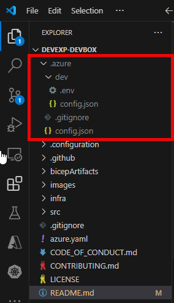
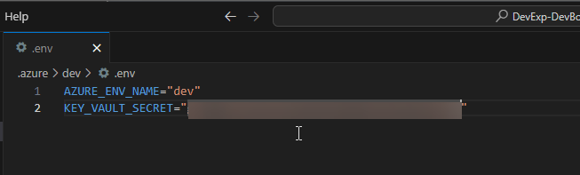
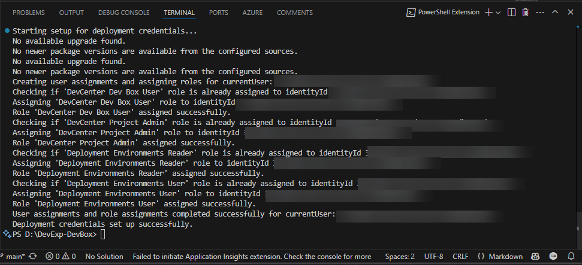
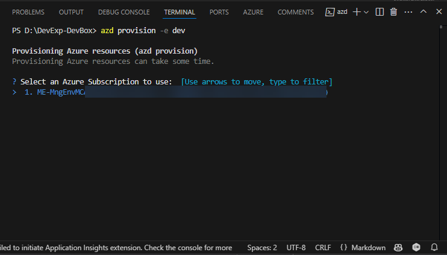
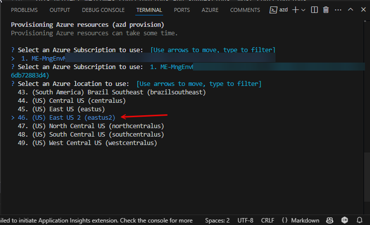
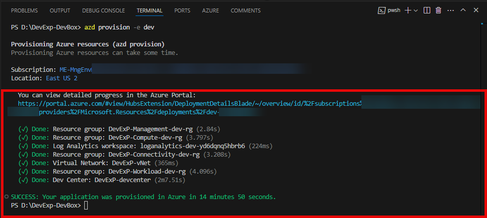
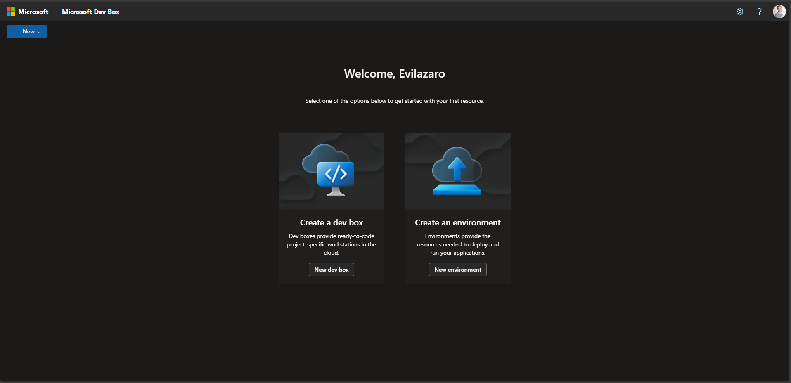

# Deploying Contoso Dev Box Solution to Azure

## Step-by-Step Deployment Guide

### Step 1: Fork the following GitHub Repositories used for Demo
- #### Dev Box Solution: [DevExp-DevBox](https://github.com/evilazaro/devexp-devbox/)
- #### Identity Provider Project: [IdentityProvider](https://github.com/evilazaro/identityprovider/)
- #### eShop Project: [eShop](https://github.com/evilazaro/eshop)

### Step 2: Create your GitHub Access Token
[Managing your personal access tokens - GitHub Docs](https://docs.github.com/en/authentication/keeping-your-account-and-data-secure/managing-your-personal-access-tokens)

### Step 3: Create your local Environment Configuration using azd

Login to Azure using the auth login azd command
```powershell
azd auth login
```
Create your local Environment Configuration using azd
```powershell
azd env new dev
```
Open your file explorer window and check if you have the .azure folder created as the demonstrated in the image below:



### Step 4: Update the .env file of your environment adding the KEY_VAULT_SECRET variable
```file
KEY_VAULT_SECRET="<YOUR GITHUB ACCESS TOKEN>"
```
Your .env file must be like the image below.


### Step 5: Run the setUp.ps1 PowerShell script
```powershell
.\setUp.ps1
```
You should see a similar output as below:


### Step 6: Deploy the solution to Azure with azd
```powershell
azd provision -e dev
```
You must inform the Azure Subscription you want to deploy the soltution.



You must inform the Azure Region you want to deploy the soltution.



### Step 7: Follow the deployment steps until its completed

After the deployment is completed, you must see the azd output as demonstrated in the image below:



### Step 8: Test the solution

Access the https://devbox.microsoft.com Dev Portal and login to Azure with your credentials. You must see the Microsoft Dev Box and Deployment Environments Features as demonstrated int he image below:



# Conclusion
By following these steps, you will have successfully deployed the Contoso Dev Box solution to Azure. Ensure to monitor and manage the Dev Boxes regularly to optimize performance and security.