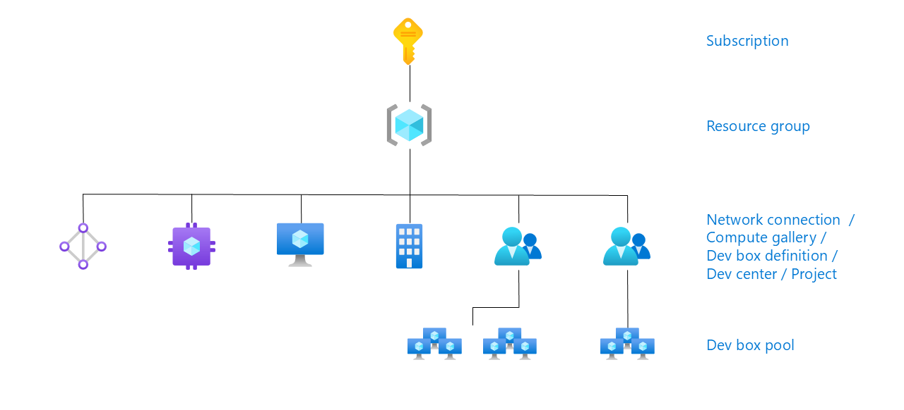

## Pre-Requisites

Before deploying the Microsoft Dev Box solution to your Azure subscription, ensure you have the following prerequisites in place:

1. **Azure Subscription**: An active Azure subscription. If you don't have one, you can create a free account [here](https://learn.microsoft.com/en-us/microsoft-365/enterprise/subscriptions-licenses-accounts-and-tenants-for-microsoft-cloud-offerings?view=o365-worldwide).

2. **Azure CLI**: Install the Azure CLI. You can download and install it from [here](https://learn.microsoft.com/en-us/cli/azure/install-azure-cli).

3. **Azure Developer CLI**: Install the Azure Developer CLI. You can find the installation instructions [here](https://learn.microsoft.com/en-us/azure/developer/azure-developer-cli/install-azd?tabs=winget-windows%2Cbrew-mac%2Cscript-linux&pivots=os-windows).

4. **Bicep**: Install Bicep, a domain-specific language (DSL) for deploying Azure resources. Installation instructions are available [here](https://learn.microsoft.com/en-us/azure/azure-resource-manager/bicep/install).

5. **RBAC Roles**: Ensure you have the following roles assigned in your Azure subscription. For more details click [here](https://learn.microsoft.com/en-us/azure/dev-box/concept-dev-box-role-based-access-control):

6. **Microsoft Entra ID**: Your organization must use Microsoft Entra ID (formerly Azure Active Directory) for identity and access management. More information can be found [here](https://learn.microsoft.com/en-us/azure/dev-box/).

7. **Microsoft Intune**: Your organization must use Microsoft Intune for device management. More details are available [here](https://learn.microsoft.com/en-us/mem/intune/fundamentals/what-is-intune).

8. **User Licenses**: Ensure each user has the necessary licenses:
   - [Windows 11 Enterprise or Windows 10 Enterprise](https://learn.microsoft.com/en-us/azure/dev-box/quickstart-configure-dev-box-service)
   - [Microsoft Intune](https://learn.microsoft.com/en-us/azure/dev-box/quickstart-configure-dev-box-service)
   - [Microsoft Entra ID P1](https://learn.microsoft.com/en-us/azure/dev-box/quickstart-configure-dev-box-service)

   These licenses are included in subscriptions like Microsoft 365 F3, E3, E5, A3, A5, Business Premium, and Education Student Use Benefit. More details can be found [here](https://azure.microsoft.com/en-us/pricing/details/dev-box/).

9. **Register Resource Provider**: Register the `Microsoft.DevCenter` resource provider in your Azure subscription. Instructions can be found [here](https://learn.microsoft.com/en-us/azure/dev-box/).

By ensuring these prerequisites are met, you'll be ready to deploy the Microsoft Dev Box solution to your Azure subscription.
