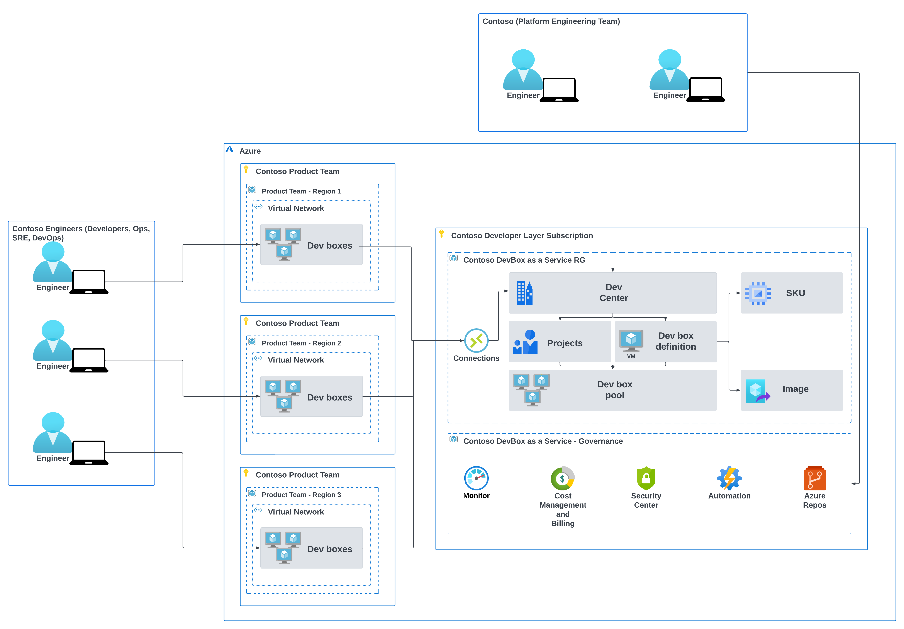

# Contoso Dev Box Solution Architecture

The Contoso Dev Box solution is designed to streamline the Engineer onboarding process for various projects using Microsoft Dev Box. Below is a detailed step-by-step description of the solution architecture, accompanied by the provided Solution Architecture Picture.

# Microsoft Dev Box and Dev Center Main Components

## Introduction
Microsoft Dev Box and Dev Center are essential components of the Microsoft Dev Box Accelerator solution. These components are essential for a well-architected and implemented Dev Box Solution.

## Components Overview

### Dev Center
Dev Center helps manage dev box resources by grouping projects with similar settings. It allows platform engineers and IT admins to provide developer infrastructure and tools to the developer teams ([more details here](https://learn.microsoft.com/en-us/azure/dev-box/how-to-manage-dev-center)).

### Projects
Projects in Dev Center are used to organize and manage development work. Each project can have its own settings, resources, and dev box pools ([more details here](https://learn.microsoft.com/en-us/azure/dev-box/how-to-manage-dev-center)).

### Dev Box Definition
Dev Box Definition specifies the configuration of a dev box, including the tools, source code, and prebuilt binaries required for a project ([more details here](https://learn.microsoft.com/en-us/azure/dev-box/overview-what-is-microsoft-dev-box)).

### Dev Box Pool
Dev Box Pool is a collection of dev boxes that are available for developers to use. Pools can be created and managed by project admins ([more details here](https://learn.microsoft.com/en-us/azure/dev-box/how-to-manage-dev-center)).

### Image Templates
Image Templates are preconfigured images that can be used to create dev boxes. These templates can include tools, source code, and other necessary components ([more details here](https://learn.microsoft.com/en-us/azure/dev-box/)).

### Azure Deployment Environments
Azure Deployment Environments provide the infrastructure and resources needed to deploy and manage dev boxes in the cloud ([more details here](https://learn.microsoft.com/en-us/azure/dev-box/)).

### Network Connections
Network Connections define the network settings and configurations for dev boxes, ensuring secure access to resources ([more details here](https://learn.microsoft.com/en-us/azure/dev-box/how-to-manage-dev-center)).

### Project Catalogs
Project Catalogs contain reusable tasks and scripts that can be used to configure dev boxes for specific projects ([more details here](https://learn.microsoft.com/en-us/azure/dev-box/how-to-manage-dev-center)).

### Dev Center Catalogs
Dev Center Catalogs provide a centralized repository of tasks and scripts that can be used across multiple projects ([more details here](https://learn.microsoft.com/en-us/azure/dev-box/how-to-manage-dev-center)).

### Platform Engineering Team
The Platform Engineering Team is responsible for setting up and managing the developer infrastructure, including dev boxes, network configurations, and security settings ([more details here](https://learn.microsoft.com/en-us/azure/dev-box/how-to-manage-dev-center)).

### Developers Team
The Developers Team consists of developers who use dev boxes to work on projects. They can self-serve dev boxes from the available pools ([more details here](https://learn.microsoft.com/en-us/azure/dev-box/how-to-manage-dev-center)).

### Developer Lead Role
The Developer Lead Role is assigned to experienced developers who assist with creating and managing the developer experience. They can be assigned the DevCenter Project Admin role ([more details here](https://learn.microsoft.com/en-us/azure/dev-box/how-to-manage-dev-center)).

## Conclusion
Microsoft Dev Box and Dev Center provide a comprehensive solution for managing developer environments and streamlining the development process. By leveraging these tools, companies can improve their developer experience and accelerate the implementation of cloud-native solutions.

## References
- [Microsoft Dev Box Documentation](https://learn.microsoft.com/en-us/azure/dev-box/)
- [Microsoft Dev Center Documentation](https://learn.microsoft.com/en-us/azure/dev-box/how-to-manage-dev-center)
- [Microsoft Dev Box Overview](https://learn.microsoft.com/en-us/azure/dev-box/overview-what-is-microsoft-dev-box)

